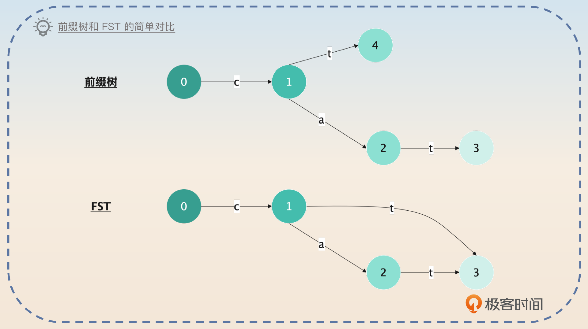
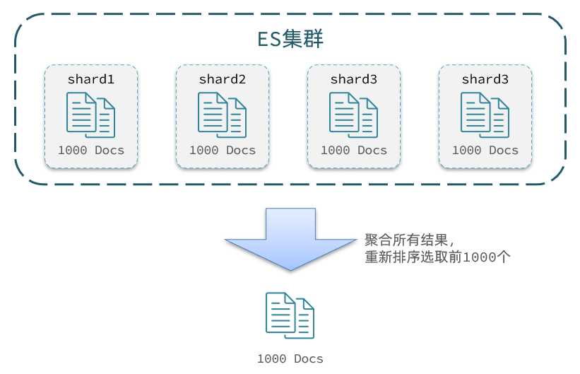
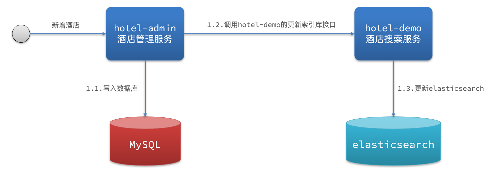
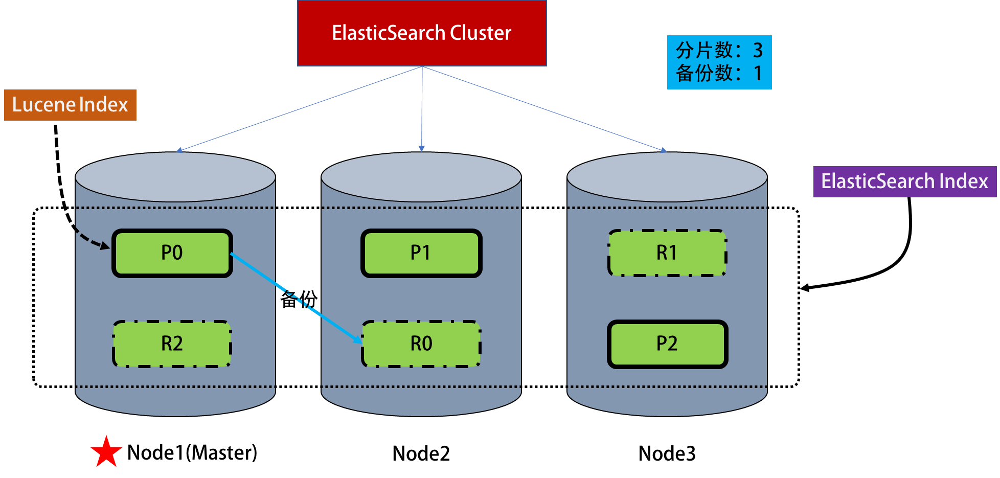
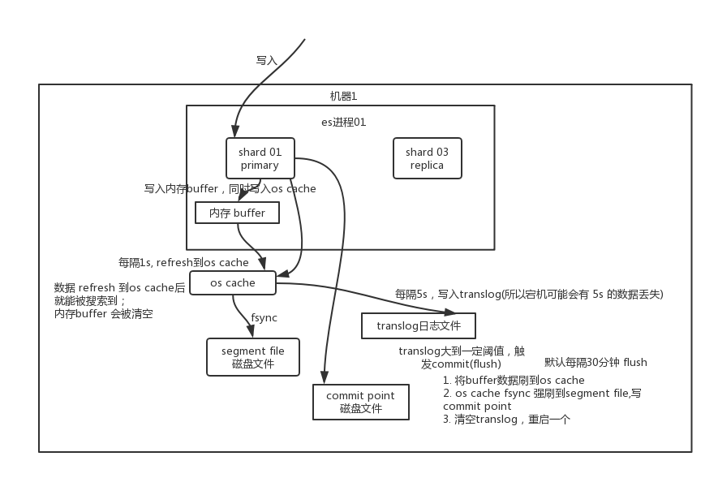

[Elasticsearch | Elastic Docs](https://www.elastic.co/docs/solutions/search)


什么是elasticsearch？

- 一个开源的分布式搜索引擎，可以用来实现搜索、日志统计、分析、系统监控等功能

什么是elastic stack（ELK）？

- 是以elasticsearch为核心的技术栈，包括beats、Logstash、kibana、elasticsearch

什么是Lucene？

- 是Apache的开源搜索引擎类库，提供了搜索引擎的核心API


## 倒排索引

倒排索引中有两个非常重要的概念：

- 文档（`Document`）：用来搜索的数据，其中的每一条数据就是一个文档。例如一个网页、一个商品信息
- 词条（`Term`）：对文档数据或用户搜索数据，利用某种算法分词，得到的具备含义的词语就是词条。例如：我是中国人，就可以分为：我、是、中国人、中国、国人这样的几个词条
- 词典（Term Dictionary）：也叫字典，是词条的组合。搜索引擎的通常索引单位是单词，单词词典是文档集合中出现过的所有单词构成的字符串集合，单词词典内每条索引项记载单词本身的一些信息以及指向倒排索引的指针。


**词典查找的挑战**：全文检索系统通常需要处理大量的文本数据，这会导致词典（Term Dictionary）的规模变得非常庞大。尽管可以通过使用高效的数据结构（如哈希表、B树等）来提高查找速度，但这些数据结构通常需要将数据加载到内存中，以达到最佳的查找性能。然而，将如此庞大的词典加载到内存中，可能会导致极大的内存消耗，甚至可能导致内存不足的情况。

**词项索引（Term Index）的作用**：

* 为了解决内存和查找性能的问题，引入了词项索引（Term Index）。词项索引旨在以更紧凑、更高效的方式查找词典中的词项。通常，词项索引采用Trie树（或前缀树）结构来存储词项的前缀信息，从而加快查找速度。
* Trie树是一种专门用于存储和快速查找字符串（或其他数据类型）的树形数据结构。在Trie树中，从根节点到任意一个节点的路径表示一个相应的字符串。这种结构非常适合存储大量字符串，尤其是在需要快速查找具有相同前缀的字符串时表现出色。
* 然而，传统的Trie树在处理非常大的词典时，可能会消耗大量内存。为了解决这个问题，可以使用压缩版的Trie树，即有限状态转换器（Finite State Transducers，FST）。FST是一种特殊的有限状态机，用于表示字符串之间的映射关系，并且在内存使用方面非常高效。




**创建倒排索引**是对正向索引的一种特殊处理，流程如下：

- 将每一个文档的数据利用算法分词，得到一个个词条
- 创建表，每行数据包括词条、词条所在文档id、位置等信息
- 因为词条唯一性，可以给词条创建索引，例如hash表结构索引

如图：


倒排索引的**搜索流程**如下（以搜索"华为手机"为例）：

1）用户输入条件`"华为手机"`进行搜索。

2）对用户输入内容**分词**，得到词条：`华为`、`手机`。

3）拿着词条在倒排索引中查找，可以得到包含词条的文档id：1、2、3。

4）拿着文档id到正向索引中查找具体文档。

如图：


虽然要先查询倒排索引，再查询倒排索引，但是无论是词条、还是文档id都建立了索引，查询速度非常快！无需全表扫描。


那么为什么一个叫做正向索引，一个叫做倒排索引呢？

- **正向索引**是最传统的，根据id索引的方式。但根据词条查询时，必须先逐条获取每个文档，然后判断文档中是否包含所需要的词条，是**根据文档找词条的过程**。

- 而**倒排索引**则相反，是先找到用户要搜索的词条，根据词条得到保护词条的文档的id，然后根据id获取文档。是**根据词条找文档的过程**。


那么两者方式的优缺点是什么呢？

**正向索引**：

- 优点：
  - 可以给多个字段创建索引
  - 根据索引字段搜索、排序速度非常快
- 缺点：
  - 根据非索引字段，或者索引字段中的部分词条查找时，只能全表扫描。

**倒排索引**：

- 优点：
  - 根据词条搜索、模糊搜索时，速度非常快
- 缺点：
  - 只能给词条创建索引，而不是字段
  - 无法根据字段做排序


## 基础概念

检索质量的评价指标：

* **召回率**是指在一次返回的搜索结果中与搜索关键词相关的文档占所有相关文档的比例。召回率的本质是衡量检索结果的查全率，评价检索系统是否把该召回的文档都召回了。
* **精准率**也叫精确率，可以定义为本次搜索结果中相关文档所占的比例。精准率的本质是衡量检索结果的查准率。当数据规模非常大时，用户更加关注的是排在前面的检索结果是否相关，是否达到搜索预期。所以，相较于召回率，大数据业务场景的用户更关注精准率。


**索引（Index）**，就是相同类型的文档的集合。可以把索引当做是数据库中的表。

数据库的表会有约束信息，用来定义表的结构、字段的名称、类型等信息。因此，索引库中就有**映射（mapping）**，是索引中文档的字段约束信息，类似表的结构约束。


| **MySQL** | **Elasticsearch** | **说明**                                                     |
| --------- | ----------------- | ------------------------------------------------------------ |
| Table     | Index             | 索引(index)，就是文档的集合，类似数据库的表(table)           |
| Row       | Document          | 文档（Document），就是一条条的数据，类似数据库中的行（Row），文档都是JSON格式 |
| Column    | Field             | 字段（Field），就是JSON文档中的字段，类似数据库中的列（Column） |
| Schema    | Mapping           | Mapping（映射）是索引中文档的约束，例如字段类型约束。类似数据库的表结构（Schema） |
| SQL       | DSL               | DSL是elasticsearch提供的JSON风格的请求语句，用来操作elasticsearch，实现CRUD |


**分片**

Elasticsearch 提供了将索引划分成多份的能力，每一份就称之为分片。当你创建一个索引的时候，你可以指定你想要的分片的数量。每个分片本身也是一个功能完善并且独立的“索引”，这个“索引”可以被放置到集群中的任何节点上。

分片很重要，主要有两方面的原因：

* 允许你水平分割 / 扩展你的内容容量。
* 允许你在分片之上进行分布式的、并行的操作，进而提高性能/吞吐量。


**副本**

Elasticsearch 允许你创建分片的一份或多份拷贝，这些拷贝叫做复制分片(副本)。

复制分片之所以重要，有两个主要原因：

- 在分片/节点失败的情况下，**提供了高可用性**。因为这个原因，注意到复制分片从不与原/主要（original/primary）分片置于同一节点上是非常重要的。
- 扩展你的搜索量/吞吐量，因为搜索可以在所有的副本上并行运行。


elasticsearch vs. mysql:

- Mysql：擅长事务类型操作，可以确保数据的安全和一致性

- Elasticsearch：擅长海量数据的搜索、分析、计算


## 索引库操作

### mapping映射属性

mapping是对索引库中文档的约束，常见的mapping属性包括：

- type：字段数据类型，常见的简单类型有：
  - 字符串：text（可分词的文本）、keyword（精确值，例如：品牌、国家、ip地址）
  - 数值：long、integer、short、byte、double、float、
  - 布尔：boolean
  - 日期：date
  - 对象：object
- index：是否创建索引，默认为true
- analyzer：使用哪种分词器
- properties：该字段的子字段


例如下面的json文档：

```json
{
    "age": 21,
    "weight": 52.1,
    "isMarried": false,
    "info": "黑马程序员Java讲师",
    "email": "zy@itcast.cn",
    "score": [99.1, 99.5, 98.9],
    "name": {
        "firstName": "云",
        "lastName": "赵"
    }
}
```

对应的每个字段映射（mapping）：

- age：类型为 integer；参与搜索，因此需要index为true；无需分词器
- weight：类型为float；参与搜索，因此需要index为true；无需分词器
- isMarried：类型为boolean；参与搜索，因此需要index为true；无需分词器
- info：类型为字符串，需要分词，因此是text；参与搜索，因此需要index为true；分词器可以用ik_smart
- email：类型为字符串，但是不需要分词，因此是keyword；不参与搜索，因此需要index为false；无需分词器
- score：虽然是数组，但是我们只看元素的类型，类型为float；参与搜索，因此需要index为true；无需分词器
- name：类型为object，需要定义多个子属性
  - name.firstName；类型为字符串，但是不需要分词，因此是keyword；参与搜索，因此需要index为true；无需分词器
  - name.lastName；类型为字符串，但是不需要分词，因此是keyword；参与搜索，因此需要index为true；无需分词器


### CRUD

#### 创建索引库和映射

基本语法：

- 请求方式：PUT
- 请求路径：/索引库名，可以自定义
- 请求参数：mapping映射

格式：

```json
PUT /索引库名称
{
  "mappings": {
    "properties": {
      "字段名":{
        "type": "text",
        "analyzer": "ik_smart",
        "copy_to": "all"
      },
      "字段名2":{
        "type": "keyword",
        "index": "false"
      },
      "字段名3":{
        "properties": {
          "子字段": {
            "type": "keyword"
          }
        }
      },
      // ...略
      "all":{
        "type": "text",
        "analyzer": "ik_max_word"
      }
    }
  }
}
```

> **all**：一个组合字段，其目的是将多字段的值 利用copy_to合并，提供给用户搜索

#### 查询索引库

基本语法：

- 请求方式：GET

- 请求路径：/索引库名

- 请求参数：无

格式：

```
GET /索引库名
```


#### 修改索引库

倒排索引结构虽然不复杂，但是一旦数据结构改变（比如改变了分词器），就需要重新创建倒排索引，这简直是灾难。因此索引库**一旦创建，无法修改mapping**。


虽然无法修改mapping中已有的字段，但是却允许添加新的字段到mapping中，因为不会对倒排索引产生影响。

语法说明：

```json
PUT /索引库名/_mapping
{
  "properties": {
    "新字段名":{
      "type": "integer"
    }
  }
}
```


#### 删除索引库

语法：

- 请求方式：DELETE

- 请求路径：/索引库名

- 请求参数：无

格式：

```
DELETE /索引库名
```


## 文档操作

### 新增文档

语法：

```json
POST /索引库名/_doc/文档id
{
    "字段1": "值1",
    "字段2": "值2",
    "字段3": {
        "子属性1": "值3",
        "子属性2": "值4"
    },
    // ...
}
```


### 查询文档

根据rest风格，新增是post，查询应该是get，不过查询一般都需要条件，这里我们把文档id带上。

语法：

```json
GET /{索引库名称}/_doc/{id}
```


### 删除文档

删除使用DELETE请求，同样，需要根据id进行删除：

语法：

```js
DELETE /{索引库名}/_doc/id值
```


### 修改文档

修改有两种方式：

- 全量修改：直接覆盖原来的文档
- 增量修改：修改文档中的部分字段


#### 全量修改

全量修改是覆盖原来的文档，其本质是：

- 根据指定的id删除文档
- 新增一个相同id的文档

**注意**：如果根据id删除时，id不存在，第二步的新增也会执行，也就从修改变成了新增操作了。


语法：

```json
PUT /{索引库名}/_doc/文档id
{
    "字段1": "值1",
    "字段2": "值2",
    // ... 略
}

```


#### 增量修改

增量修改是只修改指定id匹配的文档中的部分字段。

语法：

```json
POST /{索引库名}/_update/文档id
{
    "doc": {
         "字段名": "新的值",
    }
}
```


### reindex：迁移文档

reindex的本质是将文档从一个索引复制到另一个索引。

语法：

```
POST _reindex
{
	"conflicts":"proceed" # _reindex将在版本冲突时继续执行。
	"source": {
		"index": "index_02"
	},
	"dest": {
		"index": "index_03"
	}
}
```

此外，还能：

* 源索引设置检索条件
* 基于script脚本的索引迁移
* 基于预处理管道的数据迁移


涉及跨集群数据迁移，必须要提前配置白名单。在elasticsearch.yml配置文件中完成相关配置后，重启才能生效。


## DSL查询

Elasticsearch提供了基于JSON的DSL（[Domain Specific Language](https://www.elastic.co/guide/en/elasticsearch/reference/current/query-dsl.html)）来定义查询。常见的查询类型包括：

- **查询所有**：查询出所有数据，一般测试用。例如：match_all

- **全文检索（full text）查询**：利用分词器对用户输入内容分词，然后去倒排索引库中匹配。例如：
  - match_query
  - multi_match_query
- **精确查询**：根据精确词条值查找数据，一般是查找keyword、数值、日期、boolean等类型字段。例如：
  - ids
  - range
  - term
- **地理（geo）查询**：根据经纬度查询。例如：
  - geo_distance
  - geo_bounding_box
- **复合（compound）查询**：复合查询可以将上述各种查询条件组合起来，合并查询条件。例如：
  - bool
  - function_score


查询的语法基本一致：

```json
GET /indexName/_search
{
  "query": {
    "查询类型": {
      "查询条件": "条件值"
    }
  }
}
```


### 全文检索

全文检索考虑词汇的语义关联，包括词干、同义词等，并通常对文档进行评分，以衡量其与查询关键词的相关程度。此类检索主要应用于非结构化文本数据，如文章和评论等。

在Elasticsearch中，全文检索主要使用match、match_phrase、query_string等查询类型。

* match：match检索适合应用于高召回率和结果精准度要求较低的场景，在追求高精准度的情境中应慎重选用。match检索的**核心**就是将待检索的语句根据设定的分词器分解为独立的词项单元，然后对多个词项单元分别进行term检索，最后对各term检索词项进行bool组合。
* match_phrase：match_phrase检索适用于注重精准度的召回场景。match_phrase检索要求查询的词条顺序和文档中的词条顺序保持一致，以确保更高的精准度。
* multi_match：检索适用于在多个字段上执行match检索的场景。
* query_string：query_string检索允许用户使用Lucene查询语法直接编写复杂的查询表达式。这种查询方式具有高度的灵活性和精确度，支持多字段查询、通配符查询、模糊查询、范围查询等多种检索类型。应用场景包括高级搜索、数据分析和报表等。


**match**：

```json
GET /indexName/_search
{
  "query": {
    "match": {
      "FIELD": "TEXT"
    }
  }
}
```

**mulit_match**：

```json
GET /indexName/_search
{
  "query": {
    "multi_match": {
      "query": "TEXT",
      "fields": ["FIELD1", " FIELD12"]
    }
  }
}
```

> 搜索字段越多，对查询性能影响越大，因此建议采用 **copy_to**，然后单字段查询的方式。


### 精准匹配检索

精确查询一般是查找keyword、数值、日期、boolean等类型字段。所以**不会**对搜索条件分词。常见的有：

- term：单字段精准匹配，需要避免将term检索应用于text类型的检索
- terms：多字段精准匹配
- range：范围检索。range检索支持多种比较操作符，如大于(gt)、大于等于(gte)、小于(lt)和小于等于(lte)等，可以实现灵活的区间查询。
- exists检索：是否存在检索。适用于检查文档中是否存在某个字段，或者该字段是否包含非空值。
- wildcard检索：通配符检索
- prefix检索：前缀匹配检索
- IDs检索
- regexp检索：正则匹配检索


**term**

```json
// term查询
GET /indexName/_search
{
  "query": {
    "term": {
      "FIELD": {
        "value": "VALUE"
      }
    }
  }
}
```


**range**

```json
// range查询
GET /indexName/_search
{
  "query": {
    "range": {
      "FIELD": {
        "gte": 10, // 这里的gte代表大于等于，gt则代表大于
        "lte": 20 // lte代表小于等于，lt则代表小于
      }
    }
  }
}
```


### 组合检索

组合检索可以针对不同字段进行精准匹配和全文检索，并将它们组合在一个查询中。组合检索主要分为两大类：bool组合检索和自定义评分检索。

在Elasticsearch中，组合检索主要使用bool检索来实现多条件查询，包括must（与）、should（或）、must_not（非）等子句。


常见的有两种：

* bool query：布尔查询，利用逻辑关系组合多个其它的查询，实现复杂搜索

- fuction score：算分函数查询，可以控制文档相关性算分，控制文档排名


bool组合检索主要包括以下4种子查询类型：

1. must：查询结果必须满足指定条件。
2. must_not：查询结果必须不满足指定条件。在此情况下，召回的数据评分为0，且不考虑评分。 
3. filter：过滤条件，同样不考虑评分，召回的数据评分为0。使用filter可以借助缓存机制提高查询性能。
4. should：查询结果可以满足的部分条件，具体满足条件的最小数量由minimum_should_match参数控制。


Elasticsearch查询语句中的query和filter具有不同的用途。

1. query用于评估文档相关性，并对结果进行评分，通常用于搜索场景。
2. filter用于筛选文档，不会对文档评分，通常用于过滤场景。

因此，在性能优化方面，filter比query更有效，因为它不需要进行评分，并且可以被缓存。


**相关性算分**

当我们利用match查询时，文档结果会根据与搜索词条的关联度打分（_score），返回结果时按照分值降序排列。

例如，我们搜索 "虹桥如家"，结果如下：

```json
[
  {
    "_score" : 17.850193,
    "_source" : {
      "name" : "虹桥如家酒店真不错",
    }
  },
  {
    "_score" : 12.259849,
    "_source" : {
      "name" : "外滩如家酒店真不错",
    }
  },
  {
    "_score" : 11.91091,
    "_source" : {
      "name" : "迪士尼如家酒店真不错",
    }
  }
]
```


在elasticsearch中，早期使用的打分算法是TF-IDF算法，公式如下：


在后来的5.1版本升级中，elasticsearch将算法改进为BM25算法，公式如下：


TF-IDF算法有一各缺陷，就是词条频率越高，文档得分也会越高，单个词条对文档影响较大。而BM25则会让单个词条的算分有一个上限，曲线更加平滑


小结：elasticsearch会根据词条和文档的相关度做打分，算法由两种：

- TF-IDF算法
- BM25算法，elasticsearch5.1版本后采用的算法


**算分函数查询**

根据相关度打分是比较合理的需求，但**合理的不一定是产品经理需要**的。

要想认为控制相关性算分，就需要利用elasticsearch中的function score 查询了。


语法说明:


function score 查询中包含四部分内容：

- **原始查询**条件：query部分，基于这个条件搜索文档，并且基于BM25算法给文档打分，**原始算分**（query score)
- **过滤条件**：filter部分，符合该条件的文档才会重新算分
- **算分函数**：符合filter条件的文档要根据这个函数做运算，得到的**函数算分**（function score），有四种函数
  - weight：函数结果是常量
  - field_value_factor：以文档中的某个字段值作为函数结果
  - random_score：以随机数作为函数结果
  - script_score：自定义算分函数算法
- **运算模式**：算分函数的结果、原始查询的相关性算分，两者之间的运算方式，包括：
  - multiply：相乘
  - replace：用function score替换query score
  - 其它，例如：sum、avg、max、min


function score的运行流程如下：

- 1）根据**原始条件**查询搜索文档，并且计算相关性算分，称为**原始算分**（query score）
- 2）根据**过滤条件**，过滤文档
- 3）符合**过滤条件**的文档，基于**算分函数**运算，得到**函数算分**（function score）
- 4）将**原始算分**（query score）和**函数算分**（function score）基于**运算模式**做运算，得到最终结果，作为相关性算分。


因此，其中的关键点是：

- 过滤条件：决定哪些文档的算分被修改
- 算分函数：决定函数算分的算法
- 运算模式：决定最终算分结果


### 地理坐标查询

所谓的地理坐标查询，其实就是根据经纬度查询，官方文档：https://www.elastic.co/guide/en/elasticsearch/reference/current/geo-queries.html

常见的使用场景包括：

- 携程：搜索我附近的酒店
- 滴滴：搜索我附近的出租车
- 微信：搜索我附近的人


**矩形范围查询**

矩形范围查询，也就是geo_bounding_box查询，查询坐标落在某个矩形范围的所有文档：

查询时，需要指定矩形的**左上**、**右下**两个点的坐标，然后画出一个矩形，落在该矩形内的都是符合条件的点。

语法如下：

```json
// geo_bounding_box查询
GET /indexName/_search
{
  "query": {
    "geo_bounding_box": {
      "FIELD": {
        "top_left": { // 左上点
          "lat": 31.1,
          "lon": 121.5
        },
        "bottom_right": { // 右下点
          "lat": 30.9,
          "lon": 121.7
        }
      }
    }
  }
}
```


**附近查询**

附近查询，也叫做距离查询（geo_distance）：查询到指定中心点小于某个距离值的所有文档。

换句话来说，在地图上找一个点作为圆心，以指定距离为半径，画一个圆，落在圆内的坐标都算符合条件：

语法说明：

```json
// geo_distance 查询
GET /indexName/_search
{
  "query": {
    "geo_distance": {
      "distance": "15km", // 半径
      "FIELD": "31.21,121.5" // 圆心
    }
  }
}
```


## 搜索结果处理

### 排序

elasticsearch默认是根据相关度算分（_score）来排序，但是也支持自定义方式对搜索[结果排序](https://www.elastic.co/guide/en/elasticsearch/reference/current/sort-search-results.html)。可以排序字段类型有：keyword类型、数值类型、地理坐标类型、日期类型等。

**普通字段排序**

keyword、数值、日期类型排序的语法基本一致。

语法：

```json
GET /indexName/_search
{
  "query": {
    "match_all": {}
  },
  "sort": [
    {
      "FIELD": "desc"  // 排序字段、排序方式ASC、DESC
    }
  ]
}
```

排序条件是一个数组，也就是可以写多个排序条件。按照声明的顺序，当第一个条件相等时，再按照第二个条件排序，以此类推


**地理坐标排序**

地理坐标排序略有不同。

语法：

```json
GET /indexName/_search
{
  "query": {
    "match_all": {}
  },
  "sort": [
    {
      "_geo_distance" : {
          "FIELD" : "纬度，经度", // 文档中geo_point类型的字段名、目标坐标点
          "order" : "asc", // 排序方式
          "unit" : "km" // 排序的距离单位
      }
    }
  ]
}
```

这个查询的含义是：

- 指定一个坐标，作为目标点
- 计算每一个文档中，指定字段（必须是geo_point类型）的坐标 到目标点的距离是多少
- 根据距离排序


### 分页

elasticsearch 默认情况下只返回top10的数据。而如果要查询更多数据就需要修改分页参数了。elasticsearch中通过修改from、size参数来控制要返回的分页结果：

- from：从第几个文档开始
- size：总共查询几个文档

类似于mysql中的`limit ?, ?`

**基本的分页**:

分页的基本语法如下：

```json
GET /hotel/_search
{
  "query": {
    "match_all": {}
  },
  "from": 0, // 分页开始的位置，默认为0
  "size": 10, // 期望获取的文档总数
  "sort": [
    {"price": "asc"}
  ]
}
```


**深度分页问题**

现在，我要查询990~1000的数据，查询逻辑要这么写：

```json
GET /hotel/_search
{
  "query": {
    "match_all": {}
  },
  "from": 990, // 分页开始的位置，默认为0
  "size": 10, // 期望获取的文档总数
  "sort": [
    {"price": "asc"}
  ]
}
```

这里是查询990开始的数据，也就是 第990~第1000条 数据。

不过，elasticsearch内部分页时，必须先查询 0~1000条，然后截取其中的990 ~ 1000的这10条。


查询TOP1000，如果es是单点模式，这并无太大影响。

但是elasticsearch将来一定是集群，例如我集群有5个节点，我要查询TOP1000的数据，并不是每个节点查询200条就可以了。

因为节点A的TOP200，在另一个节点可能排到10000名以外了。

因此要想获取整个集群的TOP1000，必须先查询出每个节点的TOP1000，汇总结果后，重新排名，重新截取TOP1000。



当查询分页深度较大时，汇总数据过多，对内存和CPU会产生非常大的压力，因此elasticsearch会禁止from+ size 超过10000的请求。


针对深度分页，ES提供了两种解决方案，[官方文档](https://www.elastic.co/guide/en/elasticsearch/reference/current/paginate-search-results.html)：

- search after：基本工作原理是以前一页结果的排序值作为参照点，进而检索与这个参照点相邻的下一页的匹配数据。官方推荐使用的方式。
- scroll：原理将排序后的文档id形成快照，保存在内存。官方已经不推荐使用。


分页查询的常见实现方案以及优缺点：

- `from + size`：
  - 优点：支持随机翻页
  - 缺点：深度分页问题，默认查询上限（from + size）是10000
  - 场景：百度、京东、谷歌、淘宝这样的随机翻页搜索
- `after search`：
  - 优点：没有查询上限（单次查询的size不超过10000）
  - 缺点：只能向后逐页查询，不支持随机翻页
  - 场景：没有随机翻页需求的搜索，例如手机向下滚动翻页

- `scroll`：
  - 优点：没有查询上限（单次查询的size不超过10000）
  - 缺点：会有额外内存消耗，并且搜索结果是非实时的
  - 场景：海量数据的获取和迁移。从ES7.1开始不推荐，建议用 after search方案。


### 高亮

**高亮原理**

高亮显示的实现分为两步：

- 1）给文档中的所有关键字都添加一个标签，例如`<em>`标签
- 2）页面给`<em>`标签编写CSS样式


**实现高亮**

高亮的语法：

```json
GET /hotel/_search
{
  "query": {
    "match": {
      "FIELD": "TEXT" // 查询条件，高亮一定要使用全文检索查询
    }
  },
  "highlight": {
    "fields": { // 指定要高亮的字段
      "FIELD": {
        "pre_tags": "<em>",  // 用来标记高亮字段的前置标签
        "post_tags": "</em>" // 用来标记高亮字段的后置标签
      }
    }
  }
}
```


**注意：**

- 高亮是对关键字高亮，因此**搜索条件必须带有关键字**，而不能是范围这样的查询。
- 默认情况下，**高亮的字段，必须与搜索指定的字段一致**，否则无法高亮
- 如果要对非搜索字段高亮，则需要添加一个属性：required_field_match=false


## 数据聚合

**[聚合（](https://www.elastic.co/guide/en/elasticsearch/reference/current/search-aggregations.html)[aggregations](https://www.elastic.co/guide/en/elasticsearch/reference/current/search-aggregations.html)[）](https://www.elastic.co/guide/en/elasticsearch/reference/current/search-aggregations.html)**可以让我们极其方便的实现对数据的统计、分析、运算。

实现这些统计功能的比数据库的sql要方便的多，而且查询速度非常快，可以实现近实时搜索效果。


聚合常见的有三类：

- **桶（Bucket）**聚合：用来对文档做分组
  - TermAggregation：按照文档字段值分组，例如按照品牌值分组、按照国家分组
  - Date Histogram：按照日期阶梯分组，例如一周为一组，或者一月为一组

- **度量（Metric）**聚合：用以计算一些值，比如：最大值、最小值、平均值等
  - Avg：求平均值
  - Max：求最大值
  - Min：求最小值
  - Stats：同时求max、min、avg、sum等
- **管道（pipeline）**聚合：其它聚合的结果为基础做聚合


> **注意：**参加聚合的字段必须是keyword、日期、数值、布尔类型


### Bucket聚合语法

语法如下：

```json
GET /hotel/_search
{
  "size": 0,  // 设置size为0，结果中不包含文档，只包含聚合结果
  "aggs": { // 定义聚合
    "brandAgg": { //给聚合起个名字
      "terms": { // 聚合的类型，按照品牌值聚合，所以选择term
        "field": "brand", // 参与聚合的字段
        "size": 20 // 希望获取的聚合结果数量
      }
    }
  }
}
```


**聚合结果排序**：

默认情况下，Bucket聚合会统计Bucket内的文档数量，记为_count，并且按照_count降序排序。

我们可以指定order属性，自定义聚合的排序方式：

```json
GET /hotel/_search
{
  "size": 0, 
  "aggs": {
    "brandAgg": {
      "terms": {
        "field": "brand",
        "order": {
          "_count": "asc" // 按照_count升序排列
        },
        "size": 20
      }
    }
  }
}
```


### 限定聚合范围

默认情况下，Bucket聚合是对索引库的所有文档做聚合，但真实场景下，用户会输入搜索条件，因此聚合必须是对搜索结果聚合。那么聚合必须添加限定条件。

我们可以限定要聚合的文档范围，只要添加query条件即可：

```json
GET /hotel/_search
{
  "query": {
    "range": {
      "price": {
        "lte": 200 // 只对200元以下的文档聚合
      }
    }
  }, 
  "size": 0, 
  "aggs": {
    "brandAgg": {
      "terms": {
        "field": "brand",
        "size": 20
      }
    }
  }
}
```


### Metric聚合语法

Metric聚合，例如stat聚合：就可以获取min、max、avg等结果。

语法如下：

```json
GET /hotel/_search
{
  "size": 0, 
  "aggs": {
    "brandAgg": { 
      "terms": { 
        "field": "brand", 
        "size": 20
      },
      "aggs": { // 是brands聚合的子聚合，也就是分组后对每组分别计算
        "score_stats": { // 聚合名称
          "stats": { // 聚合类型，这里stats可以计算min、max、avg等
            "field": "score" // 聚合字段，这里是score
          }
        }
      }
    }
  }
}
```


aggs代表聚合，与query同级，此时query的作用是？

- 限定聚合的的文档范围

聚合必须的三要素：

- 聚合名称
- 聚合类型
- 聚合字段

聚合可配置属性有：

- size：指定聚合结果数量
- order：指定聚合结果排序方式
- field：指定聚合字段


## 分词

分词器的作用是什么？

- 创建倒排索引时对文档分词
- 用户搜索时，对输入的内容分词


分词器由如下三部分组成：

* 字符过滤(character filter)：字符过滤器将原始文本作为字符流接收，并通过添加、删除或更改字符来转换字符流。
* 文本切分为分词（tokenizer）：负责初步进行文本分词。在接收字符流后，系统将对其进行分词，并记录分词后的顺序或位置(position)、起始值(start_offset)以及偏移量(end_offset-start_offset)。
* 分词后再过滤（token filter）：在对tokenizer处理后的字符流进行进一步处理时，例如进行转换为小写、删除（去除停用词）和新增（添加同义词）等操作。


常见的分词器：

| 分词器      | 优势                     | 局限性             | 适用场景         |
| ----------- | ------------------------ | ------------------ | ---------------- |
| standard    | 内置支持，多语言基础处理 | 中文支持差         | 英文日志分析     |
| ik_max_word | 细粒度中文分词           | 需维护词典         | 电商、内容搜索   |
| pinyin      | 支持拼音搜索             | 需配合主分词器     | 跨语言搜索       |
| ngram       | 模糊匹配能力强           | 索引膨胀风险       | 地址、验证码搜索 |
| pattern     | 高度可配置               | 正则复杂度影响性能 | 结构化日志处理   |

错误选择带来的灾难：

* 搜索词"变形记"
* 索引膨胀
* 相关性评分错乱


IK分词器有几种模式？

- ik_smart：智能切分，粗粒度
- ik_max_word：最细切分，细粒度


IK分词器如何拓展词条？如何停用词条？

- 利用config目录的IkAnalyzer.cfg.xml文件添加拓展词典和停用词典
- 在词典中添加拓展词条或者停用词条


## 数据同步

elasticsearch与mysql之间的**数据同步**。

常见的数据同步方案有三种：

- 同步调用
- 异步通知
- 监听binlog


方案一：同步调用



基本步骤如下：

- hotel-demo对外提供接口，用来修改elasticsearch中的数据
- 酒店管理服务在完成数据库操作后，直接调用hotel-demo提供的接口，


方案二：异步通知


流程如下：

- hotel-admin对mysql数据库数据完成增、删、改后，发送MQ消息
- hotel-demo监听MQ，接收到消息后完成elasticsearch数据修改


方案三：监听binlog


流程如下：

- 给mysql开启binlog功能
- mysql完成增、删、改操作都会记录在binlog中
- hotel-demo基于canal监听binlog变化，实时更新elasticsearch中的内容


方式一：同步调用

- 优点：实现简单，粗暴
- 缺点：业务耦合度高

方式二：异步通知

- 优点：低耦合，实现难度一般
- 缺点：依赖mq的可靠性

方式三：监听binlog

- 优点：完全解除服务间耦合
- 缺点：开启binlog增加数据库负担、实现复杂度高


## 集群

单机的elasticsearch做数据存储，必然面临两个问题：单台机器存储容量有限、单点故障问题、单服务的并发处理能力有限。

- 海量数据存储问题：将索引库从逻辑上拆分为N个分片（shard），存储到多个节点
- 单点故障问题：将分片数据在不同节点备份（replica ）

**ES集群相关概念**:

* 集群（cluster）：一组拥有共同的 cluster name 的 节点。

* 节点（node)   ：集群中的一个 Elasticearch 实例

* 分片（shard）：索引可以被拆分为不同的部分进行存储，称为分片。在集群环境下，一个索引的不同分片可以拆分到不同的节点中

  解决问题：数据量太大，单点存储量有限的问题。

* 主分片（Primary shard）：相对于副本分片的定义。

* 副本分片（Replica shard）每个主分片可以有一个或者多个副本，数据和主分片一样。


数据备份可以保证高可用，但是每个分片备份一份，所需要的节点数量就会翻一倍，成本实在是太高了！

为了在高可用和成本间寻求平衡，我们可以这样做：

- 首先对数据分片，存储到不同节点
- 然后对每个分片进行备份，放到对方节点，完成互相备份

这样可以大大减少所需要的服务节点数量，如图，我们以3分片，每个分片备份一份为例：




elasticsearch中集群节点有不同的职责划分：

**主节点**：

负责管理集群范围内的所有变更，例如增加、 删除索引，或者增加、删除节点等。 而主节点并不需要涉及到文档级别的变更和搜索等操作，所以当集群只拥有一个主节点的情况下，即使流量的增加它也不会成为瓶颈。

主节点又被细分为专用候选主节点和仅投票主节点。


**数据节点**:

负责存储、检索和处理数据，提供搜索和聚合功能。

数据节点又可以细分内容数据节点、热数据节点、温数据节点、冷数据节点、冷冻数据节点。


**协调节点**：

协调节点负责协调请求的处理过程。一个查询请求会被发送到协调节点上，协调节点确定数据节点，然后让数据节点执行查询，最后协调节点合并数据节点返回的结果集。大多数节点都会兼任这个角色。


**ingest节点**：

即预处理节点，负责数据预处理，如过滤、转换等，准备好数据再将其索引到数据节点。


**Elasticsearch 的 master 选举流程？**

* Elasticsearch的选主是ZenDiscovery模块负责的，主要包含Ping（节点之间通过这个RPC来发现彼此） 和Unicast（单播模块包含一个主机列表以控制哪些节点需要ping通）这两部分。
* 对所有可以成为master的节点（node master: true）根据nodeId字典排序，每次选举每个节点都把自己所知道节点排一次序，然后选出第一个（第0位）节点，暂且认为它是master节点。
* 如果对某个节点的投票数达到一定的值（可以成为master节点数n/2+1）并且该节点自己也选举自己， 那这个节点就是master。否则重新选举一直到满足上述条件。
* master节点的职责主要包括集群、节点和索引的管理，不负责文档级别的管理；data节点可以关闭http 功能。


**脑裂问题**

脑裂是因为集群中的主节点失联导致重新选主，当网络恢复后，集群中有两个master节点，集群状态的不一致。

解决脑裂的方案是，要求选票超过 ( eligible节点数量 + 1 ）/ 2 才能当选为主，因此eligible节点数量最好是奇数。对应配置项是discovery.zen.minimum_master_nodes，在es7.0以后，已经成为默认配置，因此一般不会发生脑裂问题。


**分片存储**

当新增文档时，应该保存到不同分片，保证数据均衡，那么coordinating node如何确定数据该存储到哪个分片呢？

elasticsearch会通过hash算法来计算文档应该存储到哪个分片


说明：

- _routing默认是文档的id
- 算法与分片数量有关，因此索引库一旦创建，**分片数量不能修改**！


> **为什么堆内存不能超过物理机内存的一半？**

堆对Elasticsearch来说绝对重要，它用于许多内存数据结构的快速操作。但还有另外一个非常重要的内存使用者——Lucene。

Lucene旨在利用底层操作系统来缓存内存中的数据结构。Lucene段存储在单个文件中。因为段一旦形成就不会改变，所以它们非常容易进行缓存，并且，底层操作系统会将热段保留在内存中以便更快地进行访问。这些段包括倒排索引（用于全文搜索）和正排索引（用于聚合）。

Lucene的性能依赖于与操作系统的这种交互。如果把所有可用的内存都给Elasticsearch堆，那么Lucene就不会有任何剩余的内存，这会严重影响其性能。针对内存的分配，通常的建议是将可用内存的一半分配给Elasticsearch堆，而保留剩下的一半。这种操作的核心在于平衡Elasticsearch堆和Lucene。剩余的内存看起来空闲，但其实并非如此，因为Lucene会利用这些“空闲”内存来提高搜索和索引的性能。这种内存分配策略确保了Elasticsearch与Lucene之间的高效协作，进而能够提升整体系统性能。

如果实际业务不需要在字符串字段上做聚合操作（开启text类型的fielddata），则可以考虑进一步降低堆大小。堆较小，就可以从Elasticsearch（更快的GC）和Lucene（更多内存缓存）中获得更好的性能。


## 内部数据结构

**倒排索引**

特点：全文搜索速度非常快；不适合做排序


**正排索引**

在Elasticsearch中，正排索引(doc_values)就是一种列式存储结构，默认情况下每个字段的doc_values都是激活的（除了text类型）。

特点：适合排序、聚合操作；将单个字段的所有值一起存储在单个数据列中；默认情况下，除text之外的所有字段类型均启用正排索引。


**fielddata**

对于text类型字段，不支持正排索引。当text字段被用于聚合、排序或脚本操作时，fielddata会按需构建相应的数据结构。

fielddata是通过从磁盘读取每个字段的完整倒排索引，反转词项与文档之间的关系，并将结果存储在JVM堆的内存中构建的。这使得在进行聚合、排序和脚本操作时，系统能够高效地获取和处理相关字段的数据。

特点：仅适用于text字段类型；是基于内存的数据结构，没有序列化到磁盘

除非业务特殊需要，否则启用fielddata通常没有任何意义，因为它非常耗费内存资源。


**_source字段**

_source字段包含索引时传递的原始JSON文档主体。_source字段本身未构建索引（因此不可搜索），但已存储该字段，以便在执行获取请求（如GET或search请求）时可以将其返回。


**store字段**

存储指定字段的JSON数据


## 核心工作原理

### 稳定版本的应用原理

Elasticsearch使用文档**版本来控制文档的并发更新，并用于解决冲突**。它使用内部版本和外部版本来保证数据的一致性、可靠性。

当我们在Elasticsearch中创建一个新文档时，它会为该文档分配一个_version:1。当我们后续对该文档进行任何操作（如更新、索引或删除）时，_version都会增加1。

如何解决或避免Elasticsearch文档版本冲突？

1. **利用external对版本号进行外部控制**。在external模式下，Elasticsearch相当于将版本控制的责任委托给了外部数据库或其他第三方库，它们负责生成和管理文档的版本号。当使用external版本类型时，Elasticsearch在处理索引请求时会对比传入文档的版本号和已存储文档的版本号。如果传入的版本号大于已存储的，就表明这是一个新版本的文档，Elasticsearch则会执行索引操作并更新文档的版本号。
2. **利用if_seq_no和if_primary_term作为唯一标识来避免版本冲突**。Elasticsearch会检查传入的if_seq_no和if_primary_term是否与最后一次修改文档的序列号(seq no)和主要项(primary term)匹配。
3. **批量更新和批量删除中通过proceed忽略冲突**。


### 文档更新/删除的原理

**文档删除**

文档删除本质上是**逻辑删除**而非物理删除。

在执行文档删除操作后，待删除文档不会立即将文档从磁盘中删除，而是将文档标记为“已删除”状态（版本号_version加1，result标记为deleted）。随着索引的数据越来越多，Elasticsearch将会在后台清理这些标记为“已删除”的文档。

但如果想要从磁盘上删除这些文档，则需要借助段合并来实现。


**索引删除**

不同于文档删除，索引删除意味着删除其分片、映射和数据。并且，相比于文档删除，索引删除会更直接、快速、暴力。删除索引后，与索引有关的所有数据将从直接从磁盘中删除。

索引删除本质上是物理删除。

索引删除包含两个步骤：更新集群；将分片从磁盘删除。


**文档更新**

更新文档本质上是“delete+add”操作。具体来说，表面上是更新，实际上是Elasticsearch将旧文档标记为“已删除”，并增加一个全新的文档。

同文档删除一样，文档更新后旧文档不能被访问，但旧文档不会立即被物理删除，除非手动或者定时执行了段合并操作。


### Elasticsearch写入的原理

**分段**

分段是Elasticsearch中的一个重要概念，其核心目的是更高效地执行搜索和更新操作。段是由一些倒排索引和一些元数据组成的。分段是将索引分成多个小段的过程，每个分段包含一部分索引数据。

Elasticsearch中的段是不可变的，即段一旦被创建，就不能被修改。与之相反，任何对索引的更改都会生成新的段。


**事务日志文件**

为了防止Elasticsearch集群宕机造成数据丢失，为了保证可靠存储，一个文档被索引之后，Elasticsearch就会将其添加到内存缓冲区，并且同时写入事务日志文件(translog)中。

translog的作用是保证数据的可靠性和一致性。当Elasticsearch节点出现故障或崩溃时，translog可以用来恢复数据。在节点重新启动后，Elasticsearch会重新读取translog中的所有操作并将其应用到Lucene索引中，从而使数据保持一致。


#### 写入的实现流程

1. 协调节点：任何节点都可以接收请求，此时它就是 **协调节点**。协调节点根据 **文档的 `_id` 哈希值** 计算路由，决定要写入哪个 **主分片（Primary Shard）**。找到目标主分片所在的节点，并将请求转发过去。
2. 主分片写入：文档先写入内存 buffer，并追加到 **translog（事务日志）**。
3. 副本分片写入：主分片写成功后，会并行转发给 **所有副本分片**。




#### refresh

将文档插入Elasticsearch时，文档会被写入内存缓冲区中，然后通过refresh（刷新）操作**定期从该缓冲区刷新到内存段中**。刷新频率由refresh_interval参数控制，默认1s刷新一次，所以说Elasticsearch是**近实时**的搜索引擎，而不是准实时。

refresh操作在**本质上是将写入数据由内存缓冲区写入内存段中，以保证搜索可见。**

> **并非持久化**：Refresh只是让数据变得**可搜索**，但并没有保证数据已经**安全持久化到磁盘**。数据在Refresh后位于文件系统缓存中，如果此时服务器断电，这部分数据仍然会丢失。
>
> **持久化由Flush负责**：保证数据安全落地到磁盘，是另一个叫 **Flush** 的机制负责的，它依赖事务日志（Translog）并且默认30分钟执行一次或在Translog达到一定大小时触发。


#### flush

新的数据不断进入 buffer 和 translog，不断将 `buffer` 数据写入一个又一个新的 `segment file` 中去，每次 `refresh` 完 buffer 清空，translog 保留。随着这个过程推进，translog 会变得越来越大。当 translog 达到一定长度的时候，就会触发 `flush` 操作。

每隔30分钟（或Translog太大时），仓库启动归档操作：把文件缓存里的所有段（Segments）全部持久化到磁盘，然后清空 translog。


refresh操作使得写入文档搜索可见；flush操作将文件系统缓存(filesystem cache)写入磁盘，以达到持久化的目的。


#### merge

自动刷新流程每秒会创建一个新的段（由动态配置参数refresh_interval决定），导致短时间内段数量暴增。而段数目太多会带来众多问题，包含但不限于如下几点。

* 资源消耗：每一个段都会消耗文件句柄、内存和CPU运行周期。段合并的时候会将那些旧的已删除文档从文件系统中清除。
* 搜索变慢：每个搜索请求都必须轮流检查每个段，所以段越多，搜索也就越慢。

Elasticsearch通过在后台进行段合并来解决上述问题。小段被合并到大段，这些大段再被合并到更大的段。

段合并的时候会将那些旧的已删除文档从文件系统中清除。被删除的文档（或被更新文档的旧版本）不会被拷贝到新的大段中。

### Elasticsearch检索的原理

1. 客户端发起请求。
2. 协调节点接收请求，任意节点都可以当 **协调节点**。协调节点会把查询请求广播到所有涉及的 **分片**。
3. 在数据节点中执行查询操作，以收集精准匹配结果或者满足条件的结果。
4. 在协调节点做结果整合，并计算相关性评分。


## Elasticsearch性能优化

1. 尽可能减少检索字段数目
2. 合理设置size值
3. 尽量使用keyword字段类型
4. 有效使用filter缓存
5. 预热文件系统缓存

### 写入优化

1、写入时先将副本分片数置为0，完成写入后再将其复原

2、优先使用系统自动生成ID的方式。文档ID的生成有两种方式：系统自动生成ID和外部控制自增ID。不过，如果使用外部控制自增ID，Elasticsearch会先尝试读取原来文档的版本号，以判断是否需要更新。

3、合理调整刷新频率 refresh

4、合理调整堆内存中的索引缓冲区大小。缓冲区越大，意味着能缓存的数据量越大，相同时间内，写入磁盘的频次低、磁盘IO小，间接提升了写入性能。

5、给堆外的内存留够空间。堆内存之外的内存留给Lucene使用。

6、批量写入。批量写入意味着相同时间产生的段会大，段的总个数自然会少。

7、多线程写入

8、设置合理的映射。不推荐使用默认的动态映射，一定要手动设置映射，优化不必要字段

9、合理使用分词器


### 查询优化

全量数据、大文档优化：

1、不要返回全量或近全量数据

2、避免使用大文档。不一定要将整本书作为一个文档，更好的做法是将每一章/节甚至每一段作为一个文档，然后在这些文档中添加一个属性，标识它们属于哪一本书的哪一章/节。


数据建模层面优化：

1、文档结构务必规范、一致

2、设置合理的分片数和副本数。一般建议设置为数据节点的1～3倍。对于一般的非高可用场景，一个副本基本足够。

3、多使用写入前预处理操作。

4、合理使用边写入边排序机制。排序操作并不在数据写入后进行，而是预先定义好，即在索引创建时设置。这个过程的主要目标是通过牺牲一些写入性能来显著提升检索速度。


检索方法层面优化：

1、尽可能减少检索字段数目。提高多个字段搜索速度的常用技术是在索引时将它们的值借助copy_to参数复制到单个字段中，然后在搜索时使用该字段。

2、设置合理的size值。如果数据量确实很大，则可以考虑通过scroll或者search_after方式来实现**分页查询优化**。

3、尽量使用keyword字段类型。如果涉及范围检索，我们强烈推荐使用数值类型的字段。这是因为数值类型，包括整型、长整型等，为范围检索提供了更高效的支持。如果仅需精准匹配term级别的检索，那么keyword类型就能搞定。

4、有效使用filter缓存。filter缓存是指在执行过滤操作时，将结果缓存到内存中，以便在后续的查询中能够快速访问。这样可以避免对同一个过滤器进行重复计算，从而提高查询性能。

5、对历史索引数据不定期进行段合并

6、预热文件系统缓存

7、通过perference优化缓存利用率。

8、避免使用通配符检索、正则匹配检索。使用正则表达式进行检索时，将扫描整个文档集合，无法使用索引加快搜索。


## Elasticsearch缓存

往 es 里写的数据，实际上都写到磁盘文件里去了，**查询的时候**，操作系统会将磁盘文件里的数据自动缓存到 `filesystem cache` 里面去。

根据我们自己的生产环境实践经验，最佳的情况下，是仅仅在 es 中就存少量的数据，就是你要**用来搜索的那些索引**，如果内存留给 `filesystem cache` 的是 100G，那么你就将索引数据控制在 `100G` 以内，这样的话，你的数据几乎全部走内存来搜索，性能非常之高，一般可以在 1 秒以内。


**节点查询缓存(node query cache)**

在节点查询缓存中，每个节点都有一个所有分片共享的查询缓存。缓存使用**LRU**策略，即当缓存已满时，优先清理最近使用最少的查询结果。用户无法查看节点查询缓存的内容。

应用场景和缓存条件：

* 节点查询缓存适用于term检索和filter检索。
* 默认情况下节点查询缓存最多可容纳10000个查询语句，最多占总堆空间的10%。
* 对于一个分片内的特定段，只有当该段至少含有10000个文档且段中的文档数量超过了该分片总文档数的3%时，它才会被纳入缓存中。
* 缓存策略是基于段的，因此当段进行合并操作时，可能会导致相关的缓存查询结果失效。


**分片请求缓存(shard request cache)**

分片请求缓存会在每个分片上缓存本地结果，这使得频繁使用的搜索请求几乎能立即返回结果。

分片请求缓存非常适合用于日志用例场景。


**字段缓存**

字段缓存包含field data和global ordinals，它们均用于支持某些字段类型上的聚合。
