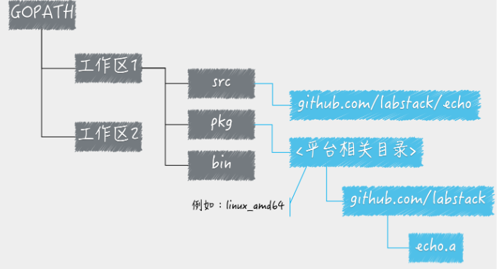
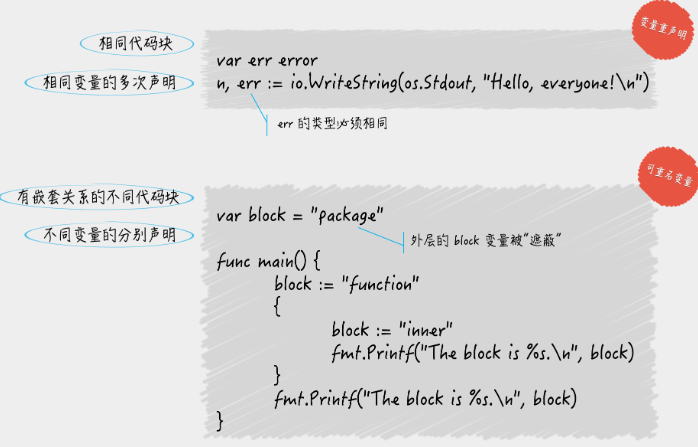
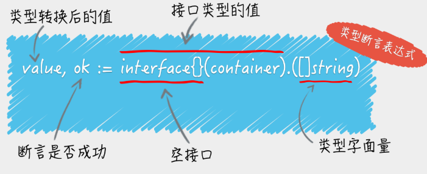
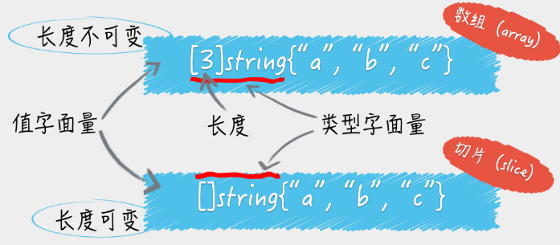

[Go 语言之旅](https://tour.go-zh.org/concurrency/11)

## Go Module, GOPATH 与工作空间

环境变量：

- GOROOT：Go 语言安装根目录的路径，也就是 GO 语言的安装路径。
- GOPATH：若干工作区目录的路径。是我们自己定义的工作空间。用来存放Go源码，Go的可运行文件，以及相应的编译之后的包文件。所以这个目录下面有三个子目录：src、bin、pkg
- GOBIN：GO 程序生成的可执行文件（executable file）的路径。





从 Go1.11 开始, Go 官方加入 Go Module 支持, Go1.12 成为默认支持; 从此告别源码必须放在 Gopath 中 以及 Gopath 对初学者造成的困扰.

### Go Module

要顺利安装 Go Module 的包, 需要先设置代理:

公共模块代理:

```sh
export GOPROXY=https://goproxy.io  // 也可以设置为 https://goproxy.cn 或者其他
```

私有模块代理:

```sh
export GOPRIVATE=git.xxx.com
```

初始化:

```sh
go mod init [module 名称]
```

检测和清理依赖:

```sh
go mod tidy
```


常用命令：

```sh
go mod init  # 初始化 go.mod
go mod tidy  # 更新依赖文件
go mod download  # 下载依赖文件

go mod vendor  # 将依赖转移至本地的 vendor 文件
go mod edit  # 手动修改依赖文件
go mod graph  # 打印依赖图
go mod verify  # 校验依赖
```


### 安装指定包

```sh
go get -v github.com/go-ego/gse@v0.60.0-rc4.2
```

更新依赖:

```sh
go get -u # go get -u 参数可以自动更新包，而且当go get的时候会自动获取该包依赖的其他第三方包
```

更新指定包依赖:

```
go get -u github.com/go-ego/gse
```

指定版本:

```
go get -u github/com/go-ego/gse@v0.60.0-rc4.2
```

**`go get`本质上可以理解为首先第一步是通过源码工具clone代码到src下面，然后执行`go install`**


Replace:

```
go mod edit -replace github.com/go-ego/gse=/path/to/local/gse
go mod edit -replace github.com/go-ego/gse=github.com/vcaesar/gse
```

也可以直接修改模块文件:

```
replace github.com/go-ego/gse => github.com/vcaesar/gse
```


### 构建和安装Go程序

安装：安装完成后可在对应包的pkg下找到 `.a` 文件

```sh
go install # 进入对应的应用包目录执行
go install xxx # 任意目录执行 
```

编译：

```sh
go build # 会生成对应的可执行文件
```


构建使用命令`go build`，安装使用命令`go install`。构建和安装代码包的时候都会执行编译、打包等操作，并且，这些操作生成的任何文件都会先被保存到某个临时的目录中。

如果构建的是库源码文件，那么操作后产生的结果文件只会存在于临时目录中。这里的构建的主要意义在于检查和验证。

如果构建的是命令源码文件，那么操作的结果文件会被搬运到源码文件所在的目录中。


安装操作会先执行构建，然后还会进行链接操作，并且把结果文件搬运到指定目录。

进一步说，如果安装的是库源码文件，那么结果文件会被搬运到它所在工作区的 pkg 目录下的某个子目录中。

如果安装的是命令源码文件，那么结果文件会被搬运到它所在工作区的 bin 目录中，或者环境变量`GOBIN`指向的目录中。


## 源码文件

源码文件又分为三种，即：命令源码文件、库源码文件和测试源码文件，它们都有着不同的用途和编写规则。

**命令源码文件**：

* 独立程序入口
* 属于main包，包含无参数无结果的main函数
* 可通过go run 命令运行，可接受命令行参数
* main函数执行结束，意味着当前程序运行结束
* 同一个代码包不要放多个命令源码文件
* 命令源码文件与库源码文件也不要放同一个代码包
* 构建：
  * 构建后生成可执行文件
  * 生成位置在命令执行目录
* 安装：
  * 安装后生成可执行文件
  * 生成位置在当前工作区的bin子目录或GOBIN包含的目录

**库源码文件**：

* 专门用于放置可供其他代码使用的程序实体
* 构建：
  * 作用在于检查和验证
  * 构建后只生成临时文件
* 安装：
  * 安装后生成归档文件，扩展名为.a的文件，即为静态链接库文件
  * 生成位置在当前工作区的pkg子目录

**测试源码文件**：

* 功能测试源码文件：
  * 测试函数名称：TestXXX
  * 测试函数签名：t.*testing.T
* 性能（基准）测试源码文件
  * 测试函数名称：BenchmarkXxx
  * 测试函数签名：b.*testing.B
* 示例（样本）测试源码文件：
  * 测试函数名称：ExampleXxx
  * 测试函数预期输出：放在函数末尾，用注释表示，形如：// Output: xxx


### 命令源码文件

命令源码文件是程序的运行入口，是每个可独立运行的程序必须拥有的。我们可以通过构建或安装，生成与其对应的可执行文件，后者一般会与该命令源码文件的直接父目录同名。

**如果一个源码文件声明属于`main`包，并且包含一个无参数声明且无结果声明的`main`函数，那么它就是命令源码文件。** 就像下面这段代码：

```go
package main
 
import "fmt"
 
func main() {
	fmt.Println("Hello, world!")
}
```

### 库源码文件

库源码文件是不能被直接运行的源码文件，它仅用于存放程序实体，这些程序实体可以被其他代码使用。


名称的首字母为大写的程序实体才可以被当前包外的代码引用，否则它就只能被当前包内的其他代码引用。通过名称，Go 语言自然地把程序实体的访问权限划分为了包级私有的和公开的。对于包级私有的程序实体，即使你导入了它所在的代码包也无法引用到它。


> **对于程序实体，还有其他的访问权限规则吗？**

答案是肯定的。在 Go 1.5 及后续版本中，我们可以通过创建`internal`代码包让一些程序实体仅仅能被当前模块中的其他代码引用。这被称为 Go 程序实体的第三种访问权限：**模块级私有**。

具体规则是，`internal`代码包中声明的公开程序实体仅能被该代码包的直接父包及其子包中的代码引用。当然，引用前需要先导入这个`internal`包。对于其他代码包，导入该`internal`包都是非法的，无法通过编译。


## 基础

### import

我们在写Go代码的时候经常用到import这个命令用来导入包文件，而我们经常看到的方式参考如下：

```go
import(
    "fmt"
)
```

然后我们代码里面可以通过如下的方式调用

```go
fmt.Println("hello world")
```

上面这个fmt是Go语言的标准库，其实是去`GOROOT`环境变量指定目录下去加载该模块，当然Go的import还支持如下两种方式来加载自己写的模块：

1. 相对路径

   import “./model” //当前文件同一目录的model目录，但是不建议这种方式来import

2. 绝对路径

   import “shorturl/model” //加载gopath/src/shorturl/model模块

上面展示了一些import常用的几种方式，但是还有一些特殊的import，让很多新手很费解，下面我们来一一讲解一下到底是怎么一回事

1. 点操作

   我们有时候会看到如下的方式导入包

   ```go
    import(
        . "fmt"
    )
   ```

   这个点操作的含义就是这个包导入之后在你调用这个包的函数时，你可以省略前缀的包名，也就是前面你调用的fmt.Println("hello world")可以省略的写成Println("hello world")

2. 别名操作

   别名操作顾名思义我们可以把包命名成另一个我们用起来容易记忆的名字

   ```go
    import(
        f "fmt"
    )
   ```

   别名操作的话调用包函数时前缀变成了我们的前缀，即f.Println("hello world")

3. _操作

   ```go
   import (
       "database/sql"
       _ "github.com/ziutek/mymysql/godrv"
   )
   ```

   _操作其实是引入该包，而不直接使用包里面的函数，而是调用了该包里面的init函数。


### 导出名

大写字母开头的变量是可导出的，也就是其它包可以读取的，是公有变量；小写字母开头的就是不可导出的，是私有变量。

大写字母开头的函数也是一样，相当于`class`中的带`public`关键词的公有函数；小写字母开头的就是有`private`关键词的私有函数。


### 变量

`var` 语句用于声明一系列变量。和函数的参数列表一样，类型在最后。

`var` 语句可以出现在包或函数的层级。

```go
package main

import "fmt"

var c, python, java bool

func main() {
	var i int
	fmt.Println(i, c, python, java)
}
// Output: 0 false false false
```


变量声明可以包含初始值，每个变量对应一个。

如果提供了初始值，则类型可以省略；变量会从初始值中推断出类型。

```go
package main

import "fmt"

var i, j int = 1, 2

func main() {
	var c, python, java = true, false, "no!"
	fmt.Println(i, j, c, python, java)
}
// Output: 1 2 true false no!
```


在函数中，短赋值语句 `:=` 可在隐式确定类型的 `var` 声明中使用。

函数外的每个语句都 **必须** 以关键字开始（`var`、`func` 等），因此 `:=` 结构不能在函数外使用。

```go
package main

import "fmt"

func main() {
	var i, j int = 1, 2
	k := 3
	c, python, java := true, false, "no!"

	fmt.Println(i, j, k, c, python, java)
}
// Output: 1 2 3 true false no!
```


**变量重声明和可重名变量**：

> **不同代码块中的重名变量与变量重声明中的变量区别到底在哪儿？**

1. 变量重声明中的变量一定是在某一个代码块内的。注意，这里的“某一个代码块内”并不包含它的任何子代码块，否则就变成了“多个代码块之间”。而可重名变量指的正是在多个代码块之间由相同的标识符代表的变量。
2. 变量重声明是对同一个变量的多次声明，这里的变量只有一个。而可重名变量中涉及的变量肯定是有多个的。
3. 不论对变量重声明多少次，其类型必须始终一致，具体遵从它第一次被声明时给定的类型。而可重名变量之间不存在类似的限制，它们的类型可以是任意的。
4. 如果可重名变量所在的代码块之间，存在直接或间接的嵌套关系，那么它们之间一定会存在“屏蔽”的现象。但是这种现象绝对不会在变量重声明的场景下出现。



### 基本类型

这些类型的变量之间不允许互相赋值或操作，不然会在编译时引起编译器报错。

```go
bool

string  // Go中的字符串都是采用UTF-8字符集编码。字符串是用一对双引号（""）或反引号（` `）括起来定义。
		// Go中字符串是不可变的。如果真的想要修改怎么办呢？ 将字符串 s 转换为 []byte 类型 或 切片

int  int8  int16  int32  int64
uint uint8 uint16 uint32 uint64 uintptr

byte // uint8 的别名

rune // int32 的别名
     // 表示一个 Unicode 码位

float32 float64

complex64 complex128 // 复数 var c complex64 = 5+5i
```

`int`、`uint` 和 `uintptr` 类型在 32-位系统上通常为 32-位宽，在 64-位系统上则为 64-位宽。当你需要一个整数值时应使用 `int` 类型， 除非你有特殊的理由使用固定大小或无符号的整数类型。

没有明确初始化的变量声明会被赋予对应类型的 **零值**。

```go
int     0
int8    0
int32   0
int64   0
uint    0x0
rune    0 //rune的实际类型是 int32
byte    0x0 // byte的实际类型是 uint8
float32 0 //长度为 4 byte
float64 0 //长度为 8 byte
bool    false
string  ""
```


在声明一个变量而不指定其类型时（即使用不带类型的 `:=` 语法，`var =` 表达式语法），变量的类型会通过右值推断出来。


表达式 `T(v)` 将值 `v` 转换为类型 `T`。

Go 在不同类型的项之间赋值时需要显式转换。

**类型断言**：



### 常量

常量的声明与变量类似，只不过使用 `const` 关键字。

常量可以是字符、字符串、布尔值或数值。

常量不能用 `:=` 语法声明。

```go
const Pi = 3.14
```


### 流程控制

**for循环**：

Go 只有一种循环结构：`for` 循环。初始化语句和后置语句是可选的。

```go
for i := 0; i < 10; i++ {
    sum += i
}
for ; sum < 1000; {
    sum += sum
}

// for 是 Go 中的「while」:此时你可以去掉分号，因为 C 的 while 在 Go 中叫做 for。
for sum < 1000 {
    sum += sum
}

// 无限循环
for {
}
```


**if**:

和 `for` 一样，`if` 语句可以在条件表达式前执行一个简短语句。

该语句声明的变量作用域仅在 `if` 之内。

```go
package main

import (
	"fmt"
	"math"
)

func pow(x, n, lim float64) float64 {
	if v := math.Pow(x, n); v < lim {
		return v
	} else {
		fmt.Printf("%g >= %g\n", v, lim)
	}
	// can't use v here, though
	return lim
}

func main() {
	fmt.Println(
		pow(3, 2, 10),
		pow(3, 3, 20),
	)
}
// Output: 9 20
```

在 `if` 的简短语句中声明的变量同样可以在对应的任何 `else` 块中使用。


**switch**:

Go 的 `switch` 语句类似于 C、C++、Java、JavaScript 和 PHP 中的，不过 Go 只会运行选定的 `case`，而非之后所有的 `case`。 在效果上，Go 的做法相当于这些语言中为每个 `case` 后面自动添加了所需的 `break` 语句。在 Go 中，除非以 `fallthrough` 语句结束，否则分支会自动终止。使用`fallthrough`强制执行后面的case代码。

Go 的另一点重要的不同在于 `switch` 的 `case` 无需为常量，且取值不限于整数。

`switch` 的 `case` 语句从上到下顺次执行，直到匹配成功时停止。

无条件的 `switch` 同 `switch true` 一样。


**defer推迟**：

defer 语句会将函数推迟到外层函数返回之后执行。

推迟调用的函数其参数会立即求值，但直到外层函数返回前该函数都不会被调用。

```go
package main

import "fmt"

func main() {
	fmt.Println("counting")

	for i := 0; i < 10; i++ {
		defer fmt.Print(i)
	}

	fmt.Println("done")
}
// counting
// done
// 9876543210
```

推迟调用的函数调用会被压入一个栈中。 当外层函数返回时，被推迟的调用会按照后进先出的顺序调用。

[Defer, Panic, and Recover - Go 语言博客](https://blog.go-zh.org/defer-panic-and-recover)


### 函数

```go
func funcName(input1 type1, input2 type2) (output1 type1, output2 type2) {
	//这里是处理逻辑代码
	//返回多个值
	return value1, value2
}
```

https://blog.go-zh.org/gos-declaration-syntax


Go 的返回值可被命名，它们会被视作定义在函数顶部的变量。

返回值的命名应当能反应其含义，它可以作为文档使用。

没有参数的 `return` 语句会直接返回已命名的返回值，也就是「裸」返回值。

裸返回语句应当仅用在下面这样的短函数中。在长的函数中它们会影响代码的可读性。

```go
func split(sum int) (x, y int) {
	x = sum * 4 / 9
	y = sum - x
	return
}
```


**变参**：

Go函数支持变参。接受变参的函数是有着不定数量的参数的。为了做到这点，首先需要定义函数使其接受变参：

```go
func myfunc(arg ...int) {}
```

`arg ...int`告诉Go这个函数接受不定数量的参数。注意，这些参数的类型全部是`int`。在函数体中，变量`arg`是一个`int`的`slice`：

```go
for _, n := range arg {
	fmt.Printf("And the number is: %d\n", n)
}
```


**传值与传指针**：

当我们传一个参数值到被调用函数里面时，实际上是传了这个值的一份copy，当在被调用函数中修改参数值的时候，调用函数中相应实参不会发生任何变化，因为数值变化只作用在copy上。

```go
package main

import "fmt"

//简单的一个函数，实现了参数+1的操作
func add1(a int) int {
	a = a+1 // 我们改变了a的值
	return a //返回一个新值
}

func main() {
	x := 3

	fmt.Println("x = ", x)  // 应该输出 "x = 3"

	x1 := add1(x)  //调用add1(x)

	fmt.Println("x+1 = ", x1) // 应该输出"x+1 = 4"
	fmt.Println("x = ", x)    // 应该输出"x = 3"
}
```

```go
package main

import "fmt"

//简单的一个函数，实现了参数+1的操作
func add1(a *int) int { // 请注意，
	*a = *a+1 // 修改了a的值
	return *a // 返回新值
}

func main() {
	x := 3

	fmt.Println("x = ", x)  // 应该输出 "x = 3"

	x1 := add1(&x)  // 调用 add1(&x) 传x的地址

	fmt.Println("x+1 = ", x1) // 应该输出 "x+1 = 4"
	fmt.Println("x = ", x)    // 应该输出 "x = 4"
}
```

传指针有什么好处呢？

- 传指针使得多个函数能操作同一个对象。
- 传指针比较轻量级 (8bytes),只是传内存地址，我们可以用指针传递体积大的结构体。如果用参数值传递的话, 在每次copy上面就会花费相对较多的系统开销（内存和时间）。所以当你要传递大的结构体的时候，用指针是一个明智的选择。
- Go语言中`channel`，`slice`，`map`这三种类型的实现机制类似指针，所以可以直接传递，而不用取地址后传递指针。（注：若函数需改变`slice`的长度，则仍需要取地址传递指针）


**函数作为值、类型**：

在Go中函数也是一种变量，我们可以通过`type`来定义它，它的类型就是所有拥有相同的参数，相同的返回值的一种类型

```go
package main

import "fmt"

type testInt func(int) bool // 声明了一个函数类型

func isOdd(integer int) bool {
	if integer%2 == 0 {
		return false
	}
	return true
}

func isEven(integer int) bool {
	if integer%2 == 0 {
		return true
	}
	return false
}

// 声明的函数类型在这个地方当做了一个参数

func filter(slice []int, f testInt) []int {
	var result []int
	for _, value := range slice {
		if f(value) {
			result = append(result, value)
		}
	}
	return result
}

func main(){
	slice := []int {1, 2, 3, 4, 5, 7}
	fmt.Println("slice = ", slice)
	odd := filter(slice, isOdd)    // 函数当做值来传递了
	fmt.Println("Odd elements of slice are: ", odd)
	even := filter(slice, isEven)  // 函数当做值来传递了
	fmt.Println("Even elements of slice are: ", even)
}
```


### 指针

Go 拥有指针。指针保存了值的内存地址。

类型 `*T` 是指向 `T` 类型值的指针，其零值为 `nil`。

```go
var p *int
```

`&` 操作符会生成一个指向其操作数的指针。

```go
i := 42
p = &i
```

`*` 操作符表示指针指向的底层值。

```go
fmt.Println(*p) // 通过指针 p 读取 i
*p = 21         // 通过指针 p 设置 i
```

这也就是通常所说的「解引用」或「间接引用」。

与 C 不同，Go 没有指针运算。


### struct

```go
type person struct {
	name string
	age int
}

var P person  // P现在就是person类型的变量了

P.name = "Astaxie"  // 赋值"Astaxie"给P的name属性.
P.age = 25  // 赋值"25"给变量P的age属性
fmt.Printf("The person's name is %s", P.name)  // 访问P的name属性.
```

还有另外几种声明使用方式：

- 1.按照顺序提供初始化值

  P := person{"Tom", 25}

- 2.通过`field:value`的方式初始化，这样可以任意顺序

  P := person{age:24, name:"Tom"}

- 3.当然也可以通过`new`函数分配一个指针，此处P的类型为*person

  P := new(person)


使用 `Name:` 语法可以仅列出部分字段（字段名的顺序无关）。

特殊的前缀 `&` 返回一个指向结构体的指针。

```go
var (
	v1 = Vertex{1, 2}  // 创建一个 Vertex 类型的结构体
	v2 = Vertex{X: 1}  // Y:0 被隐式地赋予零值
	v3 = Vertex{}      // X:0 Y:0
	p  = &Vertex{1, 2} // 创建一个 *Vertex 类型的结构体（指针）.如果我们有一个指向结构体的指针 `p` 那么可以通过 `(*p).X` 来访问其字段 `X`。 不过这么写太啰嗦了，所以语言也允许我们使用隐式解引用，直接写 `p.X` 就可以。
)
```


Go支持只提供类型，而不写字段名的方式，也就是匿名字段，也称为嵌入字段。当匿名字段是一个struct的时候，那么这个struct所拥有的全部字段都被隐式地引入了当前定义的这个struct。

```go
type Human struct {
	name string
	age int
	weight int
}

type Student struct {
	Human  // 匿名字段，那么默认Student就包含了Human的所有字段
	speciality string
}
```


### 数组和切片



> 数组可以被叫做切片的底层数组，而切片也可以被看作是对数组的某个连续片段的引用。
>
> 也正因为如此，Go 语言的切片类型属于引用类型，同属引用类型的还有字典类型、通道类型、函数类型等；而 Go 语言的数组类型则属于值类型，同属值类型的有基础数据类型以及结构体类型。把一个数组作为参数传入函数的时候，传入的其实是该数组的副本。


类型 `[n]T` 表示一个数组，它拥有 `n` 个类型为 `T` 的值。

```
var a [10]int
```

数组的长度是其类型的一部分，因此数组不能改变大小。


**切片**：

每个数组的大小都是固定的。而切片则为数组元素提供了动态大小的、灵活的视角。 在实践中，切片比数组更常用。

切片并不是真正意义上的动态数组，而是一个引用类型。`slice`总是指向一个底层`array`，`slice`的声明也可以像`array`一样，只是不需要长度。

类型 `[]T` 表示一个元素类型为 `T` 的切片。.

```go
var fslice []int
```

以下表达式创建了一个切片，它包含 `a` 中下标从 1 到 3 的元素：

```
a[1:4]
```


对于`slice`有几个有用的内置函数：

- `len` 获取`slice`的长度
- `cap` 获取`slice`的最大容量：从它的第一个元素开始数，到其底层数组元素末尾的个数。
- `append` 向`slice`里面追加一个或者多个元素，然后返回一个和`slice`一样类型的`slice`
- `copy` 函数`copy`从源`slice`的`src`中复制元素到目标`dst`，并且返回复制的元素的个数

注：`append`函数会改变`slice`所引用的数组的内容，从而影响到引用同一数组的其它`slice`。 但当`slice`中没有剩余空间（即`(cap-len) == 0`）时，此时将动态分配新的数组空间。返回的`slice`数组指针将指向这个空间，而原数组的内容将保持不变；其它引用此数组的`slice`则不受影响。


切片可以用内置函数 `make` 来创建，这也是你创建动态数组的方式。

`make` 函数会分配一个元素为零值的数组并返回一个引用了它的切片：

```
a := make([]int, 5)  // len(a)=5
```

要指定它的容量，需向 `make` 传入第三个参数：

```
b := make([]int, 0, 5) // len(b)=0, cap(b)=5

b = b[:cap(b)] // len(b)=5, cap(b)=5
b = b[1:]      // len(b)=4, cap(b)=4
```


> **make、new操作**：
>
> `make`用于内建类型（`map`、`slice` 和`channel`）的内存分配。`new`用于各种类型的内存分配。
>
> `new(T)`分配了零值填充的`T`类型的内存空间，并且返回其地址，即一个`*T`类型的值。
>
> * `new`返回指针。
> * `make`返回初始化后的（非零）值。


`for` 循环的 `range` 形式可遍历切片或映射。

当使用 `for` 循环遍历切片时，每次迭代都会返回两个值。 第一个值为当前元素的下标，第二个值为该下标所对应元素的一份副本。

```go
package main

import "fmt"

var pow = []int{1, 2, 4, 8, 16, 32, 64, 128}

func main() {
	for i, v := range pow {
		fmt.Printf("2**%d = %d\n", i, v)
	}
}

// 2**0 = 1
// 2**1 = 2
```

可以将下标或值赋予 `_` 来忽略它。

```go
for i, _ := range pow
```


### map映射

Go 语言规范规定，在键类型的值之间必须可以施加操作符`==`和`!=`。换句话说，键类型的值必须要支持判等操作。由于**函数类型、接口类型、字典类型和切片类型**的值并不支持判等操作，所以字典的键类型不能是这些类型。

如果键的类型是数组类型，那么还要确保该类型的元素类型不是函数类型、字典类型或切片类型。


在映射 `m` 中插入或修改元素：

```
m[key] = elem
```

获取元素：

```
elem = m[key]
```

删除元素：

```
delete(m, key)
```

通过双赋值检测某个键是否存在：

```
elem, ok = m[key]
```


`map`和其他基本型别不同，它不是thread-safe，在多个go-routine存取时，必须使用mutex lock机制。


### 函数闭包

Go 函数可以是一个闭包。闭包是一个函数值，它引用了其函数体之外的变量。 也就是说，它的内部逻辑并不是完整的，有一部分逻辑需要这个自由变量参与完成，而后者到底代表了什么在闭包函数被定义的时候却是未知的。

例如，函数 `adder` 返回一个闭包。每个闭包都被绑定在其各自的 `sum` 变量上。

```go
package main

import "fmt"

func adder() func(int) int {
	sum := 0
	return func(x int) int {
		sum += x
		return sum
	}
}

func main() {
	pos, neg := adder(), adder()
	for i := 0; i < 10; i++ {
		fmt.Println(
			pos(i),
			neg(-2*i),
		)
	}
}
// 0 0
// 1 -2
// 3 -6
// 6 -12
```


### 错误处理

[Error handling and Go - The Go Programming Language](https://go.dev/blog/error-handling-and-go)


### Panic和Recover

Go没有像Java那样的异常机制，它不能抛出异常，而是使用了`panic`和`recover`机制。一定要记住，你应当把它作为最后的手段来使用，也就是说，你的代码中应当没有，或者很少有`panic`的东西。

Panic：当函数返回我们不知道如何处理（或不想处理）的错误值时，中止操作。

> 是一个内建函数，可以中断原有的控制流程，进入一个`panic`状态中。当函数`F`调用`panic`，函数F的执行被中断，但是`F`中的延迟函数会正常执行，然后F返回到调用它的地方。在调用的地方，`F`的行为就像调用了`panic`。这一过程继续向上，直到发生`panic`的`goroutine`中所有调用的函数返回，此时程序退出。`panic`可以直接调用`panic`产生。也可以由运行时错误产生，例如访问越界的数组。

Recover：`recover` 可以阻止 `panic` 中止程序，并让它继续执行。

> `recover`仅在延迟函数中有效。在正常的执行过程中，调用`recover`会返回`nil`，并且没有其它任何效果。如果当前的`goroutine`陷入`panic`状态，调用`recover`可以捕获到`panic`的输入值，并且恢复正常的执行。


```go
var user = os.Getenv("USER")

func init() {
	if user == "" {
		panic("no value for $USER")
	}
}
```

```go
package main

import "fmt"

func mayPanic() {
    panic("a problem")
}

func main() {
	// 必须在 defer 函数中调用 recover。 当跳出引发 panic 的函数时，defer 会被激活， 其中的 recover 会捕获 panic。
    defer func() {
        if r := recover(); r != nil {

            fmt.Println("Recovered. Error:\n", r)
        }
    }()

    mayPanic()

    fmt.Println("After mayPanic()")
}
```

### main 函数和 init 函数

Go里面有两个保留的函数：`init`函数（能够应用于所有的`package`）和`main`函数（只能应用于`package main`）。这两个函数在定义时不能有任何的参数和返回值。虽然一个`package`里面可以写任意多个`init`函数，但这无论是对于可读性还是以后的可维护性来说，我们都强烈建议用户在一个`package`中每个文件只写一个`init`函数。

Go程序会自动调用`init()`和`main()`，所以你不需要在任何地方调用这两个函数。每个`package`中的`init`函数都是可选的，但`package main`就必须包含一个`main`函数。

程序的初始化和执行都起始于`main`包。如果`main`包还导入了其它的包，那么就会在编译时将它们依次导入。有时一个包会被多个包同时导入，那么它只会被导入一次（例如很多包可能都会用到`fmt`包，但它只会被导入一次，因为没有必要导入多次）。当一个包被导入时，如果该包还导入了其它的包，那么会先将其它包导入进来，然后再对这些包中的包级常量和变量进行初始化，接着执行`init`函数（如果有的话），依次类推。等所有被导入的包都加载完毕了，就会开始对`main`包中的包级常量和变量进行初始化，然后执行`main`包中的`init`函数（如果存在的话），最后执行`main`函数。下图详细地解释了整个执行过程：


## 方法和接口

### 方法

Go 没有类。不过可以为类型定义方法。

**方法就是一类带特殊的 `接收者` 参数的函数。**

方法接收者在它自己的参数列表内，位于 `func` 关键字和方法名之间。

在此例中，`Abs` 方法拥有一个名字为 `v`，类型为 `Vertex` 的接收者。

```go
package main

import (
	"fmt"
	"math"
)

type Vertex struct {
	X, Y float64
}

func (v Vertex) Abs() float64 {
	return math.Sqrt(v.X*v.X + v.Y*v.Y)
}

func main() {
	v := Vertex{3, 4}
	fmt.Println(v.Abs())
    fmt.Println(Abs(v)) // 现在这个 Abs 的写法就是个正常的函数，功能并没有什么变化。
}
```


可以为非结构体类型声明方法。

只能为在同一个包中定义的接收者类型声明方法，而不能为其它别的包中定义的类型 （包括 `int` 之类的内置类型）声明方法。接收者的类型定义和方法声明必须在同一包内。

```go
package main

import (
	"fmt"
	"math"
)

type MyFloat float64

func (f MyFloat) Abs() float64 {
	if f < 0 {
		return float64(-f)
	}
	return float64(f)
}

func main() {
	f := MyFloat(-math.Sqrt2)
	fmt.Println(f.Abs())
}
```


可以为指针类型的接收者声明方法。

指针接收者的方法可以修改接收者指向的值。 由于方法经常需要修改它的接收者，指针接收者比值接收者更常用。若使用值接收者，那么 `Scale` 方法会对原始 `Vertex` 值的副本进行操作。

```go
package main

import (
	"fmt"
	"math"
)

type Vertex struct {
	X, Y float64
}

func (v Vertex) Abs() float64 {
	return math.Sqrt(v.X*v.X + v.Y*v.Y)
}

func (v *Vertex) Scale(f float64) {
	v.X = v.X * f
	v.Y = v.Y * f
}

func main() {
	v := Vertex{3, 4}
	v.Scale(10)
	fmt.Println(v.Abs())
}
// Output: 50
```

使用指针接收者的原因有二：

首先，方法能够修改其接收者指向的值。

其次，这样可以避免在每次调用方法时复制该值。若值的类型为大型结构体时，这样会更加高效。


### 接口

类型通过实现一个接口的所有方法来实现该接口。既然无需专门显式声明，也就没有“implements”关键字。


接口也是值。它们可以像其它值一样传递。

接口值可以用作函数的参数或返回值。

在内部，接口值可以看做包含值和具体类型的元组：

```
(value, type)
```

接口值保存了一个具体底层类型的具体值。

接口值调用方法时会执行其底层类型的同名方法。

```go
package main

import (
	"fmt"
	"math"
)

type I interface {
	M()
}

type T struct {
	S string
}

func (t *T) M() {
	fmt.Println(t.S)
}

type F float64

func (f F) M() {
	fmt.Println(f)
}

func main() {
	var i I

	i = &T{"Hello"}
	describe(i)
	i.M()

	i = F(math.Pi)
	describe(i)
	i.M()
}

func describe(i I) {
	fmt.Printf("(%v, %T)\n", i, i)
}
/* Output:
(&{Hello}, *main.T)
Hello
(3.141592653589793, main.F)
3.141592653589793
*/
```


即便接口内的具体值为 nil，方法仍然会被 nil 接收者调用。

保存了 nil 具体值的接口其自身并不为 nil。

```go
func (t *T) M() {
	if t == nil {
		fmt.Println("<nil>")
		return
	}
	fmt.Println(t.S)
}

func main() {
	var i I

	var t *T
	i = t
	describe(i)
	i.M()

	i = &T{"hello"}
	describe(i)
	i.M()
}
/* Output:
(<nil>, *main.T)
<nil>
(&{hello}, *main.T)
hello
*/
```


nil 接口值既不保存值也不保存具体类型。

为 nil 接口调用方法会产生运行时错误，因为接口的元组内并未包含能够指明该调用哪个 **具体** 方法的类型。

```go
func main() {
	var i I
	describe(i)
	i.M()
}
```


**空接口**:

指定了零个方法的接口值被称为 *空接口：*

```
interface{}
```

空接口可保存任何类型的值。（因为每个类型都至少实现了零个方法。）

空接口被用来处理未知类型的值。例如，`fmt.Print` 可接受类型为 `interface{}` 的任意数量的参数。

```go
package main

import "fmt"

func main() {
	var i interface{}
	describe(i)

	i = 42
	describe(i)

	i = "hello"
	describe(i)
}

func describe(i interface{}) {
	fmt.Printf("(%v, %T)\n", i, i)
}
/*
(<nil>, <nil>)
(42, int)
(hello, string)
*/
```


## 泛型

### 类型参数

函数的类型参数出现在函数参数之前的方括号之间。

```go
package main

import "fmt"

// Index 返回 x 在 s 中的下标，未找到则返回 -1。
func Index[T comparable](s []T, x T) int {
	for i, v := range s {
		// v 和 x 的类型为 T，它拥有 comparable 可比较的约束，因此我们可以使用 ==。
		if v == x {
			return i
		}
	}
	return -1
}

func main() {
	// Index 可以在整数切片上使用
	si := []int{10, 20, 15, -10}
	fmt.Println(Index(si, 15))

	// Index 也可以在字符串切片上使用
	ss := []string{"foo", "bar", "baz"}
	fmt.Println(Index(ss, "hello"))
}
// Output: 2 -1
```


### 泛型类型

除了泛型函数之外，Go 还支持泛型类型。 类型可以使用类型参数进行参数化，这对于实现通用数据结构非常有用。

```go
// List 表示一个可以保存任何类型的值的单链表。
type List[T any] struct {
	next *List[T]
	val  T
}
```


## 反射

[laws of reflection](http://golang.org/doc/articles/laws_of_reflection.html)


## 并发

### Go 协程

Go 程（goroutine）是由 Go 运行时管理的轻量级线程。

```go
package main

import (
    "fmt"
    "time"
)

func f(from string) {
    for i := 0; i < 3; i++ {
        fmt.Println(from, ":", i)
    }
}

func main() {

    f("direct")
	
    // 使用 go f(s) 在一个协程中调用这个函数
    go f("goroutine")
	
    // 匿名函数启动一个协程。
    go func(msg string) {
        fmt.Println(msg)
    }("going")

    time.Sleep(time.Second)
    fmt.Println("done")
}
```

Go 程在相同的地址空间中运行，因此在访问共享的内存时必须进行同步。


runtime包中有几个处理goroutine的函数：

- Goexit

  退出当前执行的goroutine，但是defer函数还会继续调用

- Gosched：`runtime.Gosched()`

  让出当前goroutine的执行权限，调度器安排其他等待的任务运行，并在下次某个时候从该位置恢复执行。

- NumCPU

  返回 CPU 核数量

- NumGoroutine

  返回正在执行和排队的任务总数

- GOMAXPROCS

  用来设置可以并行计算的CPU核数的最大值，并返回之前的值。


### *通道(channels)* 

信道是带有类型的管道，你可以通过它用信道操作符 `<-` 来发送或者接收值。可以从一个协程将值发送到通道，然后在另一个协程中接收。

```go
package main

import "fmt"

func main() {
	// 使用 make(chan val-type) 创建一个新的通道。 通道类型就是他们需要传递值的类型。
    messages := make(chan string)
	// 使用 channel <- 语法 发送 一个新的值到通道中。
    go func() { messages <- "ping" }()
	// 使用 <-channel 语法从通道中 接收 一个值。
    msg := <-messages
    fmt.Println(msg)
}
```

> 1. 对于同一个通道，发送操作之间是互斥的，接收操作之间也是互斥的。
> 2. 发送操作和接收操作中对元素值的处理都是不可分割的。
> 3. 发送操作在完全完成之前会被阻塞。接收操作也是如此。
>
> 这使得 Go 程可以在没有显式的锁或竞态变量的情况下进行同步。


信道可以是 **带缓冲的**。将缓冲长度作为第二个参数提供给 `make` 来初始化一个带缓冲的信道：

```
ch := make(chan int, 100)
```

仅当信道的缓冲区填满后，向其发送数据时才会阻塞。当缓冲区为空时，接受方会阻塞。


发送者可通过 `close` 关闭一个信道来表示没有需要发送的值了。接收者可以通过为接收表达式分配第二个参数来测试信道是否被关闭：若没有值可以接收且信道已被关闭，那么在执行完

```
v, ok := <-ch
```

此时 `ok` 会被设置为 `false`。

循环 `for i := range c` 会不断从信道接收值，直到它被关闭。

**注意**： 只应由发送者关闭信道，而不应油接收者关闭。向一个已经关闭的信道发送数据会引发程序 panic。

**还要注意**： 信道与文件不同，通常情况下无需关闭它们。只有在必须告诉接收者不再有需要发送的值时才有必要关闭，例如终止一个 `range` 循环。

```go
package main

import (
	"fmt"
)

func fibonacci(n int, c chan int) {
	x, y := 0, 1
	for i := 0; i < n; i++ {
		c <- x
		x, y = y, x+y
	}
	close(c)
}

func main() {
	c := make(chan int, 10)
	go fibonacci(cap(c), c)
	for i := range c {
		fmt.Println(i)
	}
}
```


**Select**：

通过`select`可以监听channel上的数据流动。

`select`默认是阻塞的，只有当监听的channel中有发送或接收可以进行时才会运行，当多个channel都准备好的时候，select是随机的选择一个执行的。

```go
package main

import (
    "fmt"
    "time"
)

func main() {

    c1 := make(chan string)
    c2 := make(chan string)

    go func() {
        time.Sleep(1 * time.Second)
        c1 <- "one"
    }()
    go func() {
        time.Sleep(2 * time.Second)
        c2 <- "two"
    }()

    for i := 0; i < 2; i++ {
        select {
        case msg1 := <-c1:
            fmt.Println("received", msg1)
        case msg2 := <-c2:
            fmt.Println("received", msg2)
        }
    }
}
```


超时：

```go
package main

import (
    "fmt"
    "time"
)

func main() {

    c1 := make(chan string, 1)
    go func() {
        time.Sleep(2 * time.Second)
        c1 <- "result 1"
    }()
	
    //  res := <- c1 等待结果，<-time.After 等待超时（1秒钟）以后发送的值。 由于 select 默认处理第一个已准备好的接收操作， 因此如果操作耗时超过了允许的 1 秒的话，将会执行超时 case。
    select {
    case res := <-c1:
        fmt.Println(res)
    case <-time.After(1 * time.Second):
        fmt.Println("timeout 1")
    }
}
```


在`select`里面还有default语法，`select`其实就是类似switch的功能，default就是当监听的channel都没有准备好的时候，默认执行的（select不再阻塞等待channel）。

```go
select {
case i := <-c:
	// use i
default:
	// 当c阻塞的时候执行这里
}
```


### sync.Mutex

信道非常适合在各个 Go 程间进行通信。

但是如果我们并不需要通信呢？比如说，若我们只是想保证每次只有一个 Go 程能够访问一个共享的变量，从而避免冲突？我们通常使用 *互斥锁（Mutex）* 这一数据结构来提供这种机制。

Go 标准库中提供了 [`sync.Mutex`](https://go-zh.org/pkg/sync/#Mutex) 互斥锁类型及其两个方法：

- `Lock`
- `Unlock`

我们可以通过在代码前调用 `Lock` 方法，在代码后调用 `Unlock` 方法来保证一段代码的互斥执行。

我们也可以用 `defer` 语句来保证互斥锁一定会被解锁。

```go
package main

import (
	"fmt"
	"sync"
	"time"
)

// SafeCounter 是并发安全的
type SafeCounter struct {
	mu sync.Mutex
	v  map[string]int
}

// Inc 对给定键的计数加一
func (c *SafeCounter) Inc(key string) {
	c.mu.Lock()
	// 锁定使得一次只有一个 Go 协程可以访问映射 c.v。
	c.v[key]++
	c.mu.Unlock()
}

// Value 返回给定键的计数的当前值。
func (c *SafeCounter) Value(key string) int {
	c.mu.Lock()
	// 锁定使得一次只有一个 Go 协程可以访问映射 c.v。
	defer c.mu.Unlock()
	return c.v[key]
}

func main() {
	c := SafeCounter{v: make(map[string]int)}
	for i := 0; i < 1000; i++ {
		go c.Inc("somekey")
	}

	time.Sleep(time.Second)
	fmt.Println(c.Value("somekey"))
}
```


### WaitGroup

```go
package main

import (
    "fmt"
    "sync"
    "time"
)

func worker(id int) {
    fmt.Printf("Worker %d starting\n", id)

    time.Sleep(time.Second)
    fmt.Printf("Worker %d done\n", id)
}

func main() {
	// 这个 WaitGroup 用于等待这里启动的所有协程完成。 注意：如果 WaitGroup 显式传递到函数中，则应使用 指针 。
    var wg sync.WaitGroup

    for i := 1; i <= 5; i++ {
        wg.Add(1)
		
        // 避免在每个协程闭包中重复利用相同的 i 值
        i := i
		
        // 将 worker 调用包装在一个闭包中，可以确保通知 WaitGroup 此工作线程已完成。
        go func() {
            defer wg.Done()
            worker(i)
        }()
    }
	
    // 阻塞，直到 WaitGroup 计数器恢复为 0； 即所有协程的工作都已经完成。
    wg.Wait()

}
```


### 原子计数器

```go
package main

import (
    "fmt"
    "sync"
    "sync/atomic"
)

func main() {

    var ops uint64

    var wg sync.WaitGroup

    for i := 0; i < 50; i++ {
        wg.Add(1)

        go func() {
            for c := 0; c < 1000; c++ {

                atomic.AddUint64(&ops, 1)
            }
            wg.Done()
        }()
    }

    wg.Wait()

    fmt.Println("ops:", ops)
}
```


## Timer & Ticker

定时器是当你想要在未来某一刻执行一次时使用的 

打点器则是为你想要以固定的时间间隔重复执行而准备的。

```go
package main

import (
    "fmt"
    "time"
)

func main() {
	// 你告诉定时器需要等待的时间，然后它将提供一个用于通知的通道。
    timer1 := time.NewTimer(2 * time.Second)
	
    // <-timer1.C 会一直阻塞， 直到定时器的通道 C 明确的发送了定时器失效的值。
    <-timer1.C
    fmt.Println("Timer 1 fired")
	
    // 可以在定时器触发之前将其取消。 
    timer2 := time.NewTimer(time.Second)
    go func() {
        <-timer2.C
        fmt.Println("Timer 2 fired")
    }()
    stop2 := timer2.Stop()
    if stop2 {
        fmt.Println("Timer 2 stopped")
    }

    time.Sleep(2 * time.Second)
}
```

```go
package main

import (
    "fmt"
    "time"
)

func main() {
	// 打点器和定时器的机制有点相似：使用一个通道来发送数据。
    ticker := time.NewTicker(500 * time.Millisecond)
    done := make(chan bool)

    go func() {
        for {
            select {
            case <-done:
                return
            case t := <-ticker.C:
                fmt.Println("Tick at", t)
            }
        }
    }()

    time.Sleep(1600 * time.Millisecond)
    ticker.Stop()
    done <- true
    fmt.Println("Ticker stopped")
}
```


## 正则表达式

[regexp package - regexp - Go Packages](https://pkg.go.dev/regexp)


## 单元测试

测试代码通常与需要被测试的代码位于同一个包下。

需要被测试的代码应该在类似于 `intutils.go` 的文件下， 其对应的测试文件应该被命名为 `intutils_test.go`。


`t.Error*` 会报告测试失败的信息，然后继续运行测试。

 `t.Fatal*` 会报告测试失败的信息，然后立即终止测试。

```go
package main

import (
    "fmt"
    "testing"
)

func IntMin(a, b int) int {
    if a < b {
        return a
    }
    return b
}

// 通常编写一个名称以 Test 开头的函数来创建测试。
func TestIntMinBasic(t *testing.T) {
    ans := IntMin(2, -2)
    if ans != -2 {

        t.Errorf("IntMin(2, -2) = %d; want -2", ans)
    }
}

func TestIntMinTableDriven(t *testing.T) {
    // 单元测试可以重复，所以会经常使用 表驱动 风格编写单元测试， 表中列出了输入数据，预期输出，使用循环，遍历并执行测试逻辑。
    var tests = []struct {
        a, b int
        want int
    }{
        {0, 1, 0},
        {1, 0, 0},
        {2, -2, -2},
        {0, -1, -1},
        {-1, 0, -1},
    }

    for _, tt := range tests {
	
        testname := fmt.Sprintf("%d,%d", tt.a, tt.b)
        // t.Run 可以运行一个 “subtests” 子测试，一个子测试对应表中一行数据。 运行 go test -v 时，他们会分开显示。
        t.Run(testname, func(t *testing.T) {
            ans := IntMin(tt.a, tt.b)
            if ans != tt.want {
                t.Errorf("got %d, want %d", ans, tt.want)
            }
        })
    }
}

// 基准测试通常在”_test.go”文件中，并以 Benchmark 开头命名。
func BenchmarkIntMin(b *testing.B) {

    for i := 0; i < b.N; i++ {
        IntMin(1, 2)
    }
}
```


## Web

Go语言里面提供了一个完善的net/http包，通过http包可以很方便的搭建起来一个可以运行的Web服务。同时使用这个包能很简单地对Web的路由，静态文件，模版，cookie等数据进行设置和操作。

```go
package main

import (
	"fmt"
	"net/http"
	"strings"
	"log"
)

func sayhelloName(w http.ResponseWriter, r *http.Request) {
	r.ParseForm()  //解析参数，默认是不会解析的
	fmt.Println(r.Form)  //这些信息是输出到服务器端的打印信息
	fmt.Println("path", r.URL.Path)
	fmt.Println("scheme", r.URL.Scheme)
	fmt.Println(r.Form["url_long"])
	for k, v := range r.Form {
		fmt.Println("key:", k)
		fmt.Println("val:", strings.Join(v, ""))
	}
	fmt.Fprintf(w, "Hello astaxie!") //这个写入到w的是输出到客户端的
}

func main() {
	http.HandleFunc("/", sayhelloName) //设置访问的路由
	err := http.ListenAndServe(":9090", nil) //设置监听的端口
	if err != nil {
		log.Fatal("ListenAndServe: ", err)
	}
}
```


**原理**：

```go
func ListenAndServe(addr string, handler Handler) error {
	server := &Server{Addr: addr, Handler: handler}
	return server.ListenAndServe()
}
```

`ListenAndServe`会初始化一个`sever`对象，然后调用了`Server`对象的方法`ListenAndServe`。其源码如下：

```go
func (srv *Server) ListenAndServe() error {
	if srv.shuttingDown() {
		return ErrServerClosed
	}
	addr := srv.Addr
	if addr == "" {
		addr = ":http"
	}
	ln, err := net.Listen("tcp", addr)
	if err != nil {
		return err
	}
	return srv.Serve(ln)
}
```

`ListenAndServe`调用了`net.Listen("tcp", addr)`，也就是底层用TCP协议搭建了一个服务，最后调用`src.Serve`监控我们设置的端口。监控之后如何接收客户端的请求呢？

```go

func (srv *Server) Serve(l net.Listener) error {
	...

	ctx := context.WithValue(baseCtx, ServerContextKey, srv)
	for {
		rw, err := l.Accept()
		...

		connCtx := ctx
		if cc := srv.ConnContext; cc != nil {
			connCtx = cc(connCtx, rw)
			if connCtx == nil {
				panic("ConnContext returned nil")
			}
		}
		tempDelay = 0
		c := srv.newConn(rw)
		c.setState(c.rwc, StateNew, runHooks) // before Serve can return
		go c.serve(connCtx)
	}
}
```

这个函数里面起了一个`for{}`，首先通过Listener接收请求：`l.Accept()`，其次创建一个Conn：`c := srv.newConn(rw)`，最后单独开了一个goroutine，把这个请求的数据当做参数扔给这个conn去服务：`go c.serve(connCtx)`。这个就是高并发体现了，用户的每一次请求都是在一个新的goroutine去服务，相互不影响。那么如何具体分配到相应的函数来处理请求呢？

```go
func (c *conn) serve(ctx context.Context) {
    ...

	ctx, cancelCtx := context.WithCancel(ctx)
	c.cancelCtx = cancelCtx
	defer cancelCtx()

	c.r = &connReader{conn: c}
	c.bufr = newBufioReader(c.r)
	c.bufw = newBufioWriterSize(checkConnErrorWriter{c}, 4<<10)

	for {
		w, err := c.readRequest(ctx)
        ...

		// HTTP cannot have multiple simultaneous active requests.[*]
		// Until the server replies to this request, it can't read another,
		// so we might as well run the handler in this goroutine.
		// [*] Not strictly true: HTTP pipelining. We could let them all process
		// in parallel even if their responses need to be serialized.
		// But we're not going to implement HTTP pipelining because it
		// was never deployed in the wild and the answer is HTTP/2.
		serverHandler{c.server}.ServeHTTP(w, w.req)
		w.cancelCtx()
        ...

	}
}
```

conn首先会解析request:`w, err := c.readRequest(ctx)`, 然后获取相应的handler去处理请求:`serverHandler{c.server}.ServeHTTP(w, w.req)`，`ServeHTTP`的具体实现如下：

```go
func (sh serverHandler) ServeHTTP(rw ResponseWriter, req *Request) {
	handler := sh.srv.Handler
	if handler == nil {
		handler = DefaultServeMux
	}
	if req.RequestURI == "*" && req.Method == "OPTIONS" {
		handler = globalOptionsHandler{}
	}
	handler.ServeHTTP(rw, req)
}
```


[build-web-application-with-golang/zh/03.4.md at master · astaxie/build-web-application-with-golang](https://github.com/astaxie/build-web-application-with-golang/blob/master/zh/03.4.md)


## 数据库

### database/sql接口

[build-web-application-with-golang/zh/05.1.md at master · astaxie/build-web-application-with-golang](https://github.com/astaxie/build-web-application-with-golang/blob/master/zh/05.1.md)


### MySQL

Go中支持MySQL的驱动目前比较多，有如下几种，有些是支持database/sql标准，而有些是采用了自己的实现接口,常用的有如下几种:

- https://github.com/go-sql-driver/mysql 支持database/sql，全部采用go写。
- https://github.com/ziutek/mymysql 支持database/sql，也支持自定义的接口，全部采用go写。
- https://github.com/Philio/GoMySQL 不支持database/sql，自定义接口，全部采用go写。


```go

package main

import (
	"database/sql"
	"fmt"
	//"time"

	_ "github.com/go-sql-driver/mysql"
)

func main() {
    // 第二个参数是DSN(Data Source Name)，它是go-sql-driver定义的一些数据库链接和配置信息。它支持如下格式：
    // user@unix(/path/to/socket)/dbname?charset=utf8
    // user:password@tcp(localhost:5555)/dbname?charset=utf8
    // user:password@/dbname
    // user:password@tcp([de:ad:be:ef::ca:fe]:80)/dbname
	db, err := sql.Open("mysql", "astaxie:astaxie@/test?charset=utf8")
	checkErr(err)

	//插入数据
	stmt, err := db.Prepare("INSERT INTO userinfo SET username=?,department=?,created=?")
	checkErr(err)

	res, err := stmt.Exec("astaxie", "研发部门", "2012-12-09")
	checkErr(err)

	id, err := res.LastInsertId()
	checkErr(err)

	fmt.Println(id)
	//更新数据
	stmt, err = db.Prepare("update userinfo set username=? where uid=?")
	checkErr(err)

	res, err = stmt.Exec("astaxieupdate", id)
	checkErr(err)

	affect, err := res.RowsAffected()
	checkErr(err)

	fmt.Println(affect)

	//查询数据
	rows, err := db.Query("SELECT * FROM userinfo")
	checkErr(err)

	for rows.Next() {
		var uid int
		var username string
		var department string
		var created string
		err = rows.Scan(&uid, &username, &department, &created)
		checkErr(err)
		fmt.Println(uid)
		fmt.Println(username)
		fmt.Println(department)
		fmt.Println(created)
	}

	//删除数据
	stmt, err = db.Prepare("delete from userinfo where uid=?")
	checkErr(err)

	res, err = stmt.Exec(id)
	checkErr(err)

	affect, err = res.RowsAffected()
	checkErr(err)

	fmt.Println(affect)

	db.Close()

}

func checkErr(err error) {
	if err != nil {
		panic(err)
	}
}
```

db.Prepare()函数用来返回准备要执行的sql操作，然后返回准备完毕的执行状态。

db.Query()函数用来直接执行Sql返回Rows结果。

stmt.Exec()函数用来执行stmt准备好的SQL语句


### SQLite

Go支持sqlite的驱动也比较多，但是好多都是不支持database/sql接口的

- https://github.com/mattn/go-sqlite3 支持database/sql接口，基于cgo(关于cgo的知识请参看官方文档或者本书后面的章节)写的
- https://github.com/feyeleanor/gosqlite3 不支持database/sql接口，基于cgo写的
- https://github.com/phf/go-sqlite3 不支持database/sql接口，基于cgo写的


```go

package main

import (
	"database/sql"
	"fmt"
	"time"
	
	_ "github.com/mattn/go-sqlite3"
)

func main() {
	db, err := sql.Open("sqlite3", "./foo.db")
	checkErr(err)

	//插入数据
	stmt, err := db.Prepare("INSERT INTO userinfo(username, department, created) values(?,?,?)")
	checkErr(err)

	res, err := stmt.Exec("astaxie", "研发部门", "2012-12-09")
	checkErr(err)

	id, err := res.LastInsertId()
	checkErr(err)

	fmt.Println(id)
	//更新数据
	stmt, err = db.Prepare("update userinfo set username=? where uid=?")
	checkErr(err)

	res, err = stmt.Exec("astaxieupdate", id)
	checkErr(err)

	affect, err := res.RowsAffected()
	checkErr(err)

	fmt.Println(affect)

	//查询数据
	rows, err := db.Query("SELECT * FROM userinfo")
	checkErr(err)

	for rows.Next() {
		var uid int
		var username string
		var department string
		var created time.Time
		err = rows.Scan(&uid, &username, &department, &created)
		checkErr(err)
		fmt.Println(uid)
		fmt.Println(username)
		fmt.Println(department)
		fmt.Println(created)
	}

	//删除数据
	stmt, err = db.Prepare("delete from userinfo where uid=?")
	checkErr(err)

	res, err = stmt.Exec(id)
	checkErr(err)

	affect, err = res.RowsAffected()
	checkErr(err)

	fmt.Println(affect)

	db.Close()

}

func checkErr(err error) {
	if err != nil {
		panic(err)
	}
}
```


### PostgreSQL

Go实现的支持PostgreSQL的驱动也很多，因为国外很多人在开发中使用了这个数据库。

- https://github.com/lib/pq 支持database/sql驱动，纯Go写的
- https://github.com/jbarham/gopgsqldriver 支持database/sql驱动，纯Go写的
- https://github.com/lxn/go-pgsql 支持database/sql驱动，纯Go写的


```go

package main

import (
	"database/sql"
	"fmt"
	
	_ "github.com/lib/pq"
)

func main() {
	db, err := sql.Open("postgres", "user=astaxie password=astaxie dbname=test sslmode=disable")
	checkErr(err)

	//插入数据
	stmt, err := db.Prepare("INSERT INTO userinfo(username,department,created) VALUES($1,$2,$3) RETURNING uid")
	checkErr(err)

	res, err := stmt.Exec("astaxie", "研发部门", "2012-12-09")
	checkErr(err)

	//pg不支持这个函数，因为他没有类似MySQL的自增ID
	// id, err := res.LastInsertId()
	// checkErr(err)
	// fmt.Println(id)

	var lastInsertId int
	err = db.QueryRow("INSERT INTO userinfo(username,departname,created) VALUES($1,$2,$3) returning uid;", "astaxie", "研发部门", "2012-12-09").Scan(&lastInsertId)
	checkErr(err)
	fmt.Println("最后插入id =", lastInsertId)


	//更新数据
	stmt, err = db.Prepare("update userinfo set username=$1 where uid=$2")
	checkErr(err)

	res, err = stmt.Exec("astaxieupdate", 1)
	checkErr(err)

	affect, err := res.RowsAffected()
	checkErr(err)

	fmt.Println(affect)

	//查询数据
	rows, err := db.Query("SELECT * FROM userinfo")
	checkErr(err)

	for rows.Next() {
		var uid int
		var username string
		var department string
		var created string
		err = rows.Scan(&uid, &username, &department, &created)
		checkErr(err)
		fmt.Println(uid)
		fmt.Println(username)
		fmt.Println(department)
		fmt.Println(created)
	}

	//删除数据
	stmt, err = db.Prepare("delete from userinfo where uid=$1")
	checkErr(err)

	res, err = stmt.Exec(1)
	checkErr(err)

	affect, err = res.RowsAffected()
	checkErr(err)

	fmt.Println(affect)

	db.Close()

}

func checkErr(err error) {
	if err != nil {
		panic(err)
	}
}
```


### redis

Go目前支持redis的驱动有如下:

- https://github.com/gomodule/redigo (推荐)
- https://github.com/go-redis/redis
- https://github.com/hoisie/redis
- https://github.com/alphazero/Go-Redis
- https://github.com/simonz05/godis


