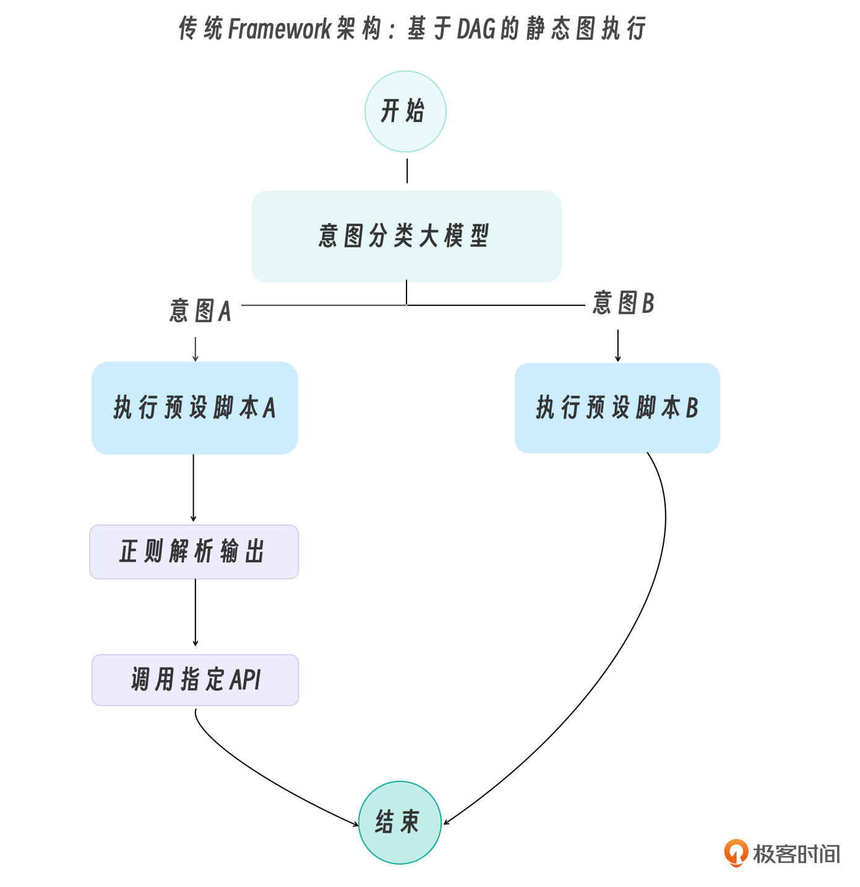
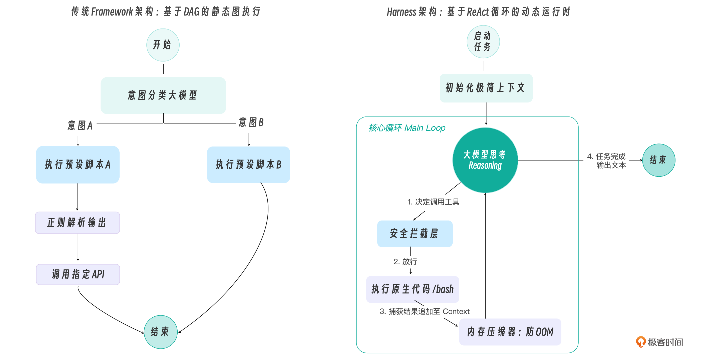
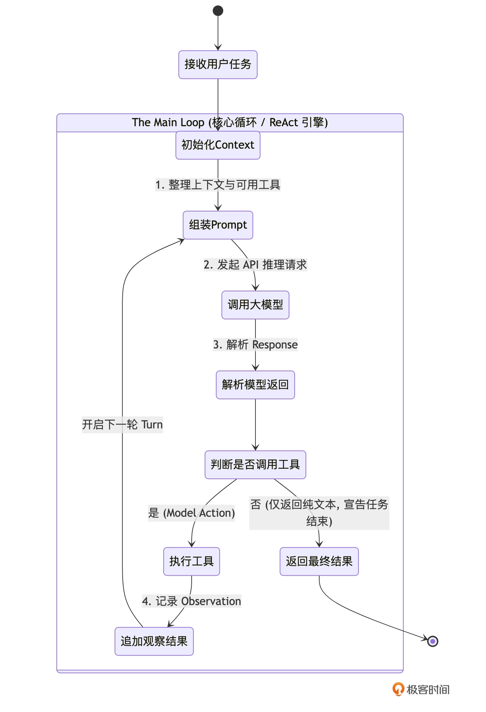
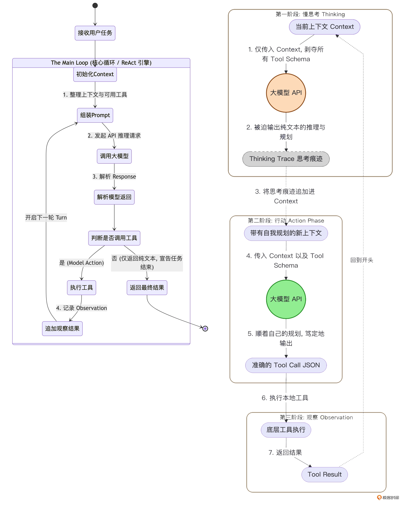
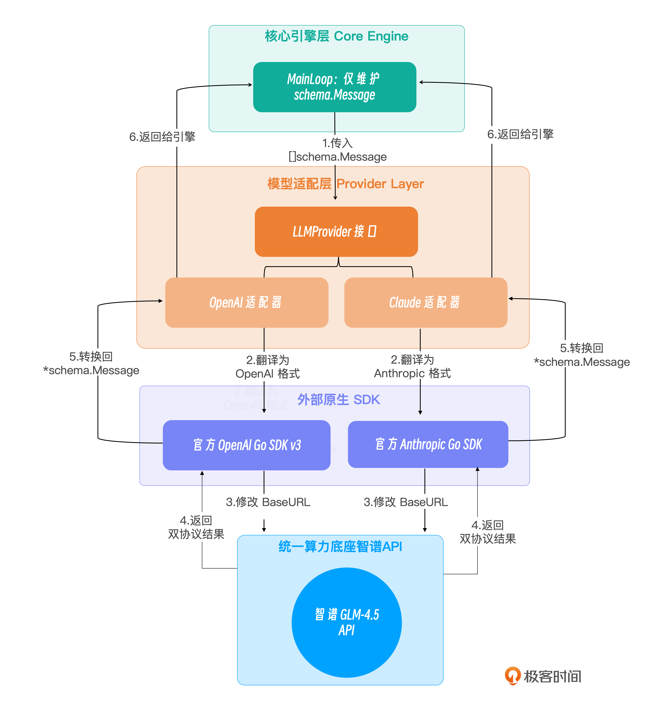
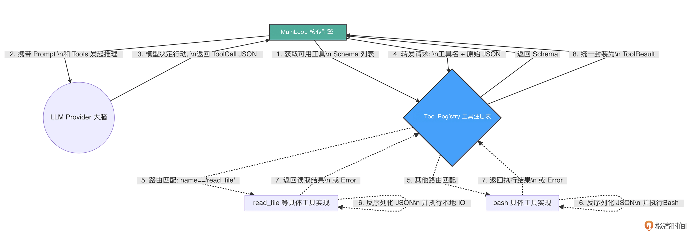
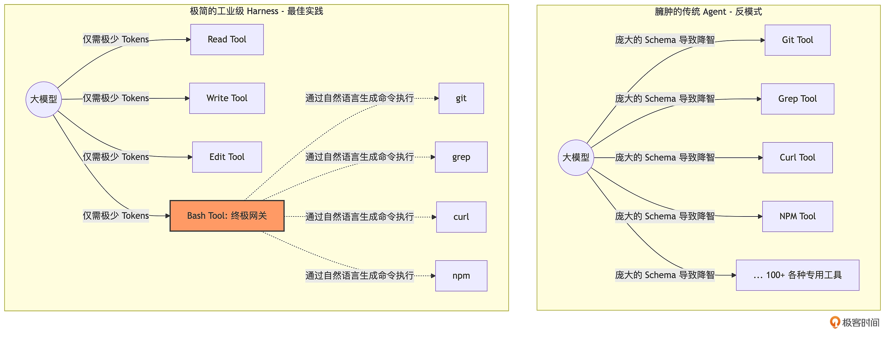
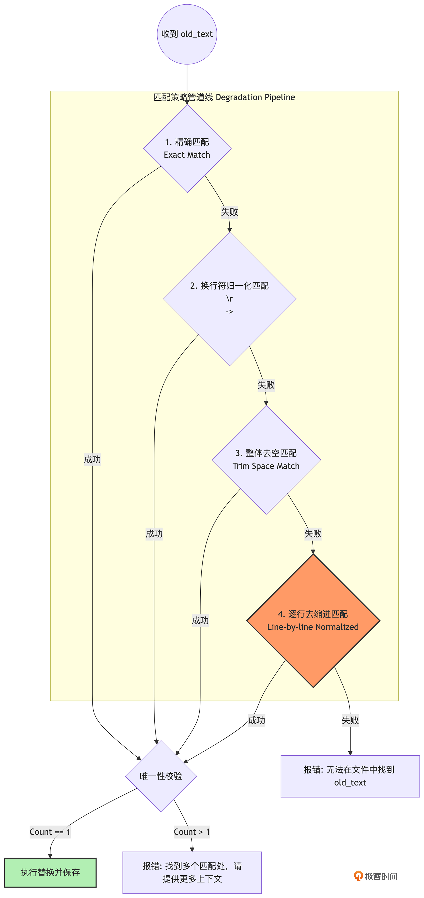

早期如 GPT-3 时代，由于模型原生缺乏强大的逻辑规划和工具调用（Function Calling）能力，开发者们发明了各种基于 “链（Chain）” 和 “有向无环图（DAG）” 的框架。

在这些框架中，逻辑是硬编码的。比如，为了完成一个“分析报错并搜索解决方案”的任务，框架会要求你这样编写代码：

1. 定义一个 ErrorAnalyzerNode。
2. 定义一个 WebSearchNode。
3. 通过代码配置一条边（Edge），规定当分析器输出特定关键词时，数据流向搜索节点。



随着 Claude 3.5 Sonnet、GPT-4o 等前沿模型的问世，大模型本身已经进化成了一个拥有极强自主规划能力的 CPU。它不需要你用代码去规定“先执行 A，再执行 B”。它只需要你给它一个包含当前状态的上下文（Context），并告诉它“这里有几个工具”，它就能自主推导出下一步该干什么。

基于这个前提，Harness（驾驭工程）应运而生。它不再是一个定义业务逻辑的图结构，而是一个极简的、动态的运行时环境（Runtime Environment）。




# 架构


**入口交互层**：引擎对外的触角。我们将支持终端命令行（CLI）输入，并将其接入飞书。更重要的是，这一层包含了人工审批（Human-in-the-loop）的异步回调机制。

**核心引擎层（心脏）**：系统的控制中枢。Main Loop 负责维持 ReAct 循环。旁边的大模型适配器是“大脑接口”，抹平不同大模型（如 Claude 和 OpenAI 兼容）底层 API 的差异。新增的 Thinking 模块则负责在行动前强制模型进行慢思考。

**上下文工程层（内存管理器）**：决定 Agent 能够跑多远的关键。

1. Prompt 动态组装器：动态拼装模块化的系统规则（如读取 AGENTS.md）。
2. Token 监控与阶梯压缩器：像 OS 的内存回收器一样，时刻盯着 Token 水位线触发压缩。
3. 运行时事件提醒注入：是防走神的利器，在模型做决定的前一刻注入干预指令。

**基于文件系统的状态与记忆**则是极简哲学的核心——抛弃内部变量，直接把进度写在本地 TODO.md 里。

**工具与执行层（四肢与手脚）**：挂载了让模型改变物理世界的组件。动态的 ToolRegistry 配合极简工具集（read/write/edit/bash），让模型组合出无限可能。强大的 Middleware 机制则死死把守大门，拦截危险命令并对接审批。


# 核心引擎层


## Main Loop

**"思考（Reason）- 行动（Act）- 观察（Observe）”无限循环**



Main Loop 的设计有几个极其鲜明的特征：

1. 极度纯粹，没有预设分支：循环中没有业务逻辑，全凭模型决定走向。
2. 不设硬性的最大步骤限制：传统的玩具框架喜欢设置 max_turns=10，但真实的工业任务可能需要 50 步。顶级引擎不在此处做生硬的截断，而是依赖Context Compaction（内存压缩） 和 System Reminders（系统级防死循环干预）来维持稳定。
3. 上下文（Context）是唯一的记忆载体：在这个循环中，数据会像滚雪球一样不断累加，记录下每一次的思考、动作和观察结果。

```go
package engine

import (
    "context"
    "fmt"
    "log"

    "github.com/yourname/go-tiny-claw/internal/provider"
    "github.com/yourname/go-tiny-claw/internal/schema"
    "github.com/yourname/go-tiny-claw/internal/tools"
)

// AgentEngine 是微型 OS 的核心驱动
type AgentEngine struct {
    provider provider.LLMProvider
    registry tools.Registry

    // WorkDir (工作区): 借鉴 OpenClaw 的理念，Agent 必须有一个明确的物理边界
    WorkDir string 
}

func NewAgentEngine(p provider.LLMProvider, r tools.Registry, workDir string) *AgentEngine {
    return &AgentEngine{
        provider: p,
        registry: r,
        WorkDir:  workDir,
    }
}

// Run 启动 Agent 的生命周期
func (e *AgentEngine) Run(ctx context.Context, userPrompt string) error {
    log.Printf("[Engine] 引擎启动，锁定工作区: %s\n", e.WorkDir)

    // 1. 初始化会话的 Context (上下文内存)
    // 在真实的场景中，这里会由动态 Prompt 组装器加载 AGENTS.md。目前我们先硬编码。
    contextHistory := []schema.Message{
        {
            Role:    schema.RoleSystem,
            Content: "You are go-tiny-claw, an expert coding assistant. You have full access to tools in the workspace.",
        },
        {
            Role:    schema.RoleUser,
            Content: userPrompt,
        },
    }

    turnCount := 0

    // 2. The Main Loop: 心跳开始 (标准的 ReAct 循环)
    for {
        turnCount++
        log.Printf("========== [Turn %d] 开始 ==========\n", turnCount)

        // 获取当前挂载的所有工具定义
        availableTools := e.registry.GetAvailableTools()

        // 向大模型发起推理请求 (包含 Reasoning)
        log.Println("[Engine] 正在思考 (Reasoning)...")
        responseMsg, err := e.provider.Generate(ctx, contextHistory, availableTools)
        if err != nil {
            return fmt.Errorf("模型生成失败: %w", err)
        }

        // 将模型的响应完整追加到上下文历史中
        contextHistory = append(contextHistory, *responseMsg)

        // 如果模型回复了纯文本，打印出来 (这通常是它的思考过程，或是最终结果)
        if responseMsg.Content != "" {
            fmt.Printf("🤖 模型: %s\n", responseMsg.Content)
        }

        // 3. 退出条件判断
        // 如果模型没有请求任何工具调用，说明它认为任务已经完成，跳出循环。
        if len(responseMsg.ToolCalls) == 0 {
            log.Println("[Engine] 任务完成，退出循环。")
            break
        }

        // 4. 执行行动 (Action) 与 获取观察结果 (Observation)
        log.Printf("[Engine] 模型请求调用 %d 个工具...\n", len(responseMsg.ToolCalls))

        for _, toolCall := range responseMsg.ToolCalls {
            log.Printf("  -> 🛠️ 执行工具: %s, 参数: %s\n", toolCall.Name, string(toolCall.Arguments))

            // 通过 Registry 路由并执行底层工具
            result := e.registry.Execute(ctx, toolCall)

            if result.IsError {
                log.Printf("  -> ❌ 工具执行报错: %s\n", result.Output)
            } else {
                log.Printf("  -> ✅ 工具执行成功 (返回 %d 字节)\n", len(result.Output))
            }

            // 将工具执行的观察结果 (Observation) 封装为 User Message 追加到上下文中
            // 注意：ToolCallID 必须携带！这是维系大模型推理链条的关键
            observationMsg := schema.Message{
                Role:       schema.RoleUser,
                Content:    result.Output,
                ToolCallID: toolCall.ID, 
            }
            contextHistory = append(contextHistory, observationMsg)
        }

        // 循环回到开头，模型将带着新加入的 Observation 继续它的下一轮思考...
    }

    return nil
}
```

> 当大模型在一个 Turn 里返回了多个 ToolCall 时，我们是通过一个 for 循环串行（Sequential）地去调用 e.registry.Execute 的。
>
> 可以将这里的工具执行改造为并行执行吗？
>
> 如果在并行执行中某个工具报错了，又该如何将所有并行的结果（Observation）按照正确的顺序组装回 Context 中？

## 慢思考

当工具可用时，模型倾向于迅速采取行动，而不是深入思考。

如何解决呢？既然提示词管不住它的“手”，那我们就用架构锁住它的“手”！驾驭工程（Harness Engineering）给出的解法是：机制决定行为。

在每一次大模型采取行动前，Harness 引擎会向它发起一次没有附带任何工具 Schema 的纯文本 API 请求。在这个绝对没有工具诱惑的“小黑屋”里，模型别无选择，只能乖乖地输出一段纯文本的深度推理与规划。

等它想清楚了，Harness 会把这段推理记录追加到上下文中，然后再发起第二次附带工具的请求，让它去执行。

这就是工业级 Agent 循环中的 Two-Stage ReAct（两阶段 ReAct 循环）。



```go
// internal/engine/loop.go (续)

func (e *AgentEngine) Run(ctx context.Context, userPrompt string) error {
    log.Printf("[Engine] 引擎启动，锁定工作区: %s\n", e.WorkDir)
    log.Printf("[Engine] 慢思考模式 (Thinking Phase): %v\n", e.EnableThinking)

    contextHistory := []schema.Message{
        {
            Role:    schema.RoleSystem,
            Content: "You are go-tiny-claw, an expert coding assistant. You have full access to tools in the workspace.",
        },
        {
            Role:    schema.RoleUser,
            Content: userPrompt,
        },
    }

    turnCount := 0

    for {
        turnCount++
        log.Printf("\n========== [Turn %d] 开始 ==========\n", turnCount)

        // 获取当前挂载的所有工具定义
        availableTools := e.registry.GetAvailableTools()

        // ====================================================================
        // Phase 1: 慢思考阶段 (Thinking) - 剥夺工具，强制规划
        // ====================================================================
        if e.EnableThinking {
            log.Println("[Engine][Phase 1] 剥夺工具访问权，强制进入慢思考与规划阶段...")

            // 核心机制：传入的 availableTools 为 nil！
            // 大模型看不到任何 JSON Schema，被迫只能输出纯文本的思考过程。
            thinkResp, err := e.provider.Generate(ctx, contextHistory, nil)
            if err != nil {
                return fmt.Errorf("Thinking 阶段生成失败: %w", err)
            }

            // 如果模型输出了思考过程，我们将其作为 Assistant 消息追加到上下文中
            if thinkResp.Content != "" {
                fmt.Printf("🧠 [内部思考 Trace]: %s\n", thinkResp.Content)
                contextHistory = append(contextHistory, *thinkResp)
            }
        }

        // ====================================================================
        // Phase 2: 行动阶段 (Action) - 恢复工具，顺着规划执行
        // ====================================================================
        log.Println("[Engine][Phase 2] 恢复工具挂载，等待模型采取行动...")

        // 此时的 contextHistory 中已经包含了上一阶段模型自己的 Thinking Trace。
        // 模型会顺着自己的逻辑，结合恢复的 availableTools 发起精准的工具调用。
        actionResp, err := e.provider.Generate(ctx, contextHistory, availableTools)
        if err != nil {
            return fmt.Errorf("Action 阶段生成失败: %w", err)
        }

        contextHistory = append(contextHistory, *actionResp)

        if actionResp.Content != "" {
            fmt.Printf("🤖 [对外回复]: %s\n", actionResp.Content)
        }

        // ====================================================================
        // 退出与执行逻辑 (与上一讲保持一致)
        // ====================================================================
        if len(actionResp.ToolCalls) == 0 {
            log.Println("[Engine] 模型未请求调用工具，任务宣告完成。")
            break
        }

        log.Printf("[Engine] 模型请求调用 %d 个工具...\n", len(actionResp.ToolCalls))

        for _, toolCall := range actionResp.ToolCalls {
            log.Printf("  -> 🛠️ 执行工具: %s, 参数: %s\n", toolCall.Name, string(toolCall.Arguments))

            result := e.registry.Execute(ctx, toolCall)

            if result.IsError {
                log.Printf("  -> ❌ 工具执行报错: %s\n", result.Output)
            } else {
                log.Printf("  -> ✅ 工具执行成功 (返回 %d 字节)\n", len(result.Output))
            }

            // 将工具执行的观察结果追加到 Context，准备进入下一轮
            observationMsg := schema.Message{
                Role:       schema.RoleUser,
                Content:    result.Output,
                ToolCallID: toolCall.ID,
            }
            contextHistory = append(contextHistory, observationMsg)
        }
    }

    return nil
}
```

> 目前在 AgentEngine 中引入的 EnableThinking 是一个静态的全局开关。只要在启动时传了 true，大模型在未来的几十轮（Turn）交互中，每一轮都必须先被关进“小黑屋”强制做一次纯文本的推理与规划（Phase 1），然后再去执行动作（Phase 2）。


## Provider

不同大模型厂商的 API 数据结构存在巨大差异。特别是涉及 Function Calling（工具调用）和上下文组装时，OpenAI 生态和 Anthropic（Claude）生态是两套截然不同的标准。

通过设计优雅的 Provider 抽象层，完美隔离这种差异。




# 工具与执行层

## Tool Registry

在 Harness（驾驭工程）的理念中，Main Loop 永远是“瞎子”和“聋子”。它不应该知道 bash 命令怎么调用，也不应该知道 read_file 需要什么参数格式。它只负责维护上下文，并将模型吐出来的 JSON 字符串丢给执行层。

因此，Tool Registry 扮演了一个极其关键的“集线器（Hub）”和“路由器（Router）”的角色。它的核心职责有三：

1. 动态挂载（Register）：允许开发者在引擎启动时，随时随地向系统插拔新的工具实现。
2. 描述暴露（Expose Schema）：在每次向大模型发起推理前，Registry 负责把当前所有已挂载工具的名称、描述以及 JSON Schema 打包成列表，交给 Provider 翻译给大模型听。
3. 路由分发与执行（Dispatch & Execute）：当大模型决定调用某个工具，并吐出一串 JSON 参数（ToolCall）时，Registry 负责找到对应的 Go 函数，把 JSON 丢给它执行，最后将结果封装成统一的 ToolResult 返回给 Main Loop。



## 极简工具

既然拥有了如此强大的动态注册机制，按照常规的开发惯例，下一步我们是不是应该开始疯狂地给 Agent 编写各种专用的业务工具了？比如：写一个 git_commit 工具，写一个 npm_install 工具，写一个 grep_search 工具，或者引入当下大火的 MCP（Model Context Protocol）协议，把几百个第三方 API 一股脑地挂载给模型？

如果你真的打算这么做，那么你的 Agent 离“智障”和“破产”也就不远了。

这会带来三个致命的后果：

1. 极高的成本与延迟：仅仅为了问一句“帮我看看 main.go 的代码”，你就要向大模型发送 3 万个 Token 的前置工具描述。每次 API 请求的时间和金钱成本呈指数级上升。
2. 注意力分散：这是最致命的。大模型的核心机制是注意力（Attention）。工具描述越多，大模型对核心任务指令的注意力就越弱。它非常容易发生幻觉（Hallucination），在几十个长得差不多的工具中调用了错误的那一个。
3. 无尽的适配维护：你每加一个特定的专用工具（比如 search_jira_ticket），就要在 Go 引擎里维护一套繁琐的反序列化和 API 请求代码。一旦第三方接口变更，Agent 直接罢工。


既然我们把 Agent 当作一个跑在本地工作区（Workspace）的工作流助手，那么它面对的环境就是操作系统的终端和文件系统。我们完全不需要为 git、grep、npm 单独写工具，因为操作系统里已经有了一个终极接口——Shell（Bash）。

在 OpenClaw / pi 的极简哲学中，仅需为大模型提供 4 个基础工具：

1. read：读取文件内容（获取环境信息）。
2. write：创建新文件或完全覆盖文件。
3. edit：精准的局部代码替换。
4. bash：在当前工作区执行任意 Shell 命令（终极执行器）。



> 大模型可以通过它生成新的代码文件。在 Harness 设计中，工具必须将作用域严格限制在引擎注入的 workDir 中。


假设你的代码库里有一个长达 2000 行的 server.go 文件。你让 Agent 去修复其中第 543 行的一个空指针逻辑 Bug。

Agent 读懂了代码，它知道怎么改。但接下来，它应该如何把改动落回磁盘？

* 如果用 write_file，它必须把这 2000 行代码完整地重新生成一遍。这不仅极其消耗 API Token（既慢又贵），而且大模型在长文本生成中极易发生截断或引入新的语法错误。

* 如果用 bash，大模型需要手写一段极其复杂的 sed 或 awk 正则表达式。但经验表明，大模型在处理包含特殊转义字符的多行正则表达式时，翻车率高达 80% 以上，极易把整个文件搞坏。

> 使用专属的 edit_file（代码编辑）工具。

对于一个理想的 edit 工具，它的 JSON Schema 应该非常简单：提供 path（文件路径）、old_text（你要替换的旧代码）和 new_text（新代码）。

如果用 Go 语言的思路，底层实现无非就是一句 strings.Replace(fileContent, oldText, newText, 1)。但在 AI Agent 的世界里，绝对不能这么写。

大模型在输出 old_text 时，经常会犯一种极其顽固的错误——格式幻觉。大模型在返回的 JSON 工具参数中，为了节省字数或者受限于其内部的注意力机制，它吐出的 old_text 很可能是去掉了缩进的。

顶级引擎（如 Claude Code/OpenClaw）是如何解决这个问题的？答案是：**把容错做在底层工具里，吸收大模型的误差。**



在这套多级匹配的管道线中：

* 级别 1：最快最安全的精确匹配。
* 级别 2：解决不同操作系统（Windows vs Unix）换行符导致的幻觉。
* 级别 3：忽略整个代码块首尾的多余空行。
* 级别 4（核心容错）：将 old_text 和原始文件都按行切分，去掉每一行的首尾空格（消除缩进差异），然后再进行比对。
* 最关键的安全底线是“唯一性校验”：模糊匹配可能会导致匹配到代码里多个相似的片段。如果匹配结果 > 1，工具绝对不能盲目替换，而是必须抛出错误，要求大模型提供更多的上下行代码以精确定位。

> 思考：如果在匹配到目标行的同时，我们要提取出目标行原来的“基础缩进前缀（Base Indentation）”，并将其自动补齐到 newText 的每一行前面，如何在现有的 lineByLineReplace 中进行代码优化？