## 死锁

死锁是指两个或两个以上的线程（或进程）在运行过程中，因为资源竞争而造成相互等待的现象，若无外力作用则不会解除等待状态，它们之间的执行都将无法继续下去。

Java 死锁产生的四个必要条件：

1. 互斥条件，即当资源被一个线程使用（占有）时，别的线程不能使用
2. 不可剥夺条件，资源请求者不能强制从资源占有者手中夺取资源，资源只能由资源占有者主动释放
3. 请求和保持条件，即当资源请求者在请求其他的资源的同时保持对原有资源的占有
4. 循环等待条件，即存在一个等待循环队列：p1 要 p2 的资源，p2 要 p1 的资源，形成了一个等待环路


定位死锁：

通过`jps+jstack`工具排查：`jps` + `jstack -l <PID>`

通过`jconsole`工具排查：首先按`win+r`调出运行窗口，然后输入`JConsole`命令

Linux 下可以通过 top 先定位到 CPU 占用高的 Java 进程，再利用 `top -Hp 进程id` 来定位是哪个线程，最后再用 jstack 的输出来看各个线程栈


## synchronized

Java 中的每一个对象都可以作为锁。 具体表现为以下 3 种形式：

1. 对于普通同步方法，锁是当前实例对象。 
2. 对于静态同步方法，锁是当前类的 Class 对象。 
3. 对于同步代码块，锁是 synchonized 括号里配置的对象。

注意：

* 当一个线程正在访问一个被`synchronized`修饰的实例方法时，其他线程则不能访问该对象的其他被`synchronized`修饰的对象实例方法，毕竟一个对象只有一把锁，当一个线程获取了该对象的锁之后，其他线程无法获取该对象的锁，所以无法访问该对象的其他被`synchronized`修饰的对象实例方法。

* 如果一个线程`A`，调用一个被`synchronized`修饰的普通实例方法；而线程`B`通过这个实例对象，调用被`synchronized`修饰的`static`方法，这是允许同时执行的，并不会发生互斥现象。因为访问静态`synchronized`方法的线程，获取的是当前类的`class`对象的锁资源；而访问非静态`synchronized`方法的线程，获取的是当前实例对象锁资源。


### 对象头

在`JVM`中，一个`Java`对象在内存的布局，会分为三个区域：对象头、实例数据、对齐填充。

synchronized 用的锁是存在 Java 对象头里的。如果对象是数组类型，则虚拟机用 3个字宽存储对象头（额外存储数组长度），如果对象是非数组类型，则用 2 字宽存储对象头。在 32 位虚拟机中，1 字宽等于 4 字节，即 32bit；64位虚拟机下，一个字宽大小为 8 字节。

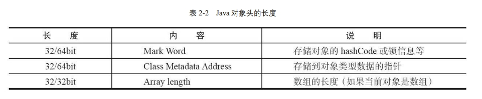

Java 对象头里的 Mark Word 里默认存储对象的 HashCode、分代年龄和锁标记位。在运行期间，Mark Word 里存储的数据会随着锁标志位的变化而变化：

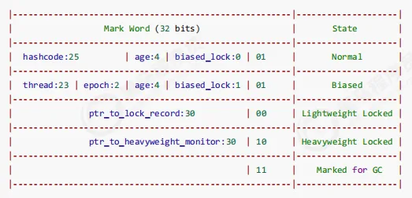

当状态为偏向锁时，Mark Word存储的是偏向的线程ID。

当状态为轻量级锁时，Mark Word 存储的是指向线程栈中 LockRecord 的指针。`LockRecord`是什么呢？由于`MarkWord`的空间有限，随着对象状态的改变，原本存储在对象头里的一些信息，如`HashCode`、对象年龄等，就没有足够的空间存储。这时为了保证这些数据不丢失，就会拷贝一份原本的`MarkWord`放到线程栈中，这个拷贝过去的`MarkWord`叫作`Displaced Mark Word`，同时会配合一个指向对象的指针，形成`LockRecord`（锁记录），而原本对象头中的`MarkWord`，就只会存储一个指向`LockRecord`的指针。

当状态为重量级锁时，Mark Word 存储的是指向`monitor`对象的指针。


### Monitor

每个 Java 对象都可以关联一个 Monitor 对象，如果使用 synchronized 给对象上锁（重量级）之后，该对象头的Mark Word 中就被设置指向 Monitor 对象的指针。

JVM 基于进入和退出 Monitor 对象来实现方法同步和代码块同步，代码块同步是使用 monitorenter 和 monitorexit 指令实现的，而同 步方法则是依靠方法修饰符上的 ACC_SYNCHRONIZED 来完成的。无论采用哪种方式，其本质是对一个对象的监视器（monitor）进行获取，而这个获取过程是排他的，也就是同一时刻只能有一个线程获取到由 synchronized 所保护对象的监视器。

```java
public class Concurrency {
    public static void main(String[] args) {
        // 对 Synchronized Class 对象进行加锁
        synchronized (Synchronized.class) {
        }
        // 静态同步方法，对 Synchronized Class 对象进行加锁
        m();
    }
    public static synchronized void m() {
    }
}
```

编译以上代码，然后在 Concurrency.class 同级目录执行 javap –v Concurrency.class，部分相关输出如下所示：

```java
public static void main(java.lang.String[]);
     flags: ACC_PUBLIC, ACC_STATIC // 方法修饰符，表示：public static
     Code:
     stack=2,locals=1,args_size=1
     0:ldc #2 // class lombok/Synchronized
     2:dup
     3:monitorenter // monitorenter：监视器进入，获取锁
     4:monitorexit // monitorexit：监视器退出，释放锁
     15: invokestatic #3 // Method m:()V
     8:return
public static synchronized void m(); 
     flags:ACC_PUBLIC,ACC_STATIC,ACC_SYNCHRONIZED // 表示： public static synchronized
     Code:
     stack=0,locals=0,args_size=0 0:return
```


在`HotSpot`虚拟机中，`monitor`是由`ObjectMonitor`实现的。`monitor`本质就是存在于堆中的特殊对象。

```c++
ObjectMonitor() {
    _header       = NULL; //markOop对象头
    _count        = 0; //记录个数
    _waiters      = 0, //等待线程数
    _recursions   = 0; //重入次数
    _object       = NULL; //监视器锁寄生的对象。锁不是平白出现的，而是寄托存储于对象中。
    _owner        = NULL;  //指向获得ObjectMonitor对象的线程或基础锁
    _WaitSet      = NULL; //处于wait状态的线程，会被加入到_WaitSet
    _WaitSetLock  = 0 ; 
    _Responsible  = NULL;
    _succ         = NULL;
    _cxq          = NULL;
    FreeNext      = NULL;
    _EntryList    = NULL; //处于等待锁block状态的线程，会被加入到该列表
    _SpinFreq     = 0 ;
    _SpinClock    = 0 ;
    OwnerIsThread = 0 ; // _owner is (Thread *) vs SP/BasicLock
    _previous_owner_tid = 0; // 监视器前一个拥有者线程的ID
}
```


`owner`指向持有`Monitor`对象的线程

当多个线程同时访问一段同步代码时，首先会加入`EntryList`集合，当线程获取到对象的`monitor`后进入`Owner`区域，并把`monitor`中的`owner`变量设置为当前线程，同时`monitor`中的计数器`count+1`。

若线程调用 `wait` 方法，将释放当前持有的`monitor`，`owner`变量恢复为`null`，`count`自减`1`，同时该线程进入`WaitSet`集合中等待被唤醒。调用 `notify` 或者 `notifyAll` 之后又会进入`EntryList`竞争锁

若当前线程执行完毕，也将释放`monitor`(锁)并复位变量的值，以便其他线程进入获取`monitor`。


### 锁膨胀

锁一共有 4 种状态，级别从低到高依次是：无锁状态、偏向锁状态、轻量级锁状态和重量级锁状态，这几个状态会随着竞争情况逐渐升级。锁可以升级但不能降级，意味着偏向锁升级成轻量级锁后不能降级成偏向锁。这种锁升级却不能降级的策略，目的是为了提高获得锁和释放锁的效率。

#### 偏向锁

大多数情况下，锁不仅不存在多线程竞争，而且总是由同一线程多次获得，为了让线程获得锁的代价更低而引入了偏向锁。

当一个线程访问同步块并获取锁时，会在对象头和栈帧中的锁记录里存储锁偏向的线程 ID，以后该线程在进入和退出同步块时不需要进行 CAS 操作来加锁和解锁，只需简单地测试一下对象头的 Mark Word 里是否存储着指向当前线程的偏向锁。如果测试成功，表示线程已经获得了锁。如果测试失败，则需要再测试一下 Mark Word 中偏向锁的标识是否设置成 1 （表示当前是偏向锁）：如果没有设置，则使用 CAS 竞争锁；如果设置了，则可能会产生偏向撤销，重新偏向当前线程，但大部分情况下，就是直接膨胀成轻量级锁了。


**偏向锁的撤销**：

偏向锁使用了一种等到竞争出现才释放锁的机制，所以当其他线程尝试竞争偏向锁时，持有偏向锁的线程才会释放锁。

1. 在一个安全点（在这个时间点上没有正在执行的字节码）停下拥有锁的线程；

2. 遍历线程栈，如果存在锁记录的话，需要修复锁记录和Mark Word，使其变成无锁状态。

3. 唤醒当前线程，将当前锁升级成轻量级锁。

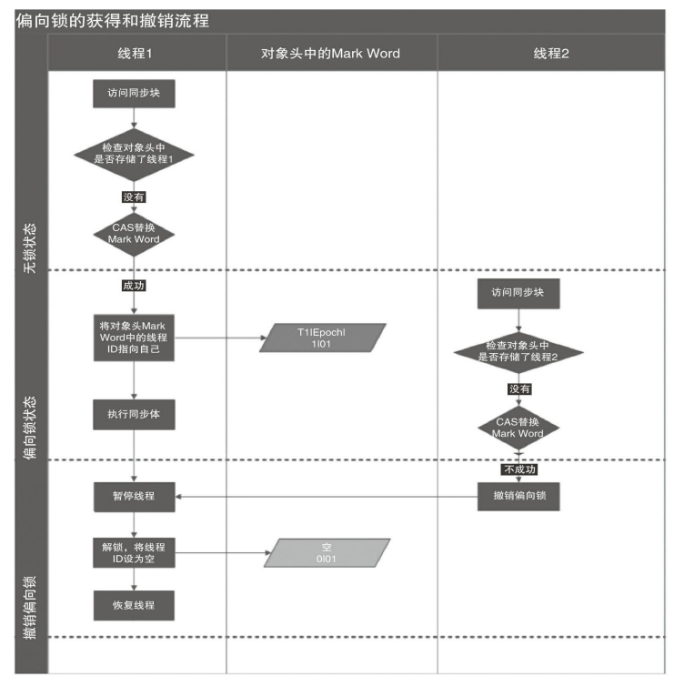

**关闭偏向锁**：

偏向锁是默认是延迟的，不会在程序启动时立即生效，如果想避免延迟，可以加 VM 参数 `-XX:BiasedLockingStartupDelay=0` 来禁用延迟。JDK 8 延迟 4s 开启偏向锁原因：在刚开始执行代码时，会有好多线程来抢锁，如果开偏向锁就会造成偏向锁不断的进行锁撤销和锁升级的操作，效率反而降低。

禁用偏向锁，运行时在添加 VM 参数 `-XX:-UseBiasedLocking=false` 禁用偏向锁。


#### 轻量级锁

线程在执行同步块之前，JVM 会先在当前线程的栈桢中创建用于存储锁记录的空间，并将对象头中的 Mark Word 复制到锁记录中，称为 `Displaced Mark Word`。然后线程尝试使用 CAS 将对象头中的 Mark Word 替换为指向锁记录的指针。如果成功，当前线程获得锁，如果失败，表示其他线程竞争锁，当前线程便尝试使用自旋来获取锁。如果自旋（默认10次）后还未等到锁，则说明目前竞争较重，需要膨胀为重量级锁。


轻量级解锁时，会使用原子的 CAS 操作将 Displaced Mark Word 替换回到对象头， 如果成功，则表示没有竞争发生。如果失败，表示当前锁存在竞争，锁就会膨胀成重量级锁。

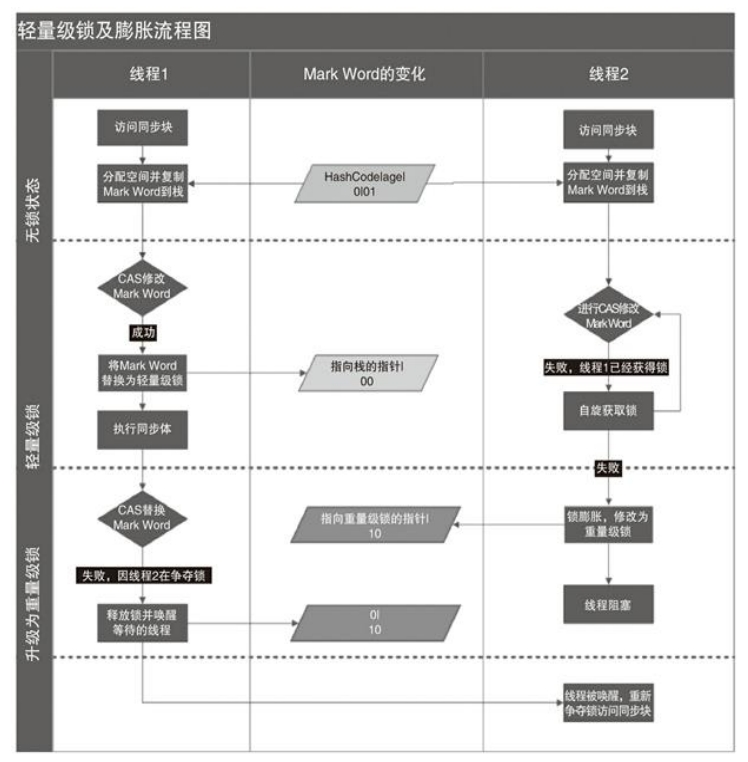


#### 重量级锁

当出现较大竞争，锁膨胀为重量级锁时，对象头的`markword`指向堆中的`monitor`。

注意：

当调用一个锁对象的`wait、notify`方法时，如当前锁的状态是偏向锁或轻量级锁，则会先膨胀成重量级锁，因为`wait、notify`方法要依赖于`Monitor`对象实现。


| 锁       | 优点                                                         | 缺点                                           | 适用场景                               |
| -------- | ------------------------------------------------------------ | ---------------------------------------------- | -------------------------------------- |
| 偏向锁   | 加锁解锁不需要额外消耗，和执行非同步方法相比仅存在纳秒级差距 | 如果线程间存在锁竞争，会带来额外的锁撤销的消耗 | 适用于只有一个线程访问同步块场景       |
| 轻量级锁 | 竞争的线程不会阻塞，提高了响应速度                           | 始终得不到锁的线程，使用自旋会消耗CPU          | 追求响应时间，同步块执行时长很短的场景 |
| 重量级锁 | 线程竞争不会使用自旋，不会消耗CPU                            | 线程阻塞，响应时间慢                           | 追求吞吐量，同步块执行速度较慢         |


### JVM对Synchornized的优化

锁膨胀/锁升级、锁消除、锁粗话、自适应自旋锁


**锁消除**：

锁消除是指对于被检测出不可能存在竞争的共享数据的锁进行消除，这是 JVM 即时编译器的优化。

锁消除主要是通过逃逸分析来支持，如果堆上的共享数据不可能逃逸出去被其它线程访问到，那么就可以把它们当成私有数据对待，也就可以将它们的锁进行消除。


**锁粗化**：

对相同对象多次加锁，导致线程发生多次重入，频繁的加锁操作就会导致性能损耗，可以使用锁粗化方式优化。

如果虚拟机探测到一串的操作都对同一个对象加锁，将会把加锁的范围扩展（粗化）到整个操作序列的外部。


**自适应自旋锁**：

线程空循环的次数并非固定的，而是会动态根据实际情况来改变自旋等待的次数。


### 等待唤醒机制

等待唤醒机制指的是`notify/notifyAll`和`wait`方法，在使用这三个方法时，必须处于`synchronized`代码块或者`synchronized`方法中，否则就会抛出`IllegalMonitorStateException`异常。

这是因为调用这几个方法前，必须拿到当前对象的监视器`monitor`对象，也就是说`notify、notifyAll、wait`方法依赖于`monitor`对象。`monitor`依靠对象头的`MarkWord`中的指针来寻址，而`synchronized`关键字决定着一个`Java`对象，会不会生成`monitor`对象。这也就是为什么`notify、notifyAll、wait`方法，必须在`synchronized`代码块或者`synchronized`方法调用的原因。


**`sleep(long n)` 和 `wait(long n)` 的区别**：

1.  sleep 是 Thread 方法，而 wait 是 Object 的方法 。

2.  sleep 不需要强制和 synchronized 配合使用，但 wait 需要和 synchronized 一起用 。

3.  sleep 方法没有释放锁，而 wait 方法释放了锁。

4.  sleep进入 TIMED_WAITING，wait进入 WAITING 或 TIMED_WAITING 状态。

5.  wait 通常被用于线程间交互/通信，sleep通常被用于暂停执行。

6.  wait 方法被调用后，线程不会自动苏醒，需要别的线程调用同一个对象上的 `notify()`或者 `notifyAll()` 方法。sleep方法执行完成后，线程会自动苏醒，或者也可以使用 `wait(long timeout)` 超时后线程会自动苏醒。


## Java内存模型

Java内存模型（JMM）定义了Java程序中多线程访问主存和工作内存的规范，确保多线程并发访问时的可见性、有序性和原子性。

线程之间的共享变量存储在主内存（Main Memory）中，每个线程都有一个私有的本地内存（Local Memory），本地内存中存储了该线程以读/写共享变量的副本。本地内存是 JMM 的一个抽象概念，并不真实存在，它涵盖了缓存、写缓冲区、寄存器以及其他的硬件和编译器优化。


### 三大特性

**可见性**

指当多个线程访问同一个变量时，一个线程修改了这个变量的值，其他线程能够立即看得到修改的值。

单线程程序不会出现内存可见性问题。但在多线程环境中可就不一定了，由于线程对共享变量的操作，都是拷贝到各自的工作内存运算的，运算完成后才刷回主内存中。另外指令重排以及编译器优化也可能导致可见性问题。

使用加锁或者`Volatile`关键字保证可见性。

**原子性**

一个或者多个操作在 CPU 执行的过程中不被中断的特性称为原子性。

在 Java 中，可以借助`synchronized`、各种 `Lock` 以及各种原子类实现原子性。

**有序性**

JMM 允许编译器和 CPU 优化指令顺序，但通过内存屏障机制和 `volatile` 等关键字可以保证线程间的执行顺序。

`happens-before` 规则来保证原子性、可见性以及有序性。


### volatile

volatile 在多处理器开发中保证了共享变量的**可见性**。可见性的意思是当一个线程修改一个共享变量时，另外一个线程能读到这个修改的值。**主要作用是保证可见性和禁止指令重排优化。**


为了提高处理速度，处理器不直接和内存进行通信，而是先将系统内存的数据读到内部缓存后再进行操作，但操作完不知道何时会写到内存。如果对声明了 volatile 的变量进行写操作，JVM 就会向处理器发送一条 Lock 前缀的指令，将这个变量所在缓存行的数据写回到系统内存。但是，就算写回到内存，如果其他处理器缓存的值还是旧的，再执行计算操作就会有问题。所以，在多处理器下，为了保证各个处理器的缓存是一致的，就会实现缓存一致性协议，每个处理器通过嗅探在总线上传播的数据来检查自己缓存的值是不是过期了，当处理器发现自己缓存行对应的内存地址被修改，就会将当前处理器的缓存行设置成无效状态，当处理器对这个数据进行修改操作的时候，会重新从系统内存中把数据读到处理器缓存里。

使用 volatile 修饰的共享变量，底层通过汇编 lock 前缀指令进行缓存锁定：

1. 将当前处理器（线程）缓存行的数据写回到系统内存。
2. 这个写回内存的操作会使在其他 CPU 里缓存了该内存地址的数据无效。


当写一个 volatile 变量时，JMM 会把该线程对应的本地内存中的共享变量值刷新到主内存。

当读一个 volatile 变量时，JMM 会把该线程对应的本地内存置为无效。线程接下来将从主内存中读取共享变量。


volatile重排序规则：

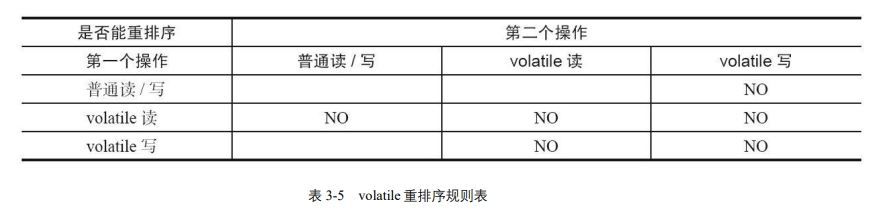

* 当第二个操作是 volatile 写时，不管第一个操作是什么，都不能重排序。这个规则确保 volatile 写之前的操作不会被编译器重排序到 volatile 写之后。 
* 当第一个操作是 volatile 读时，不管第二个操作是什么，都不能重排序。这个规则确保 volatile 读之后的操作不会被编译器重排序到 volatile 读之前。 


synchronized 无法禁止指令重排和处理器优化，为什么可以保证有序性可见性？

1. 加了锁之后，只能有一个线程获得到了锁，获得不到锁的线程就要阻塞，所以同一时间只有一个线程执行，相当于单线程，由于数据依赖性的存在，单线程的指令重排是没有问题的

2. 线程加锁前，将清空工作内存中共享变量的值，使用共享变量时需要从主内存中重新读取最新的值；线程解锁前，必须把共享变量的最新值刷新到主内存中


### 锁

当线程释放锁时，JMM 会把该线程对应的本地内存中的共享变量刷新到主内存中。

当线程获取锁时，JMM 会把该线程对应的本地内存置为无效。从而使得被监视器保护的临界区代码必须从主内存中读取共享变量。

线程 A 释放锁，随后线程 B 获取这个锁，这个过程实质上是线程 A 通过主内存 向线程 B 发送消息。


ReentrantLock 的实现依赖于 Java 同步器框架 AbstractQueuedSynchronizer（ AQS）。AQS 使用一个整型的 volatile 变量（命名为 state）来维护同步状态。

公平锁和非公平锁释放时，最后都要写一个 volatile 变量 state。 

公平锁获取时，首先会去读 volatile 变量。 

非公平锁获取时，首先会用 CAS 更新 volatile 变量，这个操作同时具有 volatile 读 和 volatile 写的内存语义。

根据 volatile 的 happens- before 规则，释放锁的线程在写 volatile 变量之前可见的共享变量，在获取锁的线程读取同一个 volatile 变量后将立即变得对获取锁的线程可见。

### final

对于 final 域，编译器和处理器要遵守两个重排序规则：

1. 在构造函数内，编译器不能将 `final` 域的赋值操作重排序到构造函数之外。
2. 在构造函数外，读取包含 `final` 域的对象引用和读取该对象的 `final` 域之间不能重排序。这意味着当一个线程获得一个对象引用时，它能够立即读取到 `final` 域的值。

这两个重排序规则确保：

1. 构造函数在初始化 `final` 域后才发布对象引用，避免线程看到未初始化的 `final` 值。
2. 线程在获得对象引用后，能够立即看到 `final` 域的正确值，避免由于重排序导致读取到错误的 `final` 值。

### happens-before 规则

happens-before 原则的诞生是为了程序员和编译器、处理器之间的平衡。只要不改变程序的执行结果（单线程程序和正确执行的多线程程序），编译器和处理器怎么进行重排序优化都行。对于会改变程序执行结果的重排序，JMM 要求编译器和处理器必须禁止这种重排序。

如果 A happens-before B，那么 Java 内存模型将向程序员保证——A 操作的结果将对 B 可见，且 A 的执行顺序排在 B 之前。

happens-before规则：

1. 程序顺序原则：指在一个线程内，按照程序顺序，前面的操作对后续的任意操作可见。
2. 监视器锁规则：解锁于后续对这个锁的加锁可见。
3. volatile 变量规则：对一个 volatile 变量的写操作相对于后续对这个 volatile 变量的读操作可见。
4. 传递性规则：指如果 A Happens-Before B，且 B Happens-Before C，那么 A Happens-Before C。
5. 线程 start() 规则：指主线程 A 启动子线程 B 后，子线程 B 能够看到主线程A在启动子线程 B 前的操作。
6. 线程 join() 规则：指主线程 A 等待子线程 B 完成（主线程 A 通过调用子线程 B 的 join() 方法），当子线程 B 完成后（主线程 A 中 join() 方法返回），主线程能够看到子线程B的操作。


### 双检锁单例模式

```java
public class Singleton {
    private volatile static Singleton uniqueInstance;

    private Singleton() {
    }

    public  static Singleton getUniqueInstance() {
       //先判断对象是否已经实例过，没有实例化过才进入加锁代码
        if (uniqueInstance == null) {
            //类对象加锁
            synchronized (Singleton.class) {
                if (uniqueInstance == null) {
                    uniqueInstance = new Singleton();
                }
            }
        }
        return uniqueInstance;
    }
}
```

采用 `volatile` 关键字修饰也是很有必要的，`uniqueInstance = new Singleton();` 这段代码其实是分为三步执行：

1. 为 `uniqueInstance` 分配内存空间
2. 初始化 `uniqueInstance`
3. 将 `uniqueInstance` 指向分配的内存地址

但是由于 JVM 具有指令重排的特性，执行顺序有可能变成 1->3->2。指令重排在单线程环境下不会出现问题，但是在多线程环境下会导致一个线程获得还没有初始化的实例。例如，线程 T1 执行了 1 和 3，此时 T2 调用 `getUniqueInstance`() 后发现 `uniqueInstance` 不为空，因此返回 `uniqueInstance`，但此时 `uniqueInstance` 还未被初始化。


## Java线程

进程是程序的一次执行过程，是系统运行程序的基本单位，进程是动态的。

线程与进程相似，但线程是一个比进程更小的执行单位。一个进程在其执行的过程中可以产生多个线程。线程共享进程的堆和方法区资源，但每个线程有自己的程序计数器、虚拟机栈和本地方法栈，线程也被称为轻量级进程。


### 线程状态

| 线程状态                   | 导致状态发生条件                                             |
| -------------------------- | ------------------------------------------------------------ |
| NEW（初始）                | 线程刚被创建，但是并未启动，还没调用 start 方法，只有线程对象，没有线程特征 |
| Runnable（运行）           | Java线程将操作系统的就绪和运行状态合并。调用了 t.start() 方法 |
| Blocked（阻塞）            | 当一个线程试图获取一个对象锁，而该对象锁被其他的线程持有，则该线程进入 Blocked 状态 |
| Waiting（等待）            | 一个线程在等待另一个线程执行一个（唤醒）动作时，该线程进入 Waiting 状态，进入这个状态后不能自动唤醒，必须等待另一个线程调用 notify 或者 notifyAll 方法才能唤醒。在这种状态下，线程将不会消耗CPU资源 |
| Timed Waiting （超时等待） | 有几个方法有超时参数，调用将进入 Timed Waiting 状态，这一状态将一直保持到超时期满或者接收到唤醒通知。带有超时参数的常用方法有 Thread.sleep 、Object.wait |
| Teminated（终止）          | run 方法正常退出而死亡，或者因为没有捕获的异常终止了 run 方法而死亡 |

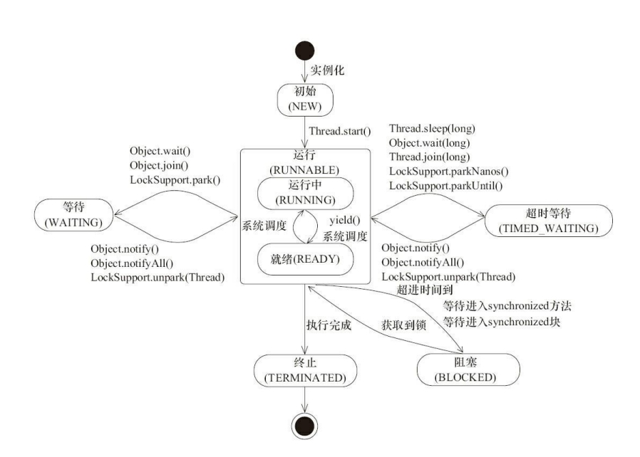

**NEW --> RUNNABLE**：

当调用 t.start() 方法时，由 NEW → RUNNABLE

**RUNNABLE <--> WAITING**：

1. t 线程用 `synchronized(obj)` 获取了对象锁后，

   1. 调用 obj.wait() 方法时： RUNNABLE --> WAITING 

   2. 调用 obj.notify()、obj.notifyAll()、t.interrupt()：

      1. 竞争锁成功，t 线程从 WAITING → RUNNABLE

      2. 竞争锁失败，t 线程从 WAITING → BLOCKED

2. 当前线程调用 t.join() 方法时，**当前线程**从 RUNNABLE --> WAITING ；t 线程运行结束，或调用了当前线程的 interrupt() 时，当前线程从 WAITING --> RUNNABLE

3. 当前线程调用 LockSupport.park() 方法会让**当前线程**从 RUNNABLE --> WAITING ；调用 LockSupport.unpark(目标线程) 或调用了线程 的 interrupt() ，会让目标线程从 WAITING -->RUNNABLE 

**RUNNABLE <--> TIMED_WAITING**：

1. t 线程用 synchronized(obj) 获取了对象锁后 ，

   1. 调用 obj.wait(long n) 方法时，t 线程从 RUNNABLE --> TIMED_WAITING 

   2. t 线程等待时间超过了 n 毫秒，或调用 obj.notify() ， obj.notifyAll() ， t.interrupt() 时 

      1. 竞争锁成功，t 线程从TIMED_WAITING --> RUNNABLE 

      2. 竞争锁失败，t 线程从TIMED_WAITING --> BLOCKED

2. 当前线程调用 t.join(long n) 方法时，**当前线程**从 RUNNABLE --> TIMED_WAITING ; 当前线程等待时间超过了 n 毫秒，或t 线程运行结束，或调用了当前线程的 interrupt() 时，当前线程从 TIMED_WAITING --> RUNNABLE

3. 当前线程调用 Thread.sleep(long n) ，**当前线程**从 RUNNABLE --> TIMED_WAITING ; 当前线程等待时间超过了 n 毫秒，当前线程从TIMED_WAITING --> RUNNABLE

4. 当前线程调用 LockSupport.parkNanos(long nanos) 或 LockSupport.parkUntil(long millis) 时，**当前线程**从 RUNNABLE --> TIMED_WAITING；调用 LockSupport.unpark(目标线程) 或调用了线程 的 interrupt() ，或是等待超时，会让目标线程从 TIMED_WAITING--> RUNNABLE

**RUNNABLE <--> BLOCKED**：

t 线程用 synchronized(obj) 竞争对象锁失败时，从RUNNABLE --> BLOCKED 

持 obj 锁线程的同步代码块执行完毕，会唤醒该对象上所有 BLOCKED的线程重新竞争，如果其中 t 线程竞争成功，从 BLOCKED --> RUNNABLE ，其它失败的线程仍然BLOCKED

**RUNNABLE --> TERMINATED** ：

当前线程所有代码运行完毕，进入 TERMINATED 


### Daemon 线程

Daemon 线程是一种支持型线程(常被叫做守护线程)，因为它主要被用作程序中后台调度以及支持性工作。可以通过调用 Thread.setDaemon(true)将线程设置为 Daemon 线程。Daemon 属性需要在启动线程之前设置，不能在启动线程之后设置。

当一个 Java 虚拟机中不存在非 Daemon 线程的时候， Java 虚拟机将会退出，在 Java 虚拟机退出时 Daemon 线程中的 finally 块并不一定会执行。所以不能依靠Daemon 线程的 finally 块中的内容来确保执行关闭或清理资源的逻辑。


### 创建和运行线程

**方法一：继承Thread重写run方法**

```java
Thread t = new Thread() {
    public void run() {
        // 要执行的任务
    }
};
// 启动线程
t.start();
```

**方法二：实现Runnable 接口**

```java
Runnable runnable = new Runnable() {
    public void run(){
        // 要执行的任务
    }
};
// 创建线程对象
Thread t = new Thread( runnable );
// 启动线程
t.start();
```

**方法三：实现Callable接口与FutureTask** 

java.util.concurrent.Callable接口类似于Runnable，但Callable的call()方法可以有返回值并且可以抛出异常。要执行Callable任务，需将它包装进一个FutureTask，因为Thread类的构造器只接受Runnable参数，而FutureTask实现了Runnable接口。

```java
FutureTask<Integer> task3 = new FutureTask<>(new Callable<Integer>() {
    @Override
    public Integer call() throws Exception {
        return 100;
    }
});

// 参数1 是任务对象; 参数2 是线程名字，推荐
new Thread(task3, "t3").start();

// 主线程阻塞，同步等待 task 执行完毕的结果
Integer result = task3.get();
System.out.println("result = " + result);
```

**方法四：使用线程池**

**其实在`Java`中，创建线程的方式就只有一种：调用`Thread.start()`方法**


### 查看进程线程方法

**windows** 

- 任务管理器可以查看进程和线程数，也可以用来杀死进程 
- `tasklist` 查看进程 
- `taskkill` 杀死进程 


**linux** 

- `ps -fe` 查看所有进程 
- `ps -fT -p <PID>` 查看某个进程（PID）的所有线程 
- `kill`杀死进程 
- `top` 按大写 H 切换是否显示线程 
- `top -H -p <PID>` 查看某个进程（PID）的所有线程 


**Java** 

- `jps` 命令查看所有 Java 进程 
- `jstack <PID>` 查看某个 Java 进程（PID）的所有线程状态 
- `jconsole` 来查看某个 Java 进程中线程的运行情况（图形界面）


### 线程方法

Thread 类 API：

| 方法              | 说明                                                         | 注意                                                         |
| ----------------- | ------------------------------------------------------------ | ------------------------------------------------------------ |
| start()           | 启动一个新线程，Java虚拟机调用此线程的 run 方法              | start方法只是让线程进入就绪，里面的代码不一定立刻运行。每个线程的start方法只能调用一次。 |
| run()             | 线程启动后调用该方法                                         | 如果构造Thread对象时传递了Runnable参数，线程启动时会调用Runnable中的run方法，否则默认不执行任何操作。但可以创建Thread子类对象重写run方法 |
| sleep(long time)  | 使当前线程进入休眠状态，暂停执行指定的时间。`sleep()` 不会释放线程所持有的锁。 |                                                              |
| yield()           | 让出 CPU 执行权，允许其他具有相同优先级的线程获得运行机会。  |                                                              |
| interrupt()       | 中断线程，标记线程的中断状态。                               | 正在sleep、wait、join会抛出异常并清除打断标记；如果是正在运行的线程则会设置打断标记，需要手动编码退出 |
| interrupted()     | 判断当前线程是否被打断                                       | 清除打断标记                                                 |
| isInterrupted()   | 判断当前线程是否被打断                                       | 不清除打断标记                                               |
| join()            | 等待线程结束。调用某个线程的 `join()` 方法，当前线程会等待该线程执行完成。 |                                                              |
| join(long millis) | 等待这个线程结束，最多 millis 毫秒，0 意味着永远等待         |                                                              |
| wait()            | 当前线程进入等待状态，直到被 `notify()` 或 `notifyAll()` 唤醒。必须在同步块或同步方法中调用。 |                                                              |
| notify()          | 醒一个正在等待该对象监视器的线程。被唤醒的线程会进入 Runnable 状态，但不会立即获得锁。 |                                                              |
| notifyAll()       | 唤醒所有正在等待该对象监视器的线程。                         |                                                              |


**run和start**：

* 直接调用 run 是在主线程中执行了 run，没有启动新的线程 ；

* 使用 start 是启动新的线程，通过新的线程间接执行 run 中的代码。

**sleep和yield**：

sleep ：

- 调用 sleep 会让当前线程从 *Running* 进入 *Timed Waiting* 状态，不会释放锁。
- 其它线程可以使用 interrupt 方法打断正在睡眠的线程，这时 sleep 方法会抛出 InterruptedException 

* 睡眠结束后的线程未必会立刻得到执行 

* 建议用 TimeUnit 的 sleep 代替 Thread 的 sleep 来获得更好的可读性 

yield ：

- 调用 yield 会让当前线程从 *Running* 进入 *Runnable* 就绪状态，然后调度执行其它线程 
- 具体的实现依赖于操作系统的任务调度器 

在没有利用 cpu 来计算时，不要让 while(true) 空转浪费 cpu，这时可以使用 yield 或 sleep 来让出 cpu的使用权给其他程序。


### 过期的 suspend()、resume()和 stop()

不推荐使用的方法，这些方法已过时，容易破坏同步代码块，造成线程死锁：

- `public final void stop()`：停止线程运行

  废弃原因：在终结一个线程时不会保证线程的资源正常释放，通常是没有给予线程完成资源释放工作的机会，因此会导致程序可能工作在不确定状态下。

- `public final void suspend()`：挂起（暂停）线程运行

  废弃原因：在调用后，线程不会释放已经占有的资源（比如锁），而是占有着资源进入睡眠状态，这样容易引发死锁问题。

- `public final void resume()`：恢复线程运行


### 安全地终止线程

中断方式最适合用来取消或停止任务。除了中断以外，还可以利用一个 boolean 变量来控制是否需要停止任务并终止该线程。

```java
public class Concurrency {
    public static void main(String[] args) throws Exception {
        Runner one = new Runner();
        Thread countThread = new Thread(one, "CountThread");
        countThread.start();
        // 睡眠 1 秒，main 线程对 CountThread 进行中断，使 CountThread 能够感知中断而结束
        TimeUnit.SECONDS.sleep(1);
        countThread.interrupt();
        
        Runner two = new Runner();
        countThread = new Thread(two, "CountThread");
        countThread.start();
        // 睡眠 1 秒，main 线程对 Runner two 进行取消，使 CountThread 能够感知 on 为 false 而结束
        TimeUnit.SECONDS.sleep(1);
        two.cancel();
    }
    private static class Runner implements Runnable {
        private long i;
        private volatile boolean on = true;
        @Override
        public void run() {
            while (on && !Thread.currentThread().isInterrupted()) {
                i++;
            }
            System.out.println("Count i = " + i);
        }
        public void cancel() {
            on = false;
        }
    }
}
```

main 线程通过中断操作和 cancel()方法均可使 CountThread 得以终止。这种通过标识位或者中断操作的方式能够使线程在终止时有机会去清理资源，而不是武断地将线程停止，因此这种终止线程的做法显得更加安全和优雅。


### 线程间通信

#### volatile 和 synchronized 关键字

关键字 volatile 可以用来修饰字段（成员变量），就是告知程序任何对该变量的访问均需要从共享内存中获取，而对它的改变必须同步刷新回共享内存，它能保证所有线程对变量访问的可见性。

关键字 synchronized 可以修饰方法或者以同步块的形式来进行使用，它主要确保多个线程在同一个时刻，只能有一个线程处于方法或者同步块中，它保证了线程对变量访问的可见性和排他性。


#### 等待/通知机制

等待/通知的相关方法是任意 Java 对象都具备的，因为这些方法被定义在所有对象的超类 java.lang.Object 上：

| 方法            | 描述                                                         |
| --------------- | ------------------------------------------------------------ |
| notify()        | 通知一个在对象上等待的线程，使其从wait方法返回，返回的前提是该线程获得了对象的锁 |
| notifyAll()     | 通知所有在该对象上等待的线程                                 |
| wait()          | 调用该方法的线程进入WAITING状态，只有等待另外线程的通知或被中断才会返回。调用wait方法后会释放锁 |
| wait(long)      | 超时等待一段时间后返回，单位毫秒                             |
| wait(long, int) | 对超时时间更细粒度的控制，可以达到纳秒                       |

等待/通知机制，是指一个线程 A 调用了对象 O 的 wait()方法进入等待状态，而另一个线程 B 调用了对象 O 的 notify()或者 notifyAll()方法，线程 A 收到通知后从对象 O 的 wait()方法返回，进而执行后续操作。上述两个线程通过对象 O 来完成交互，而对象上的 wait()和 notify/notifyAll()的关系就如同开关信号一样，用来完成等待方和通知方之间的交互工作。

注意细节：

1. 使用 wait()、notify()和 notifyAll()时需要先对调用对象加锁。
2. 调用 wait()方法后，线程状态由 RUNNING 变为 WAITING，并将当前线程放置到对象的等待队列。 
3. notify()或 notifyAll()方法调用后，等待线程依旧不会从 wait()返回，需要调用 notify()或 notifAll()的线程释放锁之后，等待线程才有机会从 wait()返回。
4. notify()方法将等待队列中的一个等待线程从等待队列中移到同步队列中，而 notifyAll() 方法则是将等待队列中所有的线程全部移到同步队列，被移动的线程状态由 WAITING 变为 BLOCKED。 
5. 从 wait()方法返回的前提是获得了调用对象的锁。

```java
public class Concurrency {
    static boolean flag = true;
    static Object lock = new Object();
    public static void main(String[] args) throws Exception {
        Thread waitThread = new Thread(new Wait(), "WaitThread");
        waitThread.start();
        TimeUnit.SECONDS.sleep(1);
        
        Thread notifyThread = new Thread(new Notify(), "NotifyThread");
        notifyThread.start();
    }
    public static String getDate() {
        return new SimpleDateFormat(" HH: mm: ss ").format(new Date());
    }
    static class Wait implements Runnable {
        public void run() {
            // 加锁，拥有 lock 的 Monitor
            synchronized (lock) {
                // 当条件不满足时，继续 wait，同时释放了 lock 的锁
                while (flag) {
                    try {
                        System.out.println(Thread.currentThread() + " flag is true. wa @ " + getDate());
                        lock.wait();
                    } catch (InterruptedException e) {
                    }
                }
                // 条件满足时，完成工作
                System.out.println(Thread.currentThread() + " flag is false. running @ " + getDate());
            }
        }
    }
    static class Notify implements Runnable {
        public void run() {
            // 加锁，拥有 lock 的 Monitor
            synchronized (lock) {
                // 获取 lock 的锁，然后进行通知，通知时不会释放 lock 的锁，
                // 直到当前线程释放了 lock 后，WaitThread 才能从 wait 方法中返回
                System.out.println(Thread.currentThread() + " hold lock. notify @ " + getDate());
                lock.notifyAll();
                flag = false;
                SleepUtils.second(5);
            }
            // 再次加锁
            synchronized (lock) {
                System.out.println(Thread.currentThread() + " hold lock again. sleep @ " + getDate());
                SleepUtils.second(5);
            }
        }
    }
}
/*
Thread[WaitThread,5,main] flag is true. wa @ 13: 44: 41 
Thread[NotifyThread,5,main] hold lock. notify @ 13: 44: 42 
Thread[NotifyThread,5,main] hold lock again. sleep @ 13: 44: 47 
Thread[WaitThread,5,main] flag is false. running @ 13: 44: 52
// 第 3 行和第 4 行输出的顺序可能会互换
*/
```

WaitThread 首先获取了对象的锁，然后调用对象的 wait()方法，从而放弃了锁并进入了对象的等待队列 WaitQueue 中，进入等待状态。由于 WaitThread 释放了对象的锁， NotifyThread 随后获取了对象的锁，并调用对象的 notify()方法，将 WaitThread 从 WaitQueue 移到 SynchronizedQueue 中，此时 WaitThread 的状态变为阻塞状态。NotifyThread 释放了锁之后， WaitThread 再次获取到锁并从 wait()方法返回继续执行。


#### 管道输入/输出流

管道输入/输出流和普通的文件输入/输出流或者网络输入/输出流不同之处在于，它主要用于线程之间的数据传输，而传输的媒介为内存。管道输入/输出流主要包括了如下 4 种具体实现：PipedOutputStream、PipedInputStream、PipedReader 和 PipedWriter，前两种面向字节，而后两种面向字符。


#### Thread.join()

如果一个线程 A 执行了 thread.join()语句，其含义是：当前线程 A 等待 thread 线程终止之后才从 thread.join()返回。线程 Thread 除了提供 join()方法之外，还提供了 join(long  millis)和 join(longmillis,int nanos)两个具备超时特性的方法。这两个超时方法表示，如果线程 thread 在给定的超时时间里没有终止，那么将会从该超时方法中返回。

当调用 `join()` 方法时，当前线程将进入阻塞状态。当线程终止时，会调用线程自身的 notifyAll()方法，会通知所有等待在该线程对象 上的线程。


#### ThreadLocal

ThreadLocal，即线程变量，是一个以 ThreadLocal 对象为键、任意对象为值的存储结构。这个结构被附带在线程上，也就是说一个线程可以根据一个 ThreadLocal 对象查询到绑定在这个线程上的一个值。可以通过 set(T)方法来设置一个值，在当前线程下再通过 get()方法获取到原先设置的值。


## 锁

### 队列同步器 AQS

队列同步器 AbstractQueuedSynchronizer，是用来构建锁或者其他同步组件的基础框架，它使用了一个 int 成员变量表示同步状态，通过内置的 FIFO 队列来完成资源获取线程的排队工作。

```java
public abstract class AbstractQueuedSynchronizer extends AbstractOwnableSynchronizer{
    // 指向同步队列的头部
    private transient volatile Node head;
    // 指向同步队列的尾部
    private transient volatile Node tail;
    // 同步状态  
    private volatile int state;
    // 省略......
}
```

同步器的主要使用方式是继承，子类通过继承同步器并实现它的抽象方法来管理同步状态，同步器主要提供 3 个方法（getState()、setState(int newState)和 compareAndSetState(int expect,int  update)）来进行操作，能够保证状态的改变是安全的。

同步器的设计是基于模板方法模式的，通过继承同步器并重写指定的方法，随后将同步器组合在自定义同步组件的实现中，调用同步器提供的模板方法，而这些模板方法将会调用重写的方法。

同步器可重写的方法：

```java
isHeldExclusively()		//该线程是否正在独占资源。只有用到condition才需要去实现它
tryAcquire(int)			//独占方式。尝试获取资源，成功则返回true，失败则返回false
tryRelease(int)			//独占方式。尝试释放资源，成功则返回true，失败则返回false
tryAcquireShared(int)	//共享方式。尝试获取资源。负数表示失败；0表示成功但没有剩余可用资源；正数表示成功且有剩余资源
tryReleaseShared(int)	//共享方式。尝试释放资源，成功则返回true，失败则返回false
```


#### 同步队列

同步器依赖内部的一个 FIFO 双向队列来完成同步状态的管理，当前线程获取同步状态失败时，同步器会将当前线程以及等待状态等信息构造成为一个节点 （Node）并将其加入同步队列，同时会阻塞当前线程，当同步状态释放时，会把首节点中的线程唤醒，使其再次尝试获取同步状态。

Node属性字段：

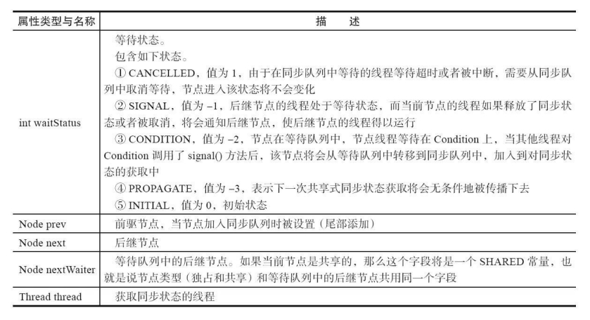

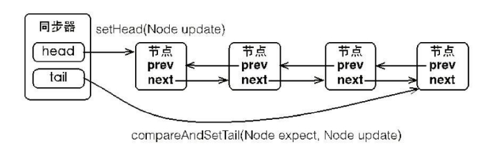

首节点是获取同步状态成功的节点，首节点的线程在释放同步状态时，将会唤醒后继节点，而后继节点将会在获取同步状态成功时将自己设置为首节点。设置首节点是通过获取同步状态成功的线程来完成的，由于只有一个线程能够成功获取到同步状态，因此设置头节点的方法并不需要使用 CAS 来保证。

当一个线程成功地获取了同步状态（或者锁），其他线程将无法获取到同步状态，转而被构造成为节点并加入到同步队列中，而这个加入队列的过程必须要保证线程安全，因此同步器提供了一个基于 CAS 的设置尾节点的方法。


#### 独占式同步状态获取与释放

acquire(int arg)方法可以获取同步状态，该方法对中断不敏感，也就是由于线程获取同步状态失败后进入同步队列中，后续对线程进行中断操作时，线程不会从同步队列中移出。

```java
public final void acquire(int arg) {
    if (!tryAcquire(arg) && acquireQueued(addWaiter(Node.EXCLUSIVE), arg)) {
        selfInterrupt();
    }
}
```

上述代码主要完成了同步状态获取、节点构造、加入同步队列以及在同步队列中自旋等待的相关工作：

1. 首先调用自定义同步器实现的 tryAcquire(int arg)方法，该方法保证线程安全的获取同步状态。
2. 如果同步状态获取失败，则构造同步节点并通过 addWaiter(Node node) 方法将该节点加入到同步队列的尾部。
3. 最后调用 acquireQueued(Node node,int arg)方法，使得该节点以“死循环”的方式获取同步状态，只有前驱节点是头节点才能够尝试获取同步状态。

```java
private Node addWaiter(Node mode) {
    Node node = new Node(Thread.currentThread(), mode);
    // 快速尝试在尾部添加
    Node pred = tail;
    if (pred != null) {
        node.prev = pred;
        if (compareAndSetTail(pred, node)) {
            pred.next = node;
            return node;
        }
    }
    enq(node);
    return node;
}
private Node enq(final Node node) {
    for (; ; ) {
        Node t = tail;
        if (t == null) { // Must initialize
            if (compareAndSetHead(new Node())) tail = head;
        } else {
            node.prev = t;
            if (compareAndSetTail(t, node)) {
                t.next = node;
                return t;
            }
        }
    }
}
final boolean acquireQueued(final Node node, int arg) {
    boolean failed = true;
    try {
        boolean interrupted = false;
        for (; ; ) {
            final Node p = node.predecessor();
            if (p == head && tryAcquire(arg)) {
                setHead(node);
                p.next = null; // help GC
                failed = false;
                return interrupted;
            }
            if (shouldParkAfterFailedAcquire(p, node) && parkAndCheckInterrupt()) {
                interrupted = true;
            }
        }
    } finally {
        if (failed) cancelAcquire(node);
    }
}
```

addWaiter 快速尝试在尾部添加，如果快速入队失败则调用 `enq(node)`，同步器通过“死循环”来保证节点的正确添加，在“死循环”中只有通过 CAS 将节点设置成为尾节点之后，当前线程才能从该方法返回，否则，当前线程不断地尝试设置。


独占式同步状态获取流程，也就是 acquire(int arg)方法调用流程：

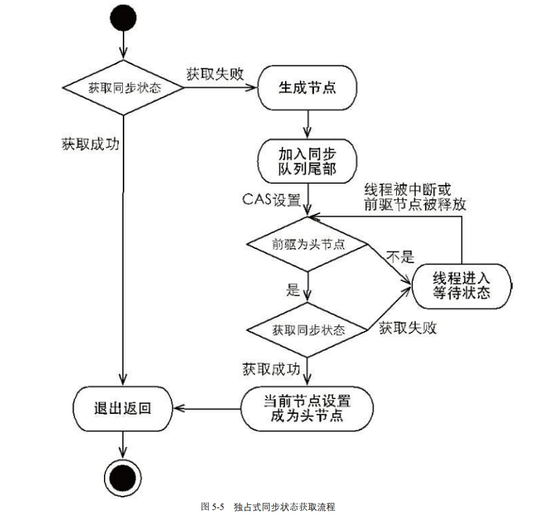

同步器的 release(int arg)方法可以释放同步状态，该方法执行时，会唤醒头节点的后继节点线程，unparkSuccessor(Node node)方法使用 LockSupport 来唤醒处于等待状态的线程。

```java
public final boolean release(int arg) {
    if (tryRelease(arg)) {
        Node h = head;
        if (h != null && h.waitStatus != 0) unparkSuccessor(h);
        return true;
    }
    return false;
}
```


在获取同步状态时，同步器维护一个同步队列，获取状态失败的线程都会被加入到队列中并在队列中进行自旋；移出队列（或停止自旋）的条件是前驱节点为头节点且成功获取了同步状态。

在释放同步状态时，同步器调用 tryRelease(int arg)方法释放同步状态，然后唤醒头节点的后继节点。


#### 共享式同步状态获取与释放

共享式获取与独占式获取最主要的区别在于同一时刻能否有多个线程同时获取到同步状态。

通过调用同步器的 acquireShared(int arg)方法可以共享式地获取同步状态：

```java
public final void acquireShared(int arg) {
    if (tryAcquireShared(arg) < 0) doAcquireShared(arg);
}
private void doAcquireShared(int arg) {
    final Node node = addWaiter(Node.SHARED);
    boolean failed = true;
    try {
        boolean interrupted = false;
        for (; ; ) {
            final Node p = node.predecessor();
            if (p == head) {
                int r = tryAcquireShared(arg);
                if (r >= 0) {
                    setHeadAndPropagate(node, r);
                    p.next = null;
                    if (interrupted) selfInterrupt();
                    failed = false;
                    return;
                }
            }
            if (shouldParkAfterFailedAcquire(p, node) && parkAndCheckInterrupt()) 
                interrupted = true;
        }
    } finally {
        if (failed) cancelAcquire(node);
    }
}
```

在 acquireShared(int arg)方法中，同步器调用 tryAcquireShared(int arg)方法尝试获取同步状态，当返回值大于等于 0 时，表示能够获取到同步状态。

在 doAcquireShared(int arg)方法的自旋过程中，如果当前节点的前驱为头节点时，尝试获取同步状态，如果返回值大于等于 0，表示该次获取同步状态成功并从自旋过程中退出。


#### 独占式超时获取同步状态

通过调用同步器的 doAcquireNanos(int arg,long nanosTimeout)方法可以超时获取同步状态，即在指定的时间段内获取同步状态，如果获取到同步状态则返回 true，否则，返回 false。

在 Java 5 之前，当一个线程获取不到锁而被阻塞在 synchronized 之外时，对该线程进行中断操作， 此时该线程的中断标志位会被修改，但线程依旧会阻塞在 synchronized 上，等待着获取锁。

在 Java 5 中，同步器提供了 acquireInterruptibly(int arg)方法，这个方法在等待获取同步状态时，如果当前线程被中断，会立刻返回，并抛出 InterruptedException。

doAcquireNanos(int arg,long nanosTimeout)方法支持响应中断、超时获取。

```java
private boolean doAcquireNanos(int arg, long nanosTimeout) throws 
    InterruptedException {
    long lastTime = System.nanoTime();
    final Node node = addWaiter(Node.EXCLUSIVE);
    boolean failed = true;
    try {
        for (; ; ) {
            final Node p = node.predecessor();
            if (p == head && tryAcquire(arg)) {
                setHead(node);
                p.next = null; // help GC
                failed = false;
                return true;
            }
            // 判断是否超时
            if (nanosTimeout <= 0) return false;
            if (shouldParkAfterFailedAcquire(p, node)
                && nanosTimeout > spinForTimeoutThreshold)
                LockSupport.parkNanos(this, nanosTimeout);
            long now = System.nanoTime();
            //计算时间，当前时间 now 减去睡眠之前的时间 lastTime 得到已经睡眠
            //的时间，然后被原有超时时间 nanosTimeout 减去，得到了还应该睡眠的时间
            nanosTimeout -= now - lastTime;
            lastTime = now;
            if (Thread.interrupted()) throw new InterruptedException();
        }
    } finally {
        if (failed) cancelAcquire(node);
    }
}
```

该方法在自旋过程中，当节点的前驱节点为头节点时尝试获取同步状态，如果获取成功则从该方法返回。

如果当前线程获取同步状态失败，则判断是否超时，如果没有超时，重新计算超时间隔 nanosTimeout，然后使当前线程等待 nanosTimeout 纳秒。当已到设置的超时时间，该线程会从 LockSupport.parkNanos(Object blocker,long nanos)方法返回。

注意：

如果 nanosTimeout 小于等于 spinForTimeoutThreshold（1000 纳秒）时，将不会使该线程进行超时等待，而是进入快速的自旋过程。原因在于，非常短的超时等待无法做到十分精确，如果这时再进行超时等待，会让 nanosTimeout 的超时从整体上表现得反而不精确。因此，在超时非常短的场景下，同步器会进入无条件的快速自旋。

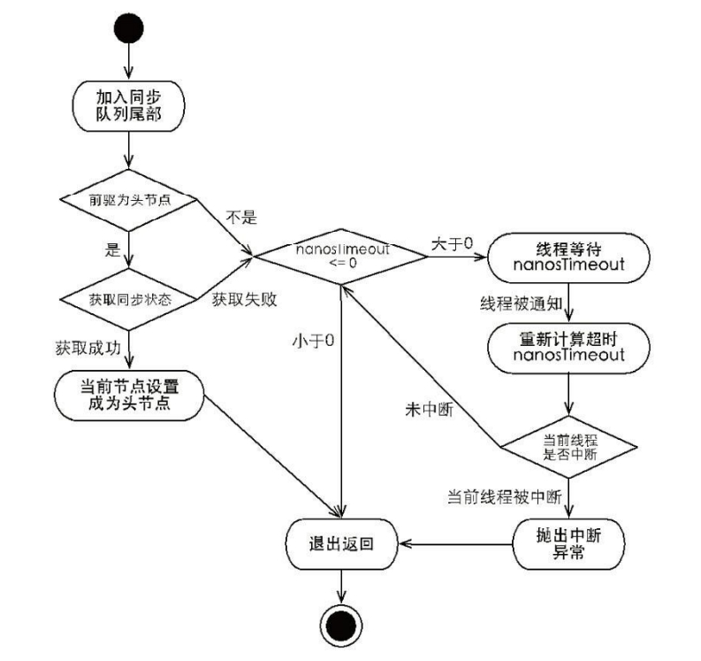

独占式超时获取同步状态 doAcquireNanos(int arg,long  nanosTimeout) 和独占式获取同步状态 acquire(int args)在流程上非常相似，其主要区别在于未获取到同步状态时的处理逻辑。acquire(int args)在未获取到同步状态时，将会使当前线程一直处于等待状态，而 doAcquireNanos(int arg,long nanosTimeout)会使当前线程等待 nanosTimeout 纳秒，如果当前线程在 nanosTimeout 纳秒内没有获取到同步状态，将会从等待逻辑中自动返回。

#### 自定义同步组件

设计一个同步工具：该工具在同一时刻，只允许至多两个线程同时访问，超过两个线程的访问将被阻塞。

首先，确定访问模式。TwinsLock 能够在同一时刻支持多个线程的访问，这显然是共享式访问，因此，需要使用同步器提供的 acquireShared(int args)方法等和 Shared 相关的方法。

其次，定义资源数。TwinsLock 在同一时刻允许至多两个线程的同时访问，可以设置初始状态 status 为 2。在同步状态变更时，需要使用 compareAndSet(int expect,int update)方法做原子性保障。

最后，实现 Lock 接口，提供面向使用者的接口，使用者调 用 lock() 方法获取锁，随后调用 unlock()方法释放锁。

```java
public class TwinsLock implements Lock {
    private final Sync sync = new Sync(2);
    private static final class Sync extends AbstractQueuedSynchronizer {
        Sync(int count) {
            if (count <= 0) {
                throw new IllegalArgumentException("count must large than zero.");
            }
            setState(count);
        }
        public int tryAcquireShared(int reduceCount) {
            for (; ; ) {
                int current = getState();
                int newCount = current - reduceCount;
                if (newCount < 0 || compareAndSetState(current, newCount)) {
                    return newCount;
                }
            }
        }
        public boolean tryReleaseShared(int returnCount) {
            for (; ; ) {
                int current = getState();
                int newCount = current + returnCount;
                if (compareAndSetState(current, newCount)) {
                    return true;
                }
            }
        }
    }
    public void lock() {
        sync.acquireShared(1);
    }
    public void unlock() {
        sync.releaseShared(1);
    }
    // 其他接口方法略
}

public class TwinsLockTest {
    @Test
    public void test() {
        final Lock lock = new TwinsLock();
        class Worker extends Thread {
            public void run() {
                while (true) {
                    lock.lock();
                    try {
                        SleepUtils.second(1);
                        System.out.println(Thread.currentThread().getName());
                        SleepUtils.second(1);
                    } finally {
                        lock.unlock();
                    }
                }
            }
        }
        // 启动 10 个线程
        for (int i = 0; i < 10; i++) {
            Worker w = new Worker();
            w.setDaemon(true);
            w.start();
        }
        // 每隔 1 秒换行
        for (int i = 0; i < 10; i++) {
            SleepUtils.second(1);
            System.out.println();
        }
    }
}
```


### 重入锁 ReentrantLock

`ReentrantLock` 实现了 `Lock` 接口，是一个可重入且独占式的锁，和 `synchronized` 关键字类似。`ReentrantLock` 更灵活、更强大，增加了轮询、超时、中断、公平锁和非公平锁等高级功能。

```java
Lock lock = new ReentrantLock();
lock.lock();
try {
    
} finally {
	lock.unlock();
}
```

在 finally 块中释放锁，目的是保证在获取到锁之后，最终能够被释放。不要将获取锁的过程写在 try 块中，因为如果在获取锁时发生了异常，异常抛出的同时，也会导致锁无故释放。

ReentrantLock 相对于 synchronized 具备如下特点：

1. 锁的实现：synchronized 是 JVM 实现的，而 ReentrantLock 是 JDK 实现的
2. 性能：新版本 Java 对 synchronized 进行了很多优化，synchronized 与 ReentrantLock 大致相同
3. 使用：ReentrantLock 需要手动解锁，synchronized 执行完代码块自动解锁
4. **可中断**：ReentrantLock 可中断，而 synchronized 不行。这里的可中断是指在获取锁的过程中，可以被取消获取锁的请求。
5. **公平锁**：公平锁是指多个线程在等待同一个锁时，必须按照申请锁的时间顺序来依次获得锁。ReentrantLock 可以设置公平锁或不公平锁，synchronized 中的锁是非公平的
6. **锁超时**：在指定的截止时间之前获取锁，如果截止时间到了仍无法获取锁，则返回。
7. 锁绑定多个条件：一个 ReentrantLock 可以同时绑定多个 Condition 对象，更细粒度的唤醒线程
8. 两者都是可重入锁


#### 可重入

```java
final boolean nonfairTryAcquire(int acquires) {
    final Thread current = Thread.currentThread();
    int c = getState();
    if (c == 0) {
        if (compareAndSetState(0, acquires)) {
            setExclusiveOwnerThread(current);
            return true;
        }
    } else if (current == getExclusiveOwnerThread()) {
        int nextc = c + acquires;
        if (nextc < 0) throw new Error("Maximum lock count exceeded");
        setState(nextc);
        return true;
    }
    return false;
}
```

通过判断当前线程是否为获取锁的线程来决定获取操作是否成功，如果是获取锁的线程再次请求，则将同步状态值进行增加并返回 true，表示获取同步状态成功。成功获取锁的线程再次获取锁，只是增加了同步状态值，这也就要求 ReentrantLock 在释放同步状态时减少同步状态值。

```java
protected final boolean tryRelease(int releases) {
    int c = getState() - releases;
    if (Thread.currentThread() != getExclusiveOwnerThread())
        throw new IllegalMonitorStateException();
    boolean free = false;
    if (c == 0) {
        free = true;
        setExclusiveOwnerThread(null);
    }
    setState(c);
    return free;
}
```

如果该锁被获取了 n 次，那么前(n-1)次 tryRelease(int releases)方法必须返回 false，而只有同步状态完全释放了，才能返回 true。可以看到，该方法将同步状态是否为 0 作为最终释放的条件，当同步状态为 0 时，将占有线程设置为 null，并返回 true，表示释放成功。

#### 可中断

ReetrantLock 的`lockInterruptibly()、tryLock()`，这些方法最终底层都会间接的调用到`doAcquireInterruptibly()`方法。

```java
public void acquireInterruptibly(int arg) throws InterruptedException {
    // 检查线程是否已经被中断
    if (Thread.interrupted()) throw new InterruptedException();
    
    // 尝试获取锁
    if (!tryAcquire(arg)) {
        // 如果无法获取锁，将线程加入等待队列，并支持响应中断
        doAcquireInterruptibly(arg);
    }
}
private void doAcquireInterruptibly(int arg)
    throws InterruptedException {
    // 封装一个Node节点尝试入队操作
    final Node node = addWaiter(Node.EXCLUSIVE);
    boolean failed = true;
    try {
        for (;;) {
            // 获取当前节点的前驱节点
            final Node p = node.predecessor();
            // 如果前驱节点为head节点则尝试获取锁资源/同步状态标识
            if (p == head && tryAcquire(arg)) {
                // 获取成功后将当前节点设置成head节点
                setHead(node);
                p.next = null; // help GC
                failed = false;
                return;
            }
            if (shouldParkAfterFailedAcquire(p, node) &&
                parkAndCheckInterrupt())
                // 直接抛异常，中断线程的同步状态请求
                throw new InterruptedException();
        }
    } finally {
        if (failed)
            cancelAcquire(node);
    }
}
```

```java
/** ---------------lock(): acquireQueued --------------- */
// 如果前驱节点不是head，判断是否阻塞挂起线程
if (shouldParkAfterFailedAcquire(p, node) &&
    parkAndCheckInterrupt())
    interrupted = true;
    
/** --------lockInterruptibly()、tryLock(): doAcquireInterruptibly------- */
if (shouldParkAfterFailedAcquire(p, node) &&
    parkAndCheckInterrupt())
    // 直接抛异常，中断线程的同步状态请求
    throw new InterruptedException();
```

在可中断式获取锁资源的方式中，当检测到线程的中断操作后，直接抛出异常，从而中断线程的同步状态请求，移除同步队列。而普通的lock()方法则不支持中断操作，即使线程被中断，它也会一直等待直到获取到锁或者超时。


#### 公平与非公平获取锁

公平性与否是针对获取锁而言的，如果一个锁是公平的，那么锁的获取顺序就应该符合请求的绝对时间顺序，也就是 FIFO。ReentrantLock 默认是不公平的，公平锁一般没有必要，会降低并发度。

对于非公平锁，只要 CAS 设置同步状态成功，则表示当前线程获取了锁。对于公平锁则不同：

判断条件多了 `hasQueuedPredecessors()` 方法，即加入了同步队列中当前节点是否有前驱节点的判断，如果该方法返回 true，则表示有线程比当前线程更早地请求获取锁，那么当前线程会被直接封装成Node节点追加到队尾等待。

```java
public final void acquire(int arg) {
    if (!tryAcquire(arg) &&
        acquireQueued(addWaiter(Node.EXCLUSIVE), arg))
        selfInterrupt();
}

protected final boolean tryAcquire(int acquires) {
    final Thread current = Thread.currentThread();
    int c = getState();
    if (c == 0) {
        if (!hasQueuedPredecessors() &&
            compareAndSetState(0, acquires)) {
            setExclusiveOwnerThread(current);
            return true;
        }
    }
    else if (current == getExclusiveOwnerThread()) {
        int nextc = c + acquires;
        if (nextc < 0)
            throw new Error("Maximum lock count exceeded");
        setState(nextc);
        return true;
    }
    return false;
}
```


### 读写锁 ReentrantReadWriteLock

读写锁在同一时刻可以允许多个读线程访问，但是在写线程访问时，所有的读线程和其他写线程均被阻塞。读写锁维护了一对锁，一个读锁和一个写锁，通过分离读锁和写锁，使得并发性相比一般的排他锁有了很大提升。

特性：

* 公平性选择：支持公平和非公平锁
* 重进入：读线程获取读锁后能再次获取读锁；写线程获取写锁后能再次获取写锁，也能获取读锁。
* 锁降级：遵循获取写锁、获取读锁、释放写锁的次序，写锁能够降级为读锁。

```java
public class Cache {
    static Map<String, Object> map = new HashMap<String, Object>();
    static ReentrantReadWriteLock rwl = new ReentrantReadWriteLock();
    static Lock r = rwl.readLock();
    static Lock w = rwl.writeLock(); // 获取一个 key 对应的 value
    public static final Object get(String key) {
        r.lock();
        try {
            return map.get(key);
        } finally {
            r.unlock();
        }
    }
    // 设置 key 对应的 value，并返回旧的 value
    public static final Object put(String key, Object value) {
        w.lock();
        try {
            return map.put(key, value);
        } finally {
            w.unlock();
        }
    }
}
```


**读写状态设计**：

读写锁同样依赖自定义同步器来实现同步功能，而读写状态就是其同步器的同步状态。读写锁将变量切分成了两个部分，**高 16 位表示读，低 16 位表示写**。

假设当前同步状态值为 S，写状态等于 S&0x0000FFFF（将高 16 位全部抹去），读状态等于 S>>>16（无符号补 0 右移 16 位）。当写状态增加 1 时，等于 S+1，当读状态增加 1 时，等于 S+(1<<16)，也就是 S+0x00010000。

**写锁的获取和释放**：

```java
protected final boolean tryAcquire(int acquires) {
    Thread current = Thread.currentThread();
    int c = getState();
    //  S & 0x0000FFFF
    int w = exclusiveCount(c);
    // 说明有读锁或者写锁
    if (c != 0) {
        // c != 0 and w == 0 表示有读锁，【读锁不能升级】，直接返回 false
        // w != 0 说明有写锁，写锁的拥有者不是自己，获取失败
        if (w == 0 || current != getExclusiveOwnerThread())
            return false;
        if (w + exclusiveCount(acquires) > MAX_COUNT)
            throw new Error("Maximum lock count exceeded");
        setState(c + acquires);
        return true;
    }
    if (writerShouldBlock() || !compareAndSetState(c, c + acquires))
        return false;
    setExclusiveOwnerThread(current);
    return true;
}
// 非公平锁 writerShouldBlock 总是返回 false, 无需阻塞
final boolean writerShouldBlock() {
    return false; 
}
// 公平锁会检查 AQS 队列中是否有前驱节点, 没有(false)才去竞争
final boolean writerShouldBlock() {
    return hasQueuedPredecessors();
}
```


**读锁的获取与释放**：

```java
// 尝试以共享模式获取
protected final int tryAcquireShared(int unused) {
    Thread current = Thread.currentThread();
    int c = getState();
    // exclusiveCount(c) 代表低 16 位, 写锁的 state，成立说明有线程持有写锁
    // 写锁的持有者不是当前线程，则获取读锁失败，【写锁允许降级】
    if (exclusiveCount(c) != 0 && getExclusiveOwnerThread() != current)
        return -1;
    
    // 高 16 位，代表读锁的 state
    int r = sharedCount(c);

    if (!readerShouldBlock() &&	r < MAX_COUNT &&
        compareAndSetState(c, c + SHARED_UNIT)) {	// 尝试增加读锁计数
        // 加锁成功
        // 加锁之前读锁为 0，说明当前线程是第一个读锁线程
        if (r == 0) {
            firstReader = current;
            firstReaderHoldCount = 1;
        // 第一个读锁线程是自己就发生了读锁重入
        } else if (firstReader == current) {
            firstReaderHoldCount++;
        } else {
            // cachedHoldCounter 设置为当前线程的 holdCounter 对象，即最后一个获取读锁的线程
            HoldCounter rh = cachedHoldCounter;
            // 说明还没设置 rh
            if (rh == null || rh.tid != getThreadId(current))
                // 获取当前线程的锁重入的对象，赋值给 cachedHoldCounter
                cachedHoldCounter = rh = readHolds.get();
            // 还没重入
            else if (rh.count == 0)
                readHolds.set(rh);
            // 重入 + 1
            rh.count++;
        }
        // 读锁加锁成功
        return 1;
    }
    return fullTryAcquireShared(current);
}
```

如果其他线程已经获取了写锁，则当前线程获取读锁失败，进入等待状态。如果当前线程获取了写锁或者写锁未被获取，则当前线程（线程安全，依靠 CAS 保证）增加读状态，成功获取读锁。

**锁降级**：

锁降级指的是写锁降级成为读锁。如果当前线程拥有写锁，然后将其释放，最后再获取读锁，这种分段完成的过程不能称之为锁降级。锁降级是指把持住写锁，再获取到读锁，随后释放（先前拥有的）写锁的过程。

```java
public void processData() {
    readLock.lock();
    if (!update) {
        // 必须先释放读锁
        readLock.unlock();
        // 锁降级从写锁获取到开始
        writeLock.lock();
        try {
            if (!update) {
                // 准备数据的流程（略）
                update = true;
            }
            readLock.lock();
        } finally {
            writeLock.unlock();
        }
        // 锁降级完成，写锁降级为读锁
    }
    try { // 使用数据的流程（略）
    } finally {
        readLock.unlock();
    }
}
```

当数据发生变更后，update 变量（布尔类型且 volatile 修饰）被设置为 false，此时所有访问 processData()方法的线程都能够感知到变化，但只有一个线程能够获取到写锁，其他线程会被阻塞在读锁和写锁的 lock()方法上。当前线程获取写锁完成数据准备之后，再获取读锁，随后释放写锁，完成锁降级。

锁降级中读锁的获取是否必要呢？答案是必要的。主要是为了保证数据的可见性， 如果当前线程不获取读锁而是直接释放写锁，假设此刻另一个线程（记作线程 T）获取了写锁并修改了数据，那么当前线程无法感知线程 T 的数据更新。如果当前线程获取读锁，即遵循锁降级的步骤，则线程 T 将会被阻塞，直到当前线程使用数据并释放读锁之后，线程 T 才能获取写锁进行数据更新。 

RentrantReadWriteLock 不支持锁升级（把持读锁、获取写锁，最后释放读锁的过程）。目的也是保证数据可见性，如果读锁已被多个线程获取，其中任意线程成功获取了写锁并更新了数据，则其更新对其他获取到读锁的线程是不可见的。


### LockSupport

LockSupport 定义了一组的公共静态方法，这些方法提供了最基本的线程阻塞和唤醒功能。

```java
// 暂停当前线程
LockSupport.park(); 
// 恢复某个线程的运行
LockSupport.unpark(暂停线程对象)
```

将一个线程进行挂起是通过park方法实现的，调用park后，线程将一直阻塞直到超时或者中断等条件出现。unpark可以终止一个挂起的线程，使其恢复正常。如果 thread 之前因调用 park() 而被挂起，则调用 unpark 后，该线程会被唤醒。如果 thread 之前没有调用 park，则调用 unpark 方法后，再调用 park 方法，其会立刻返回。

Java对线程的挂起操作被封装在LockSupport类中，LockSupport类中有各种版本pack方法，其底层实现最终还是使用Unsafe.park()方法和Unsafe.unpark()方法来实现。


与 Object 的 wait & notify 相比 ：

- wait，notify 和 notifyAll 必须配合 Object Monitor 一起使用，而 park，unpark 不必
- park & unpark 是以线程为单位来【阻塞】和【唤醒(指定)】线程，而 notify 只能随机唤醒一个等待线程，notifyAll是唤醒所有等待线程
- park & unpark 可以先 unpark，而 wait & notify 不能先 notify 


### Condition

任意一个 Java 对象，都拥有一组监视器方法（定义在 java.lang.Object 上），主要包括 wait()、 wait(long timeout)、notify()以及 notifyAll()方法，这些方法与 synchronized 同步关键字配合，可以实现等待/通知模式。

Condition 接口也提供了类似 Object 的监视器方法，与 Lock 配合可以实现等待/通知模式，但是这两者在使用方式以及功能特性上还是有差别的。

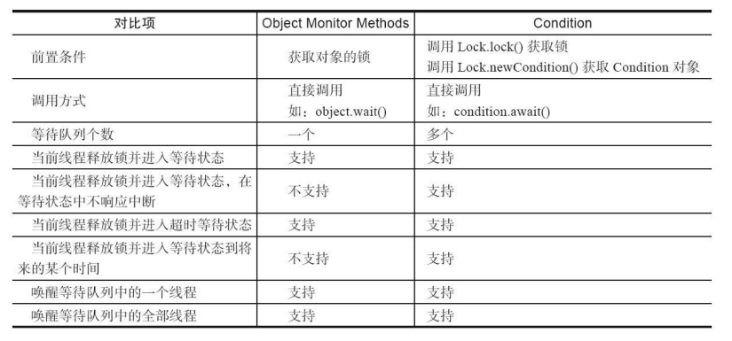

Condition 定义了等待/通知两种类型的方法，当前线程调用这些方法时，需要提前获取到 Condition 对象关联的锁。Condition 对象是由 Lock 对象（调用 Lock 对象的 newCondition()方法）创建出来的，换句话说，Condition 是依赖 Lock 对象的。

```java
public class BoundedQueue<T> {
    private Object[] items;
    // 添加的下标，删除的下标和数组当前数量
    private int addIndex, removeIndex, count;
    private Lock lock = new ReentrantLock();
    private Condition notEmpty = lock.newCondition();
    private Condition notFull = lock.newCondition();
    public BoundedQueue(int size) {
        items = new Object[size];
    }
    // 添加一个元素，如果数组满，则添加线程进入等待状态，直到有"空位"
    public void add(T t) throws InterruptedException {
        lock.lock();
        try {
            while (count == items.length) notFull.await();
            items[addIndex] = t;
            if (++addIndex == items.length) addIndex = 0;
            ++count;
            notEmpty.signal();
        } finally {
            lock.unlock();
        }
    }
    // 由头部删除一个元素，如果数组空，则删除线程进入等待状态，直到有新添加元素
    public T remove() throws InterruptedException {
        lock.lock();
        try {
            while (count == 0) notEmpty.await();
            Object x = items[removeIndex];
            if (++removeIndex == items.length) removeIndex = 0;
            --count;
            notFull.signal();
            return (T) x;
        } finally {
            lock.unlock();
        }
    }
}
```

当调用 await()方法后，当前线程会释放锁并在此等待，而其他线程调用 Condition 对象的 signal()方法，通知当前线程后，当前线程才从 await()方法返回，并且在返回前已经获取了锁。


Condition只是一个接口，具体的落地实现者为AQS内部的 ConditionObject 类，每个 Condition 对象都包含着一个队列，该队列是 Condition 对象实现等待/通知功能的关键。

**等待队列**：

一个 Condition 包含一个等待队列，Condition 拥有首节点（firstWaiter）和尾节点 （lastWaiter）。当前线程调用 Condition.await()方法，将会释放锁、以当前线程构造节点加入等待队列。同步队列和等待队列中节点类型都是同步器的静态内部类 AbstractQueuedSynchronizer.Node。

在 Object 的监视器模型上，一个对象拥有一个同步队列和等待队列，而并发包中的 Lock（更确切地说是同步器）拥有一个同步队列和多个等待队列。

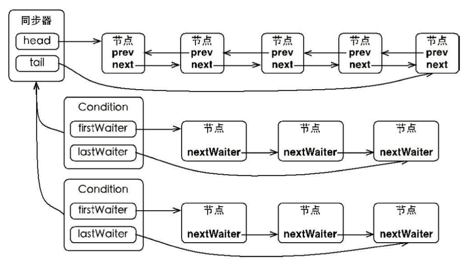

**等待**：

```java
public final void await() throws InterruptedException {
    if (Thread.interrupted()) throw new InterruptedException();
    // 当前线程加入等待队列
    Node node = addConditionWaiter();
    // 释放同步状态
    int savedState = fullyRelease(node);
    int interruptMode = 0;
    while (!isOnSyncQueue(node)) {
        LockSupport.park(this);
        if ((interruptMode = checkInterruptWhileWaiting(node)) != 0) break;
    }
    if (acquireQueued(node, savedState) && interruptMode != THROW_IE) interruptMode 
        = REINTERRUPT;
    if (node.nextWaiter != null) unlinkCancelledWaiters();
    if (interruptMode != 0) reportInterruptAfterWait(interruptMode);
}
```

await()主要做了四件事：

1. 调用 addConditionWaiter() 方法构建新的节点并将其加入等待队列

2. 调用 fullyRelease(node) 释放锁资源(不管此时持有锁的线程重入多少次都一律将state置0)，同时唤醒同步队列中后继节点的线程。

3. 调用 isOnSyncQueue(node) 判断节点是否存在同步队列中，在这里是一个自旋操作，如果同步队列中不存在当前节点则直接在JVM级别挂起当前线程

4. 当前节点线程被唤醒后，即节点从等待队列转入同步队列时，则调用acquireQueued(node, savedState)方法执行自旋操作尝试重新获取锁资源


**通知**：

1. 调用 Condition 的 signal()方法，将会唤醒在等待队列中等待时间最长的节点（首节点），会将其移动到同步队列并使用 LockSupport 唤醒节点中的线程。

2. 被唤醒后的线程，将从 await()方法中的 while 循环中退出（isOnSyncQueue(Node  node)方法返回 true，节点已经在同步队列中），进而调用同步器的 acquireQueued()方法加入到获取同步状态的竞争中。 

3. 成功获取同步状态（或者说锁）之后，被唤醒的线程将从先前调用的 await()方法返回，此时该线程已经成功地获取了锁。

Condition 的 signalAll()方法，相当于对等待队列中的每个节点均执行一次 signal()方 法，效果就是将等待队列中所有节点全部移动到同步队列中，并唤醒每个节点的线程。


## 并发工具包

### CountDownLatch

CountDownLatch 允许一个或多个线程等待其他线程完成操作。

CountDownLatch 的构造函数接收一个 int 类型的参数作为计数器，如果你想等待 N 个点完成，这里就传入 N。当我们调用 CountDownLatch 的 countDown 方法时，state 就会减 1，CountDownLatch 的 await 方法会阻塞当前线程，直到 state 变成零。

countDown 方法可以用在任何地方，所以这里说的 N 个点，可以是 N 个线程，也可以是 1 个线程里 的 N 个执行步骤。用在多个线程时，只需要把这个 CountDownLatch 的引用传递到线程里即可。

CountDownLatch 不可能重新初始化或者修改 CountDownLatch 对象的内部计数器的值。一个线程调用 countDown 方法 happen-before另外一个线程调用 await 方法。

```java
public class CountDownLatchTest {
    staticCountDownLatch c = new CountDownLatch(2);
    public static void main(String[] args) throws InterruptedException {
        new Thread(new Runnable() {
            @Override
            public void run() {
                System.out.println(1);
                c.countDown();
                System.out.println(2);
                c.countDown();
            }
        }).start();
        c.await();
        System.out.println("3");
    }
}
```

`CountDownLatch` 是共享锁的一种实现,它默认构造 AQS 的 `state` 值为 N。

当线程使用 `countDown()` 方法时,其实使用了`tryReleaseShared`方法以 CAS 的操作来减少 `state`。如果减一后state等于0返回true，回到`releaseShared()`的`if(tryReleaseShared(arg))`执行`doReleaseShared()`唤醒同步队列中的阻塞线程。反之，如果减一后不为0，当前线程则直接返回，方法结束。

```java
// CountDownLatch类 → countDown()方法
public void countDown() {
    sync.releaseShared(1);
}

// AbstractQueuedSynchronizer类 → releaseShared()方法
public final boolean releaseShared(int arg) {
    if (tryReleaseShared(arg)) {
        doReleaseShared();
        return true;
    }
    return false;
}

// CountDownLatch类 → Sync内部类 → tryReleaseShared()方法
protected boolean tryReleaseShared(int releases) {
    // Decrement count; signal when transition to zero
    for (;;) {
        int c = getState();
        if (c == 0)
            return false;
        int nextc = c-1;
        if (compareAndSetState(c, nextc))
            return nextc == 0;
    }
}
```


当调用 `await()` 方法的时候，如果 `state` 不为 0，那就证明任务还没有执行完毕，`await()` 方法就会一直阻塞。直到`count` 个线程调用了`countDown()`使 state 值被减为 0，或者调用`await()`的线程被中断，该线程才会从阻塞中被唤醒，`await()` 方法之后的语句得到执行。

```java
public void await() throws InterruptedException {
    sync.acquireSharedInterruptibly(1);
}
// AbstractQueuedSynchronizer类 → acquireSharedInterruptibly()方法
public final void acquireSharedInterruptibly(int arg)
            throws InterruptedException {
    if (Thread.interrupted())
        throw new InterruptedException();
    // 最终调用到CountDownLatch内部Sync类的tryAcquireShared()方法
    if (tryAcquireShared(arg) < 0)
        doAcquireSharedInterruptibly(arg);
}

// CountDownLatch类 → Sync内部类 → tryAcquireShared()方法
protected int tryAcquireShared(int acquires) {
    return (getState() == 0) ? 1 : -1;
}
```


### CyclicBarrier

CyclicBarrier 的字面意思是可循环使用（Cyclic）的屏障（Barrier）。它要做的事情是，让一组线程到达一个屏障（也可以叫同步点）时被阻塞，直到最后一个线程到达屏障时，屏障才会开门，所有被屏障拦截的线程才会继续运行。

CyclicBarrier 默认的构造方法是 CyclicBarrier（int parties），其参数表示屏障拦截的线程数量，每个线程调用 await 方法告诉 CyclicBarrier 我已经到达了屏障，然后当前线程被阻塞。

CyclicBarrier 还提供一个更高级的构造函数 CyclicBarrier（int parties，Runnable barrier-Action），用于在线程到达屏障时，优先执行 barrierAction，方便处理更复杂的业务场景。

```java
public static void main(String[] args) {
    ExecutorService service = Executors.newFixedThreadPool(2);
    CyclicBarrier barrier = new CyclicBarrier(2, () -> {
        System.out.println("task1 task2 finish...");
    });

    for (int i = 0; i < 3; i++) { // 循环重用
        service.submit(() -> {
            System.out.println("task1 begin...");
            try {
                Thread.sleep(1000);
                barrier.await();    // 2 - 1 = 1
            } catch (InterruptedException | BrokenBarrierException e) {
                e.printStackTrace();
            }
        });

        service.submit(() -> {
            System.out.println("task2 begin...");
            try {
                Thread.sleep(2000);
                barrier.await();    // 1 - 1 = 0
            } catch (InterruptedException | BrokenBarrierException e) {
                e.printStackTrace();
            }
        });
    }
    service.shutdown();
}
```


首先设置了屏障数量，当线程调用 await 的时候计数器会减一，如果计数器不等于0的时候，线程会调用 `condition.await` 进行阻塞等待。如果计数器值等于0，调用 `condition.signalAll `唤醒等待的线程，并且重置计数器，然后开启下一代。


与 CountDownLatch 的区别：

1. `CountDownLatch` 的实现是基于 AQS 共享模式的，而 `CycliBarrier` 是基于AQS 独占模式( `ReentrantLock` ) 和 `Condition` 的。

2. CountDownLatch 是一个线程阻塞等待其他线程到达一个节点之后才能继续执行，这个过程其他线程不会阻塞；CyclicBarrier是各个线程阻塞等待所有线程都达到一个节点后，所有线程继续执行。

3. CountDownLatch 的计数器只能使用一次，而 CyclicBarrier 的计数器可以使用 reset() 方法重置。


### Semaphore

Semaphore 可以用于做流量控制，特别是公用资源有限的应用场景。

`Semaphore` 是通过 `AQS` 实现的。AQS 维护了一个 FIFO（先进先出）的同步队列和一个同步状态 `state`，该状态用来表示剩余的许可数量。调用`semaphore.acquire()` ，线程尝试获取许可证，如果 `state >= 0` 的话，则表示可以获取成功。如果获取成功的话，使用 CAS 操作去修改 `state` 的值 `state=state-1`。如果 `state<0` 的话，则表示许可证数量不足。此时会创建一个 Node 节点加入阻塞队列，挂起当前线程。

```java
public class SemaphoreTest {
    private static final int THREAD_COUNT = 30;
    private static ExecutorService threadPool = Executors.newFixedThreadPool(THREAD_COUNT);
    private static Semaphore s = new Semaphore(10);
    public static void main(String[] args) {
        for (int i = 0; i < THREAD_COUNT; i++) {
            threadPool.execute(new Runnable() {
                @Override
                public void run() {
                    try {
                        s.acquire();
                        System.out.println("save data");
                        s.release();
                    } catch (InterruptedException e) {
                    }
                }
            });
        }
        threadPool.shutdown();
    }
}
```

在代码中，虽然有 30 个线程在执行，但是只允许 10 个并发执行。Semaphore 的构造方法 Semaphore（int permits）接受一个整型的数字，表示可用的许可证数量。 Semaphore（10）表示允许 10 个线程获取许可证，也就是最大并发数是 10。


```java
// Semaphore类 → acquire()方法
public void acquire() throws InterruptedException {
    sync.acquireSharedInterruptibly(1);
}

public final void acquireSharedInterruptibly(int arg)
    throws InterruptedException {
    // 判断是否出现线程中断信号（标志）
    if (Thread.interrupted())
        throw new InterruptedException();
    // 如果tryAcquireShared(arg)执行结果不小于0，则线程获取同步状态成功
    if (tryAcquireShared(arg) < 0)
        // 未获取成功加入同步队列阻塞等待
        doAcquireSharedInterruptibly(arg);
}

// Semaphore类 → NofairSync内部类 → tryAcquireShared()方法
protected int tryAcquireShared(int acquires) {
    // 调用了父类Sync中的实现方法
    return nonfairTryAcquireShared(acquires);
}

// Syn类 → nonfairTryAcquireShared()方法
abstract static class Sync extends AbstractQueuedSynchronizer {
    final int nonfairTryAcquireShared(int acquires) {
        // 开启自旋死循环
        for (;;) {
            int available = getState();
            int remaining = available - acquires;
            // 判断信号量中可用许可数是否已<0或者CAS执行是否成功
            if (remaining < 0 ||
                compareAndSetState(available, remaining))
                return remaining;
        }
    }
}
```

`nonfairTryAcquireShared(acquires)`方法首先获取到state值后，减去一得到`remaining`值，如果不小于0则代表着当前信号量中还存在可用许可，当前线程开始尝试cas更新state值，cas成功则代表获取同步状态成功，返回`remaining`值。反之，如果`remaining`值小于0则代表着信号量中的许可数已被其他线程获取，目前不存在可用许可数，直接返回小于0的`remaining`值，`nonfairTryAcquireShared(acquires)`方法执行结束，回到AQS的`acquireSharedInterruptibly()`方法。当返回的`remaining`值小于0时，`if(tryAcquireShared(arg)<0)`条件成立，进入if执行`doAcquireSharedInterruptibly(arg)`方法将当前线程加入同步队列阻塞，等待其他线程释放同步状态。


```java
// Semaphore类 → release()方法
public void release() {
    sync.releaseShared(1);
}

// AbstractQueuedSynchronizer类 → releaseShared(arg)方法
public final boolean releaseShared(int arg) {
    // 调用子类Semaphore中tryReleaseShared()方法实现
    if (tryReleaseShared(arg)) {
        // 唤醒后继节点
        doReleaseShared();
        return true;
    }
    return false;
}

// Semaphore类 → Sync子类 → tryReleaseShared()方法
protected final boolean tryReleaseShared(int releases) {
    for (;;) {
        // 获取AQS中当前同步状态state值
        int current = getState();
        // 对当前的state值进行增加操作
        int next = current + releases;
        if (next < current) 
            throw new Error("Maximum permit count exceeded");
        // CAS更新state值为增加之后的next值
        if (compareAndSetState(current, next))
            return true;
    }
}
```


## 并发容器

### BlockingQueue

阻塞队列与普通队列最大的不同点在于：支持队列内元素的阻塞添加与阻塞弹出。

```java
public interface BlockingQueue<E> extends Queue<E> {
    // 如果队列未满则将元素e插入队列尾部，插入成功返回true，
    // 如果队列已满，则抛IllegalStateException异常
    boolean add(E e); 

    // 如果队列未满则将元素e插入队列尾部，插入成功返回true
    boolean offer(E e);

    // 如果队列未满则将元素e插入队列尾部，插入成功返回true，
    // 如果该队列已满，则在指定的等待时间之内阻塞至可用空间出现
    // 如果超出指定时间还未将元素插入队列则返回（可响应线程中断）
    boolean offer(E e, long timeout, TimeUnit unit) throws InterruptedException; 

    // 将元素插入队列的尾部，如果该队列已满，则一直阻塞等待
    void put(E e) throws InterruptedException; 

    // 获取并移除队列的头部元素，如果没有元素则阻塞等待， 
    // 直到有线程添加元素后再唤醒等待线程执行该操作 
    E take() throws InterruptedException; 

    // 获取并移除队列的头部元素，在指定的等待时间之内阻塞等待获取元素，
    // 如果超出指定时间还未获取到元素则返回（可响应线程中断）
    E poll(long timeout, TimeUnit unit) throws InterruptedException; 

    // 从队列中移除某个指定元素，移除成功返回true，没有该元素则返回false
    boolean remove(Object o); 

    // 获取队列剩余的可用空位
    // 假设队列长度为10，已有3个元素，调用该方法则返回7
    int remainingCapacity();

    // 检查队列中是否存在指定元素，存在返回true，反之false
    public boolean contains(Object o);
}
```

**ArrayBlockingQueue**：

```java
public class ArrayBlockingQueue<E> extends AbstractQueue<E>
        implements BlockingQueue<E>, java.io.Serializable {
    // ArrayBlockingQueue构造器：指定队列长度
    public ArrayBlockingQueue(int capacity) {
        this(capacity, false);
    }
    // 构造器：指定队列长度与公平模式
    public ArrayBlockingQueue(int capacity, boolean fair) {
        if (capacity <= 0)
            throw new IllegalArgumentException();
        this.items = new Object[capacity];
        lock = new ReentrantLock(fair);
        notEmpty = lock.newCondition();
        notFull =  lock.newCondition();
    }
    
    // 内部存储元素的数组结构
    final Object[] items;

    // 记录获取元素的下标（take、poll、peek、remove方法都会用到）
    int takeIndex;

    // 记录添加元素的下标（put、offer、add方法都会用到）
    int putIndex;

    // 当前队列中元素的数量
    int count;

    // 控制并发的ReentrantLock锁对象
    final ReentrantLock lock;

    // 用于控制获取元素线程的condition对象
    private final Condition notEmpty;

    // 用于控制添加元素线程的condition对象
    private final Condition notFull;

    // 迭代器对象
    transient Itrs itrs = null;
}
```

`ArrayBlockingQueue`内部使用一个数组成员`items`存储所有的队列元素，分别使用三个数值：`takeIndex`、`putIndex`以及`count`记录添加与获取元素的数组位置与队列中的元素个数，同时内部使用`ReentrantLock`解决线程安全问题，用两个`Condition`对象：`notEmpty`、`notFull`控制“写”线程与“读”线程的阻塞。

```java
// ArrayBlockingQueue类 → put()方法
public void put(E e) throws InterruptedException {
    // 检查元素是否为空，为空则抛出空指针异常
    checkNotNull(e);
    // 获取ReentrantLock成员锁对象
    final ReentrantLock lock = this.lock;
    // 可响应中断式获取锁
    lock.lockInterruptibly();
    try {
        // 如果队列元素已满
        while (count == items.length)
            // 阻塞当前添加元素的线程
            notFull.await();
        // 如果队列元素未满则执行添加操作
        enqueue(e);
    } finally {
        // 释放锁
        lock.unlock();
    }
}
// ArrayBlockingQueue类 → enqueue()方法
private void enqueue(E x) {
    // 获取存储元素的items数组成员
    final Object[] items = this.items;
    // 将元素放在数组的putIndex下标位置
    items[putIndex] = x;
    // 对putIndex+1，+1后如果=数组长度了则重置为0
    if (++putIndex == items.length)
        putIndex = 0;
    // 记录队列元素的数值count+1
    count++;
    // 唤醒等待获取队列元素的线程
    notEmpty.signal();
}
```


**LinkedBlockingQueue**：

LinkedBlockingQueue采用了读写分离的思想提升了容器整体的吞吐量。

```java
public class LinkedBlockingQueue<E> extends AbstractQueue<E>
        implements BlockingQueue<E>, java.io.Serializable {
    // 构造器：可指定队列长度
    public LinkedBlockingQueue(int capacity) {
       // 如果指定的队列长度为0或小于0则抛出异常
       if (capacity <= 0) throw new IllegalArgumentException();
       // 将传入的指定长度赋值给capacity成员
       this.capacity = capacity;
       // 初始化空的节点作为队列头节点
       last = head = new Node<E>(null);
   }
   // 构造器：不指定长度默认则为Integer.MAX_VALUE
    public LinkedBlockingQueue() {
        this(Integer.MAX_VALUE);
    }
    
    // LinkedBlockingQueue类 → Node内部类
    static class Node<E> {
        // 当前节点存储的元素本身
        E item;
        // 当前节点的后继节点
        Node<E> next;
        // 构造器
        Node(E x) { item = x; }
    }
    
    // 队列的长度（可以指定长度，默认为Integer.MAX_VALUE）
    private final int capacity;
    
    // 原子计数器：记录队列中元素的个数
    private final AtomicInteger count = new AtomicInteger();
    
    // 队列(内部链表)的头节点
    transient Node<E> head;
    
    // 队列(内部链表)的尾节点
    private transient Node<E> last;
    
    // 读锁：线程从队列中获取元素时，使用这把锁
    private final ReentrantLock takeLock = new ReentrantLock();
    
    // 获取元素时，队列为空，线程加入该condition队列等待
    private final Condition notEmpty = takeLock.newCondition();
    
    // 写锁：线程向队列中添加元素时，使用这把锁
    private final ReentrantLock putLock = new ReentrantLock();
    
    // 添加元素时，队列已满，线程加入该condition队列等待
    private final Condition notFull = putLock.newCondition();
}
```

`LinkedBlockingQueue`因为是基于链表结构实现的队列容器，所以通过`Node`内部类构建了一个单向链表，同时使用`AtomicInteger`原子类记录队列中元素数量，`head、last`分别指向队列的头部以及尾部，同时使用`takeLock、putLock`两个`ReentrantLock`控制队列容器的读写并发访问。

```java
// LinkedBlockingQueue类 → put()方法
public void put(E e) throws InterruptedException {
    // 如果元素为空则抛出空指针异常
    if (e == null) throw new NullPointerException();
    int c = -1;
    // 将要添加的元素封装成node节点
    Node<E> node = new Node<E>(e);
    // 拿到写锁
    final ReentrantLock putLock = this.putLock;
    // 获取当前队列的元素数量
    final AtomicInteger count = this.count;
    // 可响应中断式加锁
    putLock.lockInterruptibly();
    try {
        // 如果队列已满
        while (count.get() == capacity) {
            // 挂起当前线程
            notFull.await();
        }
        // 如果队列未满，将封装的node节点加入队列
        enqueue(node);
        // 更新count计数器并获取更新前的count值
        c = count.getAndIncrement();
        // 如果队列还未满
        if (c + 1 < capacity)
            // 唤醒下一个添加线程，执行元素添加操作
            notFull.signal();
    } finally {
        // 释放锁
        putLock.unlock();
    }
    if (c == 0)
        // 如果存在元素则唤醒take线程
        signalNotEmpty();
}

// LinkedBlockingQueue类 → enqueue()方法
private void enqueue(Node<E> node) {
    // 将新来的节点添加到链表的尾部
    last = last.next = node;
}
```


### CopyOnWrite

写时复制容器是计算机程序设计领域惯用的一种优化思想，其核心思想是，如果有多个调用者同时请求相同资源，他们会共同获取相同的指针指向相同的资源，直到某个调用者试图修改资源的内容时，系统才会真正复制一份专用副本给该调用者，而其他调用者所见到的最初的资源仍然保持不变，修改完成后再修改原有引用指向。


在JUC包中，写时复制容器主要提供了两种：`CopyOnWriteArrayList`与`CopyOnWriteArraySet`，在使用这两个容器时，读操作不会加锁，写操作时则会先获取锁，然后再复制一份原有数据进行修改，修改完成后再修改原有引用指向。

CopyOnWrite缺陷：

* 内存占用问题。因为CopyOnWrite容器每次在发生修改时都会复制一个新的数组，所以当数组数据过大时对内存消耗比较高。

* 数据不一致性问题。CopyOnWrite容器保证的是最终一致性，由于写操作是在复制的数据副本上进行的，所以读操作不能立即看到写操作的结果。
* 不适合频繁修改的场景: `CopyOnWrite` 适合读多写少的场景，如果写操作频繁，复制操作的开销会变得很大，影响性能。


```java
public E get(int index) {
    return get(getArray(), index);
}

// CopyOnWriteArrayList类 → set()方法
public E set(int index, E element) {
    // 获取锁对象并加锁
    final ReentrantLock lock = this.lock;
    lock.lock();
    try {
        // 获取内部存储数据的数组成员：array
        Object[] elements = getArray();
        // 获取数组中指定下标原有的数据
        E oldValue = get(elements, index);
        // 如果指定下标位置原本存储的数据与新的数据不同
        if (oldValue != element) {
            // 获取数组的长度
            int len = elements.length;
            // 拷贝一个新的数组对象
            Object[] newElements = Arrays.copyOf(elements, len);
            // 将指定下标位置的元素修改为指定的数据
            newElements[index] = element;
            // 将成员array的引用从原本的数组改为新的数组
            setArray(newElements);
        } else {
            // 如果指定下标位置原本存储的数据与新的数据相同
            // 不做任何更改
            setArray(elements);
        }
        // 返回原本下标位置的值
        return oldValue;
    } finally {
        // 释放锁/解锁
        lock.unlock();
    }
}
// CopyOnWriteArrayList类 → add()方法
public void add(int index, E element) {
    // 获取锁/加锁
    final ReentrantLock lock = this.lock;
    lock.lock();
    try {
        // 获取内部存储数据的数组成员：array
        Object[] elements = getArray();
        int len = elements.length;
        // 如果指定下标位置超出数组长度或小于0则抛出异常
        if (index > len || index < 0)
            throw new IndexOutOfBoundsException("Index: "+index+
                                                ", Size: "+len);
        // 创建一个新的数组对象
        Object[] newElements;
        // 计算插入的下标位置是在数组中间还在数组最后
        int numMoved = len - index;
        // 如果在数组最后，那么拷贝原本的数组并长度+1，留个空位
        if (numMoved == 0)
            newElements = Arrays.copyOf(elements, len + 1);
        // 如果要在数组中间插入数据
        else {
            // 先创建一个长度为len+1的新数组
            newElements = new Object[len + 1];
            // 然后将拷贝老数组中的所有数据拷贝过来
            // 但是将下标为index的位置空出来
            System.arraycopy(elements, 0, newElements, 0, index);
            System.arraycopy(elements, index, newElements, index + 1,
                             numMoved);
        }
        // 将要添加的数据设置到数组的index下标位置
        newElements[index] = element;
        // 将成员array的引用从原本的数组改为新的数组
        setArray(newElements);
    } finally {
        // 释放锁/解锁
        lock.unlock();
    }
}
// CopyOnWriteArrayList类 → remove()方法
public E remove(int index) {
    // 获取锁/加锁
    final ReentrantLock lock = this.lock;
    lock.lock();
    try {
        // 拷贝原本的数组
        Object[] elements = getArray();
        // 获取数组长度与数组中要移除的值
        int len = elements.length;
        E oldValue = get(elements, index);
        // 计算要移除的位置是在数组的最后还是在数组的中间
        int numMoved = len - index - 1;
        // 如果在数组最后
        if (numMoved == 0)
            // 拷贝数组时，将最后一个元素不拷贝即可
            // 拷贝完成后重新更改引用指向
            setArray(Arrays.copyOf(elements, len - 1));
        // 如果要移除的位置是在数组中间
        else {
            // 创建一个长度为原本长度-1的新数组
            Object[] newElements = new Object[len - 1];
            // 在拷贝数据时，将指定位置的元素不拷贝即可
            System.arraycopy(elements, 0, newElements, 0, index);
            System.arraycopy(elements, index + 1, newElements, index,
                             numMoved);
            // 更改成员array的引用指向
            setArray(newElements);
        }
        // 返回被移除的值
        return oldValue;
    } finally {
        // 释放锁/解锁
        lock.unlock();
    }
}
```


CopyOnWriteArraySet实际上是基于CopyOnWriteArrayList实现的：

```java
public class CopyOnWriteArraySet<E> extends AbstractSet<E>
        implements java.io.Serializable {
    // 内部存储数据的结构
    private final CopyOnWriteArrayList<E> al;
    // 构造器
    public CopyOnWriteArraySet() {
        al = new CopyOnWriteArrayList<E>();
    }
}    
```


### ConcurrentHashMap

Java7 中 `ConcurrentHashMap` 使用的分段锁，也就是每一个 Segment 上同时只有一个线程可以操作，每一个 `Segment` 都是一个类似 `HashMap` 数组的结构，它可以扩容，它的冲突会转化为链表。但是 `Segment` 的个数一但初始化就不能改变。

Java8 中的 `ConcurrentHashMap` 使用的 `Synchronized` 锁加 CAS 的机制。结构也由 Java7 中的 **`Segment` 数组 + `HashEntry` 数组 + 链表** 进化成了 **Node 数组 + 链表 / 红黑树**，Node 是类似于一个 HashEntry 的结构。它的冲突再达到一定大小时会转化成红黑树，在冲突小于一定数量时又退回链表。


## 无锁

### CAS

CAS 的全称是 Compare-And-Swap，依赖于CPU的原子性指令实现。在 Java 中，实现 CAS 操作的一个关键类是`Unsafe`。


CAS 与 synchronized 总结：

- synchronized 是从悲观的角度出发：总是假设最坏的情况，每次去拿数据的时候都认为别人会修改，所以每次在拿数据的时候都会上锁，这样别人想拿这个数据就会阻塞（共享资源每次只给一个线程使用，其它线程阻塞，用完后再把资源转让给其它线程），因此 synchronized 也称之为悲观锁，ReentrantLock 也是一种悲观锁，性能较差。
- CAS 是从乐观的角度出发：总是假设最好的情况，每次去拿数据的时候都认为别人不会修改，所以不会上锁，但是在更新的时候会判断一下在此期间别人有没有去更新这个数据。如果别人修改过，则获取现在最新的值，如果别人没修改过，直接修改共享数据的值，CAS 这种机制也称之为乐观锁，综合性能较好。


CAS 实现原子操作的三大问题：

1. ABA 问题。因为 CAS 需要在操作值的时候，检查值有没有发生变化，如果没有发生变化则更新，但是如果一个值原来是 A，变成了 B，又变成了 A，那么使用 CAS 进行检查时会发现它的值没有发生变化，但是实际上却变化了。ABA 问题的解决思路就是使用版本号。在变量前面追加上版本号，每次变量更新的时候把版本号加 1，那么 A→B→A 就会变成 1A→2B→3A。从 Java 1.5 开始，JDK 的 Atomic 包里提供了一个类 AtomicStampedReference 来解决 ABA 问题。

2. 循环时间长开销大。CAS 经常会用到自旋操作来进行重试，也就是不成功就一直循环执行直到成功。如果长时间不成功，会给 CPU 带来非常大的执行开销。

3. 只能保证一个共享变量的原子操作。当对一个共享变量执行操作时，我们可以使用循环 CAS 的方式来保证原子操作，但是对多个共享变量操作时，循环 CAS 就无法保证操作的原子性。从 Java 1.5 开始， JDK 提供了 AtomicReference 类来保证引用对象之间的原子性，就可以把多个变量放在一个对象里来进行 CAS 操作。


### Unsafe

Unsafe 类存在 sun.misc 包，其中所有方法都是 native 修饰的，都是直接调用操作系统底层资源执行相应的任务，基于该类可以直接操作特定的内存数据，其内部方法操作类似 C 的指针。

**内存管理**：提供直接操作内存相关的方法：

**对象实例创建**：在之前我们创建类对象实例时无非通过两种形式：new以及反射机制创建，但是无论是new还是反射的形式创建都会调用对象的构造方法来完成对象的初始化。而Unsafe类提供创建对象实例新的途径，不会调用构造方法。

**类、实例对象、变量和数组的操作**：提供相关方法

**CAS操作**：CAS依赖unsafe类提供的CAS操作

**线程操作**：Java对线程的挂起操作被封装在LockSupport类中，LockSupport类中有各种版本pack方法，其底层实现最终还是使用Unsafe.park()方法和Unsafe.unpark()方法来实现。

**内存屏障**：JMM，指令重排序等操作的内存屏障支持


### Atomic

Atomic 包里的类基本都是使用 Unsafe 实现的包装类。

**原子更新基本类型**：

AtomicBoolean：原子更新布尔类型。 

AtomicInteger：原子更新整型。 

AtomicLong：原子更新长整型。

```java
public final int getAndIncrement() {
    for (; ; ) {
        int current = get();
        int next = current + 1;
        if (compareAndSet(current, next)) return current;
    }
}
public final boolean compareAndSet(int expect, int update) {
    return unsafe.compareAndSwapInt(this, valueOffset, expect, update);
}
```


Unsafe 只提供了 3 种 CAS 方法：compareAndSwapObject、 compareAndSwapInt 和 compareAndSwapLong，

AtomicBoolean 源码，发现它是先把 Boolean 转换成整型，再使用 compareAndSwapInt 进行 CAS，所以原子更新 char、float 和 double 变量也可以用类似的思路来实现。


**原子更新数组**：

AtomicIntegerArray：原子更新整型数组里的元素。

AtomicLongArray：原子更新长整型数组里的元素。

AtomicReferenceArray：原子更新引用类型数组里的元素。 


**原子更新引用类型**：

原子更新基本类型的 AtomicInteger，只能更新一个变量，如果要原子更新多个变量，就需要使用这个原子更新引用类型提供的类。

AtomicReference：原子更新引用类型。 存在ABA问题

AtomicStampedReference：原子更新带有版本号的引用类型。维护版本号解决ABA问题

AtomicMarkableReference：原子更新带有标记位的引用类型。维护是否修改过标记解决ABA问题


**原子更新字段类**：

如果需原子地更新某个类里的某个字段时，就需要使用原子更新字段类。

AtomicIntegerFieldUpdater：原子更新整型的字段的更新器。

AtomicLongFieldUpdater：原子更新长整型字段的更新器。 

AtomicReferenceFieldUpdater：原子更新引用类型字段的更新器。

要想原子地更新字段类需要两步。第一步，因为原子更新字段类都是抽象类，每次使用的时候必须使用静态方法 newUpdater()创建一个更新器，并且需要设置想要更新的类和属性。第二步，更新类的字段（属性）必须使用 public volatile 修饰符。


**原子累加器**

原子累加器类：LongAdder、DoubleAdder、LongAccumulator、DoubleAccumulator

原子累加器在有竞争时，设置多个累加单元，Therad-0 累加 Cell[0]，而 Thread-1 累加Cell[1]... 最后将结果汇总。这样它们在累加时操作的不同的 Cell 变量，因此减少了 CAS 重试失败，从而提高性能。


LongAdder 类有几个关键域:

```java
// 累加单元数组, 懒惰初始化
transient volatile Cell[] cells;

// 基础值, 如果没有竞争, 则用 cas 累加这个域
transient volatile long base;

// 在 cells 创建或扩容时, 置为 1, 表示加锁
transient volatile int cellsBusy;
```

Cell需要防止缓存行伪共享问题：一个缓存行容纳多个cell数据就叫做伪共享

```java
// 防止缓存行伪共享  
@sun.misc.Contended
static final class Cell {

    volatile long value;
    
    Cell(long x) { 
        value = x; 
    }

    // 最重要的方法, 用来 cas 方式进行累加, prev 表示旧值, next 表示新值
    final boolean cas(long prev, long next) {
        return UNSAFE.compareAndSwapLong(this, valueOffset, prev, next);
    }
// 省略不重要代码
}
```

> Cell 是数组形式，**在内存中是连续存储的**，64 位系统中，一个 Cell 为 24 字节（16 字节的对象头和 8 字节的 value），每一个 cache line 为 64 字节，因此缓存行可以存下 2 个的 Cell 对象，当 Core-0 要修改 Cell[0]、Core-1 要修改 Cell[1]，无论谁修改成功都会导致当前缓存行失效，从而导致对方的数据失效，需要重新去主存获取，影响效率
>
> @sun.misc.Contended：防止缓存行伪共享，在使用此注解的对象或字段的前后各增加 128 字节大小的 padding，使用 2 倍于大多数硬件缓存行让 CPU 将对象预读至缓存时**占用不同的缓存行**，这样就不会造成对方缓存行的失效


## 线程池

[Java线程池实现原理及其在美团业务中的实践 - 美团技术团队 (meituan.com)](https://tech.meituan.com/2020/04/02/java-pooling-pratice-in-meituan.html)

作用：

1. 降低资源消耗。通过重复利用已创建的线程降低线程创建和销毁造成的消耗。
2. 提高响应速度。当任务到达时，任务可以不需要等到线程创建就能立即执行。 
3. 提高线程的可管理性。线程是稀缺资源，如果无限制地创建，不仅会消耗系统资源，还会降低系统的稳定性，使用线程池可以进行统一分配、调优和监控。

关键属性：

```java
public class ThreadPoolExecutor extends AbstractExecutorService {

    // 控制变量-存放状态和线程数
    private final AtomicInteger ctl = new AtomicInteger(ctlOf(RUNNING, 0));

    // 任务队列，必须是阻塞队列
    private final BlockingQueue<Runnable> workQueue;

    // 工作线程集合，存放线程池中所有的（活跃的）工作线程，只有在持有全局锁mainLock的前提下才能访问此集合
    private final HashSet<Worker> workers = new HashSet<>();
    
    // 全局锁
    private final ReentrantLock mainLock = new ReentrantLock();

    // awaitTermination方法使用的等待条件变量
    private final Condition termination = mainLock.newCondition();

    // 记录峰值线程数
    private int largestPoolSize;
    
    // 记录已经成功执行完毕的任务数
    private long completedTaskCount;
    
    // 线程工厂，用于创建新的线程实例
    private volatile ThreadFactory threadFactory;

    // 拒绝执行处理器，对应不同的拒绝策略
    private volatile RejectedExecutionHandler handler;
    
    // 空闲线程等待任务的时间周期，单位是纳秒
    private volatile long keepAliveTime;
    
    // 是否允许核心线程超时，如果为true则keepAliveTime对核心线程也生效
    private volatile boolean allowCoreThreadTimeOut;
    
    // 核心线程数
    private volatile int corePoolSize;

    // 线程池容量
    private volatile int maximumPoolSize;

    // 省略其他代码
} 
```


### 参数

```java
public ThreadPoolExecutor(int corePoolSize,
                          int maximumPoolSize,
                          long keepAliveTime,
                          TimeUnit unit,
                          BlockingQueue<Runnable> workQueue,
                          ThreadFactory threadFactory,
                         RejectedExecutionHandler handler)
```

- corePoolSize：核心线程数目。 默认情况下，线程池中线程的数量如果 <= corePoolSize，那么即使这些线程处于空闲状态，那也不会被销毁。

- maximumPoolSize：最大线程数目 。当队列中存放的任务达到队列容量时，当前可以同时运行的数量变为最大线程数，创建线程并立即执行最新的任务，与核心线程数之间的差值又叫非核心线程数。

- keepAliveTime：空闲存活时间。当线程池中线程的数量大于corePoolSize，并且某个线程的空闲时间超过了keepAliveTime，那么这个线程就会被销毁。

- unit：空闲存活时间单位 

- workQueue：工作队列 。存放被提交但尚未被执行的任务

  - ArrayBlockingQueue：是一个基于数组结构的有界阻塞队列，此队列按 FIFO（先进先出）原则对元素进行排序。

  - LinkedBlockingQueue：一个基于链表结构的阻塞队列，此队列按 FIFO 排序元素，吞吐量通常要高于 ArrayBlockingQueue。Executors.newFixedThreadPool()使用了这个队列。

  - SynchronousQueue：一个不存储元素的阻塞队列。每个插入操作必须等到另一个线程调用移除操作，否则插入操作一直处于阻塞状态，吞吐量通常要高于 LinkedBlockingQueue，Executors.newCachedThreadPool 使用了这个队列。

  - PriorityBlockingQueue：一个具有优先级的无限阻塞队列。

- threadFactory：线程工厂。可以为线程创建时起个好名字 

- handler：拒绝策略

  RejectedExecutionHandler 下有 4 个实现类：

  - AbortPolicy：抛出 RejectedExecutionException 异常，**默认策略**
  - CallerRunsPolicy：让调用者线程处理当前任务
  - DiscardPolicy：直接丢弃任务，不予任何处理也不抛出异常
  - DiscardOldestPolicy：放弃队列中最早的任务，再次提交当前任务


### 线程池状态

ThreadPoolExecutor 使用 **int 的高 3 位来表示线程池状态，低 29 位表示线程数量**

| 状态       | 高3位 | 接收新任务 | 处理阻塞队列任务 | 说明                                                         |
| ---------- | ----- | ---------- | ---------------- | ------------------------------------------------------------ |
| RUNNING    | 111   | Y          | Y                | 能接收新提交的任务和处理阻塞队列中的任务                     |
| SHUTDOWN   | 000   | N          | Y                | 不接收新任务，但处理阻塞队列剩余任务                         |
| STOP       | 001   | N          | N                | 不接收新任务，也不处理阻塞队列剩余任务，会中断正在执行的任务 |
| TIDYING    | 010   | -          | -                | 任务全执行完毕，活动线程为 0 即将进入终结                    |
| TERMINATED | 011   | -          | -                | 终止状态                                                     |

这些信息存储在一个原子变量 ctl 中，目的是将线程池状态与线程个数合二为一，这样就可以用一次 cas 原子操作进行赋值

```java
private final AtomicInteger ctl = new AtomicInteger(ctlOf(RUNNING, 0));
private static final int COUNT_BITS = Integer.SIZE - 3;
private static final int COUNT_MASK = (1 << COUNT_BITS) - 1;

private static final int RUNNING    = -1 << COUNT_BITS;
private static final int SHUTDOWN   =  0 << COUNT_BITS;
private static final int STOP       =  1 << COUNT_BITS;
private static final int TIDYING    =  2 << COUNT_BITS;
private static final int TERMINATED =  3 << COUNT_BITS;

// 通过ctl值获取运行状态 高3位
private static int runStateOf(int c)     { return c & ~COUNT_MASK; }
// 通过ctl值获取工作线程数 低29位
private static int workerCountOf(int c)  { return c & COUNT_MASK; }

// 通过运行状态和工作线程数计算ctl的值，或运算
private static int ctlOf(int rs, int wc) { return rs | wc; }
```

线程池状态的跃迁图：

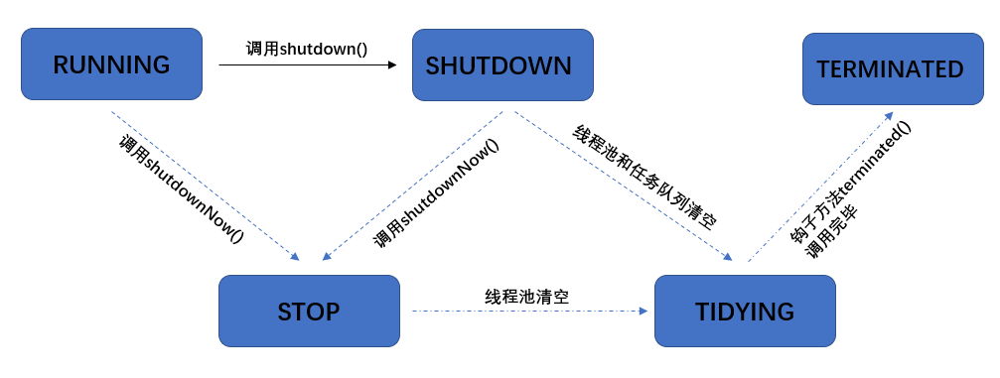


### 提交方法

```java
// 执行任务
void execute(Runnable command);

// 提交任务 task，用返回值 Future 获得任务执行结果
<T> Future<T> submit(Callable<T> task);
<T> Future<T> submit(Runnable task, T result);
Future<?> submit(Runnable task);

// 提交 tasks 中所有任务
<T> List<Future<T>> invokeAll(Collection<? extends Callable<T>> tasks)
    throws InterruptedException;

// 提交 tasks 中所有任务，带超时时间
<T> List<Future<T>> invokeAll(Collection<? extends Callable<T>> tasks,
                              long timeout, TimeUnit unit)
    throws InterruptedException;

// 提交 tasks 中所有任务，哪个任务先成功执行完毕，返回此任务执行结果，其它任务取消
<T> T invokeAny(Collection<? extends Callable<T>> tasks)
    throws InterruptedException, ExecutionException;

// 提交 tasks 中所有任务，哪个任务先成功执行完毕，返回此任务执行结果，其它任务取消，带超时时间
<T> T invokeAny(Collection<? extends Callable<T>> tasks,
                long timeout, TimeUnit unit)
 throws InterruptedException, ExecutionException, TimeoutException;
```

Future 接口有 5 个方法，它们分别是取消任务的方法 `cancel()`、判断任务是否已取消的方法 `isCancelled()`、判断任务是否已结束的方法 `isDone()` 以及2 个获得任务执行结果的 `get()` 和 `get(timeout, unit)`。

`execute()`方法用于提交不需要返回值的任务，所以无法判断任务是否被线程池执行成功与否；

`submit()`方法用于提交需要返回值的任务。线程池会返回一个 `Future` 类型的对象，通过这个 `Future` 对象可以判断任务是否执行成功，并且可以通过 `Future` 的 `get()`方法来获取返回值，`get()`方法会阻塞当前线程直到任务完成，而使用 `get（long timeout，TimeUnit unit）`方法的话，如果在 `timeout` 时间内任务还没有执行完，就会抛出 `java.util.concurrent.TimeoutException`


### 关闭方法

可以通过调用线程池的 shutdown 或 shutdownNow 方法来关闭线程池。它们的原理是遍历线程池中的工作线程，然后逐个调用线程的 interrupt 方法来中断线程，所以无法响应中断的任务可能永远无法终止。

ExecutorService 类 API：

| 方法                   | 说明                                                         |
| ---------------------- | ------------------------------------------------------------ |
| void shutdown()        | 将线程池的状态设置成 SHUTDOWN，然后中断所有没有正在执行任务的线程。 |
| List shutdownNow()     | 将线程池的状态设置成 STOP，然后尝试停止所有的正在执行或暂停任务的线程，并返回等待执行任务的列表 |
| boolean isShutdown()   | 调用 `shutdown()` 或 `shutdownNow()` 方法后返回为 true。     |
| boolean isTerminated() | 当所有的任务都已关闭后，才表示线程池关闭成功，返回为 true    |


### 工作原理

1. 首先检测线程池运行状态，如果不是RUNNING，则直接拒绝，线程池要保证在RUNNING的状态下执行任务。
2. 如果workerCount < corePoolSize，则创建并启动一个线程来执行新提交的任务。
3. 如果workerCount >= corePoolSize，且线程池内的阻塞队列未满，则将任务添加到该阻塞队列中。
4. 如果workerCount >= corePoolSize && workerCount < maximumPoolSize，且线程池内的阻塞队列已满，则创建并启动一个线程来执行新提交的任务。
5. 如果workerCount >= maximumPoolSize，并且线程池内的阻塞队列已满, 则根据拒绝策略来处理该任务, 默认的处理方式是直接抛异常。

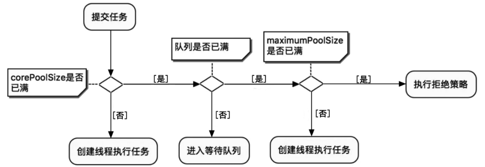


```java
public void execute(Runnable command) {
    if (command == null)
        throw new NullPointerException();
    // 获取ctl的值
    int c = ctl.get();
    // 判断如果当前工作线程数小于核心线程数，则创建新的核心线程并且执行传入的任务
    if (workerCountOf(c) < corePoolSize) {
        if (addWorker(command, true))
            // 如果创建新的核心线程成功则直接返回
            return;
        // 这里说明创建核心线程失败，需要更新ctl的临时变量c
        c = ctl.get();
    }
    // 当前工作线程数大于等于corePoolSize
    // 判断线程池是否处于运行中状态，同时尝试用非阻塞方法向任务队列放入任务（放入任务失败返回false）
    if (isRunning(c) && workQueue.offer(command)) {
        int recheck = ctl.get();
        // 对线程池的运行中状态做二次检查
        // 如果线程池二次检查状态是非运行中状态，则从任务队列移除当前的任务调用拒绝策略处理
        if (! isRunning(recheck) && remove(command))
            reject(command);
         // 如果当前工作线程数量为0，则必须要新创建一个线程处理队列中的任务
        else if (workerCountOf(recheck) == 0)
            addWorker(null, false);
    }
    // 如果向任务队列投放任务失败，则会尝试创建非核心线程传入任务执行
    // 创建非核心线程失败，此时需要拒绝执行任务
    else if (!addWorker(command, false))
        // 调用拒绝策略处理任务 - 返回
        reject(command);
}
```

`addWork() `的两个参数，第一个是需要提交的线程` Runnable firstTask`，第二个参数是 `boolean` 类型，表示是否为核心线程。 `execute()` 中有三处调用了 `addWork() `：

- 第一次，`addWorker(command, true)`，如果当前工作线程总数小于corePoolSize，则直接创建核心线程执行任务。
- 第二次，`addWorker(null, false); `，如果当前工作线程总数大于等于corePoolSize，判断线程池是否处于运行中状态，同时尝试用非阻塞方法向队列放入任务，这里会二次检查线程池运行状态。如果当前工作线程数量为0，则创建一个非核心线程并且传入的任务对象为null。为什么这里是 null ？之前已经把`command`提交到阻塞队列了`workQueue.offer(command)`，所以提交一个空线程，直接从阻塞队列里面取就可以了。
- 第三次，`if (!addWorker(command, false))`，阻塞队列满了，则会尝试创建非核心线程传入任务实例执行。


### 开发要求

阿里巴巴 Java 开发手册要求：

- 线程资源必须通过线程池提供，不允许在应用中自行显式创建线程

  - 使用线程池的好处是减少在创建和销毁线程上所消耗的时间以及系统资源的开销，解决资源不足的问题
  - 如果不使用线程池，有可能造成系统创建大量同类线程而导致消耗完内存或者过度切换的问题

- 线程池不允许使用 Executors 去创建，而是通过 ThreadPoolExecutor 的方式，这样的处理方式更加明确线程池的运行规则，规避资源耗尽的风险。

  Executors 返回的线程池对象弊端如下：

  - FixedThreadPool 和 SingleThreadExecutor：工作队列长度为 Integer.MAX_VALUE，可能会堆积大量的请求，从而导致 OOM（内存溢出）
  - CacheThreadPool ：允许创建线程数量为 Integer.MAX_VALUE，可能会创建大量的线程，导致 OOM
  - ScheduledThreadPool 和 SingleThreadScheduledExecutor : 使用的无界的延迟阻塞队列 `DelayedWorkQueue` ，任务队列最大长度为 `Integer.MAX_VALUE` ，可能堆积大量的请求，从而导致 OOM。
  
    

创建多大容量的线程池合适？

- 一般来说池中**总线程数是核心池线程数量两倍**，确保当核心池有线程停止时，核心池外有线程进入核心池
- 过小会导致程序不能充分地利用系统资源、容易导致饥饿
- 过大会导致更多的线程上下文切换，占用更多内存

核心线程数常用公式：

- **CPU 密集型任务   (N+1)：** 这可以将核心线程数设置为 **N (CPU 核心数) + 1**，比 CPU 核心数多出来的一个线程是为了防止线程发生缺页中断，或者其它原因导致的任务暂停而带来的影响。一旦任务暂停，CPU 某个核心就会处于空闲状态，而在这种情况下多出来的一个线程就可以充分利用 CPU 的空闲时间

- **I/O 密集型任务（2N+1）：** 这种系统 CPU 处于阻塞状态，用大部分的时间来处理 I/O 交互，而线程在处理 I/O 的时间段内不会占用 CPU 来处理，这时就可以将 CPU 交出给其它线程使用，因此在 I/O 密集型任务的应用中，我们可以多配置一些线程，具体的计算方法是 **2N+1 或 CPU 核数/ (1-阻塞系数)，阻塞系数在 0.8~0.9 之间**

- 经验公式如下 

  ```
  线程数 = 核数 * 期望 CPU 利用率 * 总时间(CPU计算时间+等待时间) / CPU 计算时间
  ```


## Executor 框架

### Executor 框架的两级调度模型

在 HotSpot VM 的线程模型中，Java 线程（java.lang.Thread）被一对一映射为本地操作系统线程。Java 线程启动时会创建一个本地操作系统线程；当该 Java 线程终止时，这个操作系统线程也会被回收。操作系统会调度所有线程并将它们分配给可用的 CPU。 

在上层，Java 多线程程序通常把应用分解为若干个任务，然后使用用户级的调度器 （Executor 框架）将这些任务映射为固定数量的线程；在底层，操作系统内核将这些线程映射到硬件处理器上。应用程序通过 Executor 框架控制上层的调度；而下层的调度由操作系统内核控制，下层的调度不受应用程序的控制。

### Executor 框架的结构与成员

Executor 框架主要由 3 大部分组成如下：

1. 任务。包括被执行任务需要实现的接口：Runnable 接口或 Callable 接口。
2. 任务的执行。包括任务执行机制的核心接口 Executor，以及继承自 Executor 的 ExecutorService 接口。Executor 框架有两个关键类实现了 ExecutorService 接口 （ThreadPoolExecutor 和 ScheduledThreadPoolExecutor）。 
3. 异步计算的结果。包括接口 Future 和实现 Future 接口的 FutureTask 类。

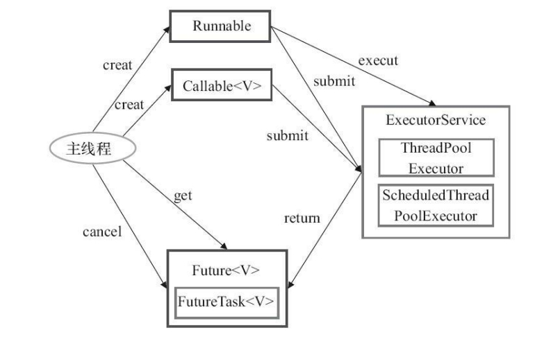

1. 主线程首先要创建实现 `Runnable` 或者 `Callable` 接口的任务对象。

2. 把创建完成的实现 `Runnable`/`Callable`接口的对象直接交给 `ExecutorService` 执行：`ExecutorService.execute(Runnable command)、Executor-Service.submit(Runnable task)、 ExecutorService.submit(Callabletask)`

3. 如果执行 `ExecutorService.submit（…）`，`ExecutorService` 将返回一个实现`Future`接口的对象。

4. 最后，主线程可以执行 `FutureTask.get()`方法来等待任务执行完成。主线程也可以执行 `FutureTask.cancel（boolean mayInterruptIfRunning）`来取消此任务的执行


#### **ThreadPoolExecutor**

Executors 可以创建 3 种类型的 ThreadPoolExecutor：SingleThreadExecutor、FixedThreadPool 和 CachedThreadPool。

##### **FixedThreadPool**

```java
public static ExecutorService newFixedThreadPool(int nThreads) {
    return new ThreadPoolExecutor(nThreads, nThreads,
                                  0L, TimeUnit.MILLISECONDS,
                                  new LinkedBlockingQueue<Runnable>());
}
```

特点：

- 核心线程数 == 最大线程数（没有非核心线程被创建），因此也无需空闲存活时间 
- 工作队列是无界的，可以放任意数量的任务，所以不会执行拒绝策略
- 可能出现OOM，因为队列是无界的，所以任务可能挤爆内存
- 适用于任务量已知，相对耗时的任务


##### **SingleThreadExecutor**

```java
public static ExecutorService newSingleThreadExecutor() {
    return new FinalizableDelegatedExecutorService
        (new ThreadPoolExecutor(1, 1,
                                0L, TimeUnit.MILLISECONDS,
                                new LinkedBlockingQueue<Runnable>()));
}
```

特点： 

* 线程数固定为 1，任务数多于 1 时，会放入无界队列排队。

* 任务执行完毕，这唯一的线程也不会被释放。 

* 适合希望多个任务顺序执行场景。


和自己创建一个线程来工作的区别？

自己创建一个单线程串行执行任务，如果任务执行失败而终止那么没有任何补救措施，而线程池还会新建一个线程，保证池的正常工作 


和Executors.newFixedThreadPool(1)的区别？

Executors.newSingleThreadExecutor() 线程个数始终为1，不能修改 

Executors.newFixedThreadPool(1) 初始时为1，以后还可以修改，对外暴露的是 ThreadPoolExecutor 对象，可以强转后调用 setCorePoolSize 等方法进行修改。


##### **CachedThreadPool**

```java
public static ExecutorService newCachedThreadPool() {
    return new ThreadPoolExecutor(0, Integer.MAX_VALUE,
                                  60L, TimeUnit.SECONDS,
                                  new SynchronousQueue<Runnable>());
}
```

特点 :

- 核心线程数是 0，最大线程数是 Integer.MAX_VALUE

- 队列采用了 SynchronousQueue 同步队列实现。SynchronousQueue 是一个没有容量的阻塞队列，每个插入操作必须等待另一个线程的对应移除操作。

* 适合任务数比较密集，但每个任务执行时间较短的情况

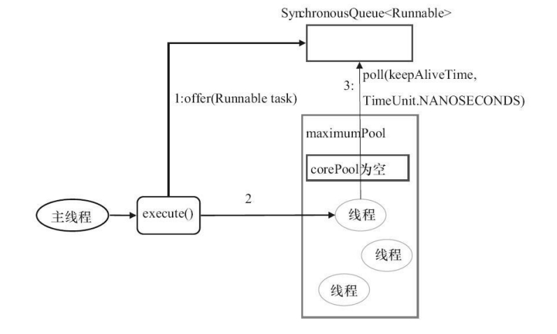

1. 首先执行 `SynchronousQueue.offer(Runnable task)`。如果当前 maximumPool 中有空闲线程正在执行 `SynchronousQueue.poll(keepAliveTime， TimeUnit.NANOSECONDS)`，那么主线程执行 offer 操作与空闲线程执行的 poll 操作配对成功，主线程把任务交给空闲线程执行，execute()方法执行完成。
2. 当初始 maximumPool 为空，或者 maximumPool 中当前没有空闲线程时，将没有线程执行 `SynchronousQueue.poll(keepAliveTime， TimeUnit.NANOSECONDS)`。此时 CachedThreadPool 会创建一个新线程执行任务，execute()方法执行完成。
3. 新创建的线程将任务执行完后，会执行 `SynchronousQueue.poll(keepAliveTime，TimeUnit.NANOSECONDS)`。这个 poll 操作会让空闲线程最多在 SynchronousQueue 中等待 60 秒钟。如果 60 秒钟内主线程提交了一个新任务，那么这个空闲线程将执行主线程提交的新任务；否则，这个空闲线程将终止。


#### ScheduledThreadPoolExecutor

Executors 可以创建 2 种类型的 ScheduledThreadPoolExecutor：

* ScheduledThreadPoolExecutor：包含若干个线程 ScheduledThreadPoolExecutor。适用于需要多个后台线程执行周期任务，同时为了满足资源管理的需求而需要限制后台线程的数量的应用场景

* SingleThreadScheduledExecutor：只包含一个线程 ScheduledThreadPoolExecutor。适用于需要单个后台线程执行周期任务，同时需要保证顺序地执行各个任务的应用场景。

```java
public static ScheduledExecutorService newScheduledThreadPool(int corePoolSize) {
    return new ScheduledThreadPoolExecutor(corePoolSize);
}
public ScheduledThreadPoolExecutor(int corePoolSize) {
    super(corePoolSize, Integer.MAX_VALUE,
          DEFAULT_KEEPALIVE_MILLIS, MILLISECONDS,
          new DelayedWorkQueue());
}
```

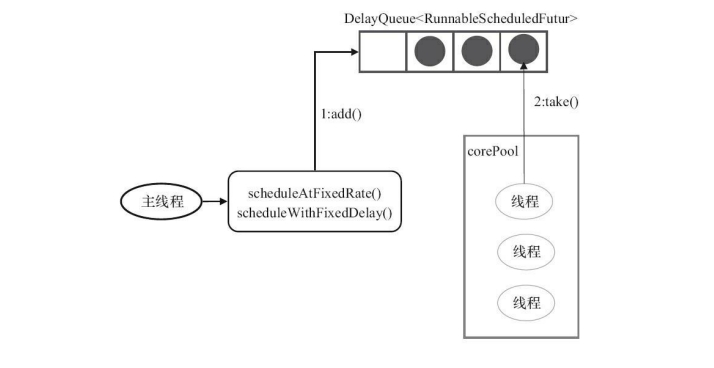

1. 当调用` ScheduledThreadPoolExecutor` 的 `scheduleAtFixedRate()` 方法或者 `scheduleWithFixedDelay()` 方法时，会向 `ScheduledThreadPoolExecutor` 的 `DelayQueue` 添加一个实现了 `RunnableScheduledFutur` 接口的 `ScheduledFutureTask`。

2. 线程池中的线程从 `DelayQueue` 中获取 `ScheduledFutureTask`，然后执行任务。

`ScheduledFutureTask` 主要包含 3 个成员变量：

* long time，表示这个任务将要被执行的具体时间。
* long sequenceNumber，表示这个任务被添加到 ScheduledThreadPoolExecutor 中的序号。
* long period，表示任务执行的间隔周期。

DelayQueue 封装了一个 PriorityQueue，这个 PriorityQueue 会对队列中的 ScheduledFutureTask 进行排序。排序时，time 小的排在前面（时间早的任务将被先执行）。如果两个 ScheduledFutureTask 的 time 相同，就比较 sequenceNumber，sequenceNumber 小 的排在前面。

线程从 DelayQueue 中获取已到期的 ScheduledFutureTask，线程执行完任务后修改 ScheduledFutureTask 的 time 变量为下次将要被执行的时间，最后将任务放回 DelayQueue 中。

```java
public E take() throws InterruptedException {
    final ReentrantLock lock = this.lock;
    lock.lockInterruptibly(); // 1
    try {
        for (; ; ) {
            E first = q.peek();
            if (first == null) {
                available.await(); // 2.1
            } else {
                long delay = first.getDelay(TimeUnit.NANOSECONDS);
                if (delay > 0) {
                    long tl = available.awaitNanos(delay); // 2.2
                } else {
                    E x = q.poll(); // 2.3.1
                    assert x != null;
                    if (q.size() != 0)
                        available.signalAll(); // 2.3.2
                    return x;
                }
            }
        }
    } finally {
        lock.unlock(); // 3
    }
}
```

1. 获取 Lock。 
2. 获取周期任务。 
   1. 如果 PriorityQueue 为空，当前线程到 Condition 中等待;
   2. 如果 PriorityQueue 的头元素的 time 时间比当前时间大，到 Condition 中等待到 time 时间；
   3. 获取 PriorityQueue 的头元素（2.3.1）；如果 PriorityQueue 不为空，则唤醒在 Condition 中等待的所有线程（2.3.2）。 
3. 释放 Lock。


#### Future 接口

Future 接口和实现 Future 接口的 FutureTask 类用来表示异步计算的结果。当我们把 Runnable 接口或 Callable 接口的实现类提交（submit）给 ThreadPoolExecutor 或 ScheduledThreadPoolExecutor 时，ThreadPoolExecutor 或 ScheduledThreadPoolExecutor 会向我们返回一个 FutureTask 对象。

```java
public interface Future<V> {
    // 取消任务执行
    // 成功取消返回 true，否则返回 false
    boolean cancel(boolean mayInterruptIfRunning);
    // 判断任务是否被取消
    boolean isCancelled();
    // 判断任务是否已经执行完成
    boolean isDone();
    // 获取任务执行结果
    V get() throws InterruptedException, ExecutionException;
    // 指定时间内没有返回计算结果就抛出 TimeOutException 异常
    V get(long timeout, TimeUnit unit) throws InterruptedException, ExecutionException, TimeoutExceptio
}
```


#### Runnable 接口和 Callable 接口

Runnable 接口和 Callable 接口的实现类，都可以被 ThreadPoolExecutor 或 ScheduledThreadPoolExecutor 执行。它们之间的区别是 Runnable 不会返回结果，而 Callable 可以返回结果和抛出异常。


## ThreadLocal

线程安全问题引发的"三要素"：多线程、共享资源/临界资源、非原子性操作，简而言之：在同一时刻，多条线程同时对临界资源进行非原子性操作则有可能产生线程安全问题。而如果想要解决线程安全问题，我们只需要破坏掉三要素中的任意条件即可，如下：

- 破坏多线程条件：同一时刻，一条线程对共享资源进行非原子性操作，不会产生线程安全问题
- 破坏共享资源条件：同一时刻多条线程对局部资源进行非原子性操作，也不会产生线程安全问题
- 破坏非原子性条件：同一时刻多条线程对共享资源进行原子性操作，也不会产生线程安全问题

CAS机制是利用上面第三点：破坏非原子性条件，保证原子性来解决线程安全问题；

Synchronized与ReetrantLock则是利用上述第一点：破坏多线程条件，在同一时刻只允许一条线程访问临界资源解决此问题；

而ThreadLocal则是通过如上第二点：破坏共享资源条件解决线程安全问题。


ThreadLocal 实现每一个线程都有自己专属的本地变量副本来避免共享，使用 `get()` 和 `set()` 方法来获取默认值或将其值更改为当前线程所存的副本的值，从而避免了线程安全问题。

### **ThreadLocal 的工作原理**

ThreadLocal 的目标是让不同的线程有不同的变量 V，那最直接的方法就是创建一个 Map，它的 Key 是线程，Value 是每个线程拥有的变量 V，ThreadLocal 内部持有这样的一个 Map 就可以了。

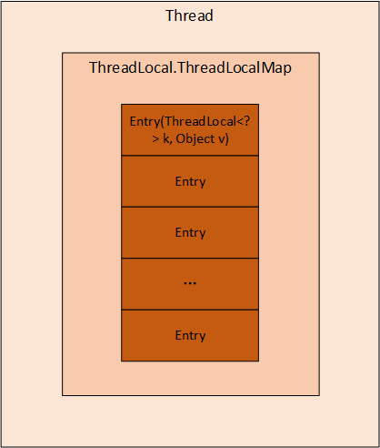

每个`Thread`都有一个类型为`ThreadLocal.ThreadLocalMap`的实例变量`threadLocals`，也就是说每个线程有一个自己的`ThreadLocalMap`。这个 `threadLocals` 就是每条线程用来存储变量副本的，key值为当前 `ThreadLocal` 对象，value为变量值。

```java
// ThreadLocal类
public class ThreadLocal<T> {
    // ThreadLocal内部类：ThreadLocalMap
    static class ThreadLocalMap {
        // ThreadLocalMap内部类：Entry
        static class Entry extends WeakReference<ThreadLocal<?>> {
            Object value;
            Entry(ThreadLocal<?> k, Object v) {
                super(k);
                value = v;
            }
        }
    }
}
```

每个线程在往`ThreadLocal`里放值的时候，都会往自己的`ThreadLocalMap`里存，读也是以`ThreadLocal`作为引用，在自己的`map`里找对应的`key`，从而实现了线程隔离。


set：

```java
public void set(T value) {
    // 获取当前线程
    Thread t = Thread.currentThread();
    // 将当前线程作为key，去查找对应的线程变量，找到则设置
    ThreadLocalMap map = getMap(t);
    if (map != null)
        map.set(this, value);
    else
        // 第一次调用就创建当前线程对应的HashMap
        createMap(t, value);
}
ThreadLocalMap getMap(Thread t) {
    return t.threadLocals;
}
```

如果 getMap(t) 的返回值不为空，则把 value 值设置到 threadLocals 中，也就是把当前变量值放入当前线程的内存变量 threadLocals 中。threadLocals 是一个 HashMap 结构，其 中 key 就是当前 ThreadLocal 的实例对象引用，value 是通过 set 方法传递的值。 

如果 getMap(t) 返回空值则说明是第一次调用 set 方法， 这时创建当前线程的 threadLocals 变量。

```java
void createMap(Thread t, T firstValue) {
    t.threadLocals = new ThreadLocalMap(this, firstValue);
}
```


get：

```java
public T get() {
    // 获取当前线程
    Thread t = Thread.currentThread();
    // 获取当前线程的threadLocals变量
    ThreadLocalMap map = getMap(t);
    // 如果threadLocals不为null，则返回对应本地变量的值
    if (map != null) {
        ThreadLocalMap.Entry e = map.getEntry(this);
        if (e != null) {
            @SuppressWarnings("unchecked")
            T result = (T)e.value;
            return result;
        }
    }
    // threadLocals为空则初始化当前线程的threadLocals成员变量
    return setInitialValue();
}
private T setInitialValue() {
    // 初始化为null
    T value = initialValue();
    Thread t = Thread.currentThread();
    ThreadLocalMap map = getMap(t);
    // 如果当前线程的threadLocals变量不为空
    if (map != null)
        map.set(this, value);
    else
        // 如果当前线程的threadLocals变量为空
        createMap(t, value);
    return value;
}
protected T initialValue() {
    return null;
}
```

调用`get()`方法之后首先会获取当前线程的`threadLocals`成员变量(即`ThreadLocalMap`)，如map不为空则以为`this`作为key获取`ThreadLocal`中存储的变量副本，如果为空则调用`setInitialValue()`方法。


### **内存泄露**

`ThreadLocalMap` 中使用的 key 为 `ThreadLocal` 的弱引用，而 value 是强引用。所以，如果 `ThreadLocal` 没有被外部强引用的情况下，在垃圾回收的时候，Entry.key 会被清理掉，而 Entry.value 不会被清理掉。

这样一来，`ThreadLocalMap` 中就会出现 key 为 null 的 Entry。假如不做任何措施的话，value 永远无法被 GC 回收，这个时候就可能会产生内存泄露。`ThreadLocalMap` 实现中已经考虑了这种情况，在调用 `set()`、`get()`、`remove()` 方法的时候，会清理掉 key 为 null 的记录。使用完 `ThreadLocal`方法后最好手动调用`remove()`方法。


### ThreadLocalMap Hash算法

既然是`Map`结构，那么`ThreadLocalMap`当然也要实现自己的`hash`算法来解决散列表数组冲突问题。

```java
int i = key.threadLocalHashCode & (len-1);
```

`ThreadLocalMap`中`hash`算法很简单，这里`i`就是当前 key 在散列表中对应的数组下标位置。

这里最关键的就是`threadLocalHashCode`值的计算，`ThreadLocal`中有一个属性为`HASH_INCREMENT = 0x61c88647`

```java
public class ThreadLocal<T> {
    private final int threadLocalHashCode = nextHashCode();

    private static AtomicInteger nextHashCode = new AtomicInteger();
	// // 0x61c88647为斐波那契散列乘数，哈希得到的结果会比较分散
    private static final int HASH_INCREMENT = 0x61c88647;

    private static int nextHashCode() {
        return nextHashCode.getAndAdd(HASH_INCREMENT);
    }

    static class ThreadLocalMap {
        ThreadLocalMap(ThreadLocal<?> firstKey, Object firstValue) {
            table = new Entry[INITIAL_CAPACITY];
            int i = firstKey.threadLocalHashCode & (INITIAL_CAPACITY - 1);

            table[i] = new Entry(firstKey, firstValue);
            size = 1;
            setThreshold(INITIAL_CAPACITY);
        }
    }
}
```

每当创建一个`ThreadLocal`对象，这个`ThreadLocal.nextHashCode` 这个值就会增长 `0x61c88647` 。

这个值很特殊，它是斐波那契数 也叫 黄金分割数。`hash`增量为这个数字，带来的好处就是 `hash` 分布非常均匀。

使用的是线性探测法解决hash冲突。


### ThreadLocalMap.get()

```java
// ThreadLocal类 -> ThreadLocalMap内部类 -> getEntry()方法
private Entry getEntry(ThreadLocal<?> key) {
    int i = key.threadLocalHashCode & (table.length - 1);
    // 获取table[i]位置的元素，如果不为空并且key相同则返回
    Entry e = table[i];
    if (e != null && e.get() == key)
        return e;
    // 如果key不相同则遍历整个table[i]之后的元素获取对应key的值
    else
        return getEntryAfterMiss(key, i, e);
}

// ThreadLocal类 -> ThreadLocalMap内部类 -> getEntryAfterMiss()方法
private Entry getEntryAfterMiss(ThreadLocal<?> key, int i, Entry e) {
    Entry[] tab = table;
    int len = tab.length;
    // 遍历整个table[i]之后的元素
    while (e != null) {
        ThreadLocal<?> k = e.get();
        // 如果key相同则返回对应的元素
        if (k == key)
            return e;
        if (k == null)
            expungeStaleEntry(i);
        else
            i = nextIndex(i, len);
        e = tab[i];
    }
    return null;
}
```

**第一种情况：** 通过查找`key`值计算出散列表中位置，然后该位置中的`Entry.key`和查找的`key`一致，则直接返回。

**第二种情况：** `slot`位置中的`Entry.key`和要查找的`key`不一致：往后遍历查找，如果时遇到`key=null`，触发一次探测式数据回收操作，执行`expungeStaleEntry()`方法，直到Entry为null或找到匹配值。


### ThreadLocalMap.set()

```java
//ThreadLocalMap类 → set()方法
private void set(ThreadLocal<?> key, Object value) {
    // 获取table及其长度
    Entry[] tab = table;
    int len = tab.length;
    // 使用key的哈希值和数组长度计算获取索引值
    int i = key.threadLocalHashCode & (len-1);

    // 遍历table如果已经存在则更新值，不存在则创建
    for (Entry e = tab[i];
         e != null;
         e = tab[i = nextIndex(i, len)]) {
        ThreadLocal<?> k = e.get();
        // 如果key相同，则使用新value替换老value
        if (k == key) {
            e.value = value;
            return;
        }
        // 如果table[i]为空则创建新的Entry存储
        if (k == null) {
            replaceStaleEntry(key, value, i);
            return;
        }
    }

    tab[i] = new Entry(key, value);
    int sz = ++size;
    // 如果执行完启发式清理工作后，未清理到任何数据，且当前散列数组中Entry的数量已经达到了列表的扩容阈值，就扩容
    if (!cleanSomeSlots(i, sz) && sz >= threshold)
        rehash();
}
```

```java
private void replaceStaleEntry(ThreadLocal<?> key, Object value,
                               int staleSlot) {
    Entry[] tab = table;
    int len = tab.length;
    Entry e;
	// 1) 向前遍历检查过期的Entry并更新 slotToExpunge 遇到null结束
    int slotToExpunge = staleSlot;
    for (int i = prevIndex(staleSlot, len);
         (e = tab[i]) != null;
         i = prevIndex(i, len))
        if (e.get() == null)
            slotToExpunge = i;

    // 向后遍历
    for (int i = nextIndex(staleSlot, len);
         (e = tab[i]) != null;
         i = nextIndex(i, len)) {
        ThreadLocal<?> k = e.get();

        // 2) 找到key值相同的Entry，更新value并和staleSlot位置交换
        if (k == key) {
            e.value = value;

            tab[i] = tab[staleSlot];
            tab[staleSlot] = e;

            if (slotToExpunge == staleSlot)
                slotToExpunge = i;
            cleanSomeSlots(expungeStaleEntry(slotToExpunge), len);
            return;
        }

        if (k == null && slotToExpunge == staleSlot)
            slotToExpunge = i;
    }

    // 如果没有找到相同 key 值的 Entry 数据：创建新的Entry，替换table[stableSlot]位置。
    tab[staleSlot].value = null;
    tab[staleSlot] = new Entry(key, value);

    if (slotToExpunge != staleSlot)
        cleanSomeSlots(expungeStaleEntry(slotToExpunge), len);
}
```

**第一种情况：** 通过`hash`计算后的槽位对应的`Entry`数据为空：直接将数据放到槽位即可

**第二种情况：** 槽位数据不为空，`key`值与当前`ThreadLocal`通过`hash`计算获取的`key`值一致：更新该槽位的数据。

**第三种情况：** 槽位数据不为空，往后遍历过程中，在找到`Entry`为`null`的槽位之前，没有遇到`key`过期的`Entry`：遍历散列数组，线性往后查找，如果找到`Entry`为`null`的槽位，则将数据放入该槽位中，或者往后遍历过程中，遇到了**key 值相等**的数据，直接更新即可。

**第四种情况：** 槽位数据不为空，往后遍历过程中，在找到`Entry`为`null`的槽位之前，遇到`key`过期的`Entry`：


> 绿色块`Entry`代表正常数据，灰色块代表`Entry`的`key`值为`null`，已被垃圾回收。白色块表示`Entry`为`null`

散列数组下标为 7 位置对应的`Entry`数据`key`为`null`，表明此数据`key`值已经被垃圾回收掉了，此时就会执行`replaceStaleEntry()`方法，进行探测式数据清理工作。

数据清理工作：

1）以当前`staleSlot`开始向前迭代查找，找其他过期的数据，然后更新过期数据起始扫描下标`slotToExpunge`。`for`循环迭代，直到碰到`Entry`为`null`结束。

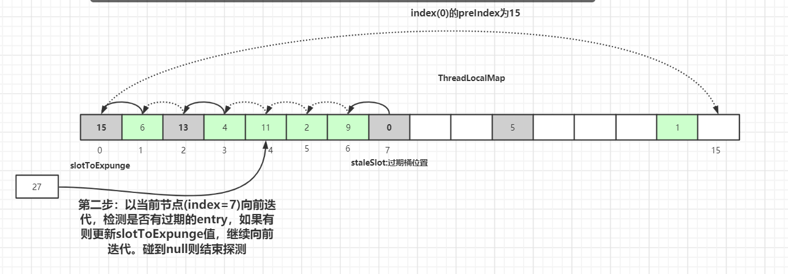

2）然后从当前节点`staleSlot`向后查找`key`值相等的`Entry`元素，找到后更新`Entry`的值并交换`staleSlot`元素的位置(`staleSlot`位置为过期元素)，更新`Entry`数据。如果没有找到相同 key 值的 Entry 数据：创建新的`Entry`，替换`table[stableSlot]`位置。

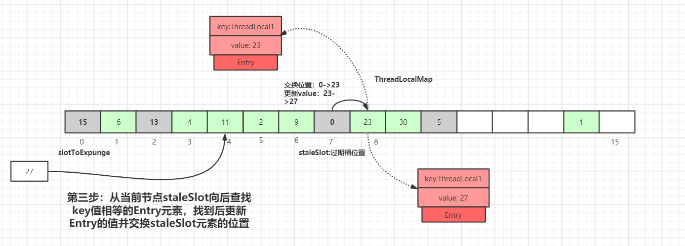

3）然后开始进行过期`Entry`的清理工作：`expungeStaleEntry()`探测式清理和`cleanSomeSlots()`启发式清理工作.

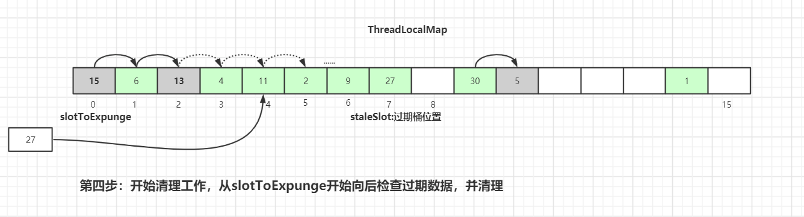


### 清理工作

`ThreadLocalMap`的两种过期`key`数据清理方式：**探测式清理**和**启发式清理**。

探测式清理，也就是`expungeStaleEntry`方法，遍历散列数组，向后探测清理过期数据，将过期数据的`Entry`设置为`null`，沿途中碰到未过期的数据则将此数据`rehash`后重新在`table`数组中定位，如果定位的位置已经有了数据，则会将未过期的数据放到最靠近此位置的`Entry=null`的桶中，使`rehash`后的`Entry`数据距离正确的桶的位置更近一些。

```java
private int expungeStaleEntry(int staleSlot) {
    Entry[] tab = table; 
    int len = tab.length;

    // 清理staleSlot位置的过期条目
    tab[staleSlot].value = null;  // 将value设置为null，准备进行GC
    tab[staleSlot] = null;        // 将该条目置为null
    size--;                       // 减少哈希表中的有效条目数

    // Rehash直到遇到null
    Entry e;
    int i;
    for (i = nextIndex(staleSlot, len);
         (e = tab[i]) != null;
         i = nextIndex(i, len)) {
        ThreadLocal<?> k = e.get();  // 获取ThreadLocal的键

        if (k == null) {
            // 如果发现键已经被GC，说明这是一个过期的条目，继续清理
            e.value = null;
            tab[i] = null;
            size--;
        } else {
            // 如果键有效，则重新计算它的哈希值，检查它是否在正确的位置
            int h = k.threadLocalHashCode & (len - 1);
            if (h != i) {
                // 如果不在正确的位置，将其移动到正确的位置
                tab[i] = null;

                // 使用线性探测法找到下一个可用槽位
                while (tab[h] != null)
                    h = nextIndex(h, len);
                tab[h] = e;  // 将条目放置在正确的槽位
            }
        }
    }
    return i;  // 返回最后清理的位置
}
```

`set`和`get`到都会触发探测式清理操作。


启发式清理：执行logn次探测式清理

```java
private boolean cleanSomeSlots(int i, int n) {
    boolean removed = false;  // 标记是否成功清理过期Entry
    Entry[] tab = table; 
    int len = tab.length; 

    // 循环扫描部分槽位，清理过期Entry
    do {
        i = nextIndex(i, len);    
        Entry e = tab[i]; 
        if (e != null && e.get() == null) {  // 过期Entry
            n = len;          
            removed = true;       
            i = expungeStaleEntry(i);  // 清理过期Entry并重新散列
        }
    } while ( (n >>>= 1) != 0); 

    return removed; 
}
```


### 扩容机制

在`ThreadLocalMap.set()`方法的最后，如果执行完启发式清理工作后，未清理到任何数据，且当前散列数组中`Entry`的数量已经达到了列表的扩容阈值`(len*2/3)`，就开始执行`rehash()`逻辑：

```java
private void rehash() {
    expungeStaleEntries();

    if (size >= threshold - threshold / 4)
        resize();
}

private void expungeStaleEntries() {
    Entry[] tab = table;
    int len = tab.length;
    for (int j = 0; j < len; j++) {
        Entry e = tab[j];
        if (e != null && e.get() == null)
            expungeStaleEntry(j);
    }
}
private void resize() {
    Entry[] oldTab = table;
    int oldLen = oldTab.length;
    int newLen = oldLen * 2;
    Entry[] newTab = new Entry[newLen];
    int count = 0;

    for (int j = 0; j < oldLen; ++j) {
        Entry e = oldTab[j];
        if (e != null) {
            ThreadLocal<?> k = e.get();
            if (k == null) {
                e.value = null;
            } else {
                int h = k.threadLocalHashCode & (newLen - 1);
                while (newTab[h] != null)
                    h = nextIndex(h, newLen);
                newTab[h] = e;
                count++;
            }
        }
    }

    setThreshold(newLen);
    size = count;
    table = newTab;
}
```

`rehash()`首先是会进行探测式清理工作，从`table`的起始位置往后清理。清理完成之后，`table`中可能有一些`key`为`null`的`Entry`数据被清理掉，所以此时通过判断`size >= threshold - threshold / 4` 也就是`size >= threshold * 3/4` 来决定是否扩容。

扩容后的`tab`的大小为`oldLen * 2`，然后遍历老的散列表，重新计算`hash`位置，然后放到新的`tab`数组中，如果出现`hash`冲突则往后寻找最近的`entry`为`null`的槽位，遍历完成之后，`oldTab`中所有的`entry`数据都已经放入到新的`tab`中了。
