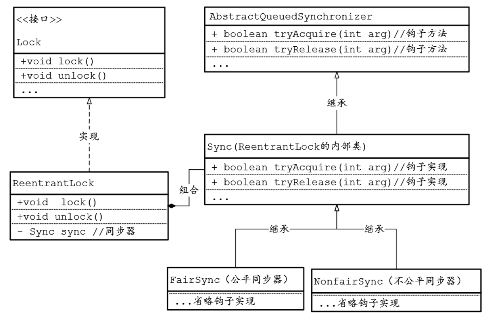
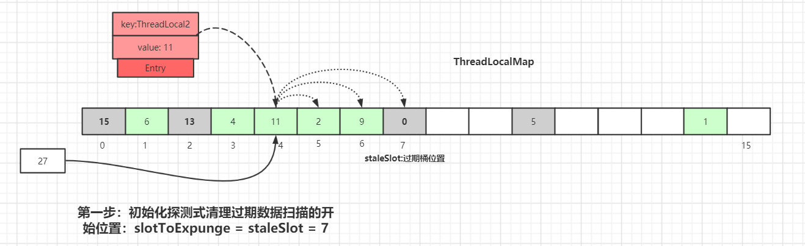

---
hide:
  - navigation
---

## 死锁

死锁是指两个或两个以上的线程（或进程）在运行过程中，因为资源竞争而造成相互等待的现象，若无外力作用则不会解除等待状态，它们之间的执行都将无法继续下去。

Java 死锁产生的四个必要条件：

1. 互斥条件，即当资源被一个线程使用（占有）时，别的线程不能使用
2. 不可剥夺条件，资源请求者不能强制从资源占有者手中夺取资源，资源只能由资源占有者主动释放
3. 请求和保持条件，即当资源请求者在请求其他的资源的同时保持对原有资源的占有
4. 循环等待条件，即存在一个等待循环队列：p1 要 p2 的资源，p2 要 p1 的资源，形成了一个等待环路


定位死锁：

通过`jps+jstack`工具排查：`jps` + `jstack -l <PID>`

通过`jconsole`工具排查：首先按`win+r`调出运行窗口，然后输入`JConsole`命令

Linux 下可以通过 top 先定位到 CPU 占用高的 Java 进程，再利用 `top -Hp 进程id` 来定位是哪个线程，最后再用 jstack 的输出来看各个线程栈


## synchronized

Java 中的每一个对象都可以作为锁。 具体表现为以下 3 种形式：

1. 对于普通同步方法，锁是当前实例对象。 
2. 对于静态同步方法，锁是当前类的 Class 对象。 
3. 对于同步代码块，锁是 synchonized 括号里配置的对象。

注意：

* 当一个线程正在访问一个被`synchronized`修饰的实例方法时，其他线程则不能访问该对象的其他被`synchronized`修饰的对象实例方法，毕竟一个对象只有一把锁，当一个线程获取了该对象的锁之后，其他线程无法获取该对象的锁，所以无法访问该对象的其他被`synchronized`修饰的对象实例方法。

* 如果一个线程`A`，调用一个被`synchronized`修饰的普通实例方法；而线程`B`通过这个实例对象，调用被`synchronized`修饰的`static`方法，这是允许同时执行的，并不会发生互斥现象。因为访问静态`synchronized`方法的线程，获取的是当前类的`class`对象的锁资源；而访问非静态`synchronized`方法的线程，获取的是当前实例对象锁资源。


### 对象头

在`JVM`中，一个`Java`对象在内存的布局，会分为三个区域：**对象头、对象体、对齐填充**。


如果对象是数组类型，则虚拟机用 3个字宽存储对象头（额外存储数组长度），如果对象是非数组类型，则用 2 字宽存储对象头。

> 在 32 位虚拟机中，1 字宽等于 4 字节，即 32bit；64位虚拟机下，一个字宽大小为 8 字节。

Class Pointer（类对象指针）字段是一个指向方法区中Class信息的指针。

Mark Word 里默认存储对象的 HashCode、分代年龄、锁标记、锁状态等。在运行期间，Mark Word 里存储的数据会随着锁标志位的变化而变化：


当状态为**无锁**时，Mark Word存储的是hashCode；

当状态为**偏向锁**时，Mark Word存储的是偏向的线程ID。

当状态为**轻量级锁**时，Mark Word 存储的是指向栈帧中 LockRecord 的指针。

当状态为**重量级锁**时，Mark Word 存储的是指向`monitor`对象的指针。


### 管程 Monitor

每个 Java 对象都关联一个 Monitor 对象，如果使用 synchronized 给对象上锁（重量级）之后，该对象头的Mark Word 中就被设置指向 Monitor 对象的指针。

JVM 基于进入和退出 Monitor 对象来实现方法同步和代码块同步，代码块同步是使用 `monitorenter` 和 `monitorexit` 指令实现的，而同步方法则是依靠方法修饰符上的 `ACC_SYNCHRONIZED` 来完成的。无论采用哪种方式，其本质是对一个对象的监视器（monitor）进行获取，而这个获取过程是排他的，也就是同一时刻只能有一个线程获取到由 synchronized 所保护对象的监视器。

```java
public class Concurrency {
    public static void main(String[] args) {
        // 对 Synchronized Class 对象进行加锁
        synchronized (Synchronized.class) {
        }
        // 静态同步方法，对 Synchronized Class 对象进行加锁
        m();
    }
    public static synchronized void m() {
    }
}
```

编译以上代码，然后在 Concurrency.class 同级目录执行 javap –v Concurrency.class，部分相关输出如下所示：

```java
public static void main(java.lang.String[]);
     flags: ACC_PUBLIC, ACC_STATIC // 方法修饰符，表示：public static
     Code:
     stack=2,locals=1,args_size=1
     0:ldc #2 // class lombok/Synchronized
     2:dup
     3:monitorenter // monitorenter：监视器进入，获取锁
     4:monitorexit // monitorexit：监视器退出，释放锁
     15: invokestatic #3 // Method m:()V
     8:return
public static synchronized void m(); 
     flags:ACC_PUBLIC,ACC_STATIC,ACC_SYNCHRONIZED // 表示： public static synchronized
     Code:
     stack=0,locals=0,args_size=0 0:return
```


在`HotSpot`虚拟机中，`monitor`是由`ObjectMonitor`实现的。`monitor`本质就是存在于堆中的特殊对象。

```c++
 //Monitor结构体
 ObjectMonitor::ObjectMonitor() {  
   _header      = NULL;  
   _count       = 0;  
   _waiters     = 0,  

   //线程的重入次数
   _recursions  = 0;      
   _object       = NULL;  

   //标识拥有该Monitor的线程
   _owner        = NULL;   

  //等待线程组成的双向循环链表
   _WaitSet             = NULL;  
   _WaitSetLock  = 0 ;  
   _Responsible  = NULL ;  
   _succ                = NULL ;  

  //多线程竞争锁进入时的单向链表
   cxq                  = NULL ; 
   FreeNext             = NULL ;  

  //_owner从该双向循环链表中唤醒线程节点
   _EntryList           = NULL ; 
   _SpinFreq            = 0 ;  
   _SpinClock           = 0 ;  
   OwnerIsThread = 0 ;  
 }
```


Cxq：竞争队列(Contention Queue)，所有请求锁的线程首先被放在这个竞争队列中。

EntryList: Cxq中那些有资格成为候选资源的线程被移动到EntryList中。

WaitSet：某个拥有ObjectMonitor的线程在调用Object.wait()方法之后将被阻塞，然后该线程将被放置在WaitSet链表中，直到某个时刻通过Object.notify()或者Object.notifyAll()唤醒，该线程就会重新进入EntryList中。


### 锁膨胀/锁升级

锁一共有 4 种状态，级别从低到高依次是：无锁状态、偏向锁状态、轻量级锁状态和重量级锁状态，这几个状态会随着竞争情况逐渐升级。锁可以升级但不能降级，目的是为了提高获得锁和释放锁的效率。

偏向锁是在没有发生锁争用的情况下使用的；一旦有了第二个线程争用锁，偏向锁就会升级为轻量级锁；如果锁争用很激烈，轻量级锁的CAS自旋到达阈值后，轻量级锁就会升级为重量级锁。

#### 偏向锁

大多数情况下，锁不仅不存在多线程竞争，而且总是由同一线程多次获得，如果每次还有阻塞线程，唤醒CPU从用户态转为核心态，那么对于CPU是一种资源的浪费，为了让线程获得锁的代价更低而引入了偏向锁。

如果不存在线程竞争的一个线程获得了锁，那么锁就进入偏向状态，此时Mark Word的结构变为偏向锁结构，锁对象的锁标志位(lock)被改为01，偏向标志位(biased_lock)被改为1，然后线程的ID记录在锁对象的MarkWord中（使用CAS操作完成）。以后该线程获取锁时判断一下线程ID和标志位，就可以直接进入同步块，连CAS操作都不需要，这样就省去了大量有关锁申请的操作，从而也就提升了程序的性能。

偏向锁的主要作用是消除无竞争情况下的同步原语，进一步提升程序性能，所以，在没有锁竞争的场合，偏向锁有很好的优化效果。但是，一旦有第二条线程需要竞争锁，那么偏向模式立即结束，进入轻量级锁的状态。

即在无竞争时，之前获得锁的线程再次获得锁时会判断偏向锁的线程ID是否指向自己

* 如果是，那么该线程将不用再次获得锁，直接就可以进入同步块；
* 如果未指向当前线程，当前线程就会采用CAS操作将Mark Word中的线程ID设置为当前线程ID；
  * 如果CAS操作成功，那么获取偏向锁成功，执行同步代码块；
  * 如果CAS操作失败，那么表示有竞争，抢锁线程被挂起，撤销占锁线程的偏向锁，然后将偏向锁膨胀为轻量级锁。


**偏向锁的撤销**：

1. 在一个安全点停止拥有锁的线程。

1. 遍历线程的栈帧，检查是否存在锁记录。如果存在锁记录，就需要清空锁记录，使其变成无锁状态，并修复锁记录指向的Mark Word，清除其线程ID。

1. 将当前锁升级成轻量级锁。

4. 唤醒当前线程。

撤销偏向锁的条件：

1. 多个线程竞争偏向锁。
2. 调用偏向锁对象的hashcode()方法或者System.identityHashCode()方法计算对象的HashCode之后，将哈希码放置到Mark Word中，内置锁变成无锁状态，偏向锁将被撤销。


**关闭偏向锁**：

偏向锁是默认是延迟的，不会在程序启动时立即生效，如果想避免延迟，可以加 VM 参数 `-XX:BiasedLockingStartupDelay=0` 来禁用延迟。JDK 8 延迟 4s 开启偏向锁原因：在刚开始执行代码时，会有好多线程来抢锁，如果开偏向锁就会造成偏向锁不断的进行锁撤销和锁升级的操作，效率反而降低。

禁用偏向锁，运行时在添加 VM 参数 `-XX:-UseBiasedLocking=false` 禁用偏向锁。


#### 轻量级锁

引入轻量级锁的主要目的是在多线程竞争不激烈的情况下，通过CAS机制竞争锁减少重量级锁产生的性能损耗。重量级锁使用了操作系统底层的互斥锁(MutexLock)，会导致线程在用户态和核心态之间频繁切换，从而带来较大的性能损耗。轻量级锁是一种自旋锁，因为JVM本身就是一个应用，所以希望在应用层面上通过自旋解决线程同步问题。

在抢锁线程进入临界区之前，如果内置锁（临界区的同步对象）没有被锁定，JVM首先将在抢锁线程的栈帧中建立一个锁记录(LockRecord)，用于存储对象目前Mark Word的拷贝，称为 `Displaced Mark Word`。

然后抢锁线程将使用CAS自旋操作，尝试将内置锁对象头的Mark Word的ptr_to_lock_record（锁记录指针）更新为抢锁线程栈帧中锁记录的地址，如果这个更新执行成功了，这个线程就拥有了这个对象锁。

为什么会将内置锁对象的Mark Word复制到锁记录的Displaced Mark Word字段？

> 因为内置锁对象的Mark Word的结构会有所变化，Mark Word将会出现一个指向锁记录的指针，而不再存着无锁状态下的锁对象哈希码等信息，所以必须将这些信息暂存起来，供后面在锁释放时使用。


轻量级锁的本意是为了减少多线程进入操作系统底层的互斥锁(Mutex Lock)的概率，并不是要替代操作系统互斥锁。所以，在争用激烈的场景下，轻量级锁会膨胀为基于操作系统内核互斥锁实现的重量级锁。


#### 重量级锁

由于JVM轻量级锁使用CAS进行自旋抢锁，这些CAS操作都处于用户态下，进程不存在用户态和内核态之间的运行切换，因此JVM轻量级锁开销较小。而JVM重量级锁使用了Linux内核态下的互斥锁，这是重量级锁开销很大的原因。

注意：

当调用一个锁对象的`wait、notify`方法时，如当前锁的状态是偏向锁或轻量级锁，则会先膨胀成重量级锁，因为`wait、notify`方法要依赖于`Monitor`对象实现。


| 锁       | 优点                                                         | 缺点                                           | 适用场景                         |
| -------- | ------------------------------------------------------------ | ---------------------------------------------- | -------------------------------- |
| 偏向锁   | 加锁解锁不需要额外消耗，和执行非同步方法相比仅存在纳秒级差距 | 如果线程间存在锁竞争，会带来额外的锁撤销的消耗 | 适用于只有一个线程访问同步块场景 |
| 轻量级锁 | 竞争的线程不会阻塞，提高了响应速度                           | 始终得不到锁的线程，使用自旋会消耗CPU          | 锁占用时间很短，吞吐量低         |
| 重量级锁 | 线程竞争不会使用自旋，不会消耗CPU                            | 线程阻塞，响应时间慢                           | 锁占用时间较长，吞吐量高         |


### 锁优化

锁膨胀/锁升级、适应性自旋锁、锁消除、锁粗化、轻量级锁、偏向锁


**适应性自旋锁**：

挂起线程和恢复线程的操作都需要转入内核态中完成，共享数据的锁定状态只会持续很短的一段时间，为了这段时间去挂起和恢复线程并不值得。

在线程尝试获取锁时，如果锁已经被其他线程占用，而当前线程的CPU资源没有耗尽，就可以让后面请求锁的那个线程“稍等一会”，但不放弃处理器的执行时间，看看持有锁的线程是否很快就会释放锁。为了让线程等待，我们只须让线程执行一个忙循环（自旋），这项技术就是所谓的自旋锁。

适应性自旋意味着自旋的时间不再是固定的，而是会动态根据实际情况来改变。


**锁消除**：

锁消除是指虚拟机即时编译器在运行时，对一些代码要求同步，但是被检测到不可能存在共享数据竞争的锁进行消除。

锁消除主要是通过逃逸分析来支持，如果堆上的共享数据不可能逃逸出去被其它线程访问到，那么就可以把它们当作栈上数据对待，也就可以将它们的锁进行消除。


**锁粗化**：

如果一系列的连续操作都对同一个对象反复加锁和解锁，甚至加锁操作是出现在循环体之中的，那即使没有线程竞争，频繁地进行互斥同步操作也会导致不必要的性能损耗。

如果虚拟机探测到有这样一串零碎的操作都对同一个对象加锁，将会把加锁同步的范围扩展（粗化）到整个操作序列的外部。


## Java内存模型

Java内存模型的主要目的是定义程序中各种变量的访问规则，即关注在虚拟机中把变量值存储到内存和从内存中取出变量值这样的底层细节。

Java内存模型的规定如下：

1. 所有变量存储在主存中。
2. 每个线程都有自己的工作内存，且对变量的操作都是在工作内存中进行的。
3. 不同线程之间无法直接访问彼此工作内存中的变量，要想访问只能通过主存来传递。


### 三大特性

**原子性**

一个或者多个操作在 CPU 执行的过程中不被中断的特性称为原子性。

在 Java 中，可以借助`synchronized`、各种 `Lock` 以及各种原子类实现原子性。

**可见性**

一个线程对共享变量的修改，另一个线程能够立刻可见，称该共享变量具备内存可见性。

单线程程序不会出现内存可见性问题。但在多线程环境中，由于线程对共享变量的操作，都是拷贝到各自的工作内存运算的，运算完成后才刷回主内存中，不能及时向其他线程的内存工作区通知这些变化，就会使关键数值发生错误。

所有的局部变量、方法定义参数都不会在线程之间共享，所以也就不会有内存可见性问题。所有的Object实例、Class实例和数组元素都存储在JVM堆内存中，堆内存在线程之间共享，所以存在可见性问题。

`volatile、synchronized和final`关键字保证可见性。

**有序性**

所谓程序的有序性，是指程序按照代码的先后顺序执行。如果程序执行的顺序与代码的先后顺序不同，并导致了错误的结果，即发生了有序性问题。

如果在本线程内观察，所有的操作都是有序的；如果在一个线程中观察另一个线程， 所有的操作都是无序的，指“指令重排序”现象和“工作内存与主内存同步延迟”现象。

在Java中使用了happens-before原则来确保有序性。


只有解决了线程安全性的三性（可见性、有序性和原子性），才认为应用程序是线程安全的。


### volatile

当一个变量被定义成volatile之后，它将具备两项特性：

1. 保证此变量对所有线程的**可见性**。使用volatile修饰的变量在变量值发生改变时，会立刻同步到主存，并使其他线程的变量副本失效。
2. **禁止指令重排序优化**。用volatile修饰的变量会通过在指令前后加入内存屏障来实现禁止指令重排。


volatile可以保证可见性和有序性，不能保证原子性：

```java
// volatile变量自增运算测试
public class VolatileTest {
    public static volatile int race = 0;
    public static void increase() {
        race++;
    }
}

// 字节码
public static void increase();
	Code:
		Stack=2, Locals=0, Args_size=0
    	0: getstatic #13; //Field race:I
		3: iconst_1
    	4: iadd
        5: putstatic #13; //Field race:I
		8: return
    LineNumberTable:
		line 14: 0
    	line 15: 8
```

> 当getstatic指令把 race的值取到操作栈顶时，volatile关键字保证了race的值在此时是正确的，但是在执行iconst_1、iadd这些指令的时候，其他线程可能已经把race的值改变了，而操作栈顶的值就变成了过期的数据，所以 putstatic指令执行后就可能把较小的race值同步回主内存之中。


volatile语义中的有序性是通过**内存屏障**指令来确保的。为了实现volatile关键字语义的有序性，JVM编译器在生成字节码时，会在指令序列中插入内存屏障来禁止特定类型的处理器重排序。

Load Barrier（读屏障）在读指令前插入读屏障，可以让高速缓存中的数据失效，重新从主存加载数据。

Store Barrier（写屏障）在写指令之后插入写屏障，能让写入缓存的最新数据写回主存。

| volatile写                | volatile读                |
| ------------------------- | ------------------------- |
|  |  |


synchronized 无法禁止指令重排和处理器优化，为什么可以保证有序性可见性？

1. 加了锁之后，只能有一个线程获得到了锁，获得不到锁的线程就要阻塞，所以同一时间只有一个线程执行，相当于单线程，由于数据依赖性的存在，单线程的指令重排是没有问题的

2. 线程加锁前，将清空工作内存中共享变量的值，使用共享变量时需要从主内存中重新读取最新的值；线程解锁前，必须把共享变量的最新值刷新到主内存中


### happens-before 规则

Happens-Before（先行发生）规则，并且确保只要两个Java语句之间必须存在Happens-Before关系，JMM尽量确保这两个Java语句之间的内存可见性和指令有序性。

只要不改变程序的执行结果，编译器和处理器怎么进行重排序优化都行。对于会改变程序执行结果的重排序，JMM 要求编译器和处理器必须禁止这种重排序。

如果 A happens-before B，那么 Java 内存模型将向程序员保证——A 操作的结果将对 B 可见，且 A 的执行顺序排在 B 之前。

happens-before规则：

1. 顺序规则：指在一个线程内，按照程序顺序，前面的操作对后续的任意操作可见。
2. Monitor 锁规则：一个unlock操作先行发生于后面对同一个锁的lock操作。
3. volatile 可见性规则：对一个 volatile 变量的写操作相对于后续对这个 volatile 变量的读操作可见。
4. 传递性规则：指如果 A Happens-Before B，且 B Happens-Before C，那么 A Happens-Before C。
5. 线程start规则：指线程 A 启动线程 B 后，线程 B 能够看到线程A在启动线程 B 前的操作。
6. 线程join规则：指线程 A 等待线程 B 完成（线程 A 通过调用线程 B 的 join() 方法），当线程 B 完成后，线程A能够看到线程B的操作。
7. 线程interrupt规则：对线程interrupt()方法的调用先行发生于被中断线程的代码检测到中断事件的发生。
8. 对象终结规则：一个对象的初始化完成（构造函数执行结束）先行发生于它的 finalize()方法的开始。


### 双检锁单例模式

```java
public class Singleton {
    private volatile static Singleton uniqueInstance;

    private Singleton() {
    }

    public  static Singleton getUniqueInstance() {
       //先判断对象是否已经实例过，没有实例化过才进入加锁代码
        if (uniqueInstance == null) {
            //类对象加锁
            synchronized (Singleton.class) {
                if (uniqueInstance == null) {
                    uniqueInstance = new Singleton();
                }
            }
        }
        return uniqueInstance;
    }
}
```

采用 `volatile` 关键字修饰也是很有必要的，`uniqueInstance = new Singleton();` 这段代码其实是分为三步执行：

1. 为 `uniqueInstance` 分配内存空间
2. 初始化 `uniqueInstance`
3. 将 `uniqueInstance` 指向分配的内存地址

但是由于 JVM 具有指令重排的特性，执行顺序有可能变成 1->3->2。指令重排在单线程环境下不会出现问题，但是在多线程环境下会导致一个线程获得还没有初始化的实例。例如，线程 T1 执行了 1 和 3，此时 T2 调用 `getUniqueInstance`() 后发现 `uniqueInstance` 不为空，因此返回 `uniqueInstance`，但此时 `uniqueInstance` 还未被初始化。


## Java线程

进程是程序的一次执行过程，是系统运行程序的基本单位，进程是动态的。

线程与进程相似，但线程是一个比进程更小的执行单位。一个进程在其执行的过程中可以产生多个线程。线程共享进程的堆和方法区资源，但每个线程有自己的程序计数器、虚拟机栈和本地方法栈，线程也被称为轻量级进程。


### 线程状态

| 线程状态                   | 导致状态发生条件                                             |
| -------------------------- | ------------------------------------------------------------ |
| NEW（初始）                | 线程刚被创建，但是并未启动，还没调用 start 方法，只有线程对象，没有线程特征 |
| Runnable（运行）           | Java线程将操作系统的就绪和运行状态合并。调用了 t.start() 方法 |
| Blocked（阻塞）            | 当一个线程试图获取一个对象锁，而该对象锁被其他的线程持有，则该线程进入 Blocked 状态 |
| Waiting（等待）            | 一个线程在等待另一个线程执行一个（唤醒）动作时，该线程进入 Waiting 状态，进入这个状态后不能自动唤醒，必须等待另一个线程调用 notify 或者 notifyAll 方法才能唤醒。在这种状态下，线程将不会消耗CPU资源 |
| Timed Waiting （限期等待） | 有几个方法有超时参数，调用将进入 Timed Waiting 状态，这一状态将一直保持到超时期满或者接收到唤醒通知。 |
| Teminated（终止）          | run 方法正常退出而死亡，或者因为没有捕获的异常终止了 run 方法而死亡 |

为什么 JVM 没有区分就绪态（READY）和运行态（RUNNING）这两种状态呢？

因为线程和线程调度都是操作系统级别的概念，某个线程是否由CPU运行，不是由开发者直接决定的，也不是由JVM直接决定的（JVM向开发者暴露的接口只对线程优先级、线程调度类型的选择提供支持），而是由操作系统决定的。把底层的 ready 及 running 状态映射上来也没多大意义，因此，统一成为runnable 状态是不错的选择。


**NEW --> RUNNABLE**：

当调用 t.start() 方法时，由 NEW → RUNNABLE

**RUNNABLE <--> WAITING**：

1. t 线程用 `synchronized(obj)` 获取了对象锁后，

   1. 调用 obj.wait() 方法时： RUNNABLE --> WAITING 

   2. 调用 obj.notify()、obj.notifyAll()、t.interrupt()：

      1. 竞争锁成功，t 线程从 WAITING → RUNNABLE

      2. 竞争锁失败，t 线程从 WAITING → BLOCKED

2. 当前线程调用 t.join() 方法时，**当前线程**从 RUNNABLE --> WAITING ；t 线程运行结束，或调用了当前线程的 interrupt() 时，当前线程从 WAITING --> RUNNABLE

3. 当前线程调用 LockSupport.park() 方法会让**当前线程**从 RUNNABLE --> WAITING ；调用 LockSupport.unpark(目标线程) 或调用了线程 的 interrupt() ，会让目标线程从 WAITING -->RUNNABLE 

**RUNNABLE <--> TIMED_WAITING**：

1. t 线程用 synchronized(obj) 获取了对象锁后 ，

   1. 调用 obj.wait(long n) 方法时，t 线程从 RUNNABLE --> TIMED_WAITING 

   2. t 线程等待时间超过了 n 毫秒，或调用 obj.notify() ， obj.notifyAll() ， t.interrupt() 时 

      1. 竞争锁成功，t 线程从TIMED_WAITING --> RUNNABLE 

      2. 竞争锁失败，t 线程从TIMED_WAITING --> BLOCKED

2. 当前线程调用 t.join(long n) 方法时，**当前线程**从 RUNNABLE --> TIMED_WAITING ; 当前线程等待时间超过了 n 毫秒，或t 线程运行结束，或调用了当前线程的 interrupt() 时，当前线程从 TIMED_WAITING --> RUNNABLE

3. 当前线程调用 Thread.sleep(long n) ，**当前线程**从 RUNNABLE --> TIMED_WAITING ; 当前线程等待时间超过了 n 毫秒，当前线程从TIMED_WAITING --> RUNNABLE

4. 当前线程调用 LockSupport.parkNanos(long nanos) 或 LockSupport.parkUntil(long millis) 时，**当前线程**从 RUNNABLE --> TIMED_WAITING；调用 LockSupport.unpark(目标线程) 或调用了线程 的 interrupt() ，或是等待超时，会让目标线程从 TIMED_WAITING--> RUNNABLE

**RUNNABLE <--> BLOCKED**：

t 线程用 synchronized(obj) 竞争对象锁失败时，从RUNNABLE --> BLOCKED 

持 obj 锁线程的同步代码块执行完毕，会唤醒该对象上所有 BLOCKED的线程重新竞争，如果其中 t 线程竞争成功，从 BLOCKED --> RUNNABLE ，其它失败的线程仍然BLOCKED

**RUNNABLE --> TERMINATED** ：

当前线程所有代码运行完毕，进入 TERMINATED 


### Daemon 线程

只要JVM实例中尚存在任何一个用户线程没有结束，守护线程就能执行自己的工作；只有当最后一个用户线程结束，守护线程随着JVM一同结束工作。在JVM退出时会强行终止所有守护线程的执行。

守护线程必须在启动前将其守护状态设置为true，启动之后不能再将用户线程设置为守护线程，否则JVM会抛出一个InterruptedException异常。


### 创建和运行线程

**方法一：继承Thread重写run方法**

```java
Thread t = new Thread() {
    public void run() {
        // 要执行的任务
    }
};
// 启动线程
t.start();
```

**方法二：实现Runnable 接口**

```java
Runnable runnable = new Runnable() {
    public void run(){
        // 要执行的任务
    }
};
// 创建线程对象
Thread t = new Thread( runnable );
// 启动线程
t.start();
```

可以避免单继承带来的局限性；逻辑和数据更好分离；

**方法三：实现Callable接口与FutureTask** 

继承Thread类或者实现Runnable接口这两种方式来创建线程类，不能获取异步执行的结果。

java.util.concurrent.Callable接口类似于Runnable，但Callable的call()方法可以有返回值并且可以抛出异常。要执行Callable任务，需要RunnableFuture接口中间搭桥。FutureTask类实现了RunnableFuture接口，是真正的在Thread与Callable之间搭桥的类。

```java
public interface RunnableFuture<V>  extends  Runnable, Future<V> {
    void run();
}
```

RunnableFuture继承了Runnable接口，从而保证了其实例可以作为Thread线程实例的target目标；同时，RunnableFuture通过继承Future接口，保证了可以获取未来的异步执行结果。

```java
FutureTask<Integer> task3 = new FutureTask<>(new Callable<Integer>() {
    @Override
    public Integer call() throws Exception {
        return 100;
    }
});

// 参数1 是任务对象; 参数2 是线程名字，推荐
new Thread(task3, "t3").start();

// 主线程阻塞，同步等待 task 执行完毕的结果
Integer result = task3.get();
System.out.println("result = " + result);
```

**方法四：使用线程池**

**其实在`Java`中，创建线程的方式就只有一种：调用`Thread.start()`方法**


### 查看进程线程方法

**windows** 

- 任务管理器可以查看进程和线程数，也可以用来杀死进程 
- `tasklist` 查看进程 
- `taskkill` 杀死进程 


**linux** 

- `ps -fe` 查看所有进程 
- `ps -fT -p <PID>` 查看某个进程（PID）的所有线程 
- `kill`杀死进程 
- `top` 按大写 H 切换是否显示线程 
- `top -H -p <PID>` 查看某个进程（PID）的所有线程 


**Java** 

- `jps` 命令查看所有 Java 进程 
- `jstack <PID>` 查看某个 Java 进程（PID）的所有线程状态 
- `jconsole` 来查看某个 Java 进程中线程的运行情况（图形界面）


### 线程方法

Thread 类 API：

| 方法              | 说明                                                         | 注意                                                         |
| ----------------- | ------------------------------------------------------------ | ------------------------------------------------------------ |
| start()           | 启动一个新线程，Java虚拟机调用此线程的 run 方法              | start方法只是让线程进入就绪，里面的代码不一定立刻运行。每个线程的start方法只能调用一次。 |
| run()             | 线程启动后调用该方法                                         | 如果构造Thread对象时传递了Runnable参数，线程启动时会调用Runnable中的run方法，否则默认不执行任何操作。但可以创建Thread子类对象重写run方法 |
| sleep(long time)  | 进入Timed Waiting 状态，**不释放锁**，时间到后进入就绪状态，等待分配CPU时间片后执行。 |                                                              |
| yield()           | 让出 CPU 执行权，使得CPU去执行其他的线程                     | 处于让步状态的JVM层面的线程状态仍然是RUNNABLE状态，但是该线程所对应的操作系统层面的线程从状态上来说会从执行状态变成就绪状态。 |
| interrupt()       | 中断线程，设置线程的中断状态。                               | 1. 正在sleep、wait、join的线程会立即退出阻塞并抛出异常，清除中断标记；<br>2. 如果线程正处于运行之中，线程就不受任何影响，继续运行，仅仅是线程的中断标记被设置为true。 |
| interrupted()     | 判断当前线程是否被中断                                       | 清除中断标记                                                 |
| isInterrupted()   | 判断当前线程是否被中断                                       | 不清除中断标记                                               |
| join()            | 等待线程结束。调用某个线程的 `join()` 方法，当前线程会等待该线程执行完成。 |                                                              |
| join(long millis) | 等待这个线程结束，最多 millis 毫秒，0 意味着永远等待         |                                                              |
| wait()            | 当前线程进入等待状态，直到被 `notify()` 或 `notifyAll()` 唤醒。必须在同步块或同步方法中调用。 |                                                              |
| notify()          | 醒一个正在等待该对象监视器的线程。被唤醒的线程会进入 Runnable 状态，但不会立即获得锁。 | hotspot对notofy()的实现并不是我们以为的随机唤醒,，而是“先进先出”的顺序唤醒 |
| notifyAll()       | 唤醒所有正在等待该对象监视器的线程。                         |                                                              |


**run和start**：

* 直接调用 run 是在主线程中执行了 run，没有启动新的线程 ；

* 使用 start 是启动新的线程，通过新的线程间接执行 run 中的代码。

**sleep和yield**：

sleep ：

- 调用 sleep 会让当前线程从 *Running* 进入 *Timed Waiting* 状态，不会释放锁。
- 其它线程可以使用 interrupt 方法打断正在睡眠的线程，这时 sleep 方法会抛出 InterruptedException 

* 睡眠结束后的线程未必会立刻得到执行 

* 建议用 TimeUnit 的 sleep 代替 Thread 的 sleep 来获得更好的可读性 

yield ：

- 调用 yield 会让当前线程从 *Running* 进入 *Runnable* 就绪状态，然后调度执行其它线程 
- 具体的实现依赖于操作系统的任务调度器 

在没有利用 cpu 来计算时，不要让 while(true) 空转浪费 cpu，这时可以使用 yield 或 sleep 来让出 cpu的使用权给其他程序。


**`sleep(long n)` 和 `wait(long n)` 的区别**：

1.  sleep 是 Thread 方法，而 wait 是 Object 的方法 。

2.  sleep 不需要强制和 synchronized 配合使用，但 wait 需要和 synchronized 一起用 。

3.  sleep 方法没有释放锁，而 wait 方法释放了锁。

4.  sleep进入 TIMED_WAITING，wait进入 WAITING 或 TIMED_WAITING 状态。

5.  wait 通常被用于线程间交互/通信，sleep通常被用于暂停执行。

6.  wait 方法被调用后，线程不会自动苏醒，需要别的线程调用同一个对象上的 `notify()`或者 `notifyAll()` 方法。sleep方法执行完成后，线程会自动苏醒，或者也可以使用 `wait(long timeout)` 超时后线程会自动苏醒。


### 过期的 suspend()、resume()和 stop()

不推荐使用的方法，这些方法已过时，容易破坏同步代码块，造成线程死锁：

- `public final void stop()`：停止线程运行

  废弃原因：在终结一个线程时不会保证线程的资源正常释放，通常是没有给予线程完成资源释放工作的机会，因此会导致程序可能工作在不确定状态下。

- `public final void suspend()`：挂起（暂停）线程运行

  废弃原因：在调用后，线程不会释放已经占有的资源（比如锁），而是占有着资源进入睡眠状态，这样容易引发死锁问题。

- `public final void resume()`：恢复线程运行


### 安全地终止线程

中断方式最适合用来取消或停止任务。除了中断以外，还可以利用一个 boolean 变量来控制是否需要停止任务并终止该线程。

```java
public class Concurrency {
    public static void main(String[] args) throws Exception {
        Runner one = new Runner();
        Thread countThread = new Thread(one, "CountThread");
        countThread.start();
        // 睡眠 1 秒，main 线程对 CountThread 进行中断，使 CountThread 能够感知中断而结束
        TimeUnit.SECONDS.sleep(1);
        countThread.interrupt();
        
        Runner two = new Runner();
        countThread = new Thread(two, "CountThread");
        countThread.start();
        // 睡眠 1 秒，main 线程对 Runner two 进行取消，使 CountThread 能够感知 on 为 false 而结束
        TimeUnit.SECONDS.sleep(1);
        two.cancel();
    }
    private static class Runner implements Runnable {
        private long i;
        private volatile boolean on = true;
        @Override
        public void run() {
            while (on && !Thread.currentThread().isInterrupted()) {
                i++;
            }
            System.out.println("Count i = " + i);
        }
        public void cancel() {
            on = false;
        }
    }
}
```

main 线程通过中断操作和 cancel()方法均可使 CountThread 得以终止。这种通过标识位或者中断操作的方式能够使线程在终止时有机会去清理资源，而不是武断地将线程停止，因此这种终止线程的做法显得更加安全和优雅。


### 线程间通信

线程间通信的方式可以有很多种：等待-通知、共享内存、管道流。

#### volatile 和 synchronized 关键字

关键字 volatile 可以用来修饰字段（成员变量），就是告知程序任何对该变量的访问均需要从共享内存中获取，而对它的改变必须同步刷新回共享内存，它能保证所有线程对变量访问的可见性。

关键字 synchronized 可以修饰方法或者以同步块的形式来进行使用，它主要确保多个线程在同一个时刻，只能有一个线程处于方法或者同步块中，它保证了线程对变量访问的可见性和排他性。


#### 等待/通知机制

等待/通知的相关方法是任意 Java 对象都具备的，因为这些方法被定义在所有对象的超类 java.lang.Object 上：

| 方法            | 描述                                                         |
| --------------- | ------------------------------------------------------------ |
| notify()        | 唤醒监视器WaitSet中的第一条等待线程                          |
| notifyAll()     | 唤醒监视器WaitSet中的所有等待线程                            |
| wait()          | 调用该方法的线程进入WAITING状态，当前线程进入监视器WaitSet，等待被其他线程唤醒。调用wait方法后会释放锁 |
| wait(long)      | 超时等待一段时间后返回，单位毫秒                             |
| wait(long, int) | 对超时时间更细粒度的控制，可以达到纳秒                       |

注意细节：	

1. 使用 wait()、notify()和 notifyAll()时需要在synchronized同步块的内部使用，因为这些操作都和对象锁监视器是相关的。
2. 调用 wait()方法后，线程状态由 RUNNING 变为 WAITING，JVM会释放当前线程的对象锁监视器的Owner资格，将当前线程移入监视器的WaitSet队列。 
3. notify()/notifyAll()方法调用后，JVM会唤醒监视器WaitSet中的第一条/所有等待线程。等待线程被唤醒后，会从监视器的WaitSet移动到EntryList，线程具备了排队抢夺监视器Owner权利的资格，其状态从WAITING变成BLOCKED。
4. EntryList中的线程抢夺到监视器的Owner权利之后，线程的状态从BLOCKED变成Runnable，具备重新执行的资格。


#### 管道输入/输出流

管道输入/输出流和普通的文件输入/输出流或者网络输入/输出流不同之处在于，它主要用于线程之间的数据传输，而传输的媒介为内存。管道输入/输出流主要包括了如下 4 种具体实现：PipedOutputStream、PipedInputStream、PipedReader 和 PipedWriter，前两种面向字节，而后两种面向字符。


#### Thread.join()

如果一个线程 A 执行了 thread.join()语句，其含义是：当前线程 A 等待 thread 线程终止之后才从 thread.join()返回。线程 Thread 除了提供 join()方法之外，还提供了 join(long  millis)和 join(longmillis,int nanos)两个具备超时特性的方法。这两个超时方法表示，如果线程 thread 在给定的超时时间里没有终止，那么将会从该超时方法中返回。

当调用 `join()` 方法时，当前线程将进入阻塞状态。当线程终止时，会调用线程自身的 notifyAll()方法，会通知所有等待在该线程对象 上的线程。


#### ThreadLocal

ThreadLocal，即线程变量，是一个以 ThreadLocal 对象为键、任意对象为值的存储结构。这个结构被附带在线程上，也就是说一个线程可以根据一个 ThreadLocal 对象查询到绑定在这个线程上的一个值。可以通过 set(T)方法来设置一个值，在当前线程下再通过 get()方法获取到原先设置的值。


## 显式锁

悲观锁在Java中有两种典型的实现方式，一种是基于Object Monitor模式的资源操作方式，另一种是基于AQS技术的资源操作方式。

### 队列同步器 AQS

CAS恶性空自旋会浪费大量的CPU资源。解决CAS恶性空自旋的有效方式之一是以空间换时间，较为常见的方案有两种：分散操作热点（Longadder）和使用队列削峰（AQS）。

队列同步器 AbstractQueuedSynchronizer，是用来构建锁或者其他同步组件的基础框架，它使用了一个 int 成员变量表示同步状态，通过内置的 FIFO 队列来完成资源获取线程的排队工作。

AQS核心思想是，如果被请求的共享资源空闲，那么就将当前请求资源的线程设置为有效的工作线程，将共享资源设置为锁定状态；如果共享资源被占用，就需要一定的阻塞等待唤醒机制来保证锁分配，将暂时获取不到锁的线程加入到队列中。

```java
public abstract class AbstractQueuedSynchronizer extends AbstractOwnableSynchronizer{
    // AQS是一个虚拟队列，不存在队列实例，仅存在节点之间的前后关系。
    // 指向同步队列的头部
    private transient volatile Node head;
    // 指向同步队列的尾部
    private transient volatile Node tail;
    //同步状态，使用 volatile保证线程可见
    private volatile int state;
    // 省略......
}

public abstract class AbstractOwnableSynchronizer
    implements java.io.Serializable {

    // 当前拥有独占权的线程
    private transient Thread exclusiveOwnerThread;
}
```

同步器的主要使用方式是继承，子类通过继承同步器并实现它的抽象方法来管理同步状态，同步器主要提供 3 个方法（getState()、setState(int newState)和 compareAndSetState(int expect,int  update)）来进行操作，能够保证状态的改变是安全的。

同步器的设计是基于模板方法模式的，通过继承同步器并重写指定的方法，随后将同步器组合在自定义同步组件的实现中，调用同步器提供的模板方法，而这些模板方法将会调用重写的方法。

同步器可重写的方法：

```java
isHeldExclusively()		//该线程是否正在独占资源。只有用到condition才需要去实现它
tryAcquire(int)			//独占方式。尝试获取资源，成功则返回true，失败则返回false
tryRelease(int)			//独占方式。尝试释放资源，成功则返回true，失败则返回false
tryAcquireShared(int)	//共享方式。尝试获取资源。负数表示失败；0表示成功但没有剩余可用资源；正数表示成功且有剩余资源
tryReleaseShared(int)	//共享方式。尝试释放资源，成功则返回true，失败则返回false
```


#### 同步队列

每当线程通过AQS获取同步状态失败时，线程将被封装成一个Node节点，通过CAS原子操作插入队列尾部。当有线程释放锁时，AQS会尝试让队头的后继节点获取同步状态。

Node：

```java
abstract static class Node {
    // 标识节点在抢占共享锁
    static final Node SHARED = new Node();
    // 标识节点在抢占独占锁
    static final Node EXCLUSIVE = null;
    
    // 取消状态：已取消的节点不会再阻塞，表示线程因为中断或者等待超时，需要从等待队列中取消等待
    static final int CANCELLED =  1;
    // 表示其后继的节点处于等待状态：当前节点对应的线程如果释放了同步状态或者被取消，就会通知后继节点，使后继节点的线程得以运行
    static final int SIGNAL    = -1;
    // 表示节点在等待队列中：当持有锁的线程调用了CONDITION的signal()方法之后，节点会从该CONDITION的等待队列转移到该锁的同步队列上，去竞争锁
    static final int CONDITION = -2;
    // 表示下一个线程获取共享锁后，自己的共享状态会被无条件地传播下去，因为共享锁可能出现同时有N个锁可以用，这时直接让后面的N个节点都来工作。这种状态在CountDownLatch中使用到了。
    static final int PROPAGATE = -3;
    
    volatile Node prev;
    volatile Node next;
    Thread thread;
    volatile int waitStatus;   
}
```


首节点是获取同步状态成功的节点，首节点的线程在释放同步状态时，将会唤醒后继节点，而后继节点将会在获取同步状态成功时将自己设置为首节点。设置首节点是通过获取同步状态成功的线程来完成的，由于只有一个线程能够成功获取到同步状态，因此设置头节点的方法并不需要使用 CAS 来保证。

当一个线程成功地获取了同步状态（或者锁），其他线程将无法获取到同步状态，转而被构造成为节点并加入到同步队列中，而这个加入队列的过程必须要保证线程安全，因此同步器提供了一个基于 CAS 的设置尾节点的方法。


#### 独占式同步状态获取与释放

acquire(int arg)方法可以获取同步状态，该方法对中断不敏感，也就是由于线程获取同步状态失败后进入同步队列中，后续对线程进行中断操作时，线程不会从同步队列中移出。

```java
public final void acquire(int arg) {
    if (!tryAcquire(arg) && acquireQueued(addWaiter(Node.EXCLUSIVE), arg)) {
        selfInterrupt();
    }
}
```

上述代码主要完成了同步状态获取、节点构造、加入同步队列以及在同步队列中自旋等待的相关工作：

1. 首先调用自定义同步器实现的 tryAcquire()方法，该方法保证线程安全的获取同步状态。
2. 如果同步状态获取失败，则构造同步节点并通过 addWaiter() 方法将该节点加入到同步队列的尾部。
3. 最后调用 acquireQueued()方法，使得该节点以“死循环”的方式获取同步状态，只有前驱节点是头节点才能够尝试获取同步状态。

```java
private Node addWaiter(Node mode) {
    Node node = new Node(Thread.currentThread(), mode);
    // 加入队列尾部，将目前的队列tail作为自己的前驱节点pred
    Node pred = tail;
    // 队列不为空的时候
    if (pred != null) {
        node.prev = pred;
        // 先尝试通过AQS方式修改尾节点为最新的节点
        // 如果修改成功，将节点加入队列的尾部
        if (compareAndSetTail(pred, node)) {
            pred.next = node;
            return node;
        }
    }
    //第一次尝试添加尾部失败，意味着有并发抢锁发生，需要进行自旋
    enq(node);
    return node;
}
     
private Node enq(final Node node) {
    for (; ; ) {
        Node t = tail;
        // 队列为空，初始化尾节点和头节点为新节点
        if (t == null) { // Must initialize
            if (compareAndSetHead(new Node())) tail = head;
        } else {
            // 队列不为空，插入队尾
            node.prev = t;
            if (compareAndSetTail(t, node)) {
                t.next = node;
                return t;
            }
        }
    }
}
```

addWaiter 快速尝试在尾部添加，如果快速入队失败则调用 `enq(node)`，同步器通过“死循环”来保证节点的正确添加，在“死循环”中只有通过 CAS 将节点设置成为尾节点之后，当前线程才能从该方法返回，否则，当前线程不断地尝试设置。

```java
final boolean acquireQueued(final Node node, int arg) {
    boolean failed = true;
    try {
        boolean interrupted = false;
        // 自旋检查当前节点的前驱节点是否为头节点，才能获取锁
        for (; ; ) {
            final Node p = node.predecessor();
            // 前驱节点是head时，进一步调用子类的tryAcquire(…)实现
            if (p == head && tryAcquire(arg)) {
                // tryAcquire()成功后，将当前节点设置为头节点，移除之前的头节点
                setHead(node);
                p.next = null; // help GC
                failed = false;
                return interrupted;
            }
            // 检查前一个节点状态，预判当前获取锁失败的线程是否要挂起。调用parkAndCheckInterrupt挂起
            if (shouldParkAfterFailedAcquire(p, node) && parkAndCheckInterrupt()) {
                interrupted = true;
            }
        }
    } finally {
        //取消请求，将当前节点从队列中移除
        if (failed) cancelAcquire(node);
    }
}

 private final boolean parkAndCheckInterrupt() {
     LockSupport.park(this);                // 调用park()使线程进入waiting状态
     return Thread.interrupted();           // 如果被唤醒，查看自己是否已经被中断
 }
```

当前Node节点线程在死循环中不断获取同步状态，并且不断在前驱节点上自旋，只有当前驱节点是头节点时才能尝试获取锁。

为了不浪费资源，acquireQueued()自旋过程中会阻塞线程，等待被前驱节点唤醒后才启动循环。如果成功就返回，否则执行shouldParkAfterFailedAcquire()、parkAndCheckInterrupt()来达到阻塞的效果。

```java
 private static boolean shouldParkAfterFailedAcquire(Node pred, Node node) {
     int ws = pred.waitStatus; // 获得前驱节点的状态
     if (ws == Node.SIGNAL)   //如果前驱节点状态为SIGNAL（值为-1）就直接返回
            return true;
     if (ws > 0) {   // 前驱节点以及取消CANCELLED(1) 
       do {
           // 不断地循环，找到有效前驱节点，即非CANCELLED（值为1）类型节点

           // 将pred记录前驱的前驱
           pred = pred.prev; 
           // 调整当前节点的prev指针，保持为前驱的前驱
          node.prev = pred;

        } while (pred.waitStatus > 0);

         // 调整前驱节点的next指针
         pred.next = node;

     } else {
        // 如果前驱状态不是CANCELLED，也不是SIGNAL，就设置为SIGNAL
        compareAndSetWaitStatus(pred, ws, Node.SIGNAL);
        // 设置前驱状态之后，此方法返回值还是为false，表示线程不可用，被阻塞
     }
     return false;
 }
```

1. 如果前驱节点的状态为-1(SIGNAL)，说明前驱的等待标志已设好，返回true表示设置完毕。
2. 如果前驱节点的状态为1(CANCELLED)，说明前驱节点本身不再等待了，需要跨越这些节点，然后找到一个有效节点，再把当前节点和这个有效节点的唤醒关系建立好：调整前驱节点的next指针为自己。
3. 如果是其他情况：-3（PROPAGATE，共享锁等待）、-2（CONDITION，条件等待）、0（初始状态），那么通过CAS尝试设置前驱节点为SIGNAL，表示只要前驱节点释放锁，当前节点就可以抢占锁了。


独占式同步状态获取流程，也就是 acquire(int arg)方法调用流程：


同步器的 release(int arg)方法可以释放同步状态，该方法执行时，会唤醒头节点的后继节点线程，unparkSuccessor(Node node)方法使用 LockSupport 来唤醒处于等待状态的线程。

```java
 public final boolean release(long arg) {
     if (tryRelease(arg)) {                 //释放锁的钩子方法的实现
         Node h = head;                     //队列头节点
         if (h != null && h.waitStatus != 0)
             unparkSuccessor(h);    //唤醒后继线程
         return true;
     }
     return false;
 }

 private void unparkSuccessor(Node node) {
     // 省略不相关代码
     Node s = node.next;                    //后继节点
     // 省略不相关代码
     if (s != null)
         LockSupport.unpark(s.thread);  //唤醒后继节点的线程
 }
```


在获取同步状态时，同步器维护一个同步队列，获取状态失败的线程都会被加入到队列中并在队列中进行自旋；移出队列（或停止自旋）的条件是前驱节点为头节点且成功获取了同步状态。

在释放同步状态时，同步器调用 tryRelease(int arg)方法释放同步状态，然后唤醒头节点的后继节点。


#### 共享式同步状态获取与释放

共享式获取与独占式获取最主要的区别在于同一时刻能否有多个线程同时获取到同步状态。

通过调用同步器的 acquireShared(int arg)方法可以共享式地获取同步状态：

```java
public final void acquireShared(int arg) {
    if (tryAcquireShared(arg) < 0) doAcquireShared(arg);
}
private void doAcquireShared(int arg) {
    final Node node = addWaiter(Node.SHARED);
    boolean failed = true;
    try {
        boolean interrupted = false;
        for (; ; ) {
            final Node p = node.predecessor();
            if (p == head) {
                int r = tryAcquireShared(arg);
                if (r >= 0) {
                    setHeadAndPropagate(node, r);
                    p.next = null;
                    if (interrupted) selfInterrupt();
                    failed = false;
                    return;
                }
            }
            if (shouldParkAfterFailedAcquire(p, node) && parkAndCheckInterrupt()) 
                interrupted = true;
        }
    } finally {
        if (failed) cancelAcquire(node);
    }
}
```

在 acquireShared(int arg)方法中，同步器调用 tryAcquireShared(int arg)方法尝试获取同步状态，当返回值大于等于 0 时，表示能够获取到同步状态。

在 doAcquireShared(int arg)方法的自旋过程中，如果当前节点的前驱为头节点时，尝试获取同步状态，如果返回值大于等于 0，表示该次获取同步状态成功并从自旋过程中退出。


#### 独占式超时获取同步状态

通过调用同步器的 doAcquireNanos(int arg,long nanosTimeout)方法可以超时获取同步状态，即在指定的时间段内获取同步状态，如果获取到同步状态则返回 true，否则，返回 false。

在 Java 5 之前，当一个线程获取不到锁而被阻塞在 synchronized 之外时，对该线程进行中断操作， 此时该线程的中断标志位会被修改，但线程依旧会阻塞在 synchronized 上，等待着获取锁。

在 Java 5 中，同步器提供了 acquireInterruptibly(int arg)方法，这个方法在等待获取同步状态时，如果当前线程被中断，会立刻返回，并抛出 InterruptedException。

doAcquireNanos(int arg,long nanosTimeout)方法支持响应中断、超时获取。

```java
private boolean doAcquireNanos(int arg, long nanosTimeout) throws 
    InterruptedException {
    long lastTime = System.nanoTime();
    final Node node = addWaiter(Node.EXCLUSIVE);
    boolean failed = true;
    try {
        for (; ; ) {
            final Node p = node.predecessor();
            if (p == head && tryAcquire(arg)) {
                setHead(node);
                p.next = null; // help GC
                failed = false;
                return true;
            }
            // 判断是否超时
            if (nanosTimeout <= 0) return false;
            if (shouldParkAfterFailedAcquire(p, node)
                && nanosTimeout > spinForTimeoutThreshold)
                LockSupport.parkNanos(this, nanosTimeout);
            long now = System.nanoTime();
            //计算时间，当前时间 now 减去睡眠之前的时间 lastTime 得到已经睡眠
            //的时间，然后被原有超时时间 nanosTimeout 减去，得到了还应该睡眠的时间
            nanosTimeout -= now - lastTime;
            lastTime = now;
            if (Thread.interrupted()) throw new InterruptedException();
        }
    } finally {
        if (failed) cancelAcquire(node);
    }
}
```

该方法在自旋过程中，当节点的前驱节点为头节点时尝试获取同步状态，如果获取成功则从该方法返回。

如果当前线程获取同步状态失败，则判断是否超时，如果没有超时，重新计算超时间隔 nanosTimeout，然后使当前线程等待 nanosTimeout 纳秒。当已到设置的超时时间，该线程会从 LockSupport.parkNanos(Object blocker,long nanos)方法返回。

注意：

如果 nanosTimeout 小于等于 spinForTimeoutThreshold（1000 纳秒）时，将不会使该线程进行超时等待，而是进入快速的自旋过程。原因在于，非常短的超时等待无法做到十分精确，如果这时再进行超时等待，会让 nanosTimeout 的超时从整体上表现得反而不精确。因此，在超时非常短的场景下，同步器会进入无条件的快速自旋。


独占式超时获取同步状态 doAcquireNanos(int arg,long  nanosTimeout) 和独占式获取同步状态 acquire(int args)在流程上非常相似，其主要区别在于未获取到同步状态时的处理逻辑。acquire(int args)在未获取到同步状态时，将会使当前线程一直处于等待状态，而 doAcquireNanos(int arg,long nanosTimeout)会使当前线程等待 nanosTimeout 纳秒，如果当前线程在 nanosTimeout 纳秒内没有获取到同步状态，将会从等待逻辑中自动返回。

#### 自定义同步组件

设计一个同步工具：该工具在同一时刻，只允许至多两个线程同时访问，超过两个线程的访问将被阻塞。

首先，确定访问模式。TwinsLock 能够在同一时刻支持多个线程的访问，这显然是共享式访问，因此，需要使用同步器提供的 acquireShared(int args)方法等和 Shared 相关的方法。

其次，定义资源数。TwinsLock 在同一时刻允许至多两个线程的同时访问，可以设置初始状态 status 为 2。在同步状态变更时，需要使用 compareAndSet(int expect,int update)方法做原子性保障。

最后，实现 Lock 接口，提供面向使用者的接口，使用者调 用 lock() 方法获取锁，随后调用 unlock()方法释放锁。

```java
public class TwinsLock implements Lock {
    private final Sync sync = new Sync(2);
    private static final class Sync extends AbstractQueuedSynchronizer {
        Sync(int count) {
            if (count <= 0) {
                throw new IllegalArgumentException("count must large than zero.");
            }
            setState(count);
        }
        public int tryAcquireShared(int reduceCount) {
            for (; ; ) {
                int current = getState();
                int newCount = current - reduceCount;
                if (newCount < 0 || compareAndSetState(current, newCount)) {
                    return newCount;
                }
            }
        }
        public boolean tryReleaseShared(int returnCount) {
            for (; ; ) {
                int current = getState();
                int newCount = current + returnCount;
                if (compareAndSetState(current, newCount)) {
                    return true;
                }
            }
        }
    }
    public void lock() {
        sync.acquireShared(1);
    }
    public void unlock() {
        sync.releaseShared(1);
    }
    // 其他接口方法略
}

public class TwinsLockTest {
    @Test
    public void test() {
        final Lock lock = new TwinsLock();
        class Worker extends Thread {
            public void run() {
                while (true) {
                    lock.lock();
                    try {
                        SleepUtils.second(1);
                        System.out.println(Thread.currentThread().getName());
                        SleepUtils.second(1);
                    } finally {
                        lock.unlock();
                    }
                }
            }
        }
        // 启动 10 个线程
        for (int i = 0; i < 10; i++) {
            Worker w = new Worker();
            w.setDaemon(true);
            w.start();
        }
        // 每隔 1 秒换行
        for (int i = 0; i < 10; i++) {
            SleepUtils.second(1);
            System.out.println();
        }
    }
}
```


### 重入锁 ReentrantLock

`ReentrantLock` 实现了 `Lock` 接口，是一个可重入且独占式的锁，和 `synchronized` 关键字类似。`ReentrantLock` 更灵活、更强大，增加了轮询、超时、中断、公平锁和非公平锁等高级功能。

```java
Lock lock = new ReentrantLock();
lock.lock();
try {
    
} finally {
	lock.unlock();
}

// 非阻塞抢占 tryLock(long time,TimeUnit unit)方法和tryLock()方法类似，只不过这个方法在抢不到锁时会阻塞一段时间
Lock lock = new ReentrantLock();

if (lock.tryLock()) {
    try {
        
    } finally {
        lock.unlock();
    }
} else {
    // 抢锁失败，执行后备动作
}
```

在 finally 块中释放锁，目的是保证在获取到锁之后，最终能够被释放。不要将获取锁的过程写在 try 块中，因为如果在获取锁时发生了异常，异常抛出的同时，也会导致锁无故释放。

ReentrantLock 相对于 synchronized 具备如下特点：

1. 锁的实现：synchronized 是 JVM 实现的，而 ReentrantLock 是 JDK 实现的
2. 性能：新版本 Java 对 synchronized 进行了很多优化，synchronized 与 ReentrantLock 大致相同
3. 使用：ReentrantLock 需要手动解锁，synchronized 执行完代码块自动解锁。Lock应该确保在finally块中释放锁，否则一旦受同步保护的代码块中抛出异常，则有可能永远不会释放持有的锁。
4. **可中断**：指当持有锁的线程长期不释放锁的时候，正在等待的线程可以选择放弃等待，改为处理其他事情。ReentrantLock 可中断，而 synchronized 不行。
5. **可非阻塞获取锁**：使用synchronized关键字获取锁时，如果没有成功获取，线程只有被阻塞；而调用Lock.tryLock()方法获取锁时，如果没有获取成功，线程也不会被阻塞，而是直接返回false。
6. **公平锁**：公平锁是指多个线程在等待同一个锁时，必须按照申请锁的时间顺序来依次获得锁。ReentrantLock 可以设置公平锁或不公平锁，synchronized 中的锁是非公平的
7. **锁超时**：可以设置限定抢占锁的超时时间。synchronized关键字获取锁时，如果不能抢到锁，线程只能无限制阻塞。
8. 锁绑定多个条件：一个 ReentrantLock 可以同时绑定多个 Condition 对象，更细粒度的唤醒线程
9. 两者都是可重入锁





#### 可重入

```java
final boolean nonfairTryAcquire(int acquires) {
    final Thread current = Thread.currentThread();
    int c = getState();
    if (c == 0) {
        if (compareAndSetState(0, acquires)) {
            setExclusiveOwnerThread(current);
            return true;
        }
    } else if (current == getExclusiveOwnerThread()) {
        int nextc = c + acquires;
        if (nextc < 0) throw new Error("Maximum lock count exceeded");
        setState(nextc);
        return true;
    }
    return false;
}
```

通过判断当前线程是否为获取锁的线程来决定获取操作是否成功，如果是获取锁的线程再次请求，则将同步状态值进行增加并返回 true，表示获取同步状态成功。成功获取锁的线程再次获取锁，只是增加了同步状态值，这也就要求 ReentrantLock 在释放同步状态时减少同步状态值。

```java
protected final boolean tryRelease(int releases) {
    int c = getState() - releases;
    if (Thread.currentThread() != getExclusiveOwnerThread())
        throw new IllegalMonitorStateException();
    boolean free = false;
    if (c == 0) {
        free = true;
        setExclusiveOwnerThread(null);
    }
    setState(c);
    return free;
}
```

如果该锁被获取了 n 次，那么前(n-1)次 tryRelease(int releases)方法必须返回 false，而只有同步状态完全释放了，才能返回 true。可以看到，该方法将同步状态是否为 0 作为最终释放的条件，当同步状态为 0 时，将占有线程设置为 null，并返回 true，表示释放成功。

#### 可中断

ReetrantLock 的`lockInterruptibly()、tryLock()`，这些方法最终底层都会间接的调用到`doAcquireInterruptibly()`方法。

```java
public void acquireInterruptibly(int arg) throws InterruptedException {
    // 检查线程是否已经被中断
    if (Thread.interrupted()) throw new InterruptedException();
    
    // 尝试获取锁
    if (!tryAcquire(arg)) {
        // 如果无法获取锁，将线程加入等待队列，并支持响应中断
        doAcquireInterruptibly(arg);
    }
}
private void doAcquireInterruptibly(int arg)
    throws InterruptedException {
    // 封装一个Node节点尝试入队操作
    final Node node = addWaiter(Node.EXCLUSIVE);
    boolean failed = true;
    try {
        for (;;) {
            // 获取当前节点的前驱节点
            final Node p = node.predecessor();
            // 如果前驱节点为head节点则尝试获取锁资源/同步状态标识
            if (p == head && tryAcquire(arg)) {
                // 获取成功后将当前节点设置成head节点
                setHead(node);
                p.next = null; // help GC
                failed = false;
                return;
            }
            if (shouldParkAfterFailedAcquire(p, node) &&
                parkAndCheckInterrupt())
                // 直接抛异常，中断线程的同步状态请求
                throw new InterruptedException();
        }
    } finally {
        if (failed)
            cancelAcquire(node);
    }
}
```

```java
/** ---------------lock(): acquireQueued --------------- */
// 如果前驱节点不是head，判断是否阻塞挂起线程
if (shouldParkAfterFailedAcquire(p, node) &&
    parkAndCheckInterrupt())
    interrupted = true;
    
/** --------lockInterruptibly()、tryLock(): doAcquireInterruptibly------- */
if (shouldParkAfterFailedAcquire(p, node) &&
    parkAndCheckInterrupt())
    // 直接抛异常，中断线程的同步状态请求
    throw new InterruptedException();
```

在可中断式获取锁资源的方式中，当检测到线程的中断操作后，直接抛出异常，从而中断线程的同步状态请求，移除同步队列。而普通的lock()方法则不支持中断操作，即使线程被中断，它也会一直等待直到获取到锁或者超时。


#### 公平与非公平获取锁

公平性与否是针对获取锁而言的，如果一个锁是公平的，那么锁的获取顺序就应该符合请求的绝对时间顺序，也就是 FIFO。ReentrantLock 默认是不公平的，公平锁一般没有必要，会降低并发度。

对于非公平锁，只要 CAS 设置同步状态成功，则表示当前线程获取了锁。对于公平锁则不同：

判断条件多了 `hasQueuedPredecessors()` 方法，即加入了同步队列中当前节点是否有前驱节点的判断，如果该方法返回 true，则表示有线程比当前线程更早地请求获取锁，那么当前线程会被直接封装成Node节点追加到队尾等待。

```java
public final void acquire(int arg) {
    if (!tryAcquire(arg) &&
        acquireQueued(addWaiter(Node.EXCLUSIVE), arg))
        selfInterrupt();
}

protected final boolean tryAcquire(int acquires) {
    final Thread current = Thread.currentThread();
    int c = getState();
    // CAS 抢锁
    if (c == 0) {
        if (!hasQueuedPredecessors() && // 判断是否有前驱节点
            compareAndSetState(0, acquires)) {
            setExclusiveOwnerThread(current);
            return true;
        }
    }
    // 2.当前的线程和执行中的线程是同一个，也就意味着可重入操作
    else if (current == getExclusiveOwnerThread()) {
        int nextc = c + acquires;
        if (nextc < 0)
            throw new Error("Maximum lock count exceeded");
        setState(nextc);
        return true;
    }
    return false;
}
```


### 读写锁 ReentrantReadWriteLock

读写锁在同一时刻可以允许多个读线程访问，但是在写线程访问时，所有的读线程和其他写线程均被阻塞。读写锁维护了一个读锁和一个写锁，通过分离读锁和写锁，使得并发性相比一般的排他锁有了很大提升。

特性：

* 公平性选择：支持公平和非公平锁
* 重进入：读线程获取读锁后能再次获取读锁；写线程获取写锁后能再次获取写锁，也能获取读锁。
* 锁降级：遵循获取写锁、获取读锁、释放写锁的次序，写锁能够降级为读锁。

```java
public class Cache {
    static Map<String, Object> map = new HashMap<String, Object>();
    static ReentrantReadWriteLock rwl = new ReentrantReadWriteLock();
    static Lock r = rwl.readLock();
    static Lock w = rwl.writeLock(); // 获取一个 key 对应的 value
    public static final Object get(String key) {
        r.lock();
        try {
            return map.get(key);
        } finally {
            r.unlock();
        }
    }
    // 设置 key 对应的 value，并返回旧的 value
    public static final Object put(String key, Object value) {
        w.lock();
        try {
            return map.put(key, value);
        } finally {
            w.unlock();
        }
    }
}
```


**读写状态设计**：

读写锁同样依赖自定义同步器来实现同步功能，而读写状态就是其同步器的同步状态。读写锁将变量切分成了两个部分，**高 16 位表示读，低 16 位表示写**。

假设当前同步状态值为 S，写状态等于 S&0x0000FFFF（将高 16 位全部抹去），读状态等于 S>>>16（无符号补 0 右移 16 位）。当写状态增加 1 时，等于 S+1，当读状态增加 1 时，等于 S+(1<<16)，也就是 S+0x00010000。


**写锁的获取和释放**：

```java
protected final boolean tryAcquire(int acquires) {
    Thread current = Thread.currentThread();
    int c = getState();
    //  S & 0x0000FFFF
    int w = exclusiveCount(c);
    // 说明有读锁或者写锁
    if (c != 0) {
        // c != 0 and w == 0 表示有读锁，【读锁不能升级】，直接返回 false
        // w != 0 说明有写锁，写锁的拥有者不是自己，获取失败
        if (w == 0 || current != getExclusiveOwnerThread())
            return false;
        if (w + exclusiveCount(acquires) > MAX_COUNT)
            throw new Error("Maximum lock count exceeded");
        setState(c + acquires);
        return true;
    }
    if (writerShouldBlock() || !compareAndSetState(c, c + acquires))
        return false;
    setExclusiveOwnerThread(current);
    return true;
}
// 非公平锁 writerShouldBlock 总是返回 false, 无需阻塞
final boolean writerShouldBlock() {
    return false; 
}
// 公平锁会检查 AQS 队列中是否有前驱节点, 没有(false)才去竞争
final boolean writerShouldBlock() {
    return hasQueuedPredecessors();
}
```


**读锁的获取与释放**：

```java
// 尝试以共享模式获取
protected final int tryAcquireShared(int unused) {
    Thread current = Thread.currentThread();
    int c = getState();
    // exclusiveCount(c) 代表低 16 位, 写锁的 state，成立说明有线程持有写锁
    // 写锁的持有者不是当前线程，则获取读锁失败，【写锁允许降级】
    if (exclusiveCount(c) != 0 && getExclusiveOwnerThread() != current)
        return -1;
    
    // 高 16 位，代表读锁的 state
    int r = sharedCount(c);

    if (!readerShouldBlock() &&	r < MAX_COUNT &&
        compareAndSetState(c, c + SHARED_UNIT)) {	// 尝试增加读锁计数
        // 加锁成功
        // 加锁之前读锁为 0，说明当前线程是第一个读锁线程
        if (r == 0) {
            firstReader = current;
            firstReaderHoldCount = 1;
        // 第一个读锁线程是自己就发生了读锁重入
        } else if (firstReader == current) {
            firstReaderHoldCount++;
        } else {
            // cachedHoldCounter 设置为当前线程的 holdCounter 对象，即最后一个获取读锁的线程
            HoldCounter rh = cachedHoldCounter;
            // 说明还没设置 rh
            if (rh == null || rh.tid != getThreadId(current))
                // 获取当前线程的锁重入的对象，赋值给 cachedHoldCounter
                cachedHoldCounter = rh = readHolds.get();
            // 还没重入
            else if (rh.count == 0)
                readHolds.set(rh);
            // 重入 + 1
            rh.count++;
        }
        // 读锁加锁成功
        return 1;
    }
    return fullTryAcquireShared(current);
}
```

如果其他线程已经获取了写锁，则当前线程获取读锁失败，进入等待状态。如果当前线程获取了写锁或者写锁未被获取，则当前线程（线程安全，依靠 CAS 保证）增加读状态，成功获取读锁。

**锁降级**：

锁降级指的是写锁降级成为读锁。如果当前线程拥有写锁，然后将其释放，最后再获取读锁，这种分段完成的过程不能称之为锁降级。锁降级是指把持住写锁，再获取到读锁，随后释放（先前拥有的）写锁的过程。

```java
public void processData() {
    readLock.lock();
    if (!update) {
        // 必须先释放读锁
        readLock.unlock();
        // 锁降级从写锁获取到开始
        writeLock.lock();
        try {
            if (!update) {
                // 准备数据的流程（略）
                update = true;
            }
            readLock.lock();
        } finally {
            writeLock.unlock();
        }
        // 锁降级完成，写锁降级为读锁
    }
    try { // 使用数据的流程（略）
    } finally {
        readLock.unlock();
    }
}
```

当数据发生变更后，update 变量（布尔类型且 volatile 修饰）被设置为 false，此时所有访问 processData()方法的线程都能够感知到变化，但只有一个线程能够获取到写锁，其他线程会被阻塞在读锁和写锁的 lock()方法上。当前线程获取写锁完成数据准备之后，再获取读锁，随后释放写锁，完成锁降级。

锁降级中读锁的获取是否必要呢？答案是必要的。主要是为了保证数据的可见性， 如果当前线程不获取读锁而是直接释放写锁，假设此刻另一个线程（记作线程 T）获取了写锁并修改了数据，那么当前线程无法感知线程 T 的数据更新。如果当前线程获取读锁，即遵循锁降级的步骤，则线程 T 将会被阻塞，直到当前线程使用数据并释放读锁之后，线程 T 才能获取写锁进行数据更新。 

ReentrantReadWriteLock不支持读锁的升级，主要是避免死锁，例如两个线程A和B都占了读锁并且都需要升级成写锁，A升级要求B释放读锁，B升级要求A释放读锁，二者就会由于相互等待形成死锁

### LockSupport

LockSupport是JUC提供的一个线程阻塞与唤醒的工具类，该工具类可以让线程在任意位置阻塞和唤醒，其所有的方法都是静态方法。

```java
// 暂停当前线程
LockSupport.park(); 
// 恢复某个线程的运行
LockSupport.unpark(Thread);
```

将一个线程进行挂起是通过park方法实现的，调用park后，线程将一直阻塞直到超时或者中断等条件出现。unpark可以终止一个挂起的线程，使其恢复正常。如果 thread 之前因调用 park() 而被挂起，则调用 unpark 后，该线程会被唤醒。如果 thread 之前没有调用 park，则调用 unpark 方法后，再调用 park 方法，其会立刻返回。

Java对线程的挂起操作被封装在LockSupport类中，LockSupport类中有各种版本pack方法，其底层实现最终还是使用Unsafe.park()方法和Unsafe.unpark()方法来实现。


与 Object 的 wait & notify 相比 ：

- wait，notify 和 notifyAll 必须配合 Object Monitor 一起使用；而 park，unpark 可以在任意地方执行。
- 当被阻塞线程被中断时，wait方法抛出了中断异常，调用者需要捕获或者再抛出；而park不会抛出异常，调用时不需要处理中断异常。
- park & unpark 可以先 unpark；而 wait & notify 不能先 notify 。


### Condition

任意一个 Java 对象，都拥有一组监视器方法（定义在 java.lang.Object 上），主要包括 wait()、 wait(long timeout)、notify()以及 notifyAll()方法，这些方法与 synchronized 同步关键字配合，可以实现等待/通知模式。

Condition 接口也提供了类似 Object 的监视器方法，与 Lock 配合可以实现等待/通知模式：

```java
 public interface Condition
 {
     //方法1：等待。此方法在功能上与 Object.wait()语义等效
     //使当前线程加入 await() 等待队列中，并释放当前锁
     //当其他线程调用signal()时，等待队列中的某个线程会被唤醒，重新去抢锁
     void await() throws InterruptedException;

     //方法2：通知。此方法在功能上与Object.notify()语义等效
     // 唤醒一个在 await()等待队列中的线程
     void signal();

     //方法3：通知全部。唤醒 await()等待队列中所有的线程
     //此方法与object.notifyAll()语义上等效
     void signalAll();

     //方法4：限时等待。
     boolean await(long time, TimeUnit unit) throws InterruptedException;
 }
```

但是这两者在使用方式以及功能特性上还是有差别的。


Condition对象是基于显式锁的，不能独立创建一个Condition对象，而是需要借助于显式锁实例去获取其绑定的Condition对象。每一个Lock显式锁实例都可以有任意数量的Condition对象。

```java
public class BoundedQueue<T> {
    private Object[] items;
    // 添加的下标，删除的下标和数组当前数量
    private int addIndex, removeIndex, count;
    private Lock lock = new ReentrantLock();
    private Condition notEmpty = lock.newCondition();
    private Condition notFull = lock.newCondition();
    public BoundedQueue(int size) {
        items = new Object[size];
    }
    // 添加一个元素，如果数组满，则添加线程进入等待状态，直到有"空位"
    public void add(T t) throws InterruptedException {
        lock.lock();
        try {
            while (count == items.length) notFull.await();
            items[addIndex] = t;
            if (++addIndex == items.length) addIndex = 0;
            ++count;
            notEmpty.signal();
        } finally {
            lock.unlock();
        }
    }
    // 由头部删除一个元素，如果数组空，则删除线程进入等待状态，直到有新添加元素
    public T remove() throws InterruptedException {
        lock.lock();
        try {
            while (count == 0) notEmpty.await();
            Object x = items[removeIndex];
            if (++removeIndex == items.length) removeIndex = 0;
            --count;
            notFull.signal();
            return (T) x;
        } finally {
            lock.unlock();
        }
    }
}
```

当调用 await()方法后，当前线程会释放锁并在此等待，而其他线程调用 Condition 对象的 signal()方法，通知当前线程后，当前线程才从 await()方法返回，并且在返回前已经获取了锁。


Condition只是一个接口，具体的落地实现者为AQS内部的 ConditionObject 类，每个 Condition 对象都包含着一个队列，该队列是 Condition 对象实现等待/通知功能的关键。


**等待队列**：

一个 Condition 包含一个等待队列，Condition 拥有首节点（firstWaiter）和尾节点 （lastWaiter）。当前线程调用 Condition.await()方法，将会释放锁、以当前线程构造节点加入等待队列。同步队列和等待队列中节点类型都是同步器的静态内部类 AbstractQueuedSynchronizer.Node。

在 Object 的监视器模型上，一个对象拥有一个同步队列和等待队列，而并发包中的 Lock（更确切地说是同步器）拥有一个同步队列和多个等待队列。


**等待**：

当线程调用await()方法时，说明当前线程的节点为当前AQS队列的头节点，正好处于占有锁的状态，await()方法需要把该线程从AQS队列挪到Condition等待队列里。在await()方法将当前线程挪动到Condition等待队列后，还会唤醒AQS同步队列中head节点的下一个节点。

```java
public final void await() throws InterruptedException {
    if (Thread.interrupted()) throw new InterruptedException();
    // 当前线程加入等待队列
    Node node = addConditionWaiter();
    // 释放同步状态
    int savedState = fullyRelease(node);
    int interruptMode = 0;
    while (!isOnSyncQueue(node)) {
        LockSupport.park(this);
        if ((interruptMode = checkInterruptWhileWaiting(node)) != 0) break;
    }
    if (acquireQueued(node, savedState) && interruptMode != THROW_IE) interruptMode 
        = REINTERRUPT;
    if (node.nextWaiter != null) unlinkCancelledWaiters();
    if (interruptMode != 0) reportInterruptAfterWait(interruptMode);
}
```

await()方法的整体流程如下：

1. 调用 addConditionWaiter() 方法构建新的节点并将其加入Condition等待队列尾部；
2. 调用 fullyRelease(node) 释放锁资源(不管此时持有锁的线程重入多少次都一律将state置0)，并唤醒AQS同步队列中的头节点的后一个节点；
3. while循环，将该节点的线程阻塞，直到该节点离开等待队列，重新回到同步队列成为同步节点后，线程才退出while循环；
4. 退出循环后，开始调用acquireQueued()不断尝试拿锁；
5. )拿到锁后，会清空Condition队列中被取消的节点。


**通知**：

线程在某个ConditionObject对象上调用signal()方法后，会将条件队列中的头节点放入AQS同步队列尾部，等待节点被唤醒。同步队列中的线程被唤醒后，表示重新获取了显式锁，然后继续执行condition.await()语句后面的临界区代码。


## 并发工具包

### CountDownLatch

CountDownLatch可以指定一个计数值，在并发环境下由线程进行减一操作，当计数值变为0之后，被await方法阻塞的线程将会唤醒。通过CountDownLatch可以实现线程间的计数同步。

countDown 方法可以用在任何地方，所以这里说的 N 个点，可以是 N 个线程，也可以是 1 个线程里 的 N 个执行步骤。用在多个线程时，只需要把这个 CountDownLatch 的引用传递到线程里即可。

CountDownLatch 不可能重新初始化或者修改 CountDownLatch 对象的内部计数器的值。一个线程调用 countDown 方法 happen-before另外一个线程调用 await 方法。

```java
public class CountDownLatchTest {
    staticCountDownLatch c = new CountDownLatch(2);
    public static void main(String[] args) throws InterruptedException {
        new Thread(new Runnable() {
            @Override
            public void run() {
                System.out.println(1);
                c.countDown();
                System.out.println(2);
                c.countDown();
            }
        }).start();
        c.await();
        System.out.println("3");
    }
}
```

`CountDownLatch` 是共享锁的一种实现,它默认构造 AQS 的 `state` 值为 N。

当线程使用 `countDown()` 方法时,其实使用了`tryReleaseShared`方法以 CAS 的操作来减少 `state`。如果减一后state等于0返回true，回到`releaseShared()`的`if(tryReleaseShared(arg))`执行`doReleaseShared()`唤醒同步队列中的阻塞线程。反之，如果减一后不为0，当前线程则直接返回，方法结束。

```java
// CountDownLatch类 → countDown()方法
public void countDown() {
    sync.releaseShared(1);
}

// AbstractQueuedSynchronizer类 → releaseShared()方法
public final boolean releaseShared(int arg) {
    if (tryReleaseShared(arg)) {
        doReleaseShared();
        return true;
    }
    return false;
}

// CountDownLatch类 → Sync内部类 → tryReleaseShared()方法
protected boolean tryReleaseShared(int releases) {
    // Decrement count; signal when transition to zero
    for (;;) {
        int c = getState();
        if (c == 0)
            return false;
        int nextc = c-1;
        if (compareAndSetState(c, nextc))
            return nextc == 0;
    }
}
```


当调用 `await()` 方法的时候，如果 `state` 不为 0，那就证明任务还没有执行完毕，`await()` 方法就会一直阻塞。直到`count` 个线程调用了`countDown()`使 state 值被减为 0，或者调用`await()`的线程被中断，该线程才会从阻塞中被唤醒，`await()` 方法之后的语句得到执行。

```java
public void await() throws InterruptedException {
    sync.acquireSharedInterruptibly(1);
}
// AbstractQueuedSynchronizer类 → acquireSharedInterruptibly()方法
public final void acquireSharedInterruptibly(int arg)
            throws InterruptedException {
    if (Thread.interrupted())
        throw new InterruptedException();
    // 最终调用到CountDownLatch内部Sync类的tryAcquireShared()方法
    if (tryAcquireShared(arg) < 0)
        doAcquireSharedInterruptibly(arg);
}

// CountDownLatch类 → Sync内部类 → tryAcquireShared()方法
protected int tryAcquireShared(int acquires) {
    return (getState() == 0) ? 1 : -1;
}
```


### CyclicBarrier

CyclicBarrier 的字面意思是可循环使用（Cyclic）的屏障（Barrier）。它要做的事情是，让一组线程到达一个屏障（也可以叫同步点）时被阻塞，直到最后一个线程到达屏障时，屏障才会开门，所有被屏障拦截的线程才会继续运行。

CyclicBarrier 默认的构造方法是 CyclicBarrier（int parties），其参数表示屏障拦截的线程数量，每个线程调用 await 方法告诉 CyclicBarrier 我已经到达了屏障，然后当前线程被阻塞。

CyclicBarrier 还提供一个更高级的构造函数 CyclicBarrier（int parties，Runnable barrier-Action），用于在线程到达屏障时，优先执行 barrierAction，方便处理更复杂的业务场景。

```java
public static void main(String[] args) {
    ExecutorService service = Executors.newFixedThreadPool(2);
    CyclicBarrier barrier = new CyclicBarrier(2, () -> {
        System.out.println("task1 task2 finish...");
    });

    for (int i = 0; i < 3; i++) { // 循环重用
        service.submit(() -> {
            System.out.println("task1 begin...");
            try {
                Thread.sleep(1000);
                barrier.await();    // 2 - 1 = 1
            } catch (InterruptedException | BrokenBarrierException e) {
                e.printStackTrace();
            }
        });

        service.submit(() -> {
            System.out.println("task2 begin...");
            try {
                Thread.sleep(2000);
                barrier.await();    // 1 - 1 = 0
            } catch (InterruptedException | BrokenBarrierException e) {
                e.printStackTrace();
            }
        });
    }
    service.shutdown();
}
```


首先设置了屏障数量，当线程调用 await 的时候计数器会减一，如果计数器不等于0的时候，线程会调用 `condition.await` 进行阻塞等待。如果计数器值等于0，调用 `condition.signalAll `唤醒等待的线程，并且重置计数器，然后开启下一代。


与 CountDownLatch 的区别：

1. `CountDownLatch` 的实现是基于 AQS 共享模式的，而 `CycliBarrier` 是基于AQS 独占模式( `ReentrantLock` ) 和 `Condition` 的。

2. CountDownLatch 是一个线程阻塞等待其他线程到达一个节点之后才能继续执行，这个过程其他线程不会阻塞；CyclicBarrier是各个线程阻塞等待所有线程都达到一个节点后，所有线程继续执行。

3. CountDownLatch 的计数器只能使用一次，而 CyclicBarrier 的计数器可以使用 reset() 方法重置。


### Semaphore

Semaphore可以用来控制在同一时刻访问共享资源的线程数量，通过协调各个线程以保证共享资源的合理使用。Semaphore维护了一组虚拟许可，它的数量可以通过构造器的参数指定。线程在访问共享资源前必须调用Semaphore的acquire()方法获得许可，如果许可数量为0，该线程就一直阻塞。线程访问完资源后，必须调用Semaphore的release()方法释放许可。

Semaphore 可以用于做流量控制，特别是公用资源有限的应用场景。

`Semaphore` 是通过 `AQS` 实现的。AQS 维护了一个 FIFO（先进先出）的同步队列和一个同步状态 `state`，该状态用来表示剩余的许可数量。调用`semaphore.acquire()` ，线程尝试获取许可证，如果 `state >= 0` 的话，则表示可以获取成功。如果获取成功的话，使用 CAS 操作去修改 `state` 的值 `state=state-1`。如果 `state<0` 的话，则表示许可证数量不足。此时会创建一个 Node 节点加入阻塞队列，挂起当前线程。

```java
// Semaphore类 → acquire()方法
public void acquire() throws InterruptedException {
    sync.acquireSharedInterruptibly(1);
}

public final void acquireSharedInterruptibly(int arg)
    throws InterruptedException {
    // 判断是否出现线程中断信号（标志）
    if (Thread.interrupted())
        throw new InterruptedException();
    // 如果tryAcquireShared(arg)执行结果不小于0，则线程获取同步状态成功
    if (tryAcquireShared(arg) < 0)
        // 未获取成功加入同步队列阻塞等待
        doAcquireSharedInterruptibly(arg);
}

// Semaphore类 → NofairSync内部类 → tryAcquireShared()方法
protected int tryAcquireShared(int acquires) {
    // 调用了父类Sync中的实现方法
    return nonfairTryAcquireShared(acquires);
}

// Syn类 → nonfairTryAcquireShared()方法
abstract static class Sync extends AbstractQueuedSynchronizer {
    final int nonfairTryAcquireShared(int acquires) {
        // 开启自旋死循环
        for (;;) {
            int available = getState();
            int remaining = available - acquires;
            // 判断信号量中可用许可数是否已<0或者CAS执行是否成功
            if (remaining < 0 ||
                compareAndSetState(available, remaining))
                return remaining;
        }
    }
}
```

`nonfairTryAcquireShared(acquires)`方法首先获取到state值后，减去一得到`remaining`值，如果不小于0则代表着当前信号量中还存在可用许可，当前线程开始尝试cas更新state值，cas成功则代表获取同步状态成功，返回`remaining`值。反之，如果`remaining`值小于0则代表着信号量中的许可数已被其他线程获取，目前不存在可用许可数，直接返回小于0的`remaining`值，`nonfairTryAcquireShared(acquires)`方法执行结束，回到AQS的`acquireSharedInterruptibly()`方法。当返回的`remaining`值小于0时，`if(tryAcquireShared(arg)<0)`条件成立，进入if执行`doAcquireSharedInterruptibly(arg)`方法将当前线程加入同步队列阻塞，等待其他线程释放同步状态。


```java
// Semaphore类 → release()方法
public void release() {
    sync.releaseShared(1);
}

// AbstractQueuedSynchronizer类 → releaseShared(arg)方法
public final boolean releaseShared(int arg) {
    // 调用子类Semaphore中tryReleaseShared()方法实现
    if (tryReleaseShared(arg)) {
        // 唤醒后继节点
        doReleaseShared();
        return true;
    }
    return false;
}

// Semaphore类 → Sync子类 → tryReleaseShared()方法
protected final boolean tryReleaseShared(int releases) {
    for (;;) {
        // 获取AQS中当前同步状态state值
        int current = getState();
        // 对当前的state值进行增加操作
        int next = current + releases;
        if (next < current) 
            throw new Error("Maximum permit count exceeded");
        // CAS更新state值为增加之后的next值
        if (compareAndSetState(current, next))
            return true;
    }
}
```


## CAS

CAS 的全称是 Compare-And-Swap，依赖于CPU的原子性指令实现。在 Java 中，实现 CAS 操作的一个关键类是`Unsafe`。


CAS 与 synchronized 总结：

- synchronized 是从悲观的角度出发：总是假设最坏的情况，每次去拿数据的时候都认为别人会修改，所以每次在拿数据的时候都会上锁，这样别人想拿这个数据就会阻塞（共享资源每次只给一个线程使用，其它线程阻塞，用完后再把资源转让给其它线程），因此 synchronized 也称之为悲观锁，ReentrantLock 也是一种悲观锁，性能较差。
- CAS 是从乐观的角度出发：总是假设最好的情况，每次去拿数据的时候都认为别人不会修改，所以不会上锁，但是在更新的时候会判断一下在此期间别人有没有去更新这个数据。如果别人修改过，则获取现在最新的值，如果别人没修改过，直接修改共享数据的值，CAS 这种机制也称之为乐观锁，综合性能较好。


CAS 实现原子操作的三大问题：

1. ABA 问题。比如一个线程A从内存位置M中取出V1，另一个线程B也取出V1。现在假设线程B进行了一些操作之后将M位置的数据V1变成了V2，然后又在一些操作之后将V2变成了V1。之后，线程A进行CAS操作，但是线程A发现M位置的数据仍然是V1，然后线程A操作成功。

   ABA 问题的解决思路就是使用版本号。在变量前面追加上版本号，每次变量更新的时候把版本号加 1，那么 A→B→A 就会变成 1A→2B→3A。从 Java 1.5 开始，JDK 的 Atomic 包里提供了一个类 AtomicStampedReference 来解决 ABA 问题。

2. 循环时间长开销大。CAS 经常会用到自旋操作来进行重试，也就是不成功就一直循环执行直到成功。如果长时间不成功，会给 CPU 带来非常大的执行开销。解决CAS恶性空自旋的有效方式之一是以空间换时间，使用LongAdder、使用队列削峰（AQS）。

3. 只能保证一个共享变量的原子操作。当对一个共享变量执行操作时，我们可以使用循环 CAS 的方式来保证原子操作，但是对多个共享变量操作时，循环 CAS 就无法保证操作的原子性。从 Java 1.5 开始， JDK 提供了 AtomicReference 类来保证引用对象之间的原子性，就可以把多个变量放在一个对象里来进行 CAS 操作。


### Atomic

Atomic 包里的类基本都是使用 Unsafe 实现的包装类。

**基本原子类**：

AtomicBoolean：原子更新布尔类型。 

AtomicInteger：原子更新整型。 

AtomicLong：原子更新长整型。

```java
public final int getAndIncrement() {
    for (; ; ) {
        int current = get();
        int next = current + 1;
        if (compareAndSet(current, next)) return current;
    }
}
public final boolean compareAndSet(int expect, int update) {
    return unsafe.compareAndSwapInt(this, valueOffset, expect, update);
}
```

基础原子类主要通过CAS自旋+volatile的方案实现，CAS用于保障变量操作的原子性，volatile关键字用于保障变量的可见性。


**数组原子类**：

AtomicIntegerArray：原子更新整型数组里的元素。

AtomicLongArray：原子更新长整型数组里的元素。

AtomicReferenceArray：原子更新引用类型数组里的元素。 


**原子引用类**：

基础的原子类型只能保证一个变量的原子操作，当需要对多个变量进行操作时，CAS无法保证原子性操作，这时可以用AtomicReference（原子引用类型）保证对象引用的原子性。

简单来说，如果需要同时保障对多个变量操作的原子性，就可以把多个变量放在一个对象中进行操作。

使用原子引用类型AtomicReference包装了User对象之后，只能保障User引用的原子操作，对被包装的User对象的字段值修改时不能保证原子性。


AtomicReference：原子更新引用类型。 存在ABA问题

AtomicStampedReference：原子更新带有版本号的引用类型。维护版本号解决ABA问题

AtomicMarkableReference：原子更新带有标记位的引用类型。维护是否修改过标记解决ABA问题


**字段更新原子类**：

如果需要保障对象某个字段（或者属性）更新操作的原子性，就需要用到属性更新原子类。

AtomicIntegerFieldUpdater：原子更新整型的字段的更新器。

AtomicLongFieldUpdater：原子更新长整型字段的更新器。 

AtomicReferenceFieldUpdater：原子更新引用类型字段的更新器。

要想原子地更新字段类需要两步。第一步，因为原子更新字段类都是抽象类，每次使用的时候必须使用静态方法 newUpdater()创建一个更新器，并且需要设置想要更新的类和属性。第二步，更新类的字段（属性）必须使用 public volatile 修饰符。


**原子累加器**

原子累加器类：LongAdder、DoubleAdder、LongAccumulator、DoubleAccumulator


大量的CAS空自旋会浪费大量的CPU资源，大大降低了程序的性能。Java 8提供了一个新的类LongAdder，以空间换时间的方式提升高并发场景下CAS操作的性能。

LongAdder的核心思想是热点分离，与ConcurrentHashMap的设计思想类似：将value值分离成一个数组，当多线程访问时，通过Hash算法将线程映射到数组的一个元素进行操作；而获取最终的value结果时，则将数组的元素求和。


LongAdder的内部成员包含一个base值和一个cells数组。在最初无竞争时，只操作base的值；当线程执行CAS失败后，才初始化cells数组，并为线程分配所对应的元素。

cells数组第一次初始化长度为2，以后每次扩容都变为原来的两倍，一直到cells数组的长度大于等于当前服务器CPU的核数。为什么呢？同一时刻能持有CPU时间片去并发操作同一个内存地址的最大线程数最多也就是CPU的核数。


Cell需要防止缓存行伪共享问题：一个缓存行容纳多个cell数据就叫做伪共享

```java
// 防止缓存行伪共享  
@sun.misc.Contended
static final class Cell {

    volatile long value;
    
    Cell(long x) { 
        value = x; 
    }

    // 最重要的方法, 用来 cas 方式进行累加, prev 表示旧值, next 表示新值
    final boolean cas(long prev, long next) {
        return UNSAFE.compareAndSwapLong(this, valueOffset, prev, next);
    }
// 省略不重要代码
}
```

> Cell 是数组形式，**在内存中是连续存储的**，64 位系统中，一个 Cell 为 24 字节（16 字节的对象头和 8 字节的 value），每一个 cache line 为 64 字节，因此缓存行可以存下 2 个的 Cell 对象，当 Core-0 要修改 Cell[0]、Core-1 要修改 Cell[1]，无论谁修改成功都会导致当前缓存行失效，从而导致对方的数据失效，需要重新去主存获取，影响效率
>
> @sun.misc.Contended：防止缓存行伪共享，在使用此注解的对象或字段的前后各增加 128 字节大小的 padding，使用 2 倍于大多数硬件缓存行让 CPU 将对象预读至缓存时**占用不同的缓存行**，这样就不会造成对方缓存行的失效


## 线程池

[Java线程池实现原理及其在美团业务中的实践 - 美团技术团队 (meituan.com)](https://tech.meituan.com/2020/04/02/java-pooling-pratice-in-meituan.html)

作用：

1. 降低资源消耗。通过重复利用已创建的线程降低线程创建和销毁造成的消耗。
2. 提高响应速度。当任务到达时，任务可以不需要等到线程创建就能立即执行。 
3. 提高线程的可管理性。线程是稀缺资源，如果无限制地创建，不仅会消耗系统资源，还会降低系统的稳定性，使用线程池可以进行统一分配、调优和监控。


ThreadPoolExecutor 关键属性：

```java
public class ThreadPoolExecutor extends AbstractExecutorService {

    // 控制变量-存放状态和线程数
    private final AtomicInteger ctl = new AtomicInteger(ctlOf(RUNNING, 0));

    // 任务队列，必须是阻塞队列
    private final BlockingQueue<Runnable> workQueue;

    // 工作线程集合，存放线程池中所有的（活跃的）工作线程，只有在持有全局锁mainLock的前提下才能访问此集合
    private final HashSet<Worker> workers = new HashSet<>();
    
    // 全局锁
    private final ReentrantLock mainLock = new ReentrantLock();

    // awaitTermination方法使用的等待条件变量
    private final Condition termination = mainLock.newCondition();

    // 记录峰值线程数
    private int largestPoolSize;
    
    // 记录已经成功执行完毕的任务数
    private long completedTaskCount;
    
    // 线程工厂，用于创建新的线程实例
    private volatile ThreadFactory threadFactory;

    // 拒绝执行处理器，对应不同的拒绝策略
    private volatile RejectedExecutionHandler handler;
    
    // 空闲线程等待任务的时间周期，单位是纳秒
    private volatile long keepAliveTime;
    
    // 是否允许核心线程超时，如果为true则keepAliveTime对核心线程也生效
    private volatile boolean allowCoreThreadTimeOut;
    
    // 核心线程数
    private volatile int corePoolSize;

    // 线程池容量
    private volatile int maximumPoolSize;

    // 省略其他代码
} 
```


### 参数

```java
public ThreadPoolExecutor(int corePoolSize,
                          int maximumPoolSize,
                          long keepAliveTime,
                          TimeUnit unit,
                          BlockingQueue<Runnable> workQueue,
                          ThreadFactory threadFactory,
                         RejectedExecutionHandler handler)
```

- corePoolSize：核心线程数目。 默认情况下，线程池中线程的数量如果 <= corePoolSize，那么即使这些线程处于空闲状态，那也不会被销毁。

- maximumPoolSize：最大线程数目 。当队列中存放的任务达到队列容量时，当前可以同时运行的数量变为最大线程数，创建线程并立即执行最新的任务，与核心线程数之间的差值又叫非核心线程数。

- keepAliveTime：空闲存活时间。当线程池中线程的数量大于corePoolSize，并且某个线程的空闲时间超过了keepAliveTime，那么这个线程就会被销毁。

- unit：空闲存活时间单位 

- workQueue：工作队列 。存放被提交但尚未被执行的任务

  - ArrayBlockingQueue：是一个基于数组结构的有界阻塞队列，此队列按 FIFO（先进先出）原则对元素进行排序。

  - LinkedBlockingQueue：一个基于链表结构的阻塞队列，此队列按 FIFO 排序元素，吞吐量通常要高于 ArrayBlockingQueue。Executors.newSingleThreadExecutor()、Executors.newFixedThreadPool()使用了这个队列。

  - SynchronousQueue：一个不存储元素的阻塞队列。每个插入操作必须等到另一个线程调用移除操作，否则插入操作一直处于阻塞状态，吞吐量通常要高于 LinkedBlockingQueue，Executors.newCachedThreadPool 使用了这个队列。

  - PriorityBlockingQueue：一个具有优先级的无限阻塞队列。

- threadFactory：线程工厂。可以更改所创建的新线程的名称、线程组、优先级、守护进程状态等 

- handler：拒绝策略。

  RejectedExecutionHandler 下有 4 个实现类：

  - AbortPolicy：抛出 RejectedExecutionException 异常，**默认策略**
  - CallerRunsPolicy：让调用者线程处理当前任务
  - DiscardPolicy：直接丢弃任务，不予任何处理也不抛出异常
  - DiscardOldestPolicy：放弃队列中最早的任务，再次提交当前任务


### 线程池状态

ThreadPoolExecutor 使用 **int 的高 3 位来表示线程池状态，低 29 位表示线程数量**

| 状态       | 高3位 | 接收新任务 | 处理阻塞队列任务 | 说明                                                         |
| ---------- | ----- | ---------- | ---------------- | ------------------------------------------------------------ |
| RUNNING    | 111   | Y          | Y                | 线程池创建之后的初始状态                                     |
| SHUTDOWN   | 000   | N          | Y                | 不再接受新任务，但是会将工作队列中的任务执行完毕。           |
| STOP       | 001   | N          | N                | 不再接受新任务，也不会处理工作队列中的剩余任务，并且将会中断所有工作线程。 |
| TIDYING    | 010   | -          | -                | 该状态下所有任务都已终止或者处理完成，将会执行terminated()钩子方法。 |
| TERMINATED | 011   | -          | -                | 执行完terminated()钩子方法之后的状态                         |

这些信息存储在一个原子变量 ctl 中，目的是将线程池状态与线程个数合二为一，这样就可以用一次 cas 原子操作进行赋值

```java
private final AtomicInteger ctl = new AtomicInteger(ctlOf(RUNNING, 0));
private static final int COUNT_BITS = Integer.SIZE - 3;
private static final int COUNT_MASK = (1 << COUNT_BITS) - 1;

private static final int RUNNING    = -1 << COUNT_BITS;
private static final int SHUTDOWN   =  0 << COUNT_BITS;
private static final int STOP       =  1 << COUNT_BITS;
private static final int TIDYING    =  2 << COUNT_BITS;
private static final int TERMINATED =  3 << COUNT_BITS;

// 通过ctl值获取运行状态 高3位
private static int runStateOf(int c)     { return c & ~COUNT_MASK; }
// 通过ctl值获取工作线程数 低29位
private static int workerCountOf(int c)  { return c & COUNT_MASK; }

// 通过运行状态和工作线程数计算ctl的值，或运算
private static int ctlOf(int rs, int wc) { return rs | wc; }
```

线程池状态的跃迁图：


### 提交方法

```java
// 执行任务
void execute(Runnable command);

// 提交任务 task，用返回值 Future 获得任务执行结果
<T> Future<T> submit(Callable<T> task);
<T> Future<T> submit(Runnable task, T result);
Future<?> submit(Runnable task);

// 提交 tasks 中所有任务
<T> List<Future<T>> invokeAll(Collection<? extends Callable<T>> tasks)
    throws InterruptedException;

// 提交 tasks 中所有任务，带超时时间
<T> List<Future<T>> invokeAll(Collection<? extends Callable<T>> tasks,
                              long timeout, TimeUnit unit)
    throws InterruptedException;

// 提交 tasks 中所有任务，哪个任务先成功执行完毕，返回此任务执行结果，其它任务取消
<T> T invokeAny(Collection<? extends Callable<T>> tasks)
    throws InterruptedException, ExecutionException;

// 提交 tasks 中所有任务，哪个任务先成功执行完毕，返回此任务执行结果，其它任务取消，带超时时间
<T> T invokeAny(Collection<? extends Callable<T>> tasks,
                long timeout, TimeUnit unit)
 throws InterruptedException, ExecutionException, TimeoutException;
```

Future 接口有 5 个方法，它们分别是取消任务的方法 `cancel()`、判断任务是否已取消的方法 `isCancelled()`、判断任务是否已结束的方法 `isDone()` 以及2 个获得任务执行结果的 `get()` 和 `get(timeout, unit)`。

`execute()`方法用于提交不需要返回值的任务，所以无法判断任务是否被线程池执行成功与否；

`submit()`方法用于提交需要返回值的任务。线程池会返回一个 `Future` 类型的对象，通过这个 `Future` 对象可以判断任务是否执行成功，并且可以通过 `Future` 的 `get()`方法来获取返回值，`get()`方法会阻塞当前线程直到任务完成，而使用 `get（long timeout，TimeUnit unit）`方法的话，如果在 `timeout` 时间内任务还没有执行完，就会抛出 `java.util.concurrent.TimeoutException`


### 关闭方法

可以通过调用线程池的 shutdown 或 shutdownNow 方法来关闭线程池。它们的原理是遍历线程池中的工作线程，然后逐个调用线程的 interrupt 方法来中断线程，它只能设置线程的中断标志。线程需要在执行中显式地检查这个标志，或者在阻塞操作（如 `sleep()`、`wait()`、`join()` 等）时捕获 `InterruptedException`，才能真正响应中断信号。

ExecutorService 类 API：

| 方法                   | 说明                                                         |
| ---------------------- | ------------------------------------------------------------ |
| void shutdown()        | 将线程池的状态设置成 SHUTDOWN，正在执行的任务会继续执行下去，没有被执行的则中断，不能再往线程池中添加任何任务。 |
| List shutdownNow()     | 将线程池的状态设置成 STOP，试图停止所有正在执行的线程，不再处理还在池队列中等待的任务，返回那些未执行的任务。 |
| boolean isShutdown()   | 调用 `shutdown()` 或 `shutdownNow()` 方法后返回为 true。     |
| boolean isTerminated() | 当所有的任务都已关闭后，才表示线程池关闭成功，返回为 true    |
| awaitTermination       | 等待线程池完成关闭                                           |


### 工作原理

1. 首先检测线程池运行状态，如果不是RUNNING，则直接拒绝，线程池要保证在RUNNING的状态下执行任务。
2. 如果workerCount < corePoolSize，则创建并启动一个线程来执行新提交的任务。即使其他工作线程处于空闲状态，也会创建一个新线程来处理该请求，直到线程数达到corePoolSize。
3. 如果workerCount >= corePoolSize，且线程池内的阻塞队列未满，则将任务添加到该阻塞队列中。
4. 如果workerCount >= corePoolSize && workerCount < maximumPoolSize，且线程池内的阻塞队列已满，则创建并启动一个线程来执行新提交的任务。
5. 如果workerCount >= maximumPoolSize，并且线程池内的阻塞队列已满, 则根据拒绝策略来处理该任务, 默认的处理方式是直接抛异常。


```java
public void execute(Runnable command) {
    if (command == null)
        throw new NullPointerException();
    // 获取ctl的值
    int c = ctl.get();
    // 判断如果当前工作线程数小于核心线程数，则创建新的核心线程并且执行传入的任务
    if (workerCountOf(c) < corePoolSize) {
        if (addWorker(command, true))
            // 如果创建新的核心线程成功则直接返回
            return;
        // 这里说明创建核心线程失败，需要更新ctl的临时变量c
        c = ctl.get();
    }
    // 当前工作线程数大于等于corePoolSize
    // 判断线程池是否处于运行中状态，同时尝试用非阻塞方法向任务队列放入任务（放入任务失败返回false）
    if (isRunning(c) && workQueue.offer(command)) {
        int recheck = ctl.get();
        // 对线程池的运行中状态做二次检查
        // 如果线程池二次检查状态是非运行中状态，则从任务队列移除当前的任务调用拒绝策略处理
        if (! isRunning(recheck) && remove(command))
            reject(command);
         // 如果当前工作线程数量为0，则必须要新创建一个线程处理队列中的任务
        else if (workerCountOf(recheck) == 0)
            addWorker(null, false);
    }
    // 如果向任务队列投放任务失败，则会尝试创建非核心线程传入任务执行
    // 创建非核心线程失败，此时需要拒绝执行任务
    else if (!addWorker(command, false))
        // 调用拒绝策略处理任务 - 返回
        reject(command);
}
```

`addWork() `的两个参数，第一个是需要提交的线程` Runnable firstTask`，第二个参数是 `boolean` 类型，表示是否为核心线程。 `execute()` 中有三处调用了 `addWork() `：

- 第一次，`addWorker(command, true)`，如果当前工作线程总数小于corePoolSize，则直接创建核心线程执行任务。
- 第二次，`addWorker(null, false); `，如果当前工作线程总数大于等于corePoolSize，判断线程池是否处于运行中状态，同时尝试用非阻塞方法向队列放入任务，这里会二次检查线程池运行状态。如果当前工作线程数量为0，则创建一个非核心线程并且传入的任务对象为null。为什么这里是 null ？之前已经把`command`提交到阻塞队列了`workQueue.offer(command)`，所以提交一个空线程，直接从阻塞队列里面取就可以了。
- 第三次，`if (!addWorker(command, false))`，阻塞队列满了，则会尝试创建非核心线程传入任务实例执行。


### 开发要求

阿里巴巴 Java 开发手册要求：

- 线程资源必须通过线程池提供，不允许在应用中自行显式创建线程

  - 使用线程池的好处是减少在创建和销毁线程上所消耗的时间以及系统资源的开销，解决资源不足的问题
  - 如果不使用线程池，有可能造成系统创建大量同类线程而导致消耗完内存或者过度切换的问题

- 线程池不允许使用 Executors 去创建，而是通过 ThreadPoolExecutor 的方式，这样的处理方式更加明确线程池的运行规则，规避资源耗尽的风险。

  Executors快捷创建线程池的潜在问题：

  - FixedThreadPool 和 SingleThreadExecutor：工作队列长度为 Integer.MAX_VALUE，可能会堆积大量的任务，从而导致 OOM（内存溢出）
  - CacheThreadPool ：允许创建的线程数量为 Integer.MAX_VALUE，可能会创建大量的线程，导致 OOM，甚至导致CPU线程资源耗尽。
  - ScheduledThreadPool 和 SingleThreadScheduledExecutor : 使用的无界的延迟阻塞队列 `DelayedWorkQueue` ，任务队列最大长度为 `Integer.MAX_VALUE` ，可能堆积大量的请求，从而导致 OOM。
  
    

创建多大容量的线程池合适？

- 一般来说池中**总线程数是核心池线程数量两倍**，确保当核心池有线程停止时，核心池外有线程进入核心池
- 过小会导致程序不能充分地利用系统资源、容易导致饥饿
- 过大会导致更多的线程上下文切换，占用更多内存

核心线程数常用公式：

- **CPU 密集型任务   (N+1)：** 这可以将核心线程数设置为 **N (CPU 核心数) + 1**，比 CPU 核心数多出来的一个线程是为了防止线程发生缺页中断，或者其它原因导致的任务暂停而带来的影响。一旦任务暂停，CPU 某个核心就会处于空闲状态，而在这种情况下多出来的一个线程就可以充分利用 CPU 的空闲时间

- **I/O 密集型任务（2N+1）：** 这种系统 CPU 处于阻塞状态，用大部分的时间来处理 I/O 交互，而线程在处理 I/O 的时间段内不会占用 CPU 来处理，这时就可以将 CPU 交出给其它线程使用，因此在 I/O 密集型任务的应用中，我们可以多配置一些线程，具体的计算方法是 **2N+1 或 CPU 核数/ (1-阻塞系数)，阻塞系数在 0.8~0.9 之间**

- 经验公式如下 

  ```
  线程数 = 核数 * 总时间(CPU计算时间+等待时间) / CPU 计算时间
  ```


## Executor 框架

### Executor 框架的两级调度模型

在 HotSpot VM 的线程模型中，Java 线程（java.lang.Thread）被一对一映射为本地操作系统线程。Java 线程启动时会创建一个本地操作系统线程；当该 Java 线程终止时，这个操作系统线程也会被回收。操作系统会调度所有线程并将它们分配给可用的 CPU。 

在上层，Java 多线程程序通常把应用分解为若干个任务，然后使用用户级的调度器 （Executor 框架）将这些任务映射为固定数量的线程；在底层，操作系统内核将这些线程映射到硬件处理器上。应用程序通过 Executor 框架控制上层的调度；而下层的调度由操作系统内核控制，下层的调度不受应用程序的控制。

### Executor 框架的结构与成员

Executor 框架主要由 3 大部分组成如下：

1. 任务。包括被执行任务需要实现的接口：Runnable 接口或 Callable 接口。
2. 任务的执行。包括任务执行机制的核心接口 Executor，以及继承自 Executor 的 ExecutorService 接口。Executor 框架有两个关键类实现了 ExecutorService 接口 （ThreadPoolExecutor 和 ScheduledThreadPoolExecutor）。 
3. 异步计算的结果。包括接口 Future 和实现 Future 接口的 FutureTask 类。


1. 主线程首先要创建实现 `Runnable` 或者 `Callable` 接口的任务对象。

2. 把创建完成的实现 `Runnable`/`Callable`接口的对象直接交给 `ExecutorService` 执行：`ExecutorService.execute(Runnable command)、Executor-Service.submit(Runnable task)、 ExecutorService.submit(Callabletask)`

3. 如果执行 `ExecutorService.submit（…）`，`ExecutorService` 将返回一个实现`Future`接口的对象。

4. 最后，主线程可以执行 `FutureTask.get()`方法来等待任务执行完成。主线程也可以执行 `FutureTask.cancel（boolean mayInterruptIfRunning）`来取消此任务的执行


#### **ThreadPoolExecutor**

Executors 可以创建 3 种类型的 ThreadPoolExecutor：SingleThreadExecutor、FixedThreadPool 和 CachedThreadPool。

##### **FixedThreadPool**

```java
public static ExecutorService newFixedThreadPool(int nThreads) {
    return new ThreadPoolExecutor(nThreads, nThreads,
                                  0L, TimeUnit.MILLISECONDS,
                                  new LinkedBlockingQueue<Runnable>());
}
```

特点：

- 核心线程数 == 最大线程数（没有非核心线程被创建），因此也无需空闲存活时间 
- 工作队列是无界的，可以放任意数量的任务，所以不会执行拒绝策略
- 可能出现OOM，因为队列是无界的，所以任务可能挤爆内存
- 适用于任务量已知，相对耗时的任务


##### **SingleThreadExecutor**

```java
public static ExecutorService newSingleThreadExecutor() {
    return new FinalizableDelegatedExecutorService
        (new ThreadPoolExecutor(1, 1,
                                0L, TimeUnit.MILLISECONDS,
                                new LinkedBlockingQueue<Runnable>()));
}
```

特点： 

* 线程数固定为 1，任务数多于 1 时，会放入无界队列排队。

* 任务执行完毕，这唯一的线程也不会被释放。 

* 适合希望多个任务顺序执行场景。


和自己创建一个线程来工作的区别？

自己创建一个单线程串行执行任务，如果任务执行失败而终止那么没有任何补救措施，而线程池还会新建一个线程，保证池的正常工作 


和Executors.newFixedThreadPool(1)的区别？

Executors.newSingleThreadExecutor() 线程个数始终为1，不能修改 

Executors.newFixedThreadPool(1) 初始时为1，以后还可以修改，对外暴露的是 ThreadPoolExecutor 对象，可以强转后调用 setCorePoolSize 等方法进行修改。


##### **CachedThreadPool**

```java
public static ExecutorService newCachedThreadPool() {
    return new ThreadPoolExecutor(0, Integer.MAX_VALUE,
                                  60L, TimeUnit.SECONDS,
                                  new SynchronousQueue<Runnable>());
}
```

特点 :

- 核心线程数是 0，最大线程数是 Integer.MAX_VALUE

- 队列采用了 SynchronousQueue 同步队列实现。SynchronousQueue 是一个没有容量的阻塞队列，每个插入操作必须等待另一个线程的对应移除操作。

* 适合任务数比较密集，但每个任务执行时间较短的情况


1. 首先执行 `SynchronousQueue.offer(Runnable task)`。如果当前 maximumPool 中有空闲线程正在执行 `SynchronousQueue.poll(keepAliveTime， TimeUnit.NANOSECONDS)`，那么主线程执行 offer 操作与空闲线程执行的 poll 操作配对成功，主线程把任务交给空闲线程执行，execute()方法执行完成。
2. 当初始 maximumPool 为空，或者 maximumPool 中当前没有空闲线程时，将没有线程执行 `SynchronousQueue.poll(keepAliveTime， TimeUnit.NANOSECONDS)`。此时 CachedThreadPool 会创建一个新线程执行任务，execute()方法执行完成。
3. 新创建的线程将任务执行完后，会执行 `SynchronousQueue.poll(keepAliveTime，TimeUnit.NANOSECONDS)`。这个 poll 操作会让空闲线程最多在 SynchronousQueue 中等待 60 秒钟。如果 60 秒钟内主线程提交了一个新任务，那么这个空闲线程将执行主线程提交的新任务；否则，这个空闲线程将终止。


#### ScheduledThreadPoolExecutor

Executors 可以创建 2 种类型的 ScheduledThreadPoolExecutor：

* ScheduledThreadPoolExecutor：包含若干个线程 ScheduledThreadPoolExecutor。适用于需要多个后台线程执行周期任务，同时为了满足资源管理的需求而需要限制后台线程的数量的应用场景

* SingleThreadScheduledExecutor：只包含一个线程 ScheduledThreadPoolExecutor。适用于需要单个后台线程执行周期任务，同时需要保证顺序地执行各个任务的应用场景。

```java
public static ScheduledExecutorService newScheduledThreadPool(int corePoolSize) {
    return new ScheduledThreadPoolExecutor(corePoolSize);
}
public ScheduledThreadPoolExecutor(int corePoolSize) {
    super(corePoolSize, Integer.MAX_VALUE,
          DEFAULT_KEEPALIVE_MILLIS, MILLISECONDS,
          new DelayedWorkQueue());
}
```


1. 当调用` ScheduledThreadPoolExecutor` 的 `scheduleAtFixedRate()` 方法或者 `scheduleWithFixedDelay()` 方法时，会向 `ScheduledThreadPoolExecutor` 的 `DelayQueue` 添加一个实现了 `RunnableScheduledFutur` 接口的 `ScheduledFutureTask`。

2. 线程池中的线程从 `DelayQueue` 中获取 `ScheduledFutureTask`，然后执行任务。

`ScheduledFutureTask` 主要包含 3 个成员变量：

* long time，表示这个任务将要被执行的具体时间。
* long sequenceNumber，表示这个任务被添加到 ScheduledThreadPoolExecutor 中的序号。
* long period，表示任务执行的间隔周期。

DelayQueue 封装了一个 PriorityQueue，这个 PriorityQueue 会对队列中的 ScheduledFutureTask 进行排序。排序时，time 小的排在前面（时间早的任务将被先执行）。如果两个 ScheduledFutureTask 的 time 相同，就比较 sequenceNumber，sequenceNumber 小 的排在前面。

线程从 DelayQueue 中获取已到期的 ScheduledFutureTask，线程执行完任务后修改 ScheduledFutureTask 的 time 变量为下次将要被执行的时间，最后将任务放回 DelayQueue 中。

```java
public E take() throws InterruptedException {
    final ReentrantLock lock = this.lock;
    lock.lockInterruptibly(); // 1
    try {
        for (; ; ) {
            E first = q.peek();
            if (first == null) {
                available.await(); // 2.1
            } else {
                long delay = first.getDelay(TimeUnit.NANOSECONDS);
                if (delay > 0) {
                    long tl = available.awaitNanos(delay); // 2.2
                } else {
                    E x = q.poll(); // 2.3.1
                    assert x != null;
                    if (q.size() != 0)
                        available.signalAll(); // 2.3.2
                    return x;
                }
            }
        }
    } finally {
        lock.unlock(); // 3
    }
}
```

1. 获取 Lock。 
2. 获取周期任务。 
   1. 如果 PriorityQueue 为空，当前线程到 Condition 中等待;
   2. 如果 PriorityQueue 的头元素的 time 时间比当前时间大，到 Condition 中等待到 time 时间；
   3. 获取 PriorityQueue 的头元素（2.3.1）；如果 PriorityQueue 不为空，则唤醒在 Condition 中等待的所有线程（2.3.2）。 
3. 释放 Lock。


#### Future 接口

FutureTask整合了Runnable、Callable、Future三个接口，使得我们的多线程任务执行后可以异步获取到多线程的执行结果。当我们把 Runnable 接口或 Callable 接口的实现类提交（submit）给 ThreadPoolExecutor 或 ScheduledThreadPoolExecutor 时，ThreadPoolExecutor 或 ScheduledThreadPoolExecutor 会向我们返回一个 FutureTask 对象。

```java
public interface Future<V> {
    // 取消任务执行
    // 成功取消返回 true，否则返回 false
    boolean cancel(boolean mayInterruptIfRunning);
    // 判断任务是否被取消
    boolean isCancelled();
    // 判断任务是否已经执行完成
    boolean isDone();
    // 获取任务执行结果
    V get() throws InterruptedException, ExecutionException;
    // 指定时间内没有返回计算结果就抛出 TimeOutException 异常
    V get(long timeout, TimeUnit unit) throws InterruptedException, ExecutionException, TimeoutExceptio
}
```


#### Runnable 接口和 Callable 接口

Runnable 接口和 Callable 接口的实现类，都可以被 ThreadPoolExecutor 或 ScheduledThreadPoolExecutor 执行。它们之间的区别是 Runnable 不会返回结果，而 Callable 可以返回结果和抛出异常。


## ThreadLocal

线程安全问题引发的"三要素"：多线程、共享资源/临界资源、非原子性操作，简而言之：在同一时刻，多条线程同时对临界资源进行非原子性操作则有可能产生线程安全问题。而如果想要解决线程安全问题，我们只需要破坏掉三要素中的任意条件即可，如下：

- 破坏多线程条件：同一时刻，一条线程对共享资源进行非原子性操作，不会产生线程安全问题
- 破坏共享资源条件：同一时刻多条线程对局部资源进行非原子性操作，也不会产生线程安全问题
- 破坏非原子性条件：同一时刻多条线程对共享资源进行原子性操作，也不会产生线程安全问题

CAS机制是利用上面第三点：破坏非原子性条件，保证原子性来解决线程安全问题；

Synchronized与ReetrantLock则是利用上述第一点：破坏多线程条件，在同一时刻只允许一条线程访问临界资源解决此问题；

而ThreadLocal则是通过如上第二点：破坏共享资源条件解决线程安全问题。


ThreadLocal 实现每一个线程都有自己专属的本地变量副本来避免共享，使用 `get()` 和 `set()` 方法来获取默认值或将其值更改为当前线程所存的副本的值，从而避免了线程安全问题。

### **ThreadLocal 的工作原理**

ThreadLocal 的目标是让不同的线程有不同的变量 V，那最直接的方法就是创建一个 Map，它的 Key 是线程，Value 是每个线程拥有的变量 V，ThreadLocal 内部持有这样的一个 Map 就可以了。


每个`Thread`都有一个类型为`ThreadLocal.ThreadLocalMap`的实例变量`threadLocals`，也就是说每个线程有一个自己的`ThreadLocalMap`。这个 `threadLocals` 就是每条线程用来存储变量副本的，key值为当前 `ThreadLocal` 实例对象，value为变量值。

```java
// Thread 类
public class Thread implements Runnable {
    ThreadLocal.ThreadLocalMap threadLocals = null;
}

// ThreadLocal类
public class ThreadLocal<T> {
    // ThreadLocal内部类：ThreadLocalMap
    static class ThreadLocalMap {
        // Map的条目数组，作为哈希表使用
         private Entry[] table;
        
         // Map的条目初始容量16
         private static final int INITIAL_CAPACITY = 16;
        
         // Map的条目数量 
         private int size = 0;
        
         // 扩容因子
         private int threshold; 
        
         // Map的条目类型，一个静态的内部类
         // Entry 继承子WeakReference, Key为ThreadLocal实例
         static class Entry extends WeakReference<ThreadLocal<?>> {
             Object value; //条目的值
             Entry(ThreadLocal<?> k, Object v) {
                 super(k);
                 value = v;
             }
         }
    }
}
```

每一个线程在获取本地值时，都会将ThreadLocal实例作为Key从自己拥有的ThreadLocalMap中获取值，别的线程无法访问自己的ThreadLocalMap实例，自己也无法访问别人的ThreadLocalMap实例，达到相互隔离，互不干扰。


**为什么Entry需要使用弱引用对Key进行包装，而不是直接使用ThreadLocal实例作为Key呢？**

```java
 public void funcA()
 {
     //创建一个线程本地变量
     ThreadLocal local = new ThreadLocal<Integer>(); 
     //设置值
     local.set(100);
     //获取值
     local.get();  
     //函数末尾
 }
```

线程tn调用funcA()方法新建了一个ThreadLocal实例，使用local局部变量指向这个实例，并且此local是强引用；在调用local.set(100)之后，线程tn的ThreadLocalMap成员内部会新建一个Entry实例，其Key以弱引用包装的方式指向ThreadLocal实例。当线程tn执行完funcA()方法后，funcA()的方法栈帧将被销毁，强引用local的值也就没有了，但此时线程的ThreadLocalMap中对应的Entry的Key引用还指向ThreadLocal实例。如果Entry的Key引用是强引用，就会导致Key引用指向的ThreadLocal实例及其Value值都不能被GC回收，这将造成严重的**内存泄漏**问题。


由于ThreadLocalMap中Entry的Key使用了弱引用，在下次GC发生时，就可以使那些没有被其他强引用指向、仅被Entry的Key所指向的ThreadLocal实例能被顺利回收。并且，在Entry的Key引用被回收之后，其Entry的Key值变为null。后续当ThreadLocal的get()、set()或remove()被调用时，ThreadLocalMap的内部代码会清除这些Key为null的Entry，从而完成相应的内存释放。


推荐使用 `private static final` 修饰ThreadLocal对象：

1. 由于静态变量会在类第一次被使用时装载，只会分配一次存储空间，此类的所有实例都会共享这个存储空间，所以使用static修饰ThreadLocal就会节约内存空间。
2. final进行加强修饰，以防止其在使用过程中发生动态变更。
3. 使用static、final修饰ThreadLocal实例也会带来副作用，使得Thread实例内部的ThreadLocalMap中Entry的Key在Thread实例的生命期内将始终保持为非null，从而导致Key所在的Entry不会被自动清空，这就会让Entry中的Value指向的对象一直存在强引用，于是Value指向的对象在线程生命期内不会被释放，最终导致内存泄漏。所以，在使用完static、final修饰的ThreadLocal实例之后，必须调用remove()来进行显式的释放操作。
4. 如果使用线程池，可以定制线程池的afterExecute()方法（任务执行完成之后的钩子方法），在任务执行完成之后，调用ThreadLocal实例的remove()方法对其进行释放，从而使得其线程内部的Entry得以释放。


### ThreadLocal源码

**set**：

```java
 public void set(T value) {
     //获取当前线程对象
     Thread t = Thread.currentThread();

     //获取当前线程的ThreadLocalMap 成员
     ThreadLocalMap map = getMap(t);

     //判断map是否存在
     if (map != null)
     { 
         //value被绑定到threadLocal实例
         map.set(this, value);
     }
     else
     {
         // 如果当前线程没有ThreadLocalMap成员实例
         // 创建一个ThreadLocalMap实例，然后作为成员关联到t（thread实例）
         createMap(t, value);
     }
 }

 // 获取线程t的ThreadLocalMap成员
 ThreadLocalMap getMap(Thread t) {
     return t.threadLocals;
 }

 // 线程t创建一个ThreadLocalMap成员
 // 并为新的Map成员设置第一个“Key-Value对”，Key为当前的ThreadLocal实例
 void createMap(Thread t, T firstValue) {
     t.threadLocals = new ThreadLocalMap(this, firstValue);
 }
```


**get**：

```java
 public T get() {
     // 获得当前线程对象
     Thread t = Thread.currentThread();
     // 获得线程对象的ThreadLocalMap 内部成员
     ThreadLocalMap map = getMap(t);

    // 如果当前线程的内部map成员存在
    if (map != null) {
         // 以当前ThreadLocal为Key，尝试获得条目
         ThreadLocalMap.Entry e = map.getEntry(this);
        // 条目存在
         if (e != null) {
             T result = (T)e.value;
             return result;
         }
     }
     // 如果当前线程对应的map不存在
     // 或者map存在，但是当前ThreadLocal实例没有对应的“Key-Value对”，返回初始值
     return setInitialValue();
 }

 // 设置ThreadLocal关联的初始值并返回
 private T setInitialValue() {
     // 调用初始化钩子函数，获取初始值
     T value = initialValue();
     Thread t = Thread.currentThread();
     ThreadLocalMap map = getMap(t);
     if (map != null)
         map.set(this, value);
     else
         createMap(t, value);
     return value;
 }
```


### ThreadLocalMap源码

ThreadLocal的操作都是基于ThreadLocalMap展开的，而ThreadLocalMap是ThreadLocal的一个静态内部类。


**set**:

```java
 private void set(ThreadLocal<?> key, Object value) {
     Entry[] tab = table;
     int len = tab.length;

      //根据key的HashCode，找到key在数组上的槽点i
      int i = key.threadLocalHashCode & (len-1);

     // 从槽点i开始向后循环搜索，找空余槽点（空余位置）或者找现有槽点
     // 若没有现有槽点，则必定有空余槽点，因为没有空间时会扩容 
     for (Entry e = tab[i];   e != null; 
                              e = tab[i = nextIndex(i, len)]) {
         ThreadLocal<?> k = e.get();
         //找到现有槽点：Key值为ThreadLocal实例
         if (k == key) {
             e.value = value;
             return;
         }
         //找到异常槽点：槽点被GC掉，重设Key值和Value值 
         if (k == null) {
             replaceStaleEntry(key, value, i);
             return;
         }
     }
     //没有找到现有的槽点，增加新的Entry
     tab[i] = new Entry(key, value);
     //设置ThreadLocal数量
     int sz = ++size;

     //清理Key为null的无效Entry
     //没有可清理的Entry，并且现有条目数量大于扩容因子值，进行扩容
     if (!cleanSomeSlots(i, sz) && sz >= threshold)
         rehash();
 }
```


```java
private void replaceStaleEntry(ThreadLocal<?> key, Object value,
                               int staleSlot) {
    Entry[] tab = table;
    int len = tab.length;
    Entry e;
	// 1) 向前遍历检查过期的Entry并更新 slotToExpunge 遇到null结束
    int slotToExpunge = staleSlot;
    for (int i = prevIndex(staleSlot, len);
         (e = tab[i]) != null;
         i = prevIndex(i, len))
        if (e.get() == null)
            slotToExpunge = i;

    // 向后遍历
    for (int i = nextIndex(staleSlot, len);
         (e = tab[i]) != null;
         i = nextIndex(i, len)) {
        ThreadLocal<?> k = e.get();

        // 2) 找到key值相同的Entry，更新value并和staleSlot位置交换
        if (k == key) {
            e.value = value;

            tab[i] = tab[staleSlot];
            tab[staleSlot] = e;

            if (slotToExpunge == staleSlot)
                slotToExpunge = i;
            cleanSomeSlots(expungeStaleEntry(slotToExpunge), len);
            return;
        }

        if (k == null && slotToExpunge == staleSlot)
            slotToExpunge = i;
    }

    // 如果没有找到相同 key 值的 Entry 数据：创建新的Entry，替换table[stableSlot]位置。
    tab[staleSlot].value = null;
    tab[staleSlot] = new Entry(key, value);

    if (slotToExpunge != staleSlot)
        cleanSomeSlots(expungeStaleEntry(slotToExpunge), len);
}
```

**第一种情况：** 通过`hash`计算后的槽位对应的`Entry`数据为空：直接将数据放到槽位即可

**第二种情况：** 槽位数据不为空，`key`值与当前`ThreadLocal`通过`hash`计算获取的`key`值一致：更新该槽位的数据。

**第三种情况：** 槽位数据不为空，往后遍历过程中，在找到`Entry`为`null`的槽位之前，没有遇到`key`过期的`Entry`：遍历散列数组，线性往后查找，如果找到`Entry`为`null`的槽位，则将数据放入该槽位中，或者往后遍历过程中，遇到了**key 值相等**的数据，直接更新即可。

**第四种情况：** 槽位数据不为空，往后遍历过程中，在找到`Entry`为`null`的槽位之前，遇到`key`过期的`Entry`：



> 绿色块`Entry`代表正常数据，灰色块代表`Entry`的`key`值为`null`，已被垃圾回收。白色块表示`Entry`为`null`

散列数组下标为 7 位置对应的`Entry`数据`key`为`null`，表明此数据`key`值已经被垃圾回收掉了，此时就会执行`replaceStaleEntry()`方法，进行探测式数据清理工作。

数据清理工作：

1）以当前`staleSlot`开始向前迭代查找，找其他过期的数据，然后更新过期数据起始扫描下标`slotToExpunge`。`for`循环迭代，直到碰到`Entry`为`null`结束。


2）然后从当前节点`staleSlot`向后查找`key`值相等的`Entry`元素，找到后更新`Entry`的值并交换`staleSlot`元素的位置(`staleSlot`位置为过期元素)，更新`Entry`数据。如果没有找到相同 key 值的 Entry 数据：创建新的`Entry`，替换`table[stableSlot]`位置。


3）然后开始进行过期`Entry`的清理工作：`expungeStaleEntry()`探测式清理和`cleanSomeSlots()`启发式清理工作.


**get:**

```java
public T get() {
    Thread t = Thread.currentThread();
    ThreadLocalMap map = getMap(t);
    if (map != null) {
        ThreadLocalMap.Entry e = map.getEntry(this);
        if (e != null) {
            @SuppressWarnings("unchecked")
            T result = (T)e.value;
            return result;
        }
    }
    return setInitialValue();
}

private Entry getEntry(ThreadLocal<?> key) {
    int i = key.threadLocalHashCode & (table.length - 1);
    // 获取table[i]位置的元素，如果不为空并且key相同则返回
    Entry e = table[i];
    if (e != null && e.get() == key)
        return e;
    // 如果key不相同则遍历整个table[i]之后的元素获取对应key的值
    else
        return getEntryAfterMiss(key, i, e);
}

private Entry getEntryAfterMiss(ThreadLocal<?> key, int i, Entry e) {
    Entry[] tab = table;
    int len = tab.length;
    // 遍历整个table[i]之后的元素
    while (e != null) {
        ThreadLocal<?> k = e.get();
        // 如果key相同则返回对应的元素
        if (k == key)
            return e;
        if (k == null)
            expungeStaleEntry(i);
        else
            i = nextIndex(i, len);
        e = tab[i];
    }
    return null;
}
```

**第一种情况：** 通过查找`key`值计算出散列表中位置，然后该位置中的`Entry.key`和查找的`key`一致，则直接返回。

**第二种情况：** `slot`位置中的`Entry.key`和要查找的`key`不一致：往后遍历查找，如果时遇到`key=null`，触发一次探测式数据回收操作，执行`expungeStaleEntry()`方法，直到Entry为null或找到匹配值。


#### 清理工作

`ThreadLocalMap`的两种过期`key`数据清理方式：**探测式清理**和**启发式清理**。

探测式清理，也就是`expungeStaleEntry`方法，遍历散列数组，向后探测清理过期数据，将过期数据的`Entry`设置为`null`，沿途中碰到未过期的数据则将此数据`rehash`后重新在`table`数组中定位，如果定位的位置已经有了数据，则会将未过期的数据放到最靠近此位置的`Entry=null`的桶中，使`rehash`后的`Entry`数据距离正确的桶的位置更近一些。

```java
private int expungeStaleEntry(int staleSlot) {
    Entry[] tab = table; 
    int len = tab.length;

    // 清理staleSlot位置的过期条目
    tab[staleSlot].value = null;  // 将value设置为null，准备进行GC
    tab[staleSlot] = null;        // 将该条目置为null
    size--;                       // 减少哈希表中的有效条目数

    // Rehash直到遇到null
    Entry e;
    int i;
    for (i = nextIndex(staleSlot, len);
         (e = tab[i]) != null;
         i = nextIndex(i, len)) {
        ThreadLocal<?> k = e.get();  // 获取ThreadLocal的键

        if (k == null) {
            // 如果发现键已经被GC，说明这是一个过期的条目，继续清理
            e.value = null;
            tab[i] = null;
            size--;
        } else {
            // 如果键有效，则重新计算它的哈希值，检查它是否在正确的位置
            int h = k.threadLocalHashCode & (len - 1);
            if (h != i) {
                // 如果不在正确的位置，将其移动到正确的位置
                tab[i] = null;

                // 使用线性探测法找到下一个可用槽位
                while (tab[h] != null)
                    h = nextIndex(h, len);
                tab[h] = e;  // 将条目放置在正确的槽位
            }
        }
    }
    return i;  // 返回最后清理的位置
}
```

`set`和`get`到都会触发探测式清理操作。


启发式清理：执行logn次探测式清理

```java
private boolean cleanSomeSlots(int i, int n) {
    boolean removed = false;  // 标记是否成功清理过期Entry
    Entry[] tab = table; 
    int len = tab.length; 

    // 循环扫描部分槽位，清理过期Entry
    do {
        i = nextIndex(i, len);    
        Entry e = tab[i]; 
        if (e != null && e.get() == null) {  // 过期Entry
            n = len;          
            removed = true;       
            i = expungeStaleEntry(i);  // 清理过期Entry并重新散列
        }
    } while ( (n >>>= 1) != 0); 

    return removed; 
}
```


#### 扩容机制

在`ThreadLocalMap.set()`方法的最后，如果执行完启发式清理工作后，未清理到任何数据，且当前散列数组中`Entry`的数量已经达到了列表的扩容阈值`(len*2/3)`，就开始执行`rehash()`逻辑：

```java
private void rehash() {
    expungeStaleEntries();

    if (size >= threshold - threshold / 4)
        resize();
}

private void expungeStaleEntries() {
    Entry[] tab = table;
    int len = tab.length;
    for (int j = 0; j < len; j++) {
        Entry e = tab[j];
        if (e != null && e.get() == null)
            expungeStaleEntry(j);
    }
}
private void resize() {
    Entry[] oldTab = table;
    int oldLen = oldTab.length;
    int newLen = oldLen * 2;
    Entry[] newTab = new Entry[newLen];
    int count = 0;

    for (int j = 0; j < oldLen; ++j) {
        Entry e = oldTab[j];
        if (e != null) {
            ThreadLocal<?> k = e.get();
            if (k == null) {
                e.value = null;
            } else {
                int h = k.threadLocalHashCode & (newLen - 1);
                while (newTab[h] != null)
                    h = nextIndex(h, newLen);
                newTab[h] = e;
                count++;
            }
        }
    }

    setThreshold(newLen);
    size = count;
    table = newTab;
}
```

`rehash()`首先是会进行探测式清理工作，从`table`的起始位置往后清理。清理完成之后，`table`中可能有一些`key`为`null`的`Entry`数据被清理掉，所以此时通过判断`size >= threshold - threshold / 4` 也就是`size >= threshold * 3/4` 来决定是否扩容。

扩容后的`tab`的大小为`oldLen * 2`，然后遍历老的散列表，重新计算`hash`位置，然后放到新的`tab`数组中，如果出现`hash`冲突则往后寻找最近的`entry`为`null`的槽位，遍历完成之后，`oldTab`中所有的`entry`数据都已经放入到新的`tab`中了。


### 使用场景

**线程隔离：**

常见的ThreadLocal使用场景为数据库连接独享、Session数据管理等。在“线程隔离”场景中，使用ThreadLocal的典型案例为：可以为每个线程绑定一个数据库连接，使得这个数据库连接为线程所独享，从而避免数据库连接被混用而导致操作异常问题。

**跨函数传递数据**：

通常用于同一个线程内，跨类、跨方法传递数据时，如果不用ThreadLocal，那么相互之间的数据传递势必要靠返回值和参数，这样无形之中增加了这些类或者方法之间的耦合度。线程执行过程中所执行到的函数都能读写ThreadLocal变量的线程本地值，从而可以方便地实现跨函数的数据传递。


## CompletableFuture

FutureTask中，如果想要获取到多线程执行的结果，有两种办法，一种是轮询`FutureTask.isDone()`方法，当结果为true的时候获取执行结果，第二种则是调用`FutureTask.get()`方法。但是无论那种方式都无法实现真正意义上的异步回调，因为任务执行需要时间，所以都会使得主线程被迫阻塞，等待执行结果返回后才能接着往下执行。

而CompletableFuture的出现则可以实现真正意义上的实现异步，不会在使用时因为任务还没执行完成导致获取执行结果的线程也被迫阻塞，CompletableFuture将处理执行结果的过程也放到异步线程里去完成，采用回调函数的概念解决问题。

`CompletableFuture` 同时实现了 `Future` 和 `CompletionStage` 接口，Future表示异步计算的结果，CompletionStage 接口可以清晰地描述任务之间的时序关系，如**串行关系、并行关系、汇聚关系**等。


没有 `async` 的方法将在当前线程或前一个任务完成的线程中同步执行。不会创建新线程。带 `async` 的方法异步地执行，会分配给线程池中的一个线程来执行。


**创建 CompletableFuture**：

常见的创建 `CompletableFuture` 对象的方法如下：

1. 通过 new 关键字。
2. 基于 `CompletableFuture` 自带的静态工厂方法：`runAsync()`、`supplyAsync()` 。

```java
static <U> CompletableFuture<U> supplyAsync(Supplier<U> supplier);
// 使用自定义线程池(推荐)
static <U> CompletableFuture<U> supplyAsync(Supplier<U> supplier, Executor executor);
static CompletableFuture<Void> runAsync(Runnable runnable);
// 使用自定义线程池(推荐)
static CompletableFuture<Void> runAsync(Runnable runnable, Executor executor);
```

默认情况下 CompletableFuture 会使用公共的 ForkJoinPool 线程池，这个线程池默认创建的线程数是 CPU 的核数。


**串行关系**

主要是 thenApply、thenAccept、thenRun 和 thenCompose 这四个系列的接口。

```java
CompletionStage<R> thenApply(fn);
CompletionStage<R> thenApplyAsync(fn);
CompletionStage<Void> thenAccept(consumer);
CompletionStage<Void> thenAcceptAsync(consumer);
CompletionStage<Void> thenRun(action);
CompletionStage<Void> thenRunAsync(action);
CompletionStage<R> thenCompose(fn);
CompletionStage<R> thenComposeAsync(fn);
```

thenApply 系列函数里参数 fn 的类型是接口 Function<T, R>，这个接口里与 CompletionStage 相关的方法是 `R apply(T t)`，这个方法既能接收参数也支持返回值，所以 thenApply 系列方法返回的是`CompletionStage<R>`。

thenAccept 系列方法里参数 consumer 的类型是接口`Consumer<T>`，这个接口里与 CompletionStage 相关的方法是 `void accept(T t)`，这个方法虽然支持参数，但却不支持回值，所以 thenAccept 系列方法返回的是`CompletionStage<Void>`。

thenRun 系列方法里 action 的参数是 Runnable，所以 action 既不能接收参数也不支持返回值，所以 thenRun 系列方法返回的也是`CompletionStage<Void>`。

thenCompose 系列方法，这个系列的方法会新创建出一个子流程，最终结果和 thenApply 系列是相同的。


**AND 汇聚关系**

主要是 thenCombine、thenAcceptBoth 和 runAfterBoth 系列的接口，这些接口的区别也是源自 fn、consumer、action 这三个核心参数不同

```java
CompletionStage<R> thenCombine(other, fn);
CompletionStage<R> thenCombineAsync(other, fn);
CompletionStage<Void> thenAcceptBoth(other, consumer);
CompletionStage<Void> thenAcceptBothAsync(other, consumer);
CompletionStage<Void> runAfterBoth(other, action);
CompletionStage<Void> runAfterBothAsync(other, action);
CompletableFuture<Void> allOf(CompletableFuture<?>... cfs)
```


**OR 汇聚关系**

主要是 applyToEither、acceptEither 和 runAfterEither 系列的接口，这些接口的区别也是源自 fn、consumer、action 这三个核心参数不同。

```java
CompletionStage applyToEither(other, fn);
CompletionStage applyToEitherAsync(other, fn);
CompletionStage acceptEither(other, consumer);
CompletionStage acceptEitherAsync(other, consumer);
CompletionStage runAfterEither(other, action);
CompletionStage runAfterEitherAsync(other, action);
CompletableFuture<Object> anyOf(CompletableFuture<?>... cfs)
```


**异常处理**

```java
CompletionStage exceptionally(fn);
CompletionStage<R> whenComplete(consumer);
CompletionStage<R> whenCompleteAsync(consumer);
CompletionStage<R> handle(fn);
CompletionStage<R> handleAsync(fn);
```

exceptionally() 的使用非常类似于 try{}catch{}中的 catch{}，但是由于支持链式编程方式，所以相对更简单。

whenComplete() 和 handle() 系列方法就类似于 try{}finally{}中的 finally{}，无论是否发生异常都会执行 whenComplete() 中的回调函数 consumer 和 handle() 中的回调函数 fn。whenComplete() 和 handle() 的区别在于 whenComplete() 不支持返回结果，而 handle() 是支持返回结果的。


**使用建议**：

1. 使用自定义线程池。`CompletableFuture` 默认使用`ForkJoinPool.commonPool()` 作为执行器，这个线程池是全局共享的，可能会被其他任务占用，导致性能下降或者饥饿。因此，建议使用自定义的线程池来执行 `CompletableFuture` 的异步任务，可以提高并发度和灵活性。

2. `CompletableFuture`的`get()`方法是阻塞的，尽量避免使用。如果必须要使用的话，需要添加超时时间，否则可能会导致主线程一直等待，无法执行其他任务。
3. 正确进行异常处理
4. 合理组合多个任务

