---
hide:
  - navigation
---

https://docs.oracle.com/javase/specs/index.html

[OpenJDK Mercurial Repositories](https://hg.openjdk.org/jdk)

## JVM

JVM功能：

* 一次编写，到处运行
* 内存管理：自动为对象、方法分配内存；自动垃圾回收机制

* 解释和执行：对字节码文件中的指令，实时解释为机器码执行
* 即时编译：对热点代码进行优化，提升效率

JVM组成：

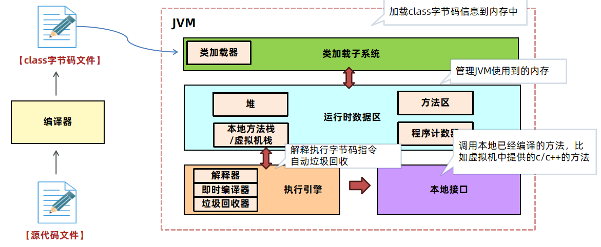

- 类加载器：核心组件类加载器，负责将字节码文件中的内容加载到内存中。
- 运行时数据区：JVM管理的内存，创建出来的对象、类的信息等等内容都会放在这块区域中。
- 执行引擎：包含了即时编译器、解释器、垃圾回收器，执行引擎使用解释器将字节码指令解释成机器码，使用即时编译器优化性能，使用垃圾回收器回收不再使用的对象。
- 本地接口：调用本地使用C/C++编译好的方法，本地方法在Java中声明时，都会带上native关键字


## 字节码文件

Class 文件是二进制文件，它的内容具有严格的规范，文件中没有任何空格，全都是连续的 0/1。Class 文件中的所有内容被分为两种类型：无符号数、表。

- 无符号数：无符号数表示 Class 文件中的值，这些值没有任何类型，但有不同的长度。u1、u2、u4、u8 分别代表 1/2/4/8 字节的无符号数。
- 表：由多个无符号数或者其他表作为数据项构成的复合数据类型。


Class 文件具体由以下几个构成:

- 魔数：每个Class文件的头4个字节被称为魔数 `0xcafebabe` ，它的唯一作用是确定这个文件是否为 一个能被虚拟机接受的Class文件。
- 版本信息：紧接着魔数的4个字节存储的是Class文件的版本号：第5和第6个字节是次版本号，第7和第8个字节是主版本号。Java的版本号是从45开始的，JDK 1.1之后的每个JDK大版本发布主版本号向上加1（JDK 1.0～1.1使用了45.0～45.3的版本号）。高版本的JDK能向下兼容以前版本的Class文件，但不能运行以后版本的Class文件。
- 常量池：版本信息之后就是常量池，常量池中存放两种类型的常量：字面值常量（程序中定义的字符串、被 final 修饰的值）和符号引用（定义的各种名字：类和接口的全限定名、字段的名字和描述符、方法的名字和描述符）
- 访问标志：在常量池结束之后，紧接着的两个字节代表访问标志，这个标志用于识别一些类或者接口层次的访问信息，包括：这个 Class 是类还是接口；是否定义为 public 类型；是否被 abstract/final 修饰。
- 类索引、父类索引、接口索引集合：类索引用于确定这个类的全限定名，父类索引用于确定这个类的父类的全限定名，接口索引集合就用来描述这个类实现了哪些接口。
- 字段表集合：字段表集合存储本类涉及到的成员变量，包括实例变量和类变量。每一个字段表只表示一个成员变量，本类中的所有成员变量构成了字段表集合。
- 方法表集合：方法表的结构如同字段表一样，依次包括了访问标志、名称索引、描述符索引、属性表集合几项。属性表集合中有一张 Code 属性表，用于存储当前方法经编译器编译后的字节码指令。
- 属性表集合：Class文件、字段表、方法表都可以携带自己的属性表集合，以描述某些场景专有的信息。


**字节码常用工具**：

**javap**

javap是JDK自带的反编译工具，可以通过控制台查看字节码文件的内容。适合在服务器上查看字节码文件内容。

直接输入javap查看所有参数。输入`javap -v 字节码文件名称` 查看具体的字节码信息。如果jar包需要先使用 `jar –xvf` 命令解压。


**jclasslib插件**

使用 jclasslib工具查看字节码文件。 Github地址： https://github.com/ingokegel/jclasslib

jclasslib也有Idea插件版本。选中要查看的源代码文件，选择 视图(View) - Show Bytecode With Jclasslib


**Arthas**

Arthas 是一款线上监控诊断产品，通过全局视角实时查看应用 load、内存、gc、线程的状态信息，并能在不修改应用代码的情况下，对业务问题进行诊断，大大提升线上问题排查效率。 

官网：https://arthas.aliyun.com/doc/

dump：可以将字节码文件保存到本地

jad：反编译指定已加载类的源码，用于确认服务器上的字节码文件是否是最新的


## 类的生命周期

类的生命周期描述了一个类加载、使用、卸载的整个过程。整体可以分为：

- 加载
- 连接，其中又分为验证、准备、解析三个子阶段
- 初始化
- 使用
- 卸载

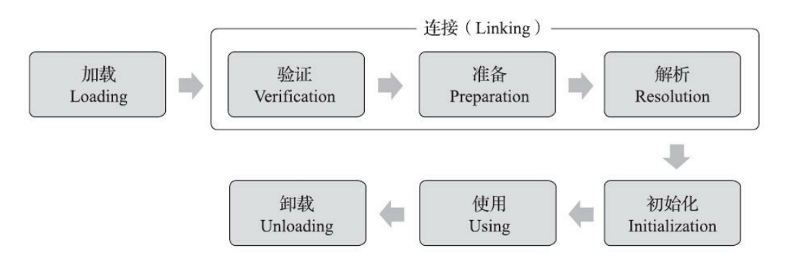

加载、验证、准备、初始化和卸载这五个阶段的顺序是确定的，类型的加载过程必须按照这种顺序按部就班地开始，而解析阶段则不一定：它在某些情况下可以在初始化阶段之后再开始， 这是为了支持Java语言的运行时绑定特性。

### 加载

1、类加载器根据**类的全限定名**通过不同的渠道以二进制流的方式**获取字节码信息**，程序员可以使用Java代码拓展的不同的渠道，包括：文件、网络、数据库等。

2、将二进制字节流解析为**方法区**的运行时数据结构。

3、在内存（堆）中创建一个代表该类的 java.lang.Class 对象，作为方法区这个类的各种数据的访问入口。


### 连接

加载阶段与连接阶段的部分内容交叉进行，加载阶段尚未完成，连接阶段可能已经开始了。但这两个阶段的开始时间仍然保持着固定的先后顺序。

连接阶段分为三个子阶段:

- 验证，验证字节码文件内容是否满足《Java虚拟机规范》，包括：文件格式验证、元数据验证、字节码验证、符号引用验证
- 准备，为静态变量分配内存并设置初值，赋值在初始化阶段。final修饰的基本数据类型的静态变量，准备阶段直接会将代码中的值进行赋值。final修饰的引用类型的静态变量，会在初始化阶段赋值。
- 解析，将常量池中的符号引用(编号)替换成直接引用(内存地址)。


### 初始化

对类的静态变量、静态代码块执行初始化操作。

* 如果初始化一个类的时候，其父类尚未初始化，则优先初始化其父类；但是一个接口在初始化时，并不要求其父接口全部都完成了初始化，当真正用到父接口的时候才会初始化。

* 如果同时包含多个静态变量和静态代码块，则按照自上而下顺序执行。


**以下必须立即对类进行初始化**：

- 在遇到 new、putstatic、getstatic、invokestatic 字节码指令时，如果类尚未初始化，则需要先触发其初始化。能够生成这四条指令的典型Java代码场景有：
  - 使用new关键字实例化对象的时候。 
  - 读取或设置一个类型的静态字段（被final修饰、已在编译期把结果放入常量池的静态字段除外） 的时候。 
  - 调用一个类型的静态方法的时候。
- 对类进行反射调用时，如果类还没有初始化，则需要先触发其初始化。
- 初始化一个类时，如果其父类还没有初始化，则需要先初始化父类。
- 当虚拟机启动时，用户需要指定一个要执行的主类（包含main()方法的那个类），虚拟机会先初始化这个主类。
- 当使用 JDK 1.7 的动态语言支持时，如果一个 `java.lang.invoke.MethodHandle` 实例最后的解析结果为 REF_getStatic、REF_putStatic、REF_invokeStatic 的方法句柄，并且这个方法句柄所对应的类还没初始化，则需要先触发其初始化。
- 当一个接口中定义了JDK 8新加入的默认方法（被default关键字修饰的接口方法）时，如果有这个接口的实现类发生了初始化，那该接口要在其之前被初始化。

这 6 种场景中的行为称为对一个类进行主动引用，除此之外，所有引用类型的方式都不会触发初始化，称为被动引用。


**被动引用例子**：

```java
/**
 * 被动引用 Demo1:
 * 通过子类引用父类的静态字段，不会导致子类初始化。
 */
class SuperClass {
    static {
        System.out.println("SuperClass init!");
    }

    public static int value = 123;
}

class SubClass extends SuperClass {
    static {
        System.out.println("SubClass init!");
    }
}

public class NotInitialization {

    public static void main(String[] args) {
        System.out.println(SubClass.value);
        // SuperClass init!
    }
}
```

只会输出“SuperClass init！”，而不会输出“SubClass init！”。对于静态字段，只有直接定义这个字段的类才会被初始化，因此通过其子类来引用父类中定义的静态字段，只会触发父类的初始化而不会触发子类的初始化。


```java
/**
 * 被动引用 Demo2:
 * 通过数组定义来引用类，不会触发此类的初始化。
 */

public class NotInitialization {

    public static void main(String[] args) {
        SuperClass[] superClasses = new SuperClass[10];
    }
}
```

运行之后发现没有输出“SuperClass init！”，说明并没有触发类 `org.fenixsoft.classloading.SuperClass` 的初始化阶段。但是这段代码里面触发了 另一个名为 `Lorg.fenixsoft.classloading.SuperClass` 的类的初始化阶段，对于用户代码来说，这并不是一个合法的类型名称，它是一个由虚拟机自动生成的、直接继承于 `java.lang.Object` 的子类，创建动作由 字节码指令newarray触发。


```java
/**
 * 被动引用 Demo3:
 * 常量在编译阶段会存入调用类的常量池中，本质上并没有直接引用到定义常量的类，因此不会触发定义常量的类的初始化。
 */
class ConstClass {
    static {
        System.out.println("ConstClass init!");
    }

    public static final String HELLO_BINGO = "Hello Bingo";

}

public class NotInitialization {

    public static void main(String[] args) {
        System.out.println(ConstClass.HELLO_BINGO);
    }

}
```

没有输出“ConstClass init！”。编译通过之后，常量存储到 NotInitialization 类的常量池中，NotInitialization 的 Class 文件中并没有 ConstClass 类的符号引用入口，这两个类在编译成 Class 之后就没有任何联系了。


### 卸载

判定一个类可以被卸载。需要同时满足下面三个条件：

1. 此类所有实例对象都已经被回收，在堆中不存在任何该类的实例对象以及子类对象。

2. 加载该类的类加载器已经被回收。

3. 该类对应的 java.lang.Class 对象没有在任何地方被引用。


## 类加载器

类加载器的作用就是将字节码文件加载到JVM中，让Java程序能够运行起来。

站在Java虚拟机的角度来看，只存在两种不同的类加载器：一种是启动类加载器，这个类加载器使用C++语言实现，是虚拟机自身的一部分；另外一种就是其他所有的类加载器，这些类加载器都由Java语言实现，独立存在于虚拟机外部，并且全都继承自抽象类 `java.lang.ClassLoader`。

站在Java开发人员的角度来看，分为启动类加载器、扩展类加载器、应用程序类加载器、自定义类加载器。 


类加载器的设计JDK8和8之后的版本差别较大，JDK8及之前的版本，这些版本中默认的类加载器有如下几种：扩展类加载器和应用程序类加载器的源码位于 `rt.jar` 包中的 `sun.misc.Launcher.java`

由于JDK9引入了module的概念，类加载器在设计上发生了很多变化。

1. 启动类加载器使用Java编写，位于 `jdk.internal.loader.ClassLoaders` 类中。Java中的 `BootClassLoader` 继承自`BuiltinClassLoader` 实现从模块中找到要加载的字节码资源文件。启动类加载器依然无法通过java代码获取到，返回的仍然是null，保持了统一。

2. 扩展类加载器被替换成了平台类加载器。平台类加载器遵循模块化方式加载字节码文件，所以继承关系从 `URLClassLoader` 变成了`BuiltinClassLoader`，`BuiltinClassLoader` 实现了从模块中加载字节码文件。平台类加载器的存在更多的是为了与老版本的设计方案兼容，自身没有特殊的逻辑。


**启动类加载器**：

加载 `<JAVA_HOME>\lib` 目录，或者被 `-Xbootclasspath` 参数所指定的路径中存放的，而且是Java虚拟机能够识别的（按照文件名识别，如rt.jar、tools.jar，名字不符合的类库即使放在lib目录中也不会被加载）类库加载到虚拟机的内存中。


**扩展类加载器**：

在类 `sun.misc.Launcher$ExtClassLoader` 中以Java代码的形式实现的。

它负责加载`<JAVA_HOME>\lib\ext` 目录中，或者被 `java.ext.dirs` 系统变量所指定的路径中所有的类库。

由于扩展类加载器是由Java代码实现的，开发者可以直接在程序中使用扩展类加载器来加载Class文件。


**应用程序类加载器**：

由 `sun.misc.Launcher$AppClassLoader` 来实现。由于应用程序类加载器是 `ClassLoader` 类中的`getSystemClassLoader()` 方法的返回值，所以有些场合中也称它为“系统类加载器”。它负责加载用户类路径 （ClassPath）上所有的类库，可以直接在代码中使用这个类加载器。如果应用程序中没有自定义过自己的类加载器，一般情况下这个就是程序中默认的类加载器。


**自定义类加载器**：

除了启动类加载器的其他类加载器均由 Java 实现且全部继承自`java.lang.ClassLoader`。如果我们要自定义自己的类加载器，需要继承 `ClassLoader`抽象类。

`ClassLoader` 类有两个关键的方法：

- `protected Class loadClass(String name, boolean resolve)`：加载指定二进制名称的类，实现了双亲委派机制 。`name` 为类的二进制名称，`resolve` 如果为 true，在加载时调用 `resolveClass(Class<?> c)` 方法解析该类。
- `protected Class findClass(String name)`：根据类的二进制名称来查找类，默认实现是空方法。

如果我们不想打破双亲委派模型，就重写 `ClassLoader` 类中的 `findClass()` 方法即可，无法被父类加载器加载的类最终会通过这个方法被加载。但是，如果想打破双亲委派模型则需要重写 `loadClass()` 方法。


### 双亲委派机制

双亲委派模型的工作过程是：如果一个类加载器收到了类加载的请求，它首先不会自己去尝试加载这个类，而是把这个请求委派给父类加载器去完成，每一个层次的类加载器都是如此，因此所有的加载请求最终都应该传送到最顶层的启动类加载器中，只有当父加载器反馈自己无法完成这个加载请求（它的搜索范围中没有找到所需的类）时，子加载器才会尝试自己去完成加载。


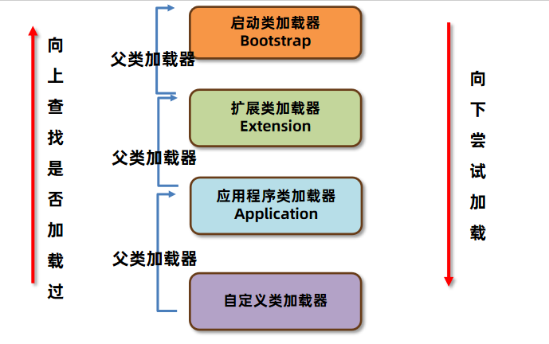

```java
// java.lang.ClassLoader#loadClass()
protected synchronized Class<?> loadClass(String name, boolean resolve) throws ClassNotFoundException
{
    // 首先，检查请求的类是否已经被加载过了
    Class c = findLoadedClass(name);
    if (c == null) {
        try {
            if (parent != null) {
                c = parent.loadClass(name, false);
            } else {
                c = findBootstrapClassOrNull(name);
            }
        } catch (ClassNotFoundException e) {
            // 如果父类加载器抛出ClassNotFoundException
            // 说明父类加载器无法完成加载请求
        }
        if (c == null) {
            // 在父类加载器无法加载时
            // 再调用本身的findClass方法来进行类加载
            c = findClass(name);
        }
    }
    if (resolve) {
        resolveClass(c);
    }
    return c;
}

```

双亲委派模型的执行流程：

- 在类加载的时候，系统会首先判断当前类是否被加载过。已经被加载的类会直接返回，否则才会尝试加载（每个父类加载器都会走一遍这个流程）。
- 类加载器在进行类加载的时候，它首先不会自己去尝试加载这个类，而是把这个请求委派给父类加载器去完成（调用父加载器 `loadClass()`方法来加载类）。这样的话，所有的请求最终都会传送到顶层的启动类加载器 `BootstrapClassLoader` 中。
- 只有当父加载器反馈自己无法完成这个加载请求（它的搜索范围中没有找到所需的类）时，子加载器才会尝试自己去加载（调用自己的 `findClass()` 方法来加载类）。
- 如果子类加载器也无法加载这个类，那么它会抛出一个 `ClassNotFoundException` 异常。


作用：

1. 保证类加载的安全性，通过双亲委派机制避免恶意代码替换JDK中的核心类库，比如java.lang.String，确保核心类库的完整性和安全性。
2. 避免重复加载


打破双亲委派机制历史上有三种方式，但本质上只有第一种算是真正的打破了双亲委派机制：

1. 自定义类加载器并且重写 `loadClass`方法。正确的方式是重写 `findClass` 方法，如果父类加载失败，会自动调用自己的 `findClass()`方法来完成加载，这样既不影响用户按照自己的意愿去加载类，又可以保证新写出来的类加载器是符合双亲委派规则的。

2. 线程上下文类加载器。

3. Osgi框架的类加载器。历史上Osgi框架实现了一套新的类加载器机制，允许同级之间委托进行类的加载，目前很少使用。


## 运行时数据区	

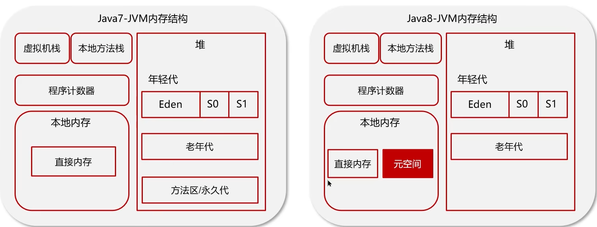

### 程序计数器

程序计数器也叫PC寄存器，线程私有，**记录当前要执行的的字节码指令的地址**。

若当前线程正在执行的是一个本地方法，那么此时程序计数器为`Undefined`。


程序计数器主要有两个作用：

- 字节码解释器通过改变程序计数器来依次读取指令，从而实现代码的流程控制，如：分支、循环、跳转、异常处理、线程恢复等。
- 在多线程的情况下，程序计数器用于记录当前线程执行的位置，从而当线程被切换回来的时候能够知道该线程上次运行到哪儿了。


程序计数器的特点：

- 是一块较小的内存空间。
- 线程私有，每条线程都有自己的程序计数器。
- 生命周期：随着线程的创建而创建，随着线程的结束而销毁。
- 是唯一一个不会出现 `OutOfMemoryError` 的内存区域。


### Java虚拟机栈

与程序计数器一样，Java虚拟机栈也是线程私有的，它的生命周期与线程相同。

每个线程运行时所需要的内存，称为虚拟机栈。每个方法被执行的时候，Java虚拟机都会同步创建一个栈帧用于存储局部变量表、操作数栈、动态连接、方法出口等信息。每一个方法被调用直至执行完毕的过程，就对应着一个栈帧在虚拟机栈中从入栈到出栈的过程。


要修改Java虚拟机栈的大小，可以使用虚拟机参数 -Xss 。默认1024k

- 语法：`-Xss栈大小`
- 单位：字节（默认，必须是 1024 的倍数）、k或者K(KB)、m或者M(MB)、g或者G(GB)


#### 局部变量表

定义为一个数字数组，主要用于存储方法参数、定义在方法体内部的局部变量，数据类型包括各类基本数据类型，对象引用，以及 return address 类型。

局部变量表容量大小是在编译期确定下来的。最基本的存储单元是 slot，32 位占用一个 slot，64 位类型（long 和 double）占用两个 slot。

局部变量表中保存了字节码指令生效的偏移量：

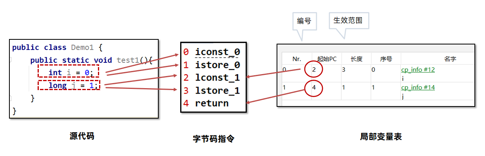

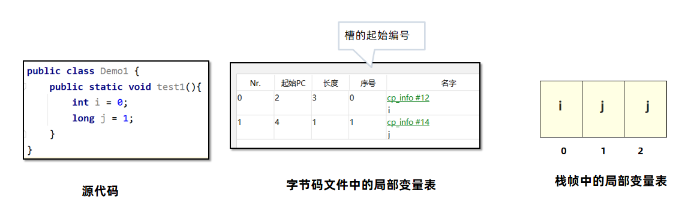

如果当前帧是由构造方法或者实例方法创建的，那么该对象引用 this，会存放在 index 为 0 的 slot 处，其余的参数表顺序继续排列。

**局部变量表保存的内容有：实例方法的this对象，方法的参数，方法体中声明的局部变量。**

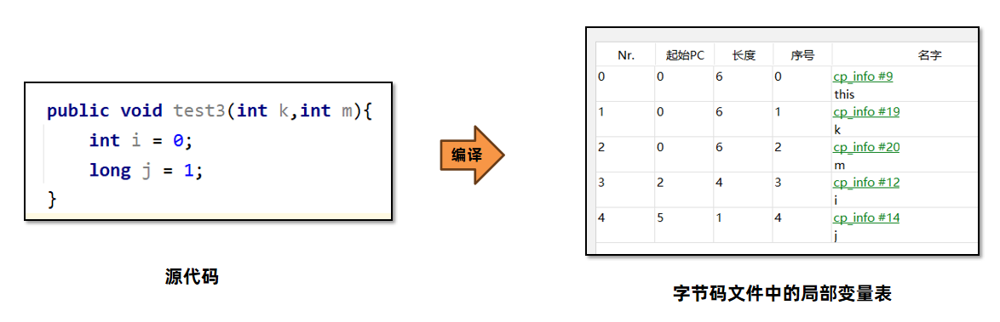

为了节省空间，局部变量表中的槽是可以复用的，一旦某个局部变量不再生效，当前槽就可以再次被使用。

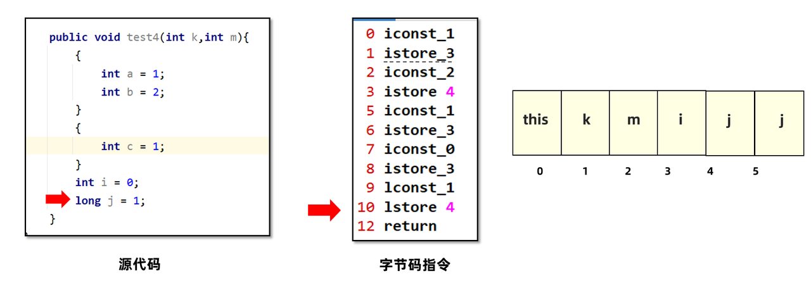

所以，局部变量表数值的长度为6。这一点在编译期间就可以确定了，运行过程中只需要在栈帧中创建长度为6的数组即可，在方法运行期间不会改变局部变量表的大小。


#### 操作数栈

操作数栈是栈帧中虚拟机在执行指令过程中用来**存放临时数据和中间结果**的一块区域。他是一种栈式的数据结构，如果一条指令将一个值压入操作数栈，则后面的指令可以弹出并使用该值。	

每一个操作数栈会拥有一个明确的栈深度，用于存储数值，最大深度在编译期就定义好。32bit 类型占用一个栈单位深度，64bit 类型占用两个栈单位深度操作数栈。

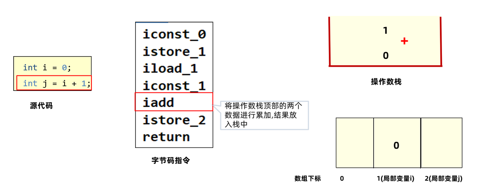

#### 其他

静态链接：当一个字节码文件被装载进 JVM 内部时，如果被调用的目标方法在编译期可知，且运行时期间保持不变，这种情况下将调用方的符号引用转为直接引用的过程称为静态链接。

动态链接：如果被调用的方法无法在编译期被确定下来，只能在运行期将调用的方法的符号引用转为直接引用，这种引用转换过程具备动态性，因此被称为动态链接。

方法出口：指的是方法在正确或者异常结束时，当前栈帧会被弹出，同时程序计数器应该指向上一个栈帧中的下一条指令的地址。所以在当前栈帧中，需要存储此方法出口的地址。

异常表：存放的是代码中异常的处理信息，包含了异常捕获的生效范围以及异常发生后跳转到的字节码指令位置。

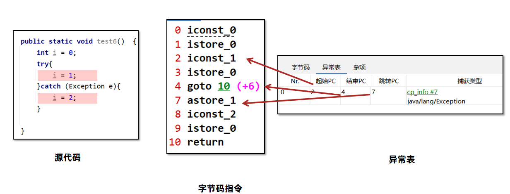


### 本地方法栈

Java虚拟机栈存储了Java方法调用时的栈帧，而本地方法栈存储的是native本地方法的栈帧。

**在Hotspot虚拟机中，Java虚拟机栈和本地方法栈实现上使用了同一个栈空间**。本地方法被执行时，在本地方法栈也会创建一块栈帧，用于存放该方法的局部变量表、操作数栈、动态链接、方法出口信息等。


### 堆

堆是用来存放对象的内存空间，几乎所有的对象都存储在堆中。


堆的特点：

- 线程共享，整个 Java 虚拟机只有一个堆，所有的线程都访问同一个堆。而程序计数器、Java 虚拟机栈、本地方法栈都是一个线程对应一个。
- 在虚拟机启动时创建。
- 是垃圾回收的主要场所。
- 堆可分为新生代（`Eden` 区，`From Survior`，`To Survivor`）、老年代。
- Java 虚拟机规范规定，堆可以处于物理上不连续的内存空间中，但在逻辑上它应该被视为连续的。
- Java7中有一个永久代用来保存类信息、静态变量、常量、编译后的代码，Java8移除了永久代，把数据存储到了本地内存的元空间中，防止内存溢出。


堆空间有三个需要关注的值，used、total、max。used指的是当前已使用的堆内存，total是java虚拟机已经分配的可用堆内存，max是java虚拟机可以分配的最大堆内存。


如果不设置任何的虚拟机参数，max默认是系统内存的1/4，total默认是系统内存的1/64。在实际应用中一般都需要设置total和max的值。

**设置堆的大小：**

要修改堆的大小，可以使用虚拟机参数 –Xmx（max最大值）和-Xms (初始的total)。

语法：`-Xmx值 -Xms值`

单位：字节（默认，必须是 1024 的倍数）、k或者K(KB)、m或者M(MB)、g或者G(GB)

限制：Xmx必须大于 2 MB，Xms必须大于1MB

**建议：**

Java服务端程序开发时，**建议将-Xmx和-Xms设置为相同的值**，这样在程序启动之后可使用的总内存就是最大内存，而无需向java虚拟机再次申请，减少了申请并分配内存时间上的开销，同时也不会出现内存过剩之后堆收缩的情况。


### 方法区

方法区与Java堆一样，是各个线程共享的内存区域，它用于存储已被虚拟机加载的**类信息、常量、静态变量、即时编译器编译后的代码缓存**等数据。方法区是《Java虚拟机规范》中设计的**虚拟概念**，是一块逻辑区域。


方法区是《Java虚拟机规范》中设计的虚拟概念，每款Java虚拟机在实现上都各不相同。Hotspot设计如下：

* **JDK8**之前的版本方法区由**堆区域中的永久代空间（ps_perm_gen）**实现，堆的大小由虚拟机参数来控制。

* **JDK8**及之后的版本方法区由**元空间（metaspace）**实现，元空间位于操作系统维护的直接内存中，默认情况下只要不超过操作系统承受的上限，可以一直分配。可以使用 `-XX:MaxMetaspaceSize=值` 将元空间最大大小进行限制。


使用元空间替换永久代的原因：

1. **提高内存上限**：元空间使用的是操作系统内存，而不是JVM内存。如果不设置上限，只要不超过操作系统内存上限，就可以持续分配。而永久代在堆中，可使用的内存上限是有限的。所以使用元空间可以有效减少OOM情况的出现。

2. **优化垃圾回收的策略**：永久代在堆上，垃圾回收机制一般使用老年代的垃圾回收方式，不够灵活。使用元空间之后单独设计了一套适合方法区的垃圾回收机制，而不是使用类的垃圾回收机制。


方法区的特点：

- 线程共享。 方法区是堆的一个逻辑部分，因此和堆一样，都是线程共享的。整个虚拟机中只有一个方法区。
- 永久代。 方法区中的信息一般需要长期存在，而且它又是堆的逻辑分区，因此用堆的划分方法，把方法区称为“永久代”。
- 内存回收效率低。 方法区中的信息一般需要长期存在，回收一遍之后可能只有少量信息无效。主要回收目标是：对常量池的回收；对类型的卸载。
- Java 虚拟机规范对方法区的要求比较宽松。 和堆一样，允许固定大小，也允许动态扩展，还允许不实现垃圾回收。


#### 类的元信息

方法区是用来存储每个类的基本信息（元信息），一般称之为InstanceKlass对象。在类的加载阶段完成。其中就包含了类的字段、方法等字节码文件中的内容，同时还保存了运行过程中需要使用的虚方法表（实现多态的基础）等信息。

#### 运行时常量池

当类被 Java 虚拟机加载后， `.class` 文件中的**常量（类名、方法名、参数类型、字面量等）就存放在方法区的运行时常量池中**。而且在运行期间，可以向常量池中添加新的常量。如 String 类的 `intern()` 方法就能在运行期间向常量池中添加字符串常量。

#### 字符串常量池

字符串常量池是用于存放字符串字面量的特殊内存区域。它的目的是为了优化内存使用和提高字符串处理的效率。

字符串常量池位于Java虚拟机的堆内存中。

```java
// 在堆中创建字符串对象”ab“
// 将字符串对象”ab“的引用保存在字符串常量池中
String aa = "ab";
// 直接返回字符串常量池中字符串对象”ab“的引用
String bb = "ab";
System.out.println(aa==bb);// true
```

字符串常量池和运行时常量池有什么关系？

早期设计时，字符串常量池是属于运行时常量池的一部分，他们存储的位置也是一致的。后续做出了调整，将字符串常量池和运行时常量池做了拆分。

| 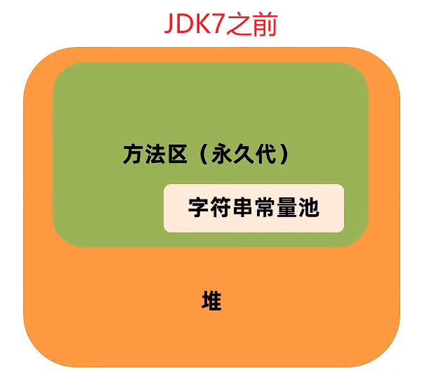 | 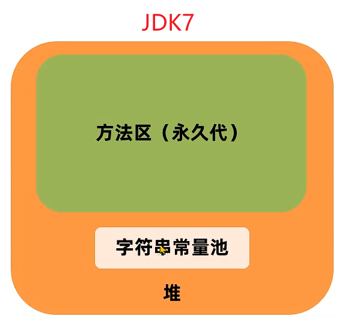 | 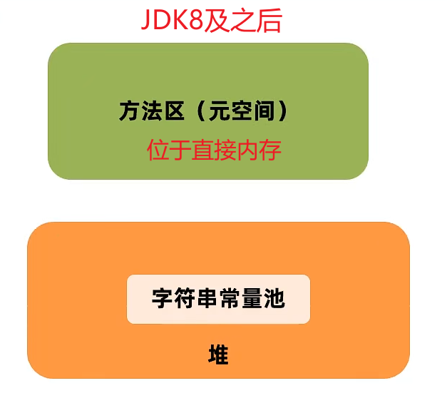 |
| ---------------------------- | ---------------------------- | ---------------------------- |


字符串常量池从方法区移动到堆的原因：

1. **垃圾回收优化**：字符串常量池的回收逻辑和对象的回收逻辑类似，内存不足的情况下，如果字符串常量池中的常量不被使用就可以被回收；方法区中的类的元信息回收逻辑更复杂一些。移动到堆之后，就可以利用对象的垃圾回收器，对字符串常量池进行回收。

2. **让方法区大小更可控**：一般在项目中，类的元信息不会占用特别大的空间，所以会给方法区设置一个比较小的上限。如果字符串常量池在方法区中，会让方法区的空间大小变得不可控。

3. **intern方法的优化**：JDK6版本中intern () 方法会把第一次遇到的字符串实例复制到永久代的字符串常量池中。JDK7及之后版本中由于字符串常量池在堆上，就可以进行优化：字符串保存在堆上，把字符串的引用放入字符串常量池，减少了复制的操作。


**案例**：

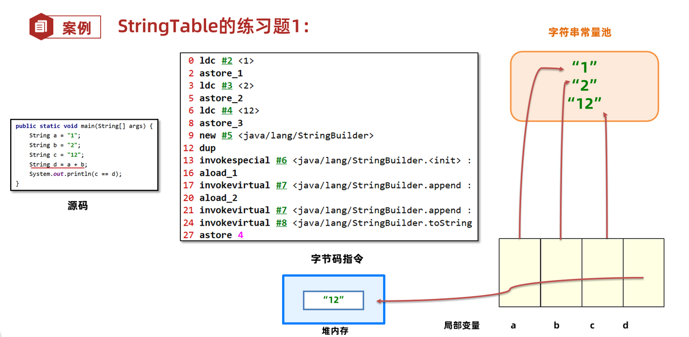

将“1”放入字符串常量池，通过局部变量a引用字符串常量池中的“1”，b和c同理。

将a、b指向的字符串进行连接，本质上就是使用StringBuilder进行连接，最后创建一个新的字符串放入堆中。然后将局部变量d指向队堆中的内存。

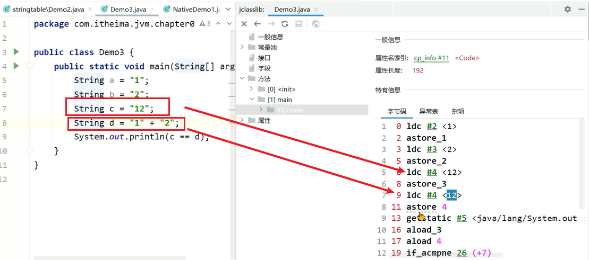

编译阶段就将“1” 和 “2” 进行连接最终生成“12”存放入字符串常量池中。


String.intern()方法是可以手动将字符串放入字符串常量池中，分别在JDK6 JDK8下执行代码，JDK6 中结果是false false ，JDK8中是true false

```java
package chapter03.stringtable;

/**
 * intern案例
 */
public class Demo4 {
    public static void main(String[] args) {
        String s1 = new StringBuilder().append("think").append("123").toString();

        System.out.println(s1.intern() == s1);
//        System.out.println(s1.intern() == s1.intern());

        String s2 = new StringBuilder().append("ja").append("va").toString();

        System.out.println(s2.intern() == s2);
    }
}
```

先来分析JDK6中，代码执行步骤如下：

1. 使用StringBuilder的将`think`和`123`拼接成`think123`，转换成字符串，在堆上创建一个字符串对象。局部变量`s1`指向堆上的对象。
2. 调用s1.intern方法，会在字符串常量池中创建think123的对象，最后将对象引用返回。所以s1.intern和s1指向的不是同一个对象。打印出false。
3. 同理，通过StringBuilder在堆上创建java字符串对象。这里注意字符串常量池中本来就有一个java字符串对象，这是java虚拟机自身使用的所以启动时就会创建出来。
4. 调用s2.intern发现字符串常量池中已经有java字符串对象了，就将引用返回。所以s2.intern指向的是字符串常量池中的对象，而s2指向的是堆中的对象。打印结果为false。

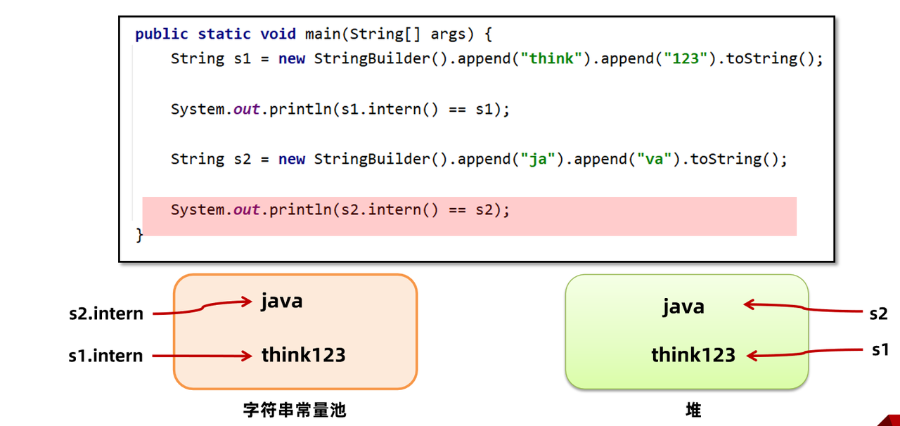

JDK7及之后版本中由于字符串常量池在堆上，所以intern () 方法会把第一次遇到的字符串的引用放入字符串常量池。

代码执行步骤如下：

1. 由于字符串常量池中没有think123的字符串，所以直接创建一个引用，指向堆中的think123对象。所以s1.intern和s1指向的都是堆上的对象，打印结果为true。
2. s2.intern方法调用时，字符串常量池中已经有java字符串了，所以将引用返回。这样打印出来的结果就是false。

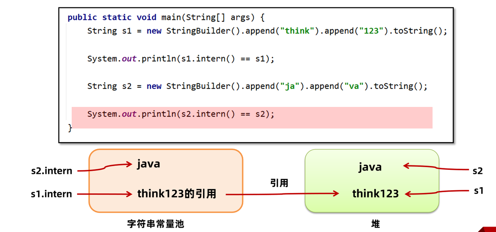


静态变量存储在哪里呢？

- JDK7之前的版本中，静态变量是存放在方法区中的，也就是永久代。
- JDK7及之后的版本中，静态变量是存放在堆中的Class对象中，脱离了永久代。


### 直接内存

直接内存并不是虚拟机运行时数据区的一部分，不由JVM管理，是虚拟机的系统内存。它允许Java程序在堆之外直接分配和使用内存，常见于NIO操作时，用于数据缓冲区，分配回收成本高但效率高。在执行I/O操作时，使用直接内存可以避免将数据从Java堆复制到本地I/O的缓冲区中。

直接内存的容量大小可通过 `-XX：MaxDirectMemorySize` 参数来指定，如果不去指定，则默认与Java堆最大值（由-Xmx指定）一致。


## HotSpot虚拟机对象探秘

### 对象的创建

**1. 类加载检查**：

虚拟机遇到一条 new 指令时，首先将去检查这个指令的参数是否能在常量池中定位到这个类的符号引用，并且检查这个符号引用代表的类是否已被加载过、解析和初始化过。如果没有，那必须先执行相应的类加载过程。

**2. 分配内存**

在类加载检查通过后，接下来虚拟机将为新生对象分配内存。对象所需的内存大小在类加载完成后便可确定，为对象分配空间的任务等同于把一块确定大小的内存从 Java 堆中划分出来。分配方式有 “指针碰撞” 和 **“**空闲列表**”** 两种，选择哪种分配方式由 Java 堆是否规整决定，而 Java 堆是否规整又由所采用的垃圾收集器是否带有压缩整理功能决定。

内存分配的两种方式 ：

- 指针碰撞： 
  - 适用场合：堆内存规整（即没有内存碎片）的情况下。
  - 原理：用过的内存全部整合到一边，没有用过的内存放在另一边，中间有一个分界指针，只需要向着没用过的内存方向将该指针移动对象内存大小位置即可。
  - 使用该分配方式的 GC 收集器：Serial, ParNew
- 空闲列表： 
  - 适用场合：堆内存不规整的情况下。
  - 原理：虚拟机会维护一个列表，该列表中会记录哪些内存块是可用的，在分配的时候，找一块儿足够大的内存块儿来划分给对象实例，最后更新列表记录。
  - 使用该分配方式的 GC 收集器：CMS

内存分配并发问题：

对象创建在虚拟机中是非常频繁的行为，即使仅仅修改一个指针所指向的位置，在并发情况下也并不是线程安全的，可能出现正在给对象 A分配内存，指针还没来得及修改，对象B又同时使用了原来的指针来分配内存的情况。有两种解决方案：

- CAS+失败重试：虚拟机采用 CAS 配上失败重试的方式保证更新操作的原子性。
- TLAB： 是把内存分配的动作按照线程划分在不同的空间之中进行，即每个线程在Java堆中预先分配一小块内存，称为本地线程分配缓冲（TLAB），哪个线程要分配内存，就在哪个线程的本地缓冲区中分配，只有本地缓冲区用完了，分配新的缓存区时才需要同步锁定。

**3. 内存初始化**

内存分配完成后，虚拟机需要将分配到的内存空间都初始化为零值（不包括对象头），这一步操作保证了对象的实例字段在 Java 代码中可以不赋初始值就直接使用，程序能访问到这些字段的数据类型所对应的零值。

**4. 设置对象头**

初始化零值完成之后，虚拟机要对对象进行必要的设置，例如这个对象是哪个类的实例、如何才能找到类的元数据信息、对象的哈希码、对象的 GC 分代年龄等信息。 这些信息存放在对象头中。 另外，根据虚拟机当前运行状态的不同，如是否启用偏向锁等，对象头会有不同的设置方式。

**5. 执行 init 方法**

在上面工作都完成之后，从虚拟机的视角来看，一个新的对象已经产生了，但从 Java 程序的视角来看，对象创建才刚开始--构造函数，即`<init>` 方法还没有执行，所有的字段都还为零。所以一般来说，执行 new 指令之后会接着执行 `<init>` 方法，把对象按照程序员的意愿进行初始化，这样一个真正可用的对象才算完全产生出来。


### 对象内存布局

在 Hotspot 虚拟机中，对象在内存中的布局可以分为 3 块区域：对象头（Header）、实例数据（Instance Data）和对齐填充（Padding）。

对象头包括两部分信息：

1. 标记字段（Mark Word）：用于存储对象自身的运行时数据， 如哈希码（HashCode）、GC 分代年龄、锁状态标志、线程持有的锁、偏向线程 ID、偏向时间戳等等。
2. 类型指针（Klass Word）：对象指向它的类元数据的指针，虚拟机通过这个指针来确定这个对象是哪个类的实例。
3. 数组长度：如果对象是一个数组，那在对象头中还必须有一块用于记录数组长度的数据。

实例数据部分是对象真正存储的有效信息，也是在程序中所定义的各种类型的字段内容。


### 对象的访问定位

建立对象就是为了使用对象，我们的 Java 程序通过栈上的 reference 数据来操作堆上的具体对象。对象的访问方式由虚拟机实现而定，目前主流的访问方式有：使用句柄、直接指针。

* 如果使用句柄的话，那么 Java 堆中将会划分出一块内存来作为句柄池，reference 中存储的就是对象的句柄地址，而句柄中包含了对象实例数据与对象类型数据各自的具体地址信息。

* 如果使用直接指针访问，reference 中存储的直接就是对象的地址。

这两种对象访问方式各有优势。使用句柄来访问的最大好处是 reference 中存储的是稳定的句柄地址，在对象被移动时只会改变句柄中的实例数据指针，而 reference 本身不需要修改。使用直接指针访问方式最大的好处就是速度快，它节省了一次指针定位的时间开销。

HotSpot 虚拟机主要使用直接指针来进行对象访问。


## 垃圾回收

线程不共享的部分（程序计数器、Java虚拟机栈、本地方法栈），都是伴随着线程的创建而创建，线程的销毁而销毁。而方法的栈帧在执行完方法之后就会自动弹出栈并释放掉对应的内存。所以这一部分不需要垃圾回收器负责回收。

**方法区的回收**：

方法区中能回收的内容主要是不再使用的类和常量。

判定一个类可以被卸载。需要同时满足下面三个条件：

1. 此类所有实例对象都已经被回收，在堆中不存在任何该类的实例对象以及子类对象。

2. 加载该类的类加载器已经被回收。

3. 该类对应的 `java.lang.Class` 对象没有在任何地方被引用，无法在任何地方通过反射访问该类的方法。


如果需要手动触发垃圾回收，可以调用System.gc()方法。

语法： `System.gc()`

注意事项：调用System.gc()方法并不一定会立即回收垃圾，仅仅是向Java虚拟机发送一个垃圾回收的请求，具体是否需要执行垃圾回收Java虚拟机会自行判断。


### 如何判断对象可以回收

Java中的对象是否能被回收，是根据对象是否被引用来决定的。如果对象被引用了，说明该对象还在使用，不允许被回收。

#### 引用计数法

在对象头中有一个引用计数器，每当有一个地方引用它时，计数器值就加一；当引用失效时，计数器值就减一；任何时刻计数器为零的对象就是不可能再被使用的。

引用计数法的优点是实现简单，C++中的智能指针就采用了引用计数法，但是它也存在缺点，主要有两点：

1. 每次引用和取消引用都需要维护计数器，对系统性能会有一定的影响

2. 存在循环引用问题，所谓循环引用就是当A引用B，B同时引用A时会出现对象无法回收，内存泄漏。

#### 可达性分析法

Java使用的是可达性分析算法来判断对象是否可以被回收。

基本思路就是通过一系列称为“GC Roots”的根对象作为起始节点集，从这些节点开始，根据引用关系向下搜索，搜索过程所走过的路径称为“引用链”，如果某个对象到GC Roots间没有任何引用链相连， 或者用图论的话来说就是从GC Roots到这个对象不可达时，则证明此对象是不可能再被使用的，可以被回收。

固定可作为GC Roots的对象包括：

* 在虚拟机栈（栈帧中的本地变量表）中引用的对象。 
* 本地方法栈中引用的对象。
* 在方法区中类静态属性引用的对象。 
* 在方法区中常量引用的对象，譬如字符串常量池里的引用。 
* 所有被同步锁（synchronized关键字）持有的对象（即该对象作为锁被使用）。 
* Java虚拟机内部的引用，如基本数据类型对应的Class对象，一些常驻的异常对象（比如 NullPointExcepiton、OutOfMemoryError）等，还有系统类加载器。 
* 反映Java虚拟机内部情况的JMXBean、JVMTI中注册的回调、本地代码缓存等。


### 对象引用类型

**强引用：**

Java里传统引用的定义： 如果reference类型的数据中存储的数值代表的是另外一块内存的起始地址，就称该reference数据是代表某块内存、某个对象的引用。

强引用指传统引用，是指在程序代码之中普遍存在的引用赋值，即类似“Object obj=new Object()”这种引用关系。无论任何情况下，只要强引用关系还存在，垃圾收集器就永远不会回收掉被引用的对象。

**软引用：**

软引用是用来描述一些还有用，但非必须的对象。只有当 JVM 认为**内存不足时**，才会去试图回收软引用指向的对象。JVM 会确保在抛出 OutOfMemoryError 之前，清理软引用指向的对象。在JDK 1.2版之后提供了SoftReference类来实现软引用。

软引用通常用来实现内存敏感的缓存，如果还有空闲内存，就可以暂时保留缓存，当内存不足时清理掉，这样就保证了使用缓存的同时，不会耗尽内存。

软引用对象本身，也需要被强引用，否则软引用对象也会被回收掉。

**弱引用：**

弱引用也是用来描述那些非必须对象，但是它的强度比软引用更弱一些，被弱引用关联的对象只能生存到下一次垃圾收集发生为止。当垃圾收集器开始工作，无论当前内存是否足够，都会回收掉只被弱引用关联的对象。在JDK 1.2版之后提供了WeakReference类来实现弱引用。

弱引用的使用场景：缓存系统、对象池、避免内存泄漏

**虚引用：**

虚引用也称为“幽灵引用”或者“幻影引用”，它是最弱的一种引用关系。一个对象是否有虚引用的存在，完全不会对其生存时间构成影响，也无法通过虚引用来取得一个对象实例。为一个对象设置虚引用关联的唯一目的只是为了能在这个对象被收集器回收时收到一个系统通知。在JDK 1.2版之后提供了PhantomReference类来实现虚引用。


### 垃圾回收算法

Java垃圾回收过程会通过单独的GC线程来完成，但是不管使用哪一种GC算法，都会有部分阶段需要停止所有的用户线程。这个过程被称之为Stop The World简称STW，如果STW时间过长则会影响用户的使用。所以判断GC算法是否优秀，可以从三个方面来考虑：

1. 吞吐量。吞吐量指的是 CPU 用于执行用户代码的时间与 CPU 总执行时间的比值，即吞吐量 = 执行用户代码时间 /（执行用户代码时间 + GC时间）。吞吐量数值越高，垃圾回收的效率就越高。
2. 最大暂停时间。最大暂停时间指的是所有在垃圾回收过程中的STW时间最大值。最大暂停时间越短，用户使用系统时受到的影响就越短。
3. 堆使用效率。不同垃圾回收算法，对堆内存的使用方式是不同的。比如标记清除算法，可以使用完整的堆内存。而复制算法会将堆内存一分为二，每次只能使用一半内存。从堆使用效率上来说，标记清除算法要优于复制算法。


1960年John McCarthy发布了第一个GC算法：标记-清除算法。

1963年Marvin L. Minsky 发布了复制算法。

本质上后续所有的垃圾回收算法，都是在上述两种算法的基础上优化而来。

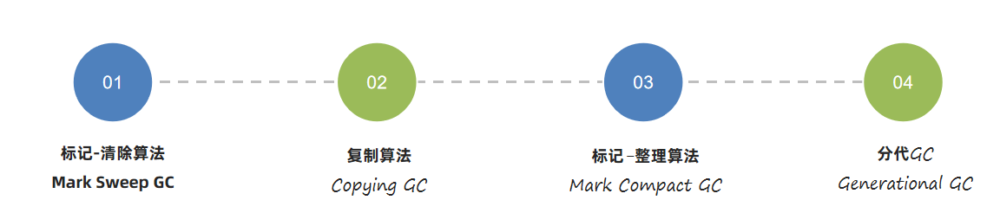


#### 标记-清除算法

算法分为“标记”和“清除”两个阶段：首先标记出所有需要回收的对象，在标记完成后，统一回收掉所有被标记的对象，也可以反过来，标记存活的对象，统一回收所有未被标记的对象。

优点：不需要移动对象，简单直接。

缺点：

1. 执行效率不稳定。如果Java堆中包含大量对象，而且其中大部分是需要被回收的，这时必须进行大量标记和清除的动作，导致标记和清除两个过程的执行效率都随对象数量增长而降低；
2. 内存空间的碎片化问题。标记、清除之后会产生大 量不连续的内存碎片，空间碎片太多可能会导致当以后在程序运行过程中需要分配较大对象时无法找到足够的连续内存而不得不提前触发另一次垃圾收集动作。


#### 标记-复制算法

标记-复制算法常被简称为复制算法。它将可用内存按容量划分为大小相等的两块，每次只使用其中的一块。当这一块的内存用完了，就将还存活着的对象复制到另外一块上面，然后再把已使用过的内存空间一次清理掉。

优点：没有碎片化问题，适合新生代对象。

缺点：

1. 内存使用效率低，每次只能让一半的内存空间来为创建对象使用。
2. 在对象存活率较高时就要进行较多的复制操作，效率将会降低。


#### 标记-整理算法

标记整理算法也叫标记压缩算法，是对标记清理算法中容易产生内存碎片问题的一种解决方案。

标记整理算法的标记过程与“标记-清除”算法一样，但后续步骤不是直接对可回收对象进行清理，而是让所有存活的对象都向内存空间一端移动，然后直接清理掉边界以外的内存。

优点：

1. 内存使用效率高，整个堆内存都可以使用，不会像复制算法只能使用半个堆内存。

2. 避免内存碎片问题，适合老年代对象。

缺点：对象移动需要时间，性能较低。


#### 分代收集算法

分代收集算法将整个内存区域划分为年轻代和老年代：

- 新生代：复制算法
- 老年代：标记-清除算法、标记-整理算法

对象创建时，一般在新生代申请内存，当经历一次 GC 之后如果对还存活，那么对象的年龄 +1。当年龄超过一定值后，如果对象还存活，那么该对象会进入老年代。

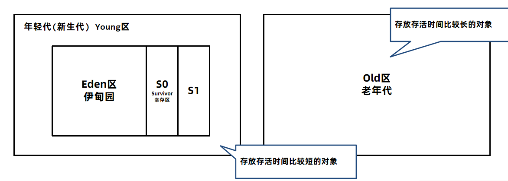

**原理流程**：

1. 新创建出来的对象会被放入Eden区，survivor的两块空间都为空。

2. 如果Eden区满，新创建的对象已经无法放入，就会触发年轻代的GC，称为Minor GC。Minor GC会把eden和From中需要回收的对象回收，把没有回收的对象放入To区，清空Eden区和From区。

3. 接下来survivor的两个区From和To对换。当eden区满时再往里放入对象，依然会发生Minor GC。每次Minor GC中都会为对象记录他的年龄，初始值为0，每次GC完加1。
4. 如果Minor GC后对象的年龄达到阈值（最大15，默认值和垃圾回收器有关），对象就会被晋升至老年代（survivor区不足或大对象会提前晋升到老年代）。
5. 当老年代中空间不足，触发Major GC 甚至 Full GC。如果Full GC依然无法回收掉老年代的对象，那么当对象继续放入老年代时，就会抛出Out Of Memory异常。


针对 HotSpot VM 的实现，它里面的 GC 其实准确分类只有两大种：

部分收集 (Partial GC)：

- 新生代收集（Minor GC / Young GC）：只对新生代进行垃圾收集，包括Eden区和两个Survivor区（S0和S1）；
- 老年代收集（Major GC / Old GC）：只对老年代进行垃圾收集。
- 混合收集（Mixed GC）：对整个新生代和部分老年代进行垃圾收集。G1特有

整堆收集 (Full GC)：新生代和老年代完整垃圾回收。收集整个 Java 堆和方法区。


**Minor GC触发条件**：Eden区满时

**Major GC触发条件**：当老年代空间不足时，或者系统检测到年轻代对象晋升到老年代的速度过快，可能会触发Major GC。

**Full GC触发条件**：

1. 调用 `System.gc` 时，系统建议执行Full GC，但是不必然执行。可以通过 `-XX:+ DisableExplicitGC` 来禁止调用 `System.gc()`。
2. 老年代空间不足。
3. 当永久代（Java 8之前的版本）或元空间（Java 8及以后的版本）空间不足时。JVM 规范中运行时数据区域中的方法区，在 HotSpot 虚拟机中也称为永久代，存放一些类信息、常量、静态变量等数据，当系统要加载的类、反射的类和调用的方法较多时，永久代可能会被占满，会触发 Full GC。
4. Minor GC（新生代垃圾回收）时，如果存活的对象无法全部放入老年代，或者老年代空间不足以容纳存活的对象，则会触发Full GC，对整个堆内存进行回收。


**对象进入老年代的四种情况**：

1. 假如进行Minor GC时发现，存活的对象在ToSpace区中存不下，那么把存活的对象存入老年代
2. 大对象直接进入老年代
3. 长期存活的对象将进入老年代：对象的年龄达到阈值
4. 动态对象年龄判定：如果在From空间中，相同年龄所有对象的大小总和大于Survivor空间的一半，那么年龄大于等于该年龄的对象就会被移动到老年代，而不用等到15岁(默认)。


**分代收集算法将堆分成年轻代和老年代主要原因有**：

1. 不同对象生命周期不同，管理更加高效

2. 可以通过调整年轻代和老年代的比例来适应不同类型的应用程序，提高内存的利用率和性能。

3. 新生代和老年代使用不同的垃圾回收算法，新生代一般选择复制算法，老年代可以选择标记-清除和标记-整理算法，由程序员来选择灵活度较高。

4. 分代的设计中允许只回收新生代（minor gc），如果能满足对象分配的要求就不需要对整个堆进行回收(full gc), STW时间就会减少。


### 内存分配与回收策略

1. 对象优先在Eden分配：大多数情况下，对象在新生代Eden区中分配。当Eden区没有足够空间进行分配时，虚拟机将发起一次Minor GC。

2. 大对象直接进入老年代：大对象是指需要大量连续内存空间的 Java 对象，如很长的字符串或数据。虚拟机提供了一个 `-XX:PretenureSizeThreshold` 参数，令大于这个设置值的对象直接在老年代分配，这样做的目的是避免在 Eden 区及两个 Survivor 区之间发生大量的内存复制。

3. 长期存活的对象将进入老年代：JVM 给每个对象定义了一个对象年龄计数器，存储在对象头中。当新生代发生一次 Minor GC 后，存活下来的对象年龄 +1，当年龄超过一定值（默认15）时，就将超过该值的所有对象转移到老年代中去。使用 `-XXMaxTenuringThreshold` 设置新生代的最大年龄，只要超过该参数的新生代对象都会被转移到老年代中去。

4. 动态对象年龄判定：如果当前新生代的 Survivor 中，相同年龄所有对象大小的总和大于 Survivor 空间的一半，年龄 >= 该年龄的对象就可以直接进入老年代，无须等到 `MaxTenuringThreshold` 中要求的年龄。

5. 空间分配担保：空间分配担保是为了确保在 Minor GC 之前老年代本身还有容纳新生代所有对象的剩余空间。

   JDK 6 Update 24 之前的规则是这样的：

   在发生 Minor GC 之前，虚拟机会先检查老年代最大可用的连续空间是否大于新生代所有对象总空间， 如果这个条件成立，Minor GC 可以确保是安全的； 如果不成立，则虚拟机会查看 `-XX:HandlePromotionFailure` 值是否设置为允许担保失败， 如果是，那么会继续检查老年代最大可用的连续空间是否大于历次晋升到老年代对象的平均大小， 如果大于，将尝试进行一次 Minor GC，尽管这次 Minor GC 是有风险的； 如果小于，或者 `-XX:HandlePromotionFailure` 设置不允许冒险，那此时也要改为进行一次 Full GC。

   JDK 6 Update 24 之后的规则变为：

   只要老年代的连续空间大于新生代对象总大小或者历次晋升的平均大小，就会进行 Minor GC，否则将进行 Full GC。


### 垃圾回收器

垃圾回收器是垃圾回收算法的具体实现。	

由于垃圾回收器分为年轻代和老年代，除了G1之外其他垃圾回收器必须成对组合进行使用。


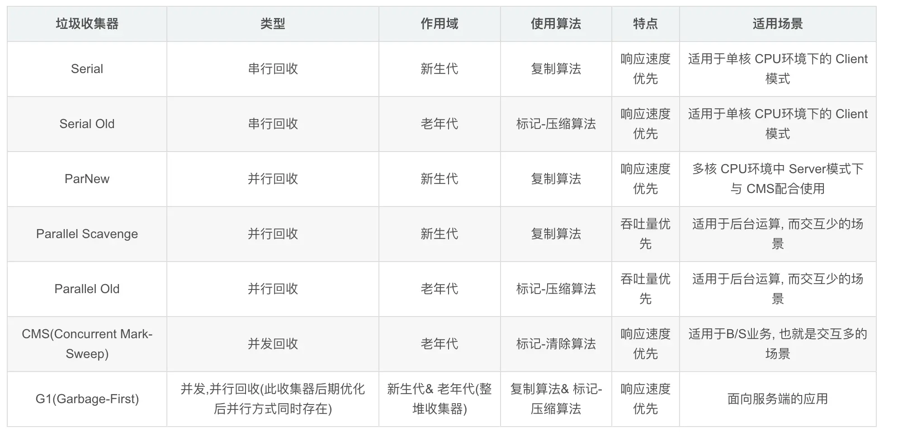

#### Serial/Serial Old

串行垃圾回收器是一个单线程工作的收集器，只会使用一条收集线程去完成垃圾收集工作，它进行垃圾收集时，必须暂停其他所有工作线程，直到它收集结束。

一般客户端应用所需内存较小，不会创建太多对象，而且堆内存不大，因此垃圾收集器回收时间短，即使在这段时间停止一切用户线程，也不会感觉明显卡顿。因此 Serial 垃圾收集器适合客户端使用（堆内存小）。

由于 Serial 收集器只使用一条 GC 线程，避免了线程切换的开销，从而简单高效。

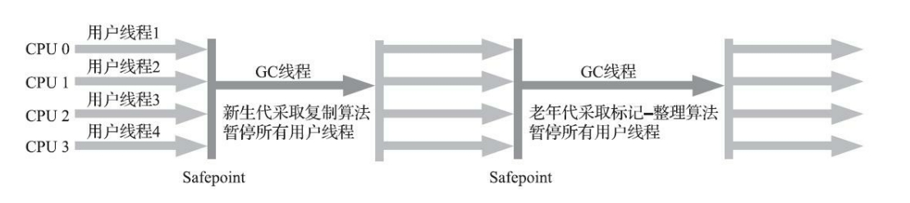

Serial Old是Serial收集器的老年代版本，它同样是一个单线程收集器，使用标记-整理算法。

Serial Old的主要意义也是供客户端模式下的HotSpot虚拟机使用。如果在服务端模式下，它也可能有两种用途：一种是在JDK 5以及之前的版本中与Parallel Scavenge收集器搭配使用，另外一种就是作为CMS 收集器发生失败时的后备预案，在并发收集发生Concurrent Mode Failure时使用。


#### ParNew

ParNew收集器实质上是Serial收集器的多线程并行版本。ParNew 追求降低用户停顿时间，适合交互式应用。

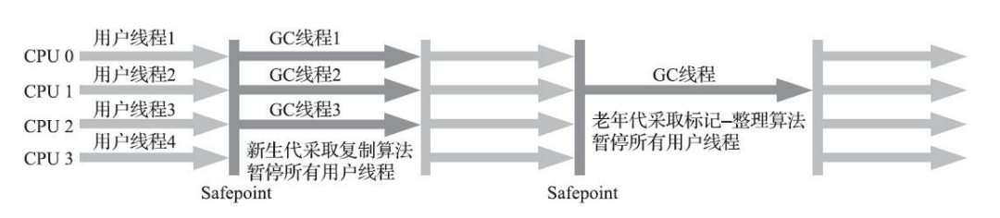


#### Parallel Scavenge/Parallel Old

吞吐量优先收集器是JDK8默认的年轻代垃圾回收器，基于标记-复制算法，多线程并行回收，关注的是系统的吞吐量。具备自动调整堆内存大小的特点。适合没有交互的后台计算。

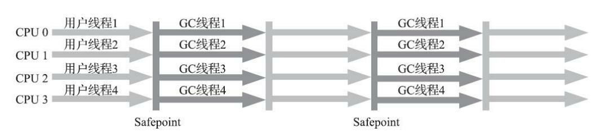

Parallel Scavenge允许手动设置最大暂停时间和吞吐量。Oracle官方建议在使用这个组合时，不要设置堆内存的最大值，垃圾回收器会根据最大暂停时间和吞吐量自动调整内存大小。

- 最大暂停时间，`-XX:MaxGCPauseMillis=n` 设置每次垃圾回收时的最大停顿毫秒数
- 吞吐量，`-XX:GCTimeRatio=n` 设置吞吐量为n（意味着垃圾收集时间占总时间的比例 = 1/n + 1）
- 自动调整内存大小, `-XX:+UseAdaptiveSizePolicy `设置可以让垃圾回收器根据吞吐量和最大停顿的毫秒数自动调整内存大小


Parallel Old是Parallel Scavenge收集器的老年代版本，支持多线程并发收集，基于标记-整理算法实现。


在注重吞吐量或者处理器资源较为稀缺的场合，都可以优先考虑Parallel Scavenge加Parallel Old收集器这个组合。


#### CMS (Concurrent Mark Sweep)

CMS（Concurrent Mark Sweep）收集器是一种以获取**最短回收停顿时间（STW）**为目标的收集器，是基于标记-清除算法实现。

整个过程分为四个步骤：其中初始标记、重新标记这两个步骤仍然需要“Stop The World”。

1. 初始标记：仅使用一条初始标记线程对所有与 GC Roots 直接关联的对象进行标记，速度很快。

2. 并发标记：使用多条标记线程，与用户线程并发执行。此过程进行可达性分析，标记出所有废弃对象。速度很慢。

3. 重新标记：使用多条标记线程并发执行，将刚才并发标记过程中新出现的废弃对象标记出来。

4. 并发清除：只使用一条 GC 线程，与用户线程并发执行，清除刚才标记的对象。这个过程非常耗时。

并发标记与并发清除过程耗时最长，且可以与用户线程一起工作，因此，总体上说，CMS 收集器的内存回收过程是与用户线程一起并发执行的。

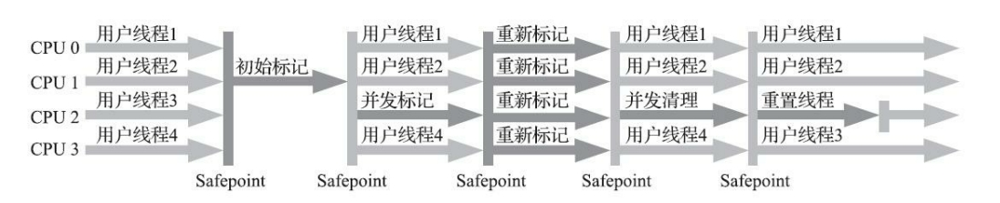

优点：并发收集、低停顿

缺点：

1. CMS使用了标记-清除算法，在垃圾收集结束之后会出现内存碎片。

2. 无法处理“浮动垃圾”。在CMS的并发标记和并发清理阶段，用户线程是还在继续运行的，程序在运行自然就还会伴随有新的垃圾对象不断产生，但这一部分垃圾对象是出现在标记过程结束以后，CMS无法在当次收集中处理掉它们，只好留待下一次垃圾收集时再清理掉。

4. 并发阶段会影响用户线程执行的性能


#### G1 (Garbage First)

JDK9之后默认的垃圾回收器是G1垃圾回收器。Parallel Scavenge关注吞吐量，允许用户设置最大暂停时间 ，但是会减少年轻代可用空间的大小。CMS关注暂停时间，但是吞吐量方面会下降。而G1设计目标就是将上述两种垃圾回收器的优点融合：

1. 支持巨大的堆空间回收，并有较高的吞吐量。

2. 支持多CPU并行垃圾回收。

3. 极高概率满足 GC 停顿时间要求。


G1的整个堆会被划分成多个大小相等的区域，称之为区Region，每一个Region都可以作为Eden、Survivor、Old区。

Region中还有一类特殊的Humongous区域，专门用来存储大对象。G1认为只要大小超过了一个 Region容量一半的对象即可判定为大对象。每个Region的大小可以通过参数`-XX：G1HeapRegionSize` 设定，取值范围为1MB～32MB，且应为2的N次幂。而对于那些超过了整个Region容量的超级大对象， 将会被存放在N个连续的Humongous Region之中，G1的大多数行为都把Humongous Region作为老年代 的一部分来进行看待。

G1收集器之所以能建立可预测的停顿时间模型，是因为它将Region作为单次回收的最小单元，即每次收集到的内存空间都是Region大小的整数倍，这样可以有计划地避免在整个Java堆中进行全区域的垃圾收集。更具体的处理思路是让G1收集器去跟踪各个Region里面的垃 圾堆积的“价值”大小，价值即回收所获得的空间大小以及回收所需时间的经验值，然后在后台维护一 个优先级列表，每次根据用户设定允许的收集停顿时间（使用参数`-XX：MaxGCPauseMillis` 指定，默 认值是200毫秒），优先处理回收价值收益最大的那些Region，这也就是“Garbage First”名字的由来。 

从整体上看， G1 是基于“标记-整理”算法实现的收集器，从局部（两个 Region 之间）上看是基于“复制”算法实现的，这意味着运行期间不会产生内存空间碎片。


G1收集器的运作过程大致可划分为四个步骤：

1. 初始标记：仅使用一条初始标记线程对所有与 GC Roots 直接关联的对象进行标记。
2. 并发标记：使用一条标记线程与用户线程并发执行。此过程进行可达性分析，速度很慢。
3. 最终标记：使用多条标记线程并发执行。
4. 筛选回收：负责更新Region的统计数据，对各个Region的回收价值和成本进行排序，根据用户所期望的停顿时间来制定回收计划，可以自由选择任意多个Region 构成回收集，然后把决定回收的那一部分Region的存活对象复制到空的Region中，再清理掉整个旧 Region的全部空间。这里的操作涉及存活对象的移动，是必须暂停用户线程，由多条收集器线程并行完成的。

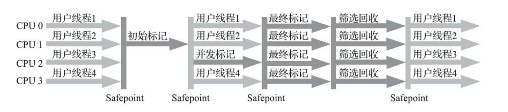


| 垃圾回收器 | 使用范围       | STW                      | 垃圾回收算法    | 回收过程                                        | 浮动垃圾     | 使用场景                     |
| ---------- | -------------- | ------------------------ | --------------- | ----------------------------------------------- | ------------ | ---------------------------- |
| CMS        | 老年代         | 以最小的停顿时间为目标   | 标记-清除       | 1. 初始标记 2. 并发标记 3. 重新标记 4. 并发清除 | 产生浮动垃圾 | 低延迟需求；老年代收集；     |
| G1         | 新生代和老年代 | 极高概率满足停顿时间要求 | 复制、标记-整理 | 1. 初始标记 2. 并发标记 3. 最终标记 4. 筛选回收 | 没有浮动垃圾 | 大堆内存；低停顿时间高吞吐量 |


#### Shenandoah GC


#### ZGC


## 原理

### 栈上的数据存储

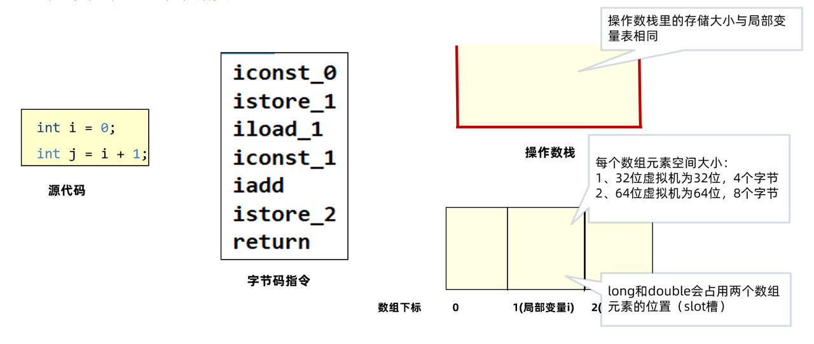

**boolean、byte、char、short在栈上是不是存在空间浪费？**

是的，Java虚拟机采用的是空间换时间方案，在栈上不存储具体的类型，只根据slot槽进行数据的处理，浪费了一些内存空间但是避免不同数据类型不同处理方式带来的时间开销。

同时，像long型在64位系统中占用2个slot，使用了16字节空间，但实际上在Hotspot虚拟机中，它的高8个字节没有使用，这样就满足了long型使用8个字节的需要。


**boolean数据类型保存方式**

1、常量1先放入局部变量表，相当于给a赋值为true。

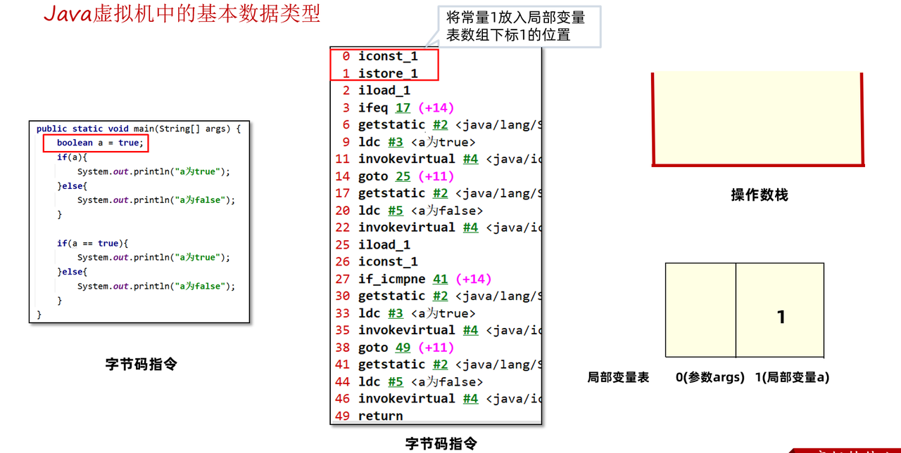

2、将操作数栈上的值和1与0比较（判断a是否为false），相等跳转到偏移量17的位置，不相等继续向下运行。

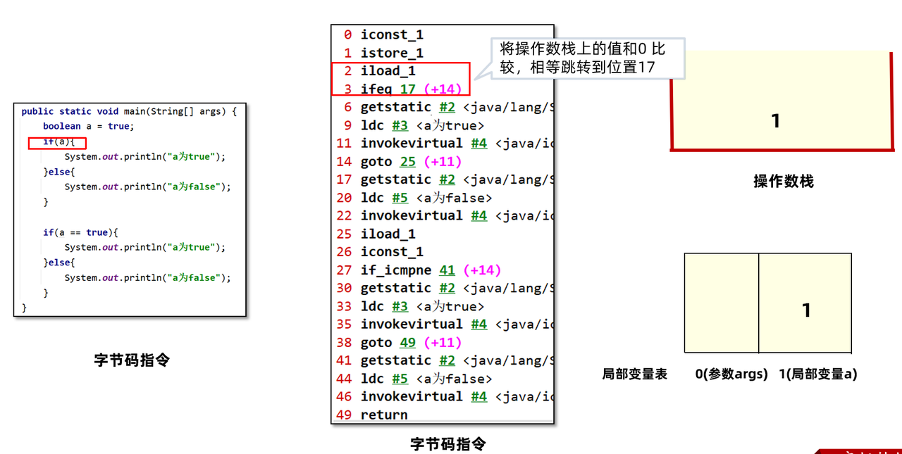

3、将局部变量表a的值取出来放到操作数栈中，再定义一个常量1，比对两个值是否相等。其实就是判断a == true，如果相等继续向下运行，不相等跳转到偏移量41也就是执行else部分代码

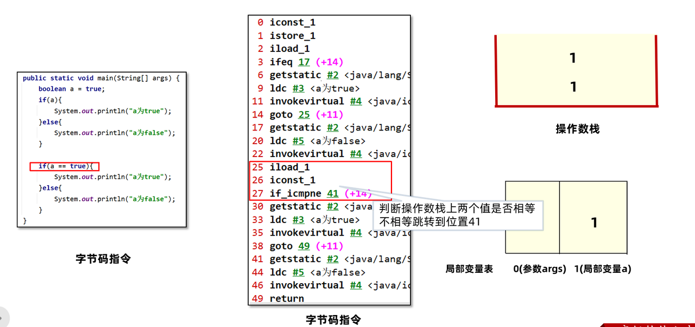

在Java虚拟机中栈上boolean类型保存方式与int类型相同，所以它的值如果是1代表true，如果是0代表false。


**栈中的数据要保存到堆上或者从堆中加载到栈上时怎么处理？**

1. 堆中的数据加载到栈上，由于栈上的空间大于或者等于堆上的空间，所以直接处理但是需要注意下符号位。

   boolean、char为无符号，低位复制，高位补0

   byte、short为有符号，低位复制，高位非负则补0，负则补1

2. 栈中的数据要保存到堆上，byte、char、short由于堆上存储空间较小，需要将高位去掉。boolean比较特殊，只取低位的最后一位保存。


### 方法调用的原理

方法调用的本质是通过字节码指令的执行，能在栈上创建栈帧，并执行调用方法中的字节码执行。以invoke开头的字节码指令的作用是执行方法的调用。

在JVM中，一共有五个字节码指令可以执行方法调用：

1. invokestatic：调用静态方法。静态绑定

2. invokespecial: 调用对象的private方法、构造方法，以及使用 super 关键字调用父类实例的方法、构造方法，以及所实现接口的默认方法。静态绑定

3. invokevirtual：调用对象的非private方法。动态绑定

4. invokeinterface：调用接口对象的方法。动态绑定

5. invokedynamic：用于调用动态方法，主要应用于lambda表达式中，机制极为复杂了解即可。


Invoke指令执行时，需要找到方法区中instanceKlass中保存的方法相关的字节码信息。但是方法区中有很多类，每一个类又包含很多个方法，怎么精确地定位到方法的位置呢？

**静态绑定**

1、编译期间，invoke指令会携带一个参数符号引用，引用到常量池中的方法定义。方法定义中包含了类名 + 方法名 + 返回值 + 参数。

2、在方法第一次调用时，这些符号引用就会被替换成内存地址的直接引用，这种方式称之为静态绑定。


静态绑定适用于处理静态方法、私有方法、或者使用final修饰的方法，因为这些方法不能被继承之后重写。

invokestatic

invokespecial

final修饰的invokevirtual


**动态绑定**

对于非static、非private、非final的方法，有可能存在子类重写方法，那么就需要通过动态绑定来完成方法地址绑定的工作。

动态绑定是基于方法表来完成的，invokevirtual使用了虚方法表（vtable），invokeinterface使用了接口方法表(itable)，整体思路类似。所以接下来使用invokevirtual和虚方法表来解释整个过程。

每个类中都有一个虚方法表，本质上它是一个数组，记录了方法的实际入口地址。如果某个方法在子类中没有被重写，那子类的虚方法表中的地址入口和父类相同方法的地址入口是一致的，都指向父类的实现入口。如果子类中重写了这个方法，子类虚方法表中的地址也会被替换为指向子类实现版本的入口地址。

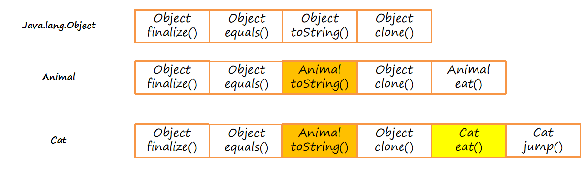

产生invokevirtual调用时，先根据对象头中的类型指针找到方法区中InstanceClass对象，获得虚方法表。再根据虚方法表找到对应的对方，获得方法的地址，最后调用方法。

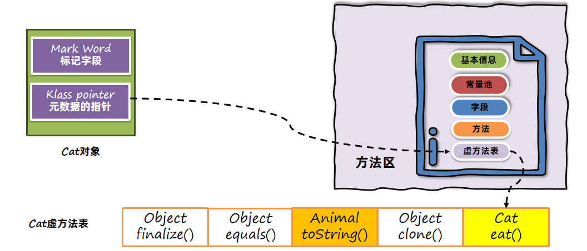


### 异常捕获的原理

在Java中，程序遇到异常时会向外抛出，此时可以使用try-catch捕获异常的方式将异常捕获并继续让程序按程序员设计好的方式运行。比如如下代码：在try代码块中如果抛出了Exception对象或者子类对象，则会进入catch分支。

异常捕获机制的实现，需要借助于编译时生成的异常表。

异常表在编译期生成，存放的是代码中异常的处理信息，包含了异常捕获的生效范围以及异常发生后跳转到的字节码指令位置。

起始/结束PC：此条异常捕获生效的字节码起始/结束位置。

跳转PC：异常捕获之后，跳转到的字节码位置。


程序运行中触发异常时，Java 虚拟机会从上至下遍历异常表中的所有条目。当触发异常的字节码的索引值在某个异常表条目的监控范围内，Java 虚拟机会判断所抛出的异常和该条目想要捕获的异常是否匹配。

1、如果匹配，跳转到“跳转PC”对应的字节码位置。

2、如果遍历完都不能匹配，说明异常无法在当前方法执行时被捕获，此方法栈帧直接弹出，在上一层的栈帧中进行异常捕获的查询。


多个catch分支情况下，异常表会从上往下遍历，先捕获RuntimeException，如果捕获不了，再捕获Exception。

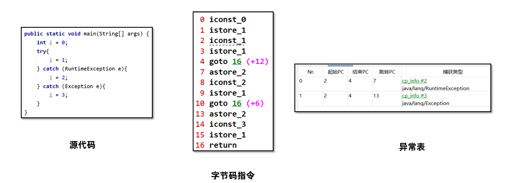

finally的处理方式就相对比较复杂一点了，分为以下几个步骤：

1、finally中的字节码指令会插入到try 和 catch代码块中,保证在try和catch执行之后一定会执行finally中的代码。

如下，在`i=1`和`i=2`两段字节码指令之后，都加入了finally下的字节码指令。

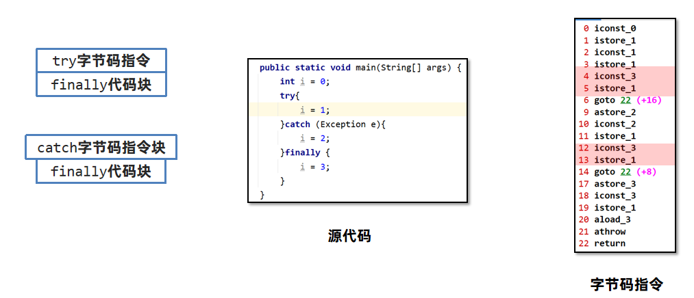

2、如果抛出的异常范围超过了Exception，比如Error或者Throwable，此时也要执行finally，所以异常表中增加了两个条目。覆盖了try和catch两段字节码指令的范围，any代表可以捕获所有种类的异常。

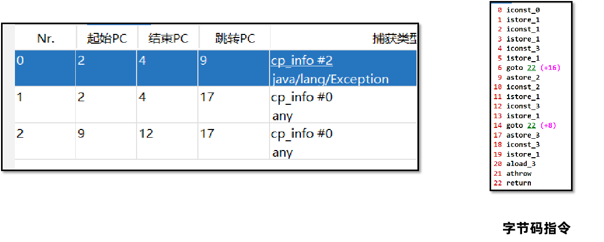

## JVM实践

JVM调优参数？

堆、栈、Eden和Survivor区的大小比例、年轻代晋升老年代的阈值、垃圾回收器


JVM调优工具？

jps：进程状态信息

jstack：查看java进程内的线程的堆栈信息

jmap：查看堆转储信息

jhat：堆转储快照工具

jstat：JVM统计监测工具

jconsole：用于对JVM的内存、线程、类的监控

VisualVM：能够监控线程，内存情况


内存溢出的排查思路？

1. 获取堆内存快照dump：使用jmap或者添加虚拟机参数的方式生成dump文件
2. VisualVM去分析dump文件
3. 通过查看堆信息定位内存溢出


CPU飙高排查方案和思路？

1. 使用top命令查看cpu占用情况并定位进程
2. 使用ps命令查看进程的线程信息
3. 使用jstack命令查看进程中哪些线程出现了问题，定位问题
