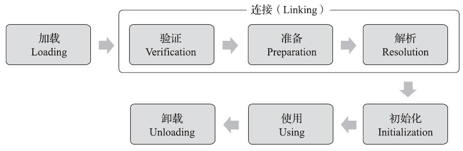
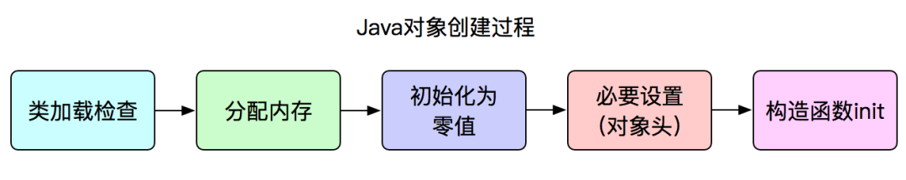
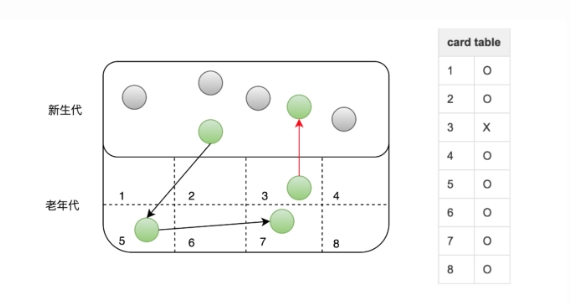
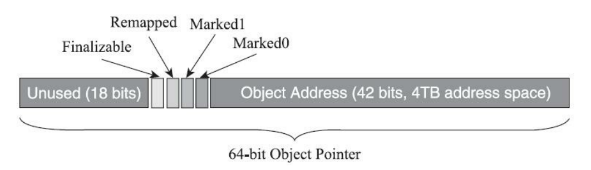

---
hide:
  - navigation
---

https://docs.oracle.com/javase/specs/index.html

[OpenJDK Mercurial Repositories](https://hg.openjdk.org/jdk)


JVM功能：

* 一次编写，到处运行
* 内存管理：自动为对象、方法分配内存；自动垃圾回收机制

* 解释和执行：对字节码文件中的指令，实时解释为机器码执行
* 即时编译：对热点代码进行优化，提升效率

JVM组成：


## 字节码文件

Class文件是一组以8个字节为基础单位的二进制流。Class文件格式采用一种类似于C语言结构体的伪结构来存储数据，这种伪结构中只有两种数据类型：“无符号数”和“表”。

- 无符号数：无符号数可以用来描述数字、索引引用、数量值或者按照UTF-8编码构成字符串值
- 表：由多个无符号数或者其他表作为数据项构成的复合数据类型。


Class 文件具体由以下几个构成:

- **魔数**：每个Class文件的头4个字节被称为魔数 `0xcafebabe` ，它的唯一作用是确定这个文件是否为 一个能被虚拟机接受的Class文件。

- **版本信息**：紧接着魔数的4个字节存储的是Class文件的版本号：第5和第6个字节是次版本号，第7和第8个字节是主版本号。

  Java的版本号是从45开始的，JDK 1.1之后的每个JDK大版本发布主版本号向上加1（JDK 1.0～1.1使用了45.0～45.3的版本号）。高版本的JDK能向下兼容以前版本的Class文件，但不能运行以后版本的Class文件。

- **常量池**：常量池中存放两种类型的常量：字面值常量（程序中定义的字符串、被 final 修饰的值）和符号引用（定义的各种名字：类和接口的全限定名、字段的名字和描述符、方法的名字和描述符）

- **访问标志**：这个标志用于识别一些类或者接口层次的访问信息，包括：这个 Class 是类还是接口；是否定义为 public 类型；是否被 abstract/final 修饰。

- **类索引、父类索引、接口索引集合**：类索引用于确定这个类的全限定名，父类索引用于确定这个类的父类的全限定名，接口索引集合就用来描述这个类实现了哪些接口。

- **字段表集合**：字段表用于描述接口或者类中声明的变量，包括类级变量以及实例级变量，但不包括在方法内部声明的局部变量。字段表集合中不会列出从父类或者父接口中继承而来的字段。

- **方法表集合**：方法表与同字段表类似。如果父类方法在子类中没有被重写，方法表集合中就不会出现来自父类的方法信息。

- **属性表集合**


**字节码常用工具**：

**javap**

javap是JDK自带的反编译工具，可以通过控制台查看字节码文件的内容。适合在服务器上查看字节码文件内容。

直接输入javap查看所有参数。输入`javap -v 字节码文件名称` 查看具体的字节码信息。如果jar包需要先使用 `jar –xvf` 命令解压。


**jclasslib插件**

使用 jclasslib工具查看字节码文件。 Github地址： https://github.com/ingokegel/jclasslib

jclasslib也有Idea插件版本。选中要查看的源代码文件，选择 视图(View) - Show Bytecode With Jclasslib


**Arthas**

Arthas 是一款线上监控诊断产品，通过全局视角实时查看应用 load、内存、gc、线程的状态信息，并能在不修改应用代码的情况下，对业务问题进行诊断，大大提升线上问题排查效率。 

官网：https://arthas.aliyun.com/doc/

dump：可以将字节码文件保存到本地

jad：反编译指定已加载类的源码，用于确认服务器上的字节码文件是否是最新的


## 类的生命周期/类加载过程

类的生命周期描述了一个类加载、使用、卸载的整个过程。整体可以分为：

- 加载
- 连接，其中又分为验证、准备、解析三个子阶段
- 初始化
- 使用
- 卸载



加载、验证、准备、初始化和卸载这五个阶段的顺序是确定的，类型的加载过程必须按照这种顺序按部就班地开始，而**解析**阶段则不一定：它在某些情况下可以在初始化阶段之后再开始， 这是为了支持Java语言的运行时绑定特性。

### 加载

在加载阶段，Java虚拟机需要完成以下三件事情：

1. 通过一个类的全限定名来获取定义此类的二进制字节流。
2. 将这个字节流所代表的静态存储结构转化为方法区的运行时数据结构。
3. 在内存中生成一个代表这个类的java.lang.Class对象，作为方法区这个类的各种数据的访问入口。

### 连接

加载阶段与连接阶段的部分内容交叉进行，加载阶段尚未完成，连接阶段可能已经开始了。但这两个阶段的开始时间仍然保持着固定的先后顺序。

连接阶段分为三个子阶段:

- **验证**：验证字节码文件内容是否满足《Java虚拟机规范》，包括：文件格式验证、元数据验证、字节码验证、符号引用验证
- **准备**：为**静态变量分配内存并设置默认值**，赋值在初始化阶段，**这些内存都将在方法区中分配**。**实例变量会在对象实例化时随着对象一块分配在Java堆中**。`static final` 修饰的常量（编译期已知值）会在此阶段直接赋值。
- **解析**：将常量池中的符号引用(编号)替换成直接引用(内存地址)。


### 初始化

**对类的静态变量、静态代码块执行初始化操作。**初始化阶段就是执行类构造器 `<clinit>()` 方法的过程。`<clinit>()` 方法是由编译器自动收集类中的所有类变量的赋值动作和静态语句块（static{}块）中的语句合并产生的。


**以下必须立即对类进行初始化**：

1. 在遇到 new、putstatic、getstatic、invokestatic 字节码指令时，如果类尚未初始化，则需要先触发其初始化。能够生成这四条指令的典型Java代码场景有：

   - 使用new关键字实例化对象的时候。 

   - 读取或设置一个类型的静态字段（被final修饰、已在编译期把结果放入常量池的静态字段除外） 的时候。 

   - 调用一个类型的静态方法的时候。

2. 对类进行反射调用时，如果类还没有初始化，则需要先触发其初始化。

3. 初始化一个类时，如果其父类还没有初始化，则需要先初始化父类。

4. 当虚拟机启动时，用户需要指定一个要执行的主类（包含main()方法的那个类），虚拟机会先初始化这个主类。

5. 当使用 JDK 1.7 的动态语言支持时，如果一个 `java.lang.invoke.MethodHandle` 实例最后的解析结果为 REF_getStatic、REF_putStatic、REF_invokeStatic 的方法句柄，并且这个方法句柄所对应的类还没初始化，则需要先触发其初始化。

6. 当一个接口中定义了JDK 8新加入的默认方法（被default关键字修饰的接口方法）时，如果有这个接口的实现类发生了初始化，那该接口要在其之前被初始化。

这 6 种场景中的行为称为对一个类进行主动引用，除此之外，所有引用类型的方式都不会触发初始化，称为被动引用。


**被动引用例子**：

```java
/**
 * 被动引用 Demo1:
 * 通过子类引用父类的静态字段，不会导致子类初始化。
 */
class SuperClass {
    static {
        System.out.println("SuperClass init!");
    }

    public static int value = 123;
}

class SubClass extends SuperClass {
    static {
        System.out.println("SubClass init!");
    }
}

public class NotInitialization {

    public static void main(String[] args) {
        System.out.println(SubClass.value);
        // SuperClass init!
    }
}
```

只会输出“SuperClass init！”，而不会输出“SubClass init！”。对于静态字段，只有直接定义这个字段的类才会被初始化，因此通过其子类来引用父类中定义的静态字段，只会触发父类的初始化而不会触发子类的初始化。


```java
/**
 * 被动引用 Demo2:
 * 通过数组定义来引用类，不会触发此类的初始化。
 */

public class NotInitialization {

    public static void main(String[] args) {
        SuperClass[] superClasses = new SuperClass[10];
    }
}
```

运行之后发现没有输出“SuperClass init！”，说明并没有触发类 `org.fenixsoft.classloading.SuperClass` 的初始化阶段。但是这段代码里面触发了 另一个名为 `Lorg.fenixsoft.classloading.SuperClass` 的类的初始化阶段，对于用户代码来说，这并不是一个合法的类型名称，它是一个由虚拟机自动生成的、直接继承于 `java.lang.Object` 的子类，创建动作由字节码指令newarray触发。


```java
/**
 * 被动引用 Demo3:
 * 常量在编译阶段会存入调用类的常量池中，本质上并没有直接引用到定义常量的类，因此不会触发定义常量的类的初始化。
 */
class ConstClass {
    static {
        System.out.println("ConstClass init!");
    }

    public static final String HELLO_BINGO = "Hello Bingo";

}

public class NotInitialization {

    public static void main(String[] args) {
        System.out.println(ConstClass.HELLO_BINGO);
    }

}
```

没有输出“ConstClass init！”。编译通过之后，常量存储到 NotInitialization 类的常量池中，NotInitialization 的 Class 文件中并没有 ConstClass 类的符号引用入口，这两个类在编译成 Class 之后就没有任何联系了。


### 卸载

判定一个类可以被卸载。需要同时满足下面三个条件：

1. 此类所有实例对象都已经被回收，在堆中不存在任何该类的实例对象以及子类对象。

2. 加载该类的类加载器已经被回收。

3. 该类对应的 java.lang.Class 对象没有在任何地方被引用。


## 类加载器

类加载器的作用就是将字节码文件加载到JVM中，让Java程序能够运行起来。

站在Java虚拟机的角度来看，只存在两种不同的类加载器：一种是启动类加载器，这个类加载器使用C++语言实现，是虚拟机自身的一部分；另外一种就是其他所有的类加载器，这些类加载器都由Java语言实现，独立存在于虚拟机外部，并且全都继承自抽象类 `java.lang.ClassLoader`，这些类加载器需要由启动类加载器加载到内存中之后才能去加载其他的类。

站在Java开发人员的角度来看，分为启动类加载器、扩展类加载器、应用程序类加载器、自定义类加载器。 


类加载器的设计JDK8和8之后的版本差别较大，JDK8及之前的版本，这些版本中默认的类加载器有如下几种：扩展类加载器和应用程序类加载器的源码位于 `rt.jar` 包中的 `sun.misc.Launcher.java`

由于JDK9引入了module的概念，类加载器在设计上发生了很多变化。

1. 启动类加载器使用Java编写，位于 `jdk.internal.loader.ClassLoaders` 类中。Java中的 `BootClassLoader` 继承自`BuiltinClassLoader` 实现从模块中找到要加载的字节码资源文件。启动类加载器依然无法通过java代码获取到，返回的仍然是null，保持了统一。

2. 扩展类加载器被替换成了平台类加载器。平台类加载器遵循模块化方式加载字节码文件，所以继承关系从 `URLClassLoader` 变成了`BuiltinClassLoader`，`BuiltinClassLoader` 实现了从模块中加载字节码文件。平台类加载器的存在更多的是为了与老版本的设计方案兼容，自身没有特殊的逻辑。


**启动类加载器**：

加载 `<JAVA_HOME>\lib` 目录，或者被 `-Xbootclasspath` 参数所指定的路径中存放的，而且是Java虚拟机能够识别的（按照文件名识别，如rt.jar、tools.jar，名字不符合的类库即使放在lib目录中也不会被加载）类库加载到虚拟机的内存中。


**扩展类加载器**：

在类 `sun.misc.Launcher$ExtClassLoader` 中以Java代码的形式实现的。

它负责加载`<JAVA_HOME>\lib\ext` 目录中，或者被 `java.ext.dirs` 系统变量所指定的路径中所有的类库。

由于扩展类加载器是由Java代码实现的，开发者可以直接在程序中使用扩展类加载器来加载Class文件。


**应用程序类加载器**：

由 `sun.misc.Launcher$AppClassLoader` 来实现。由于应用程序类加载器是 `ClassLoader` 类中的`getSystemClassLoader()` 方法的返回值，所以有些场合中也称它为“系统类加载器”。它负责加载用户类路径 （ClassPath）上所有的类库，可以直接在代码中使用这个类加载器。如果应用程序中没有自定义过自己的类加载器，一般情况下这个就是程序中默认的类加载器。


**自定义类加载器**：

除了启动类加载器的其他类加载器均由 Java 实现且全部继承自`java.lang.ClassLoader`。如果我们要自定义自己的类加载器，需要继承 `ClassLoader`抽象类。

`ClassLoader` 类有两个关键的方法：

- `protected Class loadClass(String name, boolean resolve)`：加载指定二进制名称的类，实现了双亲委派机制 。`name` 为类的二进制名称，`resolve` 如果为 true，在加载时调用 `resolveClass(Class<?> c)` 方法解析该类。
- `protected Class findClass(String name)`：根据类的二进制名称来查找类，默认实现是空方法。

如果我们不想打破双亲委派模型，就重写 `ClassLoader` 类中的 `findClass()` 方法即可，无法被父类加载器加载的类最终会通过这个方法被加载。但是，如果想打破双亲委派模型则需要重写 `loadClass()` 方法。


类加载有三种方式:

1. 命令行启动应用时候由JVM初始化加载

2. 通过Class.forName()方法动态加载

3. 通过ClassLoader.loadClass()方法动态加载

Class.forName()和ClassLoader.loadClass()区别?

- Class.forName(): 将类的.class文件加载到jvm中之外，还会对类进行解释，执行类中的static块；
- ClassLoader.loadClass(): 只干一件事情，就是将.class文件加载到jvm中，不会执行static中的内容,只有在newInstance才会去执行static块。
- Class.forName(name, initialize, loader)带参函数也可控制是否加载static块。并且只有调用了newInstance()方法采用调用构造函数，创建类的对象 


### 双亲委派机制

双亲委派模型的工作过程是：如果一个类加载器收到了类加载的请求，它首先不会自己去尝试加载这个类，而是把这个请求委派给父类加载器去完成，每一个层次的类加载器都是如此，因此所有的加载请求最终都应该传送到最顶层的启动类加载器中，只有当父加载器反馈自己无法完成这个加载请求（它的搜索范围中没有找到所需的类）时，子加载器才会尝试自己去完成加载。


```java
// java.lang.ClassLoader#loadClass()
protected synchronized Class<?> loadClass(String name, boolean resolve) throws ClassNotFoundException
{
    // 首先，检查请求的类是否已经被加载过了
    Class c = findLoadedClass(name);
    if (c == null) {
        try {
            if (parent != null) {
                c = parent.loadClass(name, false);
            } else {
                c = findBootstrapClassOrNull(name);
            }
        } catch (ClassNotFoundException e) {
            // 如果父类加载器抛出ClassNotFoundException
            // 说明父类加载器无法完成加载请求
        }
        if (c == null) {
            // 在父类加载器无法加载时
            // 再调用本身的findClass方法来进行类加载
            c = findClass(name);
        }
    }
    if (resolve) {
        resolveClass(c);
    }
    return c;
}

```


双亲委派机制的作用：

1. 保证类加载的安全性，通过双亲委派机制避免恶意代码替换JDK中的核心类库，比如java.lang.String，确保核心类库的完整性和安全性。
2. 避免重复加载


打破双亲委派机制历史上有三种方式，但本质上只有第一种算是真正的打破了双亲委派机制：

1. 自定义类加载器并且重写 `loadClass`方法。正确的方式是重写 `findClass` 方法，如果父类加载失败，会自动调用自己的 `findClass()`方法来完成加载，这样既不影响用户按照自己的意愿去加载类，又可以保证新写出来的类加载器是符合双亲委派规则的。

2. 线程上下文类加载器。JDBC接口是类库定义的，实现却是在各数据库厂商提供的jar包中，通过启动类加载器找不到实现类，需要应用程序类加载器完成。

3. Osgi框架的类加载器。历史上Osgi框架实现了一套新的类加载器机制，允许同级之间委托进行类的加载，目前很少使用。

4. JDK9中，当平台及应用程序类加载器收到类加载请求，在委派给父加载器加载前，要先判断该类是否能够归属到某一个系统模块中，如果可以找到这样的归属关系，就要优先委派给负责那个模块的加载器完成加载，也许这可以算是对双亲委派的第四次破坏。


**为什么不直接由启动类加载器加载，而是选择从下往上再从上往下？**

> 在生产应用中，95%的类其实都是由应用类加载器加载的，如果类已经被加载过一次，就会被保存在应用类加载器中，下次使用可直接从应用类加载器中获取。但是如果由启动类加载器加载，大部分的类的获取都要走一个 `启动类加载器 > 扩展类加载器 > 应用类加载器` 的过程，下次使用时也要走一遍上述过程，效率显然比直接从应用类加载器中获取要慢不少，所以为了后续调用节省时间，宁可第一次加载浪费点时间，也要选择应用程序类加载器。


## 运行时数据区	


### 程序计数器

程序计数器也叫PC寄存器，线程私有，**记录当前要执行的的字节码指令的地址**。

若当前线程正在执行的是一个本地方法，那么此时程序计数器为`Undefined`。


程序计数器主要有两个作用：

- 字节码解释器通过改变程序计数器来依次读取指令，从而实现代码的流程控制，如：分支、循环、跳转、异常处理、线程恢复等。
- 在多线程的情况下，程序计数器用于记录当前线程执行的位置，从而当线程被切换回来的时候能够知道该线程上次运行到哪儿了。


程序计数器的特点：

- 是一块较小的内存空间。
- 线程私有，每条线程都有自己的程序计数器。
- 生命周期：随着线程的创建而创建，随着线程的结束而销毁。
- 是唯一一个不会出现 `OutOfMemoryError` 的内存区域。


### Java虚拟机栈

每个线程运行时所需要的内存，称为虚拟机栈。每个方法被执行的时候，Java虚拟机都会同步创建一个栈帧用于**存储局部变量表、操作数栈、动态链接、方法返回地址等信息**。每一个方法被调用直至执行完毕的过程，就对应着一个栈帧在虚拟机栈中从入栈到出栈的过程。


要修改Java虚拟机栈的大小，可以使用虚拟机参数 -Xss 。默认1024k

- 语法：`-Xss栈大小`
- 单位：字节（默认，必须是 1024 的倍数）、k或者K(KB)、m或者M(MB)、g或者G(GB)


#### 局部变量表

定义为一个数字数组，主要用于存储方法参数、定义在方法体内部的局部变量，数据类型包括各类基本数据类型，对象引用，以及 return address 类型。

局部变量表容量大小是在**编译期确定**下来的。最基本的存储单元是槽（slot），32 位类型（byte、short、char 在存储前被转换为int，boolean也被转换为int，0 表示 false，非 0 表示 true、float）占用一个 slot，64 位类型（long 和 double）占用两个 slot。

局部变量表中保存了字节码指令生效的偏移量：


如果当前帧是由构造方法或者实例方法创建的，那么该对象引用 this，会存放在 index 为 0 的 slot 处，其余的参数表顺序继续排列。（静态方法中为什么不可以引用 this，就是因为this 变量不存在于当前方法的局部变量表中）。

**局部变量表保存的内容有：实例方法的this对象，方法的参数，方法体中声明的局部变量。**


为了节省空间，局部变量表中的槽是可以复用的，一旦某个局部变量不再生效，当前槽就可以再次被使用。


所以，上面局部变量表数值的长度为6。这一点在编译期间就可以确定了，运行过程中只需要在栈帧中创建长度为6的数组即可，在方法运行期间不会改变局部变量表的大小。


#### 操作数栈

操作数栈是栈帧中虚拟机在执行指令过程中用来**存放临时数据和中间结果**的一块区域。他是一种栈式的数据结构，如果一条指令将一个值压入操作数栈，则后面的指令可以弹出并使用该值。	

每一个操作数栈会拥有一个明确的栈深度，用于存储数值，最大深度在**编译期**就定义好。32位数据类型所占的栈容量为1，64位数据类型所占的栈容量为2。


#### 其他

静态链接：当一个字节码文件被装载进 JVM 内部时，如果被调用的目标方法在编译期可知，且运行时期间保持不变，这种情况下将调用方的符号引用转为直接引用的过程称为静态链接。

动态链接：如果被调用的方法无法在编译期被确定下来，只能在运行期将调用的方法的符号引用转为直接引用，这种引用转换过程具备动态性，因此被称为动态链接。

方法出口：指的是方法在正确或者异常结束时，当前栈帧会被弹出，同时程序计数器应该指向上一个栈帧中的下一条指令的地址。所以在当前栈帧中，需要存储此方法出口的地址。

异常表：存放的是代码中异常的处理信息，包含了异常捕获的生效范围以及异常发生后跳转到的字节码指令位置。


### 本地方法栈

Java虚拟机栈存储了Java方法调用时的栈帧，而本地方法栈存储的是native本地方法的栈帧。

**在Hotspot虚拟机中，Java虚拟机栈和本地方法栈实现上使用了同一个栈空间**。


### 堆

堆是用来存放对象和数组的内存空间，几乎所有的对象都存储在堆中。


堆的特点：

- 线程共享，整个 Java 虚拟机只有一个堆，所有的线程都访问同一个堆。而程序计数器、Java 虚拟机栈、本地方法栈都是一个线程对应一个。
- 在虚拟机启动时创建。
- 是垃圾回收的主要场所。
- 堆可分为新生代（`Eden` 区，`From Survior`，`To Survivor`）、老年代。
- Java 虚拟机规范规定，堆可以处于物理上不连续的内存空间中，但在逻辑上它应该被视为连续的。
- Java7中有一个永久代用来保存类信息、静态变量、常量、编译后的代码，Java8移除了永久代，把数据存储到了本地内存的元空间中，防止内存溢出。


堆空间有三个需要关注的值，used、total、max。used指的是当前已使用的堆内存，total是java虚拟机已经分配的可用堆内存，max是java虚拟机可以分配的最大堆内存。


如果不设置任何的虚拟机参数，max默认是系统内存的1/4，total默认是系统内存的1/64。在实际应用中一般都需要设置total和max的值。


**设置堆的大小：**

要修改堆的大小，可以使用虚拟机参数 –Xmx（max最大值）和-Xms (初始的total)。

语法：`-Xmx值 -Xms值`

单位：字节（默认，必须是 1024 的倍数）、k或者K(KB)、m或者M(MB)、g或者G(GB)

限制：Xmx必须大于 2 MB，Xms必须大于1MB

Java服务端程序开发时，**建议将-Xmx和-Xms设置为相同的值**，这样在程序启动之后可使用的总内存就是最大内存，而无需向java虚拟机再次申请，减少了申请并分配内存时间上的开销，同时也不会出现内存过剩之后堆收缩的情况。


### 方法区

方法区与Java堆一样，是各个线程共享的内存区域，它用于存储已被虚拟机加载的**类信息、常量、静态变量、即时编译器编译后的代码缓存**等数据。方法区是《Java虚拟机规范》中设计的**虚拟概念**，是一块逻辑区域。


方法区在Hotspot设计如下：

* JDK8之前的实现叫**永久代**，是堆的一部分，和新生代，老年代地址是连续的（受垃圾回收器管理，省去专门为方法区编写内存管理代码的工作，但是容易遇到内存溢出问题，极少数方法（例如String::intern()）会因永久代的原因而导致不同虚拟机下有不同的表现）。

* JDK8及之后的实现叫**元空间（metaspace）**，存在于本地内存（我们常说的堆外内存，不受垃圾回收器管理），默认情况下只要不超过操作系统承受的上限，可以一直分配。可以使用 `-XX:MaxMetaspaceSize=值` 将元空间最大大小进行限制。


使用元空间替换永久代的原因：

1. **提高内存上限**：元空间使用的是操作系统内存，而不是JVM内存。如果不设置上限，只要不超过操作系统内存上限，就可以持续分配。而永久代在堆中，可使用的内存上限是有限的。所以使用元空间可以有效减少OOM情况的出现。
2. **优化垃圾回收的策略**：永久代在堆上，垃圾回收机制一般使用老年代的垃圾回收方式，不够灵活。使用元空间之后单独设计了一套适合方法区的垃圾回收机制，而不是使用类的垃圾回收机制。


#### 类的元信息

方法区是用来存储每个类的基本信息（元信息），一般称之为InstanceKlass对象。在类的加载阶段完成。其中就包含了类的字段、方法等字节码文件中的内容，同时还保存了运行过程中需要使用的虚方法表（实现多态的基础）等信息。

#### 运行时常量池

Class文件中除了有类的版本、字段、方法、接口等描述信息外，还有一项信息是常量池表(ConstantPool Table)，**用于存放编译期生成的各种常量与符号引用**，这部分内容将在类加载后存放到方法区的运行时常量池中。

#### 字符串常量池

用于存放字符串字面量，位于堆内存中的一块特殊区域。它的目的是为了优化内存使用和提高字符串处理的效率，避免字符串的重复创建。


字符串常量池和运行时常量池有什么关系？

早期设计时，字符串常量池是属于运行时常量池的一部分，他们存储的位置也是一致的。后续做出了调整，将字符串常量池和运行时常量池做了拆分。

|  |  |  |
| ---------------------------- | ---------------------------- | ---------------------------- |


字符串常量池从方法区移动到堆的原因：

1. **垃圾回收优化**：字符串常量池的回收逻辑和对象的回收逻辑类似，内存不足的情况下，如果字符串常量池中的常量不被使用就可以被回收；方法区中的类的元信息回收逻辑更复杂一些。移动到堆之后，就可以利用对象的垃圾回收器，对字符串常量池进行回收。
2. **让方法区大小更可控**：一般在项目中，类的元信息不会占用特别大的空间，所以会给方法区设置一个比较小的上限。如果字符串常量池在方法区中，会让方法区的空间大小变得不可控。


**案例**：

对于jvm底层，`String str = new String("123")`创建对象流程是什么？

1. 在常量池中查找是否存在"123"这个字符串；若有，则返回对应的引用实例；若无，则创建对应的实例对象；
2. 在堆中new一个String类型的"123"字符串对象；
3. 将对象地址复制给str，然后创建一个应用。


String str ="ab" + "cd"; 对象个数？

1. 字符串常量池：（1个对象）"abcd";
2. 堆：无
3. 栈：（1个引用）str


String str = new String("abc"); 对象个数？

若字符串常量池无该字符串对象：

1. 字符串常量池：（1个对象）"abc"; 
2. 堆：（1个对象）new String("abc")
3. 栈：（1个引用）str


String str = new String("a" + "b"); 对象个数？

若字符串常量池无该字符串对象：

1. 字符串常量池：（3个对象）"a"，"b"，"ab";
2. 堆：（1个对象）new String("ab")
3. 栈：（1个引用）str


String str3 = str1 + str2; 对象个数？

```java
String str1 = "ab";
String str2 = "cd";
String str3 = str1 + str2;
```

若字符串常量池无该字符串对象

1. 字符串常量池：（3个对象）"ab"，"cd"，"abcd";
2. 堆：无
3. 栈：（3个引用）str1，str2，str3


**intern()**：

如果常量池中存在当前字符串, 就会直接返回当前字符串. 如果常量池中没有此字符串, 会将此字符串放入常量池中后, 再返回。

[深入解析String#intern - 美团技术团队](https://tech.meituan.com/2014/03/06/in-depth-understanding-string-intern.html)

对于String字符串：

第一，使用双引号声明的字符串对象会保存在字符串常量池中。

第二，使用 new 关键字创建的字符串对象会先从字符串常量池中找，如果没找到就创建一个，然后再在堆中创建字符串对象；如果找到了，就直接在堆中创建字符串对象。

第三，针对没有使用双引号声明的字符串对象来说，就像下面代码中的 s1 那样：

```java
String s1 = new String("二哥") + new String("三妹");
```

如果想把 s1 的内容也放入字符串常量池的话，可以调用 `intern()` 方法来完成。


Java 7 之前，执行 `String.intern()` 方法的时候，不管对象在堆中是否已经创建，字符串常量池中仍然会创建一个内容完全相同的新对象； Java 7 及之后，由于字符串常量池放在了堆中，执行 `String.intern()` 方法的时候，如果对象在堆中已经创建了，字符串常量池中就不需要再创建新的对象了，而是直接保存堆中对象的引用，也就节省了一部分的内存空间。


```java
String s1 = new String("二哥") + new String("三妹");
String s2 = s1.intern();
System.out.println(s1 == s2); // java7之前：false  java7之后: true
```

执行过程：

1. 创建 "二哥" 字符串对象，存储在字符串常量池中。
2. 创建 "三妹" 字符串对象，存储在字符串常量池中。
3. 执行 `new String("二哥")`，在堆上创建一个字符串对象，内容为 "二哥"。
4. 执行 `new String("三妹")`，在堆上创建一个字符串对象，内容为 "三妹"。
5. 执行 `new String("二哥") + new String("三妹")`，会创建一个 StringBuilder 对象，并将 "二哥" 和 "三妹" 追加到其中，然后调用 StringBuilder 对象的 toString() 方法，将其转换为一个新的字符串对象，内容为 "二哥三妹"。这个新的字符串对象存储在堆上。


```java
public class RuntimeConstantPoolOOM {

    public static void main(String[] args) {
        String str1 = new StringBuilder("计算机").append("软件").toString();
        System.out.println(str1.intern() == str1);

        String str2 = new StringBuilder("ja").append("va").toString();
        System.out.println(str2.intern() == str2);
    }
}
```

这段代码在JDK 6中运行，会得到两个false，而在JDK 7中运行，会得到一个true和一个false。产生差异的原因是，在JDK 6中，intern()方法会把首次遇到的字符串实例复制到永久代的字符串常量池中存储，返回的也是永久代里面这个字符串实例的引用，而由StringBuilder创建的字符串对象实例在Java堆上，所以必然不可能是同一个引用，结果将返回false。

而JDK 7的intern()方法实现就不需要再拷贝字符串的实例到永久代了，既然字符串常量池已经移到Java堆中，那只需要在常量池里记录一下首次出现的实例引用即可，因此intern()返回的引用和由StringBuilder创建的那个字符串实例就是同一个。

对str2比较返回false，这是因为“java”这个字符串在执行StringBuilder.toString()之前就已经出现过了，字符串常量池中已经有它的引用，不符合intern()方法要求“首次遇到”的原则，“计算机软件”这个字符串则是首次出现的，因此结果返回true。


### 直接内存

直接内存并不是虚拟机运行时数据区的一部分，不由JVM管理，是操作系统分配的内存区域。它允许Java程序在堆之外直接分配和使用内存，常见于NIO操作时，用于数据缓冲区，分配回收成本高但效率高。在执行I/O操作时，使用直接内存可以减少一次复制。

在JDK 1.4中新加入了NIO(New Input/Output)类，引入了一种基于通道(Channel)与缓冲区(Buffer)的I/O方式，它可以使用Native函数库直接分配堆外内存，然后通过一个存储在Java堆里面的DirectByteBuffer对象作为这块内存的引用进行操作。这样能在一些场景中显著提高性能，因为避免了在Java堆和Native堆中来回复制数据。

```
用户态 Java 堆      ──(1)──►   JVM 内存    ──(2)──►   内核缓冲区   ──(3)──►   硬件设备
直接内存（DirectBuffer）  ──(1)──►   内核缓冲区   ──(2)──►   硬件设备
```


## HotSpot虚拟机对象

### 对象的创建

对象的创建又是怎样一个过程呢？



**1. 类加载检查**：

虚拟机遇到一条 new 指令时，首先将去检查这个指令的参数是否能在常量池中定位到这个类的符号引用，并且检查这个符号引用代表的类是否已被加载过、解析和初始化过。如果没有，那必须先执行相应的类加载过程。

**2. 分配内存**

在类加载检查通过后，接下来虚拟机将为新生对象分配内存。**对象所需的内存大小在类加载完成后便可确定**，为对象分配空间的任务等同于把一块确定大小的内存从 Java 堆中划分出来。分配方式有 “指针碰撞” 和 **“**空闲列表**”** 两种，选择哪种分配方式由 Java 堆是否规整决定，而 Java 堆是否规整又由所采用的垃圾收集器是否带有压缩整理功能决定。

内存分配的两种方式 ：

- 指针碰撞： 
  - 适用场合：堆内存规整（即没有内存碎片）的情况下。
  - 原理：用过的内存全部整合到一边，没有用过的内存放在另一边，中间有一个分界指针，只需要向着没用过的内存方向将该指针移动对象内存大小位置即可。
  - 使用该分配方式的 GC 收集器：Serial, ParNew
- 空闲列表： 
  - 适用场合：堆内存不规整的情况下。
  - 原理：虚拟机会维护一个列表，该列表中会记录哪些内存块是可用的，在分配的时候，找一块儿足够大的内存块儿来划分给对象实例，最后更新列表记录。
  - 使用该分配方式的 GC 收集器：CMS

内存分配并发问题：

对象创建在虚拟机中是非常频繁的行为，即使仅仅修改一个指针所指向的位置，在并发情况下也并不是线程安全的，可能出现正在给对象 A分配内存，指针还没来得及修改，对象B又同时使用了原来的指针来分配内存的情况。有两种解决方案：

- CAS+失败重试：虚拟机采用 CAS 配上失败重试的方式保证更新操作的原子性。
- TLAB： 是把内存分配的动作按照线程划分在不同的空间之中进行，即每个线程在Java堆中预先分配一小块内存，称为本地线程分配缓冲（TLAB），哪个线程要分配内存，就在哪个线程的本地缓冲区中分配，只有本地缓冲区用完了，分配新的缓存区时才需要同步锁定。避免了多线程竞争的开销，用于提高对象分配效率。

**3. 内存初始化**

内存分配完成后，虚拟机需要将分配到的内存空间都初始化为零值（不包括对象头），这一步操作保证了对象的实例字段在 Java 代码中可以不赋初始值就直接使用，程序能访问到这些字段的数据类型所对应的零值。

**4. 设置对象头**

初始化零值完成之后，虚拟机要对对象进行必要的设置，例如这个对象是哪个类的实例、如何才能找到类的元数据信息、对象的哈希码、对象的 GC 分代年龄等信息。 这些信息存放在对象头中。 另外，根据虚拟机当前运行状态的不同，如是否启用偏向锁等，对象头会有不同的设置方式。

**5. 执行 init 方法**

在上面工作都完成之后，从虚拟机的视角来看，一个新的对象已经产生了，但从 Java 程序的视角来看，对象创建才刚开始--构造函数，即`<init>()` 方法还没有执行，所有的字段都还为零。所以一般来说，执行 new 指令之后会接着执行 `<init>()` 方法，把对象按照程序员的意愿进行初始化，这样一个真正可用的对象才算完全产生出来。


### 对象内存布局

在 Hotspot 虚拟机中，对象在内存中的布局可以分为 3 块区域：**对象头**（Header）、**实例数据**（Instance Data）**和对齐填充**（Padding）。

对象头包括两部分信息：

1. 标记字段（Mark Word）：用于存储对象自身的运行时数据， 如哈希码（HashCode）、GC 分代年龄、锁状态标志、线程持有的锁、偏向线程 ID、偏向时间戳等等。
2. 类型指针（Klass Word）：对象指向它的类元数据的指针，虚拟机通过这个指针来确定这个对象是哪个类的实例。
3. 数组长度：如果对象是一个数组，那在对象头中还必须有一块用于记录数组长度的数据。

实例数据部分是对象真正存储的有效信息，也是在程序中所定义的各种类型的字段内容。


### 对象的访问定位

建立对象就是为了使用对象，我们的 Java 程序通过栈上的 reference 数据来操作堆上的具体对象。对象的访问方式由虚拟机实现而定，目前主流的访问方式有：使用**句柄、直接指针**。

* 如果使用句柄的话，那么 Java 堆中将会划分出一块内存来作为句柄池，reference 中存储的就是对象的句柄地址，而句柄中包含了对象实例数据与对象类型数据各自的具体地址信息。

* 如果使用直接指针访问，reference 中存储的直接就是对象的地址。

使用句柄来访问的最大好处是 reference 中存储的是稳定的句柄地址，在对象被移动时只会改变句柄中的实例数据指针，而 reference 本身不需要修改。使用直接指针访问方式最大的好处就是速度快，它节省了一次指针定位的时间开销。

HotSpot 虚拟机主要使用**直接指针**来进行对象访问。


## 垃圾回收

哪些内存需要回收？什么时候回收？如何回收？

线程不共享的部分（**程序计数器、Java虚拟机栈、本地方法栈**），都是伴随着线程的创建而创建，线程的销毁而销毁，方法的栈帧在执行完方法之后就会自动弹出栈并释放掉对应的内存。所以这一部分不需要垃圾回收器负责回收。

而**Java堆和方法区**这两个区域则有着很显著的不确定性，垃圾收集器所关注的正是这部分内存该如何管理。


如果需要手动触发垃圾回收，可以调用System.gc()方法。

语法： `System.gc()`

注意事项：调用System.gc()方法并不一定会立即回收垃圾，仅仅是向Java虚拟机发送一个垃圾回收的请求，具体是否需要执行垃圾回收Java虚拟机会自行判断。


### 如何判断对象可以回收

Java中的对象是否能被回收，是根据对象是否被引用来决定的。如果对象被引用了，说明该对象还在使用，不允许被回收。

#### 引用计数法

在对象头中有一个引用计数器，每当有一个地方引用它时，计数器值就加一；当引用失效时，计数器值就减一；任何时刻计数器为零的对象就是不可能再被使用的。

引用计数法的优点是实现简单，C++中的智能指针就采用了引用计数法，缺点是存在循环引用问题，所谓循环引用就是当A引用B，B同时引用A时会出现对象无法回收，内存泄漏。

#### 可达性分析法

Java使用的是可达性分析算法来判断对象是否可以被回收。

基本思路是通过一系列称为“GC Roots”的根对象作为起始节点集，从这些节点开始，遍历所有可达对象，凡是无法通过GC Roots对象到达的对象可以被回收。

固定可作为GC Roots的对象包括：

* 在虚拟机栈（栈帧中的本地变量表）中引用的对象。 
* 本地方法栈中引用的对象。
* 在方法区中类静态属性引用的对象。 
* 在方法区中常量引用的对象，譬如字符串常量池里的引用。 
* 所有被同步锁（synchronized关键字）持有的对象（即该对象作为锁被使用）。 
* Java虚拟机内部的引用，如基本数据类型对应的Class对象，一些常驻的异常对象（比如 NullPointExcepiton、OutOfMemoryError）等，还有系统类加载器。 
* 反映Java虚拟机内部情况的JMXBean、JVMTI中注册的回调、本地代码缓存等。


### 对象引用类型

**强引用：**

Java里传统引用的定义： 如果reference类型的数据中存储的数值代表的是另外一块内存的起始地址，就称该reference数据是代表某块内存、某个对象的引用。

强引用指传统引用，是指在程序代码之中普遍存在的引用赋值，即类似“Object obj=new Object()”这种引用关系。无论任何情况下，只要强引用关系还存在，垃圾收集器就永远不会回收掉被引用的对象。

**软引用：**

软引用是用来描述一些还有用，但非必须的对象。只有当 JVM 认为**内存不足时**，才会去试图回收软引用指向的对象。JVM 会确保在抛出 OutOfMemoryError 之前，清理软引用指向的对象。在JDK 1.2版之后提供了SoftReference类来实现软引用。

软引用通常用来实现内存敏感的缓存，如果还有空闲内存，就可以暂时保留缓存，当内存不足时清理掉，这样就保证了使用缓存的同时，不会耗尽内存。

**弱引用：**

弱引用也是用来描述那些非必须对象，但是它的强度比软引用更弱一些，被弱引用关联的对象只能生存到下一次垃圾收集发生为止。当垃圾收集器开始工作，无论当前内存是否足够，都会回收掉只被弱引用关联的对象。在JDK 1.2版之后提供了WeakReference类来实现弱引用。

弱引用的使用场景：缓存系统、对象池、避免内存泄漏

**虚引用：**

虚引用也称为“幽灵引用”或者“幻影引用”，它是最弱的一种引用关系。一个对象是否有虚引用的存在，完全不会对其生存时间构成影响，也无法通过虚引用来取得一个对象实例。为一个对象设置虚引用关联的唯一目的只是为了能在这个对象被收集器回收时收到一个系统通知。在JDK 1.2版之后提供了PhantomReference类来实现虚引用。


### 垃圾回收算法

Java垃圾回收过程会通过单独的GC线程来完成，但是不管使用哪一种GC算法，都会有部分阶段需要停止所有的用户线程。这个过程被称之为Stop The World简称STW，如果STW时间过长则会影响用户的使用。

判断GC算法是否优秀，可以从三个方面来考虑：

1. 吞吐量。吞吐量 = 执行用户代码时间 /（执行用户代码时间 + GC时间）。吞吐量数值越高，垃圾回收的效率就越高。
2. 最大暂停时间。最大暂停时间指的是所有在垃圾回收过程中的STW时间最大值。最大暂停时间越短，用户使用系统时受到的影响就越短。
3. 堆使用效率。不同垃圾回收算法，对堆内存的使用方式是不同的。比如标记清除算法，可以使用完整的堆内存。而复制算法会将堆内存一分为二，每次只能使用一半内存。从堆使用效率上来说，标记清除算法要优于复制算法。


1960年John McCarthy发布了第一个GC算法：标记-清除算法。

1963年Marvin L. Minsky 发布了复制算法。

本质上后续所有的垃圾回收算法，都是在上述两种算法的基础上优化而来。


#### 标记-清除算法

算法分为“标记”和“清除”两个阶段：首先标记出所有需要回收的对象，在标记完成后，统一回收掉所有被标记的对象，也可以反过来，标记存活的对象，统一回收所有未被标记的对象。

优点：不需要移动对象，简单直接。

缺点：

1. 执行效率不稳定。如果Java堆中包含大量对象，而且其中大部分是需要被回收的，这时必须进行大量标记和清除的动作，导致标记和清除两个过程的执行效率都随对象数量增长而降低；
2. 内存空间的碎片化问题。


#### 标记-复制算法

标记-复制算法常被简称为复制算法。它将可用内存按容量划分为大小相等的两块，每次只使用其中的一块。当这一块的内存用完了，就将还存活着的对象复制到另外一块上面，然后再把已使用过的内存空间一次清理掉。

优点：没有碎片化问题，**适合新生代对象**。

缺点：

1. 内存使用效率低，每次只能让一半的内存空间来为创建对象使用。
2. 在对象存活率较高时就要进行较多的复制操作，效率将会降低。


#### 标记-整理算法

标记整理算法也叫标记压缩算法，是对标记清理算法中容易产生内存碎片问题的一种解决方案。

标记整理算法的标记过程与“标记-清除”算法一样，但后续步骤不是直接对可回收对象进行清理，而是让所有存活的对象都向内存空间一端移动，然后直接清理掉边界以外的内存。

优点：

1. 内存使用效率高，整个堆内存都可以使用，不会像复制算法只能使用半个堆内存。

2. 避免内存碎片问题，**适合老年代对象**。

缺点：对象移动操作必须全程暂停用户应用程序才能进行，性能较低。


#### 分代收集算法

分代收集算法将整个内存区域划分为年轻代和老年代：

- 新生代：复制算法
- 老年代：标记-清除算法、标记-整理算法

对象创建时，一般在新生代申请内存，当经历一次 GC 之后如果对还存活，那么对象的年龄 +1。当年龄超过一定值后，如果对象还存活，那么该对象会进入老年代。


**原理流程**：

1. 新创建出来的对象会被放入Eden区，survivor的两块空间都为空。

2. 如果Eden区满，新创建的对象已经无法放入，就会触发年轻代的GC，称为Minor GC。Minor GC会把eden和From中需要回收的对象回收，把没有回收的对象放入To区，清空Eden区和From区。

3. 接下来survivor的两个区From和To对换。当eden区满时再往里放入对象，依然会发生Minor GC。每次Minor GC中都会为对象记录他的年龄，初始值为0，每次GC完加1。
4. 如果Minor GC后对象的年龄达到阈值（最大15，默认值和垃圾回收器有关），对象就会被晋升至老年代（survivor区不足或大对象会提前晋升到老年代）。
5. 当老年代中空间不足，触发Major GC 甚至 Full GC。如果Full GC依然无法回收掉老年代的对象，那么当对象继续放入老年代时，就会抛出Out Of Memory异常。


针对 HotSpot VM 的实现，它里面的 GC 其实准确分类只有两大种：

部分收集 (Partial GC)：

- 新生代收集（Minor GC / Young GC）：只对新生代进行垃圾收集，包括Eden区和两个Survivor区（S0和S1）；
- 老年代收集（Major GC / Old GC）：只对老年代进行垃圾收集。目前只有CMS收集器会有单独收集老年代的行为。
- 混合收集（Mixed GC）：对整个新生代和部分老年代进行垃圾收集。目前只有G1收集器会有这种行为。

整堆收集 (Full GC)：新生代和老年代完整垃圾回收。收集整个 Java 堆和方法区。


**Minor GC触发条件**：Eden区满时

**Major GC触发条件**：当老年代空间不足时，或者系统检测到年轻代对象晋升到老年代的速度过快，可能会触发Major GC。

**Full GC触发条件**：

1. 调用 `System.gc` 时，系统建议执行Full GC，但是不必然执行。可以通过 `-XX:+ DisableExplicitGC` 来禁止调用 `System.gc()`。
2. 老年代空间不足。
3. 当永久代（Java 8之前的版本）或元空间（Java 8及以后的版本）空间不足时。JVM 规范中运行时数据区域中的**方法区**，在 HotSpot 虚拟机中也称为永久代，存放一些类信息、常量、静态变量等数据，当系统要加载的类、反射的类和调用的方法较多时，永久代可能会被占满，会触发 Full GC。
4. 空间担保失败。Minor GC时，如果存活的对象无法全部放入老年代，或者老年代空间不足以容纳存活的对象，则会触发Full GC，对整个堆内存进行回收。
5. 新生代晋升失败


**对象进入老年代的四种情况**：

1. 假如进行Minor GC时发现，存活的对象在To Space区中存不下，那么把存活的对象存入老年代
2. 大对象直接进入老年代
3. 长期存活的对象将进入老年代：对象的年龄达到阈值
4. 动态对象年龄判定：如果在From空间中，相同年龄所有对象的大小总和大于Survivor空间的一半，那么年龄大于等于该年龄的对象就会被移动到老年代，而不用等到15岁(默认)。


> **为什么大对象直接进入老年代？**

大对象通常会直接分配到老年代。

新生代主要用于存放生命周期较短的对象，并且其内存空间相对较小。如果将大对象分配到新生代，可能会很快导致新生代空间不足，从而频繁触发 Minor GC。而每次 Minor GC 都需要进行对象的复制和移动操作，这会带来一定的性能开销。将大对象直接分配到老年代，可以减少新生代的内存压力，降低 Minor GC 的频率。

大对象通常需要连续的内存空间，如果在新生代中频繁分配和回收大对象，容易产生内存碎片，导致后续分配大对象时可能因为内存不连续而失败。老年代的空间相对较大，更适合存储大对象，有助于减少内存碎片的产生。


**分代收集算法将堆分成年轻代和老年代主要原因有**：

1. 不同对象生命周期不同，管理更加高效

2. 可以通过调整年轻代和老年代的比例来适应不同类型的应用程序，提高内存的利用率和性能。

3. 新生代和老年代使用不同的垃圾回收算法，新生代一般选择复制算法，老年代可以选择标记-清除和标记-整理算法，由程序员来选择灵活度较高。

4. 分代的设计中允许只回收新生代（minor gc），如果能满足对象分配的要求就不需要对整个堆进行回收(full gc), STW时间就会减少。


### 内存分配与回收策略

1. **对象优先在Eden分配**：大多数情况下，对象在新生代Eden区中分配。当Eden区没有足够空间进行分配时，虚拟机将发起一次Minor GC。

2. **大对象直接进入老年代**：大对象是指需要大量连续内存空间的 Java 对象，如很长的字符串或数组。虚拟机提供了一个 `-XX:PretenureSizeThreshold` 参数，令大于这个设置值的对象直接在老年代分配，这样做的目的是避免在 Eden 区及两个 Survivor 区之间发生大量的内存复制。

3. **长期存活的对象将进入老年代**：JVM 给每个对象定义了一个对象年龄计数器，存储在对象头中。当新生代发生一次 Minor GC 后，存活下来的对象年龄 +1，当年龄超过一定值（默认15）时，就将超过该值的所有对象转移到老年代中去。

4. **动态对象年龄判定**：如果当前新生代的 Survivor 中，相同年龄所有对象大小的总和大于 Survivor 空间的一半，年龄 >= 该年龄的对象就可以直接进入老年代，无须等到 `MaxTenuringThreshold` 中要求的年龄。

5. **空间分配担保**：Minor GC 最极端的情况就是内存回收后新生代中所有对象都存活，需要老年代进行分配担保，把Survivor无法容纳的对象直接送入老年代。

   内存的分配担保就是如果另外一块Survivor空间没有足够空间存放上一次新生代收集下来的存活对象，这些对象便将通过分配担保机制直接进入老年代。

   JDK 6 Update 24 之前的规则：

   在发生 Minor GC 之前，虚拟机会先检查老年代最大可用的连续空间是否大于新生代所有对象总空间， 如果这个条件成立，Minor GC 可以确保是安全的； 如果不成立，则虚拟机会查看 `-XX:HandlePromotionFailure` 值是否设置为允许担保失败， 如果是，那么会继续检查老年代最大可用的连续空间是否大于历次晋升到老年代对象的平均大小， 如果大于，将尝试进行一次 Minor GC，尽管这次 Minor GC 是有风险的； 如果小于，或者 `-XX:HandlePromotionFailure` 设置不允许冒险，那此时也要改为进行一次 Full GC。

   JDK 6 Update 24 之后的规则变为：
   
   只要老年代的连续空间大于新生代对象总大小或者历次晋升的平均大小，就会进行 Minor GC，否则将进行 Full GC。不再使用HandlePromotionFailure参数。


### 记忆集、卡表和写屏障

**JVM如何避免Minnor GC时扫描全堆的？**

垃圾收集器在新生代中建立了名为记忆集（Remembered Set）的数据结构，用以避免把整个老年代加进GC Roots扫描范围。

1. 卡表就是记忆集的一种具体实现，卡表的具体策略是将老年代的空间分成大小为512B的若干张卡。卡表本身是单字节数组，数组中每一个元素对应一张卡，当发生老年代引用新生代时，虚拟机将该卡对应的卡表元素设置为适当的值。之后Minnor GC通过扫描卡表就能很快识别哪些老年代引用新生代，避免全堆扫描。

2. 在HotSpot虚拟机里是通过**写屏障**技术维护卡表状态的，写屏障可以看作在虚拟机层面对“引用类型字段赋值”这个动作的AOP切面，在引用对象赋值时会产生一个环形通知，供程序执行额外的动作，在赋值后完成卡表更新。

在进行新生代回收时，GC不会扫描整个老年代，只会扫描卡表中被标记的区域，避免全堆扫描，提升垃圾回收效率。

```java
void oop_field_store(oop* field, oop new_value) {
    // 引用字段赋值操作
    *field = new_value;
    // 写后屏障，在这里完成卡表状态更新
    post_write_barrier(field, new_value);
}
```




CMS和G1在记忆集的维护上有什么不同？

CMS使用卡表来记录老年代中引用新生代的对象，卡表的维护较为简单，老年代对象指向新生代对象时，会触发写屏障并标记相应的卡。

G1的每个Region都维护有自己的记忆集，这些记忆集会记录下别的Region 指向自己的指针，并标记这些指针分别在哪些卡页的范围之内。G1的记忆集在存储结构的本质上是一 种哈希表，Key是别的Region的起始地址，Value是一个集合，里面存储的元素是卡表的索引号。


### 三色标记法

CMS和G1在并发标记时使用的是同一个算法：三色标记法，使用白灰黑三种颜色标记对象。

白色是未标记；灰色自身被标记，引用的对象至少一个未标记；黑色自身与引用对象都已标记。

标记过程：

* 初始状态：所有对象都是白色

* 标记阶段：从GC Roots开始，将GC Roots直接引用的对象变为灰色，然后递归扫描所有灰色对象，将其引用的对象变为灰色，当灰色对象所有引用的对象都变为灰色后，它变为黑色。

* 最终状态：所有存活的对象都被标记为黑色，白色的为垃圾。


并发标记中的**对象消失问题**：即原本应该是黑色的对象被误标为白色： 

* 赋值器插入了一条或多条从黑色对象到白色对象的新引用。由于黑色对象不会重新扫描，将导致扫描结束后出现被黑色引用的白色对象，这个对象会消失。 
* 赋值器删除了全部从灰色对象到该白色对象的直接或间接引用。


对象消失问题解决方案（如何维持并发的正确性）：

* 增量更新：当黑色对象插入新的指向白色对象的引用关系时，就将这个新插入的引用记录下来，等并发扫描结束之后，再将这些记录过的引用关系中的黑色对象为根，重新扫描一次
* 原始快照：当灰色对象要删除指向白色对象的引用关系时，就将这个要删除的引用记录下来，在并发扫描结束之后，再将这些记录过的引用关系中的灰色对象为根，重新扫描 一次。


CMS是基于增量更新来做并发标记的，G1、Shenandoah则是用原始快照来实现。


### 垃圾回收器

垃圾回收器是垃圾回收算法的具体实现。	

由于垃圾回收器分为年轻代和老年代，除了G1之外其他垃圾回收器必须成对组合进行使用。


JDK 默认垃圾收集器（使用 `java -XX:+PrintCommandLineFlags -version` 命令查看）：

- JDK 8: Parallel Scavenge（新生代）+ Parallel Old（老年代）
- JDK 9 ~ JDK22: G1


#### Serial/Serial Old

串行垃圾回收器是一个**单线程**工作的收集器，只会使用一条收集线程去完成垃圾收集工作，它进行垃圾收集时，必须暂停其他所有工作线程，直到它收集结束。


Serial Old是Serial收集器的老年代版本，它同样是一个单线程收集器，使用标记-整理算法。


适用场景：处理器核心数少、堆内存小的客户端。


#### ParNew

ParNew收集器实质上是Serial收集器的**多线程**并行版本。ParNew **追求降低用户停顿时间**，适合交互式应用。


适用场景：适用于多处理器核心环境，配合CMS使用，是激活CMS后的默认新生代收集器。


#### Parallel Scavenge/Parallel Old

Parallel Scavenge收集器的特点是它的关注点与其他收集器不同，其他收集器关注STW，Parallel Scavenge收集器的目标则是达到一个可控制的**吞吐量**（运行用户代码时间/处理器总消耗时间）。

**吞吐量优先收集器**是JDK8默认的年轻代垃圾回收器，基于标记-复制算法。


Parallel Scavenge允许手动设置最大暂停时间和吞吐量。Oracle官方建议在使用这个组合时，不要设置堆内存的最大值，垃圾回收器会根据最大暂停时间和吞吐量自动调整内存大小。

- 最大暂停时间，`-XX:MaxGCPauseMillis=n` 设置每次垃圾回收时的最大停顿毫秒数
- 吞吐量，`-XX:GCTimeRatio=n` 设置吞吐量为n（意味着垃圾收集时间占总时间的比例 = 1/n + 1）
- 自动调整内存大小, `-XX:+UseAdaptiveSizePolicy `设置可以让垃圾回收器根据吞吐量和最大停顿的毫秒数自动调整内存大小


Parallel Old是Parallel Scavenge收集器的老年代版本，支持多线程并发收集，基于标记-整理算法实现。


适用场景：适合大规模并行计算场景，高吞吐量要求的任务，及在后台运算而不需要太多交互的分析任务。


#### CMS (Concurrent Mark Sweep)

CMS（Concurrent Mark Sweep）收集器是一种以获取**最短停顿时间（STW）**为目标的收集器，是基于**标记-清除算法**实现。

整个过程分为四个步骤：

1. 初始标记：标记 GC Roots 直接关联的对象，速度很快，需要停顿。

2. 并发标记：标记从 GC Roots 开始所有可达的对象，速度慢，并发运行。

3. 重新标记：修正并发标记期间，因用户程序继续运作而导致标记产生变动的那一部分对象的标记记录，需要停顿。使用到增量更新。

4. 并发清除：清理掉已经死亡的对象，并发运行。

并发标记与并发清除过程耗时最长，且可以与用户线程一起工作，因此，总体上说，CMS 收集器的内存回收过程是与用户线程一起并发执行的。


优点：并发收集、低停顿

缺点：

1. CMS使用了标记-清除算法，在垃圾收集结束之后会出现内存碎片。
2. 无法处理“浮动垃圾”。在CMS的并发标记和并发清理阶段，用户线程是还在继续运行的，程序在运行自然就还会伴随有新的垃圾对象不断产生，但这一部分垃圾对象只能留待下一次垃圾收集时再清理掉。
3. 在垃圾收集阶段用户线程还需要持续运行，需要预留足够内存空间提供给用户线程使用。如果预留的内存无法满足程序分配新对象的需要，就会出现一次“并发失败”，然后冻结用户线程的执行，临时启用Serial Old收集器来重新进行老年代的垃圾收集。
4. 对处理器资源敏感。并发阶段会占用一部分处理器资源，降低吞吐量。


适用场景：响应速度要求高的应用


#### G1 (Garbage First)

JDK9之后默认的垃圾回收器是G1垃圾回收器。G1 (Garbage-First) 是一款面向服务器的垃圾收集器,主要针对配备多颗处理器及大容量内存的机器. 以极高概率满足 GC 停顿时间要求的同时,还具备高吞吐量性能特征。


G1将整个堆会划分成多个大小相等的独立区域（Region），每一个Region都可以作为Eden、Survivor、Old区。

Region中还有一类特殊的Humongous区域，专门用来存储大对象。G1认为只要大小超过了一个 Region容量一半的对象即可判定为大对象。每个Region的大小可以通过参数`-XX：G1HeapRegionSize` 设定，取值范围为1MB～32MB，且应为2的N次幂。而对于那些超过了整个Region容量的超级大对象， 将会被存放在N个连续的Humongous Region之中，G1的大多数行为都把Humongous Region作为老年代 的一部分来进行看待。

G1收集器之所以能建立可预测的停顿时间模型，是因为它将Region作为单次回收的最小单元，即每次收集到的内存空间都是Region大小的整数倍，这样可以有计划地避免在整个Java堆中进行全区域的垃圾收集。更具体的处理思路是让G1收集器去跟踪各个Region里面的垃圾堆积的“价值”大小，价值即回收所获得的空间大小以及回收所需时间的经验值，然后在后台维护一 个优先级列表，每次根据用户设定允许的收集停顿时间（使用参数`-XX：MaxGCPauseMillis` 指定，默认值是200毫秒），优先处理回收价值收益最大的那些Region，这也就是“Garbage First”名字的由来。 


细节问题：

1. 跨代引用如何解决？使用记忆集避免全堆作为GC Roots扫描。每个Region都维护有自己的记忆集，记录下别的Region指向自己的指针，并标记这些指针分别在哪些卡页的范围之内。
2. 在并发标记阶段如何保证收集线程与用户线程互不干扰地运行？原始快照；新创建对象的内存分配上，G1把Region中的一部分空间划分出来用于并发回收过程中的新对象分配，G1默认该区域对象是存活的，不纳入回收范围。


从整体上看， G1 是基于“标记-整理”算法实现的收集器，从局部（两个 Region 之间）上看是基于“复制”算法实现的，这意味着运行期间不会产生内存空间碎片。


G1收集器的工作过程：并发标记、转移

1. 初始标记：标记 GC Roots 直接关联到的对象，速度很快，需要停顿。

2. 并发标记：标记从 GC Roots 开始所有可达的对象。

3. 最终标记：处理并发标记阶段变动的对象，需要停顿。使用到原始快照

4. 筛选回收：更新Region的统计数据，对各个Region的回收价值和成本进行排序，根据用户所期望的停顿时间来制定回收计划，可以自由选择任意多个Region 构成回收集，然后把决定回收的那一部分Region的存活对象复制到空的Region中，再清理掉整个旧 Region的全部空间。这里的操作涉及存活对象的移动，是必须暂停用户线程，由多条收集器线程并行完成的。


| 垃圾回收器 | 使用范围       | STW                      | 垃圾回收算法    | 回收过程                                            | 浮动垃圾     | 使用场景                       |
| ---------- | -------------- | ------------------------ | --------------- | --------------------------------------------------- | ------------ | ------------------------------ |
| CMS        | 老年代         | 以最小的停顿时间为目标   | 标记-清除       | 1. 初始标记 2. 并发标记 3. 重新标记 4. **并发清除** | 产生浮动垃圾 | 低延迟需求；老年代收集；       |
| G1         | 新生代和老年代 | 可预测垃圾回收的停顿时间 | 复制、标记-整理 | 1. 初始标记 2. 并发标记 3. 最终标记 4. **筛选回收** | 没有浮动垃圾 | 大堆内存；低停顿时间；高吞吐量 |


#### Shenandoah GC

Shenandoah 是一种低停顿的垃圾收集器，主要应用于 OpenJDK，它的目标是在垃圾收集期间尽可能减少应用程序的停顿时间。与传统垃圾收集器（如 G1、CMS 等）不同，Shenandoah不仅要进行并发的垃圾标记，还要并发地进行对象清理后的整理动作。

Shenandoah也是使用基于Region的堆内存布局，同样有着用于存放大对象的Humongous Region，默认的回收策略也同样是优先处理回收价值最大的 Region。

与G1不同的是：

1. G1的回收阶段是多线程并行的，但却不能与用户线程并发，这点作为Shenandoah最**核心的功能**。
2. Shenandoah是默认**不使用分代收集**的，不会有专门的新生代Region或者老年代Region的存在。
3. Shenandoah摒弃了在G1中耗费大量内存和计算资源去维护的记忆集，改用名为“**连接矩阵**”的全局数据结构来记录跨Region的引用关系，降低了处理跨代指针时的记忆集维护消耗，也降低了伪共享问题的发生概率。连接矩阵可以简单理解为一张二维表格，如果Region N有对象指向Region M，就在表格的N行M列中打上一个标记。


工作过程：**并发标记、并发回收、并发引用更新**

1. 初始标记：与G1一样，首先标记与GC Roots直接关联的对象，需要停顿。
2. 并发标记：标记出全部可达的对象，这个阶段是与用户线程一起并发的。
3. 最终标记：处理并发标记阶段变动的对象，同时统计出回收价值最高的Region，将这些Region构成一组回收集。 
4. 并发清理：清理那些整个区域内连一个存活对象都没有找到的Region。 
5. **并发回收**：Shenandoah要把回收集里面的存活对象先复制一份到其他未被使用的Region之中。使用读屏障和转发指针。
6. 初始引用更新：并发回收阶段复制对象结束后，还需要把堆中所有指向旧对象的引用修正到复制后的新地址，这个操作称为引用更新。初始引用更新时间很短，会产生一个非常短暂的停顿。 
7. 并发引用更新：真正开始进行引用更新操作，这个阶段是与用户线程一起并发的。
8. 最终引用更新：解决了堆中的引用更新后，还要修正存在于GC Roots 中的引用。这个阶段是Shenandoah的最后一次停顿，停顿时间只与GC Roots的数量相关。 
9. 并发清理：经过并发回收和引用更新之后，整个回收集中所有的Region已再无存活对象，最后再调用一次并发清理过程来回收这些Region的内存空间，供以后新对象分配使用。


并发回收的难点？

> Shenandoah要把回收集里面的存活对象先复制一份到其他未被使用的Region之中。复制对象这件事情如果将用户线程冻结起来再做那是相当简单的，但如果两者必须要同时并发进行的话，就变得复杂起来了。
>
> 其困难点是在移动对象的同时，用户线程仍然可能不停对被移动的对象进行读写访问，移动对象是一次性的行为，但移动之后整个内存中所有指向该对象的引用都还是旧对象的地址，这是很难一瞬间全部改变过来的。

Shenandoah 怎么解决的？

> Shenandoah通过读屏障和被称为“Brooks Pointers”的转发指针来解决。对象头包含了一个额外的字段 Brooks Pointer，在正常不处于并发移动的情况下，该引用指向对象自己。当垃圾收集器在压缩或整理内存时，可能会将对象从一个位置移动到另一个位置。此时，原对象的 Brooks Pointer 会被更新，指向新位置。


#### ZGC

ZGC（The Z Garbage Collector）是JDK 11中推出的一款低延迟垃圾回收器，它的设计目标包括：

- 停顿时间不超过10ms；
- 停顿时间不会随着堆的大小，或者活跃对象的大小而增加（对程序吞吐量影响小于15%）；
- 支持8MB~4TB级别的堆（未来支持16TB）。

ZGC是一款基于Region内存布局的，不设分代的，使用了读屏障、染色指针和内存多重映射等技术来实现可并发的标记-整理算法的，以低延迟为首要目标的一款垃圾收集器。

与Shenandoah和G1一样，ZGC也采用基于Region的堆内存布局，但与它们不同的是，ZGC的Region具有动态性——动态创建和销毁，以及动态的区域容量大小。

ZGC的**染色指针**直接把标记信息记在引用对象的指针上，Linux下64位指针的高18位不能用来寻址，但剩余的46位指针所能支持的64TB内存在今天仍然能够充分满足大型服务器的需要。鉴于此，ZGC的染色指针技术继续盯上了这剩下的46位指针宽度，将其高4位提取出来存储四个标志信息。通过这些标志位，虚拟机可以直接从指针中看到其引用对象的三色标记状态、是否进入了重分配集（即被移动过）、是否只能通过finalize()方法才能被访问到。



Linux/x86-64平台上的ZGC使用了多重映射（Multi-Mapping）将多个不同的虚拟内存地址映射到同一 个物理内存地址上，这是一种多对一映射，意味着ZGC在虚拟内存中看到的地址空间要比实际的堆内存容量来得更大。把染色指针中的标志位看作是地址的分段符，那只要将这些不同的地址段都映射到同一个物理内存空间，经过多重映射转换后，就可以使用染色指针正常进行寻址。

染色指针优势：

1. 染色指针可以使得一旦某个Region的存活对象被移走之后，这个Region立即就能够被释放和重用掉，而不必等待整个堆中所有指向该Region的引用都被修正后才能清理。Shenandoah需要等到引用更新阶段结束以后才能释放回收集中的Region。
2. 染色指针可以大幅减少在垃圾收集过程中内存屏障的使用数量。


### 方法区的回收

方法区中能回收的内容主要是不再使用的类和常量。

判定一个类可以被卸载。需要同时满足下面三个条件：

1. 此类所有实例对象都已经被回收，在堆中不存在任何该类的实例对象以及子类对象。

2. 加载该类的类加载器已经被回收。

3. 该类对应的 `java.lang.Class` 对象没有在任何地方被引用，无法在任何地方通过反射访问该类的方法。


## 其他

### 栈上的数据存储


**boolean、byte、char、short在栈上是不是存在空间浪费？**

是的，Java虚拟机采用的是空间换时间方案，在栈上不存储具体的类型，只根据slot槽进行数据的处理，浪费了一些内存空间但是避免不同数据类型不同处理方式带来的时间开销。

同时，像long型在64位系统中占用2个slot，使用了16字节空间，但实际上在Hotspot虚拟机中，它的高8个字节没有使用，这样就满足了long型使用8个字节的需要。


**boolean数据类型保存方式**

1、常量1先放入局部变量表，相当于给a赋值为true。


2、将操作数栈上的值和1与0比较（判断a是否为false），相等跳转到偏移量17的位置，不相等继续向下运行。


3、将局部变量表a的值取出来放到操作数栈中，再定义一个常量1，比对两个值是否相等。其实就是判断a == true，如果相等继续向下运行，不相等跳转到偏移量41也就是执行else部分代码


在Java虚拟机中栈上boolean类型保存方式与int类型相同，所以它的值如果是1代表true，如果是0代表false。


**栈中的数据要保存到堆上或者从堆中加载到栈上时怎么处理？**

1. 堆中的数据加载到栈上，由于栈上的空间大于或者等于堆上的空间，所以直接处理但是需要注意下符号位。

   boolean、char为无符号，低位复制，高位补0

   byte、short为有符号，低位复制，高位非负则补0，负则补1

2. 栈中的数据要保存到堆上，byte、char、short由于堆上存储空间较小，需要将高位去掉。boolean比较特殊，只取低位的最后一位保存。


### 方法调用的原理

方法调用的本质是通过字节码指令的执行，能在栈上创建栈帧，并执行调用方法中的字节码执行。以invoke开头的字节码指令的作用是执行方法的调用。

在JVM中，一共有五个字节码指令可以执行方法调用：

1. invokestatic：调用静态方法。静态绑定

2. invokespecial: 调用对象的private方法、构造方法，以及使用 super 关键字调用父类实例的方法、构造方法，以及所实现接口的默认方法。静态绑定

3. invokevirtual：调用对象的虚方法（可以被重写的方法）。动态绑定

4. invokeinterface：调用接口对象的方法。动态绑定

5. invokedynamic：用于调用动态方法，主要应用于lambda表达式中，机制极为复杂了解即可。


Invoke指令执行时，需要找到方法区中instanceKlass中保存的方法相关的字节码信息。但是方法区中有很多类，每一个类又包含很多个方法，怎么精确地定位到方法的位置呢？

**静态绑定**

1、编译期间，invoke指令会携带一个参数符号引用，引用到常量池中的方法定义。方法定义中包含了类名 + 方法名 + 返回值 + 参数。

2、在方法第一次调用时，这些符号引用就会被替换成内存地址的直接引用，这种方式称之为静态绑定。


静态绑定适用于处理静态方法、私有方法、或者使用final修饰的方法，因为这些方法不能被继承之后重写。

invokestatic

invokespecial

final修饰的invokevirtual


**动态绑定**

对于非static、非private、非final的方法，有可能存在子类重写方法，那么就需要通过动态绑定来完成方法地址绑定的工作。

动态绑定是基于方法表来完成的，invokevirtual使用了虚方法表（vtable），invokeinterface使用了接口方法表(itable)，整体思路类似。所以接下来使用invokevirtual和虚方法表来解释整个过程。

每个类中都有一个虚方法表，本质上它是一个数组，记录了方法的实际入口地址。如果某个方法在子类中没有被重写，那子类的虚方法表中的地址入口和父类相同方法的地址入口是一致的，都指向父类的实现入口。如果子类中重写了这个方法，子类虚方法表中的地址也会被替换为指向子类实现版本的入口地址。


产生invokevirtual调用时，先根据对象头中的类型指针找到方法区中InstanceClass对象，获得虚方法表。再根据虚方法表找到对应的对方，获得方法的地址，最后调用方法。


### 异常捕获的原理

在Java中，程序遇到异常时会向外抛出，此时可以使用try-catch捕获异常的方式将异常捕获并继续让程序按程序员设计好的方式运行。比如如下代码：在try代码块中如果抛出了Exception对象或者子类对象，则会进入catch分支。

异常捕获机制的实现，需要借助于编译时生成的异常表。

异常表在编译期生成，存放的是代码中异常的处理信息，包含了异常捕获的生效范围以及异常发生后跳转到的字节码指令位置。

起始/结束PC：此条异常捕获生效的字节码起始/结束位置。

跳转PC：异常捕获之后，跳转到的字节码位置。


程序运行中触发异常时，Java 虚拟机会从上至下遍历异常表中的所有条目。当触发异常的字节码的索引值在某个异常表条目的监控范围内，Java 虚拟机会判断所抛出的异常和该条目想要捕获的异常是否匹配。

1、如果匹配，跳转到“跳转PC”对应的字节码位置。

2、如果遍历完都不能匹配，说明异常无法在当前方法执行时被捕获，此方法栈帧直接弹出，在上一层的栈帧中进行异常捕获的查询。


多个catch分支情况下，异常表会从上往下遍历，先捕获RuntimeException，如果捕获不了，再捕获Exception。


finally的处理方式就相对比较复杂一点了，分为以下几个步骤：

1、finally中的字节码指令会插入到try 和 catch代码块中,保证在try和catch执行之后一定会执行finally中的代码。

如下，在`i=1`和`i=2`两段字节码指令之后，都加入了finally下的字节码指令。


2、如果抛出的异常范围超过了Exception，比如Error或者Throwable，此时也要执行finally，所以异常表中增加了两个条目。覆盖了try和catch两段字节码指令的范围，any代表可以捕获所有种类的异常。


## 后端编译与优化

### JIT

Just-In-Time（即时编译）是一种在运行时将字节码转换为机器码的技术，主要用于提高Java程序的执行性能。运行时发现热点代码，就将这段代码编译成机器码，减少解释执行的开销。

原理：

字节码执行：当Java程序运行时，JVM首先将 .class 文件中的字节码加载到内存，并通过解释器逐行执行这些字节码。

热点代码检测：在执行过程中，JVM会监控代码的执行效率。频繁执行的代码（被多次调用的方法、被多次执行的循环体）被称为热点代码。

JIT编译：一旦某块代码被识别为热点代码，JIT编译器就会将这段字节码编译成本地机器码，并存储到内存中。

优化编译：可以使用方法内联、逃逸分析、循环展开、消除冗余计算等提高性能。

垃圾回收：JIT编译的本地代码会保存在内存（Code Cache，不在堆中）中，直到Java程序运行结束活JVM执行垃圾回收。

### AOT

Ahead-Of-Time（预编译）是一种在运行前就将字节码编译成机器码的技术。

优点：减少运行时编译的开销，减少程序启动所需的编译时间，提高启动速度；减少了JVM内存占用

缺点：无法像JIT那样利用运行时的动态信息进行深度优化；缺乏跨平台的灵活性。

### 编译器优化技术

#### 方法内联

方法内联就是把目标方法的代码原封不动地“复制”到发起调用的方法之中，避免发生真实的方法调用。

#### 逃逸分析

分析对象动态作用域，当一个对象在方法里面被定义后，它可能被外部方法所引用，例如作为调用参数传递到其他方法中，这种称为**方法逃逸**；

甚至还有可能被外部线程访问到，譬如赋值给可以在其他线程中访问的实例变量，这种称为**线程逃逸**。


如果对象不会逃逸，会进行以下优化：

**栈上分配**：如果对象没有逃逸出当前方法，JVM可以将对象分配到栈上，而不是堆中，减少堆内存的分配和垃圾回收的开销。

**标量替换**：如果对象没有逃逸且可以分解，JVM可能将该对象的字段替换为标量（如基本类型），避免对象的内存分配。

**同步消除**：如果对象只在线程内部使用且不会逃逸，JVM会移除不必要的同步锁，提升性能。


## 虚拟机性能监控、故障处理工具

### 基础故障处理工具

**jps：虚拟机进程状况工具**

可以列出正在运行的虚拟机进程，并显示虚拟机执行主类（Main Class，main()函数所在的类）名称以及这些进程的本地虚拟机唯一ID

```sh
jps [ options ] [ hostid ]

# options:
-q：只输出唯一ID
-m：输出虚拟机启动时传递给主类的参数
-l：输出主类的全类名，或JAR包路径
-v：输出虚拟机启动时JVM参数
```

**jstat：虚拟机统计信息监视工具**

显示本地或者远程虚拟机进程中的类加载、内存、垃圾收集、即时编译等运行时数据

```sh
jstat [ option vmid [interval[s|ms] [count]] ]
# 参数interval和count代表查询间隔和次数
# option: https://docs.oracle.com/javase/8/docs/technotes/tools/windows/jstat.html
```

**jinfo：Java配置信息工具**

实时查看和调整虚拟机各项参数

```sh
jinfo [ option ] pid
```

**jmap：Java内存映像工具**

用于生成堆转储快照。

-XX：+HeapDumpOnOutOfMemoryError参数，可以让虚拟机在内存溢出异常出现之后自动生成堆转储快照文件。

```sh
jmap [ option ] vmid
jmap -dump:format=b file=<文件名XX.hprof> <pid>
```

**jstack：Java堆栈跟踪工具**

用于生成虚拟机当前时刻的线程快照（一般称为threaddump或者 javacore文件）。线程快照就是当前虚拟机内每一条线程正在执行的方法堆栈的集合，生成线程快照的目的通常是定位线程出现长时间停顿的原因，如线程间死锁、死循环、请求外部资源导致的长时间挂起等，都是导致线程长时间停顿的常见原因。

```sh
jstack [ option ] vmid
# option:
-F: 正常输出的请求不被响应时，强制输出线程堆栈
-l: 除堆栈外显示关于锁的附加信息
-m: 调用本地方法的话可以显示C/C++的堆栈
```

### 可视化故障处理工具

jconsole：用于对JVM的内存、线程、类的监控

VisualVM：能够监控线程，内存情况

Arthas：监控方法调用、SQL查询、分析性能瓶颈

## 调优

JVM调优参数：

[JVM参数配置_Serverless 应用引擎(SAE)-阿里云帮助中心 (aliyun.com)](https://help.aliyun.com/zh/sae/serverless-app-engine-classic/use-cases/jvm-options)

-Xms：初始化堆大小

-Xmx：最大堆大小

-Xss：栈大小

-XX:MetaSpaceSize：初始化元空间大小

-XX:MaxMetaSpaceSize：最大元空间大小

-XX:+HeapDumpOnOutOfMemoryError：发生内存溢出时生成堆转储

-XX:+PrintGCDetail：打印垃圾回收日志

-XX:+UseG1GC：使用G1垃圾回收器

-XX:+UseConcMarkSweepGC：使用CMS


内存泄漏的排查思路？

1. 使用jstat监控内存，查看内存是否GC后没有明显减少或频繁触发GC

1. 获取堆转储文件：使用jmap或者添加虚拟机参数的方式生成dump文件
2. VisualVM去分析dump文件
3. 分析代码，查看哪里出现内存泄漏。


CPU飙高排查方案和思路？

1. 使用top命令查看cpu占用情况并定位进程
2. 使用ps命令查看进程的线程信息
3. 使用jstack命令查看进程中哪些线程出现了问题，定位问题


如何对垃圾回收进行调优？

GC调优的核心思路是尽可能使对象在年轻代被回收，减少对象进入老年代。

根据GC日志分析，常见的需要关注的指标是 Young GC和 Full GC触发频率、原因、晋升的速率、老年代内存占用等。

采取的措施包括：增大survior区避免太小导致对象提前进入老年代；增大晋升年龄
