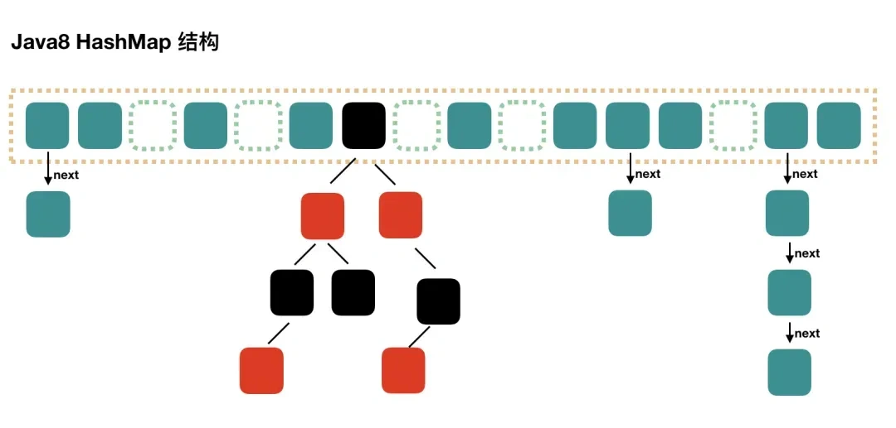

## Collection

Collection接口没有直接的实现子类，是通过它的子接口Set、List和Queue实现的


### List

有序，可重复，支持索引，常用的有ArrayList，LinkedList，Vector，Stack

#### ArrayList

基本等同于Vector，效率高，但是**线程不安全**

底层是`Object[]` 数组


和数组区别？

1. 大小和自动扩容
2. 支持泛型
3. 存储对象
4. 集合功能


**扩容机制：**

以无参数构造方法创建 `ArrayList` 时，实际上初始化赋值的是一个空数组。当真正对数组进行添加元素操作时，才真正分配容量。即向数组中添加第一个元素时，数组容量扩为 10，到达当前容量后扩容为1.5倍。

如果使用指定大小的构造器，初始容量为指定大小，如果需要扩容则扩容为**1.5倍。**

扩容时创建一个新的更大的数组，将原来数组中的元素逐个复制到新数组中，最后将ArrayList内部指向原数组的引用指向新数组。

#### Vector

Vector 内部是使用对象数组来保存数据，可以根据需要自动的增加容量，当数组已满时，会创建新的数组，并拷贝原有数组数据。

线程同步的，即线程安全, 操作方法带 `synchronized`

|           | 底层结构 | 线程安全 效率  | 扩容机制                                                   |
| --------- | -------- | -------------- | ---------------------------------------------------------- |
| ArrayList | 可变数组 | 不安全，效率高 | 有参扩容1.5倍 <br>无参默认0，第一次扩容为10，后面扩容1.5倍 |
| Vector    | 可变数组 | 安全，效率不高 | 有参扩容2倍<br>无参默认是10，后面扩容2倍                   |


#### LinkedList

同时实现了 List、Queue 和 Deque 接⼝。底层是基于双向链表的。

线程不安全，需要用到 `LinkedList` 的场景几乎都可以使用 `ArrayList` 来代替，并且，性能通常会更好

|            | 底层结构 | 增删效率 | 改查效率 | 线程安全 | 随机访问 | 占用内存 |
| ---------- | -------- | -------- | -------- | -------- | -------- | -------- |
| ArrayList  | 可变数组 | 较低     | 较高     | 不安全   | 支持     | 小       |
| LinkedList | 双向链表 | 较高     | 较低     | 不安全   | 不支持   | 大       |


#### CopyonWriteArraylist

CopyOnWriteArrayList底层也是通过一个数组保存数据，使用volatile关键字修饰数组，保证当前线程对数组对象重新赋值后，其他线程可以及时感知到。

在写入操作时，加了一把互斥锁ReentrantLock以保证线程安全。读是没有加锁的。

```java
public boolean add(E e) {
    synchronized (lock) {
        Object[] es = getArray();
        int len = es.length;
        es = Arrays.copyOf(es, len + 1);
        es[len] = e;
        setArray(es);
        return true;
    }
}
```

写入新元素时，首先会先将原来的数组拷贝一份并且让原来数组的长度+1后就得到了一个新数组，新数组里的元素和旧数组的元素一样并且长度比旧数组多一个长度，然后将新加入的元素放置都在新数组最后一个位置后，用新数组的地址替换掉老数组的地址就能得到最新的数据了。

### Set

Set不允许存在重复的元素，与List不同，set中的元素是无序的。常用的实现有HashSet，LinkedHashSet和TreeSet。

当向Set集合中插入元素时，会先根据元素的hashCode值来确定元素的存储位置，然后再通过equals方法来判断是否已经存在相同的元素，如果存在则不会再次插入，保证了元素的唯一性。

|               | 线程安全 | 底层数据结构 | 应用场景                 |
| ------------- | -------- | ------------ | ------------------------ |
| HashSet       | 不安全   | HashMap      | 无需保证插入取出顺序场景 |
| LinkedHashSet | 不安全   | 链表+哈希表  | 需要保证插入取出顺序场景 |
| TreeSet       | 不安全   | 红黑树       | 元素自定义排序场景       |


#### HashSet

HashSet通过HashMap实现，HashMap的Key即HashSet存储的元素，所有Key都是用相同的Value，一个名为PRESENT的Object类型常量。使用Key保证元素唯一性，但不保证有序性。由于HashSet是HashMap实现的，因此线程不安全。

HashSet如何检查键值重复？`HashSet`的`add()`方法直接调用`HashMap`的`put()`方法：先比较hashcode，如果发现有相同 `hashcode` 值的对象，这时会调用`equals()`方法来检查 `hashcode` 相等的对象是否真的相同。

```java
public HashSet() {
    map = new HashMap<>();
}
```

扩容机制

```
// 第一次添加时，table数组扩容到16，临界值是16*loadFactor(0.75)=12, 如果table数组使用到了临界值，就会扩容2倍，依次类推
1. 添加一个元素时，先得到hash值然后转换为索引值
2. 找到存储数据的table，看索引位置是否有元素
3. 如果没有，直接加入
4. 如果有，调用equals比较，如果相同放弃添加，如果不同添加到最后。equals不能简单的认为是比较内容或是地址，程序员可以进行重写 
5. 在java8中，如果一条链表的元素个数 >= TREEIFY_THRESHOLD(默认8)，并且table大小 >= MIN_TREEIFY_CAPACITY(默认64)，就会进行树化(红黑树)
```

| HashMap              | HashSet              |
| -------------------- | -------------------- |
| 实现Map接口          | 实现Set接口          |
| 存储键值对           | 存储对象             |
| put 添加元素         | add 添加元素         |
| 使用key计算 hashCode | 使用对象计算hashCode |


#### LinkedHashSet

HashSet的子类，底层是一个LinkedHashMap，使用双向链表维护元素插入顺序。


#### TreeSet

底层是TreeMap，红黑树

可以实现排序，构造器可以传入一个比较器（匿名内部类）对TreeSet进行排序


### Queue

`Queue` 是单端队列，`Deque` 是双端队列

| `Queue` 接口 | 抛出异常  | 返回特殊值 |
| ------------ | --------- | ---------- |
| 插入队尾     | add(E e)  | offer(E e) |
| 删除队首     | remove()  | poll()     |
| 查询队首元素 | element() | peek()     |

| `Deque` 接口 | 抛出异常      | 返回特殊值      |
| ------------ | ------------- | --------------- |
| 插入队首     | addFirst(E e) | offerFirst(E e) |
| 插入队尾     | addLast(E e)  | offerLast(E e)  |
| 删除队首     | removeFirst() | pollFirst()     |
| 删除队尾     | removeLast()  | pollLast()      |
| 查询队首元素 | getFirst()    | peekFirst()     |
| 查询队尾元素 | getLast()     | peekLast()      |


#### PriorityQueue

`Object[]` 数组来实现小顶堆。

线程不安全

当没有传入数组容量的时候，默认是11

如果容量小于64时，是按照oldCapacity的2倍方式扩容的；如果容量大于等于64，是按照oldCapacity的1.5倍方式扩容的


#### BlockingQueue

BlockingQueue 主要⽤于在多线程之间安全地传递数据，并提供了阻塞操作，以便在队列为空或队列已满时进⾏ 等待或阻塞

BlockingQueue的实现类：

`ArrayBlockingQueue`：基于数组实现的有界队列。

`LinkedBlockingQueue`：基于链表实现的有界或⽆界队列。

`PriorityBlockingQueue`：基于优先级的⽆界队列。

`DelayQueue`：⽤于实现延迟任务的⽆界队列。


#### DelayQueue

`DelayQueue` 底层是使用优先队列 `PriorityQueue` 来存储元素，而 `PriorityQueue` 采用二叉小顶堆的思想确保值小的元素排在最前面，这就使得 `DelayQueue` 对于延迟任务优先级的管理就变得十分方便。

`DelayQueue` 为了保证线程安全还用到了可重入锁 `ReentrantLock`,确保单位时间内只有一个线程可以操作延迟队列。

最后，为了实现多线程之间等待和唤醒的交互效率，`DelayQueue` 还用到了 `Condition`，通过 `Condition` 的 `await` 和 `signal` 方法完成多线程之间的等待唤醒。

#### ArrayDeque

基于动态数组的双端队列。底层使⽤循环数组实现

`ArrayDeque` 是基于可变长的数组和双指针来实现，而 `LinkedList` 则通过链表来实现。

## Map

主要实现有TreeMap、HashMap、HashTable、LinkedHashMap、ConcurrentHashMap


### HashMap

线程不安全，保证线程安全就选用 `ConcurrentHashMap`。

`HashMap` 可以存储 null 的 key 和 value，通常情况下，HashMap 进行 put 或者 get 操作，可以达到常数时间的性能，所以它是绝大部分利用键值对存取场景的首选。

JDK1.8 之前 `HashMap` 由数组+链表组成的，数组是 `HashMap` 的主体，链表则是主要为了解决哈希冲突而存在的（“拉链法”解决冲突）。


JDK1.8 以后在解决哈希冲突时有了较大的变化，当链表长度大于阈值（默认为 8）（将链表转换成红黑树前会判断，如果当前数组的长度小于 64，那么会选择先进行数组扩容，而不是转换为红黑树）时，将链表转化为红黑树，以减少搜索时间。



`HashMap` 默认的初始化大小为 16。到达临界值（临界值是16*loadFactor(0.75)=12）之后，容量变为原来的 2 倍。并且， `HashMap` 总是使用 2 的幂作为哈希表的大小。初始化传的不是2的幂时，会向上寻找离得近的2的幂作为初始化大小。


**`HashMap` 的长度是 2 的幂次方的原因：**

1. 位运算效率更高：位运算(&)比取余运算(%)更高效。当长度为 2 的幂次方时，`hash % length` 等价于 `hash & (length - 1)`。
2. 可以更好地保证哈希值的均匀分布：扩容之后，在旧数组元素 hash 值比较均匀的情况下，新数组元素也会被分配的比较均匀，最好的情况是会有一半在新数组的前半部分，一半在新数组后半部分。
3. 扩容机制变得简单和高效：扩容后只需检查哈希值高位的变化来决定元素的新位置，要么位置不变（高位为 0），要么就是移动到新位置（高位为 1，原索引位置+原容量）。


**HashMap为什么线程不安全？**

死循环和数据丢失

1. JDK1.7中的 HashMap 使用头插法插入元素，在多线程的环境下，扩容的时候有可能导致环形链表的出现，形成死循环。因此，JDK1.8使用尾插法插入元素，在扩容时会保持链表元素原本的顺序，不会出现环形链表的问题。[JDK 1.7 hashmap循环链表的产生（图文并茂，巨详细）_hashmap循环链表是如何产生的-CSDN博客](https://blog.csdn.net/qq_44833552/article/details/125575981)

2. 多个线程对 `HashMap` 的 `put` 操作会有数据覆盖的风险。并发环境下，推荐使用 `ConcurrentHashMap` 。


**添加元素的流程**：

1. 根据要添加的键的哈希码计算在数组中的位置（索引）。 (n - 1) & hash 
2. 检查该位置是否为空（即没有键值对存在）。如果为空，则直接在该位置创建一个新的Entry对象来存储键值对。将要添加的键值对作为该Entry的键和值，并保存在数组的对应位置。
3. 如果该位置已经存在其他键值对，检查该位置的第一个键值对的哈希码和键是否与要添加的键值对相同。如果相同，则表示找到了相同的键，直接将新的值替换旧的值，完成更新操作。
4. 如果第一个键值对的哈希码和键不相同，则需要遍历链表或红黑树来查找是否有相同的键：如果键值对集合是链表结构，从链表的头部开始逐个比较键的哈希码和equals()方法，直到找到相同的键或达到链表末尾。如果键值对集合是红黑树结构，在红黑树中使用哈希码和equals()方法进行查找。根据键的哈希码，定位到红黑树中的某个节点，然后逐个比较键，直到找到相同的键或达到红黑树末尾。
5. 检查链表长度是否达到阈值（默认为8）。如果链表长度超过阈值，且HashMap的数组长度大于等于64，则会将链表转换为红黑树。
6. 检查负载因子是否超过阈值（默认为0.75）。如果键值对的数量（size）与数组的长度的比值大于阈值，则需要进行扩容操作。
7. 扩容操作：1. 创建一个新的两倍大小的数组。2. 将旧数组中的键值对重新计算哈希码并分配到新数组中的位置。3. 更新HashMap的数组引用和阈值参数。


**扩容机制**：

hashMap默认的负载因子是0.75，即如果hashmap中的元素个数超过了总容量75%，则会触发扩容，扩容分为两个步骤：

1. 对哈希表长度的扩展（2倍）；

2. 将旧哈希表中的数据放到新的哈希表中。

因为我们使用的是2次幂的扩展(指长度扩为原来2倍)，所以，元素的位置要么是在原位置，要么是在原位置再移动2次幂的位置。

因此，我们在扩充HashMap的时候，不需要重新计算hash，只需要看看原来的hash值新增的那个bit是1还是0就好了，是0的话索引没变，是1的话索引变成“原索引+oldCap”。


**hashmap key可以为null吗？**

可以为 null。

hashMap中使用hash()方法来计算key的哈希值，当key为空时，直接另key的哈希值为0，不走key.hashCode()方法；

```java
static final int hash(Object key) {
    int h;
    return (key == null) ? 0 : (h = key.hashCode()) ^ (h >>> 16);
}
```


### ConcurrentHashMap

在 JDK 1.7 中，提供了一种机制叫分段锁。整个哈希表被分为多个段，每个段都独立锁定。

一个 ConcurrentHashMap 里包含一个 Segment 数组，Segment 的结构和 HashMap 类似，是一种数组和链表结构，一个 Segment 里包含一个 HashEntry 数组，每个 HashEntry 是一个链表结构的元素，每个 Segment 守护着一个 HashEntry 数组里的元素，当对 HashEntry 数组的数据进行修改时，必须首先获得它对应的 Segment 锁（使用ReentrantLock）。


Segment 的个数一旦初始化就不能改变，默认 Segment 的个数是 16 个，可以认为 `ConcurrentHashMap` 默认支持最多 16 个线程并发。


在JDK1.8中，ConcurrentHashMap的实现原理摒弃了分段锁，而是选择了与HashMap类似的数组+链表+红黑树的方式实现，以某个位置的头结点（链表的头结点或红黑树的 root 结点）为锁，加锁则采用CAS和synchronized实现。

添加元素时首先会判断容器是否为空：

- 如果为空则使用 volatile 加 CAS 来初始化
- 如果容器不为空，则根据存储的元素计算该位置是否为空。
  - 如果根据存储的元素计算结果为空，则利用 CAS 设置该节点；
  - 如果根据存储的元素计算结果不为空，则使用 synchronized ，然后，遍历桶中的数据，并替换或新增节点到桶中，最后再判断是否需要转为红黑树，这样就能保证并发访问时的线程安全了。


ConcurrentHashMap 为什么 key 和 value 不能为 null？

`ConcurrentHashMap` 的 key 和 value 不能为 null 主要是为了避免二义性。null 是一个特殊的值，表示没有对象或没有引用。如果你用 null 作为键，那么你就无法区分这个键是否存在于 `ConcurrentHashMap` 中，还是根本没有这个键。同样，如果你用 null 作为值，那么你就无法区分这个值是否是真正存储在 `ConcurrentHashMap` 中的，还是因为找不到对应的键而返回的。


### LinkedHashMap

`LinkedHashMap` 继承自 `HashMap`，所以它的底层仍然是基于拉链式散列结构即由数组和链表或红黑树组成。另外，`LinkedHashMap` 在上面结构的基础上，增加了一条双向链表，使得上面的结构可以保持键值对的插入顺序。同时通过对链表进行相应的操作，实现了访问顺序相关逻辑。

LRU缓存：

1. 继承 `LinkedHashMap`;

2. 构造方法中指定 `accessOrder` 为 true ，这样在访问元素时就会把该元素移动到链表尾部，链表首元素就是最近最少被访问的元素；

3. 重写`removeEldestEntry` 方法，该方法会返回一个 boolean 值，告知 `LinkedHashMap` 是否需要移除链表首元素（缓存容量有限）。

```java
public class LRUCache<K, V> extends LinkedHashMap<K, V> {
    private final int capacity;

    public LRUCache(int capacity) {
        super(capacity, 0.75f, true);
        this.capacity = capacity;
    }

    /**
     * 判断size超过容量时返回true，告知LinkedHashMap移除最老的缓存项(即链表的第一个元素)
     */
    @Override
    protected boolean removeEldestEntry(Map.Entry<K, V> eldest) {
        return size() > capacity;
    }
}
```

```java
LRUCache<Integer, String> cache = new LRUCache<>(3);
cache.put(1, "one");
cache.put(2, "two");
cache.put(3, "three");
cache.put(4, "four");
cache.put(5, "five");
for (int i = 1; i <= 5; i++) {
    System.out.println(cache.get(i));
}
```


### Hashtable

Hashtable的底层数据结构主要是数组加上链表，数组是主体，链表是解决hash冲突存在的。

键和值都不能为null

使用方法基本和HashMap一样

Hashtable是线程安全的，通过在每个⽅法上添加 synchronized 关键字来实现的，但这也可能导致性能下降。

|                   | 线程安全   | 效率                   | 对null key/value的支持 | 扩容机制                               | 底层数据结构            |
| ----------------- | ---------- | ---------------------- | ---------------------- | -------------------------------------- | ----------------------- |
| HashMap           | 线程不安全 | 高                     | 允许                   | 默认初始化大小16，每次扩容为原来的2倍  | 数组+链表+红黑树        |
| HashTable         | 线程安全   | 基本被淘汰，不建议使用 | 不允许                 | 默认初始化大小11，每次扩容为原来的2n+1 | 数组+链表，没有树化机制 |
| ConcurrentHashMap | 线程安全   | 高                     | 不允许                 | 2倍扩容                                | 数组+链表+红黑树        |


### TreeMap

TreeMap 则是基于红黑树的一种提供顺序访问的 Map，和 HashMap 不同，它的 get、put、remove 之类操作都是 O（log(n)）的时间复杂度。

实现 `NavigableMap` 接口让 `TreeMap` 有了对集合内元素的搜索的能力。

`NavigableMap` 接口提供了丰富的方法来探索和操作键值对:

1. **定向搜索**: `ceilingEntry()`, `floorEntry()`, `higherEntry()`和 `lowerEntry()` 等方法可以用于定位大于、小于、大于等于、小于等于给定键的最接近的键值对。
2. **子集操作**: `subMap()`, `headMap()`和 `tailMap()` 方法可以高效地创建原集合的子集视图，而无需复制整个集合。
3. **逆序视图**:`descendingMap()` 方法返回一个逆序的 `NavigableMap` 视图，使得可以反向迭代整个 `TreeMap`。
4. **边界操作**: `firstEntry()`, `lastEntry()`, `pollFirstEntry()`和 `pollLastEntry()` 等方法可以方便地访问和移除元素。

实现`SortedMap`接口让 `TreeMap` 有了对集合中的元素根据键排序的能力。默认是按 key 的升序排序，不过我们也可以指定排序的比较器。

**相比于`HashMap`来说， `TreeMap` 主要多了对集合中的元素根据键排序的能力以及对集合内元素的搜索的能力。**


**集合框架底层使⽤了什么数据结构？**

1. List接⼝的实现
   1. ArrayList： 基于动态数组实现。底层使⽤数组作为存储结构。 
   2. LinkedList： 基于双向链表实现。底层使⽤节点（Node）连接形成链表结构。 
   3. Vector： 类似于 ArrayList，但是是线程安全的。底层也是使⽤数组实现。 
2. Set接⼝ 
   1. HashSet： 基于哈希表实现。底层使⽤⼀个数组和链表/红⿊树的结构来存储元素。 
   2. LinkedHashSet： 在 HashSet 的基础上加⼊了链表，使得迭代顺序可预测。 
   3. TreeSet： 基于红⿊树实现。底层使⽤⾃平衡的⼆叉搜索树存储元素，以保持有序性。 
3. Queue接⼝ 
   1. LinkedList： 同时实现了 List、Queue 和 Deque 接⼝。底层是基于双向链表的。 
   2. ArrayDeque： 基于动态数组的双端队列。底层使⽤循环数组实现。 
   3. PriorityQueue： 基于优先级堆实现的队列。底层使⽤数组表示的⼆叉堆。
4. Map接⼝ 
   1. HashMap： 基于哈希表实现。底层使⽤⼀个数组和链表/红⿊树的结构来存储键值对。 
   2. LinkedHashMap： 在 HashMap 的基础上加⼊了链表，使得迭代顺序可预测。 
   3. TreeMap： 基于红⿊树实现。底层使⽤⾃平衡的⼆叉搜索树存储键值对，以保持有序性。 
   4. Hashtable： 类似于 HashMap，但是是线程安全的。底层也是使⽤哈希表。

