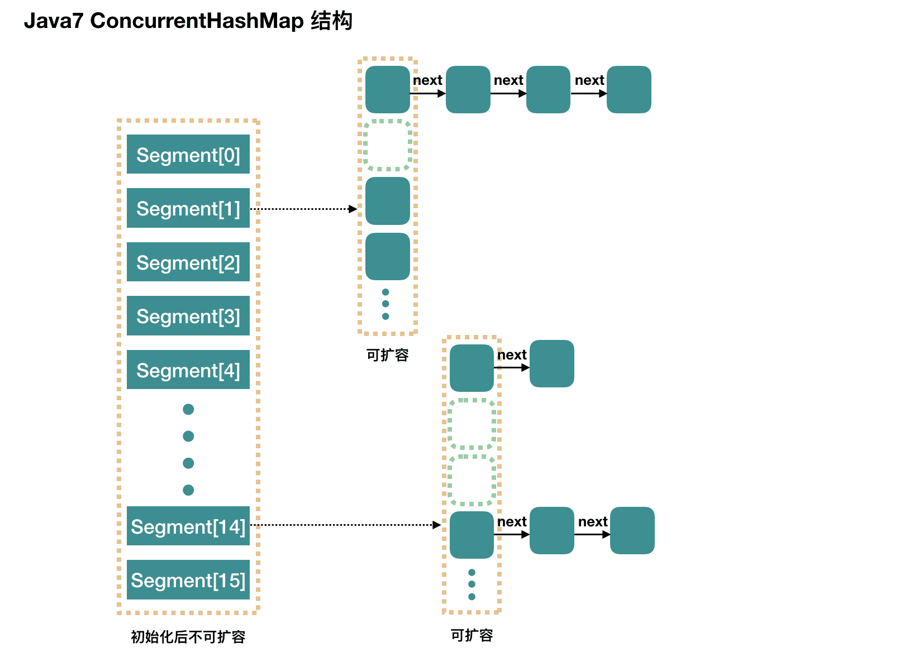

## Collection

Collection接口没有直接的实现子类，是通过它的子接口Set、List和Queue实现的


### List

有序，可重复，支持索引：

`ArrayList`：`Object[]` 数组。

`Vector`：`Object[]` 数组。

`LinkedList`：双向链表。

#### Vector

Vector 内部是使用对象数组来保存数据，可以根据需要自动的增加容量，当数组已满时，会创建新的数组，并拷贝原有数组数据。

**线程安全**, 操作方法带 `synchronized`。

```java
public class Vector<E>
    extends AbstractList<E>
    implements List<E>, RandomAccess, Cloneable, java.io.Serializable
{
    // 数组初始化大小由构造方法中 initialCapacity 参数决定，默认10
    protected Object[] elementData;

    // 数据对象数量
    protected int elementCount;

    // 每次扩容的大小
    // 如果值小于或等于0，则进行两倍扩容
    protected int capacityIncrement;
    
    public Vector(int initialCapacity, int capacityIncrement) {
        super();
        if (initialCapacity < 0)
            throw new IllegalArgumentException("Illegal Capacity: "+
                                               initialCapacity);
        this.elementData = new Object[initialCapacity];
        this.capacityIncrement = capacityIncrement;
    }

    public Vector(int initialCapacity) {
        this(initialCapacity, 0);
    }

    public Vector() {
        this(10);
    }
}
```


**扩容**：

1. 在当前Vector集合中的数据对象总量超出数组容量上限时，会进行扩容操作。
2. 当调用者明确要求重新确认Vector集合容量时，也可能会进行扩容操作（容量值大于当前Vector集合的容量值）。

```java
private void grow(int minCapacity) {
    // overflow-conscious code
    int oldCapacity = elementData.length;
    int newCapacity = oldCapacity + ((capacityIncrement > 0) ?
                                     capacityIncrement : oldCapacity);
    if (newCapacity - minCapacity < 0)
        newCapacity = minCapacity;
    if (newCapacity - MAX_ARRAY_SIZE > 0)
        newCapacity = hugeCapacity(minCapacity);
    elementData = Arrays.copyOf(elementData, newCapacity);
}
```

如果当前Vector集合没有指定增量capacityIncrement的值，那么在一般情况下，每次扩容增加的容量都是当前容量的1倍；

如果当前Vector集合在实例化时指定了增量capacityIncrement的值，那么在一般情况下，会按照指定的增量capacityIncrement的值进行扩容操作。

#### Stack

Stack集合继承自Vector集合。

Stack集合的内部结构仍然是一个数组，使用数组的尾部模拟栈结构的栈顶。


#### ArrayList

与Vector集合类似的接口和操作逻辑，效率高，但是**线程不安全**

`ArrayList` 的底层是数组队列，相当于动态数组。与 Java 中的数组相比，它的容量能动态增长。在添加大量元素前，应用程序可以使用`ensureCapacity`操作来增加 `ArrayList` 实例的容量。

```java
public class ArrayList<E> extends AbstractList<E>
        implements List<E>, RandomAccess, Cloneable, java.io.Serializable
{

    // 默认初始化容量
    private static final int DEFAULT_CAPACITY = 10;

    // 初始化集合时使用，将 elementData 数组初始化为一个空数组
    private static final Object[] EMPTY_ELEMENTDATA = {};

    // 第一次添加数据时使用，默认情况下用于第一次扩容的判定依据
    private static final Object[] DEFAULTCAPACITY_EMPTY_ELEMENTDATA = {};

    transient Object[] elementData; // non-private to simplify nested class access

    // 容量
    private int size;
    
    public ArrayList(int initialCapacity) {
        if (initialCapacity > 0) {
            this.elementData = new Object[initialCapacity];
        } else if (initialCapacity == 0) {
            this.elementData = EMPTY_ELEMENTDATA;
        } else {
            throw new IllegalArgumentException("Illegal Capacity: "+
                                               initialCapacity);
        }
    }

    /**
     * Constructs an empty list with an initial capacity of ten.
     */
    public ArrayList() {
        this.elementData = DEFAULTCAPACITY_EMPTY_ELEMENTDATA;
    }
}
```

如果在进行初始化时不指定ArrayList集合的容量，那么ArrayList集合会被初始化成一个容量为0的集合，后续在向ArrayList集合添加新数据对象时，无论是使用add(E)方法，还是使用add(int, E) 方法（或其他方法），ArrayList集合都会使用grow(int)方法将elementData数组扩容成一个新的容量为10的数组。


**扩容**：

由于一个数组在完成初始化后，其容量不能改变。因此ArrayList集合实际的扩容机制是通过某种规则创建一个容量更大的数组，并且按照一定的逻辑将原数组中的数据对象依次复制（引用）到新的数组中。

```java
private Object[] grow(int minCapacity) {
    int oldCapacity = elementData.length;
    // 条件成立，1.5倍扩容
    if (oldCapacity > 0 || elementData != DEFAULTCAPACITY_EMPTY_ELEMENTDATA) {
        int newCapacity = ArraysSupport.newLength(oldCapacity,
                minCapacity - oldCapacity, /* minimum growth */
                oldCapacity >> 1           /* preferred growth */);
        return elementData = Arrays.copyOf(elementData, newCapacity);
    } else {
        // 当前数组为0，取最大值作为容量
        return elementData = new Object[Math.max(DEFAULT_CAPACITY, minCapacity)];
    }
}
private Object[] grow() {
    return grow(size + 1);
}
```


|           | 内部结构                                                     | 扩容                                                  | 线程安全           |
| --------- | ------------------------------------------------------------ | ----------------------------------------------------- | ------------------ |
| Vector    | 数组，初始化容量默认10                                       | 默认采用2倍扩容，而且可以指定一个固定的扩容增量       | 安全，synchronized |
| ArrayList | 数组，没有指定初始化容量值，elementData数组会被初始化为一个容量值为0的空数组 | 扩容前容量值小于10，则首先扩容到10；否则进行1.5倍扩容 | 不安全             |


#### LinkedList

LinkedList集合同时实现了List接口和Queue接口，主要结构是双向链表，不要求有连续的内存存储地址。

```java
public class LinkedList<E>
    extends AbstractSequentialList<E>
    implements List<E>, Deque<E>, Cloneable, java.io.Serializable
{
    // 链表长度
    transient int size = 0;
    // 头节点
    transient Node<E> first;
	// 尾节点
    transient Node<E> last;
    
    private static class Node<E> {
        E item;
        Node<E> next;
        Node<E> prev;

        Node(Node<E> prev, E element, Node<E> next) {
            this.item = element;
            this.next = next;
            this.prev = prev;
        }
    }
}
```


### Set

Set不允许存在重复的元素，与List不同，set中的元素是无序的：

`HashSet`(无序，唯一): 基于 `HashMap` 实现的，底层采用 `HashMap` 来保存元素。

`LinkedHashSet`: `LinkedHashSet` 是 `HashSet` 的子类，并且其内部是通过 `LinkedHashMap` 来实现的。

`TreeSet`(有序，唯一): 红黑树(自平衡的排序二叉树)。

当向Set集合中插入元素时，会先根据元素的hashCode值来确定元素的存储位置，然后再通过equals方法来判断是否已经存在相同的元素，如果存在则不会再次插入，保证了元素的唯一性。

|               | 线程安全 | 底层数据结构 | 应用场景                 |
| ------------- | -------- | ------------ | ------------------------ |
| HashSet       | 不安全   | HashMap      | 无需保证插入取出顺序场景 |
| LinkedHashSet | 不安全   | 链表+哈希表  | 需要保证插入取出顺序场景 |
| TreeSet       | 不安全   | 红黑树       | 元素自定义排序场景       |


#### HashSet

HashSet集合的内部结构和HashMap集合的内部结构相同。HashMap集合中K-V键值对节点的Key存储的真实数据，Value使用一个固定对象进行填充，记为“PRESENT”。

```java
public class HashSet<E>
    extends AbstractSet<E>
    implements Set<E>, Cloneable, java.io.Serializable
{

    transient HashMap<E,Object> map;

    // Dummy value to associate with an Object in the backing Map
    static final Object PRESENT = new Object();
    
    public HashSet() {
        map = new HashMap<>();
    }
    
    HashSet(int initialCapacity, float loadFactor, boolean dummy) {
        map = new LinkedHashMap<>(initialCapacity, loadFactor);
    }
}
```


#### LinkedHashSet

LinkedHashSet集合继承自HashSet集合。

```java
public class LinkedHashSet<E>
    extends HashSet<E>
    implements SequencedSet<E>, Cloneable, java.io.Serializable {
	
    // 所有构造方法都调用 HashSet 的构造方法, 参数dummy=true
    public LinkedHashSet(int initialCapacity, float loadFactor) {
        super(initialCapacity, loadFactor, true);
    }

    public LinkedHashSet(int initialCapacity) {
        super(initialCapacity, .75f, true);
    }

    public LinkedHashSet() {
        super(16, .75f, true);
    }

}
```


#### TreeSet

TreeSet集合是一个基于红黑树结构的有序集合，它的内部功能由TreeMap集合实现。

```java
public class TreeSet<E> extends AbstractSet<E>
    implements NavigableSet<E>, Cloneable, java.io.Serializable
{
    
    private transient NavigableMap<E,Object> m;

    // Dummy value to associate with an Object in the backing Map
    private static final Object PRESENT = new Object();

    TreeSet(NavigableMap<E,Object> m) {
        this.m = m;
    }

    public TreeSet() {
        this(new TreeMap<>());
    }

    public TreeSet(Comparator<? super E> comparator) {
        this(new TreeMap<>(comparator));
    }
}
```


### Queue

`PriorityQueue`: `Object[]` 数组来实现小顶堆。

`DelayQueue`:`PriorityQueue`。

`ArrayDeque`: 可扩容动态双向数组	

#### ArrayDeque

底层使⽤循环数组实现。

```java
public class ArrayDeque<E> extends AbstractCollection<E>
                           implements Deque<E>, Cloneable, Serializable
{
    
    transient Object[] elements;
	
    // 头指针
    transient int head;
	// 尾指针
    transient int tail;
    
    public ArrayDeque() {
        elements = new Object[16 + 1];
    }

    public ArrayDeque(int numElements) {
        elements =
            new Object[(numElements < 1) ? 1 :
                       (numElements == Integer.MAX_VALUE) ? Integer.MAX_VALUE :
                       numElements + 1];
    }
}
```


**扩容**：

```java
private void grow(int needed) {
    // overflow-conscious code
    final int oldCapacity = elements.length;
    int newCapacity;
    // 容量小于64则2倍扩容，否则1.5倍扩容
    int jump = (oldCapacity < 64) ? (oldCapacity + 2) : (oldCapacity >> 1);
    if (jump < needed
        || (newCapacity = (oldCapacity + jump)) - MAX_ARRAY_SIZE > 0)
        newCapacity = newCapacity(needed, jump);
    final Object[] es = elements = Arrays.copyOf(elements, newCapacity);
    // Exceptionally, here tail == head needs to be disambiguated
    if (tail < head || (tail == head && es[head] != null)) {
        // 容量增量
        int newSpace = newCapacity - oldCapacity;
        // 将head索引位之后的数据对象复制到从head+newSpace开始的索引上
        System.arraycopy(es, head,
                         es, head + newSpace,
                         oldCapacity - head);
        // 从head开始向后清理数据对象，重新定位head
        for (int i = head, to = (head += newSpace); i < to; i++)
            es[i] = null;
    }
}

```

1. 根据当前集合容量计算新的容量。如果扩容前的容量值较小，则按照扩容前容量值的1倍计算扩容增量值；如果扩容前的容量值较大（超过了64），则按照扩容前容量值的50%计算扩容增量值。
2. 扩容，对原数组进行修正。


#### PriorityQueue

PriorityQueue队列是基于堆结构构建的，具体来说，是基于数组形式的**小顶堆**构建的。

```java
public class PriorityQueue<E> extends AbstractQueue<E>
    implements java.io.Serializable {

    // 默认大小
    private static final int DEFAULT_INITIAL_CAPACITY = 11;

    /**
     * Priority queue represented as a balanced binary heap: the two
     * children of queue[n] are queue[2*n+1] and queue[2*(n+1)].  The
     * priority queue is ordered by comparator, or by the elements'
     * natural ordering, if comparator is null: For each node n in the
     * heap and each descendant d of n, n <= d.  The element with the
     * lowest value is in queue[0], assuming the queue is nonempty.
     */
    transient Object[] queue; // non-private to simplify nested class access

   	// 元素数量
    int size;

    // 比较器
    private final Comparator<? super E> comparator;

    transient int modCount;     // non-private to simplify nested class access
    
    public PriorityQueue() {
        this(DEFAULT_INITIAL_CAPACITY, null);
    }

    public PriorityQueue(int initialCapacity) {
        this(initialCapacity, null);
    }

    public PriorityQueue(Comparator<? super E> comparator) {
        this(DEFAULT_INITIAL_CAPACITY, comparator);
    }

    public PriorityQueue(int initialCapacity,
                         Comparator<? super E> comparator) {
        // Note: This restriction of at least one is not actually needed,
        // but continues for 1.5 compatibility
        if (initialCapacity < 1)
            throw new IllegalArgumentException();
        this.queue = new Object[initialCapacity];
        this.comparator = comparator;
    }
}
```


**扩容**：

```java
private void grow(int minCapacity) {
    int oldCapacity = queue.length;
    // Double size if small; else grow by 50%
    int newCapacity = ArraysSupport.newLength(oldCapacity,
            minCapacity - oldCapacity, /* minimum growth */
            oldCapacity < 64 ? oldCapacity + 2 : oldCapacity >> 1
                                       /* preferred growth */);
    queue = Arrays.copyOf(queue, newCapacity);
}
```

如果容量小于64时，是按照oldCapacity的2倍方式扩容的；如果容量大于等于64，是按照oldCapacity的1.5倍方式扩容的


## Map

`HashMap`：JDK1.8 之前 `HashMap` 由数组+链表组成的，数组是 `HashMap` 的主体，链表则是主要为了解决哈希冲突而存在的（“拉链法”解决冲突）。JDK1.8 以后在解决哈希冲突时有了较大的变化，当链表长度大于阈值（默认为 8）（将链表转换成红黑树前会判断，如果当前数组的长度小于 64，那么会选择先进行数组扩容，而不是转换为红黑树）时，将链表转化为红黑树，以减少搜索时间。

`LinkedHashMap`：`LinkedHashMap` 继承自 `HashMap`，所以它的底层仍然是基于拉链式散列结构即由数组和链表或红黑树组成。另外，`LinkedHashMap` 在上面结构的基础上，增加了一条双向链表，使得上面的结构可以保持键值对的插入顺序。同时通过对链表进行相应的操作，实现了访问顺序相关逻辑。)

`Hashtable`：数组+链表组成的，数组是 `Hashtable` 的主体，链表则是主要为了解决哈希冲突而存在的。

`TreeMap`：红黑树（自平衡的排序二叉树）。


Map集合中可以有成千上万个K-V键值对节点，每一个K-V键值对都使用实现了Map.Entry<K,V>接口的类的对象进行描述。例如，HashMap类中的HashMap.Node类实现Map.Entry<K, V>接口。

```java
public interface Map<K, V> {
    interface Entry<K, V> {

        K getKey();

        V getValue();

        V setValue(V value);
        
        // ...
    }
}
```

主要实现有TreeMap、HashMap、HashTable、LinkedHashMap、ConcurrentHashMap


### TreeMap

TreeMap集合是基于**红黑树**构建的，其集合内的所有K-V键值对节点都是这棵红黑树上的节点，进行节点查询、添加、删除操作时，平均时间复杂度可控制为O(logn)。

相比于`HashMap`来说， `TreeMap` 主要多了对集合中的元素根据键排序的能力以及对集合内元素的搜索的能力。

```java
public class TreeMap<K,V>
    extends AbstractMap<K,V>
    implements NavigableMap<K,V>, Cloneable, java.io.Serializable
{

    @SuppressWarnings("serial") // Conditionally serializable
    private final Comparator<? super K> comparator;

    // 当前TreeMap集合中的根节点
    private transient Entry<K,V> root;

    // 节点数量
    private transient int size = 0;
    
    // comparator 为null，使用key的哈希值进行排序
    public TreeMap() {
        comparator = null;
    }

    public TreeMap(Comparator<? super K> comparator) {
        this.comparator = comparator;
    }
}
```


### HashMap

HashMap集合的主要结构包括一个数组结构、一个链表结构和一个红黑树结构。

HashMap集合的基础结构是一个数组（变量名为table），这个数组的长度最小为16，并且可以以2的幂数进行数组扩容操作。

```java
public class HashMap<K,V> extends AbstractMap<K,V>
    implements Map<K,V>, Cloneable, Serializable {
    // 默认数组初始化容量为16，并且只能以2的幂数进行数组扩容操作
    static final int DEFAULT_INITIAL_CAPACITY = 1 << 4; // aka 16

    // 数组最大容量
    static final int MAXIMUM_CAPACITY = 1 << 30;

    // 默认负载因子
    static final float DEFAULT_LOAD_FACTOR = 0.75f;

    // 树化阈值 链表 -> 红黑树
    static final int TREEIFY_THRESHOLD = 8;

    // 反树化阈值 红黑树 -> 链表
    static final int UNTREEIFY_THRESHOLD = 6;

    // 如果链表长度超过阈值8，且HashMap的数组长度大于等于64，则会将链表转换为红黑树
    static final int MIN_TREEIFY_CAPACITY = 64;

    // 数组
    transient Node<K,V>[] table;

    // 保存当前集合所有键值对节点的引用，可以理解为缓存
    transient Set<Map.Entry<K,V>> entrySet;

    // 节点数量
    transient int size;

    // 扩容阈值, 到达 当前集合容量*threshold 才会扩容数组
    int threshold;

    // 负载因子
    final float loadFactor;
}
```

链表 Node：

```java
static class Node<K,V> implements Map.Entry<K,V> {
    // 哈希值
    final int hash;
    final K key;
    V value;
    // 单向链表next指针
    Node<K,V> next;

    Node(int hash, K key, V value, Node<K,V> next) {
        this.hash = hash;
        this.key = key;
        this.value = value;
        this.next = next;
    }

    public final int hashCode() {
        return Objects.hashCode(key) ^ Objects.hashCode(value);
    }

    public final boolean equals(Object o) {
        if (o == this)
            return true;

        return o instanceof Map.Entry<?, ?> e
                && Objects.equals(key, e.getKey())
                && Objects.equals(value, e.getValue());
    }
}
```

当某个索引位上的链表长度达到指定的阈值（默认为单向链表长度超过8）时，单向链表会转化为红黑树；当红黑树中的节点足够少（默认为红黑树中的节点数量少于6个）时，红黑树会转换为单向链表。

红黑树 TreeNode：

```java
// LinkedHashMap.Entry 继承 HashMap.Node， 间接继承 Map.Entry
static final class TreeNode<K,V> extends LinkedHashMap.Entry<K,V> {
    TreeNode<K,V> parent;  // red-black tree links
    TreeNode<K,V> left;
    TreeNode<K,V> right;
    TreeNode<K,V> prev;    // needed to unlink next upon deletion
    // 当前节点是红色还是黑色
    boolean red;
    TreeNode(int hash, K key, V val, Node<K,V> next) {
        super(hash, key, val, next);
    }
}
```


JDK1.8 之前 `HashMap` 由数组+链表组成的，数组是 `HashMap` 的主体，链表则是主要为了解决哈希冲突而存在的（“拉链法”解决冲突）。


JDK1.8 以后在解决哈希冲突时有了较大的变化，当链表长度大于阈值（默认为 8）（将链表转换成红黑树前会判断，如果当前数组的长度小于扩容阈值（默认64），那么会选择先进行数组扩容，而不是转换为红黑树）时，将链表转化为红黑树，以减少搜索时间。


**put**：

```java
public V put(K key, V value) {
	return putVal(hash(key), key, value, false, true);
}

// key=null则返回0，所以HashMap允许key为null的对象
static final int hash(Object key) {
	int h;
	return (key == null) ? 0 : (h = key.hashCode()) ^ (h >>> 16);
}

// onlyIfAbsent：如果值为false，则不更新
final V putVal(int hash, K key, V value, boolean onlyIfAbsent,
               boolean evict) {
    Node<K,V>[] tab; Node<K,V> p; int n, i;
    // 数组为空，先扩容
    if ((tab = table) == null || (n = tab.length) == 0)
        n = (tab = resize()).length;
    // 数组位置上没有节点，直接添加节点
    if ((p = tab[i = (n - 1) & hash]) == null)
        tab[i] = newNode(hash, key, value, null);
    // 已经存在节点
    else {
        Node<K,V> e; K k;
        if (p.hash == hash &&
            ((k = p.key) == key || (key != null && key.equals(k))))
            e = p;
        // 桶中存储的是红黑树，使用红黑树方式添加
        else if (p instanceof TreeNode)
            e = ((TreeNode<K,V>)p).putTreeVal(this, tab, hash, key, value);
        else {
            // 遍历单链表 添加节点
            for (int binCount = 0; ; ++binCount) {
                if ((e = p.next) == null) {
                    p.next = newNode(hash, key, value, null);
                    // 树化：在向单向链表中添加新的节点后，链表中的节点总数大于等于8 且 table数组长度大于64
                    if (binCount >= TREEIFY_THRESHOLD - 1) // -1 for 1st
                        treeifyBin(tab, hash);
                    break;
                }
                if (e.hash == hash &&
                    ((k = e.key) == key || (key != null && key.equals(k))))
                    break;
                p = e;
            }
        }
        // 节点变更操作
        if (e != null) { // existing mapping for key
            V oldValue = e.value;
            if (!onlyIfAbsent || oldValue == null)
                e.value = value;
            afterNodeAccess(e);
            return oldValue;
        }
    }
    ++modCount;
    // 添加节点后，节点数大于阈值，则扩容
    if (++size > threshold)
        resize();
    afterNodeInsertion(evict);
    return null;
}
```


**树化**：

```java
final void treeifyBin(Node<K,V>[] tab, int hash) {
    int n, index; Node<K,V> e;
    // 数组大小小于MIN_TREEIFY_CAPACITY（64）, 不会进行树化，进行扩容操作
    if (tab == null || (n = tab.length) < MIN_TREEIFY_CAPACITY)
        resize();
    else if ((e = tab[index = (n - 1) & hash]) != null) {
        TreeNode<K,V> hd = null, tl = null;
        // 遍历单链表节点 创建对应的TreeNode节点，这时还没有构成红黑树，首先构成一个双链表结构
        do {
            TreeNode<K,V> p = replacementTreeNode(e, null);
            if (tl == null)
                hd = p;
            else {
                p.prev = tl;
                tl.next = p;
            }
            tl = p;
        } while ((e = e.next) != null);
        if ((tab[index] = hd) != null)
            // 进行红黑树转换
            hd.treeify(tab);
    }
}
```


**扩容**：

什么时候扩容？

1. 当table数组为null或长度为0时，需要进行扩容操作。
2. 在添加新的K-V键值对节点后，当HashMap集合中K-V键值对节点的数量即将超过扩容阈值时，需要进行扩容操作。

扩容过程：

1. 根据当前HashMap集合的情况，确认HashMap集合新的容量值和新的扩容门槛值，创建新的table。一般情况下2倍扩容。
2. 将旧数组的元素整理到新数组中。因为我们使用的是2次幂的扩展，所以，元素的位置要么是在原位置，要么是在原位置再移动2次幂的位置。因此，我们在扩充HashMap的时候，不需要重新计算hash，只需要看看原来的hash值新增的那个bit是1还是0就好了，是0的话索引没变，是1的话索引变成“原索引+oldCap”。


**添加元素的流程**：

1. 根据要添加的键的哈希码计算在数组中的位置（索引）。 (n - 1) & hash 
2. 检查该位置是否为空（即没有键值对存在）。如果为空，则直接在该位置创建一个新的Entry对象来存储键值对。
3. 如果该位置已经存在其他键值对，检查该位置的第一个键值对的哈希码和键是否与要添加的键值对相同。如果相同，则表示找到了相同的键，直接将新的值替换旧的值，完成更新操作。
4. 如果第一个键值对的哈希码和键不相同，则需要遍历链表或红黑树来查找是否有相同的键：如果键值对集合是链表结构，从链表的头部开始逐个比较键的哈希码和equals()方法，直到找到相同的键或达到链表末尾。如果键值对集合是红黑树结构，在红黑树中使用哈希码和equals()方法进行查找。根据键的哈希码，定位到红黑树中的某个节点，然后逐个比较键，直到找到相同的键或达到红黑树末尾。
5. 检查链表长度是否达到阈值（默认为8）。如果链表长度超过阈值，且HashMap的数组长度大于等于64，则会将链表转换为红黑树。
6. 检查元素个数是否大于扩容阈值，是则需要进行扩容操作。
7. 扩容操作：1. 创建一个新的两倍大小的数组。2. 将旧数组中的键值对重新计算哈希码并分配到新数组中的位置。3. 更新HashMap的数组引用和阈值参数。


**`HashMap` 的长度是 2 的幂次方的原因：**

1. 位运算效率更高：位运算(&)比取余运算(%)更高效。当长度为 2 的幂次方时，`hash % length` 等价于 `hash & (length - 1)`。
2. 可以更好地保证哈希值的均匀分布：扩容之后，在旧数组元素 hash 值比较均匀的情况下，新数组元素也会被分配的比较均匀，最好的情况是会有一半在新数组的前半部分，一半在新数组后半部分。
3. 扩容机制变得简单和高效：扩容后只需检查哈希值高位的变化来决定元素的新位置，要么位置不变（高位为 0），要么就是移动到新位置（高位为 1，原索引位置+原容量）。


### LinkedHashMap

`LinkedHashMap` 继承自 `HashMap`，所以它的底层仍然是基于拉链式散列结构即由数组和链表或红黑树组成。

另外，`LinkedHashMap` 在 `HashMap`的基础上，增加了一条双向链表，使得上面的结构可以保持键值对的插入顺序，同时通过对链表进行相应的操作，实现了访问顺序相关逻辑。

```java
public class LinkedHashMap<K,V>
    extends HashMap<K,V>
    implements SequencedMap<K,V>
{

    static class Entry<K,V> extends HashMap.Node<K,V> {
        Entry<K,V> before, after;
        Entry(int hash, K key, V value, Node<K,V> next) {
            super(hash, key, value, next);
        }
    }
	// 双向链表头节点引用
    transient LinkedHashMap.Entry<K,V> head;
	// 尾节点
    transient LinkedHashMap.Entry<K,V> tail;

    // 如果为true，节点按照最近被操作的顺序进行排序
    final boolean accessOrder;
}
```


LRU缓存：

1. 继承 `LinkedHashMap`;

2. 构造方法中指定 `accessOrder` 为 true ，这样在访问元素时就会把该元素移动到链表尾部，链表首元素就是最近最少被访问的元素；

3. 重写`removeEldestEntry` 方法，该方法会返回一个 boolean 值，告知 `LinkedHashMap` 是否需要移除链表首元素（缓存容量有限）。

```java
public class LRUCache<K, V> extends LinkedHashMap<K, V> {
    private final int capacity;

    public LRUCache(int capacity) {
        super(capacity, 0.75f, true);
        this.capacity = capacity;
    }

    /**
     * 判断size超过容量时返回true，告知LinkedHashMap移除最老的缓存项(即链表的第一个元素)
     */
    @Override
    protected boolean removeEldestEntry(Map.Entry<K, V> eldest) {
        return size() > capacity;
    }
}
```

```java
LRUCache<Integer, String> cache = new LRUCache<>(3);
cache.put(1, "one");
cache.put(2, "two");
cache.put(3, "three");
cache.put(4, "four");
cache.put(5, "five");
for (int i = 1; i <= 5; i++) {
    System.out.println(cache.get(i));
}
```


## 线程安全集合

### CopyOnWriteArrayList

Copy On Write的字面意思是写时复制。当进行指定数据的写操作时，为了不影响其他线程同时在进行的集合数据读操作，可以使用如下策略：在进行写操作前，首先复制一个数据副本，并且在数据副本中进行写操作；在副本中完成写操作后，将当前数据替换成副本数据。

CopyOnWriteArrayList集合适合用于读操作远远多于写操作，并且在使用时需要保证集合读操作性能的多线程场景。

```java
 public class CopyOnWriteArrayList<E>
     implements List<E>, RandomAccess, Cloneable, java.io.Serializable {
     private static final long serialVersionUID = 8673264195747942595L;

     /** 对所有的修改器方法进行保护，访问器方法并不需要保护 */
     final transient ReentrantLock lock = new ReentrantLock();

     /** 内部对象数组，通过 getArray/setArray方法访问 */
     private transient volatile Object[] array;

     /**
      *获取内部对象数组
      */
     final Object[] getArray() {
         return array;
     }

     /**
      *设置内部对象数组
      */
     final void setArray(Object[] a) {
         array = a;
     }
  	// 省略其他代码
 }
```

因为CopyOnWriteArrayList集合在进行数据写操作时，会依靠一个副本进行操作，所以不支持必须对原始数据进行操作的功能。例如，不支持在迭代器上进行的数据对象更改操作（使用remove()方法、set()方法和add()方法）

```java
 public boolean add(E e) {
     final ReentrantLock lock = this.lock;
     lock.lock();  // 加锁
     try {
         Object[] elements = getArray();
         int len = elements.length;

           // 复制新数组
         Object[] newElements = Arrays.copyOf(elements, len + 1);  
         newElements[len] = e;
         setArray(newElements);
         return true;
     } finally {
         lock.unlock();  // 释放锁
     }
 }
```

写入操作add()方法在执行时加了独占锁以确保只能一个线程进行写入操作，避免多线程写的时候会复制出多个副本。在每次进行添加操作时，CopyOnWriteArrayList底层都是重新复制一份数组，再往新的数组中添加新元素，待添加完了，再将新的array引用指向新的数组。

### ConcurrentHashMap

 JDK 1.7 以及之前版本中使用Segment（分段锁）技术将数据分成一段一段存储，然后给每一段数据配一把锁，当一个线程占用锁访问其中一段数据的时候，其他段的数据也能被其他线程访问，能够实现真正的并发访问。

一个ConcurrentHashMap中包含一个Segment数组，一个Segment中包含一个HashEntry数组，每个元素是一个链表结构（一个Hash表的桶）。



Segment 的个数一旦初始化就不能改变，默认 Segment 的个数是 16 个，可以认为 `ConcurrentHashMap` 默认支持最多 16 个线程并发。

```java
public class ConcurrentHashMap<K, V> extends AbstractMap<K, V>
        implements ConcurrentMap<K, V>, Serializable {
    
    // 分段锁的最大数量
    static final int MAX_SEGMENTS = 1 << 16; 

    // 分段锁的最小数量
    static final int RETRIES_BEFORE_LOCK = 2;
    
    // 分段锁数组
    final Segment<K,V>[] segments;
    
    // Segment继承了ReentrantLock，所以一个段又是一个ReentrantLock
    static final class Segment<K,V> extends ReentrantLock implements Serializable {
 		static final int MAX_SCAN_RETRIES =Runtime.getRuntime().availableProcessors() > 1 ? 64 : 1;
 		transient volatile HashEntry<K,V>[] table;
		transient int count;
 		transient int modCount;

 		transient int threshold;
 		final float loadFactor;
    }
    
    static final class HashEntry<K,V> {
        final int hash;
        final K key;
        volatile V value;
        volatile HashEntry<K,V> next;
    }
}
```

```java
final V put(K key, int hash, V value, boolean onlyIfAbsent) {
    // 获取 ReentrantLock 独占锁，获取不到，scanAndLockForPut 获取。
    HashEntry<K,V> node = tryLock() ? null : scanAndLockForPut(key, hash, value);
    V oldValue;
    try {
        HashEntry<K,V>[] tab = table;
        // 计算要put的数据位置
        int index = (tab.length - 1) & hash;
        // CAS 获取 index 坐标的值
        HashEntry<K,V> first = entryAt(tab, index);
        for (HashEntry<K,V> e = first;;) {
            if (e != null) {
                // 检查是否 key 已经存在，如果存在，则遍历链表寻找位置，找到后替换 value
                K k;
                if ((k = e.key) == key ||
                    (e.hash == hash && key.equals(k))) {
                    oldValue = e.value;
                    if (!onlyIfAbsent) {
                        e.value = value;
                        ++modCount;
                    }
                    break;
                }
                e = e.next;
            }
            else {
                // first 有值没说明 index 位置已经有值了，有冲突，链表头插法。
                if (node != null)
                    node.setNext(first);
                else
                    node = new HashEntry<K,V>(hash, key, value, first);
                int c = count + 1;
                // 容量大于扩容阀值，小于最大容量，进行扩容
                if (c > threshold && tab.length < MAXIMUM_CAPACITY)
                    rehash(node);
                else
                    // index 位置赋值 node，node 可能是一个元素，也可能是一个链表的表头
                    setEntryAt(tab, index, node);
                ++modCount;
                count = c;
                oldValue = null;
                break;
            }
        }
    } finally {
        unlock();
    }
    return oldValue;
}
```


在JDK 1.8中，ConcurrentHashMap已经抛弃了Segment分段锁机制，存储结构采用数组+链表或者红黑树的组合方式，利用**CAS+Synchronized**来保证并发更新的安全。


```java
 public class ConcurrentHashMap<K,V> extends AbstractMap<K,V>
     implements ConcurrentMap<K,V>, Serializable {

     private static final int MAXIMUM_CAPACITY = 1 << 30;
     private static final int DEFAULT_CAPACITY = 16;
     static final int TREEIFY_THRESHOLD = 8;
     static final int UNTREEIFY_THRESHOLD = 6;
     static final int MIN_TREEIFY_CAPACITY = 64;
     //常量：表示正在转移
     static final int MOVED     = -1;
     // 常量：表示已经转换成树
     static final int TREEBIN   = -2; 
     // 常量：hash for transient reservations
     static final int RESERVED  = -3; 
     // 常量：usable bits of normal node hash
     static final int HASH_BITS = 0x7fffffff; 
     //数组，用来保存元素
     transient volatile Node<K,V>[] table;
     //转移时用的数组
     private transient volatile Node<K,V>[] nextTable;
     /**
     * 用来控制表初始化和扩容的控制属性
     */
     private transient volatile int sizeCtl;
     
     //桶的节点放在table中可以作为一个链式的桶
     static class Node<K,V> implements Map.Entry<K,V> {
             final int hash;
             final K key;
             volatile V val;
             volatile Node<K,V> next;
     }
     //桶的树状节点
     static final class TreeNode<K,V> extends Node<K,V> {
             TreeNode<K,V> parent;  // red-black tree links
             TreeNode<K,V> left;
             TreeNode<K,V> right;
             TreeNode<K,V> prev;    // needed to unlink next upon deletion
             boolean red;
     }
     
     //放在table中作为一个链式的桶
     static final class TreeBin<K,V> extends Node<K,V> {
             TreeNode<K,V> root;
             volatile TreeNode<K,V> first;
             volatile Thread waiter;
             volatile int lockState;
      }
 }
```


**put**：

```java
public V put(K key, V value) {
     return putVal(key, value, false);
}

final V putVal(K key, V value, boolean onlyIfAbsent) {
     if (key == null || value == null) throw new NullPointerException();
     int hash = spread(key.hashCode());
     int binCount = 0;
     //自旋：并发情况下，也可以保障安全添加成功
     for (Node<K,V>[] tab = table;;) {
         Node<K,V> f; int n, i, fh;
         if (tab == null || (n = tab.length) == 0)
             //第一次添加，先初始化node数组
             tab = initTable();
         else if ((f = tabAt(tab, i = (n - 1) & hash)) == null) {
             //计算出table[i]无节点，创建节点
             //使用Unsafe.compareAndSwapObject 原子操作table[i]位置
             //如果为null，就添加新建的node节点，跳出循环
             //反之，再循环进入执行添加操作
             if (casTabAt(tab, i, null,
                          new Node<K,V>(hash, key, value, null)))
                 break;
         }
         else if ((fh = f.hash) == MOVED)
              //如果当前处于转移状态，返回新的tab内部表，然后进入循环执行添加操作
             tab = helpTransfer(tab, f);
         else {

             //在链表或红黑树中追加节点
             V oldVal = null;
             //使用synchronized 对 f 对象加锁
             // f = tabAt(tab, i = (n - 1) & hash) : table[i] 的node对象（桶）
             //注意：这里没用ReentrantLock，而是使用synchronized 进行同步
             //在争用不激烈的场景中，synchronized 的性能和ReentrantLock不相上下
             synchronized (f) {
                 if (tabAt(tab, i) == f) {
                     //在链表上追加节点
                     if (fh >= 0) {
                         binCount = 1;
                         for (Node<K,V> e = f;; ++binCount) {
                             K ek;
                             if (e.hash == hash &&
                                 ((ek = e.key) == key ||
                                  (ek != null && key.equals(ek)))) {
                                 oldVal = e.val;
                                 if (!onlyIfAbsent)
                                     e.val = value;
                                 break;
                             }
                             Node<K,V> pred = e;
                             if ((e = e.next) == null) {
                                 pred.next = new Node<K,V>(hash, key,
                                                           value, null);
                                 break;
                             }
                         }
                     }

                     //在红黑树上追加节点
                     else if (f instanceof TreeBin) {
                         Node<K,V> p;
                         binCount = 2;
                         if ((p = ((TreeBin<K,V>)f).putTreeVal(hash, key,
                                                        value)) != null) {
                             oldVal = p.val;
                             if (!onlyIfAbsent)
                                 p.val = value;
                         }
                     }
                 }
             }

             if (binCount != 0) {
                 //节点数大于临界值，转换成红黑树
                 if (binCount >= TREEIFY_THRESHOLD)
                     treeifyBin(tab, i);
                 if (oldVal != null)
                     return oldVal;
                 break;
             }
         }
     }
     addCount(1L, binCount);
     return null;
 }
```

添加元素时首先会判断容器是否为空：

- 如果为空则使用  volatile  加  CAS  来初始化
- 如果容器不为空，则根据存储的元素计算该位置是否为空。
  - 如果根据存储的元素计算结果为空，则利用  CAS  设置该节点；
  - 如果根据存储的元素计算结果不为空，则使用 synchronized  ，然后，遍历桶中的数据，并替换或新增节点到桶中，最后再判断是否需要转为红黑树，这样就能保证并发访问时的线程安全了。

相当于是ConcurrentHashMap通过对头结点加锁来保证线程安全的，锁的粒度相比 Segment 来说更小。

JDK 1.8版本在使用CAS自旋完成桶的设置时，使用synchronized内置锁保证桶内并发操作的线程安全。尽管对同一个Map操作的线程争用会非常激烈，但是在同一个桶内的线程争用通常不会很激烈，所以使用CAS自旋（简单轻量级锁）、synchronized偏向锁或轻量级锁不会降低ConcurrentHashMap的性能。

为什么不用ReentrantLock显式锁呢？如果为每一个桶都创建一个ReentrantLock实例，就会带来大量的内存消耗，反过来，使用CAS自旋（简单轻量级锁）、synchronized偏向锁或轻量级锁，内存消耗的增加会微乎其微。


### Hashtable

Hashtable的底层数据结构主要是数组加上链表，数组是主体，链表是解决hash冲突存在的。

```java
public class Hashtable<K,V>
    extends Dictionary<K,V>
    implements Map<K,V>, Cloneable, java.io.Serializable {

    /**
     * The hash table data.
     */
    private transient Entry<?,?>[] table;

    /**
     * The total number of entries in the hash table.
     */
    private transient int count;

    /**
     * The table is rehashed when its size exceeds this threshold.  (The
     * value of this field is (int)(capacity * loadFactor).)
     *
     * @serial
     */
    private int threshold;

    /**
     * The load factor for the hashtable.
     *
     * @serial
     */
    private float loadFactor;
    
    private static class Entry<K,V> implements Map.Entry<K,V> {
        final int hash;
        final K key;
        V value;
        Entry<K,V> next;
    }
}
```

键和值都不能为null

使用方法基本和HashMap一样

Hashtable是线程安全的，通过在每个⽅法上添加 synchronized 关键字来实现的，对这个Hash表进行锁定。HashTable的效率非常低下。


### BlockingQueue

阻塞队列接口提供的主要方法：

```java
 public interface BlockingQueue<E> extends Queue<E> {

     //将指定的元素添加到此队列的尾部
     //在成功时返回true，如果此队列已满，就抛出IllegalStateException
     boolean add(E e); 

     //非阻塞式添加：将指定的元素添加到此队列的尾部（如果立即可行且不会超过该队列的容量）
     //如果该队列已满，就直接返回 
     boolean offer(E e)

     //限时阻塞式添加：将指定的元素添加到此队列的尾部
     //如果该队列已满，那么在到达指定的等待时间之前，添加线程会阻塞，等待可用的空间，该方法可中断
     boolean offer(E e, long timeout, TimeUnit unit)
                                                      throws InterruptedException; 

     //阻塞式添加：将指定的元素添加到此队列的尾部，如果该队列已满，就一直等待（阻塞）
     void put(E e) throws InterruptedException; 

     //阻塞式删除：获取并移除此队列的头部，如果没有元素就等待（阻塞） 
     //直到有元素，将唤醒等待线程执行该操作
     E take() throws InterruptedException; 

     //非阻塞式删除：获取并移除此队列的头部，如果没有元素就直接返回null（空）
     E poll() throws InterruptedException; 

     //限时阻塞式删除:获取并移除此队列的头部，在指定的等待时间前一直等待获取元素，超过时间，方法将结束
     E poll(long timeout, TimeUnit unit) throws InterruptedException; 

     //获取但不移除此队列的头元素，没有则抛出异常NoSuchElementException
     E element(); 

     //获取但不移除此队列的头元素，如果此队列为空，就返回null
     E peek(); 

     //从此队列中移除指定元素，返回删除是否成功
     boolean remove(Object o); 

 }
```


BlockingQueue的实现类有ArrayBlockingQueue、LinkedBlockingDeque、PriorityBlockingQueue、DelayQueue、SynchronousQueue等


#### ArrayBlockingQueue

ArrayBlockingQueue队列是一个可循环使用数组空间的有界阻塞队列，使用可复用的环形数组记录数据对象。其内部使用一个takeIndex变量表示队列头部，使用一个putIndex变量表示队列尾部。

```java
public class ArrayBlockingQueue<E> extends AbstractQueue<E>
        implements BlockingQueue<E>, java.io.Serializable {

    /** The queued items */
    final Object[] items;

    // 对头索引
    int takeIndex;

    // 对尾索引
    int putIndex;

   	// 元素数量
    int count;

    // 添加和删除操作共用同一个锁对象
    final ReentrantLock lock;

   	// 对象出队控制
    private final Condition notEmpty;

    // 入队控制
    private final Condition notFull;

    // 迭代器
    transient Itrs itrs = null;
    
    public void put(E e) throws InterruptedException {
        //确保插入的元素不为null
        checkNotNull(e);
        //加锁
        final ReentrantLock lock = this.lock;
        //这里使用lockInterruptibly()方法而不是lock()方法是为了能够响应中断操作，如果在等待获取锁的过程中被打断则该方法会抛出InterruptedException异常。
        lock.lockInterruptibly();
        try {
                //如果count等数组长度则说明队列已满，当前线程将被挂起放到AQS队列中，等待队列非满时插入（非满条件）。
           //在等待期间，锁会被释放，其他线程可以继续对队列进行操作。
            while (count == items.length)
                notFull.await();
               //如果队列可以存放元素，则调用enqueue将元素入队
            enqueue(e);
        } finally {
            //释放锁
            lock.unlock();
        }
    }
    
    public E take() throws InterruptedException {
           //获取锁
         final ReentrantLock lock = this.lock;
         lock.lockInterruptibly();
         try {
                 //如果队列中元素个数为0，则将当前线程打断并存入AQS队列中，等待队列非空时获取并移除元素（非空条件）
             while (count == 0)
                 notEmpty.await();
                //如果队列不为空则调用dequeue获取元素
             return dequeue();
         } finally {
              //释放锁
             lock.unlock();
         }
    }
    
    public boolean offer(E e) {
        //确保插入的元素不为null
        checkNotNull(e);
        //获取锁
        final ReentrantLock lock = this.lock;
        lock.lock();
        try {
             //队列已满直接返回false
            if (count == items.length)
                return false;
            else {
                //反之将元素入队并直接返回true
                enqueue(e);
                return true;
            }
        } finally {
            //释放锁
            lock.unlock();
        }
    }
}
```


为什么ArrayBlockingQueue比LinkedBlockingQueue更加常用？

前者在添加或删除元素时不会产生或销毁任何额外的Node（节点）实例，而后者会生成一个额外的Node实例。在长时间、高并发处理大批量数据的场景中，LinkedBlockingQueue产生的额外Node实例会加大系统的GC压力。


#### LinkedBlockingQueue

```java
public class LinkedBlockingQueue<E> extends AbstractQueue<E>
        implements BlockingQueue<E>, java.io.Serializable {
    
    // 节点
    static class Node<E> {
        E item;

        Node<E> next;

        Node(E x) { item = x; }
    }

    // 容量 默认 Integer.MAX_VALUE
    private final int capacity;

    // 元素数量
    private final AtomicInteger count = new AtomicInteger();

    // 指向头节点，head.item == null
    transient Node<E> head;

	// 尾节点
    private transient Node<E> last;

    // 读锁
    private final ReentrantLock takeLock = new ReentrantLock();

    /** Wait queue for waiting takes */
    private final Condition notEmpty = takeLock.newCondition();

    // 写锁
    private final ReentrantLock putLock = new ReentrantLock();

    /** Wait queue for waiting puts */
    private final Condition notFull = putLock.newCondition();
}
```


#### PriorityBlockingQueue

```java
public class PriorityBlockingQueue<E> extends AbstractQueue<E>
    implements BlockingQueue<E>, java.io.Serializable {
    
    // 默认初始化大小
    private static final int DEFAULT_INITIAL_CAPACITY = 11;

    // 最大容量上限
    private static final int MAX_ARRAY_SIZE = Integer.MAX_VALUE - 8;

    // 小顶堆 数组存储
    private transient Object[] queue;

    // 当前队列大小
    private transient int size;

    private transient Comparator<? super E> comparator;

    /**
     * Lock used for all public operations
     */
    private final ReentrantLock lock;

    /**
     * Condition for blocking when empty
     */
    private final Condition notEmpty;

    // 主要用于队列的扩容过程，保证扩容不会重复进行
    private transient volatile int allocationSpinLock;

    // 用于序列化和反序列化过程，避免多个JDK之间的兼容性问题
    private PriorityQueue<E> q;
}
```


**扩容**：

```java
// 扩容主要由offer()方法进行调用
private void tryGrow(Object[] array, int oldCap) {
    // 释放当前线程获得的锁
    // 改用CAS思想进行扩容
    lock.unlock(); // must release and then re-acquire main lock
    Object[] newArray = null;
    // 将allocationSpinLock 设置为1，保证成功设置allocationSpinLock为1的线程能进行真正的扩容操作
    if (allocationSpinLock == 0 &&
        UNSAFE.compareAndSwapInt(this, allocationSpinLockOffset,
                                 0, 1)) {
        try {
            // 小于64则2倍扩容，否则1.5倍扩容
            int newCap = oldCap + ((oldCap < 64) ?
                                   (oldCap + 2) : // grow faster if small
                                   (oldCap >> 1));
            if (newCap - MAX_ARRAY_SIZE > 0) {    // possible overflow
                int minCap = oldCap + 1;
                if (minCap < 0 || minCap > MAX_ARRAY_SIZE)
                    throw new OutOfMemoryError();
                newCap = MAX_ARRAY_SIZE;
            }
            // 创建数组
            if (newCap > oldCap && queue == array)
                newArray = new Object[newCap];
        } finally {
            allocationSpinLock = 0;
        }
    }
    // 当前线程没有扩容操作权，让出CPU资源
    if (newArray == null) // back off if another thread is allocating
        Thread.yield();
    lock.lock();
    // 实际扩容操作，数组拷贝
    if (newArray != null && queue == array) {
        queue = newArray;
        System.arraycopy(array, 0, newArray, 0, oldCap);
    }
}
```

在进行扩容操作时，需要其他消费者线程继续从队列中取出数据对象，所以扩容操作释放了可重入锁的操作权。

PriorityBlockingQueue队列改用保证原子性的控制来保证同一时间只有一个扩容请求得到实际操作，其他扩容操作请求保持自旋，直到扩容操作结束。关键属性为扩容方法中使用的allocationSpinLock属性。


#### DelayQueue

DelayQueue队列内部使用PriorityQueue队列作为真实的数据对象存储结构。

要放入DelayQueue队列的数据对象，必须实现Delayed接口，这个接口主要规定了进入DelayQueue队列的数据对象需要有怎样的阻塞等待逻辑。

```java
public class DelayQueue<E extends Delayed> extends AbstractQueue<E>
    implements BlockingQueue<E> {

    private final transient ReentrantLock lock = new ReentrantLock();
    
    // 使用 PriorityQueu 队列保证数据对象的排列顺序
    private final PriorityQueue<E> q = new PriorityQueue<E>();

    // 主消费线程用于等待小顶堆第一个数据元素离开队列
    private Thread leader = null;

    private final Condition available = lock.newCondition();
}
```


**take**：

```java
public E take() throws InterruptedException {
    final ReentrantLock lock = this.lock;
    lock.lockInterruptibly();
    try {
        for (;;) {
            E first = q.peek();
            if (first == null)
                available.await();
            else {
                // 1. getDelay 返回一个负数或0，可以直接出队
                long delay = first.getDelay(NANOSECONDS);
                if (delay <= 0)
                    return q.poll();
                // 2. 返回一个正数说明还没到达出队时间，需要阻塞等待
                first = null; // don't retain ref while waiting
                // 该线程一直等待，主消费线程继续处理出队逻辑
                if (leader != null)
                    available.await();
                // 如果当前队列还没有主消费线程，则将该线程设置为主消费线程
                else {
                    Thread thisThread = Thread.currentThread();
                    leader = thisThread;
                    // 主消费线程阻塞等待 delay 时间
                    try {
                        available.awaitNanos(delay);
                    } finally {
                        if (leader == thisThread)
                            leader = null;
                    }
                }
            }
        }
    } finally {
        if (leader == null && q.peek() != null)
            available.signal();
        lock.unlock();
    }
}
```

即使有多个消费者线程同时调用take()方法，也只有一个消费者线程最终移除数据对象。这个最终被允许移除数据对象的消费者线程就是leader消费者线程；

而其他消费者线程就是follower消费者线程（备份消费者线程）。这种逻辑控制方式显然能避免真实移除数据对象的消费者线程频繁切换，从而保证业务逻辑的可理解性。


#### SynchronousQueue
