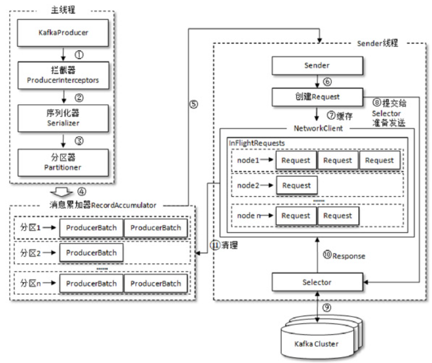
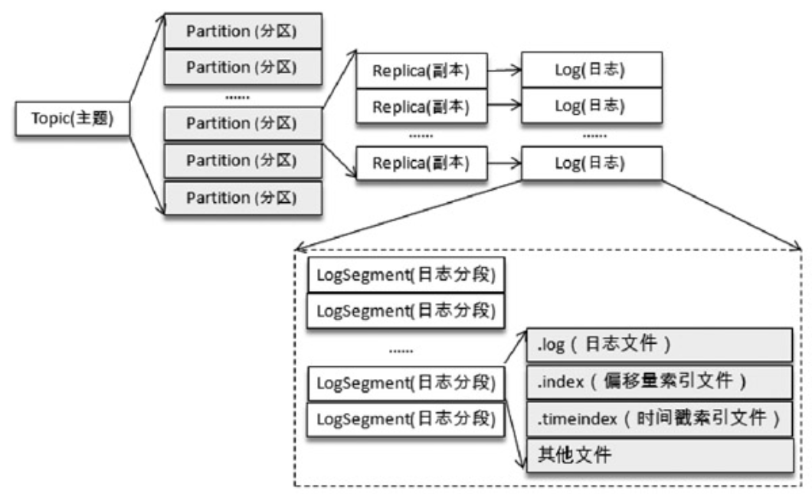
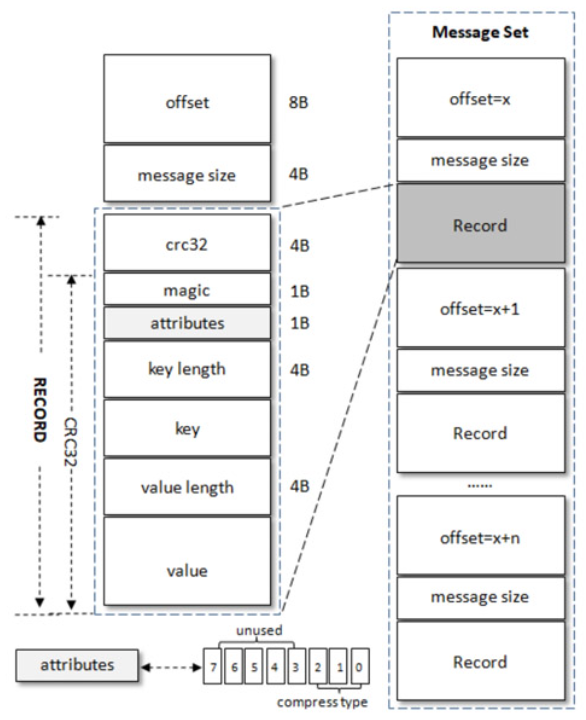
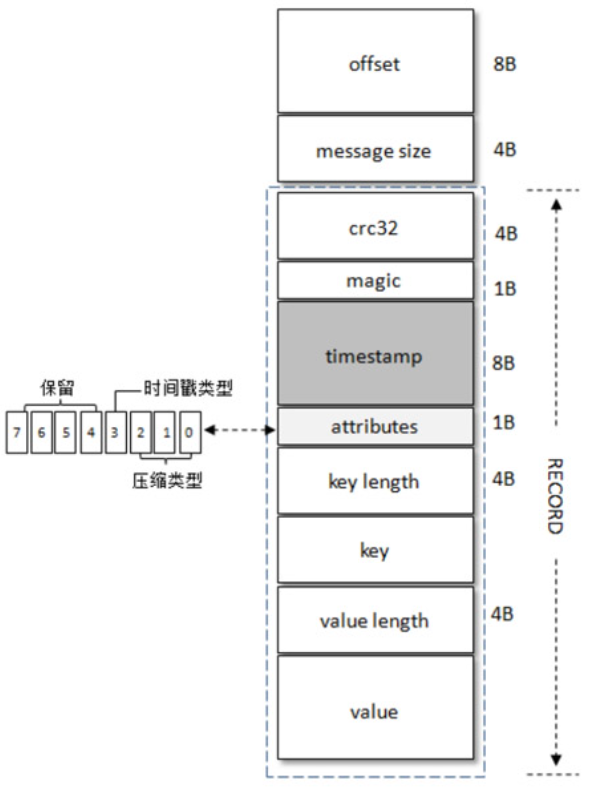
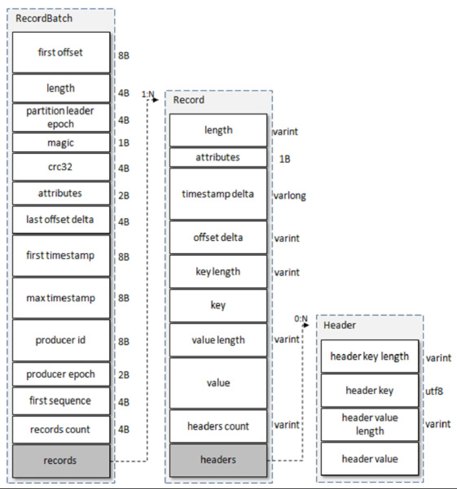
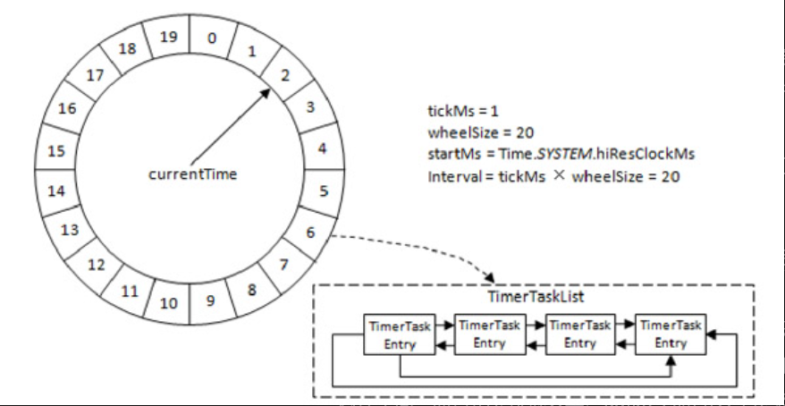

## 生产者

发送消息三种模式：发后即忘（fire-and-forget）、同步（sync）及异步（async）。

KafkaProducer中一般会发生两种类型的异常：可重试的异常和不可重试的异常。

* 常见的可重试异常有：NetworkException、LeaderNotAvailableException、UnknownTopicOrPartitionException、NotEnoughReplicasException、NotCoordinatorException 等。
* 不可重试的异常：RecordTooLargeException异常。

> **拦截器**：Kafka一共有两种拦截器：生产者拦截器和消费者拦截器。生产者拦截器既可以用来在消息发送前做一些准备工作，比如按照某个规则过滤不符合要求的消息、修改消息的内容等，也可以用来在发送回调逻辑前做一些定制化的需求，比如统计类工作。
>
> **序列化器**：消息序列化。
>
> **分区器**：分区器的作用就是为消息分配分区。如果消息ProducerRecord中指定了partition字段，那么就不需要分区器的作用，因为partition代表的就是所要发往的分区号。

整个生产者客户端由两个线程协调运行，这两个线程分别为**主线程和Sender线程（发送线程）**。在主线程中由KafkaProducer创建消息，然后通过可能的拦截器、序列化器和分区器的作用之后缓存到消息累加器（RecordAccumulator，也称为消息收集器）中。

RecordAccumulator 主要用来缓存消息以便 Sender 线程可以批量发送，进而减少网络传输的资源消耗以提升性能。 RecordAccumulator 的内部为每个分区都维护了一个双端队列。

Sender 从 RecordAccumulator 中获取缓存的消息之后，会进一步将原本`＜分区，Deque＜ProducerBatch＞＞`的保存形式转变成`＜Node，List＜ ProducerBatch＞`的形式，其中Node表示Kafka集群的broker节点。对于网络连接来说，生产者客户端是与具体的broker节点建立的连接，也就是向具体的 broker 节点发送消息，而并不关心消息属于哪一个分区；而对于 KafkaProducer的应用逻辑而言，我们只关注向哪个分区中发送哪些消息，所以在这里需要做一个应用逻辑层面到网络I/O层面的转换。

## 消费者

消费者（Consumer）负责订阅Kafka中的主题（Topic），并且从订阅的主题上拉取消息。当消息发布到主题后，只会被投递给订阅它的每个消费组中的一个消费者。如果消费者过多，出现了消费者的个数大于分区个数的情况，就会有消费者分配不到任何分区。

Kafka中的消费是基于**拉模式**的。消息的消费一般有两种模式：推模式和拉模式。推模式是服务端主动将消息推送给消费者，而拉模式是消费者主动向服务端发起请求来拉取消息。

对于Kafka中的分区而言，它的每条消息都有唯一的offset，用来表示消息在分区中对应的位置。对于消费者而言，它也有一个offset的概念，消费者使用offset来表示消费到分区中某个消息所在的位置。

在旧消费者客户端中，**消费位移**是存储在ZooKeeper中的。而在新消费者客户端中，消费位移存储在Kafka内部的**主题__consumer_offsets中**。初始情况下这个主题并不存在，当第一次有消费者消费消息时会自动创建这个主题。

**再均衡**是指分区的所属权从一个消费者转移到另一消费者的行为，它为消费组具备高可用性和伸缩性提供保障，使我们可以既方便又安全地删除消费组内的消费者或往消费组内添加消费者。不过在再均衡发生期间，消费组内的消费者是无法读取消息的。

消费者拦截器主要在消费到消息或在提交消费位移时进行一些定制化的操作。

KafkaProducer是线程安全的，然而KafkaConsumer却是非线程安全的。

多线程实现方式：

* 线程封闭，即为每个线程实例化一个KafkaConsumer对象
* 多个消费线程同时消费同一个分区。极少使用
* 将处理消息模块改成多线程的实现方式

## 主题和分区

从Kafka的底层实现来说，主题和分区都是逻辑上的概念，分区可以有一至多个副本，每个副本对应一个日志文件，每个日志文件对应一至多个日志分段（LogSegment），每个日志分段还可以细分为索引文件、日志存储文件和快照文件等。

为什么分区？

分区的作用就是提供负载均衡的能力，或者说对数据进行分区的主要原因，就是为了实现系统的高伸缩性（Scalability）。不同的分区能够被放置到不同节点的机器上，而数据的读写操作也都是针对分区这个粒度而进行的，这样每个节点的机器都能独立地执行各自分区的读写请求处理。并且，我们还可以通过添加新的节点机器来增加整体系统的吞吐量。

分区策略：

* 轮询
* 随机
* 按消息键保序策略

目前Kafka只支持增加分区数而不支持减少分区数。

为什么不支持减少分区？会使代码的复杂度急剧增大。实现此功能需要考虑的因素很多，比如**删除的分区中的消息该如何处理**？如果随着分区一起消失则消息的可靠性得不到保障；如果需要保留则又需要考虑如何保留。直接存储到现有分区的尾部，消息的时间戳就不会递增，如此对于Spark、Flink这类需要消息时间戳（事件时间）的组件将会受到影响；如果分散插入现有的分区，那么在消息量很大的时候，内部的数据复制会占用很大的资源，而且在复制期间，此主题的可用性又如何得到保障？与此同时，**顺序性问题、事务性问题**，以及分区和副本的状态机切换问题都是不得不面对的。反观这个功能的收益点却是很低的，如果真的需要实现此类功能，则完全可以重新创建一个分区数较小的主题，然后将现有主题中的消息按照既定的逻辑复制过去即可。

## 日志存储

向Log 中追加消息时是顺序写入的

为了便于消息的检索，每个LogSegment中的日志文件（以“.log”为文件后缀）都有对应的两个索引文件：偏移量索引文件（以“.index”为文件后缀）和时间戳索引文件（以“.timeindex”为文件后缀）。

每个LogSegment 都有一个基准偏移量 baseOffset，用来表示当前LogSegment中第一条消息的offset。偏移量是一个64位的长整型数，日志文件和两个索引文件都是根据基准偏移量（baseOffset）命名的，名称固定为20位数字，没有达到的位数则用0填充。比如第一个LogSegment的基准偏移量为0，对应的日志文件为00000000000000000000.log。

### 日志格式

最初的Kafka消息版本中没有timestamp字段，对内部而言，其影响了日志保存、切分策略，对外部而言，其影响了消息审计、端到端延迟、大数据应用等功能的扩展。

v0版本：Kafka 0.10.0之前都采用的这个消息格式

每条消息都有一个offset 用来标志它在分区中的偏移量，这个**offset是逻辑值**，而非实际物理偏移值，message size表示消息的大小，这两者在一起被称为日志头部（LOG_OVERHEAD），固定为12B。

v1版本：0.10.0到0.11.0版本

v1版本的attributes字段中的低3位和v0版本的一样，还是表示压缩类型，而第4个位（bit）也被利用了起来：0表示timestamp类型为CreateTime，而1表示timestamp类型为LogAppendTime，其他位保留。

v2版本：0.11.0版本开始

引入了变长整型（Varints）和ZigZag编码

### 日志索引

**偏移量索引**文件用来建立消息偏移量（offset）到物理地址之间的映射关系，方便快速定位消息所在的物理文件位置；偏移量索引文件中的偏移量是单调递增的，查询指定偏移量时，使用二分查找法来快速定位偏移量的位置。

**时间戳索引**文件则根据指定的时间戳（timestamp）来查找对应的偏移量信息。时间戳也保持严格的单调递增，查询指定时间戳时，也根据二分查找法来查找不大于该时间戳的最大偏移量，至于要找到对应的物理文件位置还需要根据偏移量索引文件来进行再次定位

### 磁盘存储

**顺序追加**

Kafka 在设计时采用了文件追加的方式来写入消息，即只能在日志文件的尾部追加新的消息，并且也不允许修改已写入的消息，这种方式属于典型的顺序写盘的操作。

**页缓存**

当一个进程准备读取磁盘上的文件内容时，操作系统会先查看待读取的数据所在的页（page）是否在页缓存（pagecache）中，如果存在（命中）则直接返回数据，从而避免了对物理磁盘的 I/O 操作；如果没有命中，则操作系统会向磁盘发起读取请求并将读取的数据页存入页缓存，之后再将数据返回给进程。

同样，如果一个进程需要将数据写入磁盘，那么操作系统也会检测数据对应的页是否在页缓存中，如果不存在，则会先在页缓存中添加相应的页，最后将数据写入对应的页。被修改过后的页也就变成了脏页，操作系统会在合适的时间把脏页中的数据写入磁盘，以保持数据的一致性。

不使用进程缓存：

1. Java对象的内存开销非常大，通常会是真实数据大小的几倍甚至更多，空间使用率低下；Java的垃圾回收会随着堆内数据的增多而变得越来越慢。
2. 进程重启缓存会丢失。

**零拷贝**

所谓的零拷贝是指将数据直接从磁盘文件复制到网卡设备中，而不需要经由应用程序之手。零拷贝大大提高了应用程序的性能，减少了内核和用户模式之间的上下文切换

无消息丢失配置怎么实现？

1. 不要使用 producer.send(msg)，而要使用 producer.send(msg, callback)。记住，一定要使用带有回调通知的 send 方法。
2. 设置 acks = all。acks 是 Producer 的一个参数，代表了你对“已提交”消息的定义。如果设置成 all，则表明所有副本 Broker 都要接收到消息，该消息才算是“已提交”。这是最高等级的“已提交”定义。
3. 设置 retries 为一个较大的值。这里的 retries 同样是 Producer 的参数，对应前面提到的 Producer 自动重试。当出现网络的瞬时抖动时，消息发送可能会失败，此时配置了 retries > 0 的 Producer 能够**自动重试消息发送**，避免消息丢失。
4. 设置 unclean.leader.election.enable = false。这是 Broker 端的参数，它控制的是哪些 Broker 有资格竞选分区的 Leader。如果一个 Broker 落后原先的 Leader 太多，那么它一旦成为新的 Leader，必然会造成消息的丢失。故一般都要将该参数设置成 false，即不允许这种情况的发生。
5. 设置 replication.factor >= 3。这也是 Broker 端的参数。其实这里想表述的是，最好将消息多保存几份，毕竟目前防止消息丢失的主要机制就是**冗余**。
6. 设置 min.insync.replicas > 1。这依然是 Broker 端参数，控制的是消息至少要被写入到多少个副本才算是“已提交”。设置成大于 1 可以提升消息持久性。在实际环境中千万不要使用默认值 1。
7. 确保 replication.factor > min.insync.replicas。如果两者相等，那么只要有一个副本挂机，整个分区就无法正常工作了。我们不仅要改善消息的持久性，防止数据丢失，还要在不降低可用性的基础上完成。推荐设置成 replication.factor = min.insync.replicas + 1。
8. 确保消息消费完成再提交。Consumer 端有个参数 enable.auto.commit，最好把它设置成 false，并采用**手动提交位移**的方式。就像前面说的，这对于单 Consumer 多线程处理的场景而言是至关重要的。

## 服务端

Kafka自定义了一组基于TCP的二进制协议

### 时间轮

Kafka中的时间轮（TimingWheel）是一个存储定时任务的环形队列，底层采用数组实现，数组中的每个元素可以存放一个定时任务列表（TimerTaskList）。TimerTaskList是一个环形的双向链表，链表中的每一项表示的都是定时任务项（TimerTaskEntry），其中封装了真正的定时任务（TimerTask）。

> tickMs 基本时间跨度
>
> wheelSize 时间格个数
>
> currentTime 表盘指针

初始情况下表盘指针currentTime指向时间格0，此时有一个定时为2ms的任务插进来会存放到时间格为2的TimerTaskList中。随着时间的不断推移，指针currentTime不断向前推进，过了2ms之后，当到达时间格2时，就需要将时间格2对应的TimeTaskList中的任务进行相应的到期操作。此时若又有一个定时为8ms 的任务插进来，则会存放到时间格 10 中，currentTime再过8ms后会指向时间格10。

如果此时有一个定时为350ms的任务该如何处理？

Kafka 为此引入了层级时间轮的概念，当任务的到期时间超过了当前时间轮所表示的时间范围时，就会尝试添加到上层时间轮中。

Kafka 中的定时器只需持有 TimingWheel 的第一层时间轮的引用，并不会直接持有其他高层的时间轮，但每一层时间轮都会有一个引用（overflowWheel）指向更高一层的引用，以此层级调用可以实现定时器间接持有各个层级时间轮的引用。随着时间的推移，会发生时间轮降级操作，将高层任务重新提交到低层时间轮中。

### 控制器

