# kafka整体架构设计



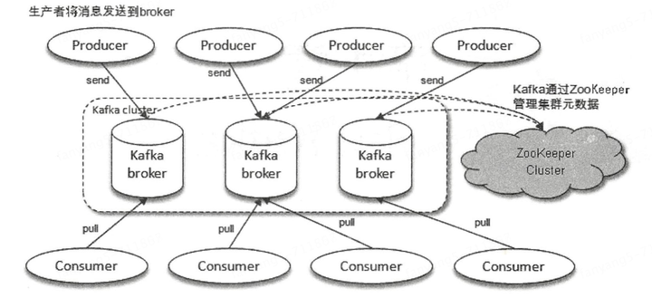


# **生产者**

## **1.消息体**

```java
public class ProducerRecord<K, V> { 
    //消息发往的主题 
    private final String topic;
    //消息发往的分区
    private final Integer partition;
    //头部信息可以用来添加自定义的一些信息，比如消息的版本号之类的  
    private final Headers headers; 
    //key是消息的键
    private final K key; 
    //value是消息真正的值   
    private final V value;  
    //消息的时间戳  
    private final Long timestamp;
 }
```

ProducerRecord类是kafka生产者生发送的消息的类，每个字段的注释简单解释了每个字段的作用，比较重要的字段是topic, partion, value。之后会再详细解释这些字段的作用。这里先有个大概印象，看完之后的内容可以再回看消息的结构体。

## **2.发送消息方式**

kafka有两个发送接口, 两个接口本身都是异步的，但是因为两个接口的返回值都是Future类型的。如果对Future类不太了解，请看 [多线程中Future的用法](https://zhuanlan.zhihu.com/p/364041672)  

public Future<RecordMetadata> send(ProducerRecord<K, V> record)  //仅有返回值的异步方法

public Future<RecordMetadata> send(ProducerRecord<K , V> record , Callback callback)  //既有返回值，也有回调的异步方法

虽然只有两个方法， 但是实际上我们可以有三种发送方式：

**1.发后即忘。**调用发送接口后不管发送结果，不知道有没有发送成功。这种方式只管往kafka中发送消息而不管消息是否成功发送。所以这种方式有可能造成消息的丢失，是发送性能最高，可靠性最差的方式。

**2.同步方式。**调用发送接口，使用返回的Future对象，调用get()方法拿到发送结果。这种方式可靠性很高，要么消息成功发送到kafka中，要么发送异常，交由上层捕获处理，而不会像“发后即忘”的方式一样造成消息的丢失，代价则是每一条消息都需要等待上一条发送完成后才发送下一条，造成发送性能的降低。

**3.异步方式。**调用有回调方法的发送接口，kafka在发送完成后会进行回调，要么发送成功，要么抛出异常。其实send方法本身就是一个返回值为Future的异步方法，只不过我们想要拿到发送结果，需要考虑什么时候去调用Future里面的get()方法。因此kafka提供了有回调的发送方法。这种方式既保证了消息发送的性能，也保证了消息发送的可靠性

## **3.发送消息的流程**

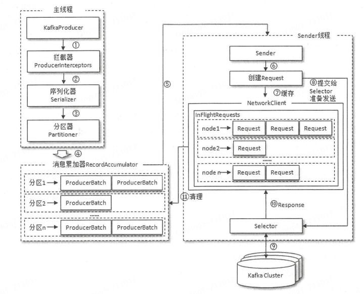

一个消息从生产者到kafka服务器前，需要经过相当多的环节。生产者在真正发送消息到broker之前，消息会经过拦截器，序列化器，分区器的处理，然后存储到消息收集器，之后会由另一个Sender线程(真正的发送线程) 从消息收集器取出消息，执行真正的发送逻辑。

**拦截器**:

拦截器既可以用来在消息发送前做一些准备工作， 比如按照某个规则过滤不符合要求的消息、修改消息的内容等。假设不需要拦截器，这个过程就不是必需的。

**序列化器**: 

生产者需要用序列化器(Serializer)把对象转换成字节数组才能通过网络发送给 Kafka。

**分区器**: 

消息在经过序列化之后，需要确定它将要发往的分区，消息体中有一个partition字段，假如开发者为这个字段设置了值 (相当于指定了分区)，那么就不需要分区器来确定分区，因为开发者已经指定好分区。如果消息体中没有设置partition字段，那么分区器将根据消息的key字段来确定将要发往哪个分区。如果key不为null，默认的分区器将对key进行哈希确定分区，如果key为null，那么消息将以轮询的方式发送到各个分区。

**消息收集器**: 

整个生产者客户端由两个线程协调运行，主线程发送的消息经过拦截器，序列化器，分区器的处理，缓存到消息收集器中，Sender线程则负责从消息收集器获取消息并发送到kafka服务器中。

消息收集器存储消息的结构如下:  ConcurrentMap<TopicPartition, Deque<ProducerBatch>> batches 。 

解释下这个结构，消息收集器为每个分区都维护了一个双端队列, 队列中存储的就是ProducerBatch，注意ProducerBatch不是ProducerRecord，在生产者内部，为了提高发送效率，生产者会尝试将多个 ProducerRecord 打包成一个批次（Batch），这个批次就是 ProducerBatch。

当一条消息( ProducerRecord ) 流入 消息收集器 时，会先寻找与消息分区所对应的双端队列(如果没有则新建)，再从这个双端队列的尾部获取一个 ProducerBatch (如果没有则新建)，查看 ProducerBatch 中是否 还可以写入这个 ProducerRecord，如果可以则写入，如果不可以则需要创建一个新的ProducerBatch。 

**Sender线程:**

Sender线程的作用就是负责从消息收集器获取消息并发送到kafka服务器中。

Sender 从 消息收集器 中获取缓存的消息之后，会进一步将原本<TopicPartition, Deque<ProducerBatch>>的保存形式转变成<Node, List< ProducerBatch>的形式，其中 Node 表示 Kafka 集群 的 broker 节点 。对于网络连接来说，生产者客户端是与具体的broker节点建立的连接，也就是向具体的 broker 节点发送消息，而并不关心消息属于哪一个分区。而对于 Kafka Producer的应用逻辑而言 ，我们只关注向哪个分区中发送哪些消息，所以在这里需要做一个应用逻辑层面到网络IO层面的转换。 

Sender线程从消息收集器的双端队列的头部取出一批消息，然后批量发送到broker，这也是kafka设计了消息收集器的原因，就是为了减少网络IO次数。

如果producer发送消息的速度太快，远远超过sender线程，那么消息累加器的空间将不足，此时producer再发送消息，要么阻塞，要么抛出异常。

## **4.ack机制**

为了提高发送消息的可靠性，确保消息在生产者和消费者之间传输时不会丢失，kafka提供了ack机制来保证生产者发送消息的可靠性。

kafka有三种ack的设置:

**ack = 0 时**，生产者不会等待任何来自Kafka集群的确认，消息被立即视为已发送。这是一种性能最好，可靠性最低的方案。

**ack = 1 时**，生产者会等待Kafka集群中的领导者副本（副本的概念将会在后文中提到，可以之后再回看这里) 确认消息已成功写入日志后才继续发送下一条消息。这种方式提供了一定程度的可靠性，但如果领导者在确认后崩溃，消息可能丢失。这是一种性能和可靠性折中的方案。

**ack = all或-1时**，生产者会等待所有同步副本，包括Leader副本和其所有ISR副本(副本的概念将会在后文中提到，可以之后再回看这里)，确认消息已成功写入后才继续发送下一条消息。这是一种性能最低，可靠性最高的方案。

## **5.重试机制**

kafka生产者发送消息时可能会遇到发送异常的情况。kafka还提供了生产者消息发送的重试策略，开发者可以指定重试策略，包括重试次数和重试间隔时间。但是不是所有异常都可以重试，例如Network Exception（网络异常)，LeaderNotAvailableException（分区的leader副本不可用)等可以重试。但是 RecordTooLargeException (消息体太大) 不可以重试。

# **broker**

## **1.主题与分区**

在kafka中，还有一个特别重要的概念，主题与分区（topic and partion)，主题用作消息的分类，一个主题又可以分为多个分区，而分区一般称为主题分区，每个分区存储的消息不同。需要明确的是，主题是一个逻辑上的分类，而分区是实际上的物理分类。

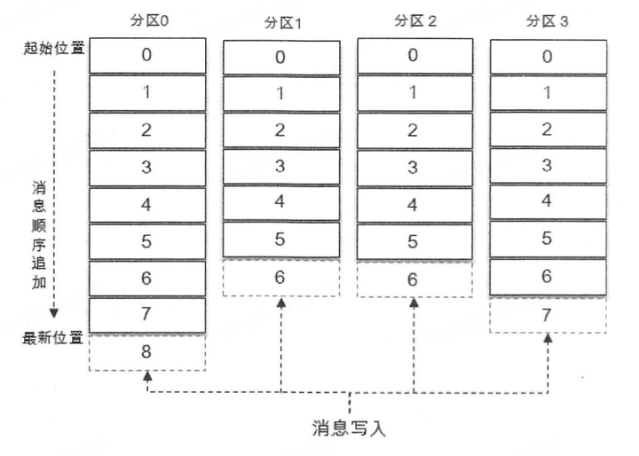

上图展示的是1个topic有4个分区的情况，这四个分区一般分布在不同的kafka服务器（broker）上。

生产者将消息发送到broker时，会根据分区规则，将消息写入到不同的分区中。如果没有消息体中没有指定写入的分区，也没有设置key的值，将会根据默认的分区策略-轮询，将消息平均，有顺序的写入到不同的分区中。

## **2.分区的多副本机制**

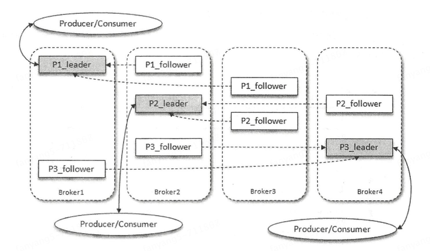

副本(Replica) 是分布式系统中常见的概念之一，指的是分布式系统对数据和服务提供的一种冗余方式。 在常见的分布式系统中，为了对外提供可用的服务，我们往往会对数据和服务进行副本处理。副本是指在不同的节点上持久化同一份数据，当某一个节点上存储的数据丢失时，可以从副本上读取该数据，这是解决分布式系统数据丢失问题最有效的手段。 

kafka作为一个分布式消息中间件，也为分区引入了多副本机制。kafka通过增加副本数量可以提升容灾能力。同一分区的不同副本中保存的是相同的消息(在同一时刻，副本之间并非完全一样)，副本之间是一主多从(一个leader副本，多个follower副本)的关系，其中 leader副本负责处理读写请求， follower副本只负责与 leader副本的消息同步。副本处于不同的 broker 中 ，当 leader 副本出现故障时，从 follower 副本中重新选举新的leader副本对外提供服务。 这是kafka高可用的一个原因，就是通过多副本机制实现了故障的自动转移，当 Kafka集群中某个broker失效时仍然能保证服务可用。

上图展示了kafka多副本机制的一种情况，kafka集群中有4个broker，某个主题有三个分区（Partition1, Partition2, Partition3)，且 副本个数(副本个数指的是leader副本与follower副本的总数)为 3（副本个数在kafka中又被称为副本因子)。例如，分区1，有一个P1_leader副本, 还有两个P1_follower副本。生产者与消费者只与P1_ledaer副本进行交互，而 follower副本只负责消息的同步，很多时候 follower副本中的消息相对 leader 副本而言会有一定的滞后。 

## **3.副本进阶概念**

刚才已经提到了kafka为什么要引入多副本机制，本质还是为了保证数据存储的可靠性。下面是kafka定义的有关副本的一些进阶的概念，知道这些概念有助于我们之后对消息消费过程的理解。再强调一遍，主题有多个分区，而副本的概念是针对分区来说的，多副本架构为一主多从，其中 leader副本负责处理读写请求， follower副本只负责与 leader副本的消息同步。

**AR(Assigned Replicas)** : 某个分区的所有副本统称为 AR

**ISR(In-Sync Replicas)** : 所有与 leader 副本保持一定程度同步的副本(包括 leader 副本在内〕组成 ISR。"一定程度同步"指的是，消息会先发送到 leader 副本，然后 follower 副本才能从 leader 副本中拉取消息进行同步， 同步期间内follower副本相对于leader副本而言会有一定程度的滞后。 前面所说的“一定程度的同步”是指可忍受的滞后范围

**OSR(Out-of-Sync Replicas)** : 与leader副本同步滞后过多的副本(不包括leader 副本)组成OSR。也就是消息的滞后程度已经到了无可忍受的范围了。

## **4.消息偏移量** 

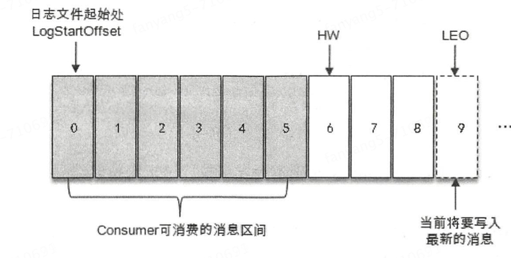

**偏移量:**  对于kafka中的分区而言，每个消息都有一个唯一的offset，我们把这个offset称之为偏移量，用来表示消息在分区中对应的位置。

如图5所示，它代表一个日志文件，这个日志文件中有 9 条消息，第一条消息的 offset (LogStartOffset)为 0，最后一条消息的 offset为 8, offset为 9 的消息用虚线框表示，代表下一条待写入的消息。

图上标识的HW与LEO是一个很重要的概念。 HW 是 High Watermark 的缩写，俗称高水位，它标识 了一个特定的消息偏移量(offset)，消费者只能拉取到这个 offset之前的消息，图中日志文件的 HW为 6，表示消费者只能拉取到 offset 在 0 至 5 之间的消息。 LEO 是 Log End Offset 的缩写，它标识当前日志文件中下一条待写入消息的offset，图 5中offset为9的位置即为当前日志文件的LEO。

分区 ISR集合中的每个副本都会维护自身的 LEO，而ISR集合中最小的 LEO，即为分区的 HW，对消费者而言只能消费 HW 之前的消息，这个是不是很有道理。



## **5.消息存储**

kafka对broker中的消息做了持久化存储，选择存储到磁盘，但是磁盘是一个很慢的存储介质，我们看看kafka在消息存储方面都做了哪些优化。

### **(1)日志结构**

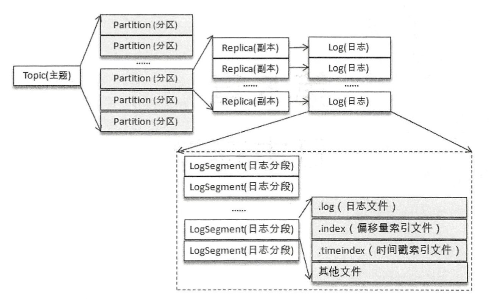



一个主题有多个分区，每个分区有多个副本，所以每个副本都会单独存储一个Log(日志)，为了防止这个日志过大，kafka选择将日志分段，将Log文件切分为多个LogSegment，也就是把一个巨大的日志文件切分为多个小的日志文件。接下来会解析LogSegment的存储结构。

### **(2)日志索引**

刚才提到kafka选择将日志分段，有多个LogSegement，kafka向Log写消息时是顺序写入，只有最后一个LogSegment才能执行写入操作，之前的所有LogSegment都不能写入数据，随着消息的不断写入，最后一个LogSegment会不断增大，这个时候需要创建一个新的LogSegment，这个新的LogSegment将成为最后一个Logsegment。

LogSegment的组成为，一个.log日志文件，一个.index偏移量索引文件，以及一个.timeindex时间戳索引文件。当进行消息的检索时，两个索引文件将会派上用场。每个LogSegment都有一个基准偏移量baseOffset，表示这个logSegement中的第一条消息的偏移量。日志文件和两个索引文件都是根据这个基准偏移量命名的。

比如，某一时刻，某个log(日志)中的文件布局如下图:



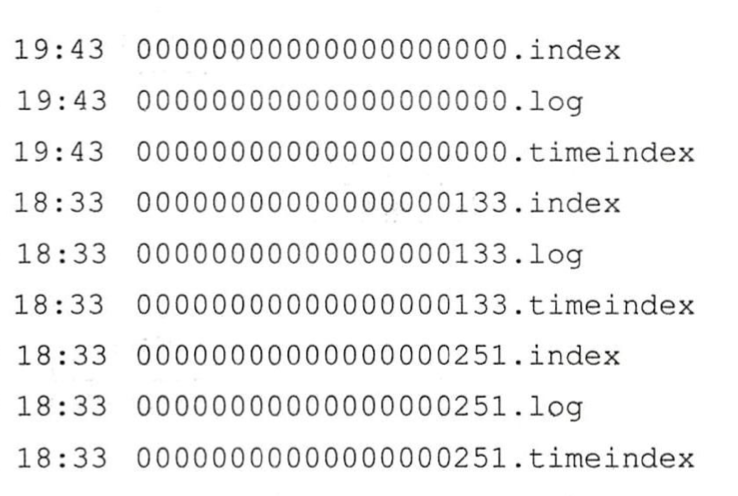

文件以0开头命名，说明第一个LogSegement的基准偏移量为0，以133开头命名，说明第二个LogSegement的基准偏移量为133, 以251开头命名，说明第三个LogSegment的基准偏移量为251。

索引的目的就是为了提高数据查找的效率，kafka的日志索引文件也不例外。偏移量索引文件用来建立消息偏移量(offset)到物理地址之间的映射关系，方便快速定位消息 所在的物理文件位置。时间戳索引文件则根据指定的时间戳( timestamp)来查找对应的偏移量信息。 

## **6.磁盘的工作原理**

kafka的消息存储在磁盘中，因此我们有必要知道磁盘的工作原理以及磁盘的一些特性，这些特性都是Kafka所使用的。

**随机写盘和顺序写盘：**由于磁盘读取和写入数据时需要物理上转动磁头的特性，当我们进行随机写盘的时候，性能会比顺序写盘慢几十倍甚至上百倍，所以kafka在写日志时，是在日志的最后追加写日志。

**页缓存(page cache)**: 页缓存(page cache)的本质就是缓存，只是它存储的数据大小为一页，它通过将磁盘中的数据缓存到内存中，以减少磁盘I/O操作，从而提高系统性能。

假设我们现在要读取磁盘中的某个文件，操作系统会先检查请求的数据是否已经缓存在Page Cache中，如果命中缓存则直接返回数据，如果没有命中才会真正去磁盘中读取。

假设我们要把某个数据写入到磁盘，其实也是先将数据写入到Page Cache，然后由开发者或者操作系统将Page Cache中的数据写入到磁盘。MySQL有个设计理念，叫做日志先行(Write Ahead Log)，也就是先写日志，再写磁盘，用到的也是Page Cache的这种机制。

**零拷贝技术:** 

在讲解零拷贝技术之前，还需要了解操作系统的一点基础知识。操作系统分为用户态和内核态，为了防止用户程序对系统进行恶意的破坏，用户态的程序不能直接访问底层的设备，例如磁盘，网卡等，而是需要操作系统的内核来对这些设备进行操作，所以操作系统给用户态的程序提供了一些函数，例如read函数，从磁盘中读取数据到用户进程的缓存中，又例如write函数，将用户进程的缓存写到磁盘中去。

有这么一个场景，用户要下载服务器上的文件，我们看看传统的文件传输过程是怎么做的，如下图所示，一个文件从磁盘到网卡准备发送，一共要进行四次数据的拷贝。第一次，从磁盘到内核态缓冲区。第二次，从内核态缓冲区到用户态缓冲区。第三次，从用户态缓冲区到内核态缓冲区。第四次，从内核态缓冲区到网卡。



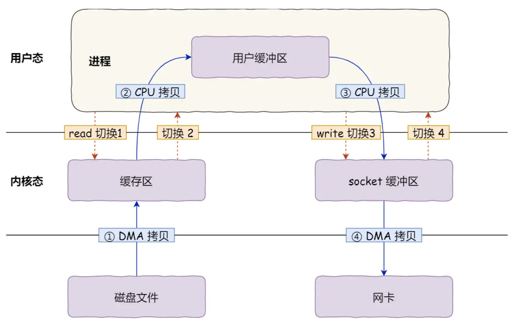


我们再看看零拷贝文件传输又是怎么做的。如下图所示, linux2.1版本以上，linux操作系统提供了一个新的函数叫sendfile，这个函数，让磁盘文件到网卡只需要进行两次数据拷贝。第一次是从磁盘拷贝到内核态缓冲区，第二次直接从内核态缓冲区拷贝到网卡。

**所以零拷贝技术并不是指文件传输的过程不再需要拷贝，而是减少了数据拷贝的次数。**



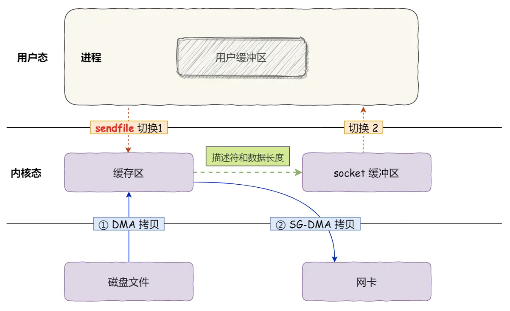

# 消费者

## **1.消费者与消费组**

生产者负责向broker中的主题发送消息，而消费者负责从broker中拉取消息并进行消费，但是在kafka的设计理念中，还有一个消费组的概念。

每个消费者都有一个对应的消费组。当消息发布到主题后，只会被投递给订阅它的每个消费组中的一个消费者 。 



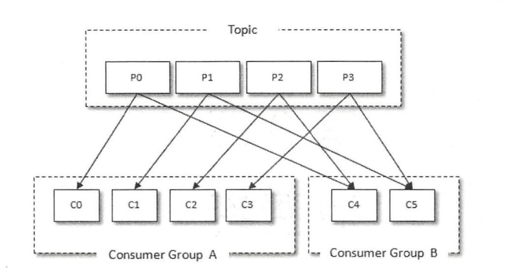

如上图所示，消费组A和消费组B订阅了同一个topic，topic有4个分区，消费组A有4个消费者，消费组B有2个消费者。分配结果是，消费组A中的每一个消费者分配到一个分区，消费组B中的每一个消费者分配到2个分区。

不过并不是消费者数量无限的多，消费能力就无限的强。原因很简单，如下图所示: 分区数量为7个，消费者数量达到了8个，新增加的消费者就处于一个空闲的状态，因为每个分区都已经有自己所属的消费者了。



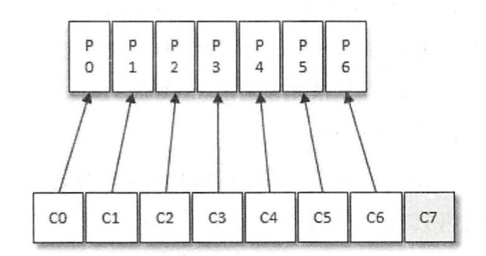

## 2.消费位移

在前文的broker中的章节已经提过了，对于kafka中的分区而言，分区中的每条消息都有唯一的一个offset（偏移量)，用来表示这条消息在分区中所在的位置。对于消费者而言，它也有一个offset的概念，不过这个offset代表的是，消费者消费到分区中的某个消息所在的位置。网上很多关于kafka不严谨的文章，总是会把这两个offset的概念搞混。下面着重区分一下这两个offset的关系:

**offset偏移量**: 对于消息在分区中的位置，我们将 offset称为偏移量，这个offset是在讲分区存储层面的内容。

**offset位移**: 对于消费者消费到的位置，将offset称为位移或者消费位移，这个offset是在讲消费层面的内容。

**消费位移提交**: 对于消费位移，kafka会对它做持久化存储，为什么呢？有一些场景，例如，当消费者重启了，或者分区中的消费者数量变化触发分区重分配了，如果消费位移没有做持久化存储，那么重启后的消费者或者新加入的消费者就不知道从哪里开始继续消费了,所以kafka会对消费位移进行持久化存储，而且是存在broker自带的一个主题中。消费位移持久化存储的动作被称为"**消费位移提交**"。



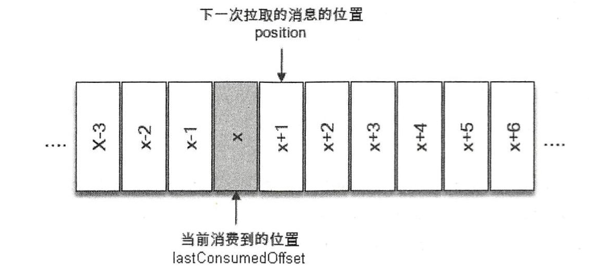



上图表示某个时刻的消费情况，x代表当前消费者已经消费了x位置的消息，那么我们就说，这个时刻，消费者的消费位移为x。但是，消费者需要提交的消费位移为x+1而不是x，网上也有一些错误的博客文章，写的是提交的消费位移为x，这是错误的说法。

kafka中的消息消费，其实就是消费者不断的调用一个poll()方法，poll()方法会从broker中拉取一批消息。如下图: 某次poll()操作一次性拉取了从x+2位置到x+7位置的消息，x+2代表上一次提交的消费位移，说明x+1及之前的消息都已经消费了，x+5代表当前正在消费的消息位置，而x+8代表将要提交的消费位移位置。

刚才提到了消费位移提交的概念，我们再思考一个问题，kafka的消费位移提交时机是什么?

由于kafka是一次性拉取一批消息消费，还是用图x所示的情况来看。假如是在拉取消息之后就进行位移提交，即提交x+8，那么如果在消费x+5的时候出现异常，那么下一次重新开始消费的时候，是从x+8开始的，也就是说，x+5到x+7位置的消息丢失了。假如是在消费完这一批消息后才进行消费位移提交，那么在消费x+5的时候出现异常，那么下一次重新开始消费的时候，是从x+2开始的，也就是说，x+2到x+4的消息发生了重复消费。



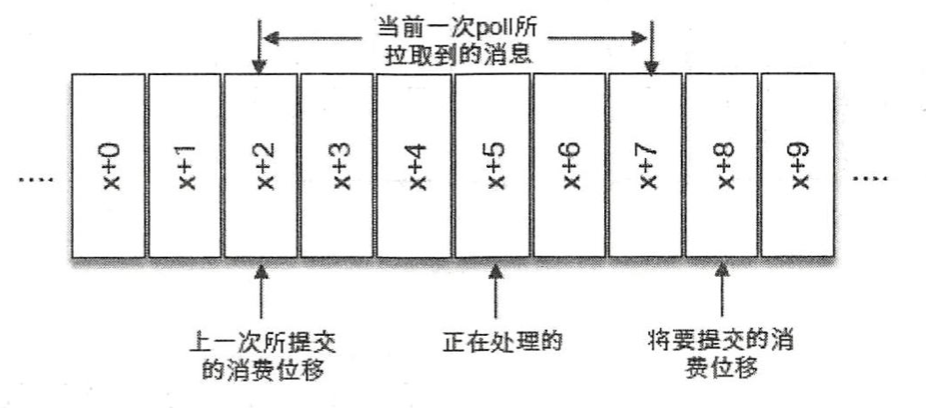

**自动位移提交:** kafka的消费位移的提交方式默认为 自动提交，此自动提交并不是指每次消费都提交一次，而是指的定时提交，默认为每隔5秒提交一次，消费者每隔5秒，会将每个分区的最大的消费位移进行提交。

自动位移提交的方式对于开发者来说非常简便，在一切正常的情况下，它显得如此的好用，但它也是造成消息重复消费和消息丢失的罪魁祸首。

下面来具体解析这两种情况:

还是以上图情况举例, 假设刚提交完上一次的位移x+2, 然后下一次poll操作拉取了从x+2到x+8的消息，在下一次定时自动自动提交位移之前，消费者崩溃了，那么消费者重启后，又要从x+2位置开始重新消费，这就是消息重复消费的原因。另一种情况是，这次poll操作拉取了从x+2到x+8的消息，然后不断的消费每一个消息并进行对应的业务逻辑处理（很多时候并不是我们拉取到这个消息就认为这个消息消费完成，而是要做很多业务逻辑处理，这些业务逻辑处理完成我们才认为消息是被成功消费)，假设消费到了x+5位置时，自动位移提交了（这个时候提交的是x+8), 紧接着消费者崩溃了，那么消费者重启后，会直接从x+8的位置开始拉取消息并进行消费，x+5到x+7位置的消息丢失了。以上便是自动位移提交带来的消息重复消费与消息丢失问题的原因。

正常情况下，自动位移提交是不会有重复消费和消息丢失的问题的，但是作为一名软件开发人员，我们必须去考虑这些异常的情况。所以，kafka也提供了手动位移提交的方式，而且是更推荐开发者使用手动位移提交。

**手动位移提交:** 手动位移提交允许消费者在代码中显式地控制何时提交偏移量，这也是更推荐的一种方式。Kafka提供了两种手动提交的方式：同步提交和异步提交。这里不再具体解释，也不再演示具体的代码，对手动位移提交相关的接口查看可以查看kafka的官方文档 - [kafka官方文档地址](https://kafka.apache.org/34/javadoc/org/apache/kafka/clients/consumer/KafkaConsumer.html) 

## **3.再均衡(rebalance)**



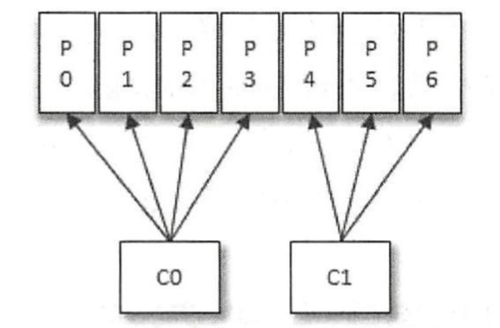



如上图，某个主题topic有七个分区，某个消费组订阅了这个topic，消费组有两个消费者C0和C1，分别负责消费四个分区和三个分区。现在，如果我们想要提高消费者的整体消费能力，我们往消费组中添加了一个消费者，那么某些分区的所属权就会从一个消费者转移到另一个消费者，这就是再均衡（rebalance）的定义，需要注意的是，不止是增加消费者，减少消费者也会发生再均衡。

需要注意的是，再均衡发生的过程中，消费组内的消费者都无法消费。并且，发生再均衡的分区，消费者的状态会丢失，也就是说，假设某个分区的旧的消费者消费完了某部分消息还没提交消费位移，发生了再均衡，新的消费者会从上一次的消费位移处开始消费，会发生消息的重复消费。如果不是线上消息积压需要扩容，大多数情况下，应该尽量避免再均衡的发生。