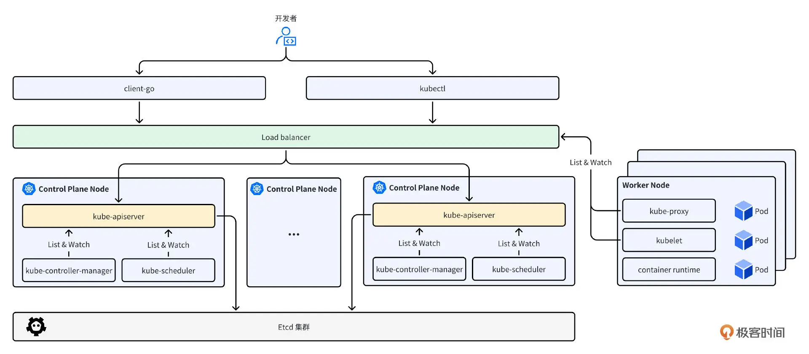
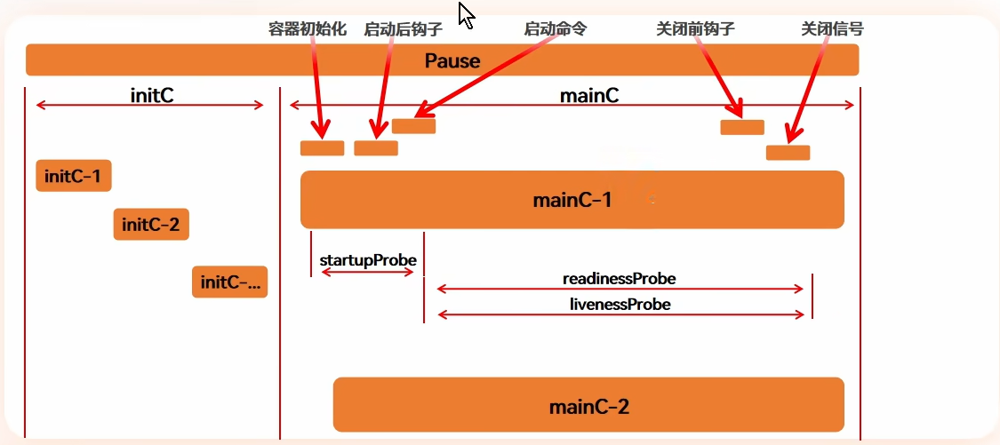
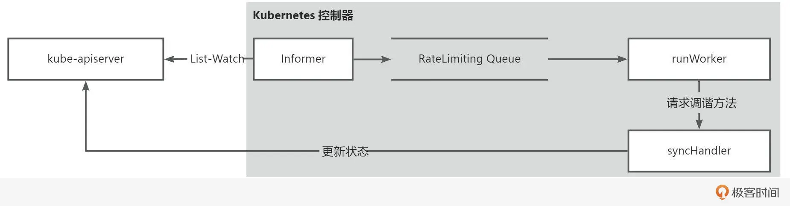
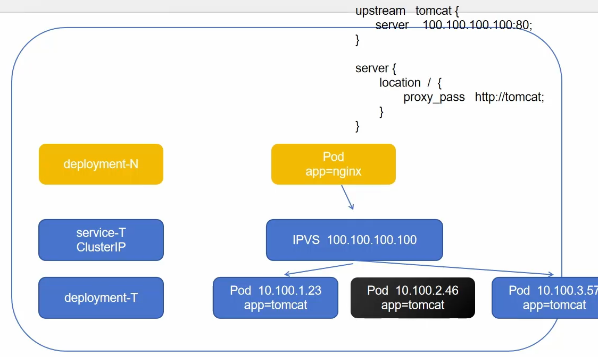
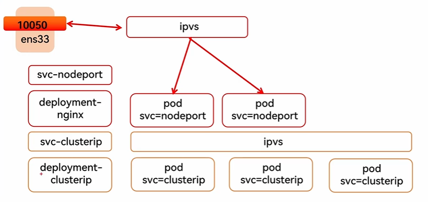
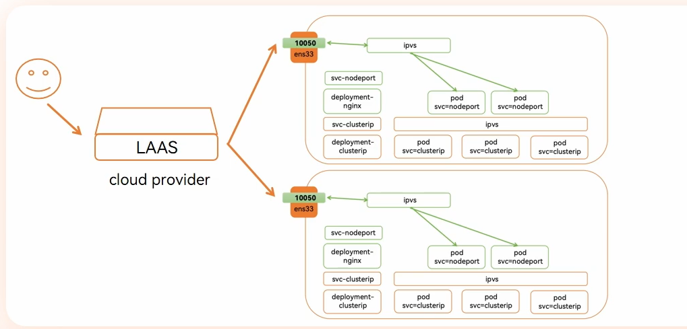
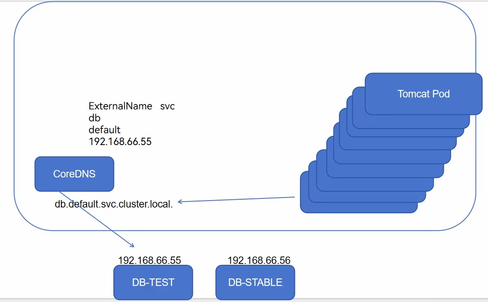
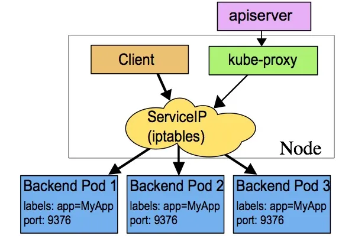
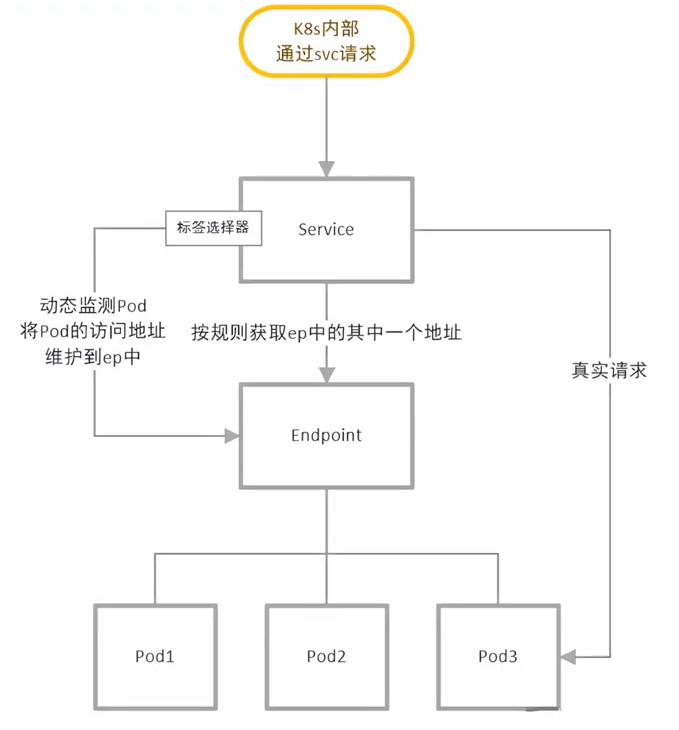

[概述 | Kubernetes](https://kubernetes.io/zh-cn/docs/concepts/overview/#why-you-need-kubernetes-and-what-can-it-do)

[容器运行时接口（CRI） | Jimmy Song](https://jimmysong.io/book/kubernetes-handbook/interfaces/cri/)

> **为什么需要 Kubernetes，它能做什么？**

**服务发现和负载均衡**

Kubernetes 可以使用 DNS 名称或自己的 IP 地址来暴露容器。 如果进入容器的流量很大， Kubernetes 可以负载均衡并分配网络流量，从而使部署稳定。

**存储编排**

Kubernetes 允许你自动挂载你选择的存储系统，例如本地存储、公共云提供商等。

**自动部署和回滚**

你可以使用 Kubernetes 描述已部署容器的所需状态， 它可以以受控的速率将实际状态更改为期望状态。 例如，你可以自动化 Kubernetes 来为你的部署创建新容器， 删除现有容器并将它们的所有资源用于新容器。

**自动完成装箱计算**

你为 Kubernetes 提供许多节点组成的集群，在这个集群上运行容器化的任务。 你告诉 Kubernetes 每个容器需要多少 CPU 和内存 (RAM)。 Kubernetes 可以将这些容器按实际情况调度到你的节点上，以最佳方式利用你的资源。

**自我修复**

Kubernetes 将重新启动失败的容器、替换容器、杀死不响应用户定义的运行状况检查的容器， 并且在准备好服务之前不将其通告给客户端。

**密钥与配置管理**

Kubernetes 允许你存储和管理敏感信息，例如密码、OAuth 令牌和 SSH 密钥。 你可以在不重建容器镜像的情况下部署和更新密钥和应用程序配置，也无需在堆栈配置中暴露密钥。

**批处理执行** 除了服务外，Kubernetes 还可以管理你的批处理和 CI（持续集成）工作负载，如有需要，可以替换失败的容器。

**水平扩缩** 使用简单的命令、用户界面或根据 CPU 使用率自动对你的应用进行扩缩。


## 组件



**master**：

Master 节点会部署 kube-apiserver、kube-controller-manager、kube-scheduler 组件，其中 kube-controller-mananger、kube-scheduler 会通过本地回环接口同 kube-apiserver 通信。

- [kube-apiserver](https://kubernetes.io/zh-cn/docs/concepts/architecture/#kube-apiserver)

  提供 Kubernetes API 的唯一入口，负责公开了 Kubernetes API，负责处理接受请求的工作。 

  承载着所有的资源增删改查、认证、鉴权等逻辑，其稳定性非常重要。为了确保 kube-apiserver 的高可用，企业会将 kube-apiserver 实例注册到负载均衡器中，通过负载均衡器来访问。通常建议的 kube-apiserver 副本数至少是 3 个。

- [etcd](https://kubernetes.io/zh-cn/docs/concepts/architecture/#etcd)

  分布式键值存储，集群状态的唯一数据源

- [kube-scheduler](https://kubernetes.io/zh-cn/docs/concepts/architecture/#kube-scheduler)

  查找尚未绑定到节点的 Pod，并将每个 Pod 分配给合适的节点。

- [kube-controller-manager](https://kubernetes.io/zh-cn/docs/concepts/architecture/#kube-controller-manager)

  会 Watch kube-apiserver，在 Watch 到资源变更事件后，会根据事件的类型和内容，对资源进行调和，使资源处于预期的状态。

  内置控制器：

  - Node Controller：节点状态管理
  - Replication Controller：副本数量控制
  - Endpoints Controller：服务端点管理

**worker**：

Worker 节点主要用来运行 Pod。Worker 节点部署了 Kubernetes 的 kubelet、kube-proxy 组件。kubelet 负责跟底层的容器运行时交互，用来管理容器的生命周期。kube-proxy，作为 Kubernetes 集群内的服务注册中心，负责服务发现和负载均衡

- [kubelet](https://kubernetes.io/zh-cn/docs/concepts/architecture/#kubelet)

  节点代理，管理 Pod 生命周期

  在 kube-scheduler 将 Pod 调度到具体的节点之后，会产生一个 Pod UPDATE 事件，kubelet watch Pod 的变更事件后，如果发现该 Pod 的 spec.nodeName 值跟 kubelet 所在的节点名相同，就会根据 Pod 的定义，调用底层的容器运行时，在节点上创建需要的容器，从而将 Pod 运行起来。

- [kube-proxy](https://kubernetes.io/zh-cn/docs/concepts/architecture/#kube-proxy)

  kube-proxy 会 Watch 集群的 Service 和 Pod 资源，并动态维护一个 Service IP（VIP）和 Pod IP（RS） 列表的映射，在 Service 和 Pod 有更新时，会动态的更新这个映射表。在我们通过 Service IP 访问时，kube-proxy 会更具负载均衡策略，选择一个 Pod IP，将请求转发到这个 Pod 中，起到一个负载均衡器的功能。

- [容器运行时（Container runtime）](https://kubernetes.io/zh-cn/docs/concepts/architecture/#container-runtime)

  负责管理 Kubernetes 环境中容器的执行和生命周期。


### kube-apiserver

kube-apiserver 主要负责以下工作:

* **API 服务**：提供 Kubernetes API 接口，供用户和其他组件（如 Kubelet、Kube-controller-manager 等）进行交互。

* **资源管理**：负责创建、更新、删除和列出集群中的资源（如 Pods、Services、Deployments 等）。

* **认证和授权**：处理用户身份验证，支持多种认证方法（如基本认证、Bearer Tokens、Webhook 等）；检查用户是否有权限执行特定操作（即授权）。支持 ABAC、RBAC、Webhook 等授权策略。

* **审计日志**：记录所有 API 请求和操作的审计日志，可以用于安全审计和问题排查。

* **API 版本管理**：支持不同版本的 API，确保向后兼容性和逐步迁移；提供不同的版本（如 v1、v1beta 等），允许客户端选择适当的 API 版本。

* **数据存储**：与 etcd 交互，负责持久化存储集群状态和配置数据；处理所有对 etcd 的读写请求，确保数据一致性和高可用性。

* **对象的 Watch 机制**：支持客户端订阅对象变化，实现实时更新通知（Watch）；允许系统组件基于资源变化进行响应。

* **API 速率限制**：实现请求速率限制，以确保 API Server 的稳定性和性能，防止过载。


### kube-controller-manager

kube-controller-manager 是一组控制器的集合，用于监控和管理集群中的各种资源。它包括节点控制器、副本控制器、服务控制器、端点控制器等。这些控制器负责监视资源的状态变化，并根据需要采取相应的操作，确保集群中的资源处于期望的状态。


### kube-sheduler

kube-scheduler 负责将新创建的 Pod 调度到集群中的节点上。它负责监视新创建的、未指定运行节点（node）的 Pods，选择节点让 Pod 在上面运行。调度决策考虑的因素包括单个 Pod 和 Pod 集合的资源需求、硬件 / 软件 / 策略约束、亲和性和反亲和性规范、数据位置、工作负载间的干扰和最后时限。


### etcd

etcd 是一个开源的强一致性分布式键值存储：

* 强一致性：如果对一个节点进行了更新，强一致性将确保它立即更新到集群中的所有其他节点。在 CAP 定理的限制下，在强一致性和分区容忍的情况下，实现 100% 可用性是不可能的。
* 分布式：etcd 被设计成在保留强一致性的前提下，作为一个集群在多个节点上运行。
* 键值存储：将数据存储为键和值的非关系数据库。它还公开了一个键值 API。数据存储构建在 BoltDB 之上（BoltDB 是 BoltDB 的一个分支）。


etcd 在 Kubernetes 集群中的作用包括：

* **etcd 存储 Kubernetes 对象的所有配置、状态和元数据**。包括：Pods、Secrets、Daemonsets、Deployment、Configmaps、Statfulsets 等对象。
* **etcd 允许客户端使用 Watch() API 订阅事件**。kube-apiserver 使用 etcd 的 Watch 功能来跟踪对象状态的变化。
* **etcd 使用 gRPC 公开键值 API**。此外，gRPC 网关作为 RESTful 代理，将所有 HTTP API 调用转换为 gRPC 消息。这使得它成为 Kubernetes 的理想数据库。
* **etcd 以键值方式，将所有对象存储在 /registry 目录下**。 例如，一个在 default 命名空间中，名字为 nginx 的 Pod，可以在 /registry/pods/default/nginx 下找到。


### kubelet

kubelet 是负责容器真正运行的核心组件，主要职责如下所示：

* 负责 Node 节点上 Pod 的创建、修改、监控、删除等全生命周期的管理。
* 定时上报本地 Node 的状态信息给 kube-apiserver。
* kubelet 是 Master 和 Node 之间的桥梁，接收 kube-apiserver 分配给它的任务并执行。
* kubelet 通过 kube-apiserver 间接与 etcd 集群交互来读取集群配置信息。
* kubelet 在 Node 上做的主要工作具体如下:
  * 设置容器的环境变量、给容器绑定 Volume、给容器绑定 Port；
  * 为 Pod 创建，更新，删除容器；
  * 负责处理存活（Liveness）、就绪（Readiness）和启动（Startup）探针；
  * 通过读取 Pod 配置，在主机上为卷挂载创建相应的目录来挂载卷。


### kube-proxy

kube-proxy 负责为 Pod 提供网络代理和负载均衡功能。它维护集群中的网络规则和转发表，并将请求转发到合适的目标 Pod 上。它支持多种代理模式，如用户空间代理、iptables 代理和 IPVS 代理，以满足不同网络环境的需求。


## Pod

Pod 是 Kubernetes 中可以创建和部署的**最小调度单元**。Pod 代表集群中运行的一个或多个容器的集合。

Pod 封装了以下内容：

- 一个或多个应用容器
- 共享的存储卷（Volumes）
- 唯一的网络 IP 地址
- 容器运行策略配置


### Pause容器

要实现 Pod 内多个容器之间高效共享资源和数据，需要解决的核心问题是：**如何打破容器间的 Linux Namespace 和 cgroups 隔离**。

Kubernetes 采用了巧妙的设计方案，通过 Pause 容器来解决这个问题，主要涉及两个方面：

1. **网络共享**：通过 Network Namespace 共享
2. **存储共享**：通过 Volume 挂载

其他作用：

* 共享IPC、PID

* 负责回收僵尸进程


> Pause 容器具有以下显著特点：

- **轻量级**：镜像极小，约 300-700KB
- **持久运行**：永远处于 Pause（暂停）状态
- **多架构支持**：支持 AMD64、ARM64 等多种架构
- **资源消耗极低**：几乎不消耗 CPU 和内存资源


> **网络共享机制流程**：

Pod 内容器的网络共享按以下顺序执行：

1. **Pod 创建**：Kubernetes 调度器决定创建新 Pod
2. **启动 Pause 容器**：容器运行时首先创建并启动 Pause 容器
3. **创建 Network Namespace**：Pause 容器建立独立的网络命名空间
4. **业务容器加入**：后续创建的业务容器通过 `--net=container:pause` 参数加入相同的网络命名空间
5. **实现资源共享**：所有容器共享同一套网络资源（IP、端口、路由表等）


### Init容器

Init 容器是 Kubernetes 中一种特殊的容器，它在应用程序容器启动之前运行，用来执行初始化任务。Init 容器可以包含一些应用镜像中不存在的实用工具或安装脚本，为主应用程序提供必要的前置条件。


Init 容器与普通的容器非常像，除了如下两点：

- 它们总是运行到完成。
- 每个都必须在下一个启动之前成功完成。

如果 Pod 的 Init 容器失败，kubelet 会不断地重启该 Init 容器直到该容器成功为止。 然而，如果 Pod 对应的 `restartPolicy` 值为 "Never"，并且 Pod 的 Init 容器失败， 则 Kubernetes 会将整个 Pod 状态设置为失败。


> **Init 容器的核心特性**

- **顺序执行**：多个 Init 容器按照定义顺序一个接一个地运行
- **必须成功**：每个 Init 容器都必须成功完成，下一个容器才能启动
- **阻塞启动**：所有 Init 容器成功完成后，应用容器才开始启动
- **独立镜像**：Init 容器可以使用与应用容器不同的镜像


Init 容器支持应用容器的大部分特性，但有以下重要区别：

| 特性     | Init 容器             | 应用容器                |
| :------- | :-------------------- | :---------------------- |
| 运行方式 | 顺序执行，运行至完成  | 并行运行，持续运行      |
| 重启策略 | 失败时重启整个 Pod    | 根据 restartPolicy 处理 |
| 就绪探针 | 不支持 readinessProbe | 支持各种探针            |
| 生命周期 | 一次性执行            | 长期运行                |


> **使用场景**

* 依赖服务检查
* 数据预处理：下载配置文件或初始数据，克隆 Git 仓库到共享卷，生成动态配置文件等
* 权限和安全设置
* 资源准备：创建必要的目录结构，安装依赖等


> **执行顺序**

1. Pod 被调度到节点
2. 网络和存储卷初始化
3. Init 容器按顺序依次执行
4. 所有 Init 容器成功后，应用容器启动


### 生命周期




#### 容器探针

**探针是 kubelet 对容器执行的定期健康检查。**

使用探针来检查容器有四种不同的方法。 每个探针都必须准确定义为这四种机制中的一种：

- `exec`

  在容器内执行指定命令。如果命令退出时返回码为 0 则认为诊断成功。

- `grpc`

  使用 [gRPC](https://grpc.io/) 执行一个远程过程调用。 目标应该实现 [gRPC 健康检查](https://grpc.io/grpc/core/md_doc_health-checking.html)。 如果响应的状态是 "SERVING"，则认为诊断成功。

- `httpGet`

  对容器的 IP 地址上指定端口和路径执行 HTTP `GET` 请求。如果响应的状态码大于等于 200 且小于 400，则诊断被认为是成功的。

- `tcpSocket`

  对容器的 IP 地址上的指定端口执行 TCP 检查。如果端口打开，则诊断被认为是成功的。 如果远程系统（容器）在打开连接后立即将其关闭，这算作是健康的。


探针类型：

* 存活探针（Liveness Probe）

  - 用途：检测容器是否正在运行

  - 失败处理：kubelet 杀死容器，容器根据重启策略处理

  - 默认状态：如未配置，默认为 `Success`

* 就绪探针（Readiness Probe）

  - 用途：检测容器是否准备好接收流量

  - 失败处理：从所有匹配的 Service 端点中移除 Pod IP

  - 默认状态：如未配置，默认为 `Success`

* 启动探针（Startup Probe）

  - 用途：用于检测容器是否已启动

  - 优先级：启动探针成功前，其他探针被禁用

  - 适用场景：遗留应用或启动时间较长的容器


#### Pod Hook

Pod Hook（钩子）是 Kubernetes 容器生命周期管理的重要机制，由 kubelet 负责执行。Hook 在容器启动后或终止前运行，为容器提供了在关键时刻执行自定义逻辑的能力。

**PostStart Hook**

- 触发时机：容器创建后立即执行
- 执行方式：与容器主进程异步运行
- 阻塞行为：Kubernetes 会等待 postStart 完成后才将容器状态设置为 RUNNING
- 使用场景：初始化配置、注册服务、预热缓存等

**PreStop Hook**

- 触发时机：容器终止前执行
- 执行方式：同步阻塞调用
- 超时时间：默认 30 秒（可通过 `terminationGracePeriodSeconds` 配置）
- 使用场景：优雅关闭、清理资源、保存状态等


Kubernetes 支持两种类型的 Hook：

* Exec Hook：执行容器内的命令或脚本
* HTTP Hook：向指定端点发送 HTTP 请求


### sidecar容器

指的是在同一个 Pod 中运行的辅助容器，用来增强或扩展主容器的功能。就像摩托车的边车一样，Sidecar 容器与主容器紧密配合，共享相同的网络和存储资源。


常见使用场景：

* 日志收集：将主容器产生的日志文件收集并转发到日志系统。
* 服务网格代理：负责拦截和转发进出主容器的流量，实现流量管理、可观测性、服务发现和安全等功能。
* 配置热更新：通过将配置文件以 ConfigMap 的方式挂载到 Pod，并由 Sidecar 容器负责监听配置变更、通知主容器或自动重载配置，可以实现应用的无缝配置更新。

## 控制器

### ReplicationController 和 ReplicaSet

ReplicationController 和 ReplicaSet 都是 Kubernetes 中用于管理 Pod 副本的控制器，它们确保指定数量的 Pod 副本始终在集群中运行。

| 特性       | ReplicationController | ReplicaSet                     |
| :--------- | :-------------------- | :----------------------------- |
| 标签选择器 | 仅支持相等性选择器    | 支持集合式选择器和相等性选择器 |
| API 版本   | v1                    | apps/v1                        |
| 推荐使用   | 已弃用                | 推荐使用                       |


### Deployment

Deployment 为 Pod 和 ReplicaSet 提供声明式更新能力。你只需要在 Deployment 中描述期望的目标状态，Deployment Controller 就会帮你将 Pod 和 ReplicaSet 的实际状态改变到目标状态。

主要功能：

- **创建管理**：定义 Deployment 来创建 Pod 和 ReplicaSet
- **滚动更新**：支持应用的滚动升级和回滚
- **弹性伸缩**：支持应用的扩容和缩容
- **暂停控制**：可以暂停和继续 Deployment 的部署过程


Deployment 采用滚动更新策略，确保在更新过程中服务的可用性：

- 默认情况下，最多有 25% 的 Pod 不可用（maxUnavailable）
- 最多有 25% 的 Pod 超出期望数量（maxSurge）
- 这样确保在更新过程中始终有足够的 Pod 提供服务


### DaemonSet

DaemonSet 是 Kubernetes 中的一种控制器，它确保在集群中的每个（或特定）节点上运行一个 Pod 副本。当有新节点加入集群时，DaemonSet 会自动在新节点上创建 Pod；当节点从集群中移除时，对应的 Pod 也会被回收。删除 DaemonSet 时，它创建的所有 Pod 都会被删除。

DaemonSet 适用于需要在每个节点上运行系统级服务的场景：

- **存储服务**：在每个节点上运行分布式存储守护进程，如 `glusterd`、`ceph`
- **日志收集**：在每个节点上运行日志收集代理，如 `fluentd`、`filebeat`、`logstash`
- **监控代理**：在每个节点上运行监控组件，如 [Prometheus Node Exporter ](https://github.com/prometheus/node_exporter)、`collectd`、Datadog Agent、New Relic Agent
- **网络组件**：运行网络插件或代理，如 CNI 网络插件


### Job

Job 是 Kubernetes 中专门用于批处理任务的控制器，负责管理仅执行一次的任务。它确保批处理任务中的一个或多个 Pod 成功完成，并在任务结束后自动清理。

Job 控制器会持续监控 Pod 的状态，直到指定数量的 Pod 成功完成。与长期运行的服务不同，Job 适用于：

- 数据处理和分析任务
- 批量计算作业
- 数据库迁移
- 定期清理任务


基本配置项：

- spec.template: Pod 模板，格式与 Pod 规范相同
- restartPolicy: 仅支持 `Never` 或 `OnFailure`
- spec.completions: 指定需要成功完成的 Pod 数量，默认为 1
- spec.parallelism: 指定并行运行的 Pod 数量，默认为 1
- spec.backoffLimit: 指定失败重试次数，默认为 6
- spec.activeDeadlineSeconds: 指定 Job 的最大运行时间，超时后终止
- spec.ttlSecondsAfterFinished: 指定 Job 完成后的保留时间


### CronJob

CronJob 管理基于时间的Job ，即：

- 在给定时间点只运行一次
- 周期性地在给定时间点运行


### StatefulSet

StatefulSet 主要解决有状态服务的问题，其典型应用场景包括：

- **稳定的持久化存储**：Pod 重新调度后仍能访问相同的持久化数据，基于 PVC 实现
- **稳定的网络标识**：Pod 重新调度后 PodName 和 HostName 保持不变，基于 Headless Service 实现
- **有序部署和扩展**：Pod 按照定义的顺序依次部署（从 0 到 N-1），下一个 Pod 运行前所有之前的 Pod 必须处于 Running 和 Ready 状态
- **有序收缩和删除**：按照从 N-1 到 0 的顺序进行
- **有序滚动更新**：支持分段更新和金丝雀发布


StatefulSet 由以下几个关键部分组成：

- **Headless Service**：用于定义网络标识的 DNS 域
- **volumeClaimTemplates**：用于创建 PersistentVolumes 的模板
- **StatefulSet 规约**：定义具体应用的配置


#### Pod 身份管理

**序数标识**

对于有 N 个副本的 StatefulSet，每个副本都有一个唯一的整数序数，范围在 [0,N) 之间。

**稳定的网络标识**

每个 Pod 的主机名遵循 `$(statefulset 名称)-$(序数)` 的模式。上述示例将创建名为 `web-0`、`web-1`、`web-2` 的 Pod。

DNS 解析示例：

| 集群域        | Service       | StatefulSet | Pod DNS                                      | Pod 主机名   |
| :------------ | :------------ | :---------- | :------------------------------------------- | :----------- |
| cluster.local | default/nginx | default/web | web-{0..N-1}.nginx.default.svc.cluster.local | web-{0..N-1} |

**稳定存储**

Kubernetes 会为每个 VolumeClaimTemplate 创建 PersistentVolume。Pod 重新调度时，volumeMounts 会挂载对应的 PersistentVolume。需要注意的是，删除 Pod 或 StatefulSet 时，PersistentVolume 不会被自动删除。


#### Headless Service

有时不需要负载均衡和单独的 Service IP。这种情况下，可以通过将 Cluster IP（`spec.clusterIP`）设置为 `"None"` 来创建 Headless Service。

对于 Headless Service，不会分配 Cluster IP，kube-proxy 不会处理它们，平台也不会进行负载均衡和路由。

Headless Service 通过内部 DNS 记录报告各个 Pod 的端点 IP 地址。


### 核心原理



首先，控制器在启动时，会创建并启动一个 Shared Informer，Informer 负责 List-Watch kube-apiserver，获取指定资源的变更事件，并将事件保存在一个限速队列中。控制器在启动时，还会启动一个 Go 协程 runWorker。runWorker方法中会不断从 RateLimiting Queue 中获取事件的 key，并调用 syncHandler 方法。syncHandler 方法就是执行资源调谐的执行函数，该函数会根据 key 从 Infromer 的 Indexer 中获取完整的资源对象（Object），并根据资源对象的 Spec，执行一系列的业务逻辑，完成最终的调谐，并将调谐结果和状态更新到 kube-apiserver 中。


## service

每个 Pod 都会获得自己的 IP 地址，但这些 IP 地址并不总是稳定可靠的。这就带来了一个关键问题：在 Kubernetes 集群中，如果一组 Pod（后端服务）为其他 Pod（前端应用）提供服务，那么前端应用应该如何发现并连接到这些后端 Pod 呢？

Kubernetes Service 定义了一种抽象：将一组功能相同的 Pod 进行逻辑分组，并提供访问这些 Pod 的统一策略——这通常被称为微服务。Service 能够通过标签选择器（Label Selector）来识别和访问后端 Pod。


### Service 类型

对一些应用的某些部分（如前端），你可能希望将其公开于某外部 IP 地址， 也就是可以从集群外部访问的某个地址，默认是 `ClusterIP`。

**ClusterIP**

通过集群的内部 IP 公开 Service，选择该值时 Service **只能够在集群内部访问**。




**NodePort**

通过每个 Node 的 IP 和静态端口（NodePort）暴露服务。NodePort 服务会路由到自动创建的 ClusterIP 服务。通过 `<NodeIP>:<NodePort>` 可以**从集群外部访问 NodePort 服务。**

当设置 `type` 为 `"NodePort"` 时，Kubernetes 控制平面会从配置的端口范围内（默认：30000-32767）分配端口。每个 Node 都会从该端口代理到 Service。该端口通过 `Service` 的 `spec.ports[*].nodePort` 字段指定。



**LoadBalancer**

使用云提供商的负载均衡器向外部暴露服务。外部负载均衡器会路由到 NodePort 和 ClusterIP 服务。

设置 `type` 为 `"LoadBalancer"` 时，云提供商会创建负载均衡器。负载均衡器信息通过 `Service` 的 `status.loadBalancer` 字段发布。

```yaml
apiVersion: v1
kind: Service
metadata:
  name: my-service
spec:
  selector:
    app: MyApp
  ports:
    - protocol: TCP
      port: 80
      targetPort: 9376
  type: LoadBalancer
status:
  loadBalancer:
    ingress:
      - ip: 146.148.47.155
```



**ExternalName**

通过返回 CNAME 记录将服务映射到 `externalName` 字段的内容（如 `foo.bar.example.com`）。不会创建任何形式的代理。

```yaml
apiVersion: v1
kind: Service
metadata:
  name: my-service
  namespace: prod
spec:
  type: ExternalName
  externalName: my.database.example.com
```

**注意**：ExternalName 接受 IPv4 地址格式的字符串，但它被视为由数字组成的 DNS 名称，而不是 IP 地址。类似 IPv4 地址的 ExternalName 不能被 CoreDNS 解析，因为 ExternalName 的目的是指定规范的 DNS 名称。如需硬编码 IP 地址，请考虑使用 Headless Service。



### 代理模式

在 Kubernetes 集群中，每个 Node 运行一个 `kube-proxy` 进程。`kube-proxy` 负责为 Service 实现虚拟 IP（VIP）形式的代理，而不是 ExternalName 形式。默认是**iptables 代理模式**。

**iptables 代理模式**

在此模式下，kube-proxy 监视 Kubernetes 控制平面对 Service 和 Endpoints 对象的添加和删除。对每个 Service，它会创建 iptables 规则来捕获到达该 Service ClusterIP 和端口的请求，并将请求重定向到 Service 的后端 Pod 之一。对于每个 Endpoints 对象，它也会创建 iptables 规则来选择后端 Pod。



**IPVS 代理模式**

在此模式下，kube-proxy 监视 Kubernetes Service 和 Endpoints，调用 netlink 接口创建 IPVS 规则，并定期同步以确保 IPVS 状态与预期一致。访问服务时，流量会被重定向到后端 Pod 之一。

IPVS 代理模式基于内核空间的哈希表，比 iptables 代理模式具有更好的性能，特别是在大规模集群中。IPVS 还支持多种负载均衡算法：

- rr：round-robin（轮询）
- lc：least connection（最少连接数）
- dh：destination hashing（目标哈希）
- sh：source hashing（源哈希）
- sed：shortest expected delay（最短预期延迟）
- nq：never queue（从不排队）


### Endpoint

在 Kubernetes API 中，Endpoints 定义的是网络端点的列表，通常由 Service 引用， 以定义可以将流量发送到哪些 Pod。




## Ingress

Ingress 是 Kubernetes 的一个资源对象，用于管理集群外部到集群内服务的 HTTP 和 HTTPS 访问。它充当智能路由器，根据定义的规则将外部流量路由到集群内的不同服务。



Ingress 提供以下核心功能：

- **外部 URL 访问**：为集群内服务提供外部可访问的 URL
- **负载均衡**：在多个 Pod 实例之间分发流量
- **SSL/TLS 终结**：处理 HTTPS 证书和加密
- **基于名称的虚拟主机**：根据主机名路由到不同服务
- **路径路由**：根据 URL 路径将请求路由到不同服务


## 存储

分类：

* 元数据类型：
  * configMap：用于保存配置数据（明文）
  * Secret：用于保存敏感数据
  * Downward API：容器运行时从kubernetes API服务器获取有关自身的信息
* 真实数据：
  * Volume：用于存储临时或持久性数据
  * PersistentVolume：申请制的持久化机制

### configMap

ConfigMap API 提供了向容器**注入**配置信息的能力，用于存储**键值对**配置数据，既可以保存单个属性，也可以保存完整的配置文件或 JSON 数据。

> 共享：每次读取文件时都会发生网络IO
>
> 注入：一次注入后，多次读取不再消耗网络IO


ConfigMap 可以用于：

1. **环境变量**：设置容器的环境变量值
2. **命令行参数**：为容器提供启动参数
3. **配置文件**：在数据卷中创建配置文件
4. **应用配置**：存储应用程序的配置信息


**热更新**

* 环境变量方式挂载：当 ConfigMap 以环境变量方式注入容器时，配置数据在 Pod 启动时被读取并固定，**不支持运行时更新**。
* Volume 方式挂载：使用 Volume 方式挂载的 ConfigMap 支持热更新，kubelet 会定期同步 ConfigMap 的变化到挂载的文件系统中。
* subPath 挂载限制：使用 `subPath` 挂载 ConfigMap 中的特定文件时，Kubernetes **不支持**热更新

> 对于不支持热更新的环境变量方式，可以通过修改 Pod 模板触发滚动更新


Volume 方式的热更新存在延迟，影响因素包括：

- **kubelet 同步周期**：默认为 1 分钟，可通过 `--sync-frequency` 参数调整
- **ConfigMap 缓存 TTL**：默认为 1 分钟，可通过 `--configmap-and-secret-change-detection-strategy` 控制
- **文件系统同步**：依赖于底层存储的同步机制

通常更新延迟在 **10-60 秒** 之间。


当卷中使用的 ConfigMap 被更新时，所投射的键最终也会被更新。 kubelet 组件会在每次周期性同步时检查所挂载的 ConfigMap 是否为最新。 不过，kubelet 使用的是其本地的高速缓存来获得 ConfigMap 的当前值。

ConfigMap 既可以通过 watch 操作实现内容传播（默认形式），也可实现基于 TTL 的缓存，还可以直接经过所有请求重定向到 API 服务器。 因此，从 ConfigMap 被更新的那一刻算起，到新的主键被投射到 Pod 中去， 这一时间跨度可能与 kubelet 的同步周期加上高速缓存的传播延迟相等（大概10s）。 

以**环境变量**方式使用的 ConfigMap 数据不会被自动更新。 更新这些数据需要重新启动 Pod。


### Secret

Secret 是 Kubernetes 中专门用于存储和管理敏感数据的资源对象，如密码、OAuth token、SSH 密钥等。使用 Secret 可以避免将敏感信息直接写入容器镜像或 Pod 规范中，提高了应用的安全性。

特性：

* Secret只会存储在节点的内存中，永不写入物理存储，这样从节点删除Secret时就不需要擦除磁盘数据
* etcd会以加密形式存储，一定程度保证安全性
* 数据必须使用 base64 编码。


Kubernetes 支持多种类型的 Secret：

- **Opaque**：用户定义的任意数据，最常用的类型。数据必须使用 base64 编码。
- **kubernetes.io/service-account-token**：Service Account 的认证令牌
- **kubernetes.io/dockerconfigjson**：Docker registry 认证信息
- **kubernetes.io/tls**：TLS 证书和私钥
- **kubernetes.io/basic-auth**：基本认证凭据


```sh
echo -n "admin" | base64
# 输出：YWRtaW4=
```


### Volume

容器中的文件在磁盘上是临时存放的，这给容器中运行的应用带来一些问题：

1. **容器崩溃时文件丢失**：当容器崩溃时，kubelet 会重新启动容器，但容器中的文件将会丢失——因为容器会以干净的状态重新启动
2. **Pod 中容器间文件共享**：当在一个 Pod 中同时运行多个容器时，容器间需要共享文件

Kubernetes [卷（Volume）](https://kubernetes.io/zh-cn/docs/concepts/storage/volumes/) 这一抽象概念能够解决这两个问题。

临时卷类型将生命期关联到特定的 Pod， 但持久卷可以比任意独立 Pod 的生命期长。 当 Pod 不再存在时，Kubernetes 也会销毁临时卷；不过 Kubernetes 不会销毁持久卷。 对于给定 Pod 中任何类型的卷，在容器重启期间数据都不会丢失。

卷的核心是一个目录，其中可能存有数据，Pod 中的容器可以访问该目录中的数据。 所采用的特定的卷类型将决定该目录如何形成的、使用何种介质保存数据以及目录中存放的内容。

使用卷时, 在 `.spec.volumes` 字段中设置为 Pod 提供的卷，并在 `.spec.containers[*].volumeMounts` 字段中声明卷在容器中的挂载位置。


**常用的卷类型**：

临时卷类型

- `emptyDir`
- `configMap`
- `downwardAPI`
- `secret`
- `projected`

持久卷类型

- `persistentVolumeClaim`
- `local`
- `hostPath`

网络存储卷类型

- `nfs`
- `cephfs`
- `glusterfs`
- `iscsi`
- `fc` (光纤通道)

云存储卷类型

- `awsElasticBlockStore`
- `azureDisk`
- `azureFile`
- `gcePersistentDisk`
- `vsphereVolume`

特殊用途卷类型

- `csi`


#### emptyDir

当 Pod 被分配给节点时，首先创建 `emptyDir` 卷，并且只要该 Pod 在该节点上运行，该卷就会存在。正如卷的名字所述，它最初是空的。Pod 中的容器可以读取和写入 `emptyDir` 卷中的相同文件，尽管该卷可以挂载到每个容器中的相同或不同路径上。当出于任何原因从节点中删除 Pod 时，`emptyDir` 中的数据将被永久删除。

**注意**：容器崩溃不会从节点中移除 Pod，因此 `emptyDir` 卷中的数据在容器崩溃时是安全的。

`emptyDir` 的用法有：

- 暂存空间，例如用于基于磁盘的合并排序
- 用作长时间计算崩溃恢复时的检查点
- Web 服务器容器提供数据时，保存内容管理器容器提取的文件
- 容器间共享数据


#### hostPath

`hostPath` 卷能将主机节点文件系统上的文件或目录挂载到你的 Pod 中。


### Persistent Volume

#### PersistentVolume (PV)

集群管理员预先配置或动态创建的存储资源，是集群基础设施的一部分。PV 具有独立于 Pod 的生命周期，封装了底层存储实现的具体细节（如 NFS、iSCSI、云存储等）。


> **PV 和 PVC 遵循标准的生命周期流程：**

**1、配置阶段（Provisioning）**

1. 静态配置：集群管理员预先创建一组 PV 资源池，这些 PV 包含实际存储的详细信息，供集群用户按需使用。适用于已有存储基础设施的场景。

2. 动态配置：当现有静态 PV 无法满足 PVC 需求时，集群根据 StorageClass 配置自动创建匹配的 PV。这种方式提供了更好的灵活性和自动化程度。

**2、绑定阶段（Binding）**

控制平面持续监控新创建的 PVC，寻找匹配的 PV 并建立绑定关系。绑定是一对一的排他性关系，确保数据安全。未找到匹配 PV 的 PVC 将保持 Pending 状态。

绑定匹配条件包括：

- 存储容量满足需求
- 访问模式兼容
- StorageClass 匹配
- 标签选择器匹配

**3、使用阶段（Using）**

Pod 通过在 volume 配置中引用 PVC 来使用持久化存储。集群调度器确保 Pod 被调度到能访问对应存储的节点上，kubelet 负责挂载存储卷。

**4、回收阶段（Reclaiming）**

当 PVC 被删除后，PV 根据其回收策略进行处理：

- Retain（保留）：保留 PV 和数据，需要管理员手动处理
- Delete（删除）：自动删除 PV 和底层存储资源（推荐用于动态配置）
- Recycle（回收）：已废弃，使用动态配置替代


#### PersistentVolumeClaim (PVC)

用户对存储资源的请求声明。类似于 Pod 消耗节点资源，PVC 消耗 PV 资源。用户通过 PVC 请求特定大小和访问模式的存储，无需了解底层存储实现。

#### StorageClass

为了满足用户对不同性能和特性存储的需求，StorageClass 提供了一种描述存储"类别"的机制。它支持动态配置、不同的服务质量级别，并可定义配置参数和回收策略。


## 调度器

`kube-scheduler` 是 Kubernetes 集群中负责 Pod 调度的核心组件，其主要职责包括：

- 监听 `kube-apiserver` 中未调度的 Pod
- 根据调度算法为 Pod 选择合适的节点
- 通过预选和优选两个阶段完成调度决策


调度流程：

1. **预选阶段（Filtering）**：过滤掉不满足 Pod 运行条件的节点
2. **优选阶段（Scoring）**：对候选节点进行评分，选择最优节点
3. **绑定阶段（Binding）**：将 Pod 分配到选定的节点上


高级调度功能：

- **节点选择器（NodeSelector）**：可以将 `nodeSelector` 字段添加到 Pod 的规约中设置你希望目标节点所具有的[节点标签](https://kubernetes.io/zh-cn/docs/concepts/scheduling-eviction/assign-pod-node/#built-in-node-labels)。 Kubernetes 只会将 Pod 调度到拥有你所指定的每个标签的节点上。
- **节点亲和性（Node Affinity）**
  - `requiredDuringSchedulingIgnoredDuringExecution`： 必须满足条件
  - `preferredDuringSchedulingIgnoredDuringExecution`： 最好满足条件
- **Pod 亲和性和反亲和性（Pod Affinity/Anti-Affinity）**
- **污点和容忍（Taints and Tolerations）**：每个节点可以应用一个或多个 Taint，表示该节点不接受无法容忍这些污点的 Pod。为 Pod 设置 Toleration 后，该 Pod 可以（但不强制）被调度到具有相应 Taint 的节点上。

