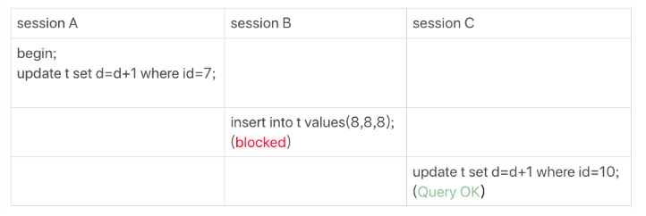
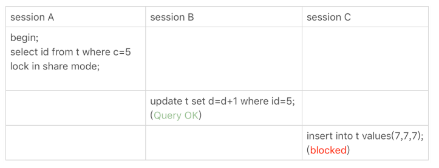
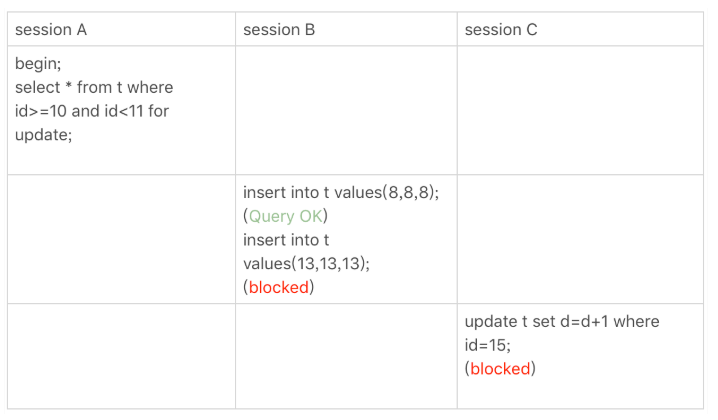
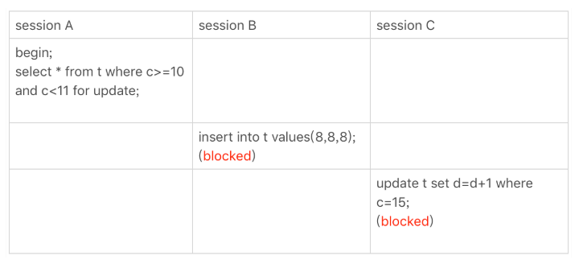
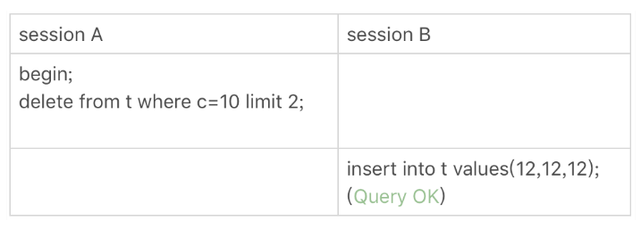
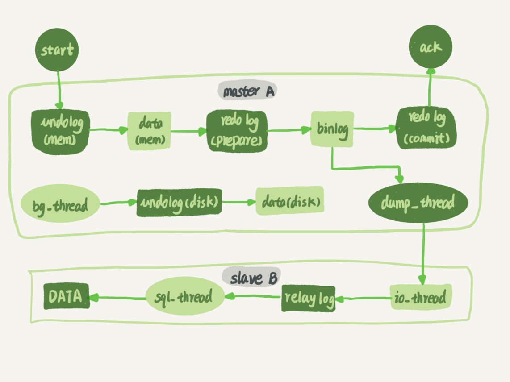
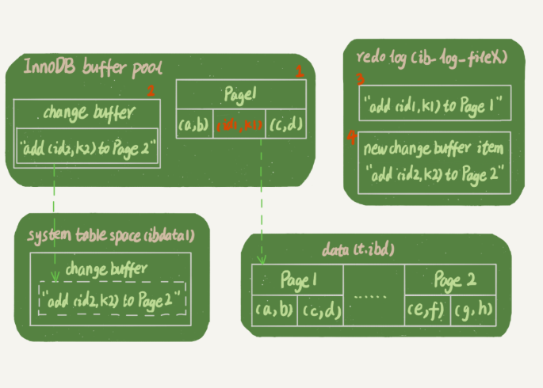
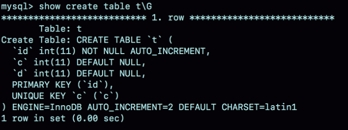

---
hide:
  - navigation
---


[MySQL :: MySQL 8.4 Reference Manual](https://dev.mysql.com/doc/refman/8.4/en/)


## select 语句的执行过程

MySQL 可以分为 **Server 层**和**存储引擎层**两部分。

Server 层包括连接器、查询缓存、分析器、优化器、执行器等，涵盖 MySQL 的大多数核心服务功能，以及所有的内置函数（如日期、时间、数学和加密函数等），所有跨存储引擎的功能都在这一层实现，比如存储过程、触发器、视图等。

而存储引擎层负责数据的存储和提取。其架构模式是插件式的，支持 InnoDB、MyISAM、Memory 等多个存储引擎。现在最常用的存储引擎是 InnoDB，它从 MySQL 5.5.5 版本开始成为了默认存储引擎。


### 连接器

作用：

1. 与客户端进行TCP三次握手建立连接，或是命名管道、共享内存`、`Unix域套接字
2. 校验用户名、密码
3. 校验权限
4. 维持和管理连接


MySQL的最大线程数可以通过参数`max-connections`来控制，如果到来的客户端连接超出该值时，新到来的连接都会被拒绝，关于最大连接数的一些命令主要有两条：

- `show variables like '%max_connections%';`：查询目前`DB`的最大连接数。默认151
- `set GLOBAL max_connections = 200;`：修改数据库的最大连接数为指定值。


MySQL 定义了空闲连接的最大空闲时长，由 `wait_timeout` 参数控制的，默认值是 8 小时（28880秒），如果空闲连接超过了这个时间，连接器就会自动将它断开。

一个处于空闲状态的连接被服务端主动断开后，这个客户端并不会马上知道，等到客户端在发起下一个请求的时候，才会收到这样的报错“ERROR 2013 (HY000): Lost connection to MySQL server during query”。


MySQL 的连接也跟 HTTP 一样，有短连接和长连接的概念。长连接的好处就是可以减少建立连接和断开连接的过程，但是，使用长连接后可能会占用内存增多。有两种解决方式：

第一种，**定期断开长连接**。既然断开连接后就会释放连接占用的内存资源，那么我们可以定期断开长连接。

第二种，**客户端主动重置连接**。MySQL 5.7 版本实现了 `mysql_reset_connection()` 函数的接口，注意这是接口函数不是命令，那么当客户端执行了一个很大的操作后，在代码里调用 mysql_reset_connection 函数来重置连接，达到释放内存的效果。这个过程不需要重连和重新做权限验证，但是会将连接恢复到刚刚创建完时的状态。


### 查询缓存

MySQL 服务收到 SQL 语句后，就会解析出 SQL 语句的第一个字段，看看是什么类型的语句。

如果 SQL 是查询语句（select 语句），MySQL 就会先去查询缓存（ Query Cache ）里查找缓存数据，看看之前有没有执行过这一条命令，这个查询缓存是以 key-value 形式保存在内存中的，key 为 SQL 查询语句，value 为 SQL 语句查询的结果。

MySQL 8.0 版本已经将查询缓存删掉。


### 分析器

第一件事情，**词法分析**。MySQL 会根据你输入的字符串识别出关键字出来，例如，SQL语句 select username from userinfo，在分析之后，会得到4个Token，其中有2个Keyword，分别为select和from。

第二件事情，**语法分析**。根据词法分析的结果，语法解析器会根据语法规则，判断你输入的这个 SQL 语句是否满足 MySQL 语法，如果没问题就会构建出 SQL 语法树，这样方便后面模块获取 SQL 类型、表名、字段名、 where 条件等等。


检查 SQL 查询语句中的表或者字段是否存在也是在分析器中做的。


### 优化器

优化器是在表里面有多个索引的时候，决定使用哪个索引；或者在一个语句有多表关联（join）的时候，决定各个表的连接顺序。

优化器主要负责将 SQL 查询语句的执行方案确定下来。


### 执行器

执行器和存储引擎交互，交互是以记录为单位的。


## update 语句的执行过程

查询语句的那一套流程，更新语句也是同样会走一遍，与查询流程不一样的是，更新流程还涉及两个重要的日志模块：**redo log（重做日志）和 binlog（归档日志）**：

1. 客户端先通过连接器建立连接，连接器自会判断用户身份、权限校验；
2. 因为这是一条 update 语句，所以不需要经过查询缓存，但是表上有更新语句，会把整个表的查询缓存清空。
3. 解析器会通过词法分析识别出关键字 update，表名等等，构建出语法树，接着还会做语法分析，判断输入的语句是否符合 MySQL 语法；
5. 优化器确定执行计划；
6. 执行器负责具体执行。


**执行器和 InnoDB 引擎内部执行流程**：

执行器和 InnoDB 引擎在执行 update 语句时的内部流程：` update T set c=c+1 where ID=2;` 

1. 执行器先找引擎取ID=2这一行。如果ID=2这一行所在的数据页本来就在内存中，就直接返回给执行器；否则，需要先从磁盘读入内存，然后再返回。

2. 执行器拿到引擎给的行数据，把这个值加上1，比如原来是N，现在就是N+1，得到新的一行数据，再调用引擎接口写入这行新数据。

3. 记录 **undo log** 日志。

4. 引擎将这行**新数据更新到内存中**。

5. 将这个更新操作记录到 redo log 里面，此时 **redo log 处于 prepare 状态**。然后告知执行器执行完成了，随时可以提交事务。

6. 执行器生成这个操作的**binlog**，并把binlog写入磁盘。

7. 执行器调用引擎的提交事务接口，引擎把刚刚写入的**redo log改成提交（commit）**状态，更新完成。

8. 数据落盘。


> 图中浅色框表示是在InnoDB内部执行的，深色框表示是在执行器中执行的。


## 存储结构

先来看看 MySQL 数据库的文件存放在哪个目录？

```sh
mysql> SHOW VARIABLES LIKE 'datadir';
+---------------+-----------------+
| Variable_name | Value           |
+---------------+-----------------+
| datadir       | /var/lib/mysql/ |
+---------------+-----------------+
1 row in set (0.00 sec)
```

我们每创建一个 database（数据库） 都会在 /var/lib/mysql/ 目录里面创建一个以 database 为名的目录，然后保存表结构和表数据的文件都会存放在这个目录里。

- db.opt，用来存储当前数据库的默认字符集和字符校验规则。
- 表名.frm ，数据库表的**表结构**会保存在这个文件。在 MySQL 中建立一张表都会生成一个.frm 文件，该文件是用来保存每个表的元数据信息的，主要包含表结构定义。
- 表名.ibd，数据库表的**表数据**会保存在这个文件。 MySQL 中每一张表的数据都存放在一个独立的 .ibd 文件。


`MySQL`中的视图其实是虚拟的表，也就是某个查询语句的一个别名而已，所以在存储`视图`的时候是不需要存储真实的数据的，只需要把它的结构存储起来就行了。和`表`一样，描述视图结构的文件也会被存储到所属数据库对应的子目录下面，只会存储一个`视图名.frm`的文件。


### 表空间

**表空间由段（segment）、区（extent）、页（page）、行（row）组成**，InnoDB存储引擎的逻辑存储结构大致如下图：


**区（extent）**

InnoDB 存储引擎是用 B+ 树来组织数据的。B+ 树中每一层都是通过双向链表连接起来的，如果是以页为单位来分配存储空间，那么链表中相邻的两个页之间的物理位置并不是连续的，可能离得非常远，那么磁盘查询时就会有大量的随机I/O，随机 I/O 是非常慢的。

解决这个问题也很简单，就是让链表中相邻的页的物理位置也相邻，这样就可以使用顺序 I/O 了，那么在范围查询（扫描叶子节点）的时候性能就会很高。

那具体怎么解决呢？

在表中数据量大的时候，为某个索引分配空间的时候就不再按照页为单位分配了，而是按照区（extent）为单位分配。一个区就是在物理位置上连续的64个页。


为了不影响对`B+`树叶子节点中的记录进行顺序扫描，叶子节点和非叶子节点都有自己独有的区，存放叶子节点的区的集合就算是一个段（`segment`），存放非叶子节点的区的集合也算是一个段。


为了内存空间不浪费，为某个段分配存储空间的策略是这样的：

- 在刚开始向表中插入数据的时候，段是从某个碎片区以单个页为单位来分配存储空间的。
- 当某个段已经占用了32个碎片区页之后，就会以完整的区为单位来分配存储空间。


### InnoDB页

`InnoDB`将数据划分为若干个页，以页作为磁盘和内存之间交互的基本单位，InnoDB中页的大小一般为 **16**KB。也就是在一般情况下，一次最少从磁盘中读取16KB的内容到内存中，一次最少把内存中的16KB内容刷新到磁盘中。


- `User Records`：真实存储我们插入的记录的部分，大小不固定。
- `Free Space`：页中尚未使用的部分，大小不确定。
- `Page Directory`：页中的某些记录相对位置，也就是各个槽在页面中的地址偏移量，大小不固定，插入的记录越多，这个部分占用的空间越多。

每个数据页的`File Header`部分都有上一个和下一个页的编号，所以所有的数据页会组成一个`双链表`。


每个记录的头信息中都有一个`next_record`属性，从而使页中的所有记录串联成一个`单链表`。

`InnoDB`会为把页中的记录划分为若干个组，每个组的最后一个记录的地址偏移量作为一个`槽`，存放在`Page Directory`中，所以在一个页中根据主键查找记录是非常快的，分为两步：

- 通过二分法确定该记录所在的槽。
- 通过记录的next_record属性遍历该槽所在的组中的各个记录。


### InnoDB 行格式

InnoDB 提供了 4 种行格式，分别是 `Compact`、`Redundant`、`Dynamic`和`Compressed`行格式。

```sh
mysql> CREATE TABLE record_format_demo (
    ->     c1 VARCHAR(10),
    ->     c2 VARCHAR(10) NOT NULL,
    ->     c3 CHAR(10),
    ->     c4 VARCHAR(10)
    -> ) CHARSET=ascii ROW_FORMAT=COMPACT;
Query OK, 0 rows affected (0.03 sec)

mysql> SELECT * FROM record_format_demo;
+------+-----+------+------+
| c1   | c2  | c3   | c4   |
+------+-----+------+------+
| aaaa | bbb | cc   | d    |
| eeee | fff | NULL | NULL |
+------+-----+------+------+
2 rows in set (0.00 sec)

mysql>
```

Compact 行格式：


一条完整的记录其实可以被分为**`记录的额外信息`**和**`记录的真实数据`**两大部分。

#### **记录的额外信息**

**（1）变长字段长度列表**

`MySQL`支持一些变长的数据类型，比如`VARCHAR(M)`、`VARBINARY(M)`、各种`TEXT`类型，各种`BLOB`类型，也可以把拥有这些数据类型的列称为`变长字段`，变长字段中存储多少字节的数据是不固定的，所以我们在存储真实数据的时候需要顺便把这些数据占用的字节数也存起来，这样才不至于把`MySQL`服务器搞懵，所以这些变长字段占用的存储空间分为两部分：

1. 真正的数据内容
2. 占用的字节数

在`Compact`行格式中，把所有变长字段的真实数据占用的字节长度都存放在记录的开头部位，从而形成一个变长字段长度列表，各变长字段数据占用的字节数按照列的顺序**逆序存放**。

| 列名 | 存储内容 | 内容长度（十进制表示） | 内容长度（十六进制表示） |
| ---- | -------- | ---------------------- | ------------------------ |
| `c1` | `'aaaa'` | `4`                    | `0x04`                   |
| `c2` | `'bbb'`  | `3`                    | `0x03`                   |
| `c4` | `'d'`    | `1`                    | `0x01`                   |

表的`c1`、`c2`、`c4`列都是`VARCHAR(10)`类型的，又因为这些长度值需要按照列的逆序存放，所以最后`变长字段长度列表`的字节串用十六进制表示的效果就是（各个字节之间实际上没有空格）：


由于第一行记录中`c1`、`c2`、`c4`列中的字符串都比较短，也就是说内容占用的字节数比较小，用1个字节就可以表示，但是如果变长列的内容占用的字节数比较多，可能就需要用2个字节来表示。具体用1个还是2个字节来表示真实数据占用的字节数，`InnoDB`有它的一套规则，我们首先声明一下`W`、`M`和`L`的意思：

1. 假设某个字符集中表示一个字符最多需要使用的字节数为`W`，也就是使用`SHOW CHARSET`语句的结果中的`Maxlen`列，比方说`utf8`字符集中的`W`就是`3`，`gbk`字符集中的`W`就是`2`，`ascii`字符集中的`W`就是`1`。
2. 对于变长类型`VARCHAR(M)`来说，这种类型表示能存储最多`M`个**字符**（注意是字符不是字节），所以这个类型能表示的字符串最多占用的字节数就是`M×W`。
3. 假设它实际存储的字符串占用的字节数是`L`。

所以确定使用1个字节还是2个字节表示真正字符串占用的字节数的规则就是这样：

- 如果`M×W <= 255`，那么使用1个字节来表示真正字符串占用的字节数。
- 如果`M×W > 255`，则分为两种情况：
  - 如果`L <= 127`，则用1个字节来表示真正字符串占用的字节数。
  - 如果`L > 127`，则用2个字节来表示真正字符串占用的字节数。

> InnoDB在读记录的变长字段长度列表时先查看表结构，如果某个变长字段允许存储的最大字节数大于255时，该怎么区分它正在读的某个字节是一个单独的字段长度还是半个字段长度呢？设计InnoDB的大佬使用该字节的第一个二进制位作为标志位：如果该字节的第一个位为0，那该字节就是一个单独的字段长度（使用一个字节表示不大于127的二进制的第一个位都为0），如果该字节的第一个位为1，那该字节就是半个字段长度。
>
> 对于一些占用字节数非常多的字段，比方说某个字段长度大于了16KB，那么如果该记录在单个页面中无法存储时，InnoDB会把一部分数据存放到所谓的溢出页中，在变长字段长度列表处只存储留在本页面中的长度，所以使用两个字节也可以存放下来。


如果该可变字段允许存储的最大字节数（`M×W`）超过255字节并且真实存储的字节数（`L`）超过127字节，则使用2个字节，否则使用1个字节。


> **每个数据库表的行格式都有「变长字段字节数列表」吗？**

当数据表没有变长字段的时候，比如全部都是 int 类型的字段，这时候表里的行格式就不会有「变长字段长度列表」了，因为没必要，不如去掉以节省空间。


**（2）NULL值列表**

表中的某些列可能会存储 NULL 值，如果把这些 NULL 值都放到记录的真实数据中会比较浪费空间，所以 Compact 行格式把这些值为 NULL 的列存储到 NULL值列表中。

将每个允许存储`NULL`的列对应一个二进制位，二进制位按照列的顺序逆序排列，如果表中没有允许存储 NULL 的列，则 *NULL值列表* 也不存在。

`MySQL`规定`NULL值列表`必须用整数个字节的位表示，如果使用的二进制位个数不是整数个字节，则在字节的高位补`0`。


> **每个数据库表的行格式都有「NULL 值列表」吗？**

**当数据表的字段都定义成 NOT NULL 的时候，这时候表里的行格式就不会有 NULL 值列表了**。

所以在设计数据库表的时候，通常都是建议将字段设置为 NOT NULL，这样可以至少节省 1 字节的空间


**（3）记录头信息**

记录头信息中包含的内容很多：

- delete_mask ：标识此条数据是否被删除。
- record_type：表示当前记录的类型，`0`表示普通记录，`1`表示B+树非叶节点记录，`2`表示最小记录，`3`表示最大记录
- n_owned：表示当前记录拥有的记录数
- next_record：表示下一条记录的相对位置。
- 等等


不论我们怎么对页中的记录做增删改操作，InnoDB始终会维护一条记录的单链表，链表中的各个节点是按照主键值由小到大的顺序连接起来的。


> next_record这个指针为什么要指向记录头信息和真实数据之间的位置呢？为什么不干脆指向整条记录的开头位置，也就是记录的额外信息开头的位置呢？
>
> 因为这个位置刚刚好，向左读取就是记录头信息，向右读取就是真实数据。我们前面还说过变长字段长度列表、NULL值列表中的信息都是逆序存放，这样可以使记录中位置靠前的字段和它们对应的字段长度信息在内存中的距离更近，可能会提高高速缓存的命中率。


#### 记录的真实数据

记录真实数据部分除了我们定义的字段，`MySQL`会为每个记录默认的添加一些列（也称为`隐藏列`），具体的列如下：

| 列名             | 是否必须 | 占用空间 | 描述                                                         |
| ---------------- | -------- | -------- | ------------------------------------------------------------ |
| `row_id`         | 否       | `6`字节  | 行ID，唯一标识一条记录。如果既没有指定主键，又没有`Unique`键，那么 InnoDB 就会为记录添加 row_id 隐藏字段。 |
| `transaction_id` | 是       | `6`字节  | 事务ID                                                       |
| `roll_pointer`   | 是       | `7`字节  | 回滚指针                                                     |


#### varchar(n) 中 n 最大取值为多少？

**MySQL 规定除了 TEXT、BLOBs 这种大对象类型之外，其他所有的列（不包括隐藏列和记录头信息）占用的字节长度加起来不能超过 65535 个字节**。

要算 varchar(n) 最大能允许存储的字节数，还要看数据库表的字符集，因为字符集代表着1个字符要占用多少字节，比如 ascii 字符集， 1 个字符占用 1 字节。

存储字段类型为 varchar(n) 的数据时，其实分成了三个部分来存储：

- 真实数据
- 真实数据占用的字节数
- `NULL`值标识，如果该列有`NOT NULL`属性则可以没有这部分存储空间

所以，我们在算 varchar(n) 中 n 最大值时，需要减去 「变长字段长度列表」和 「NULL 值列表」所占用的字节数的。

```sql
CREATE TABLE test ( 
`name` VARCHAR(65532)  NULL
) ENGINE = InnoDB DEFAULT CHARACTER SET = ascii ROW_FORMAT = COMPACT;
```

上述例子，在数据库表只有一个 varchar(n) 字段且字符集是 ascii 的情况下，varchar(n) 中 n 最大值 = 65535 - 2 - 1 = 65532。

> 如果`VARCHAR(M)`类型的列使用的不是`ascii`字符集，在列的值允许为`NULL`的情况下，`gbk`字符集表示一个字符最多需要`2`个字节，那在该字符集下，`M`的最大取值就是`32766`（也就是：65532/2），也就是说最多能存储`32766`个字符；
>
> `utf8`字符集表示一个字符最多需要`3`个字节，那在该字符集下，`M`的最大取值就是`21844`，就是说最多能存储`21844`（也就是：65532/3）个字符。


#### 行溢出后，MySQL 是怎么处理的？

MySQL 中磁盘和内存交互的基本单位是页，一个页的大小一般是 `16KB`，也就是 `16384字节`，而一个 varchar(n) 类型的列最多可以存储 `65532字节`，一些大对象如 TEXT、BLOB 可能存储更多的数据，这时一个页可能就存不了一条记录。这个时候就会**发生行溢出，多的数据就会存到另外的「溢出页」中**。

当发生行溢出时，在记录的真实数据处只会保存该列的一部分数据，而把剩余的数据放在「溢出页」中，然后**真实数据处用 20 字节存储指向溢出页的地址**，从而可以找到剩余数据所在的页。


## 索引

在 MySQL 中，索引是在存储引擎层实现的。每一个索引在 InnoDB 里面对应一棵 B+ 树。

按「数据结构」分类：B+tree索引、Hash索引、全文索引。

按「物理存储」分类：聚簇索引（主键索引）、二级索引（辅助索引）。

按「字段特性」分类：主键索引、唯一索引、普通索引、前缀索引。

按「字段个数」分类：单列索引、联合索引。

### B+Tree索引

`InnoDB`是使用页来作为管理存储空间的基本单位，复用了数据页来存储目录项，并使用记录头信息里的`record_type`属性区分一条记录是普通的用户记录还是目录项记录。

目录项记录中只存储主键值和对应的页号。

- `0`：普通的用户记录
- `1`：目录项记录
- `2`：最小记录
- `3`：最大记录


如果我们表中的数据非常多则会产生很多存储`目录项记录`的页，那我们怎么根据主键值快速定位一个存储`目录项记录`的页呢？其实也简单，为这些存储`目录项记录`的页再生成一个更高级的目录，就像是一个多级目录一样，大目录里嵌套小目录，小目录里才是实际的数据。随着表中记录的增加，这个目录的层级会继续增加，最终形成B+树。


***1、B+Tree vs 二叉树***

对于有 N 个叶子节点的 B+Tree，其搜索复杂度为`O(logdN)`，其中 d 表示节点允许的最大子节点个数为 d 个。

在实际的应用当中， d 值是大于100的，这样就保证了，即使数据达到千万级别时，B+Tree 的高度依然维持在 3~4 层左右，也就是说一次数据查询操作只需要做 3~4 次的磁盘 I/O 操作就能查询到目标数据。

而二叉树的每个父节点的儿子节点个数只能是 2 个，意味着其搜索复杂度为 `O(logN)`，这已经比 B+Tree 高出不少，因此二叉树检索到目标数据所经历的磁盘 I/O 次数要更多。如果索引的字段值是按顺序增长的，二叉树会转变为链表结构，检索的过程和全表扫描无异。

**2、B+Tree vs 红黑树**

红黑树虽然对比二叉树来说，树高有所降低，但数据量一大时，依旧会有很大的高度。每个节点中只存储一个数据，节点之间还是不连续的，依旧无法利用局部性原理。

***3、B+Tree vs B Tree***

B+Tree 只在叶子节点存储数据，而 B 树 的非叶子节点也要存储数据，所以 B+Tree 的单个节点的数据量更小，在相同的磁盘 I/O 次数下，就能查询更多的节点。

另外，B+Tree 叶子节点采用的是双链表连接，适合 MySQL 中常见的**范围查询**，而 B 树无法做到这一点。

B+Tree**插入和删除效率更高**，不会涉及复杂的树的变形，查询时间更平均、稳定。

***4、B+Tree vs Hash***

Hash 在做等值查询的时候效率贼快，搜索复杂度为 O(1)。

但是 Hash 表**不适合做范围查询**，它更适合做等值的查询，这也是 B+Tree 索引要比 Hash 表索引有着更广泛的适用场景的原因。

### 聚集索引

**聚簇索引特点**：

1. 使用记录主键值的大小进行记录和页的排序，这包括三个方面的含义：
   - 页内的记录是按照主键的大小顺序排成一个单向链表。
   - 各个存放用户记录的页也是根据页中用户记录的主键大小顺序排成一个双向链表。
   - 存放目录项记录的页分为不同的层次，在同一层次中的页也是根据页中目录项记录的主键大小顺序排成一个双向链表。
2. `B+`树的叶子节点存储的是完整的用户记录。


### 二级索引

**二级索引 c2**：

1. 使用记录`c2`列的大小进行记录和页的排序，这包括三个方面的含义：

   - 页内的记录是按照`c2`列的大小顺序排成一个单向链表。

   - 各个存放用户记录的页也是根据页中记录的`c2`列大小顺序排成一个双向链表。

   - 存放目录项记录的页分为不同的层次，在同一层次中的页也是根据页中目录项记录的`c2`列大小顺序排成一个双向链表。

2. `B+`树的叶子节点存储的并不是完整的用户记录，而只是`c2列+主键`这两个列的值。

3. 目录项记录中不再是`主键+页号`的搭配，而变成了`c2列+页号`的搭配。


如果查询的数据不在二级索引里，就会先检索二级索引，找到对应的叶子节点，获取到主键值后，然后再检索主键索引查询到数据，这个过程就是**回表**。

在查询时使用了二级索引，如果查询的数据能在二级索引里查询的到，那么就不需要回表，这个过程就是**覆盖索引**。

> 为什么我们还需要一次回表操作呢？直接把完整的用户记录放到叶子节点不就好了么？
>
> 如果把完整的用户记录放到叶子节点是可以不用回表，但是太占地方了～相当于每建立一棵`B+`树都需要把所有的用户记录再都拷贝一遍，这就有点太浪费存储空间了。


**回表的代价**？

- 会使用到两个`B+`树索引，一个二级索引，一个聚簇索引。
- 访问二级索引使用`顺序I/O`，访问聚簇索引使用`随机I/O`。


对于二级索引的内节点的目录项记录的内容实际上是由三个部分构成的：

- 索引列的值
- 主键值
- 页号


因为**需要保证在B+树的同一层内节点的目录项记录除`页号`这个字段以外是唯一的**。


### 唯一索引和普通索引

普通索引和唯一索引在查询能力上是没差别的，主要考虑的是对更新性能的影响。所以，建议尽量选择普通索引。


**查询过程**：select id from T where k=5;

- 对于普通索引来说，查找到满足条件的第一个记录 k=5 后，需要查找下一个记录，直到碰到第一个不满足 k=5 条件的记录。
- 对于唯一索引来说，由于索引定义了唯一性，查找到第一个满足条件的记录后，就会停止继续检索。

那么，这个不同带来的性能差距会有多少呢？答案是，**微乎其微**。因为引擎是按页读写的，所以说，当找到 k=5 的记录的时候，它所在的数据页就都在内存里了。不在同一页的概率很低，可以忽略不计。那么，对于普通索引来说，要多做的那一次“查找和判断下一条记录”的操作，就只需要一次指针寻找和一次计算。


**更新过程**：insert into T values(4, 400);

第一种情况是，**这个记录要更新的目标页在内存中**。这时，InnoDB 的处理流程如下：

- 对于唯一索引来说，找到 3 和 5 之间的位置，判断到没有冲突，插入这个值，语句执行结束；
- 对于普通索引来说，找到 3 和 5 之间的位置，插入这个值，语句执行结束。

这样看来，普通索引和唯一索引对更新语句性能影响的差别，只是一个判断，只会耗费微小的 CPU 时间。

第二种情况是，**这个记录要更新的目标页不在内存中**。这时，InnoDB 的处理流程如下：

- 对于唯一索引来说，需要将数据页读入内存，判断到没有冲突，插入这个值，语句执行结束；
- 对于普通索引来说，则是将更新记录在 change buffer，语句执行就结束了。

将数据从磁盘读入内存涉及随机 IO 的访问，是数据库里面成本最高的操作之一。change buffer 因为减少了随机磁盘访问，所以对更新性能的提升是会很明显的。

### 前缀索引

前缀索引的特点是短小精悍，我们可以利用一个字段的前`N`个字符创建索引，相较于使用一个完整字段创建索引，前缀索引能够更加节省存储空间。

但是无法通过前缀索引来完成`ORDER BY、GROUP BY`等分组排序工作，同时也用不上覆盖索引对查询性能的优化了。


当要给字符串创建前缀索引时，有什么方法能够确定我应该使用多长的前缀呢？我们在建立索引时关注的是区分度，区分度越高越好。

遇到前缀的区分度不够好的情况时，我们要怎么办呢？1. 使用倒序存储，再创建前缀索引 2. 使用hash字段索引


### 联合索引

联合索引`idx_name_birthday_phone_number`：

```sql
Index idx_name_birthday_phone_number (name, birthday, phone_number)
```

- 先按照`name`列的值进行排序。
- 如果`name`列的值相同，则按照`birthday`列的值进行排序。
- 如果`birthday`列的值也相同，则按照`phone_number`的值进行排序。

`WHERE`子句中的几个搜索条件的顺序对查询结果有什么影响么？也就是说如果我们调换`name`、`birthday`、`phone_number`这几个搜索列的顺序对查询的执行过程有影响么？比方说写成下面这样：

```sql
SELECT * FROM person_info WHERE birthday = '1990-09-27' AND phone_number = '15123983239' AND name = 'Ashburn';
```

答案是：**没影响**。`MySQL`查询优化器会分析这些搜索条件并且按照可以使用的索引中列的顺序来决定先使用哪个搜索条件，后使用哪个搜索条件。


**（1）匹配左边的列**

**如果我们想使用联合索引中尽可能多的列，查询条件中的各个列必须是联合索引中从最左边连续的列**。

比方说联合索引`idx_name_birthday_phone_number`中列的定义顺序是`name`、`birthday`、`phone_number`，不能跳过`name`列直接根据`birthday`的值去查找。

```sql
SELECT * FROM person_info WHERE name = 'Ashburn' AND phone_number = '15123983239';
```

这样只能用到`name`列的索引，`birthday`和`phone_number`的索引就用不上了，因为`name`值相同的记录先按照`birthday`的值进行排序，`birthday`值相同的记录才按照`phone_number`值进行排序。


**（2）匹配列前缀**

字符串前缀都是排好序的，所以对于字符串类型的索引列来说，我们只匹配它的前缀也是可以快速定位记录的，比方说我们想查询名字以`'As'`开头的记录，那就可以这么写查询语句：

```sql
SELECT * FROM person_info WHERE name LIKE 'As%';
```

但是需要注意的是，如果只给出后缀或者中间的某个字符串，比如这样：

```sql
SELECT * FROM person_info WHERE name LIKE '%As%';
```

`MySQL`就无法快速定位记录位置了，因为字符串中间有`'As'`的字符串并没有排好序，所以只能全表扫描了。


**（3）匹配范围值**

**如果对多个列同时进行范围查找的话，只有对索引最左边的那个列进行范围查找的时候才能用到`B+`树索引**，比方说这样：

```sql
SELECT * FROM person_info WHERE name > 'Asa' AND name < 'Barlow' AND birthday > '1980-01-01';
```

上面这个查询可以分成两个部分：

1. 通过条件`name > 'Asa' AND name < 'Barlow' `来对`name`进行范围，查找的结果可能有多条`name`值不同的记录，
2. 对这些`name`值不同的记录继续通过`birthday > '1980-01-01'`条件继续过滤。

这样子对于联合索引`idx_name_birthday_phone_number`来说，只能用到`name`列的部分，而用不到`birthday`列的部分，因为只有`name`值相同的情况下才能用`birthday`列的值进行排序，而这个查询中通过`name`进行范围查找的记录中可能并不是按照`birthday`列进行排序的，所以在搜索条件中继续以`birthday`列进行查找时是用不到这个`B+`树索引的。


> **`select * from t_table where a > 1 and b = 2`，联合索引（a, b）哪一个字段用到了联合索引的 B+Tree？**

由于联合索引（二级索引）是先按照 a 字段的值排序的，所以符合 a > 1 条件的二级索引记录肯定是相邻，于是在进行索引扫描的时候，可以定位到符合 a > 1 条件的第一条记录，然后沿着记录所在的链表向后扫描，直到某条记录不符合 a > 1 条件位置。所以 a 字段可以在联合索引的 B+Tree 中进行索引查询。

但是在符合 a > 1 条件的二级索引记录的范围里，b 字段的值是无序的。所以 b 字段无法利用联合索引进行索引查询。

这条查询语句只有 a 字段用到了联合索引进行索引查询，而 b 字段并没有使用到联合索引。


> **`select * from t_table where a >= 1 and b = 2`，联合索引（a, b）哪一个字段用到了联合索引的 B+Tree？**

由于联合索引（二级索引）是先按照 a 字段的值排序的，所以符合 >= 1 条件的二级索引记录肯定是相邻，于是在进行索引扫描的时候，可以定位到符合 >= 1 条件的第一条记录，然后沿着记录所在的链表向后扫描，直到某条记录不符合 a>= 1 条件位置。所以 a 字段可以在联合索引的 B+Tree 中进行索引查询。

虽然在符合 a>= 1 条件的二级索引记录的范围里，b 字段的值是「无序」的，但是对于符合 a = 1 的二级索引记录的范围里，b 字段的值是「有序」的.

于是，在确定需要扫描的二级索引的范围时，当二级索引记录的 a 字段值为 1 时，可以通过 b = 2 条件减少需要扫描的二级索引记录范围。也就是说，从符合 a = 1 and b = 2 条件的第一条记录开始扫描，而不需要从第一个 a 字段值为 1 的记录开始扫描。

所以，这条查询语句 a 和 b 字段都用到了联合索引进行索引查询。


> **`SELECT * FROM t_table WHERE a BETWEEN 2 AND 8 AND b = 2`，联合索引（a, b）哪一个字段用到了联合索引的 B+Tree？**

在 MySQL 中，BETWEEN 包含了 value1 和 value2 边界值，类似于 >= and =<，所以这条查询语句 a 和 b 字段都用到了联合索引进行索引查询。


> **`SELECT * FROM t_user WHERE name like 'j%' and age = 22`，联合索引（name, age）哪一个字段用到了联合索引的 B+Tree？**

由于联合索引（二级索引）是先按照 name 字段的值排序的，所以前缀为 ‘j’ 的 name 字段的二级索引记录都是相邻的， 于是在进行索引扫描的时候，可以定位到符合前缀为 ‘j’ 的 name 字段的第一条记录，然后沿着记录所在的链表向后扫描，直到某条记录的 name 前缀不为 ‘j’ 为止。

虽然在符合前缀为 ‘j’ 的 name 字段的二级索引记录的范围里，age 字段的值是「无序」的，但是对于符合 name = j 的二级索引记录的范围里，age字段的值是「有序」的

所以，这条查询语句 a 和 b 字段都用到了联合索引进行索引查询。


**（4）用于排序**

如果`ORDER BY`子句里使用到了索引列，就有可能省去在内存或文件中排序的步骤，比如下面这个简单的查询语句：

```sql
SELECT * FROM person_info ORDER BY name, birthday, phone_number LIMIT 10;
```

这个查询的结果集需要先按照`name`值排序，如果记录的`name`值相同，则需要按照`birthday`来排序，如果`birthday`的值相同，则需要按照`phone_number`排序。因为这个`B+`树索引本身就是按照上述规则排好序的，所以直接从索引中提取数据，然后进行回表操作取出该索引中不包含的列就好了。


不能使用索引排序的情况：

1. ASC、DESC混用
2. WHERE子句中出现非排序使用到的索引列，例如：`SELECT * FROM person_info WHERE country = 'China' ORDER BY name LIMIT 10;`
3. 排序的多个列不是一个索引里的，例如：`SELECT * FROM person_info ORDER BY name, country LIMIT 10;`
4. 排序列使用了复杂的表达式，例如：`SELECT * FROM person_info ORDER BY UPPER(name) LIMIT 10;`


**索引下推**

使用联合索引插叙数据时，将部分查询条件下推到存储引擎层过滤，减少从表中读取数据行。

对于联合索引（a, b），在执行 `select * from table where a > 1 and b = 2` 语句的时候，只有 a 字段能用到索引，那在联合索引的 B+Tree 找到第一个满足条件的主键值后，还需要判断其他条件是否满足（看 b 是否等于 2），那是在联合索引里判断？还是回表通过主键索引找出数据行去判断呢？

- 在 MySQL 5.6 之前，只能一个个回表，到主键索引上找出数据行，返回给server层再对比 b 字段值。
- 而 MySQL 5.6 引入的**索引下推优化**（index condition pushdown)， 可以在联合索引遍历过程中，对联合索引中包含的字段先做判断，直接过滤掉不满足条件的记录，减少回表次数。


### 索引设计原则

什么时候适合索引？

1. 针对数据量较大，且查询比较繁琐的表建立索引；
2. 针对于常作为查询条件（where），排序（order by），分组(group by)操作的字段，建立索引；
3. 尽量选择区分度高的列作为索引，尽量建立唯一索引，区分度越高使用索引的效率越高；
4. 索引列的类型尽可能小：数据类型越小，在查询时进行的比较操作越快、索引占用的存储空间就越少；
5. 如果是字符串类型的字段，字段的长度过长，可以针对字段的特点，建立前缀索引；
6. 建立联合索引，应当遵循最左前缀原则，将多个字段之间按优先级顺序组合；
7. 尽量使用联合索引，减少单列索引，查询时，联合索引很多时候可以覆盖索引，节省存储空间，避免回表，提高查询效率；
8. 要控制索引的数量，索引并不是多多益善，索引越多，维护索引结构的代价也就越大，会影响增删改的效率；
9. 表的主外键或连表字段，必须建立索引，因为能很大程度提升连表查询的性能。


什么时候不适合索引？

1. 大量重复值的字段和低频查询的字段。
2. 当表的数据较少，不应当建立索引，因为数据量不大时，维护索引反而开销更大。
3. 经常增删改的字段，因为索引字段频繁修改，由于要维护 B+Tree的有序性，那么就需要频繁的重建索引，这个过程是会影响数据库性能。
4. 索引不能参与计算，因此经常带函数查询的字段，并不适合建立索引。
5. 一张表中的索引数量并不是越多越好，一般控制在`3`，最多不能超过`5`。
6. 索引的字段值无序时，不推荐建立索引，因为会造成页分裂（在对页中的记录进行增删改操作的过程中，我们必须通过一些诸如记录移动的操作来始终保证这个状态一直成立：下一个数据页中用户记录的主键值必须大于上一个页中用户记录的主键值。这个过程我们也可以称为页分裂。），尤其是主键索引。


### 索引失效

1. 左或左右模糊查询 `like %x 或者 like %x%`。 因为索引 B+ 树是按照「索引值」有序排列存储的，只能根据前缀进行比较。
2. 查询中对索引做了计算、函数、类型转换操作。因为索引保存的是索引字段的原始值，而不是经过函数计算后的值，自然就没办法走索引了。
3. 联合索引要遵循最左匹配原则
4. 联合索引中，出现范围查询（>,<），范围查询右侧的列索引失效。
5. 在 WHERE 子句中，如果 OR 前后有条件列c不是索引列，那么索引会失效。因为在索引中定位记录阶段用不到c，这个条件是在回表获取了完整的用户记录后才使用的。所以会为某个索引确定范围区间的时候把用不到相关索引的搜索条件替换为`TRUE`。
6. 隐式类型转换 或 隐式字符编码转换


**索引隐式类型转换**：

如果索引字段是字符串类型，但是在条件查询中，输入的参数是整型的话，你会在执行计划的结果发现这条语句会走全表扫描；

但是如果索引字段是整型类型，查询条件中的输入参数即使是字符串，也不会导致索引失效，还是可以走索引扫描。

MySQL 在遇到字符串和数字比较的时候，会自动把字符串转为数字，然后再进行比较。验证：` select “10” > 9;`


### 索引合并

#### Intersection合并

`Intersection`翻译过来的意思是交集，是说某个查询可以使用多个二级索引，将从多个二级索引中查询到的结果取交集。比方说下面这个查询：

```sql
SELECT * FROM single_table WHERE key1 = 'a' AND key3 = 'b';
```

假设这个查询使用`Intersection`合并的方式执行的话，那这个过程就是这样的：

1. 从`idx_key1`二级索引对应的`B+`树中取出`key1 = 'a'`的相关记录。

2. 从`idx_key3`二级索引对应的`B+`树中取出`key3 = 'b'`的相关记录。

3. 二级索引的记录都是由`索引列 + 主键`构成的，所以我们可以计算出这两个结果集中`id`值的交集。

4. 按照上一步生成的`id`值列表进行回表操作，也就是从聚簇索引中把指定`id`值的完整用户记录取出来，返回给用户。

虽然读取多个二级索引比读取一个二级索引消耗性能，但是读取二级索引的操作是`顺序I/O`，而回表操作是`随机I/O`，所以如果只读取一个二级索引时需要回表的记录数特别多，而读取多个二级索引之后取交集的记录数非常少，当节省的因为`回表`而造成的性能损耗比访问多个二级索引带来的性能损耗更高时，读取多个二级索引后取交集比只读取一个二级索引的成本更低。


`MySQL`在某些特定的情况下才可能会使用到`Intersection`索引合并：

1. 二级索引列是等值匹配的情况，对于联合索引来说，在联合索引中的每个列都必须等值匹配，不能出现只匹配部分列的情况。
2. 主键列可以是范围匹配。例如，`SELECT * FROM single_table WHERE key1 = 'a' AND id > 100;`，可以在从`idx_key1`中获取到的主键值上直接运用条件`id > 100`过滤就行。


#### Union合并

`MySQL`在某些特定的情况下才可能会使用到`Union`索引合并：

1. 二级索引列是等值匹配的情况，对于联合索引来说，在联合索引中的每个列都必须等值匹配，不能出现只出现匹配部分列的情况。
2. 主键列可以是范围匹配
3. 使用`Intersection`索引合并的搜索条件


## 事务

在 MySQL 中，事务支持是在引擎层实现的，并不是所有的引擎都支持事务。比如 MySQL 原生的 MyISAM 引擎就不支持事务，这也是 MyISAM 被 InnoDB 取代的重要原因之一。

**事务的特性**：

* 原子性：一个事务中的所有操作，要么全部完成，要么全部失败。

* 一致性：是指事务操作前和操作后，数据满足完整性约束，数据库保持一致性状态。

* 隔离性：多个事务同时使用相同的数据时，不会相互干扰，每个事务都有一个完整的数据空间，对其他并发事务是隔离的。

* 持久性：一个事务一旦被提交，它会保持永久性，所更改的数据都会被写入到磁盘做持久化处理。


**InnoDB 引擎通过什么技术来保证事务的这四个特性的呢？**

- 持久性是通过 redo log （重做日志）来保证的，宕机后能数据恢复；
- 原子性是通过 undo log（回滚日志） 来保证的，事务能够进行回滚；
- 隔离性是通过 MVCC（多版本并发控制） 或锁机制来保证的；
- 一致性则是通过持久性+原子性+隔离性来保证；


**并行事务会引发的问题**：

* 脏写：一个事务修改了另一个未提交事务修改过的数据；

* 脏读：一个事务读到了另一个未提交事务修改过的数据；

* 不可重复读：一个事务内，前后读取的数据不一致（针对同一条数据）；

* 幻读：一个事务按照某个相同条件多次读取记录时，后读取时读到了之前没有读到的记录。

严重性：脏读 > 不可重读读 > 幻读

> 产生幻读的原因是，行锁只能锁住行，但是新插入记录这个动作，要更新的是记录之间的“间隙”。
>
> 因此，为了解决幻读问题，InnoDB 只好引入新的锁，也就是间隙锁 (Gap Lock)。
>
> 幻读说明：
>
> 1. 在可重复读隔离级别下，普通的查询是快照读，是不会看到别的事务插入的数据的。因此，幻读在“当前读”下才会出现。
>
> 2. 幻读仅专指“新插入的行”。


### 隔离级别

- 读未提交（read uncommitted），指一个事务还没提交时，它做的变更就能被其他事务看到；
- 读提交（read committed），指一个事务提交之后，它做的变更才能被其他事务看到；
- 可重复读（repeatable read），指一个事务执行过程中看到的数据，一直跟这个事务启动时看到的数据是一致的。MySQL InnoDB 引擎的默认隔离级别；
- 串行化（serializable）；会对记录加上读写锁，在多个事务对这条记录进行读写操作时，如果发生了读写冲突的时候，后访问的事务必须等前一个事务执行完成，才能继续执行；


**这四种隔离级别具体是如何实现的呢？**

- 对于「读未提交」隔离级别的事务来说，由于可以读到未提交事务修改过的记录，所以直接读取记录的最新版本就好了；
- 对于「串行化」隔离级别的事务来说，所有写操作加临键锁，所有读操作加共享锁；
- 对于「读提交」和「可重复读」隔离级别的事务来说，它们是通过 （读视图）Read View 来实现的，它们的区别在于创建 Read View 的时机不同，**「读提交」隔离级别是在「每个语句执行前」都会重新生成新 Read View**，而**「可重复读」隔离级别是「第一次执行语句时」生成一个 Read View**，然后整个事务期间都在用这个 Read View。


MySql默认隔离级别是可重复读，但很多大公司改为读已提交，目的是提高并发和降低死锁概率。


### MVCC

在`MySQL`众多的开源存储引擎中，几乎只有`InnoDB`实现了`MVCC`机制，仅在`RC`读已提交级别、`RR`可重复读级别才会使用`MVCC`机制。

#### 版本链

对于使用`InnoDB`存储引擎的表来说，它的聚簇索引记录中都包含两个必要的隐藏列：

- `trx_id`：每次一个事务对某条聚簇索引记录进行改动时，都会把该事务的`事务id`赋值给`trx_id`隐藏列。
- `roll_pointer`：每次对某条聚簇索引记录进行改动时，都会把旧的版本写入到`undo日志`中，然后这个隐藏列就相当于一个指针，可以通过它来找到该记录修改前的信息。

对记录每次更新后，都会将旧值放到一条`undo日志`中，就算是该记录的一个旧版本，随着更新次数的增多，所有的版本都会被`roll_pointer`属性连接成一个链表，称之为`版本链`，版本链的头节点就是当前记录最新的值。

#### ReadView

Read View 中的字段：

* `m_ids`：表示在生成当前`ReadView`时，系统内活跃的事务`ID`列表。
* `min_trx_id`：活跃的事务列表中，最小的事务`ID`。
* `max_trx_id`：表示在生成当前`ReadView`时，系统中要给下一个事务分配的`ID`值。
* `creator_trx_id`：代表创建当前这个`ReadView`的事务`ID`。


对于当前事务的启动瞬间来说，一个数据版本的 trx_id，有以下几种可能：

1.  如果落在绿色部分，表示这个版本是已提交的事务或者是当前事务自己生成的，这个数据是可见的；
2.  如果落在红色部分，表示这个版本是由将来启动的事务生成的，是肯定不可见的；
3.  如果落在黄色部分，那就包括两种情况：
   1. 若 trx_id 在数组中，表示这个版本是由还没提交的事务生成的，不可见；
   2. 若 trx_id 不在数组中，表示这个版本是已经提交了的事务生成的，可见。

如果某个版本的数据对当前事务不可见的话，那就顺着版本链找到下一个版本的数据，继续按照上面的步骤判断可见性，依此类推，直到版本链中的最后一个版本。如果最后一个版本也不可见的话，那么就意味着该条记录对该事务完全不可见，查询结果就不包含该记录。


> **MySQL 可重复读和幻读**

MySQL InnoDB 引擎的默认隔离级别虽然是「可重复读」，但是它很大程度上避免幻读现象（**并不是完全解决了**），解决的方案有两种：

- 针对**快照读**（普通 select 语句），是**通过 MVCC 方式解决了幻读**，因为可重复读隔离级别下，事务执行过程中看到的数据，一直跟这个事务启动时看到的数据是一致的，即使中途有其他事务插入了一条数据，是查询不出来这条数据的，所以就很好了避免幻读问题。
- 针对**当前读**（select ... for update 等语句，会读取最新的数据），是**通过 next-key lock（记录锁+间隙锁）方式解决了幻读**，因为当执行 select ... for update 语句的时候，会加上 next-key lock，如果有其他事务在 next-key lock 锁范围内执行增、删、改时，就会阻塞，所以就很好了避免幻读问题。


>  **MySQL Innodb 中的 MVCC 并不能完全避免幻读现象**

第一个发生幻读现象的场景：

在可重复读隔离级别下，事务 A 第一次执行普通的 select 语句时生成了一个 ReadView，之后事务 B 向表中新插入了一条 id = 5 的记录并提交。接着，事务 A 对 id = 5 这条记录进行了更新操作，在这个时刻，这条新记录的 trx_id 隐藏列的值就变成了事务 A 的事务 id，之后事务 A 再使用普通 select 语句去查询这条记录时就可以看到这条记录了，于是就发生了幻读。


第二个发生幻读现象的场景：

T1 时刻：事务 A 先执行「快照读语句」：select * from t_test where id > 100 得到了 3 条记录。

T2 时刻：事务 B 往插入一个 id= 200 的记录并提交；

T3 时刻：事务 A 再执行「当前读语句」 select * from t_test where id > 100 for update 就会得到 4 条记录，此时也发生了幻读现象。

**要避免这类特殊场景下发生幻读的现象的话，就是尽量在开启事务之后，马上执行 select ... for update 这类当前读的语句**，因为它会对记录加 next-key lock，从而避免其他事务插入一条新记录。


> **长事务的问题**

1. 长事务锁定的数据较多，容易造成死锁和锁超时
2. 回滚记录占用大量存储空间，如果事务执行失败，回滚时间长。
3. 主从延迟：事务执行完成才会写入binlog，再传给备库。


## 锁

### 全局锁

对整个数据库实例加锁。

使用全局锁 `flush tables with read lock` 后数据库处于**只读**状态，`unlock tables` 释放全局锁，会话断开全局锁自动释放。

应用场景：**全库逻辑备份**

如果数据库的引擎支持的事务支持**可重复读的隔离级别**，那么在备份数据库之前先开启事务，会先创建 Read View，然后整个事务执行期间都在用这个 Read View，而且由于 MVCC 的支持，备份期间业务依然可以对数据进行更新操作。

官方自带的逻辑备份工具是 mysqldump。当 mysqldump 使用参数 `–single-transaction` 的时候，导数据之前就会启动一个事务，来确保拿到一致性视图。而由于 MVCC 的支持，这个过程中数据是可以正常更新的。**single-transaction 方法只适用于所有的表使用事务引擎的库**。


### 表级锁

表级锁包括表锁、元数据锁、意向锁、自增锁

**表锁**

```sh
//表级别的共享锁，也就是读锁；
lock tables t_student read;

//表级别的独占锁，也就是写锁；
lock tables t_stuent write;

// 释放会话所有表锁，会话退出后，也会释放所有表锁
unlock tables;
```

表锁除了会限制别的线程的读写外，也会限制本线程接下来的读写操作。表锁的颗粒度太大，尽量避免使用。


**元数据锁（Meta Data Lock）**

不需要显示的使用 MDL，对数据库表进行操作时，会自动给这个表加上 MDL。

MDL 是为了保证当用户对表执行 CRUD 操作时，**防止其他线程对这个表结构做了变更**。

对一张表进行 CRUD 操作时，加的是 MDL 读锁；对一张表做结构变更操作的时候，加的是 MDL 写锁；读锁之间不互斥，读写锁之间、写锁之间是互斥的。

MDL 是在事务提交后才会释放，事务执行期间，MDL 是一直持有的。

申请 MDL 锁的操作会形成一个队列，队列中写锁获取优先级高于读锁，一旦出现 MDL 写锁等待，会阻塞后续该表的所有 CRUD 操作。


**意向锁（Intention Lock）**

意向锁的提出仅仅为了在之后加表级别的S锁和X锁时可以快速判断表中的记录是否被上锁，以**避免用遍历的方式来查看表中有没有上锁的记录**。

- 在使用 InnoDB 引擎的表里对某些记录加上「共享锁」之前，需要先在表级别加上一个「意向共享锁」；
- 在使用 InnoDB 引擎的表里对某些纪录加上「独占锁」之前，需要先在表级别加上一个「意向独占锁」；

当执行插入、更新、删除操作，需要先对表加上「意向独占锁」，然后对该记录加独占锁。而普通的 select 是不会加行级锁的，普通的 select 语句是利用 MVCC 实现一致性读，是无锁的。

意向共享锁和意向独占锁是表级锁，不会和行级的共享锁和独占锁发生冲突，而且意向锁之间也不会发生冲突，只会和共享表锁和独占表锁发生冲突。


**自增锁（AUTO-INC Lock）**

声明 `AUTO_INCREMENT` 属性的字段数据库自动赋递增的值，主要是通过 AUTO-INC 锁实现的。

在插入数据时，会加一个表级别的 AUTO-INC 锁，然后为被 `AUTO_INCREMENT` 修饰的字段赋值递增的值，等**插入语句执行完成后，把 AUTO-INC 锁释放掉**。

在 MySQL 5.1.22 版本开始，InnoDB 存储引擎提供了一种轻量级的锁来实现自增。一样也是在插入数据的时候，会为被 `AUTO_INCREMENT` 修饰的字段加上轻量级锁，然后给该字段赋值一个自增的值，就把这个轻量级锁释放了，而不需要等待整个插入语句执行完后才释放锁。


### 行级锁

在 InnoDB 事务中，行锁是在需要的时候才加上的，但并不是不需要了就立刻释放，而是要等到事务结束时才释放。这个就是两阶段锁协议。

如果你的事务中需要锁多个行，要把最可能造成锁冲突、最可能影响并发度的锁尽量往后放。


行级锁包括记录锁、间隙锁、临键锁、插入意向锁

在读已提交隔离级别下，行级锁的种类只有记录锁，也就是仅仅把一条记录锁上。

在可重复读隔离级别下，行级锁的种类除了有记录锁，还有间隙锁（目的是为了避免幻读）


**记录锁（Record Lock）**

记录锁，也就是仅仅把一条记录锁上；有 S 锁和 X 锁之分


**间隙锁（Gap Lock）**

间隙锁，锁定一个范围，但是不包含记录本身；

间隙锁只存在于**可重复读隔离级别**，目的是为了解决可重复读隔离级别下**幻读**的现象。

跟间隙锁存在冲突关系的，是“往这个间隙中插入一个记录”这个操作。间隙锁之间都不存在冲突关系。


**临键锁（Next-Key Lock）**

临键锁，间隙锁+行锁的组合，锁定一个范围，并且锁定记录本身，即锁定左开右闭的区间。

如果一个事务获取了 X 型的 next-key lock，那么另外一个事务在获取相同范围的 X 型的 next-key lock 时，是会被阻塞的。数据库默认加临键锁。


**插入意向锁（Insert Intention Lock）**

一个事务在插入一条记录的时候，需要判断插入位置是否已被其他事务加了间隙锁（next-key lock 也包含间隙锁）。

如果有的话，插入操作就会发生阻塞，直到拥有间隙锁的那个事务提交为止（释放间隙锁的时刻），在此期间会生成一个插入意向锁，表明有事务想在某个区间插入新记录，但是现在处于等待状态。


### 加锁规则

#### **两个“原则”、两个“优化”和一个“bug”**

1. 原则 1：加锁的对象是索引，加锁的基本单位是 next-key lock。next-key lock 是前开后闭区间。
2. 原则 2：查找过程中访问到的对象才会加锁。
3. 优化 1：索引上的等值查询，给唯一索引加锁的时候，next-key lock 退化为行锁。
4. 优化 2：索引上的等值查询，向右遍历时且最后一个值不满足等值条件的时候，next-key lock 退化为间隙锁。
5. 一个 bug：唯一索引上的范围查询会访问到不满足条件的第一个值为止。


> **有什么命令可以分析加了什么锁？**

`select * from performance_schema.data_locks\G;`

LOCK_TYPE 中的 RECORD 表示行级锁，而不是记录锁的意思。

LOCK_MODE 可以确认是 next-key 锁，还是间隙锁，还是记录锁：

- 如果 LOCK_MODE 为 `X`，说明是 next-key 锁；
- 如果 LOCK_MODE 为 `X, REC_NOT_GAP`，说明是记录锁；
- 如果 LOCK_MODE 为 `X, GAP`，说明是间隙锁；


分析加锁规则的时候可以用 next-key lock 来分析。但是具体执行的时候，是要分成间隙锁和行锁两段来执行的。


#### 唯一索引等值查询

```sql
CREATE TABLE `t` (
  `id` int(11) NOT NULL,
  `c` int(11) DEFAULT NULL,
  `d` int(11) DEFAULT NULL,
  PRIMARY KEY (`id`),
  KEY `c` (`c`)
) ENGINE=InnoDB;
 
insert into t values(0,0,0),(5,5,5),
(10,10,10),(15,15,15),(20,20,20),(25,25,25);
```




由于表 t 中没有 id=7 的记录，所以根据加锁规则：

1. 根据原则 1，加锁单位是 next-key lock，session A 加锁范围就是 (5,10]；
2. 同时根据优化 2，这是一个等值查询 (id=7)，而 id=10 不满足查询条件，next-key lock 退化成间隙锁，因此最终加锁的范围是 (5,10)。

所以，session B 要往这个间隙里面插入 id=8 的记录会被锁住，但是 session C 修改 id=10 这行是可以的。


#### 非唯一索引等值查询



这里 session A 要给索引 c 上 c=5 的这一行加上读锁。

1. 根据原则 1，加锁单位是 next-key lock，因此会给 (0,5] 加上 next-key lock。
2. 要注意 c 是普通索引，因此仅访问 c=5 这一条记录是不能马上停下来的，需要向右遍历，查到 c=10 才放弃。根据原则 2，访问到的都要加锁，因此要给 (5,10] 加 next-key lock。
3. 但是同时这个符合优化 2：等值判断，向右遍历，最后一个值不满足 c=5 这个等值条件，因此退化成间隙锁 (5,10)。
4. 根据原则 2 ，**只有访问到的对象才会加锁**，这个查询使用覆盖索引，并不需要访问主键索引，所以主键索引上没有加任何锁，这就是为什么 session B 的 update 语句可以执行完成。

但 session C 要插入一个 (7,7,7) 的记录，就会被 session A 的间隙锁 (5,10) 锁住。

需要注意，在这个例子中，lock in share mode 只锁覆盖索引，但是如果是 for update 就不一样了。 执行 for update 时，系统会认为你接下来要更新数据，因此会顺便给主键索引上满足条件的行加上行锁。

这个例子说明，锁是加在索引上的；同时，如果你要用 lock in share mode 来给行加读锁避免数据被更新的话，就必须得绕过覆盖索引的优化，在查询字段中加入索引中不存在的字段。比如，将 session A 的查询语句改成 select d from t where c=5 lock in share mode。


#### 唯一索引范围查询



分析：

1. 开始执行的时候，要找到第一个 id=10 的行，因此本该是 next-key lock(5,10]。 根据优化 1， 主键 id 上的等值条件，退化成行锁，只加了 id=10 这一行的行锁。
2. 范围查找就往后继续找，找到 id=15 这一行停下来，因此需要加 next-key lock(10,15]。

所以，session A 这时候锁的范围就是主键索引上，行锁 id=10 和 next-key lock(10,15]。

需要注意，首次 session A 定位查找 id=10 的行的时候，是当做等值查询来判断的，而向右扫描到 id=15 的时候，用的是范围查询判断。


唯一索引范围锁 bug：


session A 是一个范围查询，按照原则 1 的话，应该是索引 id 上只加 (10,15] 这个 next-key lock，并且因为 id 是唯一键，所以循环判断到 id=15 这一行就应该停止了。

但是实现上，InnoDB 会往前扫描到第一个不满足条件的行为止，也就是 id=20。而且由于这是个范围扫描，因此索引 id 上的 (15,20] 这个 next-key lock 也会被锁上。

所以你看到了，session B 要更新 id=20 这一行，是会被锁住的。同样地，session C 要插入 id=16 的一行，也会被锁住。


#### 非唯一索引范围查询



分析：

在第一次用 c=10 定位记录的时候，索引 c 上加了 (5,10] 这个 next-key lock 后，由于索引 c 是非唯一索引，没有优化规则，也就是说不会蜕变为行锁，因此最终 sesion A 加的锁是，索引 c 上的 (5,10] 和 (10,15] 这两个 next-key lock。

所以从结果上来看，sesson B 要插入（8,8,8) 的这个 insert 语句时就被堵住了。

这里需要扫描到 c=15 才停止扫描，是合理的，因为 InnoDB 要扫到 c=15，才知道不需要继续往后找了。


#### 没有索引的查询

如果锁定读查询语句，没有使用索引列作为查询条件，或者查询语句没有走索引查询，导致扫描是全表扫描。那么，每一条记录的索引上都会加 next-key 锁，这样就相当于锁住的全表，这时如果其他事务对该表进行增、删、改操作的时候，都会被阻塞。

不只是锁定读查询语句不加索引才会导致这种情况，update 和 delete 语句如果查询条件不加索引，那么由于扫描的方式是全表扫描，于是就会对每一条记录的索引上都会加 next-key 锁，这样就相当于锁住的全表。

因此，在线上在执行 update、delete、select ... for update 等具有加锁性质的语句，一定要检查语句是否走了索引，如果是全表扫描的话，会对每一个索引加 next-key 锁，相当于把整个表锁住了，这是挺严重的问题。


#### limit 语句加锁

插入记录：

```sql
insert into t values(30,10,30);
```



session A 的 delete 语句加了 limit 2。表 t 里 c=10 的记录其实只有两条，因此加不加 limit 2，删除的效果都是一样的，但是加锁的效果却不同。

delete 语句明确加了 limit 2 的限制，因此在遍历到 (c=10, id=30) 这一行之后，满足条件的语句已经有两条，循环就结束了。因此，索引 c 上的加锁范围是从（c=5,id=5) 到（c=10,id=30) 这个前开后闭区间。

**在删除数据的时候尽量加 limit**。这样不仅可以控制删除数据的条数，让操作更安全，还可以减小加锁的范围。


## 日志

### undo log

undo log 是 Innodb 存储引擎层生成的日志，主要用于事务回滚和 MVCC。

为了实现事务的`原子性`，`InnoDB`存储引擎在实际进行增、删、改一条记录时，都需要**先**把对应的`undo日志`记下来。一般每对一条记录做一次改动，就对应着一条`undo日志`。

`InnoDB`默认是将`Undo-log`存储在`xx.ibdata`共享表数据文件当中，默认采用段的形式存储。

也就是当一个事务尝试写某行表数据时，首先会将旧数据拷贝到`xx.ibdata`文件中，将表中行数据的隐藏字段：`roll_ptr`回滚指针会指向`xx.ibdata`文件中的旧数据，然后再写表上的数据。

那`Undo-log`究竟在`xx.ibdata`文件中怎么存储呢？

在共享表数据文件中，有一块区域名为`Rollback Segment`回滚段，每个回滚段中有`1024`个`Undo-log Segment`，每个`Undo`段可存储一条旧数据，而执行写`SQL`时，`Undo-log`就是写入到这些段中。在`MySQL5.5`版本前，默认只有一个`Rollback Segment`，而在`MySQL5.5`版本后，默认有`128`个回滚段，即支持`128*1024`条`Undo`记录同时存在。

当一个事务需要回滚时，本质上并不会以执行反`SQL`的模式还原数据，而是直接将`roll_ptr`回滚指针指向的`Undo`记录，从`xx.ibdata`共享表数据文件中拷贝到`xx.ibd`表数据文件，覆盖掉原本改动过的数据。


### redo log

如何保证这个`持久性`呢？一个很简单的做法就是在事务提交完成之前把该事务所修改的所有页面都刷新到磁盘，但是这个简单粗暴的做法有些问题：

- 刷新一个完整的数据页太浪费了。有时候我们仅仅修改了某个页面中的一个字节，但是我们知道在`InnoDB`中是以页为单位来进行磁盘IO的，也就是说我们在该事务提交时不得不将一个完整的页面从内存中刷新到磁盘。
- 随机IO刷起来比较慢。一个事务可能包含很多语句，即使是一条语句也可能修改许多页面，可能该事务修改的这些页面可能并不相邻，这就意味着在将某个事务修改的`Buffer Pool`中的页面刷新到磁盘时，需要进行很多的随机IO，随机IO比顺序IO要慢，尤其对于传统的机械硬盘来说。

**我们只是想让已经提交了的事务对数据库中数据所做的修改永久生效，即使后来系统崩溃，在重启后也能把这种修改恢复出来**。所以我们其实没有必要在每次事务提交时就把该事务在内存中修改过的全部页面刷新到磁盘，只需要**把修改了哪些东西记录一下就好**。

只将该事务执行过程中产生的`redo`日志刷新到磁盘的好处如下：

- `redo`日志占用的空间非常小。
- `redo`日志是顺序写入磁盘的。在执行事务的过程中，每执行一条语句，就可能产生若干条`redo`日志，这些日志是按照产生的顺序写入磁盘的，也就是使用顺序IO。

因为在系统奔溃重启时需要按照所记录的步骤重新更新数据页，所以上述内容也被称之为`重做日志`，英文名为`redo log`。`redo`日志中只需要记录一下在某个页面的某个偏移量处修改了几个字节的值，具体被修改的内容是什么就好了，`redo`日志称之为`物理日志。


redo log是 Innodb 存储引擎层生成的日志，记录当前`SQL`归属事务的状态，以及记录的是在某个数据页做了什么修改。主要用于掉电等故障恢复。

redo log是一种预写式日志（WAL 的全称是 Write-Ahead Logging），会先写日志再写数据（先写redo log日志，再写数据到磁盘文件）。

具体来说，当有一条记录需要更新的时候，InnoDB 引擎就会先把记录写到 redo log里面，然后在合适的时间再将修改的行数据写到磁盘上。

写的`Redo-log`日志，也是写在内存中的`redo_log_buffer`缓冲区，刷盘策略（`innodb_flush_log_at_trx_commit`控制）：

* 0：有事务提交情况下，每间隔1秒刷写一次日志到磁盘；
* 1：每次提交事务时，都刷写一次日志到磁盘。默认
* 2：每次提交事务时，把日志记录放到内核缓冲区，刷写实际交给操作系统控制。


> **redo log 和 undo log 区别在哪？**

这两种日志是属于 InnoDB 存储引擎的日志，它们的区别在于：

- redo log 记录了此次事务「**完成后**」的数据状态，记录的是更新**之后**的值；
- undo log 记录了此次事务「**开始前**」的数据状态，记录的是更新**之前**的值；

事务提交之前发生了崩溃，重启后会通过 undo log 回滚事务，事务提交之后发生了崩溃，重启后会通过 redo log 恢复事务


> **redo log 要写到磁盘，数据也要写磁盘，为什么要多此一举？**

写入 redo log 的方式使用了追加操作， 所以磁盘操作是**顺序写**，而写入数据需要先找到写入位置，然后才写到磁盘，所以磁盘操作是**随机写**。

磁盘的「顺序写 」比「随机写」 高效的多，因此 redo log 写入磁盘的开销更小。

可以说这是 WAL 技术的另外一个优点：**MySQL 的写操作从磁盘的「随机写」变成了「顺序写」**，提升语句的执行性能。这是因为 MySQL 的写操作并不是立刻更新到磁盘上，而是先记录在日志上，然后在合适的时间再更新到磁盘上 。

至此， 针对为什么需要 redo log 这个问题我们有两个答案：

- **实现事务的持久性，让 MySQL 有 crash-safe（奔溃恢复） 的能力**，能够保证 MySQL 在任何时间段突然崩溃，重启后之前已提交的记录都不会丢失；
- **将写操作从「随机写」变成了「顺序写」**，提升 MySQL 写入磁盘的性能。


> **缓存在 redo log buffer 里的 redo log 还是在内存中，它什么时候刷新到磁盘？**

主要有下面几个时机：

- MySQL 正常关闭时；
- 当 redo log buffer 中记录的写入量大于 redo log buffer 内存空间的一半时，会触发落盘；
- InnoDB 的后台线程每隔 1 秒，将 redo log buffer 持久化到磁盘。
- 每次事务提交时都将缓存在 redo log buffer 里的 redo log 直接持久化到磁盘


>**redo log 和 binlog 有什么区别？**

1. redo log 是 InnoDB 引擎特有的；binlog 是 MySQL 的 Server 层实现的，所有引擎都可以使用。
2. redo log 是物理日志，记录的是“在某个数据页上做了什么修改”；binlog 是逻辑日志，记录的是这个语句的原始逻辑，比如“给 ID=2 这一行的 c 字段加 1 ”。
3. redo log 是循环写的，空间固定会用完；binlog 是可以追加写入的。“追加写”是指 binlog 文件写到一定大小后会切换到下一个，并不会覆盖以前的日志。
4. redo log 主要用于掉电等故障恢复；binlog 用于归档、主从复制、数据备份。


### binlog

bin log 是 Server 层生成的日志，记录每条`SQL`操作日志，主要是用于数据的**主从复制与数据归档**。


**binlog的写入机制**：

binlog 的写入逻辑比较简单：事务执行过程中，先把日志写到 binlog cache，事务提交的时候，再把 binlog cache 写到 binlog 文件中。

一个事务的 binlog 是不能被拆开的，因此不论这个事务多大，也要确保一次性写入。

系统给 binlog cache 分配了一片内存，每个线程有自己 binlog cache，但是共用同一份 binlog 文件。事务提交的时候，执行器把 binlog cache 里的完整事务写入到 binlog 中（指把日志写入到文件系统的 page cache，并没有把数据持久化到磁盘），并清空 binlog cache，最后将数据持久化到磁盘。


binlog 的三种格式：statement、row、mixed

**为什么会有 mixed 这种 binlog 格式的存在场景？**

- 因为有些 statement 格式的 binlog 可能会导致主备不一致，所以要使用 row 格式。
- 但 row 格式的缺点是，很占空间。比如你用一个 delete 语句删掉 10 万行数据，用 statement 的话就是一个 SQL 语句被记录到 binlog 中，占用几十个字节的空间。但如果用 row 格式的 binlog，就要把这 10 万条记录都写到 binlog 中。这样做，不仅会占用更大的空间，同时写 binlog 也要耗费 IO 资源，影响执行速度。
- 所以，MySQL 就取了个折中方案，也就是有了 mixed 格式的 binlog。mixed 格式的意思是，MySQL 自己会判断这条 SQL 语句是否可能引起主备不一致，如果有可能，就用 row 格式，否则就用 statement 格式。


现在越来越多的场景要求把 MySQL 的 binlog 格式设置成 row。这么做的理由有很多，我来给你举一个可以直接看出来的好处：**恢复数据**。


#### **主从同步**



1. 主库接收到客户端的更新请求后，执行内部事务的更新逻辑，同时写 binlog。
2. 备库 B 跟主库 A 之间维持了一个长连接。
3. 备库会启动两个线程，就是图中的 io_thread 和 sql_thread。其中 io_thread 负责与主库建立连接。
4. 主库 A 从本地读取 binlog，发给 B。
5. 备库 B 拿到 binlog 后，写到本地文件，称为中转日志（relay log）。
6. sql_thread 读取中转日志，解析出日志里的命令，并执行。(sql_thread 可以为多个线程)


> **如何处理主从同步延迟?**

无法避免延迟的存在，只能减少延迟的时间。

1. 二次查询：从库查不到数据，再查询主库
2. 强制写之后立即读的操作转移到主库
3. 关键业务读写都走主库
4. 使用缓存


### 两阶段提交

将 redo log 的写入拆成了两个步骤： prepare 和 commit，这就是"两阶段提交"。**为了使两个日志之间保持一致**。

1. 当在写bin log之前崩溃时：此时 binlog 还没写，redo log 也还没提交，事务会回滚。日志保持一致 

2. 当在写bin log之后崩溃时： 重启恢复后redo log虽没有commit，但满足prepare和binlog完整，自动commit。日志保持一致 

溃恢复时的判断规则：

1. 如果 redo log 里面的事务是完整的，也就是已经有了 commit 标识，则直接提交； 
2. 如果 redo log 里面的事务只有完整的 prepare，则判断对应的事务 binlog 是否存在并完整：
   1. 如果是，则提交事务； 
   2. 否则，回滚事务。


>  **为什么需要两阶段提交？**

redo log 影响主库的数据，binlog 影响从库的数据，所以 redo log 和 binlog 必须保持一致才能保证主从数据一致。

MySQL 为了避免出现两份日志之间的逻辑不一致的问题，使用了「两阶段提交」来解决。


> **两阶段提交的过程是怎样的？**

两个阶段提交就是**将 redo log 的写入拆成了两个步骤：prepare 和 commit，中间再穿插写入binlog**，具体如下：

- **prepare 阶段**： 将 redo log 持久化到磁盘，并将 redo log 对应的事务状态设置为 prepare；
- **commit 阶段**：Server层将 binlog 持久化到磁盘后，通知 Innodb 将 redo log 状态设置为 commit。


>  **两阶段提交有什么问题？**

* **磁盘IO次数高**：对于“双1”配置，每个事务提交都会进行两次 fsync（刷盘），一次是 redo log 刷盘，另一次是 binlog 刷盘。
* **锁竞争激烈**：两阶段提交虽然能够保证「单事务」两个日志的内容一致，但在「多事务」的情况下，却不能保证两者的提交顺序一致，因此，在两阶段提交的流程基础上，还需要加一个锁来保证提交的原子性，从而保证多事务的情况下，两个日志的提交顺序一致。


### 组提交


## Buffer Pool

`Buffer Pool`本质上是`InnoDB`向操作系统申请的一段连续的内存空间，提高读写性能。

`Buffer Pool`向操作系统申请的连续内存由**控制块和缓存页**组成，每个控制块和缓存页都是一一对应的，在填充足够多的控制块和缓存页的组合后，`Buffer Pool`剩余的空间可能产生不够填充一组控制块和缓存页，这部分空间不能被使用，也被称为`碎片`。

`InnoDB`使用了许多`链表`来管理`Buffer Pool`。

1. free list：管理空闲页
2. flush list：管理脏页
3. lru list：分为**young 和 old 两个区域**，加入缓冲池的页，优先插入 old 区域，页被访问时，才进入 young 区域，目的是为了解决**预读失效导致缓存命中率低**的问题。时间间隔内访问页不会移动到young区头部，目的是为了解决**批量数据访问，大量热数据淘汰的缓存池污染**的问题。


脏页刷新：

1. 当 redo log 日志满了的情况下，会主动触发脏页刷新到磁盘；
2. Buffer Pool 空间不足时，需要将一部分数据页淘汰掉，如果淘汰的是脏页，需要先将脏页同步到磁盘；
3. MySQL 认为空闲时，后台线程会定期将适量的脏页刷入到磁盘；
4. MySQL 正常关闭之前，会把所有的脏页刷入到磁盘；


### change buffer

**使用 change buffer 对更新过程的加速作用。**

当需要更新一个数据页时，如果数据页在内存中就直接更新，而如果这个数据页还没有在内存中的话，在不影响数据一致性的前提下，**InooDB 会将这些更新操作缓存在 change buffer 中**，这样就不需要从磁盘中读入这个数据页了。在下次查询需要访问这个数据页的时候，将数据页读入内存，然后执行 change buffer 中与这个页有关的操作。通过这种方式就能保证这个数据逻辑的正确性。

虽然名字叫作 change buffer，实际上它是可以持久化的数据。也就是说，change buffer 在内存中有拷贝，也会被写入到磁盘上。

将 change buffer 中的操作应用到原数据页，得到最新结果的过程称为 merge。除了访问这个数据页会触发 merge 外，系统有后台线程会定期 merge。在数据库正常关闭（shutdown）的过程中，也会执行 merge 操作。

change buffer 用的是 buffer pool 里的内存。change buffer 的大小，可以通过参数 innodb_change_buffer_max_size 来动态设置。这个参数设置为 50 的时候，表示 change buffer 的大小最多只能占用 buffer pool 的 50%。


对于写多读少的业务来说，页面在写完以后马上被访问到的概率比较小，此时 change buffer 的使用效果最好。这种业务模型常见的就是账单类、日志类的系统。

反过来，假设一个业务的更新模式是写入之后马上会做查询，那么即使满足了条件，将更新先记录在 change buffer，但之后由于马上要访问这个数据页，会立即触发 merge 过程。这样随机访问 IO 的次数不会减少，反而增加了 change buffer 的维护代价。所以，对于这种业务模式来说，change buffer 反而起到了副作用。


**change buffer vs. redo log**：

执行 `insert into t(id,k) values(id1,k1),(id2,k2);`



> 假设 k1 所在的数据页在内存 (InnoDB buffer pool) 中，k2 所在的数据页不在内存中

这条更新语句做了如下的操作（按照图中的数字顺序）：

1. Page 1 在内存中，直接更新内存；
2. Page 2 没有在内存中，就在内存的 change buffer 区域，记录下“我要往 Page 2 插入一行”这个信息
3. 将上述两个动作记入 redo log 中（图中 3 和 4）。


**redo log 主要节省的是随机写磁盘的 IO 消耗（转成顺序写），而 change buffer 主要节省的则是随机读磁盘的 IO 消耗。**如果没有change buffer, 执行更新的“当时那一刻”，就要求从磁盘把数据页读出来（这个操作是随机读）。


### double write buffer

我们常见的服务器一般都是Linux操作系统，Linux文件系统页（OS Page）的大小默认是4KB。而MySQL的页（Page）大小默认是16KB。MySQL中一页数据刷到磁盘，要写4个文件系统里的页。

这个操作并非原子操作，会造成”页数据损坏“。并且这种”页数据损坏“靠 redo日志是无法修复的。

Doublewrite Buffer是内存+磁盘的结构。

Doublewrite Buffer 作用是，在把页写到数据文件之前，InnoDB先把它们写到doublewrite buffer，在写doublewrite buffer完成后，InnoDB才会把页写到数据文件的适当的位置。确保数据一致性和完整性。


## 存储引擎

### MyISAM引擎 vs InnoDB引擎

**磁盘文件**

其中使用`MyISAM`引擎的表：`zz_myisam_index`，会在本地生成三个磁盘文件：

- `zz_myisam_index.frm`：该文件中存储表的结构信息。
- `zz_myisam_index.MYD`：该文件中存储表的行数据。
- `zz_myisam_index.MYI`：该文件中存储表的索引数据。

从这里可得知一点：`MyISAM`引擎的**表数据和索引数据，会分别放在两个不同的文件中存储**。

而反观使用`InnoDB`引擎的表：`zz_innodb_index`，在磁盘中仅有两个文件：

- `zz_innodb_index.frm`：该文件中存储表的结构信息。
- `zz_innodb_index.ibd`：该文件中存储表的行数据和索引数据。


**索引**

`MyISAM`表数据和索引数据是分离的，主键索引和辅助索引实现一致，索引文件保存记录所在的页指针（物理位置）。

而`InnoDB`引擎的表数据、索引数据都放在`.ibd`文件中存储，辅助索引保存记录的主键值，支持聚簇索引。


**事务机制**

使用`InnoDB`存储引擎的表，可以借助`undo-log`日志实现事务机制。而`MyISAM`并未设计类似的技术，在启动时不会在内存中构建`undo_log_buffer`缓冲区，磁盘中也没有相应的日志文件，因此`MyISAM`并不支持事务机制。


**故障恢复**

`InnoDB`引擎由于`redo-log`日志的存在，因此只要事务提交，机器断电、程序宕机等各种灾难情况，都可以用`redo-log`日志来恢复数据。但`MyISAM`引擎同样没有`redo-log`日志，所以并不支持数据的故障恢复，如果表是使用`MyISAM`引擎创建的，当一条`SQL`将数据写入到了缓冲区后，`SQL`还未被写到`bin-log`日志，此时机器断电、`DB`宕机了，重启之后由于数据在宕机前还未落盘，所以丢了也就无法找回。


**锁粒度**

`MyISAM`仅支持表锁，而`InnoDB`同时支持表锁、行锁。


**`MyISAM`引擎优势**：

1. `MyISAM`引擎中会记录表的行数，也就是当执行`count()`时，如果表是`MyISAM`引擎，则可以直接获取之前统计的值并返回。`InnoDB`引擎中是不具备的。
2. 当使用`delete`命令清空表数据时，`MyISAM`会直接重新创建表数据文件，而`InnoDB`则是一行行删除数据，因此对于清空表数据的操作，`MyISAM`比`InnoDB`快上无数倍。同时`MyISAM`引擎的表，对于`delete`过的数据不会立即删除，而且先隐藏起来，后续定时删除或手动删除。
3. `MyISAM`引擎中，所有已创建的索引都是非聚簇索引，每个索引之间都是独立的，在索引中存储的是直接指向行数据的地址，而并非聚簇索引的索引键，因此无论走任何索引，都仅需一次即可获得数据，无需做回表查询。


## SQL优化

客户端与连接层的优化：调整客户端`DB`连接池的参数和`DB`连接层的参数。

`MySQL`结构的优化：合理的设计库表结构，表中字段根据业务选择合适的数据类型、索引。一张表最多最多只能允许设计`30`个字段左右，否则会导致查询时的性能明显下降。

`MySQL`参数优化：调整参数的默认值，根据业务将各类参数调整到合适的大小。

编码层优化：根据库表结构、索引结构优化业务`SQL`语句，提高索引命中率。

整体架构优化：引入中间件减轻数据库压力，优化`MySQL`架构提高可用性。例如redis、MQ、读写分离、分库分表。


### 查询优化

1. 合理设计索引，利用联合索引进行覆盖索引优化
2. 避免使用 select *，只查询需要的字段
3. 避免索引失效
4. 不要对无索引字段排序


### 主键优化

1. 满足业务需求的情况下，尽量降低主键的长度；

2. 插入数据时，尽量选择顺序插入，选择使用AUTO_INCREMENT自增主键；

3. 尽量不要使用UUID做主键或者是其他自然主键，如身份证号；

4. 业务操作时，避免对主键的修改。

### order by优化

MySQL的排序，有两种方式:


对于以上的两种排序方式，Using index的性能高，而Using filesort的性能低，我们在优化排序操作时，尽量要优化为 Using index。

order by优化原则：

1. 根据排序字段建立合适的索引，多字段排序时，也遵循最左前缀法则；

2. 尽量使用覆盖索引；

3. 多字段排序, 一个升序一个降序，此时需要注意联合索引在创建时的规则(ASC/DESC)；

4. 如果不可避免的出现filesort，大数据量排序时，可以适当增大排序缓冲区大小sort_buffer_size(默认256k)。

### group by优化

在分组操作中，我们需要通过以下两点进行优化，以提升性能:

1. 如果对 group by 语句的结果没有排序要求，要在语句后面加 order by null；

2. 尽量让 group by 过程用上表的索引，确认方法是 explain 结果里没有 Using temporary 和 Using filesort；
3. 如果 group by 需要统计的数据量不大，尽量只使用内存临时表；也可以通过适当调大 tmp_table_size 参数，来避免用到磁盘临时表；
4. 如果数据量实在太大，使用 SQL_BIG_RESULT 这个提示，来告诉优化器直接使用排序算法得到 group by 的结果。

### limit优化（深分页）

在数据量比较大时，如果进行limit分页查询，在查询时，越往后，分页查询效率越低。

```sql
select * from tb_sku limit 2000000,10
```

因为，当在进行分页查询时，如果执行 limit 2000000,10 ，此时需要MySQL排序前2000010 记录，仅仅返回 2000000 - 2000010 的记录，其他记录丢弃，查询排序的代价非常大 。

优化思路: 

1. 子查询：一般分页查询时，通过创建覆盖索引能够比较好地提高性能，可以通过覆盖索引加子查询形式进行优化。

   ```sql
   SELECT * 
   FROM tb_sku 
   WHERE id > (
       SELECT id FROM tb_sku ORDER BY id LIMIT 2000000,1
   ) 
   ORDER BY id 
   LIMIT 10;
   ```

2. 记录id：每次分页都返回当前最大id，下次查询时使用 id > maxId 条件


### count优化

如果数据量很大，在执行count操作时，是非常耗时的。InnoDB 引擎中，它执行 count(*) 的时候，需要把数据一行一行地从引擎里面读出来，然后累积计数。

count() 是一个聚合函数，对于返回的结果集，一行行地判断，如果 count 函数的参数不是 NULL，累计值就加 1，否则不加，最后返回累计值。


性能：

```sql
count(*) = count(1) > count(主键字段) > count(字段)
```

count(1)、 count(*)、 count(主键字段)在执行的时候，如果表里存在二级索引，优化器就会选择二级索引进行扫描。因为二级索引记录比聚簇索引记录占用更少的存储空间。

count(1)时， server 层每从 InnoDB 读取到一条记录，就将 count 变量加 1，不会读取任何字段。

**count(`*`) 其实等于 count(`0`)**，也就是说，当你使用 count(`*`) 时，MySQL 会将 `*` 参数转化为参数 0 来处理。**count(\*) 执行过程跟 count(1) 执行过程基本一样的**

count(字段) 来统计记录个数，它的效率是最差的，会采用全表扫描的方式来统计。


优化思路：

1. 近似值：使用 show table status 或者 explain 命令来表进行估算。
2. 用缓存系统保存计数：奔溃丢失问题、数据不一致问题
3. 用数据库保存计数：InnoDB 是支持崩溃恢复不丢数据的、使用事务解决数据不一致问题


### update优化

当我们开启多个事务，再执行如下SQL时：

update course set name = 'SpringBoot' where name = 'PHP' ;

我们发现行锁升级为了表锁。导致该update语句的性能大大降低。

Innodb的行锁是针对索引加的锁，不是针对记录加的锁，并且该索引不能失效，否则会从行锁升级成表锁。


## SQL性能分析

### sql执行频率

Mysql客户端链接成功后，通过以下命令可以查看当前数据库的  insert/update/delete/select  的访问频次：

show [session|global] status like ‘com_____’;

session: 查看当前会话；

global: 查看全局数据；

com_insert: 插入次数；

com_select: 查询次数；

com_delete: 删除次数；

com_updat: 更新次数；

通过查看当前数据库是以查询为主，还是以增删改为主，从而为数据库优化提供参考依据，如果以增删改为主，可以考虑不对其进行索引的优化；如果以查询为主，就要考虑对数据库的索引进行优化

### 慢查询日志

慢查询日志记录了所有执行时间超过指定参数（long_query_time,单位秒，默认10秒）的所有sql日志：

开启慢查询日志前，需要在mysql的配置文件中（/etc/my.cnf）配置如下信息：

1. 开启mysql慢日志查询开关：

   ```
   slow_query_log = 1
   ```

   

2. 设置慢日志的时间，假设为2秒，超过2秒就会被视为慢查询，记录慢查询日志：

   ```
   long_query_time=2
   ```

   

3. 配置完毕后，重新启动mysql服务器进行测试:

   ```
   systemctl restarmysqld
   ```

   

4. 查看慢查询日志的系统变量，是否打开：

   ```
   show variables like “slow_query_log”;
   ```

   

5. 查看慢日志文件中（/var/lib/mysql/localhost-slow.log）记录的信息：

   ```
   Tail -f localhost-slow.log
   ```

   

最终发现，在慢查询日志中，只会记录执行时间超过我们预设时间（2秒）的sql，执行较快的sql不会被记录。


### Profile 详情

show profiles 能够在做SQL优化时帮助我们了解时间都耗费到哪里去了。

1. 通过 have_profiling 参数，可以看到mysql是否支持profile 操作：

   ```
   select @@have_profiling;
   ```

   

2. 通过set 语句在session/global 级别开启profiling: 

   ```
   set profiling =1;
   ```

   

​		开关打开后，后续执行的sql语句都会被mysql记录，并记录执行时间消耗到哪儿去了。比如执行以下几条sql语句：

​		select * from tb_user; 

​		select * from tb_user where id = 1; 

​		select * from tb_user where name = '白起'; 

​		select count(*) from tb_sku;


3. 查看每一条sql的耗时基本情况：

   ```
   show profiles;
   ```

   

4. 查看指定的字段的sql 语句各个阶段的耗时情况：

   ```
   show profile for query Query_ID;
   ```

   

5. 查看指定字段的sql语句cpu 的使用情况：

   ```
   show profile cpu for query Query_ID;
   ```

   

### explain 详情

`EXPLAIN`语句来帮助我们查看某个查询语句的具体执行计划

`EXPLAIN` 并不会真的去执行相关的语句，而是通过查询优化器对语句进行分析，找出最优的查询方案，并显示对应的信息。

语法 :直接在 sql 语句之前加上关键字 explain/desc;

| 列名            | 描述                                                         |
| --------------- | ------------------------------------------------------------ |
| `id`            | 在一个大的查询语句中每个`SELECT`关键字都对应一个唯一的`id`   |
| `select_type`   | `SELECT`关键字对应的那个查询的类型，如简单查询（SIMPLE）、主查询（PRIMARY）、子查询（SUBQUERY） |
| `table`         | 表名                                                         |
| `partitions`    | 匹配的分区信息                                               |
| `type`          | 针对单表的访问方法                                           |
| `possible_keys` | 可能用到的索引                                               |
| `key`           | 实际上使用的索引                                             |
| `key_len`       | 实际使用到的索引长度                                         |
| `ref`           | 当使用索引列等值查询时，与索引列进行等值匹配的对象信息       |
| `rows`          | 预估的需要读取的记录条数                                     |
| `filtered`      | 某个表经过搜索条件过滤后满足记录条数的百分比                 |
| `Extra`         | 一些额外的信息                                               |

type 字段就是描述了找到所需数据时使用的扫描方式是什么，常见扫描类型的执行效率从低到高的顺序为：

- all（全表扫描）：直接遍历聚簇索引叶子节点记录。
- index（全索引扫描）：可以使用索引覆盖，但需要扫描全部的索引记录时。
- range（索引范围扫描）：索引范围扫描，一般在 where 子句中使用 < 、>、in、between 等关键词，只检索给定范围的行，属于范围查找。
- index_merge：索引合并。
- ref（普通二级索引）：普通的二级索引列与常量进行等值匹配时。
- eq_ref：在连接查询时，如果被驱动表是通过主键或者唯一二级索引列等值匹配的方式进行访问的（如果该主键或者唯一二级索引是联合索引的话，所有的索引列都必须进行等值比较）。
- const（结果只有一条的主键或唯一索引查询）：根据主键或者唯一二级索引列与常数进行等值匹配时。 

> 不论是普通的二级索引，还是唯一二级索引，它们的索引列对包含`NULL`值的数量并不限制，所以我们采用`key IS NULL`这种形式的搜索条件最多只能使用`ref`的访问方法，而不是`const`的访问方法。

extra 几个重要的参考指标：

- Using filesort ：当查询语句中包含 group by 操作，而且无法利用索引完成排序操作的时候， 这时不得不选择相应的排序算法进行，甚至可能会通过文件排序，效率是很低的，所以要避免这种问题的出现。
- Using temporary：使了用临时表保存中间结果，MySQL 在对查询结果排序、去重时会使用临时表，常见于排序 order by 和分组查询 group by。效率低，要避免这种问题的出现。
- Using index：所需数据只需在索引即可全部获得，不须要再到表中取数据，也就是使用了覆盖索引，避免了回表操作，效率不错。


## 范式

**第一范式：**

所有的字段都是基本数据字段，不可进一步拆分。

**第二范式：**

在满足第一范式的基础上，还要满足数据表里的每一条数据记录，都是可唯一标识的。而且所有非主键字段，都必须完全依赖主键，不能只依赖主键的一部分。

把只依赖于主键一部分的字段拆分出去，形成新的数据表。

**第三范式：**

在满足第二范式的基础上，不能包含那些可以由非主键字段派生出来的字段，或者说，不能存在依赖于非主键字段的字段。

**巴斯-科德范式（BCNF）**：

巴斯-科德范式也被称为`3.5NF`，至于为何不称为第四范式，这主要是由于它是第三范式的补充版，第三范式的要求是：任何非主键字段不能与其他非主键字段间存在依赖关系，也就是要求每个非主键字段之间要具备独立性。而巴斯-科德范式在第三范式的基础上，进一步要求：**任何主属性不能对其他主键子集存在依赖**。也就是规定了联合主键中的某列值，不能与联合主键中的其他列存在依赖关系。


## 连接

- `WHERE`子句中的过滤条件：`WHERE`子句中的过滤条件不论是内连接还是外连接，凡是不符合`WHERE`子句中的过滤条件的记录都不会被加入最后的结果集。
- `ON`子句中的过滤条件：对于外连接的驱动表的记录来说，如果无法在被驱动表中找到匹配`ON`子句中的过滤条件的记录，那么该记录仍然会被加入到结果集中，对应的被驱动表记录的各个字段使用`NULL`值填充。

内连接中的WHERE子句和ON子句是等价的。一般情况下，我们都把只涉及单表的过滤条件放到`WHERE`子句中，把涉及两表的过滤条件都放到`ON`子句中，我们也一般把放到`ON`子句中的过滤条件也称之为连接条件。


## 问题

### 数据库抖动

问题：一条 SQL 语句，正常执行的时候特别快，但是有时也不知道怎么回事，它就会变得特别慢。

原因：平时执行很快的更新操作，其实就是在写内存和日志，而 MySQL 偶尔“抖”一下的那个瞬间，可能就是在刷脏页（flush）。

什么情况会引发数据库的 flush 过程呢？

1. redo log 写满了。这时候系统会停止所有更新操作，把 checkpoint 往前推进，将对应的所有脏页都 flush 到磁盘上，redo log 留出空间可以继续写。
2. 系统内存不足。当需要新的内存页，而内存不够用的时候，就要淘汰一些数据页，空出内存给别的数据页使用。如果淘汰的是“脏页”，就要先将脏页写到磁盘。
3. MySQL 系统“空闲”的时候刷脏页
4. MySQL 正常关闭前


### 只查一行的语句，也执行这么慢？

问题1：查询结果长时间不返回

原因：一般碰到这种情况的话，大概率是表 t 被锁住了。一般都是首先执行一下 show processlist 命令，看看当前语句处于什么状态。

1. 等 MDL 锁。解决：通过查询 sys.schema_table_lock_waits 这张表，我们就可以直接找出造成阻塞的 process id，把这个连接用 kill 命令断开即可。
2. 等 flush
3. 等行锁


问题2：查询慢

原因：全表扫描未走索引；undo log链路太长


### 自增值

执行 insert into t values(null, 1, 1); 插入一行数据，再执行 show create table 命令，就可以看到如下图所示的结果：



表定义里面出现了一个 AUTO_INCREMENT=2，表示下一次插入数据时，如果需要自动生成自增值，会生成 id=2。

不同的引擎对于自增值的保存策略不同：

- MyISAM 引擎的自增值保存在数据文件中。
- InnoDB 引擎的自增值，其实是保存在了内存里，并且到了 MySQL 8.0 版本后，才有了“自增值持久化”的能力，也就是才实现了“如果发生重启，表的自增值可以恢复为 MySQL 重启前的值”，具体情况是：
  - 在 MySQL 5.7 及之前的版本，自增值保存在内存里，并没有持久化。每次重启后，第一次打开表的时候，都会去找自增值的最大值 max(id)，然后将 max(id)+1 作为这个表当前的自增值。
    举例来说，如果一个表当前数据行里最大的 id 是 10，AUTO_INCREMENT=11。这时候，我们删除 id=10 的行，AUTO_INCREMENT 还是 11。但如果马上重启实例，重启后这个表的 AUTO_INCREMENT 就会变成 10。
    也就是说，MySQL 重启可能会修改一个表的 AUTO_INCREMENT 的值。
  - 在 MySQL 8.0 版本，将自增值的变更记录在了 redo log 中，重启的时候依靠 redo log 恢复重启之前的值。


在 MySQL 里面，如果字段 id 被定义为 AUTO_INCREMENT，在插入一行数据的时候，自增值的行为如下：

1. 如果插入数据时 id 字段指定为 0、null 或未指定值，那么就把这个表当前的 AUTO_INCREMENT 值填到自增字段；
2. 如果插入数据时 id 字段指定了具体的值，就直接使用语句里指定的值。

根据要插入的值和当前自增值的大小关系，自增值的变更结果也会有所不同。假设，某次要插入的值是 X，当前的自增值是 Y。

1. 如果 X<Y，那么这个表的自增值不变；
2. 如果 X≥Y，就需要把当前自增值修改为新的自增值。


**自增值的修改时机**：

假设，表 t 里面已经有了 (1,1,1) 这条记录，这时我再执行一条插入数据命令：

```sql
insert into t values(null, 1, 1); 
```

这个语句的执行流程就是：

1. 执行器调用 InnoDB 引擎接口写入一行，传入的这一行的值是 (0,1,1);
2. InnoDB 发现用户没有指定自增 id 的值，获取表 t 当前的自增值 2；
3. 将传入的行的值改成 (2,1,1);
4. 将表的自增值改成 3；
5. 继续执行插入数据操作，由于已经存在 c=1 的记录，所以报 Duplicate key error，语句返回。

自增值改成 3，是在真正执行插入数据的操作之前。这个语句真正执行的时候，因为碰到唯一键 c 冲突，所以 id=2 这一行并没有插入成功，但也没有将自增值再改回去。所以，在这之后，再插入新的数据行时，拿到的自增 id 就是 3。也就是说，出现了自增主键不连续的情况。

**唯一键冲突是导致自增主键 id 不连续的第一种原因。**

**事务回滚也会产生类似的现象，这就是第二种原因。**


**自增上限**：

表定义的自增值达到上限后的逻辑是：再申请下一个 id 时，得到的值保持不变。

如果你创建的 InnoDB 表没有指定主键，那么 InnoDB 会给你创建一个不可见的，长度为 6 个字节的 row_id。InnoDB 维护了一个全局的 dict_sys.row_id 值，所有无主键的 InnoDB 表，每插入一行数据，都将当前的 dict_sys.row_id 值作为要插入数据的 row_id，然后把 dict_sys.row_id 的值加 1。达到上限后，下一个值就是 0，然后继续循环。

实际上，在代码实现时 row_id 是一个长度为 8 字节的无符号长整型 (bigint unsigned)。但是，InnoDB 在设计时，给 row_id 留的只是 6 个字节的长度。写入表的 row_id 是从 0 开始到 2^48-1。


### 存储金额

bigint：代码中使用long，精确存储整数，存储的单位是分

decimal：代码中使用BigDecimal，支持高精度小数运算，一般用decimal(18，6)


### 执行顺序

SQL中select、from、join、where、group by、having、order by、limit的执行顺序是什么？

1. from：确定数据源
2. join：连表
3. where：过滤行
4. group by：分组
5. having：过滤组，保留符合条件的组
6. select：选择列
7. order by：排序
8. limit：限制返回行数
