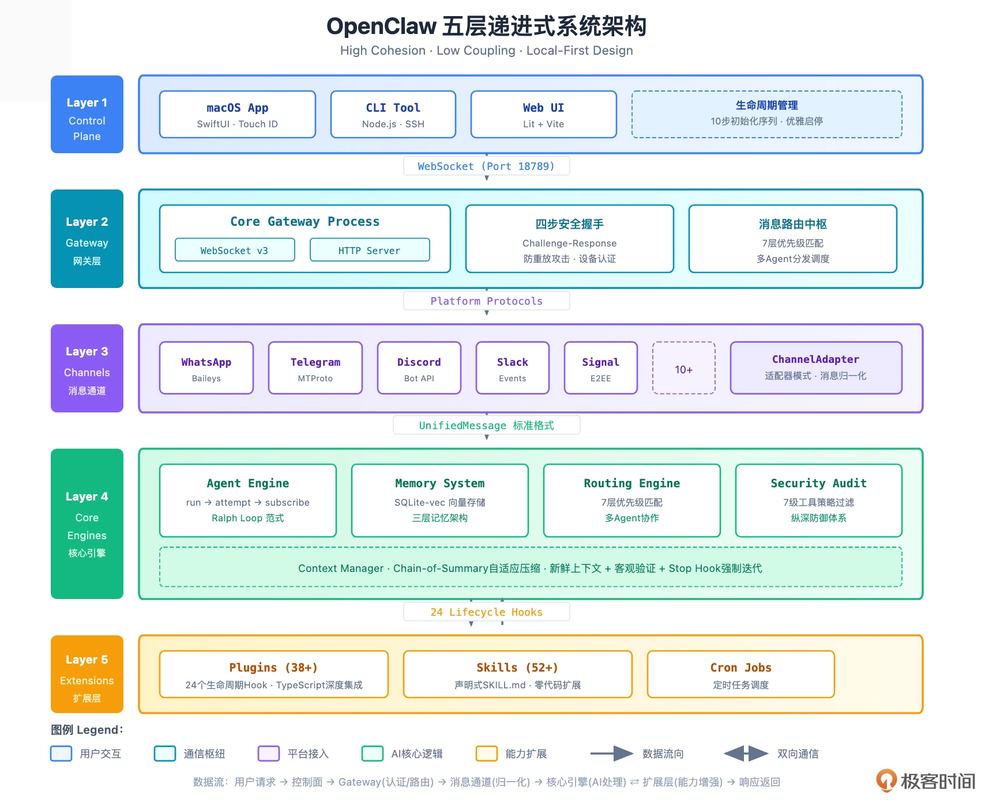
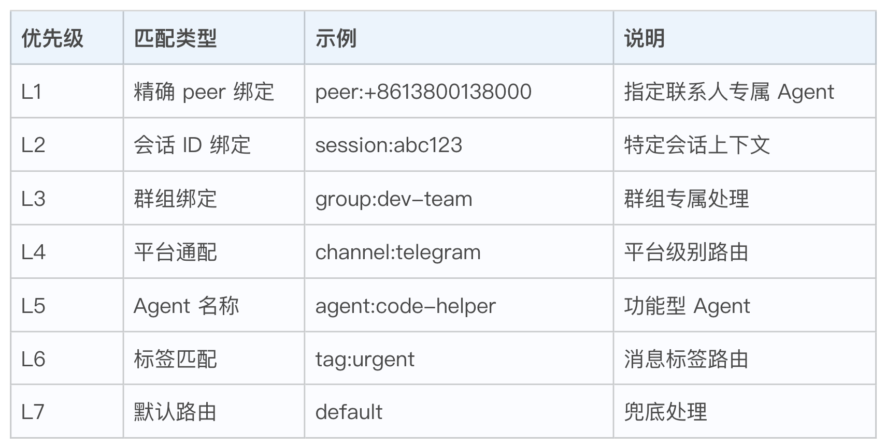
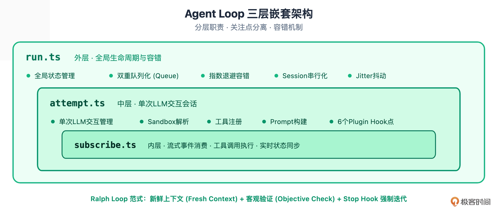
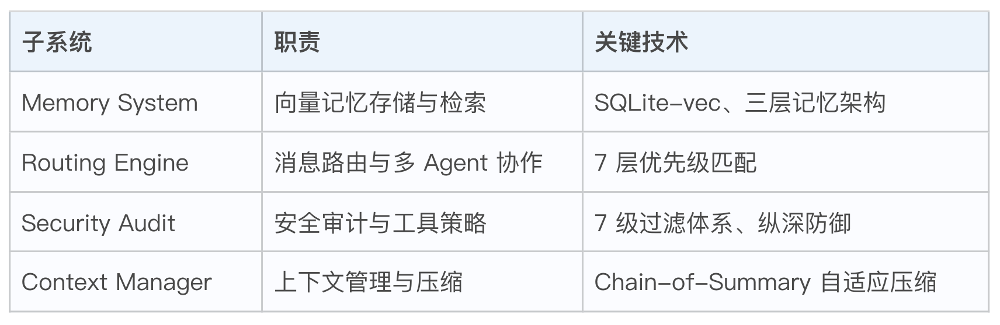
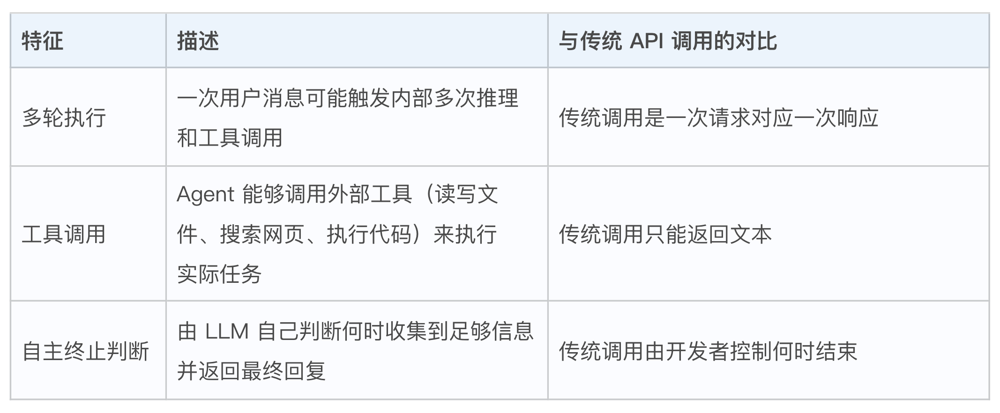
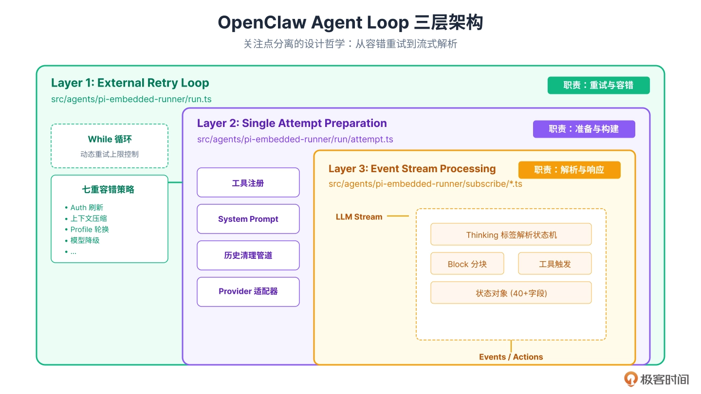
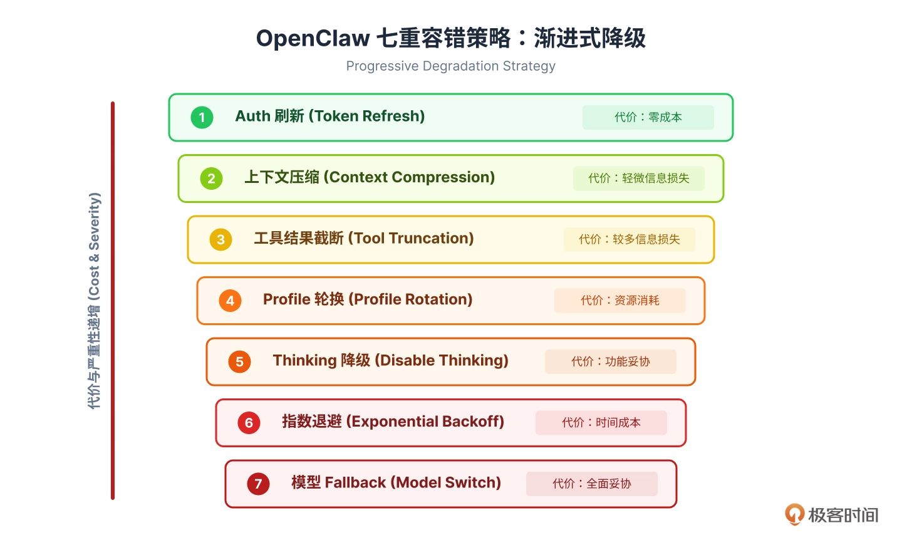
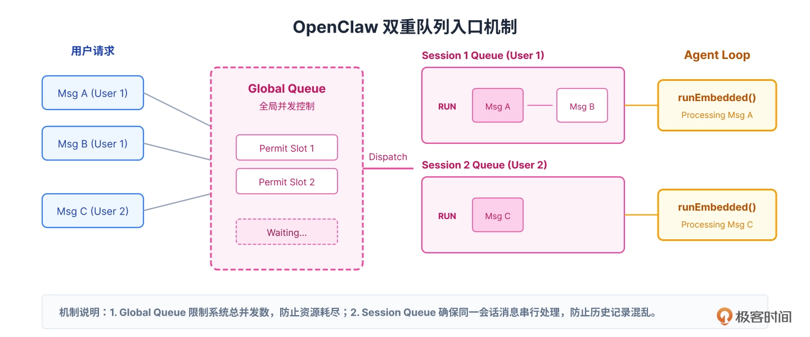

# 架构

OpenClaw 采用自上而下的五层递进式架构。数据从用户交互的控制面进入，经过 Gateway 的安全认证和路由分发，通过消息通道完成平台适配，最终在核心引擎层完成 AI 逻辑处理，并可通过 24 个生命周期 Hook 调用扩展层的各类能力。



## 控制面

用户通过它与 Agent 进行交互。

控制面还承担着系统生命周期管理的重任。

OpenClaw 设计了一套精细的  10 步初始化序列，确保系统各模块按依赖关系正确就绪：

1. 加载配置文件  (config.yaml)
2. 初始化日志系统  (Winston/Pino)
3. 建立数据库连接  (SQLite)
4. 加载安全策略  (Policy Engine)
5. 初始化 Memory 向量索引  (SQLite-vec)
6. 注册核心 Agent 实例
7. 加载 Plugins (38+ 官方扩展)
8. 解析 Skills (52+ 内置技能)
9. 启动 Gateway 监听  (Port 18789)
10. 激活消息通道  (WhatsApp/Telegram/…)


## Gateway 网关层

Gateway 采用  JSON over **WebSocket** 协议，监听在  18789 端口。

为什么选择 WebSocket 而不是 HTTP？

> 因为 Agent 系统需要处理大量的双向实时通信——用户发送消息、Agent 流式回复、工具执行结果返回、状态更新推送，这些场景下长连接的效率远高于短连接的 HTTP 轮询。


Gateway 还承担着消息路由中枢的角色。当一条消息进入系统，Gateway 会根据  7 层优先级匹配规则，决定将消息分发给哪个 Agent 处理。




## 消息通道层（Message Channels）

OpenClaw 使用适配器模式（Adapter Pattern）来适配不同平台的消息协议。

每个平台对应一个 ChannelAdapter 实现，负责将平台特有的消息格式转换为统一的 UnifiedMessage 对象。


## 核心引擎层（Core Engines）

核心引擎层是整个系统最复杂、也最核心的部分。它包含四个相对独立的子系统，每个子系统都是一个高度内聚的功能单元。

**1、AgentLoop**

三层嵌套的执行引擎Agent Loop 采用了一种独特的三层嵌套架构，这是 OpenClaw 最具创新性的设计之一：



* run.ts（外层）：负责全局生命周期管理，包括双重队列化、指数退避容错、Session 串行化和 Jitter 抖动。当 Agent 调用失败时，外层会根据错误类型决定是重试还是放弃。
* attempt.ts（中层）：管理单次 LLM 交互会话，包括 Sandbox 解析、工具注册、Prompt 构建，以及 6 个关键的 Plugin Hook 点（如 before_llm、after_tool 等）。
* subscribe.ts（内层）：处理流式事件消费、工具调用执行和实时状态同步，确保每一个 token 都能被正确处理。


**2、RalphLoop 范式**

OpenClaw 的 Agent Loop 实现了一套被称为 Ralph Loop 的范式，它包含三个核心原则：

* 新鲜上下文（Fresh Context）：每轮迭代都重新构建上下文，避免历史信息的累积污染。
* 客观验证（Objective Check）：引入外部工具来验证 LLM 的输出，而非盲目信任。
* Stop Hook 强制迭代：通过 Hook 机制强制 Agent 在必要时停止，避免无限循环。


**2、其他核心子系统**

除了 Agent Engine，核心引擎层还包括：




## 扩展层：24 个 Hook 点的能力边界

扩展层是 OpenClaw 开放性的体现。通过 24 个生命周期 Hook 点，第三方开发者可以在不修改核心代码的前提下，注入自定义逻辑。


# Agent Loop

什么是 Agent Loop ？

**LLM 自己决定是否继续循环**——这是 Agent Loop 与普通 API 调用的本质区别。用户只发出了一条指令，但 Agent 内部进行了多轮“思考 - 行动 - 观察”的迭代，每一轮结束时由 LLM 判断：任务完成了吗？还需要继续吗？下一步该做什么？


Agent Loop 的三个关键特征：



这三个特征共同构成了业界所说的 “ReAct”（Reasoning and Acting）范式的核心——Agent 在一个循环中反复交替进行推理（Reasoning）和行动（Acting），直到任务完成。

## 三层架构



### 第一层：外部重试循环 runEmbeddedPiAgent()（run.ts）

核心职责是回答一个问题：如果失败了怎么办？**负责重试与容错。**

```ts
// run.ts 核心循环的简化结构
async function runEmbeddedPiAgent(context: AgentContext) {
  let attemptCount = 0;
  const maxAttempts = calculateMaxAttempts(context.profiles);
  
  while (attemptCount < maxAttempts) {
    try {
      // 调用中层：执行单次LLM尝试
      const result = await runEmbeddedAttempt(context);
      
      // 成功完成，退出循环
      if (result.completed) {
        return result;
      }
      
      // LLM决定继续执行下一轮
      attemptCount++;
      
    } catch (error) {
      // 核心容错逻辑：根据错误类型选择恢复策略
      const recovery = await handleError(error, context);
      
      if (recovery.shouldRetry) {
        attemptCount++;
        continue; // 重试
      } else {
        throw error; // 不可恢复，上抛错误
      }
    }
  }
  
  throw new MaxAttemptsExceededError();
}
```

重试次数上限不是固定的，而是动态计算的。OpenClaw 使用以下公式：maxAttempts = 24 + profileCount × 8。其中 profileCount 是配置的 API Key 数量。


**七重容错策略：**



| 策略                  | 触发条件                                                     | 原理                                                         | 代价         |
| --------------------- | ------------------------------------------------------------ | ------------------------------------------------------------ | ------------ |
| Runtime Auth 自动刷新 | 检测到 isAuthAssistantError(error) 且系统配置了 Runtime Auth（如 OAuth Token）。 | 许多 LLM 服务使用有过期时间的访问令牌。OpenClaw 会在令牌**过期前 5 分钟**主动触发刷新，而不是等到过期后再处理。如果刷新正在进行中（refreshInFlight 为 true），循环会等待刷新完成后自动重试。 | 零成本       |
| 上下文压缩            | 检测到 isLikelyContextOverflowError(error)（上下文超出模型窗口限制）且压缩尝试次数小于 3 次。 | 当对话历史过长导致 Token 超限时，OpenClaw 会调用可插拔的上下文引擎（contextEngine.compact()）对历史记录进行摘要化处理。这个引擎可以使用 LLM 来提取关键信息，将冗长的对话压缩成精炼的摘要。 | 信息损失     |
| 工具结果截断          | 上下文压缩达到 3 次上限后仍然溢出，且 sessionLikelyHasOversizedToolResults(session) 返回 true。 | 有时候上下文溢出不是因为对话历史太长，而是因为某个工具返回了巨量数据——比如 Agent 读取了一个 10MB 的日志文件。这种情况下，OpenClaw 会直接截断该工具的输出，保留头部和尾部内容，中间标记为 [truncated]。 | 更多信息损失 |
| Profile 轮换          | 检测到 isAuthOrRateLimitError(error)（认证失败或 HTTP 429 限流错误）。 | 当一个 API Key 被限流或失效时，OpenClaw 会标记该 Profile 为“暂时不可用”，然后自动切换到候选列表中的下一个可用 Profile。这就是为什么配置多个 API Key 是生产环境的最佳实践。 | 资源切换     |
| Thinking 级别降级     | 模型不支持当前请求的 Thinking 级别（如 Claude 的 Extended Thinking 功能）。 | 一些高级推理功能（如深度思考模式）可能在特定条件下不可用。OpenClaw 会按照 high → medium → low → off 的顺序逐级降低推理深度，直到找到模型支持的级别。 | 功能妥协     |
| Overload 指数退避     | 服务端返回过载（Overload/503）错误。                         | 当 LLM 服务端过载时，立即重试只会加剧拥堵。OpenClaw 采用指数退避策略：初始等待 250ms，每次失败后等待时间翻倍，最高 1500ms。同时加入 20% 的随机抖动（Jitter）来避免多个客户端同时重试造成的“惊群效应”。 | 时间成本     |
| 模型 Fallback         | 上述所有策略均无效，且系统配置了备选模型。                   | 作为最后的“救命稻草”，OpenClaw 会抛出 FailoverError，由外部的 Fallback 链捕获并切换到完全不同的备选模型重新执行。例如，从 Claude 切换到 GPT-4，或从云端模型切换到本地部署的 Ollama 模型。 | 全面妥协     |


### 第二层：单次 LLM 尝试 runEmbeddedAttempt() （attempt.ts）

核心职责是回答：一次调用需要准备什么？

每当外层决定“执行一次 LLM 调用”时，中层就开始工作：注册可用工具、构建 System Prompt、清理会话历史、适配不同 Provider 的 API 格式……这是一条完整的“准备链条”，确保每次发往 LLM 的请求都是完整、合规、安全的。

### 第三层：事件流处理 subscribeEmbeddedPiSession() （subscribe 相关文件）

核心职责是回答：LLM 正在说话时发生了什么？

当 LLM 开始流式输出时，内层负责实时解析每一个 token：这是思考过程还是正式回复？是否触发了工具调用？如何将长文本分块发送给用户？这一层需要处理 10 种不同的事件类型，维护 40 多个状态字段，是整个 Agent Loop 中最“细腻”的部分。


在生产环境中，Agent 系统会面临两个并发挑战：

1. 同一会话的竞态条件：用户快速连续发送消息 A 和 B，如果 A 还没处理完 B 就开始执行，可能导致会话历史记录混乱。
2. 全局资源耗尽：大量并发请求同时涌入，可能瞬间耗尽 API 额度或系统资源。

OpenClaw 通过**双重队列**嵌套机制优雅地解决了这两个问题。


## 双重队列

**双重队列的设计原理**：

**Session 队列（内层）：保证同一会话串行执行**

每个会话（Session）都有自己独立的队列。当用户在同一个对话中连续发送消息时，这些消息会按顺序排队，确保前一条处理完毕后才开始下一条。这避免了会话历史被并发写入导致的数据不一致问题。

**Global 队列（外层）：控制全局并发度**

所有会话的执行请求都需要经过全局队列的“门禁”。系统可以配置最大并发数，防止资源耗尽。当并发达到上限时，新请求会在全局队列中等待。

