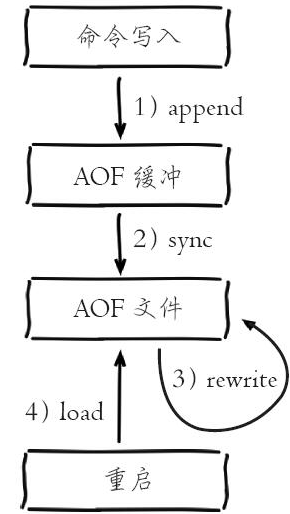
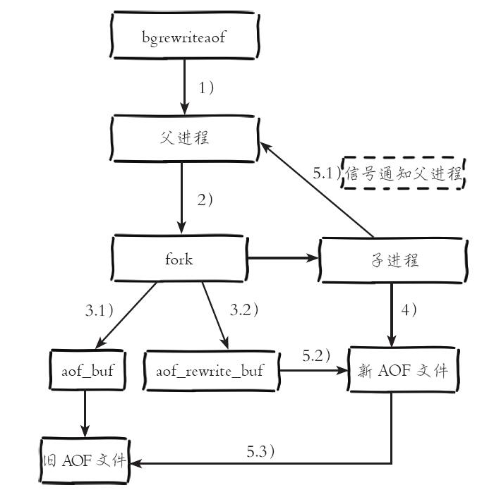
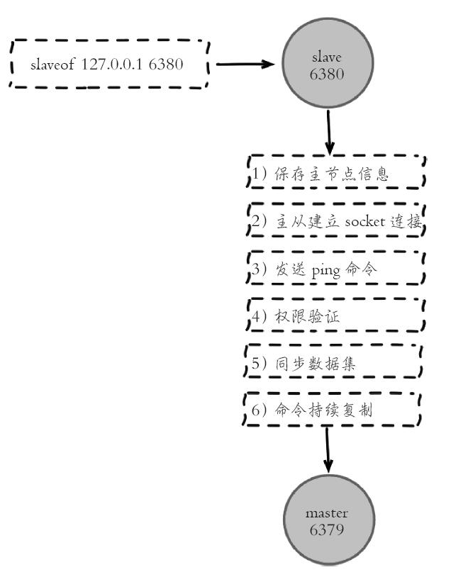
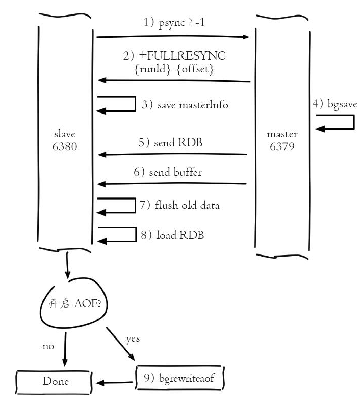
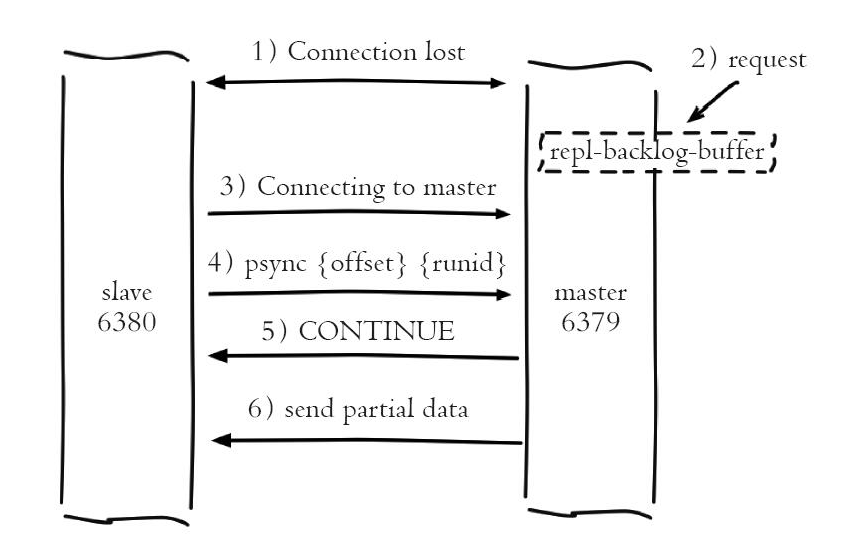
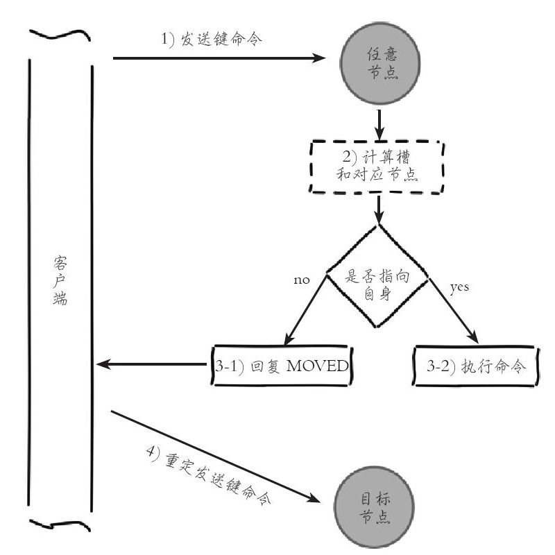

https://github.com/redis/redis

https://redis.io/

https://redis.com.cn/

http://doc.redisfans.com/

## Redis基础

修改redis.conf文件

```
redis.conf配置文件，改完后确保生效，记得重启
   1 默认daemonize no              改为  daemonize yes
   2 默认protected-mode  yes    改为  protected-mode no
   3 默认bind 127.0.0.1             改为  直接注释掉(默认bind 127.0.0.1只能本机访问)或改成本机IP地址，否则影响远程IP连接
   4 添加redis密码                      改为 requirepass 你自己设置的密码
```

启动服务 `redis-server 配置文件`

连接服务 `redis-cli -a 密码 -p 6379`

关闭服务 单例模式 `redis-cli -a 密码 shutdown` ；多例模式 `redis-cli -p 6379 shutdown`


### 数据结构

#### String

String是redis最基本的数据类型，value可以保存字符串、数字、二进制，value最多可以容纳 **512 MB**

String 类型的底层的数据结构实现主要是 **SDS（简单动态字符串）**

**应用场景**

1. 缓存对象：缓存对象的json；属性分离缓存

2. 常规计数：因为 Redis 处理命令是单线程，所以执行命令的过程是原子的。访问次数、点赞、转发、库存量等（`INCR key`）

3. 分布式锁（`setnx key value`）

4. 共享Session信息：分布式系统中将Session保存到redis中

5. 限速：例如限制用户每分钟获取验证码的频率。


#### List

Redis列表是最简单的字符串列表，按照插入顺序排序。List 类型的底层数据结构是由**双向链表或压缩列表**，最多可以包含`2^32-1`个元素。在 Redis 3.2 版本之后，List 数据类型底层数据结构就只由 **quicklist** 实现了，替代了双向链表和压缩列表。


**应用场景**：消息队列

消息队列必须满足三个要求：消息保序、处理重复消息、消息可靠

- 消息保序：使用 LPUSH + RPOP；阻塞读取：使用 BRPOP；
- 重复消息处理：生产者自行实现全局唯一 ID；
- 消息的可靠性：使用 BRPOPLPUSH，作用是让消费者程序从一个 List 中读取消息，同时，Redis 会把这个消息再插入到另一个 List（可以叫作备份 List）留存

List 作为消息队列有什么缺陷？不支持多个消费者消费同一个消息


#### Hash

Redis Hash是一个string类型的field（字段）和value（值）的映射表，Hash特别适合用户存储对象。Redis中每个Hash可以存储2^32-1个键值对。

Hash 类型的底层数据结构是**压缩列表或哈希表**，在 Redis 7.0 中，压缩列表数据结构已经废弃了，交由 **listpack** 数据结构来实现了。


**应用场景：**

1. 缓存对象

   String + Json也是存储对象的一种方式，那么存储对象时，到底用 String + json 还是用 Hash 呢？

   一般对象用 String + Json 存储，对象中某些频繁变化的属性可以考虑抽出来用 Hash 类型存储。

2. 购物车


#### Set

集合(set)类型用来保存多个的字符串元素，不允许有重复元素，并且集合中的元素是无序的，不能通过索引下标获取元素。一个集合最多可以存储 `2^32-1` 个元素。Set 类型除了支持集合内的增删改查，同时还支持多个集合取交集、并集、差集。

Set 类型的底层数据结构是**哈希表或整数集合**。


**应用场景：**

集合的主要几个特性，无序、不可重复、支持并交差等操作。因此 Set 类型比较适合用来数据去重和保障数据的唯一性，还可以用来统计多个集合的交集、差集和并集等，当我们存储的数据是无序并且需要去重的情况下，比较适合使用集合类型进行存储。

Set 的差集、并集和交集的计算复杂度较高，在数据量较大的情况下，如果直接执行这些计算，会导致 Redis 实例阻塞。在主从集群中，为了避免主库因为 Set 做聚合计算（交集、差集、并集）时导致主库被阻塞，我们可以选择一个从库完成聚合统计，或者把数据返回给客户端，由客户端来完成聚合统计。

1. 抽奖：去重功能。key为抽奖活动名，value为员工名称（`spop key 3 或者 SRANDMEMBER key 3 `）

2. 点赞：一个用户点一次赞。key 是文章id，value 是用户id

3. 共同好友：交集运算（`sinter key1 key2`）

4. 标签


#### ZSet

Redis zset 和 set 一样也是string类型元素的集合,且不允许重复的成员。不同的是每个元素都会关联一个double类型的分数，redis正是通过分数来为集合中的成员进行从小到大的排序。


**应用场景：**

1. 排行榜

2. 电话、姓名排序

   使用有序集合的 `ZRANGEBYLEX` 或 `ZREVRANGEBYLEX` 可以帮助我们实现电话号码或姓名的排序，我们以 `ZRANGEBYLEX` （返回指定成员区间内的成员，按 key 正序排列，分数必须相同）为例。

   **注意：不要在分数不一致的 SortSet 集合中去使用 ZRANGEBYLEX和 ZREVRANGEBYLEX 指令，因为获取的结果会不准确。**

   例如，获取132、133开头的电话

   ```sh
   > ZADD phone 0 13300111100 0 13210414300 0 13252110901 
   > ZRANGEBYLEX phone [132 (134
   1) "13200111100"
   2) "13210414300"
   3) "13252110901"
   4) "13300111100"
   5) "13310414300"
   6) "13352110901"
   ```

3. 延迟队列：使用有序集合（ZSet）的方式来实现延迟消息队列的，ZSet 有一个 Score 属性可以用来存储延迟执行的时间。

   使用 zadd score1 value1 命令就可以一直往内存中生产消息。再利用 zrangebysocre 查询符合条件的所有待处理的任务， 通过循环执行队列任务即可。


#### 地理空间（GEO）

Redis GEO主要用于存储地理位置信息，并对存储的信息进行操作，包括：添加地理位置的坐标、获取地理位置的坐标、计算两个位置之间的距离、根据用户给定的经纬度坐标来获取指定范围内的地址位置集合。

**内部实现：**

GEO 本身并没有设计新的底层数据结构，而是直接使用了 **Sorted Set** 集合类型。

GEO 类型使用 GeoHash 编码方法实现了经纬度到 Sorted Set 中元素权重分数的转换，这其中的两个关键机制就是「对二维地图做区间划分」和「对区间进行编码」。一组经纬度落在某个区间后，就用区间的编码值来表示，并把编码值作为 Sorted Set 元素的权重分数。

这样一来，我们就可以把经纬度保存到 Sorted Set 中，利用 Sorted Set 提供的“按权重进行有序范围查找”的特性，实现 LBS 服务中频繁使用的“搜索附近”的需求。

**应用场景**：导航定位、打车


#### 基数统计（HyperLogLog）

HyperLogLog并不是一种新的数据结构（**实际类型为字符串类型**），而是一种基数算法，通过HyperLogLog可以利用极小的内存空间完成独立总数的统计。但要注意，HyperLogLog 是统计规则是基于概率完成的，不是非常准确，标准误算率是 0.81%。

应用场景：去重、计数

1. UV：unique visitor 独立访客数
2. PV：page view 页面浏览量
3. DAU：daily active user 日活
4. MAU：月活


#### 位图（bitmap）

Bitmap，即位图，是一串连续的二进制数组（0和1），可以通过偏移量（offset）定位元素。BitMap通过最小的单位bit来进行`0|1`的设置，表示某个元素的值或者状态，时间复杂度为O(1)。

由于 bit 是计算机中最小的单位，使用它进行储存将非常节省空间，特别适合一些数据量大且使用**二值统计的场景**。

**内部实现**

Bitmap 本身是用 **String 类型作为底层数据结构**实现的一种统计二值状态的数据类型。

String 类型是会保存为二进制的字节数组，所以，Redis 就把字节数组的每个 bit 位利用起来，用来表示一个元素的二值状态，你可以把 Bitmap 看作是一个 bit 数组。

**应用场景**

1. 签到统计
2. 判断用户登录态。将用户 ID 作为 offset，在线就设置为 1，下线设置 0。通过 `GETBIT`判断对应的用户是否在线。 5000 万用户只需要 6 MB 的空间。
3. 连续签到用户总数。把每天的日期作为 Bitmap 的 key，userId 作为 offset，对应的 bit 位做 『与』运算


#### 位域（bitfield）

通过bitfield命令可以一次性操作多个比特位，它会执行一系列操作并返回一个响应数组，这个数组中的元素对应参数列表中的相应操作的执行结果。主要功能是：

* 位域修改
* 溢出控制
  * WRAP:使用回绕(wrap around)方法处理有符号整数和无符号整数溢出情况
  * SAT:使用饱和计算(saturation arithmetic)方法处理溢出，下溢计算的结果为最小的整数值，而上溢计算的结果为最大的整数值
  * fail:命令将拒绝执行那些会导致上溢或者下溢情况出现的计算，并向用户返回空值表示计算未被执行


#### Redis流（Stream）

Redis Stream 主要用于消息队列（MQ，Message Queue）

* Redis 本身是有一个 **Redis 发布订阅 (pub/sub)** 来实现消息队列的功能，但它有个缺点就是**消息无法持久化**，如果出现网络断开、Redis 宕机等，消息就会被丢弃。

* List 实现消息队列的方式不能重复消费，一个消息消费完就会被删除，而且生产者需要自行实现全局唯一 ID，**不支持多播，分组消费**

而 Redis Stream 支持消息的持久化、支持自动生成全局唯一ID、支持ack确认消息的模式、支持消费组模式等，让消息队列更加的稳定和可靠


### 常用命令

```shell
keys * 			# 查看当前库所有的key
set key value
get key
exists key 		# 判断某个key是否存在
type key		# 查看你的key是什么类型
del key			# 删除指定的key数据  是原子的删除，只有删除成功了才会返回删除结果
unlink key		# 非阻塞删除，仅仅将keys从keyspace元数据中删除，真正的删除会在后续异步中操作。
ttl key			# 查看还有多少秒过期，-1表示永不过期，-2表示已过期
expire key 秒钟  # 为给定的key设置过期时间
move key dbindex[0-15]# 将当前数据库的key移动到给定的数据库DB当中
select dbindex	# 切换数据库【0-15】，默认为0
dbsize			# 查看当前数据库key的数量
flushdb			# 清空当前库
flushall		# 清空全部库
```

帮助命令: **`help @类型`** 。例如，`help @string`


### 持久化

AOF 文件的内容是操作命令；RDB 文件的内容是二进制数据。

#### RDB (Redis Database)

在指定的时间间隔内将内存中的数据集快照写入磁盘，恢复时再将硬盘快照文件直接读回到内存里。

RDB保存的是dump.rdb文件。


**持久化方式**：

* 自动触发：修改 redis.conf 里配置的 `save <seconds> <changes>`。自动执行 bgsave 命令，会创建子进程来生成 RDB 快照文件。

* 手动触发：使用`save`或者`bgsave`命令。save命令会阻塞当前Redis服务器，直到RDB过程完成为止，对于内存比较大的实例会造成长时间阻塞，线上环境不建议使用。bgsave命令Redis进程执行fork操作创建子进程，RDB持久化过程由子进程负责，完成后自动结束。

如果服务器开启了AOF持久化功能，那么服务器优先使用AOF文件来还原数据库状态，只有AOF处于关闭状态，才会使用RDB。


**优势**：

1. RDB是一个紧凑压缩的二进制文件，代表Redis在某个时间点上的数据快照。非常适用于备份，全量复制等场景。
2. Redis加载RDB恢复数据远远快于AOF的方式。

**劣势**：

1. 在一定间隔时间做一次备份，所以如果redis意外down掉的话，就会丢失从当前至最近一次快照期间的数据，快照之间的数据会丢失。
2. 内存数据的全量同步，如果数据量太大会导致IO严重影响服务器性能。因为RDB需要经常fork()以便使用子进程在磁盘上持久化。如果数据集很大，fork()可能会很耗时，并且如果数据集很大并且CPU性能不是很好，可能会导致Redis停止为客户端服务几毫秒甚至一秒钟。


哪些情况会触发RDB快照?

1. 配置文件中默认的快照配置
2. 手动save/bgsave命令
3. 执行flushdb/fulshall命令也会产生dump.rdb文件，但是也会将命令记录到dump.rdb文件中，恢复后依旧是空，无意义
4. 执行shutdown且没有设置开启AOF持久化
5. 主从复制时，主节点自动触发


RDB 在执行快照的时候，数据能修改吗？

可以的，执行 bgsave 过程中，Redis 依然**可以继续处理操作命令**的，也就是数据是能被修改的，关键的技术就在于**写时复制技术（Copy-On-Write, COW）。**

执行 bgsave 命令的时候，会通过 fork() 创建子进程，此时子进程和父进程是共享同一片内存数据的，因为创建子进程的时候，会复制父进程的页表，但是页表指向的物理内存还是一个，此时如果执行读操作，则主进程和 bgsave 子进程互相不影响。

如果主进程执行写操作，则被修改的数据会复制一份副本，主线程在这个数据副本进行修改操作，然后 bgsave 子进程会把原来的数据写入 RDB 文件，新修改的数据只能交由下一次的 bgsave 快照。


#### AOF (Append Only File)

**以日志的形式来记录每个写操作**，重启时再重新执行AOF文件中的命令达到恢复数据的目的。


**开启：**

开启AOF功能需要设置配置：appendonly yes，默认不开启。

AOF保存的是 appendonly.aof 文件

aof文件：

* redis6及之前：appendonly.aof

* Redis7 Multi Part AOF的设计, 将AOF分为三种类型：

  * BASE: 表示基础AOF，它一般由子进程通过重写产生，该文件最多只有一个。
  * INCR:表示增量AOF，它一般会在AOFRW开始执行时被创建，该文件可能存在多个。
  * HISTORY:表示历史AOF，它由BASE和INCR AOF变化而来，每次AOFRW成功完成时，本次AOFRW之前对应的BASE和INCR AOF都将变为HISTORY，HISTORY类型的AOF会被Redis自动删除。

   为了管理这些AOF文件，我们引入了一个manifest (清单)文件来跟踪、管理这些AOF。


异常修复命令：`redis-check-aof --fix incr文件`


**AOF持久化流程**：



**先执行写命令，然后记录命令到AOF日志。**

1. 所有的写入命令会追加到aof_buf（缓冲区）中。
2. AOF缓冲区根据对应的策略向硬盘做同步操作。
   1. **ALways**：每个写命令执行完立刻同步地将日志写回磁盘；
   2. **everysec**（默认）：每隔1秒把缓冲区中的内容写入到磁盘；
   3. **no**：由操作系统决定何时将缓冲区内容写回磁盘；
3. 随着AOF文件越来越大，需要定期对AOF文件进行重写，达到压缩的目的。
4. 当Redis服务器重启时，可以加载AOF文件进行数据恢复。


AOF命令写入的内容直接是文本协议格式。AOF为什么直接采用文本协议格式？

1. 文本协议具有很好的兼容性。
2. 开启AOF后，所有写入命令都包含追加操作，直接采用协议格式，避免了二次处理开销。
3. 文本协议具有可读性，方便直接修改和处理。


**AOF重写机制**：

AOF文件重写并不是对AOF文件进行重新整理，而是把Redis进程内的数据转化为写命令同步到新AOF文件的过程。

AOF重写过程可以手动触发和自动触发：

* 手动触发：直接调用bgrewriteaof命令。
* 自动触发：根据auto-aof-rewrite-min-size和auto-aof-rewrite-percentage参数确定自动触发时机。

**重写流程：**



1. 执行AOF重写请求。
2. 父进程执行fork创建子进程。
3. 1. 主进程fork操作完成后，继续响应其他命令。所有修改命令依然写入AOF缓冲区并根据appendfsync策略同步到硬盘，保证原有AOF机制正确性。
   2. 由于fork操作运用写时复制技术，子进程只能共享fork操作时的内存数据。由于父进程依然响应命令，Redis使用“AOF重写缓冲区”保存这部分新数据，防止新AOF文件生成期间丢失这部分数据。
4. 子进程根据内存快照，按照命令合并规则写入到新的AOF文件。每次批量写入硬盘数据量由配置aof-rewrite-incremental-fsync控制，默认为32MB，防止单次刷盘数据过多造成硬盘阻塞。
5. 1. 新AOF文件写入完成后，子进程发送信号给父进程，父进程更新统计信息，具体见info persistence下的aof_*相关统计。
   2. 父进程把AOF重写缓冲区的数据写入到新的AOF文件。
   3. 使用新AOF文件替换老文件，完成AOF重写。


#### 混合持久化

RDB 优点是数据恢复速度快，但是快照的频率不好把握。频率太低，丢失的数据就会比较多，频率太高，就会影响性能。

AOF 优点是丢失数据少，但是数据恢复不快。

混合持久化，既保证了 Redis 重启速度，又降低数据丢失风险。


开启：设置 appendonly 为 yes、aof-use-rdb-preamble 为 yes


当开启了混合持久化时，在 AOF 重写日志时，`fork` 出来的重写子进程会先将与主线程共享的内存数据以 **RDB 方式写入到 AOF 文件**，然后主线程处理的操作命令会被记录在**重写缓冲区**里，重写缓冲区里的增量命令会以 **AOF 方式写入到 AOF 文件**，写入完成后通知主进程将新的含有 RDB 格式和 AOF 格式的 AOF 文件替换旧的的 AOF 文件。

也就是说，使用了混合持久化，AOF 文件的**前半部分是 RDB 格式的全量数据，后半部分是 AOF 格式的增量数据**。


#### 纯缓存模式

同时关闭RDB+AOF，专心做缓存

1. save "" -- 禁用RDB

   禁用RDB持久化模式下，我们仍然可以使用命令save、bgsave生成RDB文件

2. appendonly no -- 禁用AOF

   禁用AOF持久化模式下，我们仍然可以使用命令bgrewriteaof生成AOF文件


AOF 重写机制和 RDB 快照（bgsave 命令）的过程，都会分别通过 `fork()` 函数创建一个子进程来处理任务。会有两个阶段会导致阻塞父进程（主线程）：

- 创建子进程的途中，由于要复制父进程的页表等数据结构，阻塞的时间跟页表的大小有关，页表越大，阻塞的时间也越长；
- 创建完子进程后，如果父进程修改了共享数据中的大 Key，就会发生写时复制，这期间会拷贝物理内存，由于大 Key 占用的物理内存会很大，那么在复制物理内存这一过程，就会比较耗时，所以有可能会阻塞父进程。


### 事务

redis事务就是一次性、顺序性、排他性的执行一个队列中的一系列命令。**Redis 中并没有提供回滚机制 ，并不一定保证原子性**

1. 开启：以multi开始一个事务

2. 入队：将多个命令入队到事务中，接到这些命令并不会立即执行，而是放到等待执行的事务队列里面

3. 执行：exec命令触发事务

| 性质         | 解释                                                         |
| ------------ | ------------------------------------------------------------ |
| 不保证原子性 | Redis的事务不保证原子性，也就是不保证所有指令同时成功或同时失败，只有决定是否开始执行全部指令的能力，没有执行到一半进行回滚的能力 |
| 一致性       | redis事务可以保证命令失败的情况下得以回滚，数据能恢复到没有执行之前的样子，是保证一致性的，除非redis进程意外终结 |
| 隔离性       | 每个Redis客户端都拥有自己独立的事务队列，并且每个Redis事务都是独立执行的，不同事务之间不会互相干扰。 |
| 不保证持久性 | redis持久化策略中不管是RDB还是AOF都是异步执行的，不保证持久性是出于对性能的考虑 |

* 正常执行：MULTI 标记事务开始 、EXEC 执行事务
* 放弃事务：MULTI、DISCARD 取消事务
* 事务全部失败：MULTI后的命令直接报错（例如，误把set命令写成了sett命令），EXEC执行也会报错，事务失败，命令全部失效。类似编译错误
* 事务部分失败：MULTI后的命令没有直接报错（例如，INCR email），EXEC时报错，该条命令失败，其余命令成功。类似运行错误
* watch监控：使用watch提供乐观锁定。可以在EXEC执行前监视任意数量的键值对，并在EXEC命令执行时检查被监视的键是否至少有一个被修改过，如果是的话拒绝执行事务。


### 管道

管道(pipeline)可以一次性发送多条命令给服务端，**服务端依次处理完毕后，通过一 条响应一次性将结果返回，通过减少客户端与redis的通信次数来实现降低往返延时时间**。pipeline实现的原理是队列，先进先出特性就保证数据的顺序性

pipeline与原生批量命令对比

1. 原生批量命令是原子性(例如：mset、mget)，pipeline是非原子性的
2. 原生批量命令一次只能执行一种命令，pipeline支持批量执行不同命令
3. 原生批量命令是服务端实现，而pipeline需要服务端与客户端共同完成

pipeline与事务对比

1. 事务具有原子性，管道不具有原子性
2. 管道一次性将多条命令发送到服务器，事务是一条一条的发，事务只有在接收到exec命令后才会执行
3. 执行事务时会阻塞其他命令的执行，而执行管道中的命令时不会

使用pipeline注意事项

1. pipeline缓冲的指令只是会依次执行，不保证原子性，如果执行中指令发生异常，将会继续执行后续的指令
2. 使用pipeline组装的命令个数不能太多，不然数量过大客户端阻塞的时间可能过久，同时服务端此时也被迫回复一个队列答复，占用很多内存


### 发布/订阅

客户端可以通过订阅特定的频道（channel）来接收发送至该频道的消息，还可以通过向频道将消息发送给频道的所有订阅者。

```sh
publish channel message
subscribe channel [channel …]
unsubscribe [channel [channel …]]
psubscribe pattern [pattern…] # 模式订阅	
punsubscribe [pattern [pattern …]]
```

新开启的订阅客户端，无法收到该频道之前的消息，因为Redis不会对发布的消息进行持久化。

聊天室、公告牌、服务之间利用消息解耦都可以使用发布订阅模式。


### 复制（replication）

主从复制，读写分离，master可以读写，slave以读为主，当master数据变化的时候，自动将新的数据异步同步到其他的slave数据库。


**配置**：（配从不配主）

配置从机：

1. master 如果配置了 `requirepass` 参数，需要密码登录 ，那么slave就要配置 `masterauth` 来设置校验密码，否则的话master会拒绝slave的访问请求；
2. `replicaof 主库IP 主库端口` 


**基本操作命令**：

`info replication` ：可以查看节点的主从关系和配置信息

`replicaof 主库IP 主库端口` ：一般写入进Redis.conf配置文件内，重启后依然生效

`slaveof 主库IP 主库端口 `：每次与master断开之后，都需要重新连接，除非你配置进了redis.conf文件；

`slaveof no one` ：使当前数据库停止与其他数据库的同步，转成主数据库


Redis的复制拓扑结构可以支持单层或多层复制关系，根据拓扑复杂性可以分为以下三种：

* 一主一从：当应用写命令并发量较高且需要持久化时，可以只在从节点上开启AOF，这样既保证数据安全性同时也避免了持久化对主节点的性能干扰。但需要注意的是，当主节点关闭持久化功能时，如果主节点脱机要避免自动重启操作。因为主节点之前没有开启持久化功能自动重启后数据集为空，这时从节点如果继续复制主节点会导致从节点数据也被清空的情况。
* 一主多从：对于读占比较大的场景，可以把读命令发送到从节点来分担主节点压力。对于写并发量较高的场景，多个从节点会导致主节点写命令的多次发送从而过度消耗网络带宽，同时也加重了主节点的负载影响服务稳定性。
* 树状主从结构：通过引入复制中间层，可以有效降低主节点负载和需要传送给从节点的数据量。


**复制过程**：



1. 执行slaveof后从节点只保存主节点的地址信息便直接返回，这时建立复制流程还没有开始；
2. 从节点(slave)内部通过每秒运行的定时任务维护复制相关逻辑，当定时任务发现存在新的主节点后，会尝试与该节点建立网络连接。如果从节点无法建立连接，定时任务会无限重试直到连接成功或者执行slaveof no one取消复制；
3. 连接建立成功后从节点发送ping请求进行首次通信，ping请求主要目的如下：检测主从之间网络套接字是否可用；检测主节点当前是否可接受处理命令。如果发送ping命令后，从节点没有收到主节点的pong回复或者超时，比如网络超时或者主节点正在阻塞无法响应命令，从节点会断开复制连接，下次定时任务会发起重连；
4. 如果主节点设置了requirepass参数，则需要密码验证，从节点必配置masterauth参数保证与主节点相同的密码才能通过验证；如果验证失败复制将终止，从节点重新发起复制流程；
5. 主从复制连接正常通信后，对于首次建立复制的场景，主节点会把持有的数据全部发送给从节点，这部分操作是耗时最长的步骤。Redis在2.8版本以后采用新复制命令**psync**进行数据同步，原来的sync命令依然支持，保证新旧版本的兼容性。新版同步划分两种情况：**全量同步和部分同步**。
6. 当主节点把当前的数据同步给从节点后，便完成了复制的建立流程。接下来主节点会持续地把写命令发送给从节点，保证主从数据一致性。


psync命令运行需要以下组件支持：

* 主从节点各自复制偏移量。
* 主节点复制积压缓冲区：复制积压缓冲区是保存在主节点上的一个固定长度的队列，默认大小为1MB，当主节点有连接的slave时被创建，这时master响应写命令时，不但会把命令发送给从节点，还会写入复制积压缓冲区
* 主节点运行id。

从节点使用psync命令完成部分复制和全量复制功能，命令格式：`psync {runId} {offset}`。


**全量复制**：一般用于初次复制场景，它会把主节点全部数据一次性发送给从节点，当数据量较大时，会对主从节点和网络造成很大的开销。



1. 发送psync命令进行数据同步，由于是第一次进行复制，从节点没有复制偏移量和主节点的运行ID，所以发送psync-1。
2. 主节点根据psync-1解析出当前为全量复制，回复+FULLRESYNC响应。
3. 从节点接收主节点的响应数据保存运行ID和偏移量offset。
4. 主节点执行bgsave保存RDB文件到本地。
5. 主节点发送RDB文件给从节点，从节点把接收的RDB文件保存在本地并直接作为从节点的数据文件。
6. 对于从节点开始接收RDB快照到接收完成期间，主节点仍然响应读写命令，因此主节点会把这期间写命令数据保存在复制客户端缓冲区内，当从节点加载完RDB文件后，主节点再把缓冲区内的数据发送给从节点，保证主从之间数据一致性。
7. 从节点接收完主节点传送来的全部数据后会清空自身旧数据。
8. 从节点清空数据后开始加载RDB文件。
9. 从节点成功加载完RDB后，如果当前节点开启了AOF持久化功能，它会立刻做bgrewriteaof操作，为了保证全量复制后AOF持久化文件立刻可用。


**部分复制**：用于处理在主从复制中因网络闪断等原因造成的数据丢失场景，当从节点再次连上主节点后，如果主节点的复制积压缓冲区内存在这部分数据，主节点会补发丢失数据给从节点。因为补发的数据远远小于全量数据，可以有效避免全量复制的过高开销。



1. 当主从连接恢复后，由于从节点之前保存了自身已复制的偏移量和主节点的运行ID。因此会把它们当作psync参数发送给主节点，要求进行部分复制操作。

2. 主节点接到psync命令后首先核对参数runId是否与自身一致，如果一致，说明之前复制的是当前主节点；之后根据参数offset在自身复制积压缓冲区查找，如果偏移量之后的数据存在缓冲区中，则对从节点发送+CONTINUE响应，表示可以进行部分复制。

3. 主节点根据偏移量把复制积压缓冲区里的数据发送给从节点，保证主从复制进入正常状态。


**怎么判断 Redis 某个节点是否正常工作？**

Redis 判断节点是否正常工作，基本都是通过互相的 ping-pong 心态检测机制，如果有一半以上的节点去 ping 一个节点的时候没有 pong 回应，集群就会认为这个节点挂掉了，会断开与这个节点的连接。

Redis 主从节点发送的心态间隔是不一样的，而且作用也有一点区别：

- Redis 主节点默认每隔 10 秒对从节点发送 ping 命令，判断从节点的存活性和连接状态，可通过参数repl-ping-slave-period控制发送频率。
- Redis 从节点每隔 1 秒发送 `replconf ack <offset> ` 命令，作用：
  
  1. 实时监测主从节点网络状态
  
  2. 上报自身复制偏移量，检查复制数据是否丢失，如果从节点数据丢失，再从主节点的复制缓冲区中拉取丢失数据。


主从复制模式可以将主节点的数据改变同步给从节点，这样从节点就可以起到两个作用：

1. 作为主节点的一个备份，一旦主节点出了故障不可达的情况，从节点可以作为后备“顶”上来，并且保证数据尽量不丢失（主从复制是最终一致性）。
2. 从节点可以扩展主节点的读能力，一旦主节点不能支撑住大并发量的读操作，从节点可以在一定程度上帮助主节点分担读压力。

但是主从复制也带来了以下问题：

1. 一旦主节点出现故障，需要手动将一个从节点晋升为主节点，同时需要修改应用方的主节点地址，还需要命令其他从节点去复制新的主节点，整个过程都需要人工干预。
2. 主节点的写能力受到单机的限制。
3. 主节点的存储能力受到单机的限制。


### 哨兵（Sentinel）

当主节点出现故障时，Redis Sentinel能自动完成故障发现和故障转移，并通知应用方，从而实现真正的高可用。

Sentinel具有以下几个功能：

* 监控：Sentinel节点会定期检测Redis数据节点、其余Sentinel节点是否可达。
* 通知：Sentinel节点会将故障转移的结果通知给应用方。 
* 主节点故障转移：实现从节点晋升为主节点并维护后续正确的主从关系。
* 配置提供者：在Redis Sentinel结构中，客户端在初始化的时候连接的是Sentinel节点集合，从中获取主节点信息。


**配置**：

```sh
sentinel monitor <master-name> <ip> <port> <quorum>  
```

quorum 代表要判定主节点最终不可达所需要的票数，一般建议将其设置为Sentinel节点的一半加1。

同时quorum还与Sentinel节点的领导者选举有关，至少要有max(quorum，num(sentinels)/2+1)个Sentinel节点参与选举，才能选出领导者Sentinel，从而完成故障转移。例如有5个Sentinel节点，quorum=4，那么至少要有max(quorum，num(sentinels)/2+1)=4个在线Sentinel节点才可以进行领导者选举。

Sentinel节点的启动方法：

1. 使用redis-sentinel命令：`redis-sentinel redis-sentinel-26379.conf`
2. 使用redis-server命令加--sentinel参数：`redis-server redis-sentinel-26379.conf --sentinel`


**三个定时任务**：

1. 每隔10秒，每个Sentinel节点会向主节点和从节点发送info命令获取最新的拓扑结构。作用：
   1. 通过向主节点执行info命令，获取从节点的信息，这也是为什么Sentinel节点不需要显式配置监控从节点。
   2. 当有新的从节点加入时都可以立刻感知出来。
   3. 节点不可达或者故障转移后，可以通过info命令实时更新节点拓扑信息。
2. 每隔2秒，每个Sentinel节点会向Redis数据节点的`__sentinel__：hello`频道上发送该Sentinel节点对于主节点的判断以及当前Sentinel节点的信息，同时每个Sentinel节点也会订阅该频道，来了解其他Sentinel节点以及它们对主节点的判断，所以这个定时任务可以完成以下两个工作：
   1. 发现新的Sentinel节点
   2. Sentinel节点之间交换主节点的状态，作为后面客观下线以及领导者选举的依据。
3. 每隔1秒，每个Sentinel节点会向主节点、从节点、其余Sentinel节点发送一条ping命令做一次心跳检测，来确认这些节点当前是否可达。通过该定时任务，Sentinel节点对主节点、从节点、其余Sentinel节点都建立起连接，实现了对每个节点的监控，这个定时任务是节点失败判定的重要依据。


**当redis集群的主节点故障时，Sentinel集群将从剩余的从节点中选举一个新的主节点，有以下步骤**：

1. 主观下线
2. 客观下线
3. 领导者选举
4. 故障转移


**主观下线**：每个Sentinel节点会每隔1秒对主节点、从节点、其他Sentinel节点发送ping命令做心跳检测，当这些节点超过down-after-milliseconds没有进行有效回复，Sentinel节点就会对该节点做失败判定，这个行为叫做主观下线。

**客观下线**：当Sentinel主观下线的节点是主节点时，该Sentinel节点会向其他Sentinel节点询问对主节点的判断，当超过quorum个Sentinel节点认为主节点下线，这时该Sentinel节点会做出客观下线的决定。


**领导者选举**：故障转移的工作只需要一个Sentinel节点来完成即可，所以Sentinel节点之间会做一个领导者选举的工作

1. 每个在线的Sentinel节点都有资格成为领导者，当它确认主节点主观下线时候，会向其他Sentinel节点发送命令，要求将自己设置为领导者。
2. 收到命令的Sentinel节点，如果没有同意过其他Sentinel节点的命令，将同意该请求，否则拒绝。
3. 如果该Sentinel节点发现自己的票数已经大于等于max(quorum，num(sentinels)/2+1)，那么它将成为领导者。
4. 如果此过程没有选举出领导者，将进入下一次选举。


**故障转移**：领导者选举出的Sentinel节点负责故障转移

1. 在从节点列表中选出一个节点作为新的主节点，选择方法如下：

   1. 过滤：“不健康”（主观下线、断线）、5秒内没有回复过Sentinel节点ping响应、与主节点失联超过down-after-milliseconds*10秒。

   2. 选择从节点优先级最高的从节点列表，如果存在则返回，不存在则继续。
   3. 选择复制偏移量最大的从节点，如果存在则返回，不存在则继续。

   4. 选择runid最小的从节点。

2. Sentinel领导者节点会对第一步选出来的从节点执行slaveof no one命令让其成为主节点。

3. Sentinel领导者节点会向剩余的从节点发送命令，让它们成为新主节点的从节点。

4. Sentinel节点集合会将原来的主节点更新为从节点，并保持着对其关注，当其恢复后命令它去复制新的主节点。


### 集群（Cluster）

当遇到单机内存、并发、流量等瓶颈时，可以采用Cluster架构方案达到负载均衡的目的。


**数据分布**：

常见的分区规则有哈希分区和顺序分区两种：哈希分区离散度好、数据分布与业务无关，但无法顺序访问；顺序分布则离散度易倾斜、业务相关、可顺序访问。

常见的哈希分区规则：

1. 节点取余：优点是简单，缺点是当节点数量变化时，如扩容或收缩节点，数据节点映射关系需要重新计算，会导致数据的重新迁移。
2. 一致性哈希：将节点映射构成一个哈希环。数据读写执行节点查找操作时，先根据key计算hash值，然后顺时针找到第一个大于等于该哈希值的节点。优点是加入和删除节点只影响哈希环中相邻的节点，对其他节点无影响。缺点是在节点太少时，容易因为节点分布不均匀而造成数据倾斜。
3. 虚拟槽：虚拟槽分区把所有数据映射到一个固定范围的整数集合中，整数定义为槽(slot)。这个范围一般远远大于节点数，比如Redis Cluster槽范围是0~16383。每个节点会负责一定数量的槽。

Redis Cluser采用虚拟槽分区，所有的键根据哈希函数映射到0~16383整数槽内，计算公式：slot=CRC16(key)&16383

Redis虚拟槽分区的特点：

* 解耦数据和节点之间的关系，简化了节点扩容和收缩难度。
* 节点自身维护槽的映射关系，不需要客户端或者代理服务维护槽分区元数据。
* 支持节点、槽、键之间的映射查询，用于数据路由、在线伸缩等场景。


**限制**：

1. key批量操作支持有限。如mset、mget，目前只支持具有相同slot值的key执行批量操作。对于映射为不同slot值的key由于执行mget、mget等操作可能存在于多个节点上因此不被支持。
2. key事务操作支持有限。同理只支持多key在同一节点上的事务操作，当多个key分布在不同的节点上时无法使用事务功能。
3. key作为数据分区的最小粒度，因此不能将一个大的键值对象如hash、list等映射到不同的节点。
4. 不支持多数据库空间。单机下的Redis可以支持16个数据库，集群模式下只能使用一个数据库空间，即db0。
5. 复制结构只支持一层，从节点只能复制主节点，不支持嵌套树状复制结构。


**请求重定向**：

在集群模式下，Redis接收任何键相关命令时首先计算键对应的槽，再根据槽找出所对应的节点，如果节点是自身，则处理键命令；否则回复MOVED重定向错误，通知客户端请求正确的节点。



节点对于不属于它的键命令只回复重定向响应，并不负责转发。

Smart客户端通过在内部维护slot→node的映射关系，本地就可实现键到节点的查找，从而保证IO效率的最大化，而MOVED重定向负责协助Smart客户端更新slot→node映射。


**故障转移**：

1. 主观下线：集群中每个节点都会定期向其他节点发送ping消息，接收节点回复pong消息作为响应。如果在cluster-node-timeout时间内通信一直失败，则发送节点会认为接收节点存在故障，把接收节点标记为主观下线(pfail)状态。

2. 客观下线：当半数以上持有槽的主节点都标记某个节点是主观下线。

   > 为什么必须是负责槽的主节点参与故障发现决策？因为集群模式下只有处理槽的主节点才负责读写请求和集群槽等关键信息维护，而从节点只进行主节点数据和状态信息的复制。
   >
   > 为什么半数以上处理槽的主节点？必须半数以上是为了应对网络分区等原因造成的集群分割情况，被分割的小集群因为无法完成从主观下线到客观下线这一关键过程，从而防止小集群完成故障转移之后继续对外提供服务。

3. 领导者选举：只有持有槽的主节点才会处理故障选举消息。当从节点收集到N/2+1个持有槽的主节点投票时，从节点可以执行替换主节点操作。
4. 故障转移：当从节点收集到足够的选票之后，触发替换主节点操作。
   1. 当前从节点取消复制变为主节点。
   2. 执行clusterDelSlot操作撤销故障主节点负责的槽，并执行clusterAddSlot把这些槽委派给自己。
   3. 向集群广播自己的pong消息，通知集群内所有的节点当前从节点变为主节点并接管了故障主节点的槽信息。


**为什么集群的最大槽数是16384个？**


1. 如果槽位为65536，发送心跳信息的消息头达8k，发送的心跳包过于庞大。

   在消息头中最占空间的是myslots[CLUSTER_SLOTS/8]。 当槽位为65536时，这块的大小是: 65536÷8÷1024=8kb 

   在消息头中最占空间的是myslots[CLUSTER_SLOTS/8]。 当槽位为16384时，这块的大小是: 16384÷8÷1024=2kb 

   因为每秒钟，redis节点需要发送一定数量的ping消息作为心跳包，如果槽位为65536，这个ping消息的消息头太大了，浪费带宽。

2. redis的集群节点数量基本不可能超过1000个。

   集群节点越多，心跳包的消息体内携带的数据越多。如果节点过1000个，也会导致网络拥堵。因此redis作者不建议redis cluster节点数量超过1000个。 那么，对于节点数在1000以内的redis cluster集群，16384个槽位够用了。没有必要拓展到65536个。

3. 槽位越小，节点少的情况下，压缩比高，容易传输

   Redis主节点的配置信息中它所负责的哈希槽是通过一张bitmap的形式来保存的，在传输过程中会对bitmap进行压缩，但是如果bitmap的填充率slots / N很高的话(N表示节点数)，bitmap的压缩率就很低。 如果节点数很少，而哈希槽数量很多的话，bitmap的压缩率就很低。


**集群脑裂导致数据丢失怎么办？**

脑裂：

在 Redis 主从架构中，如果主节点的网络突然发生了问题，它与所有的从节点都失联了，但是此时的主节点和客户端的网络是正常的，这个客户端并不知道 Redis 内部已经出现了问题，还在照样的向这个失联的主节点写数据（过程A），此时这些数据被旧主节点缓存到了缓冲区里，因为主从节点之间的网络问题，这些数据都是无法同步给从节点的。

这时，哨兵也发现主节点失联了，它就认为主节点挂了（但实际上主节点正常运行，只是网络出问题了），于是哨兵就会在「从节点」中选举出一个 leader 作为主节点，这时集群就有两个主节点了 —— **脑裂出现了**。

然后，网络突然好了，哨兵因为之前已经选举出一个新主节点了，它就会把旧主节点降级为从节点，然后从节点会向新主节点请求数据同步，**因为第一次同步是全量同步的方式，此时的从节点会清空掉自己本地的数据，然后再做全量同步。所以，之前客户端在过程 A 写入的数据就会丢失了，也就是集群产生脑裂数据丢失的问题**。

解决方案：

当主节点发现从节点下线或者通信超时的总数量小于阈值时，那么**禁止主节点进行写数据**，直接把错误返回给客户端。


### 客户端

redis客户端：Redisson、Jedis、lettuce等等，官方推荐使用Redisson。
