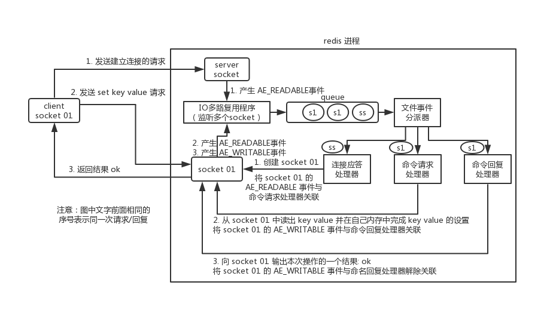
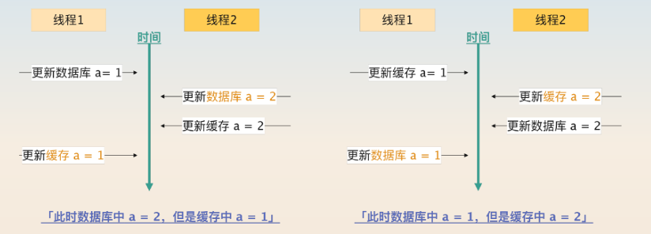
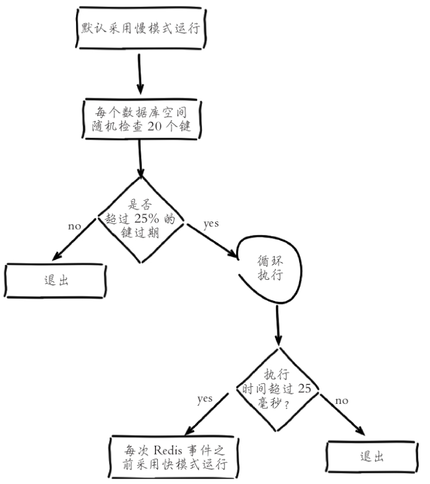

## Redis高级

### Redis命令执行流程

1、建立连接，2、命令处理，3、数据返回

`processInputBuffer` 会解析输入缓冲区的数据，根据命令格式调用不同方法解析，最终得到命令参数 `argv` 和参数个数 `argc`，再调用 `processCommand` 执行命令。

命令格式主要有：

- 单行命令 `PROTO_REQ_INLINE`
- 批量命令 `PROTO_REQ_MULTIBULK`

```c++

void processInputBuffer(client *c) { // networking.c
    server.current_client = c;
    /* 循环处理输入缓冲区中的所有数据 */
    while(sdslen(c->querybuf)) {
        .... // 处理client的状态（如是否阻塞、是否在事务中）
        /* 判断命令格式类型（telnet和redis-cli发送的命令格式不同） */
        if (!c->reqtype) {
            if (c->querybuf[0] == '*') {
                c->reqtype = PROTO_REQ_MULTIBULK; // 批量命令格式（如*2\r\n$3\r\nSET\r\n$5\r\nhello\r\n）
            } else {
                c->reqtype = PROTO_REQ_INLINE; // 单行命令格式（如SET hello world）
            }
        }
        /**
         * 解析输入缓冲区数据，得到命令参数argv和参数个数argc
         */
        if (c->reqtype == PROTO_REQ_INLINE) {
            if (processInlineBuffer(c) != C_OK) break; // 解析失败则退出循环
        } else if (c->reqtype == PROTO_REQ_MULTIBULK) {
            if (processMultibulkBuffer(c) != C_OK) break;
        } else {
            serverPanic("Unknown request type");
        }
        /* 参数个数为0时，重置client以接收下一条命令 */
        if (c->argc == 0) {
            resetClient(c);
        } else {
            // 执行解析得到的命令
            if (processCommand(c) == C_OK) {
                if (c->flags & CLIENT_MASTER && !(c->flags & CLIENT_MULTI)) {
                    // 若为从节点的主客户端，更新同步偏移量
                    c->reploff = c->read_reploff - sdslen(c->querybuf);
                }
                // 非阻塞状态下，重置client以接收新命令
                if (!(c->flags & CLIENT_BLOCKED) || c->btype != BLOCKED_MODULE)
                    resetClient(c);
            }
        }
    }
    server.current_client = NULL;
}
```

`processCommand` 是命令执行的核心逻辑，主要分为三步：

- 首先是调用 lookupCommand 方法获得对应的 redisCommand；
- 接着是检测当前 Redis 是否可以执行该命令；
- 最后是调用 call 方法真正执行命令。


### Redis单线程

**Redis 单线程指的是「接收客户端请求->解析请求 ->进行数据读写等操作->发送数据给客户端」这个过程是由一个线程（主线程）来完成的**。

但Redis的其他功能，比如**关闭文件、AOF 刷盘、释放内存**等，其实是由额外的线程执行的。例如执行 unlink key / flushdb async/ flushall async 等命令，会把这些删除操作交给后台线程来执行，好处是不会导致 Redis 主线程卡顿。

**Redis命令工作线程是单线程的，但是，整个Redis来说，是多线程的；**

之所以 Redis 为「关闭文件、AOF 刷盘、释放内存」这些任务创建单独的线程来处理，是因为这些任务的操作都是很耗时的，如果把这些任务都放在主线程来处理，那么 Redis 主线程就很容易发生阻塞，这样就无法处理后续的请求了。


Redis 内部使用文件事件处理器 `file event handler` ，这个文件事件处理器是单线程的，所以 Redis 才叫做单线程的模型。它采用 IO 多路复用机制同时监听多个 socket，将产生事件的 socket 压入内存队列中，事件分派器根据 socket 上的事件类型来选择对应的事件处理器进行处理。

文件事件处理器的结构包含 4 个部分：

- 多个 socket
- IO 多路复用程序
- 文件事件分派器
- 事件处理器（连接应答处理器、命令请求处理器、命令回复处理器）



多个 socket 可能会并发产生不同的操作，每个操作对应不同的文件事件，但是 IO 多路复用程序会监听多个 socket，会将产生事件的 socket 放入队列中排队，事件分派器每次从队列中取出一个 socket，根据 socket 的事件类型交给对应的事件处理器进行处理。


#### Redis 采用单线程为什么还这么快？

1. **基于内存操作**: Redis 的所有数据都存在内存中，因此所有的运算都是内存级别的，所以他的性能比较高； 
2. **数据结构简单**: Redis 的数据结构是专门设计的，而这些简单的数据结构的查找和操作的时间大部分复杂度都是 0(1)，因此性能比较高；
3. Redis **采用单线程模型可以避免了多线程之间的竞争**，省去了多线程切换带来的时间和性能上的开销，而且也不会导致死锁问题。
4. **多路复用和非阻塞 I/O**: Redis使用 I/O多路复用功能来监听多个 socket连接客户端，这样就可以使用一个线程来检查多个 Socket 的就绪状态，在单个线程中通过记录跟踪每一个 socket（I/O流）的状态来管理处理多个 I/O 流，减少线程切换带来的开销，同时也避免了 I/O 阻塞操作；


#### Redis6.0之前一直采用单线程的主要原因

1. 使用单线程模型是 Redis 的开发和维护更简单，因为**单线程模型方便开发和调试**；
2. 即使使用单线程模型也并发的处理多客户端的请求，主要使用的是IO多路复用和非阻塞IO；
3. 对于Redis系统来说，主要的**性能瓶颈是内存或者网络带宽而并非 CPU**。


#### 为什么逐渐加入多线程特性？

删除一个很大的数据时，因为是单线程原子命令操作，这就会导致 Redis 服务卡顿，于是在 Redis 4.0 中就新增了多线程的模块，主要是为了解决删除数据效率比较低的问题的。

使用惰性删除可以有效的解决性能问题, 在Redis4.0就引入了多个线程来实现数据的异步惰性删除等功能

```sh
unlink key     
flushdb async  
flushall async 
```

**但是其处理读写请求的仍然只有一个线程**，所以仍然算是狭义上的单线程。

在Redis6/7中引入了I/0多线程的读写，这样就可以更加高效的处理更多的任务了，Redis只是将I/O读写变成了多线程，而命令的执行依旧是由主线程串行执行的，因此在多线程下操作 Redis不会出现线程安全的问题。


多线程开启:

1. 设置`io-thread-do-reads`配置项为yes，表示启动多线程。
2. 设置线程个数 `io-threads`。关于线程数的设置，官方的建议是如果为4核的CPU，建议线程数设置为2或3，如果为8核CPU建议线程数设置为6，安程数一定要小于机器核数，线程数并不是越大越好。


因此， Redis 6.0 版本之后，Redis 在启动的时候，默认情况下会**额外创建 6 个线程**（*这里的线程数不包括主线程*）：

- Redis-server ： Redis的主线程，主要负责执行命令；
- bio_close_file、bio_aof_fsync、bio_lazy_free：三个后台线程，分别异步处理关闭文件任务、AOF刷盘任务、释放内存任务；
- io_thd_1、io_thd_2、io_thd_3：三个 I/O 线程，io-threads 默认是 4 ，所以会启动 3（4-1）个 I/O 多线程，用来分担 Redis 网络 I/O 的压力。


### BigKey

> **多大算BigKey？**

bigkey是指key对应的value所占的内存空间比较大


> **大 key 会带来的影响：**

1. **客户端超时阻塞**。由于 Redis 执行命令是单线程处理，然后在操作大 key 时会比较耗时，那么就会阻塞 Redis，从客户端这一视角看，就是很久很久都没有响应。
2. **引发网络阻塞**。每次获取大 key 产生的网络流量较大，如果一个 key 的大小是 1 MB，每秒访问量为 1000，那么每秒会产生 1000MB 的流量，这对于普通千兆网卡的服务器来说是灾难性的。
3. **阻塞工作线程**。如果使用 del 删除大 key 时，会阻塞工作线程，这样就没办法处理后续的命令。
4. **主从同步延迟**。由于大Key占用较多内存，同步过程中需要传输大量数据，这会导致主从之间的网络传输延迟增加，进而影响数据一致性。
5. **数据倾斜**。在Redis集群模式中，某个数据分片的内存使用率远超其他数据分片，无法使数据分片的内存资源达到均衡。


> **如何发现BigKey？**

redis-cli --bigkey

```sh
# 加上 -i 参数，每隔100 条 scan指令就会休眠0.1s. ops就不会剧烈抬升，但是扫描的时间会变长
redis-cli -h 127.0.0.1 -p 6379 --bigkeys -i 0.1
```

最好选择在从节点上执行该命令。因为主节点上执行时，会阻塞主节点；

如果没有从节点，那么可以选择在 Redis 实例业务压力的低峰阶段进行扫描查询，以免影响到实例的正常运行；或者可以使用 -i 参数控制扫描间隔，避免长时间扫描降低 Redis 实例的性能。


> **解决大 key 的思路**：

- 对大Key进行拆分。例如将含有数万成员的一个HASH Key拆分为多个HASH Key，并确保每个Key的成员数量在合理范围。在Redis集群架构中，拆分大Key能对数据分片间的内存平衡起到显著作用。
- 对大Key进行清理。将不适用Redis能力的数据存至其它存储，并在Redis中删除此类数据。注意，要使用异步删除。
- 监控Redis的内存水位。可以通过监控系统设置合理的Redis内存报警阈值进行提醒，例如Redis内存使用率超过70%、Redis的内存在1小时内增长率超过20%等。
- 对过期数据进行定期清。堆积大量过期数据会造成大Key的产生，例如在HASH数据类型中以增量的形式不断写入大量数据而忽略了数据的时效性。可以通过定时任务的方式对失效数据进行清理。


> **BigKey如何删除？**

分批次删除和异步删除

- String：一般用del，如果过于庞大使用unlink key 删除

- hash

  使用 hscan 每次获取部分field-value，再使用 hdel 删除每个field， 最后删除field-value

- list

  使用 ltrim 渐进式逐步删除，直到全部删除完成

- set

  使用 sscan 每次获取部分元素，再使用 srem 命令删除每个元素

- zset

  使用 zscan 每次获取部分元素，在使用 zremrangebyrank 命令删除每个元素


> **生产上限制 keys * /flushdb/flushall等危险命令以防止误删误用？**

通过配置设置禁用这些命令，redis.conf在SECURITY这一项中

```
rename-command keys ""
rename-command flushdb ""
rename-command flushall ""
```


> **不用keys *避免卡顿，那该用什么?** `scan, sscan, hscan, zscan`

```
scan cursor [MATCH pattern] [COUNT count]
```

* cursor : 游标
* pattern：匹配的模式
* count：指定数据集返回多少数据，默认10

SCAN 命令是一个基于游标的迭代器，每次被调用之后， 都会向用户返回一个新的游标， 用户在下次迭代时需要使用这个新游标作为 SCAN 命令的游标参数， 以此来延续之前的迭代过程。

SCAN的遍历顺序非常特别，它不是从第一维数组的第零位一直遍历到末尾，而是采用了高位进位加法来遍历。之所以使用这样特殊的方式进行遍历，是考虑到字典的扩容和缩容时避免槽位的遍历重复和遗漏。


> **分别说说三种写回策略，在持久化 BigKey 的时候，会影响什么？**

- Always 策略就是每次写入 AOF 文件数据后，就执行 fsync() 函数；
- Everysec 策略就会创建一个异步任务来执行 fsync() 函数；
- No 策略就是永不执行 fsync() 函数;

当使用 Always 策略的时候，如果写入是一个大 Key，主线程在执行 fsync() 函数的时候，阻塞的时间会比较久，因为当写入的数据量很大的时候，数据同步到硬盘这个过程是很耗时的。

当使用 Everysec 策略的时候，由于是异步执行 fsync() 函数，所以大 Key 持久化的过程（数据同步磁盘）不会影响主线程。

当使用 No 策略的时候，由于永不执行 fsync() 函数，所以大 Key 持久化的过程不会影响主线程


AOF 重写机制和 RDB 快照（bgsave 命令）的过程，都会分别通过 `fork()` 函数创建一个子进程来处理任务。会有两个阶段会导致阻塞父进程（主线程）：

- 创建子进程的途中，由于要复制父进程的页表等数据结构，阻塞的时间跟页表的大小有关，页表越大，阻塞的时间也越长；
- 创建完子进程后，如果父进程修改了共享数据中的大 Key，就会发生写时复制，这期间会拷贝物理内存，由于大 Key 占用的物理内存会很大，那么在复制物理内存这一过程，就会比较耗时，所以有可能会阻塞父进程。


### 热点key

如果一个key的访问频率占比过大，或带宽占比过大，都属于热点key。


**如何发现热点key？**

1. 根据业务经验进行分析
2. redis集群监控
3. 使用 `hotkey` 监控：`redis-cli --hotkeys`
4. 客户端收集：操作redis时加上统计查询频次的逻辑
5. 代理层收集


**如何解决热点key问题？**

1. 热点key拆分：将热点数据拆分到多个key中，例如通过引入随机前缀，使不同用户请求分散到多个key，多个key分布在多实例中，避免集中访问单一key。
2. 多级缓存：增加本地缓存分担redis压力
3. 读写分离：通过主从复制，将读请求分散到多个从节点
4. 限流和降级：热点key访问过高时，应用限流策略，减少redis请求，或者必要时返回降级的数据或空值。


### 缓存双写一致性（缓存更新策略）

数据不一致的根源：

* 源自操作部分失败，分布式事务问题（最难解决）
* 源自并发操作，核心是确保同一个时刻只有一个线程在更新数据库和缓存。


#### 常见的缓存更新策略

- Cache Aside（旁路缓存）策略；
- Read/Write Through（读穿 / 写穿）策略；
- Write Back（写回）策略；


**Cache Aside（旁路缓存）**

Cache Aside（旁路缓存）策略是最常用的，应用程序直接与「数据库、缓存」交互，并负责对缓存的维护，该策略又可以细分为「读策略」和「写策略」。

写策略的步骤：

- 先更新数据库中的数据，再删除缓存中的数据。

读策略的步骤：

- 如果读取的数据命中了缓存，则直接返回数据；
- 如果读取的数据没有命中缓存，则从数据库中读取数据，然后将数据写入到缓存，并且返回给用户。


**Read/Write Through（读穿 / 写穿）策略**

Read/Write Through（读穿 / 写穿）策略原则是应用程序只和缓存交互，不再和数据库交互，而是由缓存和数据库交互，相当于更新数据库的操作由缓存自己代理了。

Read Through 策略：

先查询缓存中数据是否存在，如果存在则直接返回，如果不存在，则由缓存组件负责从数据库查询数据，并将结果写入到缓存组件，最后缓存组件将数据返回给应用。

Write Through 策略：

当有数据更新的时候，先查询要写入的数据在缓存中是否已经存在：

- 如果缓存中数据已经存在，则更新缓存中的数据，并且由缓存组件同步更新到数据库中，然后缓存组件告知应用程序更新完成。
- 如果缓存中数据不存在，直接更新数据库，然后返回；


**Write Back（写回）策略**

Write Back（写回）策略在更新数据的时候，只更新缓存，同时将缓存数据设置为脏的，然后立马返回，并不会更新数据库。对于数据库的更新，会通过批量异步更新的方式进行。

Write Back 是计算机体系结构中的设计，比如 CPU 的缓存、操作系统中文件系统的缓存都采用了 Write Back（写回）策略。

**Write Back 策略特别适合写多的场景**，因为发生写操作的时候， 只需要更新缓存，就立马返回了。比如，写文件的时候，实际上是写入到文件系统的缓存就返回了，并不会写磁盘。**但是带来的问题是，数据不是强一致性的，而且会有数据丢失的风险**。


#### **数据库和缓存一致性的几种更新策略**

**1. 先更新数据库，再更新缓存**

问题：数据不一致



**2. 先更新缓存，再更新数据库**

问题：数据不一致

多线程下

```
【正常逻辑】
1 A update redis 100
2 A update mysql 100
3 B update redis 80
4 B update mysql 80
====================================
【异常逻辑】多线程环境下，A、B两个线程有快有慢有并行
A update redis  100
B update redis  80
B update mysql 80
A update mysql 100
====================================
----mysql100,redis80
```

**3. 先删除缓存，再更新数据库**

问题：数据不一致

多线程下

```
A删除缓存后，B查询操作没有命中缓存，B先把老数据读出来后放到缓存中，然后A更新操作更新了数据库。
于是，在缓存中的数据还是老的数据，数据库的数据是新数据
```

解决方案：

1. 延时双删策略：

   ```
   # 1.删除缓存
   redis.delKey(X)
   # 2.更新数据库
   db.update(X)
   # 3.一段时间后再删除缓存
   Thread.sleep(N)
   redis.delKey(X)
   
   线程A删除并更新数据库后等待一段时间，B将数据库数据写入缓存后，A再删除。
   等待时间大于B读取并写入时间。如何获取？评估耗时；后台监控程序（WatchDog）
   第二次删除可以使用异步删除，可以增加吞吐量
   ```

**4. 先更新数据库，再删除缓存**

问题：数据不一致

多线程下

```
假如某个用户数据在缓存中不存在，请求 A 读取数据时从数据库中查询到年龄为 20，在未写入缓存中时另一个请求 B 更新数据。它更新数据库中的年龄为 21，并且清空缓存。这时请求 A 把从数据库中读到的年龄为 20 的数据写入到缓存中。
```

但是在实际中，这个问题出现的概率并不高。因为缓存的写入通常要远远快于数据库的写入。

**Cache Aside 策略适合读多写少的场景，不适合写多的场景**，因为当写入比较频繁时，缓存中的数据会被频繁地清理，这样会对缓存的命中率有一些影响。如果业务对缓存命中率有严格的要求，那么可以考虑两种解决方案：

* 一种做法是在更新数据时也更新缓存，只是在更新缓存前先加一个分布式锁，因为这样在同一时间只允许一个线程更新缓存，就不会产生并发问题了。
* 另一种做法同样也是在更新数据时更新缓存，只是给缓存加一个较短的过期时间，这样即使出现缓存不一致的情况，缓存的数据也会很快过期，对业务的影响也是可以接受。


针对删除缓存异常的情况，解决方案：

1. 重试机制：引入消息队列把删除缓存要操作的数据加入消息队列，删除缓存失败则从队列中重新读取数据再次删除，删除成功就从队列中移除
2. 订阅MySql binlog，再操作缓存：更新数据库成功，就会产生一条变更日志，记录在 binlog 里。订阅 binlog 日志，拿到具体要操作的数据，然后再执行缓存删除。Canal。


> **为什么是删除缓存，而不是更新缓存？**

原因很简单，很多时候，在复杂点的缓存场景，缓存不单单是数据库中直接取出来的值。

比如可能更新了某个表的一个字段，然后其对应的缓存，是需要查询另外两个表的数据并进行运算，才能计算出缓存最新的值的。

另外更新缓存的代价有时候是很高的。是不是说，每次修改数据库的时候，都一定要将其对应的缓存更新一份？也许有的场景是这样，但是对于**比较复杂的缓存数据计算的场景**，就不是这样了。如果你频繁修改一个缓存涉及的多个表，缓存也频繁更新。但是问题在于，**这个缓存到底会不会被频繁访问到？**

其实删除缓存，而不是更新缓存，就是一个 lazy 计算的思想，不要每次都重新做复杂的计算，不管它会不会用到，而是让它到需要被使用的时候再重新计算。


> **多级缓存**

先更新数据库，再更新本地缓存，最后更新 Redis。先更新数据库是因为数据库应该是最准确的数据源。

其次更新本地缓存，理由有三个：一是更新本地缓存几乎不会失败；二是查询的时候是先查询本地缓存的，先更新本地缓存可以确保用户能够拿到最新的数据；三是即便后续 Redis  更新失败，因为本地缓存中数据是存在的，所以也不会查询到 Redis 中不一致的数据。


### 缓存雪崩/缓存击穿/缓存穿透

#### 缓存雪崩

redis故障或者redis中大量的缓存数据同时失效，导致大量的请求直接打到数据库或其他后端系统，造成系统性能急剧下降甚至宕机的现象。

解决：

1. 大量数据同时过期：

   1. 均匀设置过期时间或不过期：设置过期时间时可以加上一个随机数

   2. 互斥锁：保证同一时间只有一个请求访问数据库来构建缓存
   3. 后台更新缓存：业务线程不再负责更新缓存，缓存也不设置有效期，而是让缓存“永久有效”，并将更新缓存的工作交由后台线程定时更新。

2. redis故障

   1. 缓存集群高可用：哨兵、集群

   2. 服务降级、熔断

#### 缓存穿透

缓存穿透是指查询一个根本不存在的数据，缓存层和存储层都不会命中。缓存穿透将导致不存在的数据每次请求都要到存储层去查询，失去了缓存保护后端存储的意义，可能会使后端存储负载加大，甚至可能造成后端存储宕掉。

造成缓存穿透的基本原因有两个。第一，自身业务代码或者数据出现问题，第二，一些恶意攻击、爬虫等造成大量空命中。

解决：

1. 缓存空对象或缺省值：存储层不命中后，仍然将空对象或缺省值保留到缓存层中，之后再访问这个数据将会从缓存中获取。

   > 缓存空对象会有两个问题：第一，空值做了缓存，意味着缓存层中存了更多的键，需要更多的内存空间（如果是攻击，问题更严重），比较有效的方法是针对这类数据设置一个较短的过期时间，让其自动剔除。第二，缓存层和存储层的数据会有一段时间窗口的不一致，可能会对业务有一定影响。

2. 布隆过滤器：Google布隆过滤器Guava解决缓存穿透 [guava](https://github.com/google/guava/blob/master/guava/src/com/google/common/hash/BloomFilter.java)

3. 参数校验：在接口层对请求参数进行严格校验，过滤掉明显不合法的请求

7. 做好热点参数的限流

#### 缓存击穿

缓存击穿是指某些热点数据由于访问量大，且该数据的缓存刚好在某一时刻失效，导致大量并发请求同时击中数据库，从而造成数据库瞬时压力过大甚至宕机的现象。

与缓存雪崩不同，缓存击穿主要集中在某一条或少量几条缓存失效的热点数据上。

解决：

1. 差异失效时间：开辟两块缓存，设置不同的缓存过期时间，主A从B，先更新B再更新A，先查询A没有再查询B
2. 加锁策略，保证同一时间只有一个业务线程更新缓存
3. 不给热点数据设置过期时间，后台更新缓存
5. 接口限流、熔断与降级


### 缓存过期删除/内存淘汰策略

**redis默认内存多少可用？**

如果不设置最大内存或者设置最大内存大小为0，在64位操作系统下不限制内存大小，在32位操作系统下最多使用3GB内存

注意：在64bit系统下，maxmemory设置为0表示不限制redis内存使用

一般推荐Redis设置内存为最大物理内存的3/4

**如何修改redis内存设置**？

1. 通过修改文件配置 `maxmemory`

2. 通过命令修改，但是redis重启后会失效 `config set maxmemory SIZE`

什么命令查看redis内存使用情况：

info memory

config get maxmemory


#### 过期删除策略

每当我们对一个 key 设置了过期时间时，Redis 会把该 key 带上过期时间存储到一个**过期字典**（expires dict）中，也就是说「过期字典」保存了数据库中所有 key 的过期时间。

当我们查询一个 key 时，Redis 首先检查该 key 是否存在于过期字典中：

- 如果不在，则正常读取键值；
- 如果存在，则会获取该 key 的过期时间，然后与当前系统时间进行比对，如果比系统时间大，那就没有过期，否则判定该 key 已过期。

 Redis 选择「**惰性删除+定期删除**」这两种策略配和使用，以求在合理使用 CPU 时间和避免内存浪费之间取得平衡。

1. **立即/定时删除**：在设置 key 的过期时间时，同时创建一个定时事件，当时间到达时，由事件处理器自动执行 key 的删除操作。
2. **惰性删除**：不主动删除过期键，每次从数据库访问 key 时，都检测 key 是否过期，如果过期则删除该 key。节省CPU成本，但存在内存泄露。
3. **定期删除**：每隔一段时间「随机」从数据库中取出一定数量的 key 进行检查，并删除其中的过期key。超过一定比例则重复此操作。Redis 为了保证定期删除不会出现循环过度，导致线程卡死现象，为此增加了定期删除循环流程的时间上限，默认不会超过 25ms。缺点是难以确定删除操作执行的时长和频率。



1. 定时任务在每个数据库空间随机检查20个键，当发现过期时删除对应的键。
2. 如果超过检查数25%的键过期，循环执行回收逻辑直到不足25%或运行超时为止，慢模式下超时时间为25毫秒。
3. 如果之前回收键逻辑超时，则在Redis触发内部事件之前再次以快模式运行回收过期键任务，快模式下超时时间为1毫秒且2秒内只能运行1次。
4. 快慢两种模式内部删除逻辑相同，只是执行的超时时间不同。


> **Redis 持久化时，对过期键会如何处理的？**

Redis 持久化文件有两种格式：RDB（Redis Database）和 AOF（Append Only File）。

RDB：

- **RDB 文件生成阶段**：从内存状态持久化成 RDB文件的时候，会对 key 进行过期检查，**过期的键不会被保存到新的 RDB 文件中**，因此 Redis 中的过期键不会对生成新 RDB 文件产生任何影响。

- **RDB 文件加载阶段**：
  - **主服务器模式运行**：在载入 RDB 文件时，程序会对文件中保存的键进行检查，**过期键不会被载入到数据库中**。所以过期键不会对载入 RDB 文件的主服务器造成影响；
  - **从服务器模式运行**：在载入 RDB 文件时，**不论键是否过期都会被载入到数据库中**。但由于主从服务器在进行数据同步时，从服务器的数据会被清空。所以一般来说，过期键对载入 RDB 文件的从服务器也不会造成影响。

AOF：

- **AOF 文件写入阶段**：当 Redis 以 AOF 模式持久化时，如果数据库某个过期键还没被删除，那么 AOF 文件会保留此过期键，当此过期键被删除后，Redis 会向 AOF 文件追加一条 DEL 命令来显式地删除该键值。
- **AOF 重写阶段**：执行 AOF 重写时，会对 Redis 中的键值对进行检查，**已过期的键不会被保存到重写后的 AOF 文件中**，因此不会对 AOF 重写造成任何影响。


#### 内存淘汰策略

超过redis设置的最大内存，就会使用内存淘汰策略删除符合条件的key

LRU：最近最少使用页面置换算法，淘汰**最长时间未被使用**的页面，看页面最后一次被使用到发生调度的时间长短，首先淘汰最长时间未被使用的页面。

LFU：最近最不常用页面置换算法，淘汰**一定时期内被访问次数最少**的页面，看一定时间段内页面被使用的频率，淘汰一定时期内被访问次数最少的页


淘汰策略有哪些(Redis7版本)：

1. noeviction：默认策略，不会删除任何数据，拒绝所有写入操作并返回客户端错误信息
2. 对设置了过期时间的数据中进行淘汰
   1. LRU
   2. LFU
   3. random
   4. TTL：优先淘汰更早过期的key
3. 全部数据进行淘汰
   1. LRU
   2. LFU
   3. random


> **如何修改 Redis 内存淘汰策略？**

1. `config set maxmemory-policy <策略>` 设置之后立即生效，不需要重启 Redis 服务，重启 Redis 之后，设置就会失效。

2. 通过修改 Redis 配置文件修改，设置“`maxmemory-policy <策略>`”，它的优点是重启 Redis 服务后配置不会丢失，缺点是必须重启 Redis 服务，设置才能生效。


> **Redis 是如何实现 LRU 算法的？**

传统 LRU 算法的实现是基于「链表」结构，链表中的元素按照操作顺序从前往后排列，最新操作的键会被移动到表头，当需要内存淘汰时，只需要删除链表尾部的元素即可，因为链表尾部的元素就代表最久未被使用的元素。

Redis 并没有使用这样的方式实现 LRU 算法，因为传统的 LRU 算法存在两个问题：

- 需要用链表管理所有的缓存数据，这会带来额外的空间开销；
- 当有数据被访问时，需要在链表上把该数据移动到头端，如果有大量数据被访问，就会带来很多链表移动操作，会很耗时，进而会降低 Redis 缓存性能。

Redis 实现的是一种**近似 LRU 算法**，目的是为了更好的节约内存，它的**实现方式是在 Redis 的对象结构体中添加一个额外的字段，用于记录此数据的最后一次访问时间**。

当 Redis 进行内存淘汰时，会使用**随机采样的方式来淘汰数据**，它是随机取 N 个值，然后**淘汰最久没有使用的那个**。

Redis 实现的 LRU 算法的优点：

- 不用为所有的数据维护一个大链表，节省了空间占用；
- 不用在每次数据访问时都移动链表项，提升了缓存的性能；

但是 LRU 算法有一个问题，**无法解决缓存污染问题**，比如应用一次读取了大量的数据，而这些数据只会被读取这一次，那么这些数据会留存在 Redis 缓存中很长一段时间，造成缓存污染。


> **Redis 是如何实现 LFU 算法的？**

LFU 算法相比于 LRU 算法的实现，多记录了「数据的访问频次」的信息。

```c
typedef struct redisObject {
    ...
      
    // 24 bits，用于记录对象的访问信息
    unsigned lru:24;  
    ...
} robj;
```

Redis 对象头中的 lru 字段，在 LRU 算法下和 LFU 算法下使用方式并不相同。

**在 LRU 算法中**，Redis 对象头的 24 bits 的 lru 字段是用来记录 key 的访问时间戳，因此在 LRU 模式下，Redis可以根据对象头中的 lru 字段记录的值，来比较最后一次 key 的访问时间长，从而淘汰最久未被使用的 key。

**在 LFU 算法中**，Redis对象头的 24 bits 的 lru 字段被分成两段来存储，高 16bit 存储 ldt(Last Decrement Time)，用来记录 key 的访问时间戳；低 8bit 存储 logc(Logistic Counter)，用来记录 key 的访问频次。


### 布隆过滤器

布隆过滤器由「初始值都为 0 的 bit 数组」和「 N 个哈希函数」两部分组成，用来快速判断集合是否存在某个元素。

当我们在写入数据库数据时，在布隆过滤器里做个标记，这样下次查询数据是否在数据库时，只需要查询布隆过滤器，如果查询到数据没有被标记，说明不在数据库中。

布隆过滤器会通过 3 个操作完成标记：

- 第一步，使用 N 个哈希函数分别对数据做哈希计算，得到 N 个哈希值；
- 第二步，将第一步得到的 N 个哈希值对位图数组的长度取模，得到每个哈希值在位图数组的对应位置。
- 第三步，将每个哈希值在位图数组的对应位置的值设置为 1；

一个元素如果判断结果：存在-->元素可能存在；不存在-->元素一定不存在

布隆过滤器只能添加元素，不能删除元素，因为布隆过滤器的bit位可能是共享的，删掉元素会影响其他元素导致误判率增加


应用场景：

1. 解决缓存穿透问题
2. 黑白名单校验


为了解决布隆过滤器不能删除元素的问题，布谷鸟过滤器横空出世。https://www.cs.cmu.edu/~binfan/papers/conext14_cuckoofilter.pdf#:~:text=Cuckoo%20%EF%AC%81lters%20support%20adding%20and%20removing%20items%20dynamically,have%20lower%20space%20overhead%20than%20space-optimized%20Bloom%20%EF%AC%81lters.


### 分布式锁

https://redis.io/docs/latest/develop/use/patterns/distributed-locks/#implementations

基于 Redis 节点实现分布式锁时，对于加锁操作，我们需要满足三个条件。

- 加锁包括了读取锁变量、检查锁变量值和设置锁变量值三个操作，但需要以原子操作的方式完成，所以，我们使用 SET 命令带上 NX 选项来实现加锁；
- 锁变量需要设置过期时间，以免客户端拿到锁后发生异常，导致锁一直无法释放，所以，我们在 SET 命令执行时加上 EX/PX 选项，设置其过期时间；
- 锁变量的值需要能区分来自不同客户端的加锁操作，以免在释放锁时，出现误释放操作，所以，我们使用 SET 命令设置锁变量值时，每个客户端设置的值是一个唯一值，用于标识客户端；

满足这三个条件的分布式命令如下：

```sh
SET lock_key unique_value NX PX 10000 
```


而解锁的过程就是将 lock_key 键删除（del lock_key），但不能乱删，要保证执行操作的客户端就是加锁的客户端。所以，解锁的时候，我们要先判断锁的 unique_value 是否为加锁客户端，是的话，才将 lock_key 键删除。

解锁是有两个操作，这时就需要 Lua 脚本来保证解锁的原子性，因为 Redis 在执行 Lua 脚本时，可以以原子性的方式执行，保证了锁释放操作的原子性。

```lua
-- 这里的 KEYS[1] 就是锁的key，这里的ARGV[1] 就是当前线程标示
-- 获取锁中的标示，判断是否与当前线程标示一致
if (redis.call('GET', KEYS[1]) == ARGV[1]) then
  -- 一致，则删除锁
  return redis.call('DEL', KEYS[1])
else
  -- 不一致，则直接返回
  return 0
end
```


基于 Redis 实现分布式锁的**优点**：

1. 性能高效（这是选择缓存实现分布式锁最核心的出发点）。
2. 实现方便。因为 Redis 提供了 setnx 方法，实现分布式锁很方便。

基于 Redis 实现分布式锁的**缺点**：

1. 锁的可重入问题。
2. 没有重试机制。

2. 超时时间不好设置。可以基于续约的方式设置超时时间：先给锁设置一个超时时间，然后启动一个守护线程，让守护线程在一段时间后，重新设置这个锁的超时时间

3. Redis 主从复制模式中的数据是异步复制的，这样导致分布式锁的不可靠性。如果在 Redis 主节点获取到锁后，在没有同步到其他节点时，Redis 主节点宕机了，此时新的 Redis 主节点依然可以获取锁，所以多个应用服务就可以同时获取到锁。


#### Redisson

**Redisson分布式锁原理**

可重入：利用hash结构记录线程id和重入次数

可重试：利用信号量和Pub/Sub功能实现等待、唤醒，获取锁失败的重试机制

超时续约：利用watchDog，每个一段时间（releaseTime），重置超时时间。

**Redisson可重入锁原理**

在分布式锁中，采用hash结构来存储锁，其中外层key表示这把锁是否存在，内层key则记录当前这把锁被哪个线程持有。

```
key: myLock
value: {
    <UUID:threadId>: count
}
```

**获取锁**：

使用lua脚本，通过 `exists + hexists + hincrby` 保证只有一个线程成功设置键。

```lua
local key = KEYS[1]; -- 锁的key
local threadId = ARGV[1]; -- 线程唯一标识
local releaseTime = ARGV[2]; -- 锁的自动释放时间
-- 锁不存在
if (redis.call('exists', key) == 0) then
  -- 获取锁并添加线程标识，state设为1
  redis.call('hset', key, threadId, '1');
  -- 设置锁有效期
  redis.call('expire', key, releaseTime);
  return 1; -- 返回结果
end;
-- 锁存在，判断threadId是否为自己
if (redis.call('hexists', key, threadId) == 1) then
  -- 锁存在，重入次数 +1，这里用的是hash结构的incrby增长
  redis.call('hincrby', key, thread, 1);
  -- 设置锁的有效期
  redis.call('expire', key, releaseTime);
  return 1; -- 返回结果
end;
-- 若锁存在，但唯一标识不匹配：表明锁是被其他线程占用，当前线程无权解他人的锁，直接返回锁剩余过期时间
return redis.call('pttl',key);
```

**释放锁**：

```lua
local key = KEYS[1];
local threadId = ARGV[1];
local releaseTime = ARGV[2];
-- 如果锁不是自己的
if (redis.call('HEXISTS', key, threadId) == 0) then
    return nil; -- 直接返回
end;
-- 锁是自己的，锁计数-1，还是用hincrby，不过自增长的值为-1
local count = redis.call('hincrby', key, threadId, -1);
-- 判断重入次数为多少
if (count > 0) then
    -- 大于0，重置有效期
    redis.call('expire', key, releaseTime);
    return nil;
else
    -- 否则直接释放锁 并广播解锁消息，去唤醒那些争抢过锁但还处于阻塞中的线程
    redis.call('del', key);
    redis.call('publish', lockChannel, 0); 
    return nil;
end;
```


**watchdog**

如果调用 `lock()` **不传过期时间**，默认锁过期时间是 30s。

Redisson 内部会启动一个 **watchdog 定时任务**：

- 每隔 `leaseTime / 3` 时间（比如 10s），去刷新锁的过期时间。
- 这样即使业务执行很久，锁也不会被误删。

如果线程宕机，客户端连接断开 → watchdog 停止续期 → Redis 到期自动删除 → 锁被释放。


#### RedLock

基本思想：部署多个redis实例（>=5），客户端向多个实例上申请加锁，如果客户端能够和半数以上的节点成功地完成加锁操作，就认为客户端成功地获得分布式锁，否则加锁失败。

这样一来，即使有某个 Redis 节点发生故障，因为锁的数据在其他节点上也有保存，所以客户端仍然可以正常地进行锁操作，锁的数据也不会丢失。

客户端只有在满足下面的这**两个条件**时，才能认为是加锁成功：

1. 客户端从超过半数（大于等于N/2+1）的Redis节点上成功获取到了锁；

2. 客户端获取锁的总耗时没有超过锁的过期时间。

缺点：

1. 复杂性：需要多个redis实例，增加了系统的复杂性和维护成本
2. 不适用于高并发：需要访问多个实例同时尝试获取锁，可能导致锁性能下降
3. 锁的续期问题


### lua

Lua 本身并没有提供对于原子性的直接支持，它只是一种脚本语言，通常是嵌入到其他宿主程序中运行，比如 Redis。

在 Redis中执行 Lua的原子性是指：整个 Lua脚本在执行期间，会被当作一个整体，不会被其他客户端的命令打断。


redis.call() 用于执行 Redis的命令。当命令执行出错时，会阻断整个脚本执行，并将错误信息返回给客户端。

redis.pcall() 也用于执行 Redis的命令。当命令执行出错时，不会阻断脚本的执行，而是内部捕获错误，并继续执行后续的命令。


集群中，如果 Lua脚本操作的 key是同一个，能保证原子性；如果操作的 Key不相同，可能被 hash 到不同的 slot，也可能 hash 到相同的 slot，所以不一定能保证原子性；


当客户端向服务器发送一个带有 Lua脚本的请求时，Redis会把该脚本当作一个整体，然后加载到一个脚本缓存中，因为 Redis读写命令是单线程操作，所有的 Lua脚本会按照顺序串行进行读写，这样就保证每个 Lua不会被其他的客户端打断，从而保证了原子性：
