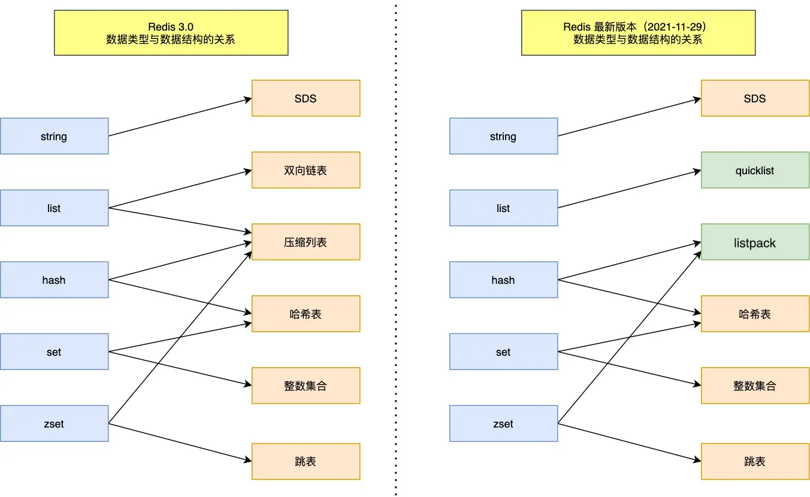

## 数据结构

### SDS

简单动态字符串用于存储字符串和整型数据。SDS兼容C语言标准字符串处理函数，且在此基础上保证了二进制安全。

char* 缺陷：

1. 获取字符串长度的时间复杂度为 O（N）；

2. 字符串的结尾是以 `'\0'` 字符标识，字符串里面不能包含有`'\0'` 字符，因此不能保存二进制数据；

3. 字符串操作函数不高效且不安全，比如有缓冲区溢出的风险，有可能会造成程序运行终止；


SDS改进：

1. Redis 的 SDS 结构因为加入了 len 成员变量，获取字符串长度的时间复杂度为O（1）。

2. 二进制安全。SDS 不需要用`'\0'`字符来标识字符串结尾，可以保存包含`'\0'` 的数据，但是SDS为了兼容结尾仍然加上 `'\0'` 空字符。SDS 的所有 API 都会以处理二进制的方式来处理 SDS 存放在 `buf[]` 数组里的数据，不会做任何限制。

3. 不会发生缓冲区溢出、减少内存分配次数。字符串操作时可以判断缓冲区大小是否足够，当缓冲区大小不够用时，Redis 会自动将扩大 SDS 的空间大小。进行空间扩展时，不仅分配所需的必要的空间，还会分配额外的未使用的空间，有效的减少内存分配次数。

   * 如果所需的 sds 长度小于 1 MB， 两倍扩容

   * 如果所需的 sds 长度大于等于 1 MB，增加1MB空间

4. 节省内存空间。设计了 5 种sds类型，分别是 sdshdr5、sdshdr8、sdshdr16、sdshdr32 和 sdshdr64。能灵活保存不同大小的字符串，从而有效节省内存空间。取消结构体在编译过程中的优化对齐，按照实际占用字节数进行对齐


### 链表


list 结构为链表提供了链表头指针 head、链表尾节点 tail、链表节点数量 len、以及可以自定义实现的 dup(节点值复制)、free(节点值释放)、match(节点值比较) 函数。


### 跳表

跳表支持平均 O(logN) 复杂度的节点查找，大部分情况下，跳表的效率可以和平衡树相媲美，并且跳表的实现比平衡树更简单。

跳跃表的基本思想：将有序链表中的部分节点分层，每一层都是一个有序链表。在查找时优先从最高层开始向后查找，当到达某节点时，如果next节点值大于要查找的值或next指针指向NULL，则从当前节点下降一层继续向后查找。


跳表是在链表基础上改进过来的，实现了一种「多层」的有序链表，这样的好处是能快速定位数据。


```c
typedef struct zskiplistNode {
    // 用于存储字符串类型的数据
    sds ele;
    // 用于存储排序的分值
    double score;
    // 后退指针：指向前一个节点，目的是为了方便从跳表的尾节点开始访问节点，这样倒序查找时很方便。
    struct zskiplistNode *backward;
  
    // 节点的level数组，保存每层上的前进指针和跨度
    struct zskiplistLevel {
        // 指向本层下一个节点，尾节点的forward指向NULL
        struct zskiplistNode *forward;
        // forward指向的节点与本节点之间的元素个数。span值越大，跳过的节点个数越多。
        unsigned long span; 
    } level[];
} zskiplistNode;
```

```c
typedef struct zskiplist {
    // 头节点是跳跃表的一个特殊节点，它的level数组元素个数为64。不存储任何member和score值，ele值为NULL, score值为0；也不计入跳跃表的总长度
    struct zskiplistNode *header, *tail;
    unsigned long length; 
    int level;
} zskiplist;
```


### 压缩列表

压缩列表ziplist本质上就是一个字节数组，是Redis为了节约内存而设计的一种线性数据结构，可以包含多个元素，每个元素可以是一个字节数组或一个整数。

Redis的zset、hash和list都直接或者间接使用了压缩列表。当他们的元素个数比较少，且元素都是短字符串时，Redis便使用压缩列表作为其底层数据存储结构。

但是，压缩列表的缺陷也是有的：

- 不能保存过多的元素，否则查询效率就会降低；
- 会记录前一个结点的大小，新增或修改某个元素时，压缩列表占用的内存空间需要重新分配，甚至可能引发连锁更新的问题。


> * ***zlbytes***：压缩列表的字节长度，占4个字节；
> * ***zltail***：压缩列表尾元素相对于压缩列表起始地址的偏移量，占4个字节；
> * ***zllen***：压缩列表的元素个数，占2个字节；
> * ***entryX***：压缩列表存储的元素，可以是字节数组或者整数。
>   * ***prevlen***：前一个元素的字节长度，占1个或者5个字节。
>     * 当前一个元素的长度小于254字节时，用1个字节表示；
>     * 当前一个元素的长度大于或等于254字节时，用5个字节来表示；
>   * ***encoding***：记录了当前节点实际数据的「类型和长度」，类型主要有两种：字节数组和整数。
>   * ***data***：记录了当前节点的实际数据，类型和长度都由 `encoding` 决定；
> * ***zlend***：压缩列表的结尾，占1个字节，恒为0xFF。


**连锁更新问题**：

由于 prevlen 保存前一个节点的长度，压缩列表新增、修改或删除某个元素时，可能导致后续元素的 prevlen 占用空间都发生变化，引起「连锁更新」问题。


压缩列表zl1中，元素entryX之后的所有元素（entryX+1、entryX+2等）的长度都是253字节，显然这些元素previous_entry_length字段的长度都是1字节。当删除元素entryX时，元素entryX+1的前驱节点改为元素entryX-1，长度为512字节，元素entryX+1的previous_entry_length字段需要5字节才能存储元素entryX-1的长度，则元素entryX+1的长度需要扩展至257字节；而由于元素entryX+1长度的增大，元素entryX+2的previous_entry_length字段同样需要改变。依此类推，由于删除了元素entryX，之后的所有元素（entryX+1、entryX+2等）的长度都必须扩展，而每次扩展都将重新分配内存，导致效率很低。

压缩列表zl2中，插入元素entryY时同样会出现这种情况。

连锁更新会导致多次重新分配内存及数据复制，效率很低。


尽管连锁更新的复杂度较高，但真正造成性能问题的几率是很低的：

1. 压缩列表里恰好有多个连续的、长度介于250-253字节之间的节点；
2. 即使出现连锁更新，但只要被更新的节点数量不多，就不会造成性能影响。


### 哈希表


```c
typedef struct dict {
    dictType *type;           /* 该字典对应的特定操作函数 */
    void *privdata;           /* 该字典依赖的数据 */
    dictht ht[2];             /* Hash表，键值对存储在此 */
    long rehashidx;           /* rehash标识。
    							默认值为-1，代表没进行rehash操作;
    							不为-1时，代表正进行rehash操作，存储的值表示Hash表ht[0]的rehash操作进行到了哪个索引值 */
    unsigned long iterators;   /* 当前运行的迭代器数 */
} dict;

typedef struct dictht {
    dictEntry **table;             /* 指针数组，用于存储键值对 */
    unsigned long size;            /* table数组的大小 */
    unsigned long sizemask;        /* 掩码 = size -1 用于计算索引值 */
    unsigned long used;            /* table数组已存元素个数，包含next单链表的数据 */
} dictht;

typedef struct dictEntry {
    //键值对中的键
    void *key;
  
    //键值对中的值 - 联合体节省内存空间
    union {
        void *val; // 指针
        uint64_t u64; // 无符号的 64 位整数
        int64_t s64; // 有符号的 64 位整数
        double d; // double值
    } v;
    // 拉链法解决hash冲突
    struct dictEntry *next;
} dictEntry;
```


**rehash**：

当哈希表保存的键值对数量太多或太少时，需要对哈希表大小进行相应的扩展或收缩，通过执行rehash（重新散列）完成。扩容时空间大小为当前容量的两倍；当使用量不到总空间10%时，则进行缩容，缩容时空间大小则为能恰好包含当前节点的2^N次方幂整数

一般情况下，只会使用ht[0]哈希表，ht[1]只会在对ht[0]进行rehash时使用。

rehash步骤：

1. 为 ht[1] 分配空间；
2. 将保存在 ht[0] 中的所有键值对 rehash（重新计算键的哈希值和索引值） 到 ht[1] 上；
3. 迁移完成后，释放 ht[0]，将 ht[1] 设置为 ht[0]，并在 ht[1] 新创建一个空白哈希表，为下次 rehash 做准备。


**渐进式 rehash**：

为了避免 rehash 在数据迁移过程中，因拷贝数据的耗时，影响 Redis 性能的情况，所以 Redis 采用了**渐进式 rehash**，也就是将数据的迁移的工作不再是一次性迁移完成，而是分多次迁移。

渐进式 rehash 步骤如下：

1. 为 ht[1] 分配空间，哈希表同时持有 ht[0] 和 ht[1] 两个哈希表；

2. 在 rehash 进行期间，每次哈希表元素进行新增、删除、查找或者更新操作时，Redis 除了会执行对应的操作之外，还会顺带将 ht[0] 中索引位置上的所有 key-value 迁移到 ht[1] 上；

3. 随着处理客户端发起的哈希表操作请求数量越多，最终在某个时间点会把 ht[0] 的所有 key-value 迁移到 ht[1]，从而完成 rehash 操作。

在渐进式 rehash 进行期间，哈希表元素的删除、查找、更新等操作都会在这两个哈希表进行。比如，查找一个 key 的值的话，先会在 ht[0] 里面进行查找，如果没找到，就会继续到 ht[1] 里面进行找到。新增一个 key-value 时，会被保存到 ht[1] 里面，而 ht[0] 则不再进行任何添加操作。


**rehash 触发条件**：

触发 rehash 操作的条件，主要有两个：

- 当负载因子大于等于 1 ，并且 Redis 没有在执行 bgsave 命令或者 bgrewiteaof 命令，也就是没有执行 RDB 快照或没有进行 AOF 重写的时候，就会进行 rehash 操作。
- 当负载因子大于等于 5 时，此时说明哈希冲突非常严重了，不管有没有有在执行 RDB 快照或 AOF 重写，都会强制进行 rehash 操作。


### 整数集合

整数集合是 Set 对象的底层实现之一。当一个 Set 对象只包含整数值元素，并且元素数量不大时，就会使用整数集这个数据结构作为底层实现。

整数集合本质上是一块连续内存空间。

```c
typedef struct intset {
    //编码方式
    uint32_t encoding;
    //集合包含的元素数量
    uint32_t length;
    //保存元素的数组
    int8_t contents[];
} intset;
```

虽然 contents 被声明为 int8_t 类型的数组，但是实际上 contents 数组并不保存任何 int8_t 类型的元素，contents 数组的真正类型取决于 intset 结构体里的 encoding 属性的值。比如int16_t, int32_t, int64_t.


**升级**：

当我们将一个新元素加入到整数集合里面，如果新元素的类型比整数集合现有所有元素的类型都要长时，整数集合需要先进行升级，才能将新元素加入到整数集合里。整数集合不支持降级。

1. 根据新元素的类型，扩展整数集合底层数组的空间大小，并为新元素分配空间；
2. 将底层数组现有的所有元素都转换为与新元素相同的类型，并将转换后的元素放置到正确的位置；
3. 将新元素添加到底层数组中。

整数集合升级的过程不会重新分配一个新类型的数组，而是在原本的数组上扩展空间，然后在将每个元素按间隔类型大小分割，如果 encoding 属性值为 INTSET_ENC_INT16，则每个元素的间隔就是 16 位。


因为每次向整数集合中添加元素都有可能引起升级，而每次升级都需要对底层数组中已有的所有元素进行类型转换，所以向整数集合中添加元素的时间复杂度为O(n)。

升级的好处：

1. 提升灵活性。整数集合可以通过自动升级底层数组来适应新元素，所以可以随意将int16_t, int32_t, int64_t类型整数添加到集合中，不必担心出现类型错误。
2. 节约内存。升级只会在有需要的时候进行，可以尽量节省内存


### 快速列表

quicklist 就是「双向链表 + 压缩列表」组合，quicklist是一个双向链表，链表中的每个节点是一个ziplist结构。

quicklist 通过控制每个链表节点中的压缩列表的大小或者元素个数，来规避连锁更新的问题。因为压缩列表元素越少或越小，连锁更新带来的影响就越小，从而提供了更好的访问性能。


在向 quicklist 添加一个元素的时候，不会像普通的链表那样，直接新建一个链表节点。而是会检查插入位置的压缩列表是否能容纳该元素，如果能容纳就直接保存到 quicklistNode 结构里的压缩列表，如果不能容纳，才会新建一个新的 quicklistNode 结构。

quicklist 会控制 quicklistNode 结构里的压缩列表的大小或者元素个数，来规避潜在的连锁更新的风险，但是这并没有完全解决连锁更新的问题。


### listpack

Redis 在 5.0 新设计一个数据结构叫 listpack，目的是替代压缩列表，它最大特点是 listpack 中每个节点不再包含前一个节点的长度了，压缩列表每个节点正因为需要保存前一个节点的长度字段，就会有连锁更新的隐患。


* encoding，定义该元素的编码类型，会对不同长度的整数和字符串进行编码；
* data，实际存放的数据；
* len，encoding+data的总长度；

listpack 没有压缩列表中记录前一个节点长度的字段了，listpack 只记录当前节点的长度，当我们向 listpack 加入一个新元素的时候，不会影响其他节点的长度字段的变化，从而避免了压缩列表的连锁更新问题。


## 对象类型和编码

redis中每个对象都由一个redisObject结构表示：

```c
typedef struct redisObject {
 // 数据类型
 unsigned type:4;
 // 编码和底层实现
 unsigned encoding:4;
 // 指向底层实现数据结构的指针
 void *ptr;
 // ...
} robj;
```

type属性记录了对象的数据类型，包括：String（字符串），Hash（哈希），List（列表），Set（集合），Zset（有序集合）， BitMap（2.2 版新增），HyperLogLog（2.8 版新增），GEO（3.2 版新增），Stream（5.0 版新增）。对于Redis数据库保存的键值对来说，键总是一个字符串对象，而值可以是以上数据类型的一种。

encoding属性记录了对象使用的编码，即对象使用的底层数据结构。




### string

字符串类型的内部编码有3种：

* int：8个字节的长整型。
* embstr：小于等于 32 字节（redis 2.+版本）的字符串。
* raw：大于 32 字节（redis 2.+版本）的字符串。

>  embstr 编码和 raw 编码的边界在 redis 不同版本中是不一样的：
>
> * redis 2.+ 是 32 字节
> * redis 3.0-4.0 是 39 字节
> * redis 5.0 是 44 字节

`embstr`和`raw`编码都会使用`SDS`来保存值，但不同之处在于`embstr`会通过一次内存分配函数来分配一块连续的内存空间来保存`redisObject`和`SDS`，而`raw`编码会通过调用两次内存分配函数来分别分配两块空间来保存`redisObject`和`SDS`。


### list

列表类型的内部编码有两种。

* **ziplist**（压缩列表）：当列表的元素个数小于list-max-ziplist-entries配置（默认512个），同时列表中每个元素的值都小于list-max-ziplist-value配置时（默认64字节），Redis会选用ziplist来作为列表的内部实现来减少内存的使用。
* **linkedlist**（链表）：当列表类型无法满足ziplist的条件时，Redis会使用linkedlist作为列表的内部实现。

在 Redis 3.2 版本之后，List 数据类型底层数据结构就只由 **quicklist** 实现了，替代了双向链表和压缩列表。


### hash

哈希类型的内部编码有两种：

* **ziplist**（压缩列表）：当哈希类型元素个数小于hash-max-ziplist-entries配置（默认512个）、同时所有值都小于hash-max-ziplist-value配置（默认64字节）时，Redis会使用ziplist作为哈希的内部实现，ziplist使用更加紧凑的结构实现多个元素的连续存储，所以在节省内存方面比hashtable更加优秀。
* **hashtable**（哈希表）：当哈希类型无法满足ziplist的条件时，Redis会使用hashtable作为哈希的内部实现，因为此时ziplist的读写效率会下降，而hashtable的读写时间复杂度为O(1)。

在 Redis 7.0 中，压缩列表数据结构已经废弃了，交由 **listpack** 数据结构来实现了。


### set

集合类型的内部编码有两种：

* intset（整数集合）：当集合中的元素都是整数且元素个数小于set-max-intset-entries配置（默认512个）时，Redis会选用intset来作为集合的内部实现，从而减少内存的使用。
* hashtable（哈希表）：当集合类型无法满足intset的条件时，Redis会使用hashtable作为集合的内部实现。


### zset

有序集合类型的内部编码有两种：

* ziplist（压缩列表）：当有序集合的元素个数小于zset-max-ziplist-entries配置（默认128个），同时每个元素的值都小于zset-max-ziplist-value配置（默认64字节）时，Redis会用ziplist来作为有序集合的内部实现，ziplist可以有效减少内存的使用。
* skiplist（跳跃表）：当ziplist条件不满足时，有序集合会使用skiplist作为内部实现，因为此时ziplist的读写效率会下降。

在 Redis 7.0 中，压缩列表数据结构已经废弃了，交由 listpack 数据结构来实现了。


zset结构中的dict字典为有序集合创建了一个从成员到分值的映射。通过这个字典可以O(1) 复杂度查找给定成员的分值。虽然同时使用 skiplist 和 字典保存有序集合，但这个两种数据结构都会通过指针共享相同元素的成员和分值，不会浪费额外内存。

