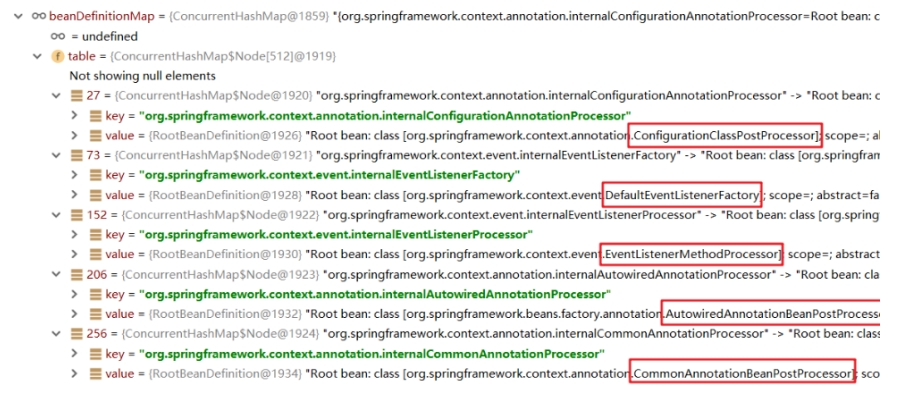

---
hide:
  - navigation
---

## IoC、DI和AOP思想提出

**IoC 控制反转思想的提出**：

IoC思想： Inversion of Control，控制反转，强调的是原来在程序中创建Bean的权利反转给第三方。例如：原来在程序中手动的去 new UserServiceImpl()，手动的去new UserDaoImpl()，而根据IoC思想的指导， 寻求一个第三方去创建UserServiceImpl对象和UserDaoImpl对象。

工厂设计模式，BeanFactory来充当第三方的角色，以使用配置文件配置Bean的基本信息，来产生Bean实例。

Spring通过控制反转实现了对象的创建和对象间的依赖关系管理。开发者只需要定义好Bean及其依赖关系，Spring容器负责创建和组装这些对象。

**DI 依赖注入思想的提出**：

DI：Dependency Injection，依赖注入，某个Bean的完整创建依赖于其他Bean（或普通参数）的注入

IoC和DI的关系：

* IoC强调的是Bean创建权的反转，而DI强调的是Bean的依赖关系
* IoC强调的是Bean创建权的反转，而DI强调的是通过注入的方式反转Bean的创建权，认为DI 是IoC的其中一种实现方式

**AOP 面向切面思想的提出**：

AOP，Aspect Oriented Programming，面向切面编程，能够将那些与业务无关，却为业务模块所共同调用的逻辑封装起来，以减少系统的重复代码，降低模块间的耦合度。


## IoC

### BeanFactory

BeanFactory为IoC功能提供了底层基础

1）导入Spring的jar包或Maven坐标；

2）定义UserService接口及其UserServiceImpl实现类； 

3）创建beans.xml配置文件，将UserServiceImpl的信息配置到该xml中；

```xml
<bean id="userService" class="com.itheima.service.impl.UserServiceImpl"></bean>
```

4）编写测试代码，创建BeanFactory，加载配置文件，获取UserService实例对象。

```java
//创建BeanFactory
DefaultListableBeanFactory beanFactory = new DefaultListableBeanFactory();
//创建读取器
XmlBeanDefinitionReader reader = new XmlBeanDefinitionReader(beanFactory);
//加载配置文件
reader.loadBeanDefinitions("beans.xml");
//获取Bean实例对象
UserDao userService = (UserService) beanFactory.getBean("userService");
```


### ApplicationContext

ApplicationContext 称为Spring容器，内部封装了BeanFactory，比BeanFactory功能更丰富更强大，使用 ApplicationContext 进行开发时，xml配置文件的名称习惯写成applicationContext.xml

```java
//创建ApplicationContext,加载配置文件，实例化容器
ApplicationContext applicationContext = new ClassPathxmlApplicationContext(“applicationContext.xml");
//根据beanName获得容器中的Bean实例
UserService userService = (UserService) applicationContext.getBean("userService");
System.out.println(userService);
```

BeanFactory与ApplicationContext的关系:

1. BeanFactory是Spring的早期接口，称为Spring的Bean工厂，ApplicationContext是后期更高级接口，称之为 Spring 容器；
2. ApplicationContext在BeanFactory基础上对功能进行了扩展，例如：监听功能、国际化功能等。BeanFactory的 API更偏向底层，ApplicationContext的API大多数是对这些底层API的封装；
3. Bean创建的主要逻辑和功能都被封装在BeanFactory中，ApplicationContext不仅继承了BeanFactory，而且 ApplicationContext内部还维护着BeanFactory的引用，所以，ApplicationContext与BeanFactory既有继承关系，又 有融合关系。 
4. Bean的初始化时机不同，原始BeanFactory是在首次调用getBean时才进行Bean的创建，而ApplicationContext则是配置文件加载，容器一创建就将Bean都实例化并初始化好

ApplicationContext除了继承了BeanFactory外，还继承了ApplicationEventPublisher（事件发布器）、 ResouresPatternResolver（资源解析器）、MessageSource（消息资源）等。但是ApplicationContext的核心功能还是BeanFactory。


只在Spring基础环境下，即只导入spring-context坐标时，此时ApplicationContext的继承体系：


如果Spring基础环境中加入了其他组件解决方案，如web层解决方案，即导入spring-web坐标，此时 ApplicationContext的继承体系：


| 实现类                                | 简介                                                     |
| ------------------------------------- | -------------------------------------------------------- |
| ClassPathXmlApplicationContext        | 通过读取类路径下的 XML 格式的配置文件创建 IoC 容器对象   |
| FileSystemXmlApplicationContext       | 通过文件系统路径读取 XML 格式的配置文件创建 IoC 容器对象 |
| AnnotationConfigApplicationContext    | 通过读取Java配置类注解创建 IoC 容器对象                  |
| XmlWebApplicationContext              | web环境下，加载类路径下的xml配置的ApplicationContext     |
| AnnotationConfigWebApplicationContext | web环境下，读取Java配置类注解创建 IoC 容器对象           |


### 基于XML的Spring应用

#### SpringBean 的配置

##### Bean的常用配置

| XML配置方式                                 | 描述                                                         |
| ------------------------------------------- | ------------------------------------------------------------ |
| `<bean id="" class="">`                     | Bean的id和全限定名配置。唯一标识默认类名首字母小写           |
| `<bean name="">`                            | 通过name设置Bean的别名，通过别名也能直接获取到Bean实例       |
| `<bean scope="">`                           | Bean的作用范围，BeanFactory作为容器时取值singleton和prototype |
| `<bean lazy-init="">`                       | Bean的实例化时机，是否延迟加载。BeanFactory作为容器时无效    |
| `<bean init-method="">`                     | Bean实例化后自动执行的初始化方法，method指定方法名           |
| `<bean destroy-method="">`                  | Bean实例销毁前的方法，method指定方法名                       |
| `<bean autowire="byType">`                  | 设置自动注入模式，常用的有按照类型byType，按照名字byName     |
| `<bean factory-bean="" factory-method=""/>` | 指定哪个工厂Bean的哪个方法完成Bean的创建                     |

例如：配置UserDaoImpl由Spring容器负责管理

```xml
<bean id="userDao" class="com.itheima.dao.impl.UserDaoImpl"/>
```

此时存储到Spring容器（singleObjects单例池）中的Bean的beanName是userDao，值是UserDaoImpl对象，可 以根据beanName获取Bean实例

```java
applicationContext.getBean("userDao"); 
```

如果不配置id，则Spring会把当前Bean实例的全限定名作为beanName 

```java
applicationContext.getBean("com.itheima.dao.impl.UserDaoImpl");
```


Bean的范围配置：

默认情况下，单纯的Spring环境Bean的作用范围有两个：Singleton和Prototype 

* singleton：单例，默认值，Spring容器创建的时候，就会进行Bean的实例化，并存储到容器内部的单例池中 ，每次getBean时都是从单例池中获取相同的Bean实例； 
* prototype：原型，Spring容器初始化时不会创建Bean实例，当调用getBean时才会实例化Bean，每次 getBean都会创建一个新的Bean实例。

Web环境下还有：request, session, application, websocket


Bean的延迟加载：

当lazy-init设置为true时为延迟加载，也就是当Spring容器创建的时候，不会立即创建Bean实例，等待用到时再创建Bean实例并存储到单例池中去，后续在使用该Bean直接从单例池获取即可，本质上该Bean还是单例的。


Bean的初始化和销毁方法配置：

Bean在被实例化后，可以执行指定的初始化方法完成一些初始化的操作，Bean在销毁之前也可以执行指定的销毁方法完成一些操作。

除此之外，我们还可以通过实现 InitializingBean 接口完成一些Bean的初始化操作；DisposableBean 接口完成在销毁bean时执行某些操作

```java
public class UserDaoImpl implements UserDao, InitializingBean {
    public UserDaoImpl() {System.out.println("UserDaoImpl创建了...");}
    public void init(){System.out.println("初始化方法...");}
    public void destroy(){System.out.println("销毁方法...");}
    
    //执行时机早于init-method配置的方法
    public void afterPropertiesSet() throws Exception {
        System.out.println("InitializingBean..."); 
    }
}
```


##### Bean的实例化配置

Spring的实例化方式主要如下两种： 

* 构造方式实例化：底层通过构造函数对Bean进行实例化 
* 工厂方式实例化：底层通过调用自定义的工厂方法对Bean进行实例化

构造函数实例化Bean又分为无参构造方法实例化和有参构造方法实例化，Spring中配置的几乎都是无参构造方式。

有参构造在实例化Bean时，需要参数的注入，通过标签嵌入在标签内部提供构造参数：

```xml
<bean id="userDao" class="com.itheima.dao.impl.UserDaoImpl">
    <constructor-arg name="name" value="haohao"/>
</bean>
```

工厂方式实例化Bean，又分为如下三种： 

1. 静态工厂方法实例化Bean 

2. 实例工厂方法实例化Bean 

3. 实现FactoryBean规范延迟实例化Bean

1）静态工厂方法实例化Bean，其实就是定义一个工厂类，提供一个静态方法用于生产Bean实例，class为工厂类，factory-method为工厂方法。

```java
//工厂类
public class UserDaoFactoryBean {
    //非静态工厂方法
    public static UserDao getUserDao(String name){
        //可以在此编写一些其他逻辑代码
        return new UserDaoImpl();
    }
}

```

```xml
<bean id="userDao" class="com.itheima.factory.UserDaoFactoryBean" factory-method="getUserDao">
    <constructor-arg name="name" value="haohao"/>
</bean>
```

constructor-arg 标签不仅仅是为构造方法传递参数，只要是为了实例化对象而传递的参数都可以通过标签完成，例如上面通过静态工厂方法实例化Bean所传递的参数也是要通过 constructor-arg 进行传递的。

2）实例工厂方法，也就是非静态工厂方法产生Bean实例，与静态工厂方式比较，该方式需要先有工厂对象，再用工厂对象去调用非静态方法，所以在进行配置时，要先配置工厂Bean，再配置目标Bean。

```java
//工厂类
public class UserDaoFactoryBean2 {
    //非静态工厂方法
    public UserDao getUserDao(String name){
        //可以在此编写一些其他逻辑代码
        return new UserDaoImpl();
    }
}
```

```xml
<!-- 配置实例工厂Bean -->
<bean id="userDaoFactoryBean2" class="com.itheima.factory.UserDaoFactoryBean2"/>
<!-- 配置实例工厂Bean的哪个方法作为工厂方法 -->
<bean id="userDao" factory-bean="userDaoFactoryBean2" factory-method="getUserDao">
    <constructor-arg name="name" value="haohao"/>
</bean>
```

3）Spring提供了FactoryBean的接口规范，实现该接口产生Bean实例：

```java
public interface FactoryBean<T> {
    String OBJECT_TYPE_ATTRIBUTE = "factoryBeanObjectType";

    @Nullable
    T getObject() throws Exception; //获得实例对象

    @Nullable
    Class<?> getObjectType(); //获得实例对象类型

    default boolean isSingleton() {
        return true;
    }
}
```

Spring容器创建时，FactoryBean被实例化并存储到了单例池singletonObjects中，但是 getObject() 方法尚未被执行，UserDaoImpl也没被实例化，当首次用到UserDaoImpl时，才调用getObject() ， 此工厂方式产生的Bean实例不会存储到单例池singletonObjects中，会存储到 factoryBeanObjectCache 缓存池中，并且后期每次使用到userDao都从该缓存池中返回的是同一个userDao实例。

**FactoryBean和BeanFactory区别**：

* **FactoryBean **是 Spring 中一种特殊的 bean，可以在 getObject() 工厂方法自定义的逻辑创建Bean！是一种能够生产其他 Bean 的 Bean。FactoryBean 在容器启动时被创建，而在实际使用时则是通过调用 getObject() 方法来得到其所生产的 Bean。因此，FactoryBean 可以自定义任何所需的初始化逻辑，生产出一些定制化的 bean。一般情况下，整合第三方框架，都是通过定义FactoryBean实现。

* **BeanFactory** 是 Spring 框架的基础，其作为一个顶级接口定义了容器的基本行为，例如管理 bean 的生命周期、配置文件的加载和解析、bean 的装配和依赖注入等。BeanFactory 接口提供了访问 bean 的方式，例如 getBean() 方法获取指定的 bean 实例。它可以从不同的来源（例如 Mysql 数据库、XML 文件、Java 配置类等）获取 bean 定义，并将其转换为 bean 实例。同时，BeanFactory 还包含很多子类（例如，ApplicationContext 接口）提供了额外的强大功能。

总的来说，FactoryBean 和 BeanFactory 的区别主要在于前者是用于创建 bean 的接口，它提供了更加灵活的初始化定制功能，而后者是用于管理 bean 的框架基础接口，提供了基本的容器功能和 bean 生命周期管理。


##### Bean的依赖注入配置

| 注入方式                   | 配置方式                                                     |
| -------------------------- | ------------------------------------------------------------ |
| 通过Bean的set方法注入      | `<property name="userDao" ref="userDao"/>`<br/>`<property name="userDao" value="haohao"/>` |
| 通过Bean的构造方法进行注入 | `<constructor-arg name="name" ref="userDao"/>`<br/>`<constructor-arg name="name" value="haohao"/>` |

ref 用于引用其他Bean的id。value 用于注入普通属性值。

经验法则是使用构造方式注入强制依赖，使用set方式注入可选依赖，但是最好使用带有编程验证参数的构造函数注入。

依赖注入的数据类型有如下三种： 

* 普通数据类型，例如：String、int、boolean等，通过value属性指定。 
* 引用数据类型，例如：UserDaoImpl、DataSource等，通过ref属性指定。 
* 集合数据类型，例如：List、Map、Properties等。

```xml
<bean id="moreComplexObject" class="example.ComplexObject">
    <!-- results in a setAdminEmails(java.util.Properties) call -->
    <property name="adminEmails">
        <props>
            <prop key="administrator">administrator@example.org</prop>
            <prop key="support">support@example.org</prop>
            <prop key="development">development@example.org</prop>
        </props>
    </property>
    <!-- results in a setSomeList(java.util.List) call -->
    <property name="someList">
        <list>
            <value>a list element followed by a reference</value>
            <ref bean="myDataSource" />
        </list>
    </property>
    <!-- results in a setSomeMap(java.util.Map) call -->
    <property name="someMap">
        <map>
            <entry key="an entry" value="just some string"/>
            <entry key="a ref" value-ref="myDataSource"/>
        </map>
    </property>
    <!-- results in a setSomeSet(java.util.Set) call -->
    <property name="someSet">
        <set>
            <value>just some string</value>
            <ref bean="myDataSource" />
        </set>
    </property>
</bean>
```


##### 自动装配方式

如果被注入的属性类型是Bean引用的话，那么可以在标签中使用 autowire 属性去配置自动注入方式，属性值有两个：

* byName：通过属性名自动装配，即去匹配 setXxx 与 id="xxx"（name="xxx"）是否一致； 
* byType：通过Bean的类型从容器中匹配，匹配出多个相同Bean类型时，报错。

```xml
<bean id="userService" class="com.itheima.service.impl.UserServiceImpl" autowire="byType">
```


##### Spring的其他配置标签

`<beans>`标签，除了经常用的做为根标签外，还可以嵌套在根标签内，使用profile属性切换开发环境。指定被激活的环境：

1. 使用命令行动态参数，虚拟机参数位置加载 -Dspring.profiles.active=test 

2. 使用代码的方式设置环境变量 System.setProperty("spring.profiles.active","test")

```xml
<!-- 配置测试环境下，需要加载的Bean实例 -->
<beans profile="test">
</beans>
<!-- 配置开发环境下，需要加载的Bean实例 -->
<beans profile="dev">
</beans>
```


`<import>`标签，用于导入其他配置文件

```xml
<!--导入用户模块配置文件-->
<import resource="classpath:UserModuleApplicationContext.xml"/>
```


`<alias>`标签是为某个Bean添加别名，与在 标签上使用name属性添加别名的方式一样:

```xml
<!--配置UserService-->
<bean id="userService" name="aaa,bbb" class="com.itheima.service.impl.UserServiceImpl">
    <property name="userDao" ref="userDao"/>
</bean>
<!--指定别名-->
<alias name="userService" alias="xxx"/>
<alias name="userService" alias="yyy"/>
```

在beanFactory中维护着一个名为aliasMap的Map集合，存储别名和 beanName 之间的映射关系.


#### Spring 的get方法

| 方法定义                                | 返回值和参数                                                 |
| --------------------------------------- | ------------------------------------------------------------ |
| Object getBean (String beanName)        | 根据beanName从容器中获取Bean实例，要求容器中Bean唯一，返回值为Object，需要强转 |
| T getBean (Class type)                  | 根据Class类型从容器中获取Bean实例，要求容器中Bean类型唯一，返回值为Class类型实例， 无需强转 |
| T getBean (String beanName，Class type) | 根据beanName从容器中获得Bean实例，返回值为Class类型实例，无需强转 |

```java
//根据beanName获取容器中的Bean实例，需要手动强转
UserService userService = (UserService) applicationContext.getBean("userService");

//根据Bean类型去容器中匹配对应的Bean实例，如存在多个匹配Bean则报错
UserService userService2 = applicationContext.getBean(UserService.class);

//根据beanName获取容器中的Bean实例，指定Bean的Type类型
UserService userService3 = applicationContext.getBean("userService", UserService.class);
```


#### Spring 配置非自定义Bean

配置非自定义的Bean需要考虑如下两个问题： 

* 被配置的Bean的实例化方式是什么？无参构造、有参构造、静态工厂方式还是实例工厂方式；
* 被配置的Bean是否需要注入必要属性。

例如，产生一个指定日期格式的对象，原始代码按如下：

```java
String currentTimeStr = "2023-08-27 07:20:00";
SimpleDateFormat simpleDateFormat = new SimpleDateFormat("yyyy-MM-dd HH:mm:ss");
Date date = simpleDateFormat.parse(currentTimeStr);
```

可以看成是实例工厂方式，使用Spring配置方式产生Date实例:

```xml
<bean id="simpleDateFormat" class="java.text.SimpleDateFormat">
    <constructor-arg name="pattern" value="yyyy-MM-dd HH:mm:ss"/>
</bean>
<bean id="date" factory-bean="simpleDateFormat" factory-method="parse">
    <constructor-arg name="source" value="2023-08-27 07:20:00"/>
</bean>
```


#### Bean 实例化的基本流程

1）加载xml配置文件，解析获取配置中的每个的信息，封装成一个个的BeanDefinition对象; 

2）将BeanDefinition存储在一个名为beanDefinitionMap的Map中;

3）ApplicationContext底层遍历beanDefinitionMap，使用反射创建Bean实例对象; 

4）创建好的Bean实例对象，被存储到一个名为singletonObjects的Map中; 

5）当执行applicationContext.getBean(beanName)时，从singletonObjects去匹配Bean实例返回。


DefaultListableBeanFactory对象内部维护着一个Map用于存储封装好的BeanDefinitionMap：

```java
public class DefaultListableBeanFactory extends ... implements ... {
    //存储<bean>标签对应的BeanDefinition对象
    //key:是Bean的beanName，value:是Bean定义对象BeanDefinition
    private final Map<String, BeanDefinition> beanDefinitionMap;
}
```

Spring框架会取出beanDefinitionMap中的每个BeanDefinition信息，反射构造方法或调用指定的工厂方法生成Bean实例对象，所以只要将BeanDefinition注册到beanDefinitionMap这个Map中，Spring就会进行对应的Bean的实例化操作。

Bean实例及单例池singletonObjects， beanDefinitionMap中的BeanDefinition会被转化成对应的Bean实例对象 ，存储到单例池singletonObjects中去，在DefaultListableBeanFactory的上四级父类 DefaultSingletonBeanRegistry中，维护着singletonObjects，源码如下：

```java
public class DefaultSingletonBeanRegistry extends ... implements ... {
    //存储Bean实例的单例池
    ////key:是Bean的beanName，value:是Bean的实例对象
    private final Map<String, Object> singletonObjects = new ConcurrentHashMap(256);
}
```


#### Spring的后处理器

Spring的后处理器是Spring对外开发的重要扩展点，允许我们介入到Bean的整个实例化流程中来，以达到动态注册 BeanDefinition，动态修改BeanDefinition，以及动态修改Bean的作用。Spring主要有两种后处理器： 

* BeanFactoryPostProcessor：Bean工厂后处理器，在BeanDefinitionMap填充完毕，Bean实例化之前执行； 
* BeanPostProcessor：Bean后处理器，一般在Bean实例化之后，填充到单例池singletonObjects之前执行。

##### BeanFactoryPostProcessor


BeanFactoryPostProcessor是一个接口规范，实现了该接口的类只要交由Spring容器管理的话，那么Spring就会回调该接口的方法，用于对BeanDefinition注册和修改的功能。可以实现多个BeanPostProcessor并通过Ordered接口设置顺序。BeanFactoryPostProcessor 定义如下：

```java
public interface BeanFactoryPostProcessor {
    void postProcessBeanFactory(ConfigurableListableBeanFactory beanFactory);
}
```

ConfigurableListableBeanFactory参数本质就是 DefaultListableBeanFactory，拿到BeanFactory的引用，自然就可以对beanDefinitionMap中的BeanDefinition进行操作了 ，例如对UserDaoImpl的BeanDefinition进行修改操作

```java
public class MyBeanFactoryPostProcessor implements BeanFactoryPostProcessor {
    public void postProcessBeanFactory(ConfigurableListableBeanFactory beanFactory) 
        throws BeansException {
        BeanDefinition userDaoBD = beanFactory.getBeanDefinition("userDao");//获得UserDao定义对象
        userDaoBD.setBeanClassName("com.itheima.dao.impl.UserDaoImpl2"); //修改class
        //userDaoBD.setInitMethodName(methodName); //修改初始化方法
        //userDaoBD.setLazyInit(true); //修改是否懒加载
        //... 省略其他的设置方式 ...
    }
}
```

Spring 提供了一个BeanFactoryPostProcessor的子接口BeanDefinitionRegistryPostProcessor专门用于注册 BeanDefinition操作。

```java
public class MyBeanFactoryPostProcessor2 implements BeanDefinitionRegistryPostProcessor {
    @Override
    public void postProcessBeanFactory(ConfigurableListableBeanFactory 
                                       configurableListableBeanFactory) throws BeansException {}
    @Override
    public void postProcessBeanDefinitionRegistry(BeanDefinitionRegistry beanDefinitionRegistry) 
        throws BeansException {
        BeanDefinition beanDefinition = new RootBeanDefinition();
        beanDefinition.setBeanClassName("com.itheima.dao.UserDaoImpl2");
        beanDefinitionRegistry.registerBeanDefinition("userDao2",beanDefinition);
    }
}
```

注解开发方式的基本原理就是通过扫描包下的注解，获取添加了注解的类的全类名，然后使用Bean工厂后置处理器注册 BeanDefinition。

##### BeanPostProcessor


Bean被实例化后，到最终缓存到名为singletonObjects单例池之前，中间会经过Bean的初始化过程，例如：属性的填充、初始方法init的执行等，其中有一个对外进行扩展的点BeanPostProcessor，称为Bean后处理。跟 Bean工厂后处理器相似，它也是一个接口，实现了该接口并被容器管理的BeanPostProcessor，会在流程节点上被 Spring自动调用。可以实现多个BeanPostProcessor并通过Ordered接口设置顺序。

实现 BeanPostProcessor 接口的类也是一个bean，可以像其他bean一样依赖注入。

```java
public interface BeanPostProcessor {
    @Nullable
    //在属性注入完毕，init初始化方法执行之前被回调
    default Object postProcessBeforeInitialization(Object bean, String beanName) throws BeansException {
        return bean;
    }
    @Nullable
    //在初始化方法执行之后，被添加到单例池singletonObjects之前被回调
    default Object postProcessAfterInitialization(Object bean, String beanName) throws BeansException {
        return bean;
    }
}
```


#### Spring Bean的生命周期

Spring Bean的生命周期是从 Bean 实例化之后，即通过反射创建出对象之后，到Bean成为一个完整对象，最终存储到单例池中，这个过程被称为Spring Bean的生命周期。Spring Bean的生命周期大体上分为三个阶段： 

* Bean的实例化阶段：Spring框架会取出BeanDefinition的信息进行判断当前Bean的范围是否是singleton的， 是否不是延迟加载的，是否不是FactoryBean等，最终将一个普通的singleton的Bean通过反射进行实例化； 
* Bean的初始化阶段：Bean创建之后还仅仅是个"半成品"，还需要对Bean实例的属性进行填充、执行一些Aware 接口方法、执行BeanPostProcessor方法、执行InitializingBean接口的初始化方法、执行自定义初始化init方法 等。该阶段是Spring最具技术含量和复杂度的阶段，Aop增强功能，后面要学习的Spring的注解功能等、 spring高频面试题Bean的循环引用问题都是在这个阶段体现的； 
* Bean的完成阶段：经过初始化阶段，Bean就成为了一个完整的Spring Bean，被存储到单例池 singletonObjects中去了，即完成了Spring Bean的整个生命周期。


Spring Bean的初始化过程涉及如下几个过程： 

* Bean实例的属性填充 
* Aware接口属性注入 
* BeanPostProcessor的before()方法回调 
* InitializingBean接口的初始化方法回调 
* 自定义初始化方法init回调 
* BeanPostProcessor的after()方法回调


Aware 接口：用于向Spring管理的Bean提供对Spring容器的访问能力。这些接口允许Bean获取Spring框架中一些特定的资源或服务，如BeanFactory、ApplicationContext等。实现ApplicationContextAware接口可以获得ApplicationContext的引用，实现BeanNameAware接口可以获得关联对象定义中名称的引用。


Spring在进行属性注入时，会分为如下几种情况： 

* 注入普通属性，String、int或存储基本类型的集合时，直接通过set方法的反射设置进去； 
* 注入单向对象引用属性时，从容器中getBean获取后通过set方法反射设置进去，如果容器中没有，则先创建被注入对象Bean实例（完成整个生命周期）后，再进行注入操作； 
* 注入双向对象引用属性时，就比较复杂了，涉及了循环引用（循环依赖）问题。


##### 循环依赖

循环依赖问题在Spring中主要有三种情况：

- 第一种：通过构造方法进行依赖注入时产生的循环依赖问题。Spring 无法解决循环依赖，因为构造器注入需要所有依赖在实例化时就准备就绪。
- 第二种：通过setter方法进行依赖注入且是在多例（原型）模式下产生的循环依赖问题。Spring 无法解决循环依赖，因为每次都会创建新的实例，无法利用缓存机制。
- 第三种：通过setter方法进行依赖注入且是在单例模式下产生的循环依赖问题。三级缓存解决。


Spring提供了三级缓存存储完整Bean实例 和 半成品Bean实例 ，用于解决循环引用问题。在DefaultListableBeanFactory的上四级父类DefaultSingletonBeanRegistry中提供如下三个Map：

```java
public class DefaultSingletonBeanRegistry ... {
    //1、最终存储单例Bean成品的容器，即实例化和初始化都完成的Bean，称之为"一级缓存"
    Map<String, Object> singletonObjects = new ConcurrentHashMap(256);
    //2、早期Bean单例池，缓存已经实例化但还未完全初始化的bean，且当前对象已经被其他对象引用了，称之为"二级缓存"
    Map<String, Object> earlySingletonObjects = new ConcurrentHashMap(16);
    //3、单例Bean的工厂池，缓存半成品对象，对象未被引用，使用时在通过工厂创建Bean，称之为"三级缓存"
    Map<String, ObjectFactory<?>> singletonFactories = new HashMap(16);
}
```

UserService和UserDao循环依赖的过程：

1. UserService 实例化对象，但尚未初始化，将UserService存储到三级缓存； 

2. UserService 属性注入，需要UserDao，从缓存中获取，没有UserDao； 

3. UserDao实例化对象，但尚未初始化，将UserDao存储到到三级缓存； 

4. UserDao属性注入，需要UserService，从三级缓存获取UserService，UserService从三级缓存移入二级缓存； 

5. UserDao执行其他生命周期过程，最终成为一个完成Bean，存储到一级缓存，删除二三级缓存； 

6. UserService 注入UserDao； 

7. UserService执行其他生命周期过程，最终成为一个完成Bean，存储到一级缓存，删除二三级缓存。


#### Spring IoC 整体流程总结


#### Spring xml方式整合第三方框架

xml整合第三方框架有两种整合方案：

* 不需要自定义名空间，不需要使用Spring的配置文件配置第三方框架本身内容，例如：MyBatis； 
* 需要引入第三方框架命名空间，需要使用Spring的配置文件配置第三方框架本身内容，例如：Dubbo。

##### 不需要自定义名空间

Spring整合MyBatis的步骤如下： 

1. 导入MyBatis整合Spring的相关坐标 mybatis-spring；

2. 编写Mapper和Mapper.xml； 

   ```java
   public interface UserMapper {
       List<User> findAll();
   }
   ```

   ```xml
   <?xml version="1.0" encoding="UTF-8" ?>
   <!DOCTYPE mapper
   PUBLIC "-//mybatis.org//DTD Mapper 3.0//EN"
   "http://mybatis.org/dtd/mybatis-3-mapper.dtd">
   <mapper namespace="com.itheima.dao.UserMapper">
       <select id="findAll" resultType="com.itheima.pojo.User">
           select * from tb_user
       </select>
   </mapper>
   ```

3. 配置SqlSessionFactoryBean和MapperScannerConfigurer； 

   ```xml
   <!--配置数据源-->
   <bean id="dataSource" class="com.alibaba.druid.pool.DruidDataSource">
       <property name="url" value="jdbc:mysql://localhost:3306/mybatis"></property>
       <property name="username" value="root"></property>
       <property name="password" value="root"></property>
   </bean>
   <!--配置SqlSessionFactoryBean-->
   <bean class="org.mybatis.spring.SqlSessionFactoryBean">
       <property name="dataSource" ref="dataSource"></property>
   </bean>
   <!--配置Mapper包扫描-->
   <bean class="org.mybatis.spring.mapper.MapperScannerConfigurer">
       <property name="basePackage" value="com.itheima.dao"></property>
   </bean>
   ```

4. 编写测试代码

   ```java
   ClassPathxmlApplicationContext applicationContext = 
       new ClassPathxmlApplicationContext("applicationContext.xml");
   UserMapper userMapper = applicationContext.getBean(UserMapper.class);
   List<User> all = userMapper.findAll();
   System.out.println(all);
   ```


配置SqlSessionFactoryBean作用是向容器中提供SqlSessionFactory，SqlSessionFactoryBean实现了 FactoryBean 和 InitializingBean 两个接口，所以会自动执行 getObject() 和 afterPropertiesSet() 方法。

```java
SqlSessionFactoryBean implements FactoryBean<SqlSessionFactory>, InitializingBean{
    public void afterPropertiesSet() throws Exception {
        //创建SqlSessionFactory对象
        this.sqlSessionFactory = this.buildSqlSessionFactory();
    }
    public SqlSessionFactory getObject() throws Exception {
        return this.sqlSessionFactory;
    }
}
```


配置MapperScannerConfigurer作用是扫描Mapper，向容器中注册Mapper对应的MapperFactoryBean， MapperScannerConfigurer实现了BeanDefinitionRegistryPostProcessor和InitializingBean两个接口，会在 postProcessBeanDefinitionRegistry方法中向容器中注册MapperFactoryBean

```java
class MapperScannerConfigurer implements BeanDefinitionRegistryPostProcessor, InitializingBean{
    public void postProcessBeanDefinitionRegistry(BeanDefinitionRegistry registry) {
        ClassPathMapperScanner scanner = new ClassPathMapperScanner(registry);
        scanner.scan(StringUtils.tokenizeToStringArray(this.basePackage, ",; \t\n"));
    }
}
```

```Java
class ClassPathMapperScanner extends ClassPathBeanDefinitionScanner {
    public Set<BeanDefinitionHolder> doScan(String... basePackages) {
        Set<BeanDefinitionHolder> beanDefinitions = super.doScan(basePackages);
        if (beanDefinitions.isEmpty()) {
        } else {
            this.processBeanDefinitions(beanDefinitions);
        }
    }
    private void processBeanDefinitions(Set<BeanDefinitionHolder> beanDefinitions) {
        //设置Mapper的beanClass是org.mybatis.spring.mapper.MapperFactoryBean
        definition.setBeanClass(this.mapperFactoryBeanClass);
        definition.setAutowireMode(2); //设置MapperBeanFactory进行自动注入 1是根据名称自动装配，2是根据类型自动装配
    }
}
```

```java
class ClassPathBeanDefinitionScanner{
    public int scan(String... basePackages) {
        this.doScan(basePackages);
    }
    protected Set<BeanDefinitionHolder> doScan(String... basePackages) {
        //将扫描到的类注册到beanDefinitionMap中，此时beanClass是当前类全限定名
        this.registerBeanDefinition(definitionHolder, this.registry);
        return beanDefinitions;
    }
}
```

```java
public class MapperFactoryBean<T> extends SqlSessionDaoSupport implements FactoryBean<T> {
    public MapperFactoryBean(Class<T> mapperInterface) {
        this.mapperInterface = mapperInterface;
    }
    public void setSqlSessionFactory(SqlSessionFactory sqlSessionFactory) {
        this.sqlSessionTemplate = this.createSqlSessionTemplate(sqlSessionFactory);
    }
    public T getObject() throws Exception {
        return this.getSqlSession().getMapper(this.mapperInterface);
    }
}
```


整合包里提供了一个SqlSessionFactoryBean和一个扫描Mapper的配置对象，SqlSessionFactoryBean一旦被实例化，就开始扫描Mapper并通过动态代理产生Mapper的实现类存储到Spring容器中。相关的有如下四个类： 

* SqlSessionFactoryBean：需要进行配置，用于提供SqlSessionFactory； 
* MapperScannerConfigurer：需要进行配置，用于扫描指定mapper注册BeanDefinition；
* MapperFactoryBean：Mapper的FactoryBean，获得指定Mapper时调用getObject方法；
* ClassPathMapperScanner：definition.setAutowireMode(2) 修改了自动注入状态，所以 MapperFactoryBean中的setSqlSessionFactory会自动注入进去


##### 需要引入第三方框架命名空间

Spring 的 context 是命名空间扩展方式：

引入context命名空间，在使用context命名空间的标签，使用SpEL表达式在xml或注解中根据key获得value

```xml
<beans xmlns="http://www.springframework.org/schema/beans"
       xmlns:context="http://www.springframework.org/schema/context"
       xmlns:xsi="http://www.w3.org/2001/XMLSchema-instance"
       xsi:schemaLocation="http://www.springframework.org/schema/beans 
                           http://www.springframework.org/schema/beans/spring-beans.xsd
                           http://www.springframework.org/schema/context 
                           http://www.springframework.org/schema/context/spring-context.xsd">
    <context:property-placeholder location="classpath:jdbc.properties" />
    <bean id="dataSource" class="com.alibaba.druid.pool.DruidDataSource">
        <property name="url" value="${jdbc.url}"></property>
        <property name="username" value="${jdbc.username}"></property>
        <property name="password" value="${jdbc.password}"></property>
    </bean>
<beans>
```

1）在创建DefaultNamespaceHandlerResolver时，为处理器映射地址handlerMappingsLocation属性赋值，并加载命名空间处理器到handlerMappings 中去，Map集合handlerMappings就被填充了很多XxxNamespaceHandler。

2）在DefaultBeanDefinitionDocumentReader的parseBeanDefinitions方法中：

```java
//如果是默认命名空间
if (delegate.isDefaultNamespace(ele)) {
    this.parseDefaultElement(ele, delegate);
    //否则是自定义命名空间
} else {
    delegate.parseCustomElement(ele);
}
```

```java
public BeanDefinition parseCustomElement(Element ele, @Nullable BeanDefinition containingBd) {
    //解析命名空间
    String namespaceUri = this.getNamespaceURI(ele);
    //获得命名空间解析器
    NamespaceHandler handler = this.readerContext.getNamespaceHandlerResolver().resolve(namespaceUri);
    //解析执行的标签
    return handler.parse(ele, new ParserContext(this.readerContext, this, containingBd));
}
```

在执行resovle方法时，就是从handlerMappings中根据命名空间名称获得对应的处理器对象，此处是ContextNamespaceHandler，最终执行NamespaceHandler的parse方法。

ContextNamespaceHandler源码如下，间接实现了NamespaceHandler接口，初始化方法init会被自动调用。由于 context命名空间下有多个标签，所以每个标签又单独注册了对应的解析器，注册到了其父类 NamespaceHandlerSupport的parsers中去了。

```java
public class ContextNamespaceHandler extends NamespaceHandlerSupport {
    public ContextNamespaceHandler() {
    }
    public void init() {
        this.registerBeanDefinitionParser("property-placeholder", new 
                                          PropertyPlaceholderBeanDefinitionParser());
        this.registerBeanDefinitionParser("property-override", new PropertyOverrideBeanDefinitionParser());
        this.registerBeanDefinitionParser("annotation-config", new AnnotationConfigBeanDefinitionParser());
        this.registerBeanDefinitionParser("component-scan", new ComponentScanBeanDefinitionParser());
        this.registerBeanDefinitionParser("load-time-weaver", new LoadTimeWeaverBeanDefinitionParser());
        this.registerBeanDefinitionParser("spring-configured", new SpringConfiguredBeanDefinitionParser());
        this.registerBeanDefinitionParser("mbean-export", new MBeanExportBeanDefinitionParser());
        this.registerBeanDefinitionParser("mbean-server", new MBeanServerBeanDefinitionParser());
    }
}
```


外部命名空间标签的执行流程，如下:

1. 将自定义标签的约束与 物理约束文件与网络约束名称的约束 以键值对形式存储到一个spring.schemas文件里 ，该文件存储在类加载路径的 META-INF里，Spring会自动加载到; 
2. 将自定义命名空间的名称 与 自定义命名空间的处理器映射关系 以键值对形式存在到一个叫spring.handlers文件里，该文件存储在类加载路径的 META-INF里，Spring会自动加载到; 
3. 准备好NamespaceHandler，如果命名空间只有一个标签，那么直接在parse方法中进行解析即可，一般解析结果就是注册该标签对应的BeanDefinition。如果命名空间里有多个标签，那么可以在init方法中为每个标签都注册一个BeanDefinitionParser，在执行NamespaceHandler的parse方法时在分流给不同的 BeanDefinitionParser进行解析(重写doParse方法即可)。


Spring xml方式整合第三方框架步骤分析： 

1. 确定命名空间名称、schema虚拟路径、标签名称； 

2. 编写schema约束文件xxx.xsd 

3. 在类加载路径下创建META目录，编写约束映射文件spring.schemas和处理器映射文件spring.handlers 

4. 编写命名空间处理器 XxxNamespaceHandler，在init方法中注册XxxBeanDefinitionParser

   ```java
   public class XxxNamespaceHandler extends NamespaceHandlerSupport {
       @Override
       public void init() {
           this.registerBeanDefinitionParser("annotation-driven",new XxxBeanDefinitionParser());
       }
   }
   ```

5. 编写标签的解析器 XxxBeanDefinitionParser，在parse方法中编写实现 

   ```java
   public class XxxBeanDefinitionParser implements BeanDefinitionParser {
       public BeanDefinition parse(Element element, ParserContext parserContext) {
           
       }
   }
   ```

使用步骤：

1. 在applicationContext.xml配置文件中引入命名空间 
2. 在applicationContext.xml配置文件中使用自定义的标


### 基于注解的Spring应用

#### Bean基本注解开发

使用@Component 注解替代`<bean>`标签，被该注解标识的类，会在指定扫描范围内被Spring加载并实例化。可以通过@Component注解的value属性指定当前Bean实例的beanName，也可以省略不写，不写的情况下为当前类名首字母小写。

由于JavaEE开发是分层的，为了每层Bean标识的注解语义化更加明确，@Component又衍生出如下三个注解：

| 注解        | 说明                                                         |
| ----------- | ------------------------------------------------------------ |
| @Component  | 该注解用于描述 Spring 中的 Bean，它是一个泛化的概念，仅仅表示容器中的一个组件（Bean），并且可以作用在应用的任何层次，例如 Service 层、Dao 层等。 使用时只需将该注解标注在相应类上即可。 |
| @Repository | 该注解用于将数据访问层（Dao 层）的类标识为 Spring 中的 Bean，其功能与 @Component 相同。 |
| @Service    | 该注解通常作用在业务层（Service 层），用于将业务层的类标识为 Spring 中的 Bean，其功能与 @Component 相同。 |
| @Controller | 该注解通常作用在控制层（如SpringMVC 的 Controller），用于将控制层的类标识为 Spring 中的 Bean，其功能与 @Component 相同。 |


使用注解对需要被Spring实例化的Bean进行标注，但是需要告诉Spring去哪找这些Bean，要配置组件扫描路径：

```xml
<context:component-scan base-package=""/>
```


其他基础注解：

| xml配置                    | 注解           | 描述                                                         |
| -------------------------- | -------------- | ------------------------------------------------------------ |
| ` <bean scope="">`         | @Scope         | 在类上或使用了@Bean标注的方法上，标注Bean的作用范围，取值为 singleton或prototype |
| `<bean lazy-init="">`      | @Lazy          | 在类上或使用了@Bean标注的方法上，标注Bean是否延迟加载，取值为 true和false |
| `<bean init-method="">`    | @PostConstruct | 在方法上使用，标注Bean的实例化后执行的方法                   |
| `<bean destroy-method="">` | @PreDestroy    | 在方法上使用，标注Bean的销毁前执行方法                       |


#### Bean依赖注入注解开发 

Bean依赖注入的注解，主要是使用注解的方式替代xml的 标签完成属性的注入操作：

```xml
<bean id="" class="">
    <property name="" value=""/>
    <property name="" ref=""/>
</bean>
```

Spring主要提供如下注解，用于在Bean内部进行属性注入的：

| 属性注入注解 | 描述                                             |
| ------------ | ------------------------------------------------ |
| @Value       | 使用在字段或方法上，用于注入普通数据             |
| @Autowired   | 使用在字段或方法上，根据类型注入                 |
| @Qualifier   | 使用在字段或方法上，结合@Autowired，根据名称注入 |
| @Resource    | 使用在字段或方法上，根据类型或名称进行注入       |


@Autowired注解，当容器中同一类型的Bean实例有多个时，会尝试自动根据名字进行匹配；当容器中同一类型的Bean实例有多个时，且名字与被注入Bean名称不匹配时会报错。

@Qualifier配合@Autowired可以完成根据名称注入Bean实例，使用@Qualifier指定名称。

@Resource注解既可以根据类型注入，也可以根据名称注入，无参就是根据类型注入，有参数就是根据名称注入。


依赖注入方式：

1. 属性注入：属性上加上注解完成注入，不需要生成setter()方法
2. set注入：setter()方法之上加上注解
3. 构造方法注入：构造方法之上加上注解
4. 普通方法注入：普通方法之上加上注解，可以注入单个属性、集合和`Map<String, T>`
5. 形参注入：`public UserServiceImpl(@Autowired UserDao userDao) {this.userDao = userDao;}`
6. 只有一个构造器，无注解：当有参数的构造方法只有一个时，注解可以省略。


@Resource和@Autowired注解有什么区别？

1. @Resource注解是JDK扩展包中的，也就是说属于JDK的一部分。所以该注解是标准注解，更加具有通用性。@Autowired注解是Spring框架自己的。

2. @Resource注解既可以根据类型注入，也可以根据名称注入，无参就是根据类型注入，有参数就是根据名称注入。@Autowired注解默认根据类型装配byType，如果想根据名称装配，需要配合@Qualifier注解一起用。

3. @Autowired 支持在构造函数、方法、字段和参数上使用。@Resource 主要用于字段和方法上的注入，不支持在构造函数或参数上使用。


@Resource注解属于JDK扩展包，所以不在JDK当中，需要额外引入以下依赖：【如果是JDK8的话不需要额外引入依赖。高于JDK11或低于JDK8需要引入以下依赖。】

```xml
<dependency>
    <groupId>jakarta.annotation</groupId>
    <artifactId>jakarta.annotation-api</artifactId>
    <version>2.1.1</version>
</dependency>
```


#### 非自定义Bean注解开发

非自定义Bean不能像自定义Bean一样使用@Component进行管理，非自定义Bean要通过工厂的方式进行实例化， 使用@Bean标注方法即可，@Bean的属性为beanName，如不指定为当前工厂方法名称。

工厂方法所在类必须要被Spring管理。

如果@Bean工厂方法需要参数的话，则有如下几种注入方式： 

* 使用@Autowired 根据类型自动进行Bean的匹配，@Autowired可以省略 ； 
* 使用@Qualifier 根据名称进行Bean的匹配；
* 使用@Value 根据名称进行普通数据类型匹配。

```java
@Bean
@Autowired //根据类型匹配参数
public Object objectDemo01(UserDao userDao){
    System.out.println(userDao);
    return new Object();
}
@Bean
public Object objectDemo02(@Qualifier("userDao") UserDao userDao,
                           @Value("${jdbc.username}") String username){
    System.out.println(userDao);
    System.out.println(username);
    return new Object();
}
```


#### Bean配置类的注解开发 

```xml
<!-- 加载properties文件 -->
<context:property-placeholder location="classpath:jdbc.properties"/>
<!-- 组件扫描 -->
<context:component-scan base-package="com.itheima"/>
<!-- 引入其他xml文件 -->
<import resource="classpath:beans.xml"/>
```

定义一个配置类替代原有的xml配置文件，一般都是在配置类上使用注解完成的：

```java
@Configuration
@ComponentScan("com.itheima")
@PropertySource("classpath:jdbc.properties")
@Import(OtherConfig.class)
public class ApplicationContextConfig {}
```

* @Configuration注解标识的类为配置类，替代原有xml配置文件，该注解第一个作用是标识该类是一个配置类，第二个作用是具备@Component作用。这个注解还有一个更加强大的功能，它可以保障配置类中使用方法创建的bean的唯一性，为@Configuration注解设置proxyBeanMethods属性值为true即可，此属性默认值为true。注意，必须使用spring容器对象调用此方法才有保持bean唯一性的特性。

* @ComponentScan 组件扫描配置，替代原有xml文件中的 `<component-scan>`

  base-package的配置方式： 

  * 指定一个或多个包名：扫描指定包及其子包下使用注解的类 

  * 不配置包名：扫描当前@componentScan注解配置类所在包及其子包下的类

* @PropertySource 注解用于加载外部properties资源配置，替代原有xml中`<property-placeholder>`的配置

* @Import 用于加载其他配置类，替代原有xml中的`<import>`配置

#### Spring 配置其他注解 

@Primary注解用于标注相同类型的Bean优先被使用权，@Primary 是Spring3.0引入的，与@Component 和@Bean一起使用，标注该注解的Bean的优先级更高，在通过类型获取Bean或通过@Autowired根据类型进行注入时， 会选用优先级更高的。

@Profile 标注在类或方法上，标注当前产生的Bean从属于哪个环境，只有激活了当前环境，被标注的Bean才 能被注册到Spring容器里，不指定环境的Bean，任何环境下都能注册到Spring容器里。可以使用以下两种方式指定被激活的环境： 

* 使用命令行动态参数，虚拟机参数位置加载 -Dspring.profiles.active=test 
* 使用代码的方式设置环境变量 System.setProperty("spring.profiles.active","test")

#### Spring注解的解析原理 

Spring注解的解析原理使用@Component等注解配置完毕后，要配置组件扫描才能使注解生效

* xml配置组件扫描：

  ```xml
  <context:component-scan base-package="com.itheima"/>
  ```

* 配置类配置组件扫描：

  ```java
  @Configuration
  @ComponentScan("com.itheima")
  public class AppConfig {
  }
  ```


xml方式配置组件扫描，component-scan的原理是context命名空间下的自定义标签：

1）找到对应的命名空间处理器NamespaceHandler 和解析器，查看spring-context包下的spring.handlers文件

```
http\://www.springframework.org/schema/context=org.springframework.context.config.ContextNames
paceHandler
```

2）查看 ContextNamespaceHandler 类:

```java
public class ContextNamespaceHandler extends NamespaceHandlerSupport {
    public void init() {
        this.registerBeanDefinitionParser("component-scan", new ComponentScanBeanDefinitionParser());
    }
}
```

3）ComponentScanBeanDefinitionParser#parse 扫描标注了@Component的类，生成对应的BeanDefiition并进行注册

```java
public class ComponentScanBeanDefinitionParser implements BeanDefinitionParser {
    public BeanDefinition parse(Element element, ParserContext parserContext) {
        // ...
        // Actually scan for bean definitions and register them.
        ClassPathBeanDefinitionScanner scanner = configureScanner(parserContext, element);
        Set<BeanDefinitionHolder> beanDefinitions = scanner.doScan(basePackages);
        // ...
    }
}
```

```java
public class ClassPathBeanDefinitionScanner extends ClassPathScanningCandidateComponentProvider {
    protected Set<BeanDefinitionHolder> doScan(String... basePackages) {
		// ...
        registerBeanDefinition(definitionHolder, this.registry);
		// ...
    }
}
```


使用配置类配置组件扫描，使用AnnotationConfigApplicationContext容器在进行创建时，内部调用了如下代码， 该工具注册了几个Bean后处理器:

```java
AnnotationConfigUtils.registerAnnotationConfigProcessors(this.registry);
```



其中，ConfigurationClassPostProcessor 是 一个 BeanDefinitionRegistryPostProcessor ，经过一系列源码调用，最终也别指定到了 ClassPathBeanDefinitionScanner 的 doScan 方法（与xml方式最终终点一致）


#### Spring注解方式整合第三方框架

整合MyBatis：

使用@Bean将DataSource和SqlSessionFactoryBean存储到Spring容器中，而MapperScannerConfigurer使用注解@MapperScan进行指明需要扫描的Mapper在哪个包下，使用注解整合MyBatis配置方式如下：

```java
@Configuration
@ComponentScan("com.itheima")
@MapperScan("com.itheima.mapper")
public class ApplicationContextConfig {
    @Bean
    public DataSource dataSource(){
        DruidDataSource dataSource = new DruidDataSource();
        //省略部分代码
        return dataSource;}
    @Bean
    public SqlSessionFactoryBean sqlSessionFactoryBean(DataSource dataSource){
        SqlSessionFactoryBean sqlSessionFactoryBean = new SqlSessionFactoryBean();
        sqlSessionFactoryBean.setDataSource(dataSource);
        return sqlSessionFactoryBean;
    }
}
```


@MapperScan 源码：

```java
@Retention(RetentionPolicy.RUNTIME)
@Target({ElementType.TYPE})
@Documented
@Import({MapperScannerRegistrar.class})
@Repeatable(MapperScans.class)
public @interface MapperScan {
    String[] value() default {};
    String[] basePackages() default {};
    Class<?>[] basePackageClasses() default {};
    Class<? extends Annotation> annotationClass() default Annotation.class;
    // ... ...
}
```

当@MapperScan被扫描加载时，会解析@Import注解，从而加载指定的类，此处就是加载了MapperScannerRegistrar。

MapperScannerRegistrar 实现了 ImportBeanDefinitionRegistrar 接口，Spring会自动调用 registerBeanDefinitions方法，该方法中又注册MapperScannerConfigurer类，而MapperScannerConfigurer类作用是扫描Mapper，向容器中注册Mapper对应的MapperFactoryBean，...

```java
public class MapperScannerRegistrar implements ImportBeanDefinitionRegistrar, ResourceLoaderAware {
    //默认执行registerBeanDefinitions方法
    void registerBeanDefinitions(AnnotationMetadata annoMeta, AnnotationAttributes annoAttrs, 
                                 BeanDefinitionRegistry registry, String beanName) {
        BeanDefinitionBuilder builder = 
            BeanDefinitionBuilder.genericBeanDefinition(MapperScannerConfigurer.class);
        //... 省略其他代码 ...
        //注册BeanDefinition
        registry.registerBeanDefinition(beanName, builder.getBeanDefinition());
    }
}
```


@Import可以导入如下三种类： 

* 普通的配置类 
* 实现ImportSelector接口的类：返回一个字符串数组，其中每个字符串都是需要被导入的配置类的全限定类名。
* 实现ImportBeanDefinitionRegistrar接口的类：可以注册BeanDefinition


## AOP

AOP能够将那些与业务无关，却为业务模块所共同调用的逻辑或责任（例如事务处理、日志管理、权限控制等）封装起来，便于减少系统的重复代码，降低模块间的耦合度，并有利于未来的可拓展性和可维护性。

Spring AOP 就是基于动态代理的，如果要代理的对象，实现了某个接口，那么 Spring AOP 会使用 JDK动态代理去创建代理对象，而对于没有实现接口的对象，Spring AOP 会使用 Cglib 生成一个被代理对象的子类来作为代理。

AOP思想的实现方案：


可以在BeanPostProcessor的after方法中使用动态代理对Bean进行增强，实际存储到单例池singleObjects中的不是当前目标对象本身，而是当前目标对象的代理对象Proxy，这样在调用目标对象方法时，实际调用的是代理对象Proxy的同名方法，起到了目标方法前后都进行增强的功能。

```java
public class MockAopBeanPostProcessor implements BeanPostProcessor, ApplicationContextAware {
    private ApplicationContext applicationContext;//注入Spring容器对象
    
    public Object postProcessAfterInitialization(Object bean, String beanName) throws BeansException {
        MyAdvice myAdvice = applicationContext.getBean(MyAdvice.class);//获得Advice对象
        String packageName = bean.getClass().getPackage().getName();
        if("com.itheima.service.impl".equals(packageName)){
            //对Bean进行动态代理，返回的是Proxy代理对象
            Object proxyBean = Proxy.newProxyInstance(
                bean.getClass().getClassLoader(),
                bean.getClass().getInterfaces(),
                (Object proxy, Method method, Object[] args) -> {
                    myAdvice.beforeAdvice();//执行Advice的before方法
                    Object result = method.invoke(bean, args);//执行目标
                    myAdvice.afterAdvice();//执行Advice的after方法
                    return result; });
            //返回代理对象
            return proxyBean; 
        }
        return bean; 
    }
    
    public void setApplicationContext(ApplicationContext applicationContext) throws BeansException {
        this.applicationContext = applicationContext; 
    }
}
```


相关概念：


### 基于xml配置的AOP

xml方式配置AOP的步骤： 

1. 导入AOP相关坐标: Spring-aop (Spring Context下包含spring aop) 和 aspectjweaver
2. 准备目标类、准备增强类，并配置给Spring管理； 
3. 配置切点表达式（哪些方法被增强）； 
4. 配置织入（切点被哪些通知方法增强，是前置增强还是后置增强）

```xml
<aop:config>
    <!--配置切点表达式,对哪些方法进行增强-->
    <aop:pointcut id="myPointcut" expression="execution(void 
                                              com.itheima.service.impl.UserServiceImpl.show1())"/>
    <!--切面=切点+通知-->
    <aop:aspect ref="myAdvice">
        <!--指定前置通知方法是beforeAdvice-->
        <aop:before method="beforeAdvice" pointcut-ref="myPointcut"/>
        <!--指定后置通知方法是afterAdvice-->
        <aop:after-returning method="afterAdvice" pointcut="execution(void                																	com.itheima.service.impl.UserServiceImpl.show1())"/>
    </aop:aspect>
</aop:config>
```


#### 切入点表达式

切点表达式是配置要对哪些连接点（哪些类的哪些方法）进行通知的增强。


```
execution([访问修饰符]返回值类型 包名.类名.方法名(参数))
```

* 访问修饰符可以省略不写； 
* 返回值类型、某一级包名、类名、方法名可以使用 * 表示任意； 
* 包名与类名之间使用单点 . 表示该包下的类，使用双点 .. 表示该包及其子包下的类； 
* 参数列表可以使用两个点 .. 表示任意参数


#### 通知类型

| 通知名称 | 配置方式                  | 执行时机                                                 |
| -------- | ------------------------- | -------------------------------------------------------- |
| 前置通知 | `< aop:before >`          | 目标方法执行之前执行                                     |
| 后置通知 | `< aop:after-returning >` | 目标方法执行之后执行，目标方法异常时不再执行             |
| 环绕通知 | `< aop:around >`          | 目标方法执行前后执行，目标方法异常时，环绕后方法不再执行 |
| 异常通知 | `< aop:after-throwing > ` | 目标方法抛出异常时执行                                   |
| 最终通知 | `< aop:after >`           | 不管目标方法是否有异常，最终都会执行                     |


通知方法在被调用时，Spring可以为其传递一些必要的参数：

| 参数类型            | 作用                                                         |
| ------------------- | ------------------------------------------------------------ |
| JoinPoint           | 连接点对象，任何通知都可使用，可以获得当前目标对象、目标方法参数等信息 |
| ProceedingJoinPoint | JoinPoint子类对象，主要是在环绕通知中执行proceed()，进而执行目标方法 |
| Throwable           | 异常对象，使用在异常通知中，需要在配置文件中指出异常对象名称 |


#### Advice配置方式

AOP的另一种配置方式，该方式需要通知类实现Advice的子功能接口


```java
public class Advices implements MethodBeforeAdvice, AfterReturningAdvice {
    public void before(Method method, Object[] objects, Object o) throws Throwable {
        System.out.println("This is before Advice ...");
    }
    public void afterReturning(Object o, Method method, Object[] objects, Object o1) throws 
        Throwable {
        System.out.println("This is afterReturn Advice ...");
    }
}
```

```xml
<aop:config>
    <!-- 将通知和切点进行结合 -->
    <aop:advisor advice-ref="advices" pointcut="execution(void 
                                                com.itheima.aop.TargetImpl.show())"/>
</aop:config>
```


使用aspect和advisor配置区别如下：

1. 配置语法不同：advisor通过实现接口来确定通知类型；aspect通过配置确定通知类型，更灵活。
2. 可配置的切面数量不同： 一个advisor只能配置一个固定通知和一个切点表达式； 一个aspect可以配置多个通知和多个切点表达式任意组合，粒度更细。
3. 使用场景不同：如果通知类型多、允许随意搭配情况下可以使用aspect进行配置； 如果通知类型单一、且通知类中通知方法一次性都会使用到的情况下可以使用advisor进行配置； 在通知类型已经固定，不用人为指定通知类型时，可以使用advisor进行配置，例如Spring事务控制的配置；


#### xml方式AOP原理

1）通过xml方式配置AOP时，引入了AOP的命名空间，spring-aop包下的META-INF中的spring.handlers文件含命名空间处理器AopNamespaceHandler

2）AopNamespaceHandler的init方法中注册了config标签对应的解析器ConfigBeanDefinitionParser

3）以ConfigBeanDefinitionParser作为入口进行源码剖析，最终会注册一个AspectJAwareAdvisorAutoProxyCreator 进入到Spring容器中


AspectJAwareAdvisorAutoProxyCreator 的上上级父类AbstractAutoProxyCreator中的 postProcessAfterInitialization方法返回一个代理对象。

```java
//参数bean：为目标对象
public Object postProcessAfterInitialization(@Nullable Object bean, String beanName) {
    if (bean != null) {
        Object cacheKey = this.getCacheKey(bean.getClass(), beanName);
        if (this.earlyProxyReferences.remove(cacheKey) != bean) {
            //如果需要被增强，则wrapIfNecessary方法最终返回的就是一个Proxy对象
            return this.wrapIfNecessary(bean, beanName, cacheKey);
        }
    }
    return bean;
}
```

最终通过JDK动态代理或Cglib代理创建代理对象放入单例池中。

```java
==> this.wrapIfNecessary(bean, beanName, cacheKey)
==> Object proxy = this.createProxy(参数省略)
==> proxyFactory.getProxy(classLoader)
==> this.createAopProxy().getProxy(classLoader)
==> getProxy()是一个接口方法，实现类有两个JdkDynamicAopProxy和CglibAopProxy
==> Proxy.newProxyInstance(classLoader, this.proxiedInterfaces, this)
```


### 基于注解配置的AOP

```java
@Component
@Aspect //第一步
public class AnnoAdvice {
    @Around("execution(* com.itheima.aop.*.*(..))") //第二步
    public void around(ProceedingJoinPoint joinPoint) throws Throwable {
        System.out.println("环绕前通知...");
        joinPoint.proceed();
        System.out.println("环绕后通知...");
    }
}
```

注解@Aspect、@Around需要被Spring解析，所以在Spring核心配置文件中需要配置aspectj的自动代理:

```xml
<aop:aspectj-autoproxy/> <!--第三步-->
```

如果核心配置使用的是配置类的话，需要配置注解方式的aop自动代理:

```java
@Configuration
@ComponentScan("com.itheima.aop")
@EnableAspectJAutoProxy //第三步
public class ApplicationContextConfig {
}
```


通知类型：

```java
//前置通知
@Before("execution(* com.itheima.aop.*.*(..))")
public void before(JoinPoint joinPoint){}
//后置通知
@AfterReturning(value="execution(* com.itheima.aop.*.*(..))", value = "retValue")
public void AfterReturning(JoinPoint joinPoint, Object retValue){}
//环绕通知
@Around("execution(* com.itheima.aop.*.*(..))")
public void around(ProceedingJoinPoint joinPoint) throws Throwable {}
//异常通知
@AfterThrowing(pointcnt="execution(* com.itheima.aop.*.*(..))", throwing="e")
public void AfterThrowing(Throwable e){}
//最终通知
@After("execution(* com.itheima.aop.*.*(..))")
public void After(JoinPoint joinPoint){}
```


切点表达式的抽取，使用一个空方法，将切点表达式标注在空方法上，其他通知方法引用即可:

```java
@Component
@Aspect
public class AnnoAdvice {
    //切点表达式抽取
    @Pointcut("execution(* com.itheima.aop.*.*(..))")
    public void pointcut(){}
    //前置通知
    @Before("pointcut()")
    public void before(JoinPoint joinPoint){}
    //后置通知
    @AfterReturning("AnnoAdvice.pointcut()")
    public void AfterReturning(JoinPoint joinPoint){}
    // ... 省略其他代码 ...
}
```


#### 注解方式AOP原理

在使用xml配置AOP时，是借助的Spring的外部命名空间的加载方式完成的，该标签最终加载了名为AspectJAwareAdvisorAutoProxyCreator 的 BeanPostProcessor ，最终在该BeanPostProcessor中完成了代理对象的生成。


如果使用 `<aop:aspectj-autoproxy/>` 标签开启aop aspectj的自动代理，同样从aspectj-autoproxy标签的解析器入手：

```java
this.registerBeanDefinitionParser("aspectj-autoproxy", new AspectJAutoProxyBeanDefinitionParser());
```

而AspectJAutoProxyBeanDefinitionParser代码内部，最终也是执行了和xml方式AOP一样的代码: 

```java
registerOrEscalateApcAsRequired(AnnotationAwareAspectJAutoProxyCreator.class, registry, source)
```

注册一个AnnotationAwareAspectJAutoProxyCreator（是AspectJAwareAdvisorAutoProxyCreator的子类） 进入到Spring容器中，然后postProcessAfterInitialization 方法返回一个代理对象放入单例池。


如果使用的是核心配置类的话，查看@EnableAspectJAutoProxy源码，使用的是@Import导入相关解析类AspectJAutoProxyRegistrar，而AspectJAutoProxyRegistrar类最终也是注册了 AnnotationAwareAspectJAutoProxyCreator 这个类：

```java
registerOrEscalateApcAsRequired(AnnotationAwareAspectJAutoProxyCreator.class, registry, source)
```


### 基于AOP的声明式事务控制

Spring事务编程相关的类主要有如下三个:

| 事务控制相关类                            | 解释                                                         |
| ----------------------------------------- | ------------------------------------------------------------ |
| 平台事务管理器 PlatformTransactionManager | 是一个接口标准，实现类都具备事务提交、回滚和获得事务对象的功能，不同持久层框架可能会有不同实现方案 |
| 事务定义 TransactionDefinition            | 封装事务的隔离级别、传播行为、过期时间等属性信息             |
| 事务状态 TransactionStatus                | 存储当前事务的状态信息，如果事务是否提交、是否回滚、是否有回滚点等 |


#### 基于xml声明式事务控制

结合AOP技术，很容易就可以想到，可以使用AOP对Service的方法进行事务的增强：

* 目标类：自己定义的类
* 切点：业务类中的所有业务方法 
* 通知类：Spring提供的，通知方法已经定义好，只需要配置即可

步骤： 

1. 通知类是Spring提供的，需要导入Spring事务的相关的坐标：导入Spring事务的相关的坐标，spring-jdbc坐标已经引入的spring-tx坐标
2. 配置目标类放入Spring容器 
3. 使用advisor标签配置切面。

```xml
<!--平台事务管理器-->
<bean id="transactionManager" class="org.springframework.jdbc.datasource.DataSourceTransactionManager">
    <property name="dataSource" ref="dataSource"/>
</bean>
<!--Spring提供的事务通知-->
<tx:advice id="txAdvice" transaction-manager="transactionManager">
    <tx:attributes>
        <tx:method name="transferMoney"/>
    </tx:attributes>
</tx:advice>
<aop:config>
    <aop:advisor advice-ref="txAdvice" pointcut="execution(* com.itheima.service.impl.*.*(..))"/>
</aop:config>
```


平台事务管理器PlatformTransactionManager是Spring提供的封装事务具体操作的规范接口，封装了事 务的提交和回滚方法。

```java
public interface PlatformTransactionManager extends TransactionManager {
    TransactionStatus getTransaction(@Nullable TransactionDefinition var1) throws TransactionException;
    void commit(TransactionStatus var1) throws TransactionException;
    void rollback(TransactionStatus var1) throws TransactionException;
}
```

不同的持久层框架事务操作的方式有可能不同，所以不同的持久层框架有可能会有不同的平台事务管理器实现， 例如，MyBatis作为持久层框架时，使用的平台事务管理器实现是DataSourceTransactionManager。 Hibernate作为持久层框架时，使用的平台事务管理器是HibernateTransactionManager。


每个事务有很多特性，例如：隔离级别、只读状态、超时时间等，这些信息在开发时可以通过connection进行指定，而此处要通过配置文件进行配置.

```xml
<tx:attributes>
    <tx:method name="方法名称"
               isolation="隔离级别"
               propagation="传播行为"
               read-only="只读状态"
               timeout="超时时间"/>
</tx:attributes>
```

name属性：指定哪个方法要进行哪些事务的属性配置，此处需要区分的是切点表达式指定的方法与此处指定的方法的区别？切点表达式，是过滤哪些方法可以进行事务增强；事务属性信息的name，是指定哪个方法要进行哪些事务属性的配置。

read-only属性：设置当前的只读状态，如果是查询则设置为true，可以提高查询性能，如果是更新（增删改）操作则设置为false

timeout属性：设置事务执行的超时时间，单位是秒，如果超过该时间限制但事务还没有完成，则自动回滚事务 ，不在继续执行。默认值是-1，即没有超时时间限制。

隔离级别：

| 隔离级别         | 解释                                                         |
| ---------------- | ------------------------------------------------------------ |
| DEFAULT          | 默认隔离级别，取决于当前数据库隔离级别，例如MySQL默认隔离级别是REPEATABLE_READ |
| READ_UNCOMMITTED | A事务可以读取到B事务尚未提交的事务记录，不能解决任何并发问题，安全性最低，性能最高 |
| READ_COMMITTED   | A事务只能读取到其他事务已经提交的记录，不能读取到未提交的记录。可以解决脏读问题，但是不能解决不可重复读和幻读 |
| REPEATABLE_READ  | A事务多次从数据库读取某条记录结果一致，可以解决不可重复读，不可以解决幻读 |
| SERIALIZABLE     | 串行化，可以解决任何并发问题，安全性最高，但是性能最低       |

传播行为：指在多个事务方法相互调用时，控制事务如何传播和影响彼此的行为的规则

| 传播行为           | 解释                                                         |
| ------------------ | ------------------------------------------------------------ |
| REQUIRED（默认值） | A调用B，B需要事务，如果A有事务B就加入A的事务中，如果A没有事务，B就自己创建一个事务。**没有就新建，有就加入** |
| REQUIRED_NEW       | A调用B，B需要新事务，如果A有事务就挂起，B自己创建一个新的事务。**挂起之前事务，开启新事务** |
| SUPPORTS           | A调用B，B有无事务无所谓，A有事务就加入到A事务中，A无事务B就以非事务方式执行。**有无事务无所谓** |
| NOT_SUPPORTS       | A调用B，B以无事务方式执行，A如有事务则挂起。**挂起之前事务，无事务方式执行** |
| NEVER              | A调用B，B以无事务方式执行，A如有事务则抛出异常。**有抛出异常，无事务方式执行** |
| MANDATORY          | A调用B，B要加入A的事务中，如果A无事务就抛出异常。**有就加入，没有就抛异常** |
| NESTED             | A调用B，B创建一个新事务，A有事务就作为嵌套事务存在，A没事务就以创建的新事务执行。 |


xml方式声明式事务控制的原理：

`<tx:advice>` 标签使用的命名空间处理器是TxNamespaceHandler，内部注册的是解析器是 TxAdviceBeanDefinitionParser

```java
this.registerBeanDefinitionParser("advice", new TxAdviceBeanDefinitionParser());
```

TxAdviceBeanDefinitionParser中指定了要注册的BeanDefinition:

```java
protected Class<?> getBeanClass(Element element) {
    return TransactionInterceptor.class;
}
```

TxAdviceBeanDefinitionParser二级父类AbstractBeanDefinitionParser的parse方法将TransactionInterceptor 以配置的名称注册到了Spring容器中

```java
parserContext.registerComponent(componentDefinition);
```

TransactionInterceptor中的invoke方法会被执行，跟踪invoke方法，最终会看到事务的开启和提交。


#### 基于注解声明式事务控制

@Transactional 可用在方法或者类上，同样，使用的事务的注解，平台事务管理器仍然需要配置，还需要进行事务注解开关的开启

```xml
<bean id="transactionManager" class="org.springframework.jdbc.datasource.DataSourceTransactionManager">
    <property name="dataSource" ref="dataSource"/>
</bean>
<!--配置事务的注解驱动-->
<tx:annotation-driven transaction-manager="transactionManager"/>
```

如果使用全注解的话，使用如下配置类的形式代替配置文件:

```java
@Configuration
@ComponentScan("com.itheima.service")
@PropertySource("classpath:jdbc.properties")
@MapperScan("com.itheima.mapper")
@EnableTransactionManagement
public class ApplicationContextConfig {
    @Bean
    public DataSource dataSource(@Value("${atguigu.url}")String url,
                                 @Value("${atguigu.driver}")String driver,
                                 @Value("${atguigu.username}")String username,
                                 @Value("${atguigu.password}")String password){
        DruidDataSource dataSource = new DruidDataSource();
        dataSource.setDriverClassName(driver);
        dataSource.setUrl(url);
        dataSource.setUsername(username);
        dataSource.setPassword(password);

        return dataSource;
    }
    
    @Bean
    public SqlSessionFactoryBean sqlSessionFactoryBean(DataSource dataSource) {
        SqlSessionFactoryBean sqlSessionFactoryBean = new SqlSessionFactoryBean();
        sqlSessionFactoryBean.setDataSource(dataSource);
        return sqlSessionFactoryBean;
    }
    
    @Bean
    public TransactionManager transactionManager(DataSource dataSource){
        return new DataSourceTransactionManager(dataSource);
    }
}
```


**注意事项**:

1. 不要在接口上声明@Transactional ，而要在具体类的方法上使用 @Transactional 注解，否则注解可能无效。

2. 不要图省事，将@Transactional放置在类级的声明中，放在类声明，会使得所有方法都有事务。故@Transactional应该放在方法级别，不需要使用事务的方法，就不要放置事务，比如查询方法。否则对性能是有影响的。

3. 使用了@Transactional的方法，对同一个类里面的方法调用， @Transactional无效。比如有一个类Test，它的一个方法A，A再调用Test本类的方法B（不管B是否public还是private），但A没有声明注解事务，而B有。则外部调用A之后，B的事务是不会起作用的。（经常在这里出错）

4. 使用了@Transactional的方法，只能是public，@Transactional注解的方法都是被外部其他类调用才有效，故只能是public。在 protected、private 或者默认的方法上使用 @Transactional 注解，它也不会报错，但事务无效。

5. spring的事务在抛异常的时候会回滚，如果是catch捕获了，事务无效。可以在catch里面加上throw new RuntimeException();

6. spring的事务使用this调用时失效。因为Spring事务是通过代理对象来控制的，只有通过代理对象的方法调用才会应用事务管理的相关规则。当使用`this`直接调用时，是绕过了Spring的代理机制，因此不会应用事务设置。

7. 和锁同时使用需要注意：由于Spring事务是通过AOP实现的，所以在方法执行之前会有开启事务，之后会有提交事务逻辑。而synchronized代码块执行是在事务之内执行的，可以推断在synchronized代码块执行完时，事务还未提交，其他线程进入synchronized代码块后，读取的数据不是最新的。 所以必须使synchronized锁的范围大于事务控制的范围，把synchronized加到Controller层或者大于事务边界的调用层！
