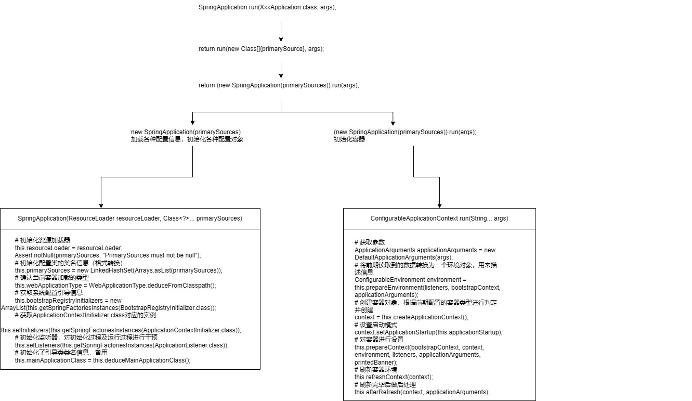

---
hide:
  - navigation
---


SpringBoot其实就是针对原始的Spring程序制作的依赖设置和配置两个方面进行了简化。一共分为4个方面：

* parent

- starter
- 引导类
- 内嵌tomcat

**parent**：

使用parent可以帮助开发者进行版本的统一管理。

项目中的pom.xml中会继承了一个坐标：

```xml
<parent>
    <groupId>org.springframework.boot</groupId>
    <artifactId>spring-boot-starter-parent</artifactId>
    <version>2.5.4</version>
</parent>
```

上述坐标中又继承了一个坐标：

```xml
<parent>
    <groupId>org.springframework.boot</groupId>
    <artifactId>spring-boot-dependencies</artifactId>
    <version>2.5.4</version>
</parent>
```

该坐标中定义了两组信息，第一组是依赖版本号属性，第二组是依赖坐标信息，对引用坐标依赖进行管理，并没有实际引入这些依赖。

```xml
<dependencyManagement>
    <dependencies>
        <dependency>
            <groupId>org.hibernate</groupId>
            <artifactId>hibernate-core</artifactId>
            <version>${hibernate.version}</version>
        </dependency>
        <dependency>
            <groupId>junit</groupId>
            <artifactId>junit</artifactId>
            <version>${junit.version}</version>
        </dependency>
    </dependencies>
</dependencyManagement>
```

因为在maven中继承机会只有一次，上述继承的格式还可以切换成导入的形式进行：

```xml
<dependencyManagement>
    <dependencies>
        <dependency>
            <groupId>org.springframework.boot</groupId>
            <artifactId>spring-boot-dependencies</artifactId>
            <version>${spring-boot.version}</version>
            <type>pom</type>
            <scope>import</scope>
        </dependency>
    </dependencies>
</dependencyManagement>
```


总结：

1. 开发SpringBoot程序要继承spring-boot-starter-parent
2. spring-boot-starter-parent中定义了若干个依赖管理
3. 继承parent模块可以避免多个依赖使用相同技术时出现依赖版本冲突
4. 继承parent的形式也可以采用引入依赖的形式实现效果


**starter**：

starter定义了使用某种技术时对于依赖的固定搭配格式，使用starter可以帮助开发者减少依赖配置。

例如，项目中的pom.xml定义了使用SpringMVC技术，但是并没有写SpringMVC的坐标，而是添加了一个名字中包含starter的依赖：

```xml
<dependency>
    <groupId>org.springframework.boot</groupId>
    <artifactId>spring-boot-starter-web</artifactId>
</dependency>
```

在spring-boot-starter-web中又定义了若干个具体依赖的坐标：

```xml
<dependencies>
    <dependency>
        <groupId>org.springframework.boot</groupId>
        <artifactId>spring-boot-starter</artifactId>
        <version>2.5.4</version>
        <scope>compile</scope>
    </dependency>
    <dependency>
        <groupId>org.springframework.boot</groupId>
        <artifactId>spring-boot-starter-json</artifactId>
        <version>2.5.4</version>
        <scope>compile</scope>
    </dependency>
    <dependency>
        <groupId>org.springframework.boot</groupId>
        <artifactId>spring-boot-starter-tomcat</artifactId>
        <version>2.5.4</version>
        <scope>compile</scope>
    </dependency>
    <dependency>
        <groupId>org.springframework</groupId>
        <artifactId>spring-web</artifactId>
        <version>5.3.9</version>
        <scope>compile</scope>
    </dependency>
    <dependency>
        <groupId>org.springframework</groupId>
        <artifactId>spring-webmvc</artifactId>
        <version>5.3.9</version>
        <scope>compile</scope>
    </dependency>
</dependencies>
```


starter与parent的区别：

starter是一个坐标中定了若干个坐标，以前写多个的，现在写一个，是用来减少依赖配置的书写量的

parent是定义了几百个依赖版本号，以前写依赖需要自己手工控制版本，现在由SpringBoot统一管理，这样就不存在版本冲突了，是用来减少依赖冲突的


实际开发应用方式：

实际开发中如果需要用什么技术，先去找有没有这个技术对应的starter

- 如果有对应的starter，直接写starter，而且无需指定版本，版本由parent提供
- 如果没有对应的starter，手写坐标即可

实际开发中如果发现坐标出现了冲突现象，确认你要使用的可行的版本号，使用手工书写的方式添加对应依赖，覆盖SpringBoot提供给我们的配置管理

- 方式一：直接写坐标
- 方式二：覆盖 `<properties>` 中定义的版本号


**引导类**：

```java
/**
 * @SpringBootApplication是一个特殊的注解，用于标识一个Spring Boot应用程序的入口类。它的主要作用是将三个常用注解组合在一起，简化了配置的过程。
 *
 * @SpringBootApplication注解包含以下三个注解的功能：声明配置类、自动配置、组件扫描
 *     @SpringBootConfiguration：就是@Configuration，将该类标识为应用程序的配置类。它允许使用Java代码定义和配置Bean。
 *     @EnableAutoConfiguration：启用Spring Boot的自动配置机制。包含：
 *			@AutoConfigurationPackage：利用 @Import(AutoConfigurationPackages.Registrar.class) 将应用启动类所在的包及其子包注册到应用上下文的组件扫描路径中。
 *			@Import(AutoConfigurationImportSelector.class)：AutoConfigurationImportSelector 读取 META-INF/spring.factories 文件中的自动配置类列表
 *     @ComponentScan：自动扫描并加载应用程序中的组件，如控制器、服务、存储库等。它默认扫描@SpringBootApplication注解所在类的包及其子包中的组件。
 *      
 */
@SpringBootApplication
public class MainApplication {

    //SpringApplication.run() 方法是启动 Spring Boot 应用程序的关键步骤。它创建应用程序上下文、
    // 自动配置应用程序、启动应用程序，并处理命令行参数，使应用程序能够运行和提供所需的功能
    public static void main(String[] args) {
        SpringApplication.run(MainApplication.class,args);
    }
}
```


**内嵌tomcat**：

内嵌Tomcat工作原理是将Tomcat服务器作为对象运行，并将该对象交给Spring容器管理。


## 配置文件

### 统一配置管理

SpringBoot工程下，进行统一的配置管理，你想设置的任何参数（端口号、项目根路径、数据库连接信息等等)都集中到一个固定位置和命名的配置文件（`application.properties`或`application.yml`）中！

配置文件应该放置在Spring Boot工程的`src/main/resources`目录下。这是因为`src/main/resources`目录是Spring Boot默认的类路径（classpath），配置文件会被自动加载并可供应用程序访问。


总结：

- 集中式管理配置。统一在一个文件完成程序功能参数设置和自定义参数声明 。
- 位置：resources文件夹下，必须命名application  后缀 .properties / .yaml /  .yml 。yml是主流格式。
- 如果同时存在properties、yml、yaml，加载优先顺序：properties  >  yml  >  yaml。不同配置文件中相同配置按照加载优先级相互覆盖，不同配置文件中不同配置全部保留
- 配置基本都有默认值。


### YAML配置文件

YAML（YAML Ain't Markup Language），一种数据序列化格式。具有容易阅读、容易与脚本语言交互、以数据为核心，重数据轻格式的特点。常见的文件扩展名有两种：

- .yml格式（主流）
- .yaml格式

对于文件自身在书写时，具有严格的语法格式要求，具体如下：

1. 大小写敏感
2. 属性层级关系使用多行描述，**每行结尾使用冒号结束**
3. 使用缩进表示层级关系，同层级左侧对齐，只允许使用空格（不允许使用Tab键）
4. 属性值前面添加空格（属性名与属性值之间使用冒号+空格作为分隔）
5. #号 表示注释

```yaml
# YAML配置文件示例
app_name: 我的应用程序
version: 1.0.0
author: 张三

database:
  host: localhost
  port: 5432
  username: admin
  password: password123

subject:
  - Java
  - 前端
  - 大数据
enterprise:
  name: itcast
  age: 16
  subject:
    - Java
    - 前端
    - 大数据
likes: [王者荣耀,刺激战场]			#数组书写缩略格式
users:							 #对象数组格式一
  - name: Tom
   	age: 4
  - name: Jerry
    age: 5
users:							 #对象数组格式二
  -  
    name: Tom
    age: 4
  -   
    name: Jerry
    age: 5			    
users2: [ { name:Tom , age:4 } , { name:Jerry , age:5 } ]	#对象数组缩略格式
```


配置文件读取：

1. 使用@Value可以读取单个数据，属性名引用方式：${一级属性名.二级属性名……}

2. 使用Environment对象封装全部配置信息，使用@Autowired自动装配数据到Environment对象中

   ```java
   @Autowired
   private Environment env;
   
   env.getProperties("server.port");
   ```

3. 使用@ConfigurationProperties注解绑定配置信息到封装类中，批量读取。注意封装类需要定义为Spring管理的bean，否则无法进行属性注入；要提供属性对应的setter方法。

   ```java
   @Component
   @Data
   @ConfigurationProperties(prefix = "servers")
   public class ServerConfig {
       private String ipAddress;
       private int port;
       private long timeout;
   }
   ```

   使用@ConfigurationProperties注解也可以为第三方bean加载属性。@ConfigurationProperties注解不仅能添加到类上，还可以添加到方法上，添加到类上是为spring容器管理的当前类的对象绑定属性，添加到方法上是为spring容器管理的当前方法的返回值对象绑定属性，其实本质上都一样。

   ```java
   @Bean
   @ConfigurationProperties(prefix = "datasource")
   public DruidDataSource datasource(){
       DruidDataSource ds = new DruidDataSource();
       return ds;
   }
   ```

   注意，当使用@EnableConfigurationProperties声明进行属性绑定的bean后，无需使用@Component注解再次进行bean声明。


### 宽松绑定

配置文件中的命名格式与变量名的命名格式可以进行格式上的最大化兼容。

例如：

```java
@Component
@Data
@ConfigurationProperties(prefix = "servers")
public class ServerConfig {
    private String ipAddress;
}
```

可以与下面的配置属性名规则全兼容:

```yml
servers:
  ipAddress: 192.168.0.2       # 驼峰模式
  ip_address: 192.168.0.2      # 下划线模式
  ip-address: 192.168.0.2      # 烤肉串模式
  IP_ADDRESS: 192.168.0.2      # 常量模式
```

在进行匹配时，配置中的名称要去掉中划线和下划线后，忽略大小写的情况下去与java代码中的属性名进行忽略大小写的等值匹配，以上4种命名去掉下划线中划线忽略大小写后都是一个词ipaddress，java代码中的属性名忽略大小写后也是ipaddress，这样就可以进行等值匹配了，这就是为什么这4种格式都能匹配成功的原因。不过springboot官方推荐使用烤肉串模式，也就是中划线模式。

松散绑定仅针对springboot中@ConfigurationProperties注解进行属性绑定时有效，对@Value注解进行属性映射无效。


### 多环境配置和使用

以下是实现Spring Boot多环境配置的常见方法：

1. 属性文件分离：将应用程序的配置参数分离到不同的属性文件中，每个环境对应一个属性文件。例如，可以创建`application-dev.properties`、`application-prod.properties`和`application-test.properties`等文件。在这些文件中，可以定义各自环境的配置参数，如数据库连接信息、端口号等。然后，在`application.properties`中通过`spring.profiles.active`属性指定当前使用的环境。Spring Boot会根据该属性来加载对应环境的属性文件，覆盖默认的配置。
2. YAML配置文件：与属性文件类似，可以将配置参数分离到不同的YAML文件中，每个环境对应一个文件。例如，可以创建`application-dev.yml`、`application-prod.yml`和`application-test.yml`等文件。在这些文件中，可以使用YAML语法定义各自环境的配置参数。同样，通过`spring.profiles.active`属性指定当前的环境，Spring Boot会加载相应的YAML文件。
3. 命令行参数(动态)：可以通过命令行参数来指定当前的环境。例如，可以使用`--spring.profiles.active=dev`来指定使用开发环境的配置。


主配置文件：application.yaml

```yaml
spring:
	profiles:
		active: pro		# 启动pro
```

application-pro.yaml

```yaml
server:
	port: 80
```

application-dev.yaml

```yaml
server:
	port: 81
```


文件的命名规则为：application-环境名.yml。

在配置文件中，如果某些配置项所有环境都一样，可以将这些项写入到主配置中，只有哪些有区别的项才写入到环境配置文件中。

* 主配置文件中设置公共配置（全局）

* 环境分类配置文件中常用于设置冲突属性（局部）


### 配置优先级

https://docs.spring.io/spring-boot/reference/features/external-config.html

配置可以写到很多位置，常见的优先级顺序：

命令行参数> 配置文件> springapplication默认配置（`SpringApplication.setDefaultProperties`）

配置文件优先级如下：(后面覆盖前面)

1. jar 包内的application.properties/yml
2. jar 包内的application-{profile}.properties/yml
3. jar 包外的application.properties/yml
4. jar 包外的application-{profile}.properties/yml


所有参数均可由命令行传入，使用`--参数项=参数值`，将会被添加到环境变量中，并优先于配置文件。


SpringBoot 应用启动时会自动寻找application.properties和application.yaml位置，进行加载。加载优先顺序如下：（**后面覆盖前面**）

1. 类路径下配置文件（一直使用的是这个，也就是resources目录中的application.yml文件）
2. 类路径下config目录下配置文件
3. 程序包所在目录中配置文件
4. 程序包所在目录中config目录下配置文件
5. 程序包所在目录中config目录的直接子目录下配置文件


## bean加载方式

**1. xml配置文件+```<bean/>```标签**

**2. 配置文件扫描+注解定义bean**

**3. 配置类+注解**

@ImportResource注解可以在配置类上导入xml配置文件

**4. 使用@Import注解注入bean**

**5. 编程形式注册bean**

可以在容器初始化完成后手动加载bean。通过这种方式可以实现编程式控制bean的加载。

```java
public class App5 {
    public static void main(String[] args) {
        AnnotationConfigApplicationContext ctx = new AnnotationConfigApplicationContext(SpringConfig.class);
        //上下文容器对象已经初始化完毕后，手工加载bean
        ctx.register(Mouse.class);
        ctx.registerBean("tom", Cat.class,0);
    }
}
```

**6. 导入实现了ImportSelector接口的类**

实现ImportSelector接口的类可以设置加载的bean的全路径类名

```java
public class MyImportSelector implements ImportSelector {
    @Override
    public String[] selectImports(AnnotationMetadata metadata) {
        //各种条件的判定，判定完毕后，决定是否装载指定的bean
        boolean flag = metadata.hasAnnotation("org.springframework.context.annotation.Configuration");
        if(flag){
            return new String[]{"com.itheima.bean.Dog"};
        }
        return new String[]{"com.itheima.bean.Cat"};
    }
}
```

**7. 导入实现了ImportBeanDefinitionRegistrar接口的类**

```java
public class MyRegistrar implements ImportBeanDefinitionRegistrar {
    @Override
    public void registerBeanDefinitions(AnnotationMetadata metadata, BeanDefinitionRegistry registry) {
        BeanDefinition beanDefinition = 	
            BeanDefinitionBuilder.rootBeanDefinition(BookServiceImpl2.class).getBeanDefinition();
        registry.registerBeanDefinition("bookService",beanDefinition);
    }
}
```

**8. 导入实现了BeanDefinitionRegistryPostProcessor接口的类**

```java
public class MyPostProcessor implements BeanDefinitionRegistryPostProcessor {
    @Override
    public void postProcessBeanDefinitionRegistry(BeanDefinitionRegistry registry) throws BeansException {
        BeanDefinition beanDefinition = 
            BeanDefinitionBuilder.rootBeanDefinition(BookServiceImpl4.class).getBeanDefinition();
        registry.registerBeanDefinition("bookService",beanDefinition);
    }
}
```


## bean的加载控制

如果注解指定的条件成立，则触发指定行为

@ConditionalOnClass：如果类路径中存在这个类，则触发指定行为

@ConditionalOnMissingClass：如果类路径中不存在这个类，则触发指定行为

@ConditionalOnBean：如果容器中存在这个Bean，则触发指定行为

@ConditionalOnMissingBean：如果容器中不存在这个Bean，则触发指定行为

@ConditionalOnBean（value=组件类型，name=组件名字）：判断容器中是否有这个类型的组件，并且名字是指定的值

@ConditionalOnWebApplication：判定当前容器环境是否是web环境

springboot定义了若干种控制bean加载的条件设置注解，由spring固定加载bean变成了可以根据情况选择性的加载bean

## bean的依赖属性配置管理

先通过yml配置文件，设置bean运行需要使用的配置信息。

```yaml
cartoon:
  cat:
    name: "图多盖洛"
    age: 5
  mouse:
    name: "泰菲"
    age: 1
```

然后定义一个封装属性的专用类，加载配置属性，读取对应前缀相关的属性值。

```JAVA
@ConfigurationProperties(prefix = "cartoon")
@Data
public class CartoonProperties {
    private Cat cat;
    private Mouse mouse;
}
```

最后在使用的位置注入对应的配置即可。

```JAVA
@EnableConfigurationProperties(CartoonProperties.class)
public class CartoonCatAndMouse{
    @Autowired
    private CartoonProperties cartoonProperties;
}
```

建议在业务类上使用@EnableConfigurationProperties声明bean，这样在不使用这个类的时候，也不会无故加载专用的属性配置类CartoonProperties，减少spring管控的资源数量。

**总结**

1. bean的运行如果需要外部设置值，建议将设置值封装成专用的属性类XxxProperties
2. 设置属性类加载指定前缀的配置信息
3. 在需要使用属性类的位置通过注解@EnableConfigurationProperties加载bean，而不要直接在属性配置类上定义bean，减少资源加载的数量，因需加载而不要饱和式加载。

## 自动配置原理

自动配置思想：

1. 收集Spring开发者的编程习惯，整理开发过程中使用的常用技术列表 --> (**技术集A**)

2. 收集常用技术（技术集A）的使用参数，整理开发过程中每个技术的常用设置列表 --> (**设置集B**)

3. SpringBoot初始化Spring容器基础环境，读取用户的配置信息，加载用户自定义的bean和导入的其他坐标，形成**初始化环境**

4. 将**技术集A**包含的所有技术都定义出来，在SpringBoot启动时默认加载全部

   ```java
   public final class SpringFactoriesLoader {
       public static final String FACTORIES_RESOURCE_LOCATION = "META-INF/spring.factories";
   }
   ```

5. 将**技术集A**中具有使用条件的技术约定出来，设置成按条件加载，由开发者决定是否使用该技术

   导入对应的依赖

6. 将**设置集B**作为默认配置加载（约定大于配置），减少开发者配置工作量

   XxxProperties

7. 开放**设置集B**的配置覆盖接口，由开发者根据自身需要决定是否覆盖默认配置


SpringBoot自动配置原理：

1. SpringBoot启动时先加载 `spring-boot-autoconfigure` 下 `META-INF/spring.factories` 文件中的`org.springframework.boot.autoconfigure.EnableAutoConfiguration` 配置项，将其中配置的所有的类都加载成bean。SpringBoot3中：加载`spring-boot-autoconfigure` 包里面 `META-INF/spring/org.springframework.boot.autoconfigure.AutoConfiguration.imports` 文件,里面指定的所有启动要加载的自动配置类
2. 在加载bean的时候，bean对应的类定义上都设置有加载条件 `@ConditionalOnXxx`，因此有可能加载成功，也可能条件检测失败不加载bean
3. 对于可以正常加载成bean的类，通常会通过 `@EnableConfigurationProperties` 注解初始化对应的配置属性类并加载对应的配置
4. 配置属性类上通常会通过 `@ConfigurationProperties` 加载指定前缀的配置，当然这些配置通常都有默认值。如果没有默认值，就强制必须配置后使用


@SpringBootApplication：

```java
@SpringBootConfiguration
@EnableAutoConfiguration
@ComponentScan(
    excludeFilters = {@Filter(
    type = FilterType.CUSTOM,
    classes = {TypeExcludeFilter.class}
), @Filter(
    type = FilterType.CUSTOM,
    classes = {AutoConfigurationExcludeFilter.class}
)}
)
public @interface SpringBootApplication {}
```

@SpringBootApplication是一个特殊的注解，用于标识一个Spring Boot应用程序的入口类。它的主要作用是将三个常用注解组合在一起，简化了配置的过程：

* @SpringBootConfiguration：就是@Configuration，将该类标识为应用程序的配置类。它允许使用Java代码定义和配置Bean。
* @EnableAutoConfiguration：SpringBoot自动配置的核心。包含：
   *			@AutoConfigurationPackage：利用 @Import(AutoConfigurationPackages.Registrar.class) 将应用启动类所在的包及其子包注册到应用上下文的组件扫描路径中。
   *			@Import(AutoConfigurationImportSelector.class)：AutoConfigurationImportSelector 读取 META-INF/spring.factories 文件中的自动配置类列表，根据条件导入自动配置类。
* @ComponentScan：自动扫描并加载应用程序中的组件，如控制器、服务、存储库等。它默认扫描@SpringBootApplication注解所在类的包及其子包中的组件。


## 启动流程

1. 初始化各种属性，加载成对象
   * 读取环境属性（Environment）
   * 系统配置（spring.factories）
   * 参数（Arguments，application.properties）
2. 创建Spring容器对象ApplicationContext，加载各种配置
3. 在容器创建前，通过监听器机制，应对不同阶段加载数据、更新数据的需求
4. 容器初始化过程中追加各种功能，例如统计时间、输出日志等

主要流程就是初始化数据和创建容器。




## 自定义starter

1. 创建自定义starter项目，引入`spring-boot-starter`基础依赖

2. 编写模块功能，引入模块所有需要的依赖。

3. 编写`xxxAutoConfiguration`自动配置类和配置属性类，导入这个模块需要的所有组件 。

   ```java
   @Import({RobotController.class, RobotService.class, RobotProperties.class})
   @Configuration
   @EnableConfigurationProperties(RobotProperties.class)
   public class RobotAutoConfiguration { 
   }
   ```

   ```java
   @ConfigurationProperties(prefix = "robot")
   public class RobotProperties {
       
   }
   ```

4. 在`META-INF/spring.factories` 文件中的`org.springframework.boot.autoconfigure.EnableAutoConfiguration` 配置项中添加自动配置类的全类名

5. 其他项目引入即可使用


自定义配置有提示。

程序编译后，在META-INF目录中会生成对应的提示文件，然后拷贝生成出的文件到自己开发的META-INF目录中，并对其进行编辑。其中groups属性定义了当前配置的提示信息总体描述，当前配置属于哪一个属性封装类，properties属性描述了当前配置中每一个属性的具体设置，包含名称、类型、描述、默认值等信息。hints属性默认是空白的，没有进行设置。hints属性可以参考springboot源码中的制作，设置当前属性封装类专用的提示信息。

```xml
<!--        导入配置处理器，配置文件自定义的properties配置都会有提示-->
<dependency>
    <groupId>org.springframework.boot</groupId>
    <artifactId>spring-boot-configuration-processor</artifactId>
    <optional>true</optional>
</dependency>
```

