---
hide:
  - navigation
---
## SpringMVC简介 

[SpringMVC ](https://docs.spring.io/spring-framework/reference/web/webmvc.html?spm=wolai.workspace.0.0.78d5767bUcXVsM)

MVC 是模型(Model)、视图(View)、控制器(Controller)的简写，其核心思想是通过将业务逻辑、数据、显示分离来组织代码。

M：Model，模型层，指工程中的JavaBean，作用是处理数据

JavaBean分为两类：

- 一类称为实体类Bean：专门存储业务数据的，如 Student、User 等
- 一类称为业务处理 Bean：指 Service 或 Dao 对象，专门用于处理业务逻辑和数据访问。

V：View，视图层，指工程中的html或jsp等页面，作用是与用户进行交互，展示数据

C：Controller，控制层，指工程中的servlet，作用是接收请求和响应浏览器


SpringMVC是Spring对MVC的实现，对传统的MVC做了扩展，将model层分为了业务模型Service和数据模型Repository，controller层拆分为了前端控制器DispatchServlet和后端控制器Controller，简化了Web开发。

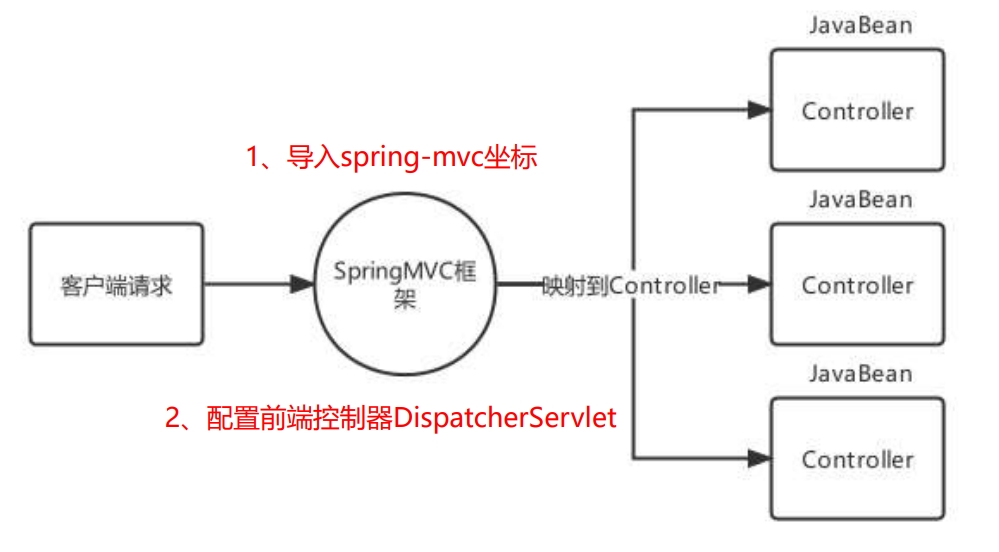

1. 导入Spring整合SpringMVC的坐标：spring-webmvc

2. 在web.xml中配置SpringMVC的前端控制器ServletDispatcher

   ```xml
   <servlet>
       <servlet-name>DispatcherServlet</servlet-name>
       <servlet-class>org.springframework.web.servlet.DispatcherServlet</servlet-class>
       <!--指定springMVC配置文件位置-->
       <init-param>
           <param-name>contextConfigLocation</param-name>
           <param-value>classpath:spring-mvc.xml</param-value>
       </init-param>
       <!--服务器启动就创建-->
       <load-on-startup>2</load-on-startup>
   </servlet>
   <servlet-mapping>
       <servlet-name>DispatcherServlet</servlet-name>
       <url-pattern>/</url-pattern>
   </servlet-mapping>
   ```

3. 编写一个控制器Controller，配置映射信息

   ```java
   @Controller
   public class UserController {
       @RequestMapping("/show")
       public String show(){
           System.out.println("show 执行....");
           //视图跳转到index.jsp
           return "/index.jsp";
       }
   }
   ```

4. 创建springMVC的核心配置文件 spring-mvc.xml，并配置组件扫描web层

   ```xml
   <context:component-scan base-package="com.itheima.controller"/>
   ```


SpringMVC关键组件

| 组件                         | 描述                                                         | 常用组件                     |
| ---------------------------- | ------------------------------------------------------------ | ---------------------------- |
| 处理器映射器：HandlerMapping | 匹配映射路径对应的Handler，返回可执行的处理器链对象HandlerExecutionChain对象 | RequestMappingHandlerMapping |
| 处理器适配器：HandlerAdapter | 匹配HandlerExecutionChain对应的适配器进行处理器调用，返回视图模型对象 | RequestMappingHandlerAdapter |
| 视图解析器：ViewResolver     | 对视图模型对象进行解析                                       | InternalResourceViewResolver |

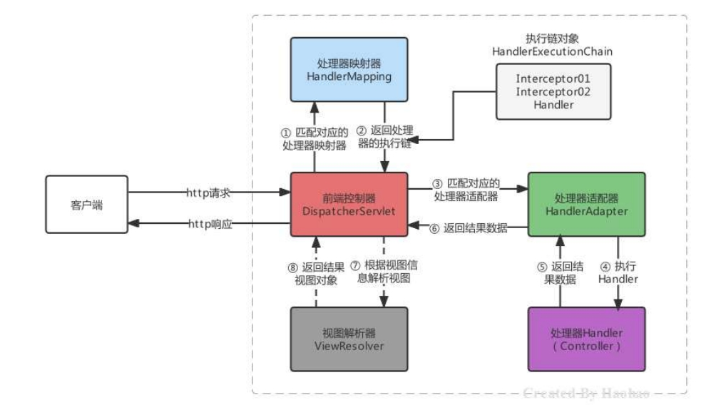

SpringMVC的默认组件，SpringMVC 在前端控制器 DispatcherServlet加载时，就会进行初始化操作，在进行初始化时，就会加载SpringMVC默认指定的一些组件，这些默认组件配置在 DispatcherServlet.properties 文件中，该文 件存在与spring-webmvc-5.3.7.jar包下的 org\springframework\web\servlet\DispatcherServlet.properties

这些默认的组件是在DispatcherServlet中进行初始化加载的，在DispatcherServlet中存在集合存储着这些组件， SpringMVC的默认组件会在 DispatcherServlet 中进行维护，但是并没有存储在与SpringMVC的容器中

当我们在Spring容器中配置了HandlerMapping，则就不会在加载默认的HandlerMapping策略了，原理比较简单，DispatcherServlet 在进行HandlerMapping初始化时，先从SpringMVC容器中找是否存在HandlerMapping，如果存在直接取出容器中的HandlerMapping，在存储到 DispatcherServlet 中的handlerMappings集合中去。

## SpringMVC的请求处理 

### 请求映射路径的配置

配置映射路径，映射器处理器才能找到Controller的方法资源

| 相关注解        | 作用                                           | 使用位置   |
| --------------- | ---------------------------------------------- | ---------- |
| @RequestMapping | 设置控制器方法的访问资源路径，可以接收任何请求 | 方法和类上 |
| @GetMapping     | 设置控制器方法的访问资源路径，可以接收GET请求  | 方法和类上 |
| @PostMapping    | 设置控制器方法的访问资源路径，可以接收POST请求 | 方法和类上 |

@RequestMapping注解：

```java
@Target({ElementType.TYPE, ElementType.METHOD})
@Retention(RetentionPolicy.RUNTIME)
@Documented
@Mapping
@Reflective({ControllerMappingReflectiveProcessor.class})
public @interface RequestMapping {
    String name() default "";

    @AliasFor("path")
    String[] value() default {};

    @AliasFor("value")
    String[] path() default {};

    RequestMethod[] method() default {};

    String[] params() default {};

    String[] headers() default {};

    String[] consumes() default {};

    String[] produces() default {};
}
```

**value属性**

@RequestMapping注解的value属性通过请求的请求地址匹配请求映射

@RequestMapping注解的value属性是一个字符串类型的数组，表示该请求映射能够匹配多个请求地址所对应的请求

@RequestMapping注解的value属性必须设置，至少通过请求地址匹配请求映射

**method属性**

HTTP 协议定义了八种请求方式，在 SpringMVC 中封装到了下面这个枚举类：

```java
public enum RequestMethod {
  GET, HEAD, POST, PUT, PATCH, DELETE, OPTIONS, TRACE
}
```

@RequestMapping注解的method属性通过**请求的请求方式**（get或post）匹配请求映射。默认任何请求方式都可以访问

@RequestMapping注解的method属性是一个RequestMethod类型的数组，表示该请求映射能够匹配多种请求方式的请求

若当前请求的请求地址满足请求映射的value属性，但是请求方式不满足method属性，则浏览器报错405：Request method ‘POST’ not supported

**注：**

1、对于处理指定请求方式的控制器方法，SpringMVC中提供了@RequestMapping的派生注解

处理get请求的映射–>@GetMapping

处理post请求的映射–>@PostMapping

处理put请求的映射–>@PutMapping

处理delete请求的映射–>@DeleteMapping

2、常用的请求方式有get，post，put，delete

但是目前浏览器只支持get和post，若在form表单提交时，为method设置了其他请求方式的字符串（put或delete），则按照默认的请求方式get处理

若要发送put和delete请求，则需要通过spring提供的过滤器HiddenHttpMethodFilter

**param属性**

@RequestMapping注解的params属性通过请求的请求参数匹配请求映射

@RequestMapping注解的params属性是一个字符串类型的数组，可以通过四种表达式设置请求参数和请求映射的匹配关系：

1. “param”：要求请求映射所匹配的请求必须携带param请求参数

2. “!param”：要求请求映射所匹配的请求必须不能携带param请求参数

3. “param=value”：要求请求映射所匹配的请求必须携带param请求参数且param=value

4. “param!=value”：要求请求映射所匹配的请求必须携带param请求参数但是param!=value

**headers属性**

@RequestMapping注解的headers属性通过请求的请求头信息匹配请求映射

@RequestMapping注解的headers属性是一个字符串类型的数组，可以通过四种表达式设置请求头信息和请求映射的匹配关系

1. “header”：要求请求映射所匹配的请求必须携带header请求头信息

2. “!header”：要求请求映射所匹配的请求必须不能携带header请求头信息

3. “header=value”：要求请求映射所匹配的请求必须携带header请求头信息且header=value

4. “header!=value”：要求请求映射所匹配的请求必须携带header请求头信息且header!=value

若当前请求满足@RequestMapping注解的value和method属性，但是不满足headers属性，此时页面显示404错误，即资源未找到


### 请求数据的接收

#### param参数接收

**1. 直接接收**

只要形参数名和类型与传递参数相同，即可自动接收!

```java
@Controller
@RequestMapping("/param")
public class ParamController {

    /**
     * 前端请求: http://localhost:8080/param/value?name=xx&age=18
     *
     * 可以利用形参列表,直接接收前端传递的param参数!
     *    要求: 参数名 = 形参名
     *          类型相同
     * 出现乱码正常，json接收具体解决！！
     * @return 返回前端数据
     */
    @GetMapping(value="/value")
    @ResponseBody
    public String setupForm(String name,int age){
        System.out.println("name = " + name + ", age = " + age);
        return name + age;
    }
}
```

**2. @RequestParam注解**

- 指定绑定的请求参数名
- 要求请求参数必须传递
- 为请求参数提供默认值

默认情况下，使用此注解的方法参数是必需的，但可以通过将 @RequestParam 注解的 required 标志设置为 false！

```java
 /**
 * 前端请求: http://localhost:8080/param/data?name=xx&stuAge=18
 * 
 *  使用@RequestParam注解标记handler方法的形参
 *  指定形参对应的请求参数@RequestParam(请求参数名称)
 */
@GetMapping(value="/data")
@ResponseBody
public Object paramForm(@RequestParam("name") String name, 
                        @RequestParam(value = "stuAge",required = false,defaultValue = "18") int age){
    System.out.println("name = " + name + ", age = " + age);
    return name+age;
}
```

**3. 接收数组或集合数据**

接收数组、集合、Map数据，客户端传递多个同名参数时，可以使用集合接收，但是集合和map需要使用@RequestParam告知框架传递的参数是要同名设置的，不是对象属性设置的。

```java
/**
   * 前端请求: http://localhost:8080/param/mul?hbs=吃&hbs=喝
   *
   *  一名多值,可以使用集合接收即可!但是需要使用@RequestParam注解指定
   */
@GetMapping(value="/mul")
@ResponseBody
public Object mulForm(@RequestParam List<String> hbs){
    System.out.println("hbs = " + hbs);
    return hbs;
}
```

**4. 实体接收**

接收实体JavaBean属性数据，单个JavaBean数据：提交的参数名称只要与Java的属性名一致，就可以进行自动封装。

```java
public class User {
 private String username;
 private Integer age;
 private String[] hobbies;
 private Date birthday;
 private Address address;
 //... 省略get和set方法 ... 
}
```

```java
@Controller
@RequestMapping("/param")
public class ParamController {
	
    // 前端请求: http://localhost:8080/param/user?username=haohao&age=35&hobbies=eat&hobbies=sleep
    @RequestMapping("/user")
    @ResponseBody
    public String addUser(User user) {
        // 在这里可以使用 user 对象的属性来接收请求参数
        System.out.println("user = " + user);
        return "success";
    }
}
```

接收实体JavaBean属性数据，嵌套JavaBean数据：提交的参数名称用 `.` 去描述嵌套对象的属性关系即可。`username=haohao&address.city=tianjin&address.area=jinghai`

#### 路径参数接收

`@PathVariable` 注解允许将 URL 中的占位符映射到控制器方法中的参数。

例如，如果我们想将 `/user/{id}` 路径下的 `{id}` 映射到控制器方法的一个参数中，则可以使用 `@PathVariable` 注解来实现。

```java
 /**
 * 动态路径设计: /user/{动态部分}/{动态部分}   动态部分使用{}包含即可! {}内部动态标识!
 * 形参列表取值: @PathVariable Long id  如果形参名 = {动态标识} 自动赋值!
 *              @PathVariable("动态标识") Long id  如果形参名 != {动态标识} 可以通过指定动态标识赋值!
 *
 * 访问测试:  /param/user/1/root  -> id = 1  uname = root
 */
@GetMapping("/user/{id}/{name}")
@ResponseBody
public String getUser(@PathVariable Long id, 
                      @PathVariable("name") String uname) {
    System.out.println("id = " + id + ", uname = " + uname);
    return "user_detail";
}
```


#### json参数接收

接收Json数据格式数据，Json数据都是以请求体的方式提交的，且不是原始的键值对格式的，所以我们要使用 @RequestBody注解整体接收该数据。

@RequestBody 注解表示当前方法参数的值应该从请求体中获取，并且需要指定 value 属性来指示请求体应该映射到哪个参数上。

```java
@PostMapping("/person")
@ResponseBody
public String addPerson(@RequestBody Person person) {

  // 在这里可以使用 person 对象来操作 JSON 数据中包含的属性
  return "success";
}
```

使用Json工具（ jackson ）将Json格式的字符串转化为JavaBean进行操作：

1. 加入依赖

   ```xml
   <dependency>
       <groupId>com.fasterxml.jackson.core</groupId>
       <artifactId>jackson-databind</artifactId>
       <version>2.15.0</version>
   </dependency>
   ```

2. 配置RequestMappingHandlerAdapter，指定消息转换器，就不用手动转换json格式字符串了

   ```xml
   <bean class="org.springframework.web.servlet.mvc.method.annotation.RequestMappingHandlerAdapter">
       <property name="messageConverters">
           <list>
               <bean class="org.springframework.http.converter.json.MappingJackson2HttpMessageConverter"/>
           </list>
       </property>
   </bean>
   ```


#### 文件接收

接收文件上传的数据，文件上传的表单需要一定的要求，如下： 

* 表单的提交方式必须是POST 
* 表单的enctype属性必须是multipart/form-data 
* 文件上传项需要有name属性

```xml
<form action="" enctype="multipart/form-data">
    <input type="file" name="myFile">
</form>
```

服务器端使用MultipartFile类型接收上传文件，如果进行多文件上传的话，则使用MultipartFile数组即可：

```java
@PostMapping("/fileUpload")
public String fileUpload(@RequestBody MultipartFile myFile) throws IOException {
    System.out.println(myFile);
    //获得上传的文件的流对象
    InputStream inputStream = myFile.getInputStream();
    //使用commons-io存储到C:\haohao\abc.txt位置
    FileOutputStream outputStream = new 
        FileOutputStream("C:\\Users\\haohao\\"+myFile.getOriginalFilename());
    IOUtils.copy(inputStream,outputStream);
    //关闭资源
    inputStream.close();
    outputStream.close();
    return "/index.jsp";
}
```

服务器端，由于映射器适配器需要文件上传解析器，而该解析器默认未被注册，所以手动注册:

```xml
<!--配置文件上传解析器，注意：id的名字是固定写法-->
<bean id="multipartResolver" class="org.springframework.web.multipart.commons.CommonsMultipartResolver">
    <property name="defaultEncoding" value="UTF-8"/><!--文件的编码格式 默认是ISO8859-1-->
    <property name="maxUploadSizePerFile" value="1048576"/><!--上传的每个文件限制的大小 单位字节-->
    <property name="maxUploadSize" value="3145728"/><!--上传文件的总大小-->
    <property name="maxInMemorySize" value="1048576"/><!--上传文件的缓存大小-->
</bean>
```

而CommonsMultipartResolver底层使用的Apache的是Common-fileuplad等工具API进行的文件上传

```xml
<dependency>
    <groupId>commons-fileupload</groupId>
    <artifactId>commons-fileupload</artifactId>
    <version>1.4</version>
</dependency>
```

#### 接收Cookie数据

可以使用 `@CookieValue` 注释将 HTTP Cookie 的值绑定到控制器中的方法参数。

考虑使用以下 cookie 的请求：

```Java
JSESSIONID=415A4AC178C59DACE0B2C9CA727CDD84
```

下面的示例演示如何获取 cookie 值：

```Java
@GetMapping("/demo")
public void handle(@CookieValue("JSESSIONID") String cookie) { 
  //...
}
```


#### 接收请求头数据

可以使用 `@RequestHeader` 批注将请求标头绑定到控制器中的方法参数。

请考虑以下带有标头的请求：

```Java
Host                    localhost:8080
Accept                  text/html,application/xhtml+xml,application/xml;q=0.9
Accept-Language         fr,en-gb;q=0.7,en;q=0.3
Accept-Encoding         gzip,deflate
Accept-Charset          ISO-8859-1,utf-8;q=0.7,*;q=0.7
Keep-Alive              300
```

下面的示例获取 `Accept-Encoding` 和 `Keep-Alive` 标头的值：

```Java
@GetMapping("/demo")
public void handle(
    @RequestHeader("Accept-Encoding") String encoding, 
    @RequestHeader("Keep-Alive") long keepAlive) { 
  //...
}
```


### RESTFul

REST：**Re**presentational **S**tate **T**ransfer，表现形式状态转换。

RESTful 是一种基于 HTTP 和标准化的设计原则的软件架构风格，用于设计和实现可靠、可扩展和易于集成的 Web 服务和应用程序！

Restful风格的请求，常见的规则有如下三点：

* 用URI表示某个模块资源，资源名称为名词；
* 用请求方式表示模块具体业务动作，例如：GET表示查询、POST表示插入、PUT表示更新、DELETE表示删除
* 用HTTP响应状态码表示结果，国内常用的响应包括三部分：状态码、状态信息、响应数据

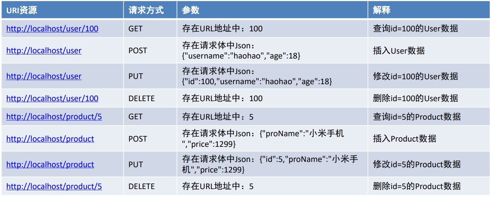


### Javaweb常用对象获取

在 JavaWeb 中，共享域指的是在 Servlet 中存储数据，以便在同一 Web 应用程序的多个组件中进行共享和访问。常见的共享域有四种：`ServletContext`、`HttpSession`、`HttpServletRequest`、`PageContext`。

1. `ServletContext` 共享域：`ServletContext` 对象可以在整个 Web 应用程序中共享数据，是最大的共享域。一般可以用于保存整个 Web 应用程序的全局配置信息，以及所有用户都共享的数据。在 `ServletContext` 中保存的数据是线程安全的。
2. `HttpSession` 共享域：`HttpSession` 对象可以在同一用户发出的多个请求之间共享数据，但只能在同一个会话中使用。比如，可以将用户登录状态保存在 `HttpSession` 中，让用户在多个页面间保持登录状态。
3. `HttpServletRequest` 共享域：`HttpServletRequest` 对象可以在同一个请求的多个处理器方法之间共享数据。比如，可以将请求的参数和属性存储在 `HttpServletRequest` 中，让处理器方法之间可以访问这些数据。
4. `PageContext` 共享域：`PageContext` 对象是在 JSP 页面Servlet 创建时自动创建的。它可以在 JSP 的各个作用域中共享数据，包括`pageScope`、`requestScope`、`sessionScope`、`applicationScope` 等作用域。

共享域的作用是提供了方便实用的方式在同一 Web 应用程序的多个组件之间传递数据，并且可以将数据保存在不同的共享域中，根据需要进行选择和使用。

获得Javaweb常见原生对象，有时在我们的Controller方法中需要用到Javaweb的原生对象，例如：Request、 Response等，我们只需要将需要的对象以形参的形式写在方法上，SpringMVC框架在调用Controller方法时，会自动传递实参：

```java
/**
 * 如果想要获取请求或者响应对象,或者会话等,可以直接在形参列表传入,并且不分先后顺序!
 * 注意: 接收原生对象,并不影响参数接收!
 */
@GetMapping("api")
@ResponseBody
public String api(HttpSession session , HttpServletRequest request,
                  HttpServletResponse response){
    String method = request.getMethod();
    System.out.println("method = " + method);
    return "api";
}
```


### 请求静态资源

静态资源请求失效的原因，当DispatcherServlet的映射路径配置为 / 的时候，那么就覆盖的Tomcat容器默认的缺省 Servlet，在Tomcat的config目录下有一个web.xml 是对所有的web项目的全局配置，其中有如下配置：

```xml
<servlet>
    <servlet-name>default</servlet-name>
    <servlet-class>org.apache.catalina.servlets.DefaultServlet</servlet-class>
    <load-on-startup>1</load-on-startup>
</servlet>
<servlet-mapping>
    <servlet-name>default</servlet-name>
    <url-pattern>/</url-pattern>
</servlet-mapping>
```

url-pattern配置为 / 的Servlet我们称其为缺省的Servlet，作用是当其他Servlet都匹配不成功时，就找缺省的Servlet ，静态资源由于没有匹配成功的Servlet，所以会找缺省的DefaultServlet，该DefaultServlet具备二次去匹配静态资源的功能。但是我们配置DispatcherServlet后就将其覆盖掉了，而DispatcherServlet会将请求的静态资源的名称当成Controller的映射路径去匹配，即静态资源访问不成功了。

静态资源请求的三种解决方案： 

第一种方案，可以再次激活Tomcat的DefaultServlet，Servlet的url-pattern的匹配优先级是：精确匹配>目录匹配> 扩展名匹配>缺省匹配，所以可以指定某个目录下或某个扩展名的资源使用DefaultServlet进行解析：

```xml
<servlet-mapping>
    <servlet-name>default</servlet-name>
    <url-pattern>/img/*</url-pattern>
</servlet-mapping>
<servlet-mapping>
    <servlet-name>default</servlet-name>
    <url-pattern>*.html</url-pattern>
</servlet-mapping>
```

第二种方式，在spring-mvc.xml中去配置静态资源映射，匹配映射路径的请求到指定的位置去匹配资源

```xml
<!-- mapping是映射资源路径，location是对应资源所在的位置 -->
<mvc:resources mapping="/img/*" location="/img/"/>
<mvc:resources mapping="/css/*" location="/css/"/>
<mvc:resources mapping="/css/*" location="/js/"/>
<mvc:resources mapping="/html/*" location="/html/"/>
```

第三种方式，在spring-mvc.xml中去配置 `< mvc:default-servlet-handler >`，该方式是注册了一个 DefaultServletHttpRequestHandler 处理器，静态资源的访问都由该处理器去处理，这也是开发中使用最多的。


### 注解驱动`<mvc:annotation-driven>`标签

静态资源配置的第二第三种方式我们可以正常访问静态资源了，但是Controller又无法访问了，报错404，即找不到对应的资源。

第二种方式是通过SpringMVC去解析mvc命名空间下的resources标签完成的静态资源解析，第三种方式式通过 SpringMVC去解析mvc命名空间下的default-servlet-handler标签完成的静态资源解析，根据前面所学习的自定义命名空间的解析的知识，可以发现不管是以上哪种方式，最终都会注册SimpleUrlHandlerMapping

```java
public BeanDefinition parse(Element element, ParserContext context) {
    //创建SimpleUrlHandlerMapping类型的BeanDefinition
    RootBeanDefinition handlerMappingDef =
        new RootBeanDefinition(SimpleUrlHandlerMapping.class);
    //注册SimpleUrlHandlerMapping的BeanDefinition
    context.getRegistry().registerBeanDefinition(beanName, handlerMappingDef);
}
```

一旦SpringMVC容器中存在 HandlerMapping 类型的组件时，前端控制器 DispatcherServlet在进行初始化时，就会从容器中获得HandlerMapping ，不再加载 dispatcherServlet.properties 中默认处理器映射器策略，那也就意味着RequestMappingHandlerMapping不会被加载到了。

手动将RequestMappingHandlerMapping也注册到SpringMVC容器中就可以了，这样DispatcherServlet在进行初 始化时，就会从容器中同时获得RequestMappingHandlerMapping存储到DispatcherServlet中名为 handlerMappings的List集合中，对@RequestMapping 注解进行解析。

```xml
<bean class="org.springframework.web.servlet.mvc.method.annotation.RequestMappingHandlerMapping"/>
```

所以，要想使用@RequestMapping正常映射到资源方法，同时静态资源还能正常访问， 还可以将请求json格式字符串和JavaBean之间自由转换，我们就需要在spring-mvc.xml中尽心如下配置：

```xml
<!-- 显示配置RequestMappingHandlerMapping -->
<bean class="org.springframework.web.servlet.mvc.method.annotation.RequestMappingHandlerMapping"/>
<!-- 显示配置RequestMappingHandlerAdapter -->
<bean class="org.springframework.web.servlet.mvc.method.annotation.RequestMappingHandlerAdapter">
    <property name="messageConverters">
        <list>
            <bean class="org.springframework.http.converter.json.MappingJackson2HttpMessageConverter"/>
        </list>
    </property>
</bean>
<!--配置DefaultServletHttpRequestHandler-->
<mvc:default-servlet-handler/>
```

Spring将上述配置浓缩成了一个简单的配置标签，那就是mvc的注解驱动，该标签内部会帮我们注册RequestMappingHandlerMapping、注册 RequestMappingHandlerAdapter并注入Json消息转换器等，上述配置就可以简化成如下:

```xml
<!--mvc注解驱动-->
<mvc:annotation-driven/>
<!--配置DefaultServletHttpRequestHandler-->
<mvc:default-servlet-handler/>
```


## SpringMVC的响应处理 

### 转发和重定向

在 Spring MVC 中，Handler 方法返回值来实现快速转发，可以使用 `redirect` 或者 `forward` 关键字来实现重定向。

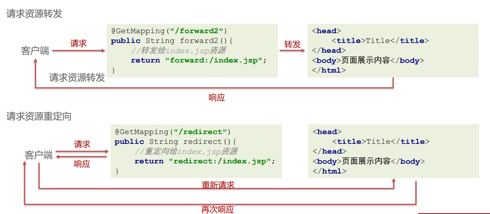

### 模型数据

响应模型数据，响应模型数据本质也是转发，在转发时可以准备模型数据

```java
@GetMapping("/forward5")
public ModelAndView forward5(ModelAndView modelAndView){
    //准备JavaBean模型数据
    User user = new User();
    user.setUsername("haohao");
    //设置模型
    modelAndView.addObject("user",user);
    //设置视图
    modelAndView.setViewName("/index.jsp");
    return modelAndView;
}
```

### 直接写回数据

直接回写数据，直接通过方法的返回值返回给客户端的字符串，但是SpringMVC默认的方法返回值是视图，可以通过 @ResponseBody 注解显示的告知此处的返回值不要进行视图处理，是要以响应体的方式处理的

```java
@GetMapping("/response2")
@ResponseBody
public String response2() throws IOException {
    return "Hello haohao!";
}
```

### 返回json数据

**@ResponseBody**

接收请求数据时，客户端提交的Json格式的字符串，也是使用Jackson进行的手动转换成JavaBean ，可以当我们使用了@RequestBody时，直接用JavaBean就接收了Json格式的数据，原理其实就是SpringMVC底层 帮我们做了转换，此处@ResponseBody也可以将JavaBean自动给我们转换成Json格式字符串回响应

`@ResponseBody` 注解可以用来标识方法或者方法返回值，表示方法的返回值是要直接返回给客户端的数据，而不是由视图解析器来解析并渲染生成响应体（viewResolver没用）。

```Java
@RequestMapping(value = "/user/detail", method = RequestMethod.POST)
@ResponseBody
public User getUser(@RequestBody User userParam) {
    System.out.println("userParam = " + userParam);
    User user = new User();
    user.setAge(18);
    user.setName("John");
    //返回的对象,会使用jackson的序列化工具,转成json返回给前端!
    return user;
}
```

**@RestController** 

类上的 @ResponseBody 注解可以和 @Controller 注解合并为 @RestController 注解。所以使用了 @RestController 注解就相当于给类中的每个方法都加了 @ResponseBody 注解。

RestController源码:

```Java
@Target(ElementType.TYPE)
@Retention(RetentionPolicy.RUNTIME)
@Documented
@Controller
@ResponseBody
public @interface RestController {
 
  /**
   * The value may indicate a suggestion for a logical component name,
   * to be turned into a Spring bean in case of an autodetected component.
   * @return the suggested component name, if any (or empty String otherwise)
   * @since 4.0.1
   */
  @AliasFor(annotation = Controller.class)
  String value() default "";
 
}
```


## SpringMVC的拦截器 

SpringMVC的拦截器Interceptor规范，主要是对Controller资源访问时进行拦截操作的技术，当然拦截后可以进行权限控制，功能增强等都是可以的。拦截器有点类似 Javaweb 开发中的Filter，拦截器与Filter的区别如下图:

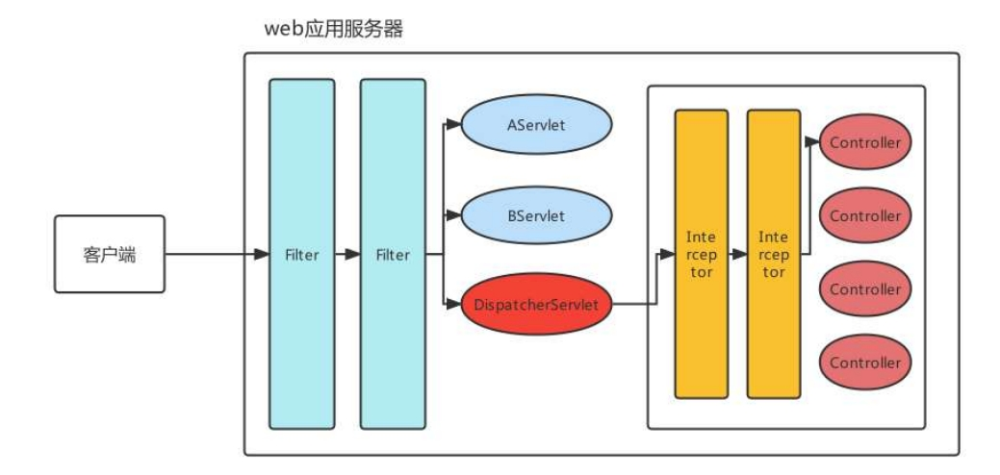

|               | Filter 技术                                             | Interceptor 技术                                             |
| ------------- | ------------------------------------------------------- | ------------------------------------------------------------ |
| 技术范畴      | Javaweb原生技术                                         | SpringMVC框架技术                                            |
| 拦截/过滤资源 | 可以对所有请求都过滤，包括任何Servlet、Jsp、 其他资源等 | 只对进入了SpringMVC管辖范围的才拦截，主要拦截 Controller请求 |
| 执行时机      | 早于任何Servlet执行                                     | 晚于DispatcherServlet执行                                    |

实现了HandlerInterceptor接口，且被Spring管理的Bean都是拦截器，接口定义如下：

```java
public interface HandlerInterceptor {
    default boolean preHandle(HttpServletRequest request, HttpServletResponse response, Object handler) throws Exception {
        return true;
    }

    default void postHandle(HttpServletRequest request, HttpServletResponse response, Object handler, @Nullable ModelAndView modelAndView) throws Exception {
    }

    default void afterCompletion(HttpServletRequest request, HttpServletResponse response, Object handler, @Nullable Exception ex) throws Exception {
    }
}
```

|                 | 作用                                                         | 参数                                                         | 返回值                                                       |
| --------------- | ------------------------------------------------------------ | ------------------------------------------------------------ | ------------------------------------------------------------ |
| preHandle       | 在控制器方法执行之前调用，如果返回false，请求被拦截，不会进入控制器 | Handler是拦截到的Controller方 法处理器                       | 一旦返回false，代表终止向后执行，所有后置方法都不执行， 最终方法只执行对应preHandle 返回了true的 |
| postHandle      | 在控制器方法执行后，视图渲染之前调用，可以在方法中对模型数据和视图进行修改 | Handler是拦截到的Controller方 法处理器；modelAndView是返回的模型视图对象 |                                                              |
| afterCompletion | 视图渲染完成后调用，用于清理资源或记录执行时间               | Handler是拦截到的Controller方 法处理器；ex是异常对象         |                                                              |


拦截器执行顺序取决于 interceptor 的配置顺序。

当每个拦截器都是放行状态时，三个方法的执行顺序如下：

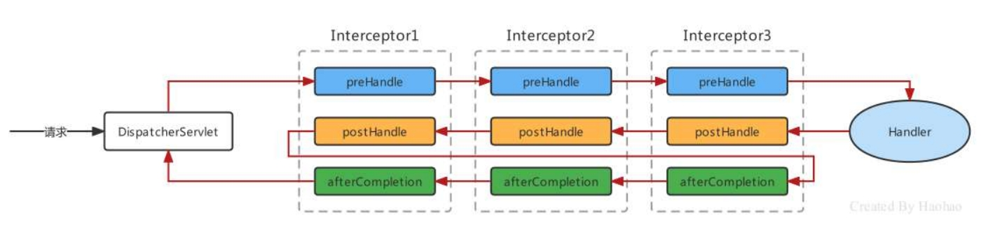

当Interceptor1和Interceptor2处于放行，Interceptor3处于不放行时，三个方法的执行顺序如下:

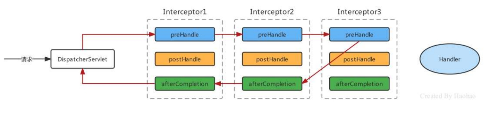

1. 编写MyInterceptor01实现HandlerInterceptor接口：

   ```java
   public class MyInterceptor01 implements HandlerInterceptor {
       @Override
       public boolean preHandle(HttpServletRequest request, HttpServletResponse response, Object 
                                handler) throws Exception {
           System.out.println("Controller方法执行之前...");
           return true;//放行
       }
       @Override
       public void postHandle(HttpServletRequest request, HttpServletResponse response, Object handler, 
                              ModelAndView modelAndView) throws Exception {
           System.out.println("Controller方法执行之后...");
       }
       @Override
       public void afterCompletion(HttpServletRequest request, HttpServletResponse response, Object 
                                   handler, Exception ex) throws Exception {
           System.out.println("渲染视图结束，整个流程完毕...");
       }
   }
   ```

2. 配置Interceptor:

   ```xml
   <!--配置拦截器-->
   <mvc:interceptors>
       <mvc:interceptor>
           <!--配置对哪些资源进行拦截操作-->
           <mvc:mapping path="/*"/>
           <bean class="com.itheima.interceptor.MyInterceptor01"></bean>
       </mvc:interceptor>
   </mvc:interceptors>
   ```
   
   或
   
   ```java
   @Configuration
   public class WebConfig implements WebMvcConfigurer {
   
       @Override
       public void addInterceptors(InterceptorRegistry registry) {
           // 注册自定义拦截器，并指定拦截路径
           registry.addInterceptor(new MyInterceptor())
                   .addPathPatterns("/**")  // 拦截所有路径
                   .excludePathPatterns("/login", "/register");  // 排除特定路径
       }
   }
   ```


### 拦截器执行原理

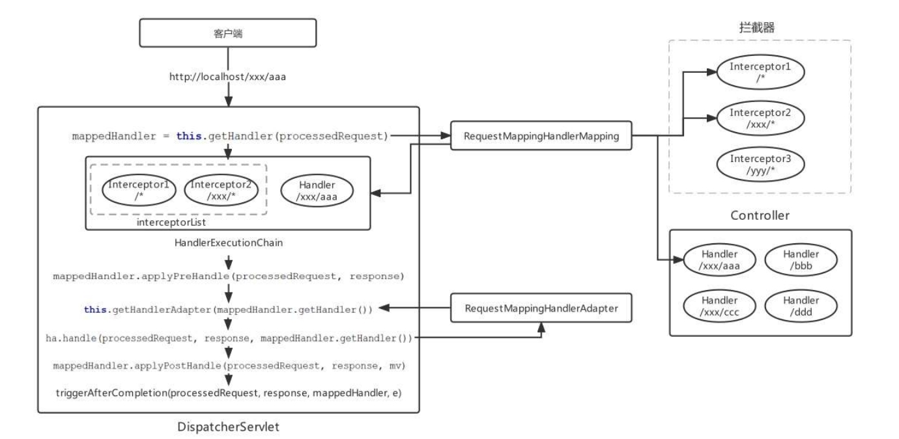

请求到来时先会使用组件HandlerMapping去匹配Controller的方法（Handler）和符合拦截路径的Interceptor， Handler和多个Interceptor被封装成一个HandlerExecutionChain的对象 HandlerExecutionChain 定义如下：

```java
public class HandlerExecutionChain {
    //映射的Controller的方法
    private final Object handler;
    //当前Handler匹配的拦截器集合
    private final List<HandlerInterceptor> interceptorList;
    // ... 省略其他代码 ...
}
```

在DispatcherServlet的doDispatch方法中执行拦截器:

```java
protected void doDispatch(HttpServletRequest request, HttpServletResponse response){
    //根据请求信息获得HandlerExecutionChain
    HandlerExecutionChain mappedHandler = this.getHandler(request);
    //获得处理器适配器
    HandlerAdapter ha = this.getHandlerAdapter(mappedHandler.getHandler());
    //执行Interceptor的前置方法，前置方法如果返回false，则该流程结束
    if (!mappedHandler.applyPreHandle(request, response)) {
        return;
    }
    //执行handler，一般是HandlerMethod
    ModelAndView mv = ha.handle(processedRequest, response, mappedHandler.getHandler());
    //执行后置方法
    mappedHandler.applyPostHandle(processedRequest, response, mv);
    //执行最终方法
    this.triggerAfterCompletion(processedRequest, response, mappedHandler, e);
}
```

HandlerExecutionChain的applyPreHandle方法源码：

```java
boolean applyPreHandle(HttpServletRequest request, HttpServletResponse response) throws 
    Exception {
    //对interceptorList进行遍历,正向遍历,与此同时使用interceptorIndex进行计数
    for(int i = 0; i < this.interceptorList.size(); this.interceptorIndex = i++) {
        //取出每一个Interceptor对象
        HandlerInterceptor interceptor = (HandlerInterceptor)this.interceptorList.get(i);
        //调用Interceptor的preHandle方法，如果返回false，则直接执行Interceptor的最终方法
        if (!interceptor.preHandle(request, response, this.handler)) {
            //执行Interceptor的最终方法
            this.triggerAfterCompletion(request, response, (Exception)null);
            return false;
        }
    }
    return true;
}
```

HandlerExecutionChain的applyPostHandle方法源码：

```java
void applyPostHandle(HttpServletRequest request, HttpServletResponse response, @Nullable 
                     ModelAndView mv) throws Exception {
    //对interceptorList进行遍历，逆向遍历
    for(int i = this.interceptorList.size() - 1; i >= 0; --i) {
        //取出每一个Interceptor
        HandlerInterceptor interceptor = (HandlerInterceptor)this.interceptorList.get(i);
        //执行Interceptor的postHandle方法
        interceptor.postHandle(request, response, this.handler, mv);
    }
}
```

HandlerExecutionChain的triggerAfterCompletion方法源码：

```java
void triggerAfterCompletion(HttpServletRequest request, HttpServletResponse response, @Nullable 
                            Exception ex) {
    //逆向遍历interceptorList，遍历的个数为执行的applyPreHandle次数-1
    for(int i = this.interceptorIndex; i >= 0; --i) {
        //取出每一个Interceptor
        HandlerInterceptor interceptor = (HandlerInterceptor)this.interceptorList.get(i);
        try {
            //执行Interceptor的afterCompletion方法
            interceptor.afterCompletion(request, response, this.handler, ex);
        } catch (Throwable var7) {
            logger.error("HandlerInterceptor.afterCompletion threw exception", var7);
        }
    }
}
```


## SpringMVC的全注解开发 

xml配置文件使用核心配置类替代，xml中的标签使用对应的注解替代

```xml
<!-- 组件扫描web层 -->
<context:component-scan base-package="com.itheima.controller"/>
<!--注解驱动-->
<mvc:annotation-driven/>
<!--配置文件上传解析器-->
<bean id="multipartResolver" 
      class="org.springframework.web.multipart.commons.CommonsMultipartResolver"/>
<!--配置拦截器-->
<mvc:interceptors>
    <mvc:interceptor>
        <mvc:mapping path="/*"/>
        <bean class="com.itheima.interceptor.MyInterceptor01"></bean>
    </mvc:interceptor>
</mvc:interceptors>
<!--配置DefaultServletHttpRequestHandler-->
<mvc:default-servlet-handler/>
```

组件扫描，可以通过@ComponentScan注解完成；

文件上传解析器multipartResolver可以通过非自定义Bean的注解配置方式，即@Bean注解完成；

` <mvc:default-servlet-handler />`和 `<mvc:interceptors>` 通过 @EnableWebMvc 完成。

```java
@Configuration
@ComponentScan("com.itheima.controller")
@EnableWebMvc
public class SpringMVCConfig {
    @Bean
    public CommonsMultipartResolver multipartResolver(){
        CommonsMultipartResolver multipartResolver = new CommonsMultipartResolver();
        multipartResolver.setDefaultEncoding("UTF-8");
        multipartResolver.setMaxUploadSize(3145728);
        multipartResolver.setMaxUploadSizePerFile(1048576);
        multipartResolver.setMaxInMemorySize(1048576);
        return multipartResolver;
    }
}
```

配置Spring和SpringMVC的入口：

```java
public class MyAnnotationConfigDispatcherServletInitializer extends 
    AbstractAnnotationConfigDispatcherServletInitializer {
    //提供Spring容器的核心配置类
    protected Class<?>[] getRootConfigClasses() {
        System.out.println("加载核心配置类创建ContextLoaderListener");
        return new Class[]{ApplicationContextConfig.class};
    }
    //提供SpringMVC容器的核心配置类
    protected Class<?>[] getServletConfigClasses() {
        System.out.println("加载核心配置类创建DispatcherServlet");
        return new Class[]{SpringMVCConfig.class};
    }
    //提供前端控制器的映射路径
    protected String[] getServletMappings() {
        return new String[]{"/"};
    }
}
```


```JAVA
@Retention(RetentionPolicy.RUNTIME)
@Target({ElementType.TYPE})
@Documented
@Import({DelegatingWebMvcConfiguration.class})
public @interface EnableWebMvc {}
```

@EnableWebMvc内部通过@Import 导入了DelegatingWebMvcConfiguration类

```Java
@Configuration(proxyBeanMethods = false)
public class DelegatingWebMvcConfiguration extends WebMvcConfigurationSupport {
    private final WebMvcConfigurerComposite configurers = new WebMvcConfigurerComposite();
    //从容器中注入WebMvcConfigurer类型的Bean
    @Autowired(required = false)
    public void setConfigurers(List<WebMvcConfigurer> configurers) {
        if (!CollectionUtils.isEmpty(configurers)) {
            this.configurers.addWebMvcConfigurers(configurers);
        }
    }
    //省略其他代码
}
```

WebMvcConfigurer类型的Bean会被注入进来，然后被自动调用，所以可以实现WebMvcConfigurer接口，完成一些解析器、默认Servlet等的指定，WebMvcConfigurer接口定义如下：

```Java
public interface WebMvcConfigurer {
    //配置默认Servet处理器
    default void configureDefaultServletHandling(DefaultServletHandlerConfigurer configurer) { }
    //添加拦截器
    default void addInterceptors(InterceptorRegistry registry) { }
    //添加资源处理器
    default void addResourceHandlers(ResourceHandlerRegistry registry) { }
    //添加视图控制器
    default void addViewControllers(ViewControllerRegistry registry) { }
    //配置视图解析器
    default void configureViewResolvers(ViewResolverRegistry registry) { }
    //添加参数解析器
    default void addArgumentResolvers(List<HandlerMethodArgumentResolver> resolvers) { }
    //... 省略其他代码 ...
}
```

创建MyWebMvcConfigurer实现WebMvcConfigurer接口，实现addInterceptors 和 configureDefaultServletHandling方法

```java
@Component
public class MyWebMvcConfigurer implements WebMvcConfigurer {
    @Override
    public void configureDefaultServletHandling(DefaultServletHandlerConfigurer configurer) {
        //开启DefaultServlet，可以处理静态资源了
        configurer.enable();
    }
    @Override
    public void addInterceptors(InterceptorRegistry registry) {
        //创建拦截器对象，进行注册
        //Interceptor的执行顺序也取决于添加顺序
        registry.addInterceptor(new MyInterceptor01()).addPathPatterns("/*");
    }
}
```


## SpringMVC的组件原理

### 前端控制器初始化

前端控制器DispatcherServlet是SpringMVC的入口，也是SpringMVC的大脑，主流程的工作都是在此完成的。DispatcherServlet 本质是个Servlet，当配置了 load-on-startup 时，会在服务器启动时就执行创建和执行初始化init方法，每次请求都会执行service方法 DispatcherServlet 的初始化主要做了两件事：

* 获得了一个 SpringMVC 的 ApplicationContext容器；
* 注册了 SpringMVC的九大组件

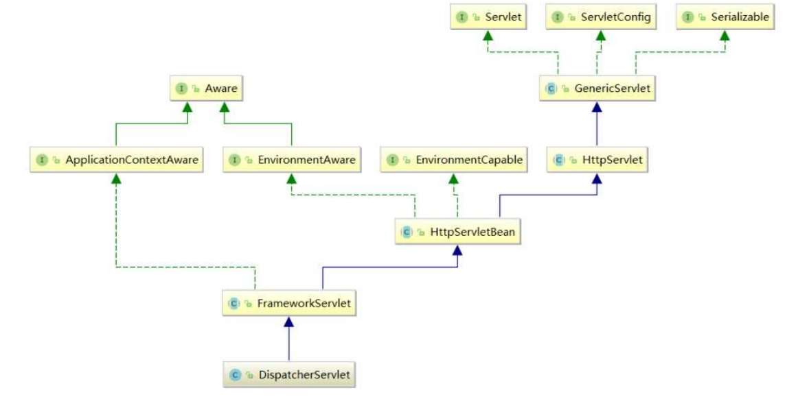

SpringMVC 的ApplicationContext容器创建时机，Servlet 规范的 init(ServletConfig config) 方法经过子类重写 ，最终会调用 FrameworkServlet 抽象类的initWebApplicationContext() 方法，该方法中最终获得 一个根 Spring容器（Spring产生的），一个子Spring容器（SpringMVC产生的）.

HttpServletBean 的初始化方法:

```java
public final void init() throws ServletException {
    this.initServletBean();
}
```

FrameworkServlet的initServletBean方法:

```java
protected final void initServletBean() throws ServletException {
    this.webApplicationContext = this.initWebApplicationContext();//初始化ApplicationContext
    this.initFrameworkServlet();//模板设计模式，供子类覆盖实现，但是子类DispatcherServlet没做使用
}
```

在initWebApplicationContext方法中体现的父子容器的逻辑关系:

```java
//初始化ApplicationContext是一个及其关键的代码
protected WebApplicationContext initWebApplicationContext() {
    //获得根容器，其实就是通过ContextLoaderListener创建的ApplicationContext
    //如果配置了ContextLoaderListener则获得根容器，没配置获得的是null
    WebApplicationContext rootContext = 
        WebApplicationContextUtils.getWebApplicationContext(this.getServletContext());
    //定义SpringMVC产生的ApplicationContext子容器
    WebApplicationContext wac = null;
    if (wac == null) {
        //==>创建SpringMVC的子容器，创建同时将Spring的创建的rootContext传递了过去
        wac = this.createWebApplicationContext(rootContext);
    }
    //将SpringMVC产生的ApplicationContext子容器存储到ServletContext域中
    //key名是：org.springframework.web.servlet.FrameworkServlet.CONTEXT.DispatcherServlet
    if (this.publishContext) {
        String attrName = this.getServletContextAttributeName();
        this.getServletContext().setAttribute(attrName, wac);
    }
}
```

```java
protected WebApplicationContext createWebApplicationContext(@Nullable ApplicationContext 
                                                            parent) {
    //实例化子容器ApplicationContext
    ConfigurableWebApplicationContext wac = 
        (ConfigurableWebApplicationContext)BeanUtils.instantiateClass(contextClass);
    //设置传递过来的ContextLoaderListener的rootContext为父容器
    wac.setParent(parent);
    //获得web.xml配置的classpath:spring-mvc.xml
    String configLocation = this.getContextConfigLocation();
    if (configLocation != null) {
        //为子容器设置配置加载路径
        wac.setConfigLocation(configLocation);
    }
    //初始化子容器(就是加载spring-mvc.xml配置的Bean)
    this.configureAndRefreshWebApplicationContext(wac);
    return wac;
}
```

父容器和子容器概念和关系： 

* 父容器：Spring 通过ContextLoaderListener为入口产生的applicationContext容器，内部主要维护的是 applicationContext.xml（或相应配置类）配置的Bean信息；
* 子容器：SpringMVC通过DispatcherServlet的init() 方法产生的applicationContext容器，内部主要维护的是spring-mvc.xml（或相应配置类）配置的Bean信息，且内部还通过parent属性维护这父容器的引用。 
* Bean的检索顺序：根据上面子父容器的概念，可以知道Controller存在于子容器中，而Controller中要注入 Service时，会先从子容器本身去匹配，匹配不成功时在去父容器中去匹配，于是最终从父容器中匹配到的 UserService，这样子父容器就可以进行联通了。但是父容器只能从自己容器中进行匹配，不能从子容器中进行匹配。


注册 SpringMVC的九大组件，在初始化容器initWebApplicationContext方法中无论是否含有MVC容器总会执行configureAndRefreshWebApplicationContext方法，进而执行refresh方法中的过程，然后finishRefresh方法中发布事件

```java
protected void finishRefresh() {

    // Publish the final event.
    publishEvent(new ContextRefreshedEvent(this));
}
```

FrameworkServlet中的内部类ContextRefreshListener监听事件，进而执行了onRefresh方法，最终执行了初始化策略initStrategies方法，注册了九个解析器组件

```java
public abstract class FrameworkServlet extends HttpServletBean implements ApplicationContextAware {
    private class ContextRefreshListener implements ApplicationListener<ContextRefreshedEvent> {

        @Override
        public void onApplicationEvent(ContextRefreshedEvent event) {
            FrameworkServlet.this.onApplicationEvent(event);
        }
    }
    public void onApplicationEvent(ContextRefreshedEvent event) {
		this.refreshEventReceived = true;
		synchronized (this.onRefreshMonitor) {
			onRefresh(event.getApplicationContext());
		}
	}
}
```

```java
//DispatcherServlet初始化SpringMVC九大组件
protected void initStrategies(ApplicationContext context) {
    this.initMultipartResolver(context);//1、初始化文件上传解析器
    this.initLocaleResolver(context);//2、初始化国际化解析器
    this.initThemeResolver(context);//3、初始化模板解析器
    this.initHandlerMappings(context);//4、初始化处理器映射器
    this.initHandlerAdapters(context);//5、初始化处理器适配器
    this.initHandlerExceptionResolvers(context);//6、初始化处理器异常解析器
    this.initRequestToViewNameTranslator(context);//7、初始化请求视图转换器
    this.initViewResolvers(context);//8、初始化视图解析器
    this.initFlashMapManager(context);//9、初始化lashMapManager策略组件
}
```


### 前端控制器执行主流程


**核心组件：**

1. **DispatcherServlet** :  **前端控制器**，负责接收请求、分发，并给予客户端响应。
2. **HandlerMapping** :  **处理器映射器**，根据 URL 去匹配查找能处理的 `Handler` ，并会将请求涉及到的拦截器和 `Handler` 一起封装。
3. **HandlerAdapter** : **处理器适配器**，根据 `HandlerMapping` 找到的 `Handler` ，适配执行对应的 `Handler`；
4. **Handler** : **请求处理器**，处理实际请求的处理器。
5. **ViewResovler** : **视图解析器**，根据 `Handler` 返回的逻辑视图 / 视图，解析并渲染真正的视图，并传递给 `DispatcherServlet` 响应客户端


**执行流程：**

1. 客户端（浏览器）发送请求，请求达到服务器后， `DispatcherServlet`拦截请求。
2. `DispatcherServlet` 根据请求信息调用 `HandlerMapping` 。`HandlerMapping` 根据 URL 去匹配查找能处理的 `Handler`（ `Controller` 控制器） ，并会将请求涉及到的拦截器和 `Handler` 一起封装返回。
3. `DispatcherServlet` 调用 `HandlerAdapter`适配器执行 `Handler` 方法。
4. `Handler` 完成对用户请求的处理后，会返回一个 `ModelAndView` 对象给`DispatcherServlet`，`ModelAndView` 顾名思义，包含了数据模型以及相应的视图的信息。`Model` 是返回的数据对象，`View` 是个逻辑上的 `View`。
5. `ViewResolver` 会根据逻辑 `View` 查找实际的 `View`。
6. `DispaterServlet` 把返回的 `Model` 传给 `View`（视图渲染）。
7. 把 `View` 返回给请求者（浏览器）


FrameworkServlet 复写了service(HttpServletRequest request, HttpServletResponse response) 、doGet(HttpServletRequest request, HttpServletResponse response)、doPost(HttpServletRequest request, HttpServletResponse response)等方法，这些方法都会调用processRequest方法

```java
protected final void processRequest(HttpServletRequest request, HttpServletResponse response){
    this.doService(request, response);
}
```

进一步调用了doService方法，该方法内部又调用了doDispatch方法，而SpringMVC 主流程最核心的方法就是 doDispatch 方法

```java
protected void doService(HttpServletRequest request, HttpServletResponse response) {
    this.doDispatch(request, response);
}
```

doDispatch方法源码:

```java
protected void doDispatch(HttpServletRequest request, HttpServletResponse response) {
    HttpServletRequest processedRequest = request;
    HandlerExecutionChain mappedHandler = null; //定义处理器执行链对象
    ModelAndView mv = null; //定义模型视图对象
    //匹配处理器映射器HandlerMapping，返回处理器执行链对象(包含拦截器和当前要被执行的方法的handler对象)
    mappedHandler = this.getHandler(processedRequest);
    //匹配处理器适配器HandlerAdapter，返回处理器适配器对象
    HandlerAdapter ha = this.getHandlerAdapter(mappedHandler.getHandler());
    //执行Interceptor的前置方法preHandle
    mappedHandler.applyPreHandle(processedRequest, response);
    //处理器适配器执行控制器Handler，返回模型视图对象
    mv = ha.handle(processedRequest, response, mappedHandler.getHandler());
    //执行Interceptor的后置方法postHandle
    mappedHandler.applyPostHandle(processedRequest, response, mv);
    //获取视图渲染视图
    this.processDispatchResult(processedRequest, response, mappedHandler, mv, (Exception)dispatchException);
}
```


## SpringMVC的异常处理

### SpringMVC 异常的处理流程

SpringMVC 处理异常的思路是，一路向上抛，都抛给前端控制器 DispatcherServlet ，DispatcherServlet 在调用异常处理器ExceptionResolver进行处理

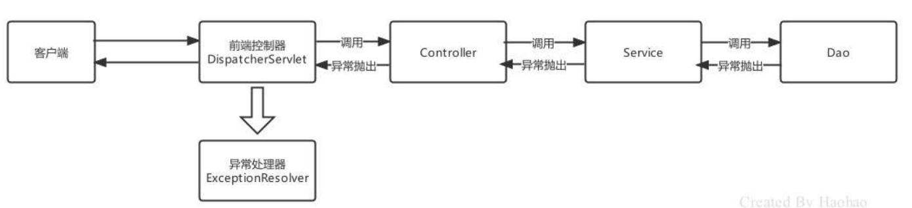

### SpringMVC 的异常处理方式

SpringMVC 提供了以下三种处理异常的方式： 

* 简单异常处理器：使用SpringMVC 内置的异常处理器处理 SimpleMappingExceptionResolver；
* 自定义异常处理器：实现HandlerExceptionResolver接口，自定义异常进行处理； 
* 注解方式：使用@ControllerAdvice + @ExceptionHandler 来处理

使用注解 @ControllerAdvice + @ExceptionHandler 配置异常，@ControllerAdvice 注解本质是一个 @Component，也会被扫描到，与此同时，具备AOP功能，默认情况下对所有的Controller都进行拦截操作， 拦截后干什么呢？就需要在结合@ExceptionHandler、@InitBinder、@ModelAttribute 注解一起使用了，此处我们讲解的是异常，所以是@ControllerAdvice + @ExceptionHandler的组合形式。

```java
@ControllerAdvice
public class GlobalExceptionHandler {
    @ExceptionHandler(RuntimeException.class)
    public ModelAndView runtimeHandleException(RuntimeException e){
        System.out.println("全局异常处理器执行...."+e);
        ModelAndView modelAndView = new ModelAndView("/error.html");
        return modelAndView;
    }
    @ExceptionHandler(IOException.class)
    @ResponseBody
    public ResultInfo ioHandleException(IOException e){
        //模拟一个ResultInfo
        ResultInfo resultInfo = new ResultInfo(0,"IOException",null);
        return resultInfo;
    }
}
```

如果全局异常处理器响应的数据都是Json格式的字符串的话，可以使用@RestControllerAdvice替代 @ControllerAdvice 和 @ResponseBody

### SpringMVC 常用的异常解析器

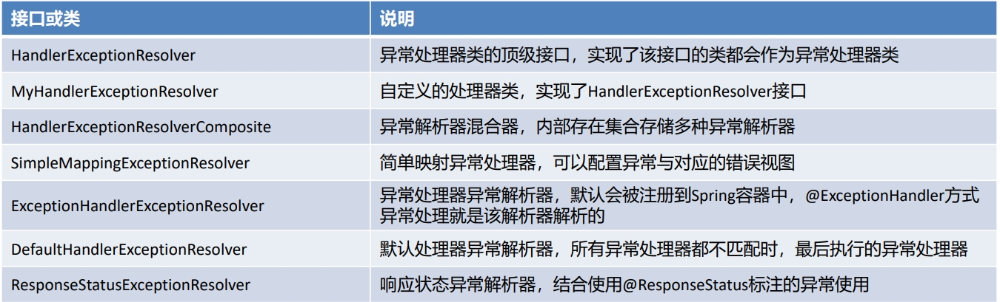
