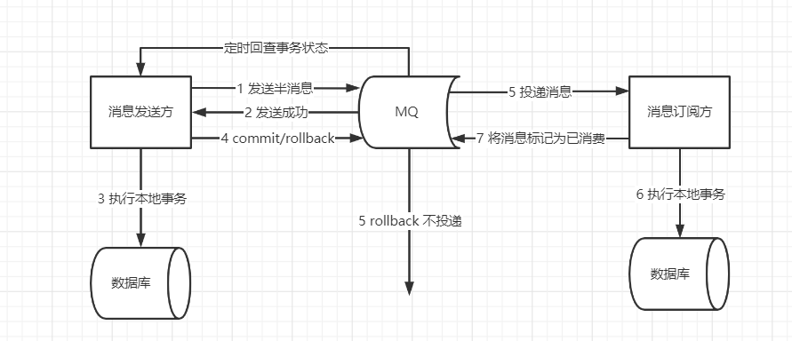
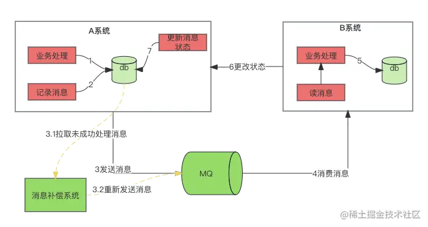
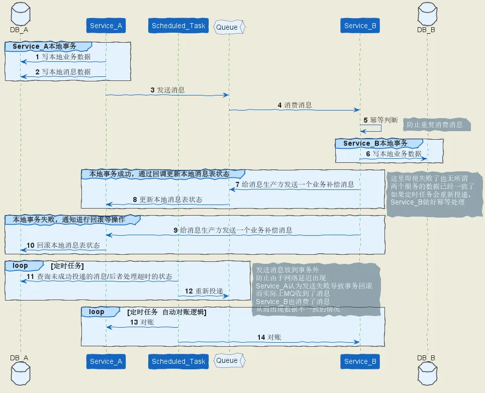

## 一笔用户订单，在取消的那一刻刚好付款怎么办？

会出现两种情况：

1. 支付成功，回调那一刻还没取消：则取消执行失败，不做任何处理。
2. 支付成功，回调那一刻已取消：退款

解决方法：基于原始状态判断

```sql
# 支付成功
update pay_info set status = 'paySuccess' where orderId='1' and status = 'paying';
# 取消
update pay_info set status = 'cancel' where orderId='1' and status = 'paying';
```


业务优化：

订单取消的倒计时为10分钟，实际后端延时11分钟，就能避免取消的时刻刚好付款。


除了利用数据库处理，还可以使用分布式锁。

订单取消流程：

1. 超时触发取消订单
2. 取消订单方法中先获取该订单的分布式锁，如果锁被其他操作持有（如付款），等待或抛出异常。获取锁成功，则检查订单状态是否已付款：
   1. 未付款：更新订单状态为已取消。
   2. 已付款：直接跳过该订单的处理
3. 释放分布式锁。


订单付款流程：

1. 三方支付成功回调
2. 后端系统接收回调后，先获取该订单的分布式锁，如果锁被其他操作持有（如取消），等待或者抛出异常（没有给三方响应成功，三方会重新发起回调）。成功获取锁，检查订单状态是否为待支付：
   1. 待支付：继续执行扣款，更新订单状态为已支付
   2. 已取消：发起退款，提示用户订单取消
3. 释放分布式锁。


## 如何避免重复下单？

1）每次下单请求中生成一个唯一的requestId或token。

进入订单页面时会先向后端请求生成一个唯一的requestId或token，每次下单请求携带该requestId或token。

2）分布式锁 ：以用户维度加上分布式锁。


## 假设有一个1G的HashMap，此时用户请求过来刚好触发他的扩容，会怎样？怎么优化？

触发扩容的是当前线程，此时用户会被阻塞，等待扩容完毕。

优化：渐进式rehash

扩容时先创建一个新数组，只重新哈希一部分数据，每次插入、修改、查询时迁移少量数据到数组中，直到完成所有数据的迁移。


## 线上消息队列故障，兜底改造方案

1）RocketMQ事务消息，但是侵入性比较大，需要修改接口适配事务消息的实现。

2）本地消息表

### RocketMQ事务消息

基于MQ的事务消息方案主要依靠MQ的**半消息机制**来实现投递消息和参与者自身本地事务的一致性保障。




### 本地消息表



**0. 创建本地消息表：**

在数据库中创建一个本地消息表，用于存储待发送的消息以及消息的发送状态和相关信息。表结构可以包含字段如下：

- `message_id`：消息的唯一标识。
- `message_body`：消息内容。
- `status`：消息状态，如待发送、已发送等。
- `create_time`：消息创建时间。
- 其他字段，如重试次数、发送时间等。

**1. 业务处理：** 业务处理时通常进行db变更

**2. 将记录消息插入记录表**：在业务逻辑中，当需要发送消息时，首先将消息插入到本地消息表中，设置状态为待发送。1、2步骤在同一个本地事务中。业务数据和消息表在同一个数据库，要保证它俩在同一个本地事务。直接利用本地事务，将业务数据和事务消息直接写入数据库。

**3. 发送消息**

**3.1,3.2. 消息补偿机制：**

单独创建一个后台线程或定时任务，定时扫描本地消息表中状态为待发送的消息，并将这些消息发送到消息队列。在成功发送到消息队列后，将消息表中对应的状态修改为已发送。此外，可以根据需要实现消息发送失败后的重试机制。

**4. B系统消费消息：**消费者监听消息队列，解析消息内容。

**5. B系统进行业务逻辑处理：**进行业务逻辑处理，更改DB。**此步骤必须要保证幂等性**。

**6. 确认消费完成：**当消息消费完成后，调用A系统进行状态变更

**6、7如果失败相当于两个分布式系统的数据已经一致了，但是本地消息表的状态还是错的。这种情况下借助`3.1、3.2`的重新投放策略，让下游幂等处理再更改消息表的状态也能解决。或者A系统也可以查询B系统的处理状态，如果成功直接更改状态**。



需要注意以下几点：

- **消息的幂等性：** 消费者一定需要保证接口的幂等性，消息的幂等性非常重要，以防止消息重复处理导致的数据不一致。
- **本地消息表的设计：** 本地消息表的设计需要考虑到消息状态、重试次数、创建时间等字段，以便实现消息的跟踪和管理。
- **定时任务和重试机制：** 需要实现定时任务或者重试机制来确保消息的可靠发送和处理。


优点：

- 本地消息表建设成本比较低，实现了可靠消息的传递确保了分布式事务的最终一致性。
- 无需提供回查方法，进一步减少的业务的侵入。
- 在某些场景下，还可以进一步利用注解等形式进行解耦，有可能实现无业务代码侵入式的实现。

缺点：

- 本地消息表与业务耦合在一起，难于做成通用性，不可独立伸缩。
- 本地消息表是基于数据库来做的，而数据库是要读写磁盘IO的，因此在高并发下是有性能瓶颈的
- 数据大时，消息积压问题，扫表效率慢
- 数据大时，事务表数据爆炸，定时扫表存在延迟问题


**本地消息表实现分布式事务缺点及解决方式**：

消息堆积、扫表效率慢：

- 索引优化：在消息表中对状态字段增加索引，以加速扫表操作。索引可以加速消息的检索和筛选，从而提高操作效率。
- 分页查询：将扫表操作划分为多次分页查询，避免一次性查询大量数据造成的性能问题。
- 表较大时进行分库分表：如果表较大可以进行分库分表操作。
- 多线程分段查询：
  - 如果有业务标识，可以通过业务标识进行多线程分段扫表查询。
  - 如果没有业务标识可以按区间查询比如线程1查询0-1000的数据，线程2查询1001-2000的数据。

定时任务扫表延迟问题：

定时任务可能由于各种原因导致扫表延迟，进而影响事务处理的实时性。以下是一些应对方法：

- 异步发送MQ改为同步调用接口：异步改为同步调用B系统接口，如果失败了再进行异步发送MQ消息。
- 发送MQ延迟消息，去掉定时任务，避免大量扫表处理。
- 分布式定时任务： 使用分布式定时任务框架，将定时任务分散到多个节点上执行，以减少单个节点的压力，同时提高定时任务的稳定性和准确性。
- 增加资源： 增加定时任务执行节点的数量，以提高并发处理能力，减少延迟。


## 性能优化

[两万字的性能优化指南！39个策略提升接口性能！39个技巧，从8个方面，全面梳理后端性能优化的套路。 包含优化Http接口 - 掘金](https://juejin.cn/post/7287420810318299190)


## 如何设计一个秒杀功能？

秒杀场景的核心特点是**高并发、低库存、短时间爆发式访问** 。因此，设计时需要解决以下几个问题：

1. **高并发处理** ：如何应对大量用户同时访问？
2. **库存一致性** ：如何保证库存不会超卖或少卖？
3. **用户体验** ：如何减少用户等待时间，避免页面崩溃？
4. **防刷机制** ：如何防止恶意用户利用脚本抢购商品？


1、前端层：

- **静态资源分离** ：将秒杀页面的静态资源（如HTML、CSS、JS）部署到CDN（内容分发网络），减轻服务器压力。
- **请求拦截**：活动未开始时，前端按钮置灰；通过验证码、点击频率限制。

2、网关层：

- **流量拦截** ：使用API网关对请求进行初步过滤，例如IP限流、黑名单拦截等。
- **身份验证** ：通过Token或签名验证用户身份，防止未登录用户直接访问秒杀接口。

3、缓存层：

- **Redis缓存库存** ：将商品库存信息存储在Redis中，利用其高性能特性处理库存扣减操作。
- **预热数据** ：在秒杀活动开始前，将商品信息和库存数据加载到Redis中，减少数据库压力。

4、消息队列：

- **削峰填谷** ：使用消息队列（如Kafka）将用户的秒杀请求异步化，避免直接冲击后端服务。
- **订单处理** ：将成功的秒杀请求放入队列，由后台服务异步生成订单，提高系统吞吐量。

5、数据库层

- **乐观锁**：在库存扣减时，使用乐观锁确保库存一致性。
- **读写分离** ：通过主从复制实现数据库的读写分离，提升查询性能。


具体流程如下：

- **秒杀请求达到**：用户发起秒杀请求，系统接收到请求后，首先进行一些基础校验（如用户身份验证、活动是否开始等）。如果校验通过，进入库存扣减逻辑。
- **Redis库存扣减：**在Redis中检查商品库存是否充足。例如，使用`GET`命令获取当前库存数量。如果库存不足，直接返回失败，结束流程。如果库存充足，使用Redis的原子操作（如`DECR`或Lua脚本）扣减库存。
- **异步更新数据库**：如果Redis库存扣减成功，生成一个秒杀成功的消息，并将其放入消息队列
- **后台服务消费消息：**后台服务从消息队列中消费秒杀成功的消息，执行以下操作：1、为用户创建订单记录；2、使用乐观锁将数据库中的库存数量减少1；3、通过唯一标识（如用户ID+商品ID+时间戳）防止重复消费。
- **最终一致性校验：**在Redis库存扣减和数据库库存更新之间，可能会存在短暂的不一致状态。为了保证最终一致性，可以采取以下措施：1、定期将Redis中的库存数据与数据库进行同步。2、如果发现Redis和数据库库存不一致，触发补偿逻辑（如回滚订单或调整库存）。


## 海量数据

[十道海量数据处理面试题与十个方法大总结-腾讯云开发者社区-腾讯云](https://cloud.tencent.com/developer/article/2102014)

所谓**海量数据处理**，就是**基于海量数据上的存储、处理、操作**。

**海量**就是数据量太大，所以导致要么是**无法在较短时间内迅速解决**，要么是**无法一次性装入内存**。

 **解决办法:**

 （1）针对**时间**，可以采用巧妙的**算法**搭配合适的**数据结构**，如**Hash/bit-map**/堆/数据库或倒排索引/**trie**树；

 （2）针对**空间**，大而化小：分而治之/hash映射，把规模大化为规模小的，各个击破。

 处理海量数据问题，有**6种方法模式**：

1. 分而治之/hash映射 + hash统计 + 堆/快速/归并排序；
2. 双层桶划分
3. Bloom filter/Bitmap；
4. Trie树/数据库/倒排索引；
5. 外排序；
6. 分布式处理之Hadoop/Mapreduce。


### 分而治之/Hash映射 + Hash统计 + 堆/快速/归并排序

**1、海量日志数据，提取出某日访问百度次数最多的那个IP。**

1. **分而治之/hash映射**：首先把这一天访问百度的日志中的IP取出来，根据IP将其映射到1000个不同的文件。
2. **hash统计**：对每个小文件，采用hash_map等统计每个文件中出现的IP以及相应的频率。
3. 依次找出各个文件中频率最大的那个IP及相应的频率。然后再在这1000个最大的IP中，找出那个频率最大的IP。


**2、寻找热门查询，300万个查询字符串中统计最热门的10个查询**

> 搜索引擎会通过日志文件把用户每次检索使用的所有检索串都记录下来，每个查询串的长度为1-255字节。假设目前有一千万个记录（这些查询串的重复度比较高，虽然总数是1千万，但如果除去重复后，不超过3百万个。一个查询串的重复度越高，说明查询它的用户越多，也就是越热门），请你统计最热门的10个查询串，要求使用的内存不能超过1G。

数据大则划为小的，但如果数据规模比较小，**能一次性装入内存呢**?  300万的Query，每个Query255Byte，因此可以考虑把他们都放进内存中去（300万个字符串假设没有重复，都是最大长度，那么最多占用内存3M*1K/4=0.75G。所以可以将所有字符串都存放在内存中进行处理）。

所以只需要使用Hash统计字符串次数，再使用堆排序。


**3、有一个1G大小的一个文件，里面每一行是一个词，词的大小不超过16字节，内存限制大小是1M。返回频数最高的100个词。** 

1. **分而治之/hash映射**：顺序读文件中，对于每个词x，取hash(x)%5000，然后按照该值存到**5000个小文件**（记为x0,x1,…x4999）中。这样每个文件大概是200k左右。如果其中的有的文件超过了1M大小，还可以按照类似的方法继续往下分，直到分解得到的**小文件的大小都不超过1M**。
2. **hash统计**：对每个小文件，采用trie树/hash_map等统计每个文件中出现的词以及相应的频率。
3. **堆排序**：构建一个大小为100的小顶堆，依次遍历每个文件，调整堆，遍历结束后小顶堆上的词就是频率最高的100个词。

> 求解最大的TopN，就用小顶堆；求解最小的TopN，用大顶堆。


**4、海量数据分布在100台电脑中，想个办法高效统计出这批数据的TOP10。** 

1. 堆排序：在每台电脑上求出TOP10，可以采用包含10个元素的堆完成（TOP10小，用最大堆，TOP10大，用最小堆）。
2. 求出每台电脑上的TOP10后，然后把这100台电脑上的TOP10组合起来，共1000个数据，再利用上面类似的方法求出TOP10就可以了。  


**5、有10个文件，每个文件1G，每个文件的每一行存放的都是用户的query，每个文件的query都可能重复。要求你按照query的频度排序。**  

1. **hash映射**：顺序读取10个文件，按照hash(query)%10的结果**将query写入到另外10个文件**（记为a0,a1,..a9）中。这样新生成的文件每个的大小大约也1G（假设hash函数是随机的）。
2. **hash统计**：找一台内存在2G左右的机器，依次对用hash_map(query, query_count)来**统计每个query出现的次数**。
3. **堆/快速/归并排序**：利用快速/堆/归并排序按照出现次数进行排序，将排序好的query和对应的query_cout输出到文件中，这样得到了**10个排好序的文件**

4. 最后，对这10个文件进行**归并排序**（内排序与外排序相结合）。


**6、给定a、b两个文件，各存放50亿个url，每个url各占64字节，内存限制是4G，让你找出a、b文件共同的url？** 

可以估计每个文件的大小为5G×64=320G，远远大于内存限制的4G。

1. **分而治之/hash映射**：遍历文件a，对url进行hash，将url分别存储到1000个小文件ai；遍历文件b，采取和a相同的方式将url分别存储到1000小文件bi中
2. **hash统计**：所有可能相同的url都在对应的小文件，统计共同url即可。

或者使用前缀树。


**7、一个文本文件，大约有一万行，每行一个词，要求统计出其中最频繁出现的前10个词，请给出思想，给出时间复杂度分析。** 

**用trie树统计每个词出现的次数**，**时间复杂度是O(n\*le)** （le表示单词的平均长度）。然后是找出出现最频繁的前10个词，可以用**堆**来实现，前面的题中已经讲到了，**时间复杂度是O(n\*lg10)。**所以总的时间复杂度，**是O(n\*le)与O(n\*lg10)中较大的一个**。


### 双层桶划分

**1、5亿个int找它们的中位数。**

顺序读取5亿个数，对于读取到的数字num，如果它对应的二进制中最高位为1，则把数字写道f1中，否则写到f0中，划分为两部分。根据个数判断中位数位于哪边。继续使用次高为的二进制进行划分，如此划分下去，直到划分后的文件可以加载到内存中，把数据直接排序，找出中位数。


### Bloom filter/Bitmap

**1、在2.5亿个整数中找出不重复的整数，注，内存不足以容纳这2.5亿个整数。** 

方案1：采用2-Bitmap（**每个数分配2bit，00表示不存在，01表示出现一次，10表示多次，11无意义**）进行，共需内存2^32 * 2 bit=1 GB内存，还可以接受。然后扫描这2.5亿个整数，查看Bitmap中相对应位，如果是00变01，01变10，10保持不变。所描完事后，查看bitmap，把对应位是01的整数输出即可。

方案2：进行划分小文件的方法。然后在小文件中找出不重复的整数，并排序。然后再进行归并，注意去除重复的元素。


**2、给40亿个不重复的unsigned int的整数，没排过序的，然后再给一个数，如何快速判断这个数是否在那40亿个数当中？**

用位图/Bitmap的方法，申请512M的内存，一个bit位代表一个unsigned int值。读入40亿个数，设置相应的bit位，读入要查询的数，查看相应bit位是否为1，为1表示存在，为0表示不存在。


**3、有1000个一模一样的瓶子，其中999瓶是水，一瓶是毒药。任何喝下毒药的生命都会在一星期后死亡。现在你有10只小白鼠和1星期的时间，如何检测出那瓶是毒药？**

1. **为每个瓶子编号**：将1000个瓶子从1到1000编号。

2. **将瓶子编号转换为二进制**：因为你有10只小白鼠，所以可以用10位二进制数来表示每个瓶子的编号。例如，瓶子1的二进制表示为`0000000001`，瓶子1000的二进制表示为`1111101000`。

3. **分配小白鼠喝水**：
   - 用每个瓶子的二进制表示法的每一位（0或1）来决定哪只小白鼠要喝那瓶水。例如，如果某个瓶子的二进制表示中的第一位是1，就让第一只小白鼠喝这瓶水，如果第二位是1，就让第二只小白鼠喝，以此类推。
   - 对每个瓶子按照它的二进制表示给对应的小白鼠喝水。例如，瓶子1000的二进制是`1111101000`，所以第1到第5只小白鼠和第7只小白鼠要喝瓶子1000的水。

4. **等待一周后观察小白鼠的死亡情况**：
   - 一周后，观察哪些小白鼠死了。根据死亡的小白鼠，我们可以形成一个新的10位二进制数。
   - 例如，如果第1、2、5只小白鼠死了，而其他小白鼠存活，那么这个二进制数为`00000001101`，将这个二进制数转换为十进制，就可以得出有毒的瓶子的编号。

通过这种方式，最多可以检测1024个瓶子（因为2^10 = 1024），但因为题目中只有1000个瓶子，所以足够用了。最终，通过观察死亡的小白鼠，你就可以精确确定哪一瓶是毒药。


### Trie树/倒排索引

**Trie树**：适用范围：数据量大，重复多，但是数据种类小可以放入内存

 **倒排索引(Inverted index)**：适用范围：搜索引擎，关键字查询。基本原理及要点：为何叫倒排索引？一种索引方法，被用来存储在全文搜索下某个单词在一个文档或者一组文档中的存储位置的映射。

### 外排序


### 分布式处理之Hadoop/Mapreduce


## CPU飙升100%如何排查?

cpu占用很高的三大类型问题：

**1、业务类**：

1. 死循环
2. 死锁
3. 不必要的代码块，尽量减少同步代码块的适用范围

**2、并发类**：

1. 大量计算密集型任务
2. 大量并发线程
3. 大量上下文切换，创建的线程过多，导致频繁的上下文切换

**3、内存类**：

1. 内存不足，将磁盘作为虚拟内存使用，过度的分页和交换导致cpu占用率高
2. 频繁的GC
3. 内存泄漏


**解决**：

1. 查看占用cpu占用最高的进程：top
2. 查看具体线程：`top -Hp 进程ID`，获取线程ID `printf "%x\n" 线程ID`
3. 查看线程堆栈信息：`jstack 进程ID | grep 16进制线程ID -A 100` （`-A 100` 表示查找到匹配行后额外输出100行）
4. 根据代码针对性解决问题


## 怎么分析JVM当前内存占用情况？OOM后怎么分析？

利用 `jstat` 监控和分析JVM内部的垃圾回收、内存等运行状态。可以利用它来查看堆内存、非堆内存等的实时状态。

使用 `jamp` 查看堆的详细信息（堆的配置、内存使用情况、GC活动等）

在发送OOM时，可以根据 `jamp` 得到堆转储文件，再导入MAT、VisualVM等分析工具中分析文件，找出哪些对象占用大量内存，再定位到具体的代码解决问题。


```sh
jstat -gc <pid> 1000 10

jmap -heap <pid>
```


OOM分析：

```sh
jmap -dump:format=b,file=heap_dump.hprof <pid>

# JVM内存溢出后，主动dump生成文件，启动时增加虚拟机参数
-XX:+HeapDumpOnOutOfMemoryError -XX:HeapDumpPath=/tmp/heap_dump.hprof
```


## 接口变慢了应该如何排查？

排查思路：

1. 利用服务的监控，或使用监控工具查看CPU、内存、磁盘、网络等硬件资源的使用情况，**看看是否有资源瓶颈**。
2. 查看网络是否存在延迟或带宽瓶颈。
3. 查看接口的日志，确认接口是否一直慢，或者是否只是在某些时间段或特定请求下变慢。
4. 查看数据库，是否是慢查询、索引缺失或锁等情况
5. 检查代码问题，是否有不必要的同步、循环、递归等。


> 资源瓶颈

1、CPU使用过高：使用top查看系统的CPU占用率，查看消耗CPU的进程

2、内存泄漏：内存泄漏导致内存消耗完频繁触发GC

3、磁盘I/O负载高：使用iostat查看磁盘的使用情况

4、网络带宽不足或高延迟，使用ping、netstat检查网络情况

