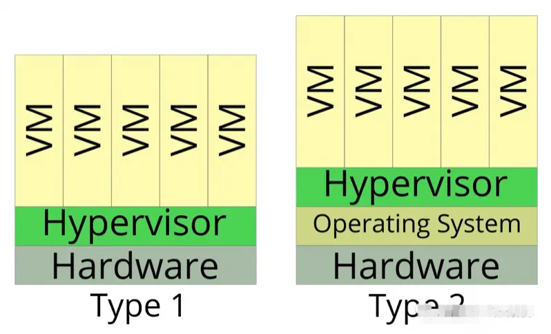
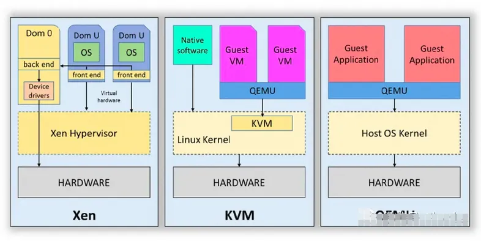
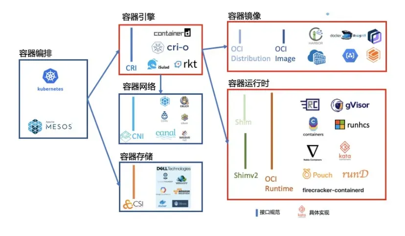
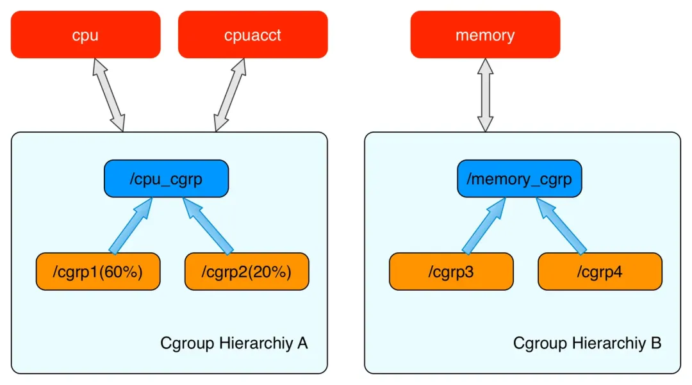
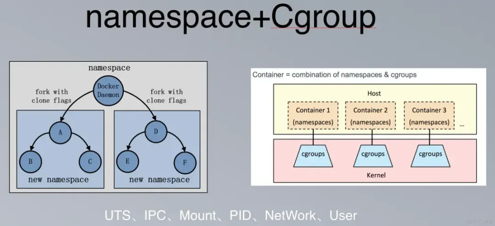
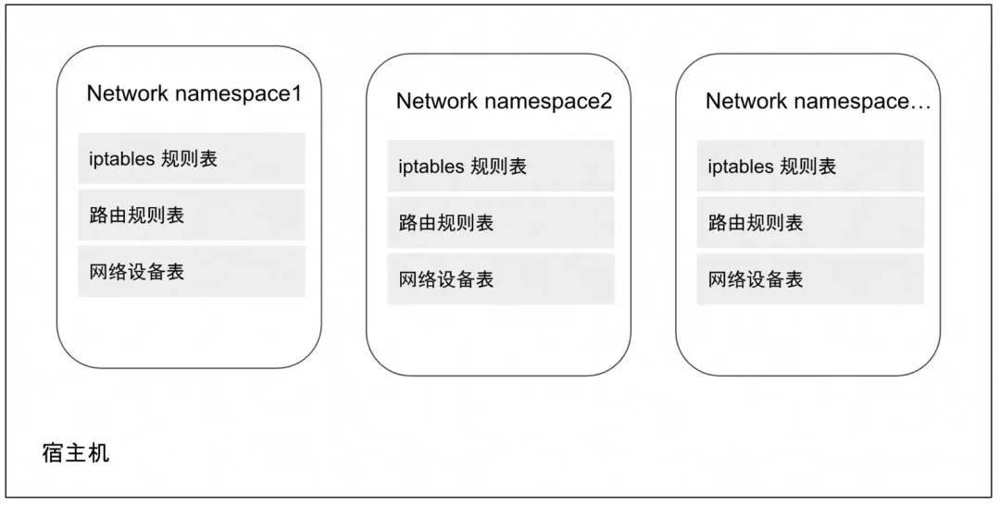
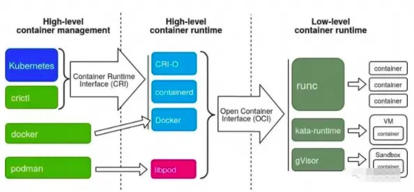
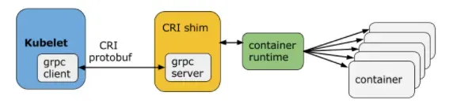
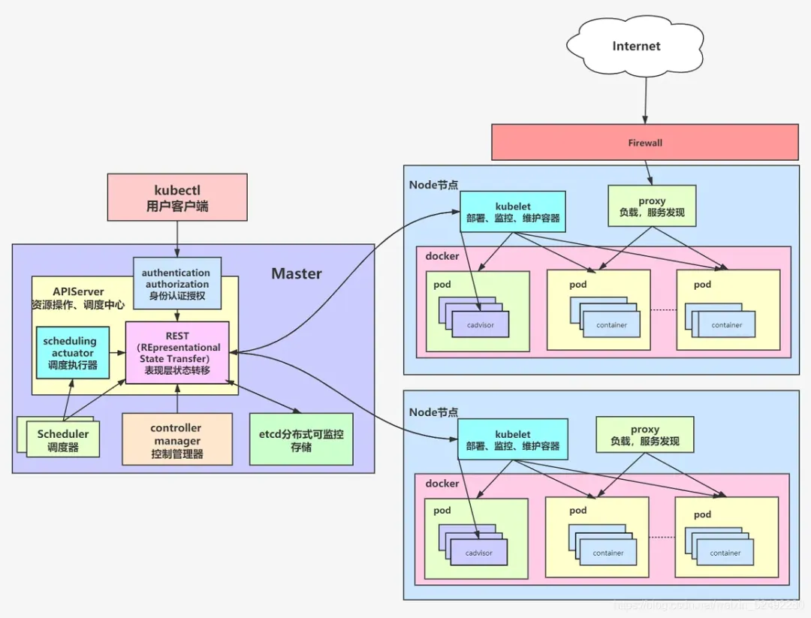

容器是一种虚拟化技术，用于封装应用程序及其所有依赖项和配置，以便能够在不同的计算机环境中运行。软件容器提供了一种轻量级、一致性的运行环境，使得应用程序在开发、测试和部署时更加可移植和可靠。

容器的特点： 

1. 跨平台性： 容器可以在不同的操作系统和云平台上运行，确保应用程序在各种环境中的一致性。这种跨平台性使得应用程序更易于移植和部署。

2. 一致性和可重复性： 容器封装了应用程序及其所有依赖项和配置，确保了开发、测试和生产环境的一致性。通过使用容器，可以避免由于环境差异而引起的问题，实现可重复的构建和部署过程。

3. 资源隔离： 容器提供了一定程度的隔离，使得多个容器可以在同一主机上并行运行而互不干扰。这种隔离性能够确保应用程序的稳定性和安全性。

4. 快速部署和启动： 容器可以在几秒钟内启动，相比于传统的虚拟机来说，启动时间更短。这使得应用程序的部署和扩展更加迅速和灵活。

5. 高可伸缩性： 容器架构支持自动化的横向扩展，可以根据需求动态地增加或减少容器实例。这种高可伸缩性使得应用程序能够更好地应对流量和负载的变化。

6. 环境隔离： 容器提供了独立的运行环境，每个容器都有自己的文件系统、网络和进程空间。这种环境隔离有助于防止应用程序之间的相互影响，提高了系统的稳定性和安全性。

7. 资源效率： 容器共享主机操作系统的内核，相比虚拟机，容器更加轻量级，更加节省系统资源。

8. 持续集成和持续部署（CI/CD）： 容器与持续集成和持续部署工具集成紧密，使得开发团队能够更容易地实现自动化构建、测试和部署流程。

## 虚拟化

**类型一：（裸机型）（硬件虚拟化）**

直接运行在物理硬件上，没有底层操作系统。这种类型通常用于企业级虚拟化平台，例如VMware ESXi和Microsoft Hyper-V。

硬件虚拟化是一种将物理计算资源抽象和分隔，以创建多个独立的虚拟环境的技术。这种虚拟化的目标是在同一物理硬件上运行多个操作系统和应用程序，从而更有效地利用硬件资源。硬件虚拟化通常涉及使用称为虚拟机（VM）的软件层将物理硬件分隔成多个虚拟环境。

**类型二（主机型）（软件虚拟化）**

运行在操作系统之上，类似于其他应用程序。这种类型通常用于开发和测试环境，例如Oracle VirtualBox和VMware Workstation。

特点：

1. 基于操作系统运行：Type 2 Hypervisor 作为软件应用程序安装在宿主操作系统中。宿主操作系统管理硬件资源并为监控程序和其虚拟机提供服务。

2. 性能开销：由于 Type 2 Hypervisor 在宿主操作系统内运行，虚拟机与物理硬件之间存在额外的层。这可能导致性能开销，与直接在硬件上运行的 Type 1 Hypervisor 相比开销更大。

3. 易用性和安装方便：Type 2 Hypervisor 通常比 Type 1 Hypervisor 更易安装和配置。用户可以像在标准操作系统上安装常规软件应用程序一样安装它们。

4. 用途：Type 2 Hypervisor 通常用于开发、测试和桌面虚拟化场景。它们为用户提供了一种方便的方式，在单台机器上运行多个操作系统，而无需专用硬件或复杂的配置。

5. 隔离：Type 2 Hypervisor 创建的每个虚拟机都与其他虚拟机以及主机系统隔离。这使用户能够在受控环境中尝试不同的操作系统、配置和应用程序。

两种类型：

三种实现方案：

当前容器主要还是以k8s为主导的生态：

## 容器技术

**cgroup资源控制器**：

Control Groups（cgroups）是 Linux 内核的一个功能，用于限制、账户和隔离进程组（包括它们的任务和资源）。cgroups提供了对系统资源（如CPU、内存、磁盘 I/O等）的精细控制，允许系统管理员将资源分配和限制应用到一组进程上，是google在2007年提出的，在2008年的时候合并到2.6的linux内核中。

主要有以下使用场景：

1.资源限制和配额

2.进程隔离

3.资源统计和监控

4.优先级控制

5.动态资源管理

cgroup是由一个个的子系统构成的，比如cpu，memory等。

每一个层级结构中是一颗树形结构，树的每一个节点是一个cgroup结构体（比如cpu_cgrp, memory_cgrp)。第一个cgroups层级结构attach了cpu子系统和cpuacct子系统， 当前cgroups层级结构中的cgroup结构体就可以对cpu的资源进行限制，并且对进程的cpu使用情况进行统计。第二个cgroups层级结构attach了memory子系统，当前cgroups层级结构中的cgroup结构体就可以对memory的资源进行限制。

**namespace**：

Linux 的命名空间（namespace）提供了一种内核级别隔离系统资源的方法，通过将系统的全局资源放在不同的命名空间中以实现资源隔离的目的。

| 类型    | 描述                                                         |
| ------- | ------------------------------------------------------------ |
| Cgroup  | Cgroup root directory cgroup 根目录                          |
| IPC     | System V IPC, POSIX message queues 信号量，消息队列          |
| Network | Network devices, stacks, ports, etc.网络设备，协议栈，端口等等 |
| Mount   | Mount points 挂载点                                          |
| PID     | Process IDs 进程号                                           |
| User    | 用户和组 ID                                                  |
| UTS     | 系统主机名和 NIS(Network Information Service) 主机名（有时称为域名） |
| Time    | 时钟                                                         |

**网络虚拟化**：

虚拟化容器是以 Linux 名称（namespace）空间的隔离性为基础来实现的，那解决隔离的容器之间、容器与宿主机之间、乃至跨物理网络的不同容器间通信问题的责任，很自然也落在了 Linux 网络虚拟化技术的肩上。

Linux 网络虚拟化的主要技术是 Network Namespace，以及各类虚拟设备，例如 Veth、Linux Bridge、tap/tun 等，虚拟化的本质是现实世界的映射，这些虚拟设备像现实世界中的物理设备一样彼此协作，将各个独立的 namespace 连接起来，构建出不受物理环境局限的各类网络拓扑架构。

veth：Virtual Ethernet，虚拟以太网设备，用来让两个隔离的Network Namespace可以互相通信，都是成对出现也叫veth-pair。



Linux bridge，在主机层面，如果需要多个主机之间需要网络联通，那么我们需要一个交换机（二层设备），在linux的虚拟网络系统中，我们可以通过虚拟网桥来实现此功能Linux Bridge是Linux kernel 2.2版本开始提供的二层转发工具，与物理交换机机制一致，能够接入任何二层的网络设备（无论是真实的物理设备，例如eth0或者虚拟设备，例如veth、tap 等）。不过Linux Bridge与普通物理交换机还有有一点不同，普通的交换机只会单纯地做二层转发，Linux Bridge却还能把发给它的数据包再发送到主机的三层协议栈中。



tun/tap：tun和tap是Linux提供的两个相对独立的虚拟网络设备，其中tap模拟了网络层设备，工作在L3，操作IP报文，tun则模拟了以太网设备，工作在L2，操作的是数据帧。当前云网络的基础协议VxLan就是基于隧道技术实现的，比如云网络的基础SDN（Software Definded Network，软件定义网络）。

## docker

经过docker的拆分和发展，我们可以将容器运行时根据功能做拆分：

1. 只关注如namespace、cgroups、镜像拆包等基础的容器运行时实现被称为低层运行时（low-level container runtime）， 目前应用最广泛的低层运行时是runc和kata（run-v）。

2. 支持更多高级功能，例如镜像管理、CRI实现的运行时被称为高层运行时（high-level container runtime），目前应用最广泛高层运行时是containerd和cri-o。

**CRI标准**：

Kubernetes从1.5版本开始，在遵循OCI基础上，将容器操作抽象为一个接口，该接口作为Kubelet 与运行时实现对接的桥梁，Kubelet通过发送接口请求对容器进行启动和管理，各个容器运行时只要实现这个接口就可以接入Kubernetes，这便是CRI（Container Runtime Interface，容器运行时接口）。

CRI实现上是一套通过Protocol Buffer定义的API，如下图：

CRI主要有gRPC client、gRPC Server和具体容器运行时实现三个组件。其中Kubelet作为gRPC Client调用CRI接口，CRI shim作为gRPC Server 来响应CRI请求，并负责将CRI请求内容转换为具体的运行时管理操作。因此，任何容器运行时实现想要接入Kubernetes，都需要实现一个基于CRI接口规范的CRI shim（gRPC Server）。

**containerd**

containerd主要负责工作包括：

- 容器生命周期管理，通过和底层操作系统和硬件交互，负责容器的创建、启动、停止、删除等生命周期管理；
- 镜像管理，管理容器镜像的下载、存储和加载；
- 容器网络，提供了一些接口，允许网络插件通过CNI（Container Networking Interface）与容器交互，实现容器的网络连接和配置；
- 安全和隔离，支持对容器的安全性和隔离进行管理。它通过集成Linux命名空间、cgroups等技术，确保容器在运行时与其他容器和主机系统隔离；
- OCI标准支持，对遵循 Open Container Initiative（OCI） 标准，这意味着它与符合 OCI 规范的容器和镜像兼容。这种标准化使得 containerd 能够与其他符合同一规范的工具和平台集成；
- 插件系统，提供了一个插件系统，允许用户根据需要扩展其功能。这意味着用户可以选择使用特定的存储后端、日志记录器等插件，以满足其特定的需求。

**OCI开放容器标准**

OCI 有了三个主要的规范标准：

- runtime-spec（容器运行时标准）：定义了容器运行的配置，环境和生命周期。即如何运行一个容器，如何管理容器的状态和生命周期，如何使用操作系统的底层特性（namespace，cgroup，pivot_root 等）；
- image-spec（容器镜像标准）：定义了镜像的格式，配置（包括应用程序的参数，环境信息等），依赖的元数据格式等，简单来说就是对镜像的静态描述；
- distribution-spec（镜像分发标准）：即规定了镜像上传和下载的网络交互过程。

根据OCI标准，当前流行的RUNC解决方案有以下三种：

- opencontainers/runc：前面已经提到过很多次了，是OCI Runtime的参考实现。
- kata-containers/runtime：容器标准反攻虚拟机，前身是clearcontainers/runtime与hyperhq/runv，通过virtcontainers提供高性能OCI标准兼容的硬件虚拟化容器，Linux Only，且需要特定硬件。
- google/gvisor：gVisor是一个Go实现的用户态内核，包含了一个OCI兼容的Runtime实现，目标是提供一个可运行非受信代码的容器运行时沙盒，目前是Linux Only，其他架构可能会支持。

