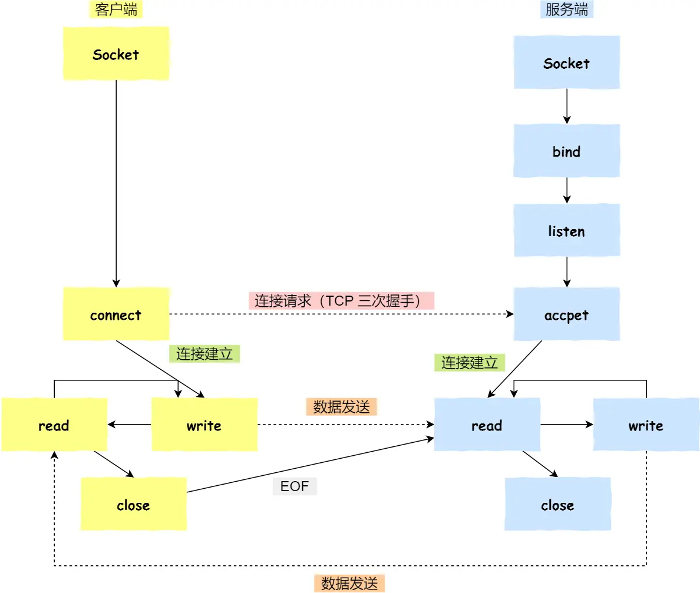
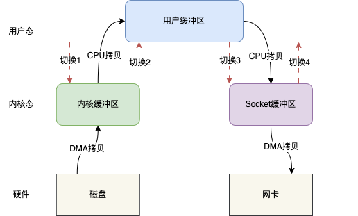

## 进程管理

### 进程通信

#### 管道

**匿名管道**：

```SH
ps auxf | grep mysql
```

将前一个命令（`ps auxf`）的输出，作为后一个命令（`grep mysql`）的输入，从这功能描述，可以看出**管道传输数据是单向的**。「`|`」表示的管道称为**匿名管道**，用完了就销毁。


**命名管道**：

也被叫做 `FIFO`，因为数据是先进先出的传输方式。在使用命名管道前，先需要通过 `mkfifo` 命令来创建，并且指定管道名字：

```sh
mkfifo myPipe
echo "hello" > myPipe  // 将数据写进管道
cat < myPipe  // 读取管道里的数据
```


**管道这种通信方式效率低，不适合进程间频繁地交换数据**。当然，它的好处，自然就是简单，同时也我们很容易得知管道里的数据已经被另一个进程读取了。

其实，**所谓的管道，就是内核里面的一串缓存**。从管道的一段写入的数据，实际上是缓存在内核中的，另一端读取，也就是从内核中读取这段数据。


我们可以得知，**对于匿名管道，它的通信范围是存在父子关系的进程**。因为管道没有实体，也就是没有管道文件，只能通过 fork 来复制父进程 fd 文件描述符，来达到通信的目的。

另外，**对于命名管道，它可以在不相关的进程间也能相互通信**。因为命令管道，提前创建了一个类型为管道的设备文件，在进程里只要使用这个设备文件，就可以相互通信。


#### 消息队列

#### 共享内存

#### 信号量

**信号量其实是一个整型的计数器，主要用于实现进程间的互斥与同步，而不是用于缓存进程间通信的数据**。

信号量表示资源的数量，控制信号量的方式有两种原子操作：P、V操作

#### 信号

上面说的进程间通信，都是常规状态下的工作模式。**对于异常情况下的工作模式，就需要用「信号」的方式来通知进程。**

例如

- Ctrl+C 产生 `SIGINT` 信号，表示终止该进程；
- Ctrl+Z 产生 `SIGTSTP` 信号，表示停止该进程，但还未结束；

#### Socket

**跨网络与不同主机上的进程之间通信**



- 服务端和客户端初始化 `socket`，得到文件描述符；
- 服务端调用 `bind`，将绑定在 IP 地址和端口;
- 服务端调用 `listen`，进行监听；
- 服务端调用 `accept`，等待客户端连接；
- 客户端调用 `connect`，向服务器端的地址和端口发起连接请求；
- 服务端 `accept` 返回用于传输的 `socket` 的文件描述符；
- 客户端调用 `write` 写入数据；服务端调用 `read` 读取数据；
- 客户端断开连接时，会调用 `close`，那么服务端 `read` 读取数据的时候，就会读取到了 `EOF`，待处理完数据后，服务端调用 `close`，表示连接关闭。

## 调度机制

### 进程调度

**先来先服务调度算法**

**最短作业优先调度算法**

**高响应比优先调度算法**

**时间片轮转调度算法**

**最高优先级调度算法**

**多级反馈队列调度算法**

### 页面置换

**最佳页面置换算法**：置换在「未来」最长时间不访问的页面。

**先进先出置换算法**

**最近最久未使用置换算法**：LRU

**时钟页面置换算法**：把所有的页面都保存在一个类似钟面的「环形链表」中，一个表针指向最老的页面。当发生缺页中断时，算法首先检查表针指向的页面：如果它的访问位位是 0 就淘汰该页面，并把新的页面插入这个位置，然后把表针前移一个位置；如果访问位是 1 就清除访问位，并把表针前移一个位置，重复这个过程直到找到了一个访问位为 0 的页面为止；

**最不常用置换算法**：LFU

### 磁盘调度

**先来先服务算法**

**最短寻道时间优先算法**：优先选择从当前磁头位置所需寻道时间最短的请求

**扫描算法**：磁头在一个方向上移动，访问所有未完成的请求，直到磁头到达该方向上的最后的磁道，才调换方向

**循环扫描算法**：只有磁头朝某个特定方向移动时，才处理磁道访问请求，而返回时直接快速移动至最靠边缘的磁道，也就是复位磁头，这个过程是很快的，并且返回中途不处理任何请求。

**LOOK 与 C-LOOK 算法**：优化扫描算法和循环扫描算法，磁头在移动到「最远的请求」位置，然后立即反向移动，不用「最始端或最末端」才开始调换方向。


## 文件系统

Linux 文件系统会为每个文件分配两个数据结构：**索引节点（index node）和目录项（directory entry）**，它们主要用来记录文件的元信息和目录层次结构。

- 索引节点，也就是 *inode*，用来记录文件的元信息，比如 inode 编号、文件大小、访问权限、创建时间、修改时间、**数据在磁盘的位置**等等。索引节点是文件的**唯一**标识，它们之间一一对应，也同样都会被存储在硬盘中，所以**索引节点同样占用磁盘空间**。
- 目录项，也就是 *dentry*，用来记录文件的名字、**索引节点指针**以及与其他目录项的层级关联关系。多个目录项关联起来，就会形成目录结构，但它与索引节点不同的是，**目录项是由内核维护的一个数据结构，不存放于磁盘，而是缓存在内存**。

由于索引节点唯一标识一个文件，而目录项记录着文件的名，所以目录项和索引节点的关系是多对一，也就是说，一个文件可以有多个别字。比如，硬链接的实现就是多个目录项中的索引节点指向同一个文件。


### 硬链接和软链接

硬链接是**多个目录项中的「索引节点」指向一个文件**，也就是指向同一个 inode，但是 inode 是不可能跨越文件系统的，每个文件系统都有各自的 inode 数据结构和列表，所以**硬链接是不可用于跨文件系统的**。由于多个目录项都是指向一个 inode，那么**只有删除文件的所有硬链接以及源文件时，系统才会彻底删除该文件。**


软链接相当于重新创建一个文件，这个文件有**独立的 inode**，但是这个**文件的内容是另外一个文件的路径**，所以访问软链接的时候，实际上相当于访问到了另外一个文件，所以**软链接是可以跨文件系统的**，甚至**目标文件被删除了，链接文件还是在的，只不过指向的文件找不到了而已。**


### 文件I/O

文件的读写方式各有千秋，对于文件的 I/O 分类也非常多，常见的有

- 缓冲与非缓冲 I/O
- 直接与非直接 I/O
- 阻塞与非阻塞 I/O VS 同步与异步 I/O


同步：线程自己去获取结果（一个线程）

异步：线程自己不去获取结果，而是由其它线程送结果（至少两个线程）


**阻塞 I/O**，当用户程序执行 `read` ，线程会被阻塞，一直等到内核数据准备好，并把数据从内核缓冲区拷贝到应用程序的缓冲区中，当拷贝过程完成，`read` 才会返回。


**非阻塞 I/O**，非阻塞的 read 请求在数据未准备好的情况下立即返回，可以继续往下执行，此时应用程序不断轮询内核，直到数据准备好，内核将数据拷贝到应用程序缓冲区，`read` 调用才可以获取到结果。


**I/O多路复用**，监听多个事件。当一个事件发生时返回，不会像非阻塞 IO 一样频繁反复调用。


实际上，无论是阻塞 I/O、非阻塞 I/O，还是基于非阻塞 I/O 的多路复用**都是同步调用。因为它们在 read 调用时，内核将数据从内核空间拷贝到应用程序空间，过程都是需要等待的，也就是说这个过程是同步的，如果内核实现的拷贝效率不高，read 调用就会在这个同步过程中等待比较长的时间。**


**异步I/O**，当我们发起 `aio_read` 之后，就立即返回，内核自动将数据从内核空间拷贝到应用程序空间，这个拷贝过程同样是异步的，内核自动完成的，和前面的同步操作不一样，应用程序并不需要主动发起拷贝动作。


## 网络系统

### 零拷贝技术



传统的 IO 读写其实就是 read + write 的操作，整个过程会分为如下几步：

1. 用户调用 read()方法，开始读取数据，此时发生一次上下文从用户态到内核态的切换，也就是图示的切换 1

2. 将磁盘数据通过 DMA 拷贝到内核缓存区

3. 将内核缓存区的数据拷贝到用户缓冲区，这样用户，也就是我们写的代码就能拿到文件的数据

4. read()方法返回，此时就会从内核态切换到用户态，也就是图示的切换 2

5. 当我们拿到数据之后，就可以调用 write()方法，此时上下文会从用户态切换到内核态，即图示切换 3

6. CPU 将用户缓冲区的数据拷贝到 Socket 缓冲区

7. 将 Socket 缓冲区数据拷贝至网卡

8. write()方法返回，上下文重新从内核态切换到用户态，即图示切换 4

整个过程发生了 4 次上下文切换和 4 次数据的拷贝，这在高并发场景下肯定会严重影响读写性能故引入了零拷贝技术


零拷贝技术实现的方式通常有 2 种：

- mmap + write
- sendfile

#### mmap

mmap（memory map）是一种内存映射文件的方法，`mmap()` 系统调用函数会直接把内核缓冲区里的数据「**映射**」到用户空间，这样，操作系统内核与用户空间就不需要再进行任何的数据拷贝操作。


具体步骤：

1. 当用户发起 mmap 调用的时候会发生上下文切换 1，进行内存映射，然后数据被拷贝到内核缓冲区；
2. mmap 返回，发生上下文切换 2；
3. 随后用户调用 write，发生上下文切换 3，将内核缓冲区的数据拷贝到 Socket 缓冲区
4. write 返回，发生上下文切换 4。

发生 4 次上下文切换和 3 次 IO 拷贝操作


#### sendfile

sendfile()跟 mmap()一样，也会减少一次 CPU 拷贝，但是它同时也会减少两次上下文切换。


具体步骤：

1. 用户在发起 sendfile()调用时会发生切换 1，之后数据通过 DMA 拷贝到内核缓冲区
2. 将内核缓冲区的数据拷贝到 Socket 缓冲区
3. 最后拷贝到网卡，sendfile()返回，发生切换 2。

发生了 2次上下文切换和3 次拷贝。


于是，从 Linux 内核 `2.4` 版本开始起，对于支持网卡支持 SG-DMA 技术的情况下， `sendfile()` 系统调用的过程发生了点变化，具体过程如下：

* 第一步，通过 DMA 将磁盘上的数据拷贝到内核缓冲区里；

* 第二步，缓冲区描述符和数据长度传到 socket 缓冲区，这样网卡的 SG-DMA 控制器就可以直接将内核缓存中的数据拷贝到网卡的缓冲区里，此过程不需要将数据从操作系统内核缓冲区拷贝到 socket 缓冲区中，这样就减少了一次数据拷贝；

只进行了 2 次数据拷贝


### I/O多路复用

select/poll/epoll 是如何获取网络事件的呢？在获取事件时，先把所有连接（文件描述符）传给内核，再由内核返回产生了事件的连接，然后在用户态中再处理这些连接对应的请求即可。

#### select

select 实现多路复用的方式是，将已连接的 Socket 都放到一个**文件描述符集合**，然后调用 select 函数将文件描述符集合**拷贝**到内核里，让内核来检查是否有网络事件产生，检查的方式很粗暴，就是通过**遍历**文件描述符集合的方式，当检查到有事件产生后，将此 Socket 标记为可读或可写， 接着再把整个文件描述符集合**拷贝**回用户态里，然后用户态还需要再通过**遍历**的方法找到可读或可写的 Socket，然后再对其处理。

所以，对于 select 这种方式，需要进行 **2 次「遍历」文件描述符集合**，一次是在内核态里，一个次是在用户态里 ，而且还会发生 **2 次「拷贝」文件描述符集合**，先从用户空间传入内核空间，由内核修改后，再传出到用户空间中。

select 使用固定长度的 BitsMap，表示文件描述符集合，而且所支持的文件描述符的个数是有限制的，在 Linux 系统中，由内核中的 FD_SETSIZE 限制， 默认最大值为 1024，只能监听 0~1023 的文件描述符。

#### poll

poll 不再用 BitsMap 来存储所关注的文件描述符，取而代之用动态数组，以链表形式来组织，突破了 select 的文件描述符个数限制，当然还会受到系统文件描述符限制。

但是 poll 和 select 并没有太大的本质区别，**都是使用「线性结构」存储进程关注的 Socket 集合，因此都需要遍历文件描述符集合来找到可读或可写的 Socket，时间复杂度为 O(n)，而且也需要在用户态与内核态之间拷贝文件描述符集合**，这种方式随着并发数上来，性能的损耗会呈指数级增长。

#### epoll

epoll 通过两个方面，很好解决了 select/poll 的问题。

- *第一点*，epoll 在内核里使用**红黑树来跟踪进程所有待检测的文件描述字**，把需要监控的 socket 通过 epoll_ctl() 函数加入内核中的红黑树里，红黑树是个高效的数据结构，增删改一般时间复杂度是 O(logn)。而 select/poll 内核里没有类似 epoll 红黑树这种保存所有待检测的 socket 的数据结构，所以 select/poll 每次操作时都传入整个 socket 集合给内核，而 epoll 因为在内核维护了红黑树，可以保存所有待检测的 socket ，所以只需要传入一个待检测的 socket，减少了内核和用户空间大量的数据拷贝和内存分配。
- *第二点*， epoll 使用**事件驱动**的机制，内核里**维护了一个链表来记录就绪事件**，当某个 socket 有事件发生时，通过**回调函数**内核会将其加入到这个就绪事件列表中，当用户调用 epoll_wait() 函数时，只会返回有事件发生的文件描述符的个数，不需要像 select/poll 那样轮询扫描整个 socket 集合，大大提高了检测的效率。


epoll 支持两种事件触发模式，分别是**边缘触发（edge-triggered，ET）和水平触发（level-triggered，LT）**。

* 使用边缘触发模式时，当被监控的 Socket 描述符上有可读事件发生时，**服务器端只会从 epoll_wait 中苏醒一次**，即使进程没有调用 read 函数从内核读取数据，也依然只苏醒一次，因此我们程序要保证一次性将内核缓冲区的数据读取完；

* 使用水平触发模式时，当被监控的 Socket 上有可读事件发生时，服务器端不断地从 epoll_wait 中苏醒，直到内核缓冲区数据被 read 函数读完才结束
