## 内存管理

### 虚拟内存

作用：

1. **提供了一种无限大的内存空间的假象**。进程可访问的虚拟地址空间大小只受限于寻址空间，不受真实物理内存大小的限制。当用量超出物理内存时，操作系统把暂时不用的页面换出到磁盘.
2. **隔离与保护**。每个进程都有独立的虚拟地址空间，相互隔离，互不干扰。
3. 方便程序员写代码优化代码，无需关注真正的物理内存，只需要关心逻辑地址


内存分配的过程：

应用程序通过 malloc 函数申请内存的时候，实际上申请的是虚拟内存，此时并不会分配物理内存。

当应用程序读写了这块虚拟内存，CPU 就会去访问这个虚拟内存， 这时会发现这个虚拟内存没有映射到物理内存， CPU 就会产生**缺页中断**，进程会从用户态切换到内核态，并将缺页中断交给内核的 Page Fault Handler （缺页中断函数）处理。

缺页中断处理函数会看是否有空闲的物理内存，如果有，就直接分配物理内存，并建立虚拟内存与物理内存之间的映射关系。

如果没有空闲的物理内存，那么内核就会开始进行回收内存的工作，回收的方式主要是两种：直接内存回收和后台内存回收。

如果直接内存回收后，空闲的物理内存仍然无法满足此次物理内存的申请，那么内核就会**触发 OOM （Out of Memory）机制**。


### 页表

页表的主要作用是为地址空间的每个虚拟页面保存地址转换，从而知道每个页在物理内存中的位置。

页表是每个进程一个的数据结构。


## 进程管理

### PCB

**PCB 是进程存在的唯一标识**，这意味着一个进程的存在，必然会有一个 PCB，如果进程消失了，那么 PCB 也会随之消失。

> **PCB 具体包含什么信息呢？**

进程描述信息：

- 进程标识符：标识各个进程，每个进程都有一个并且唯一的标识符；
- 用户标识符：进程归属的用户，用户标识符主要为共享和保护服务；

进程控制和管理信息：

- 进程当前状态，如 new、ready、running、waiting 或 blocked 等；
- 进程优先级：进程抢占 CPU 时的优先级；

资源分配清单：

- 有关内存地址空间或虚拟地址空间的信息，所打开文件的列表和所使用的 I/O 设备信息。

CPU 相关信息：

- CPU 中各个寄存器的值，当进程被切换时，CPU 的状态信息都会被保存在相应的 PCB 中，以便进程重新执行时，能从断点处继续执行。


> **每个 PCB 是如何组织的呢？**

通常是通过**链表**的方式进行组织，把具有**相同状态的进程链在一起，组成各种队列**。比如：

- 将所有处于就绪状态的进程链在一起，称为**就绪队列**；
- 把所有因等待某事件而处于等待状态的进程链在一起就组成各种**阻塞队列**；
- 另外，对于运行队列在单核 CPU 系统中则只有一个运行指针了，因为单核 CPU 在某个时间，只能运行一个程序。

除了链接的组织方式，还有索引方式，它的工作原理：将同一状态的进程组织在一个索引表中，索引表项指向相应的 PCB，不同状态对应不同的索引表。

一般会选择链表，因为可能面临进程创建，销毁等调度导致进程状态发生变化，所以链表能够更加灵活的插入和删除。


> **进程的上下文切换到底是切换什么呢？**

进程是由内核管理和调度的，所以进程的切换只能发生在内核态。

所以，**进程的上下文切换不仅包含了虚拟内存、栈、全局变量等用户空间的资源，还包括了内核堆栈、寄存器等内核空间的资源。**

通常，会把交换的信息保存在进程的 PCB，当要运行另外一个进程的时候，我们需要从这个进程的 PCB 取出上下文，然后恢复到 CPU 中，这使得这个进程可以继续执行。


> **线程上下文切换的是什么？**

这还得看线程是不是属于同一个进程：

- 当两个线程不是属于同一个进程，则切换的过程就跟进程上下文切换一样；
- **当两个线程是属于同一个进程，因为虚拟内存是共享的，所以在切换时，虚拟内存这些资源就保持不动，只需要切换线程的私有数据、寄存器等不共享的数据**；

所以，线程的上下文切换相比进程，开销要小很多。


> **线程相比进程能减少开销，体现在**：

- 线程的创建时间比进程快，因为进程在创建的过程中，还需要资源管理信息，比如内存管理信息、文件管理信息，而线程在创建的过程中，不会涉及这些资源管理信息，而是共享它们；
- 线程的终止时间比进程快，因为线程释放的资源相比进程少很多；
- 同一个进程内的线程切换比进程切换快，因为线程具有相同的地址空间（虚拟内存共享），这意味着同一个进程的线程都具有同一个页表，那么在切换的时候不需要切换页表。而对于进程之间的切换，切换的时候要把页表给切换掉，而页表的切换过程开销是比较大的；
- 由于同一进程的各线程间共享内存和文件资源，那么在线程之间数据传递的时候，就不需要经过内核了，这就使得线程之间的数据交互效率更高了；


### 进程通信

#### 管道

本质是一个在内核中维护的**缓冲区**。这个缓冲区可以被看作一个特殊的文件，或者说一个**数据流**。

**管道这种通信方式效率低，不适合进程间频繁地交换数据**。当然，它的好处，自然就是**简单**。


**1、匿名管道**：

```SH
ps auxf | grep mysql
```

将前一个命令（`ps auxf`）的输出，作为后一个命令（`grep mysql`）的输入，从这功能描述，可以看出**管道传输数据是单向的**。「`|`」表示的管道称为**匿名管道**，用完了就销毁。


> 那管道如何创建呢，背后原理是什么？

匿名管道的创建，需要通过下面这个系统调用：

```
int pipe(int fd[2])
```

一个是管道的读取端文件描述符 `fd[0]`，另一个是管道的写入端描述符 `fd[1]`。注意，这个匿名管道是特殊的文件，只存在于内存，不存于文件系统中。


只能在具有亲缘关系的进程间（通常通过 `fork()` 继承）方便使用。

典型工作流程（父子进程通信）：

1. **父进程调用 `pipe(fd)`**： 创建了一个管道，并获得了两个文件描述符 `fd[0]` 和 `fd[1]`。
2. **父进程调用 `fork()`**： 创建一个子进程。子进程会**继承**父进程打开的文件描述符。因此，子进程也拥有了指向同一个管道的 `fd[0]` 和 `fd[1]`。
3. **确定通信方向**： 由于管道是单向的，父子进程需要约定好谁读谁写。


**2、命名管道**：

匿名管道的最大限制是只能用于亲缘进程。**命名管道** 通过一个存在于文件系统中的**特殊文件**（FIFO 文件）来突破这个限制。任何知道这个文件名的进程都可以通过它进行通信，无论它们之间是否有亲缘关系。

```sh
mkfifo myPipe
echo "hello" > myPipe  // 将数据写进管道
cat < myPipe  // 读取管道里的数据
```


#### 消息队列

**消息队列是保存在内核中的消息链表**，在发送数据时，会分成一个一个独立的数据单元，也就是消息体（数据块），消息体是用户自定义的数据类型，消息的发送方和接收方要约定好消息体的数据类型，所以每个消息体都是固定大小的存储块，不像管道是无格式的字节流数据。如果进程从消息队列中读取了消息体，内核就会把这个消息体删除。

缺点：

1. 通信不及时
2. 不适合比较大数据的传输
3. 消息队列的读取和写入的过程，都会有发生用户态与内核态之间的消息拷贝过程


#### 共享内存

**共享内存的机制，就是拿出一块虚拟地址空间来，映射到相同的物理内存中**。这样这个进程写入的东西，另外一个进程马上就能看到了，不需要用户态与内核态之间拷贝来拷贝去，传来传去，大大提高了进程间通信的速度。


#### 信号量

信号量其实是一个整型的计数器，主要用于实现进程间的互斥与同步，而不是用于缓存进程间通信的数据。

信号量表示资源的数量，控制信号量的方式有两种原子操作：P、V操作


#### 信号

信号是进程间通信机制中**唯一的异步通信机制**，信号可以在应用进程和内核之间直接交互，内核也可以利用信号来通知用户空间的进程发生了哪些系统事件，信号事件的来源主要有硬件来源（如键盘 Cltr+C ）和软件来源（如 kill 命令），一旦有信号发生，**进程有三种方式响应信号 1. 执行默认操作、2. 捕捉信号、3. 忽略信号**。有两个信号是应用进程无法捕捉和忽略的，即 `SIGKILL` 和 `SEGSTOP`，这是为了方便我们能在任何时候结束或停止某个进程。

可以通过 `kill -l` 命令，查看所有的信号

例如

- Ctrl+C 产生 `SIGINT` 信号，表示终止该进程；
- Ctrl+Z 产生 `SIGTSTP` 信号，表示停止该进程，但还未结束；


#### Socket

**跨网络与不同主机上的进程之间通信**

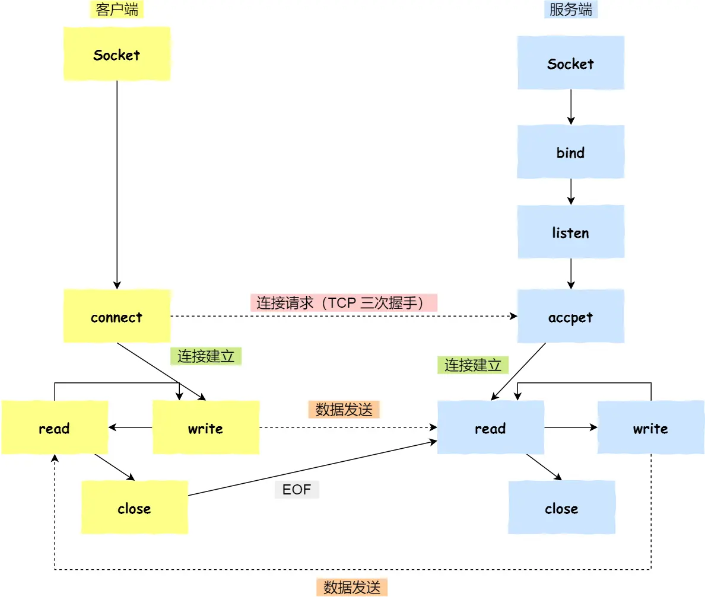

- 服务端和客户端初始化 `socket`，得到文件描述符；
- 服务端调用 `bind`，将绑定在 IP 地址和端口;
- 服务端调用 `listen`，进行监听；
- 服务端调用 `accept`，等待客户端连接；
- 客户端调用 `connect`，向服务器端的地址和端口发起连接请求；
- 服务端 `accept` 返回用于传输的 `socket` 的文件描述符；
- 客户端调用 `write` 写入数据；服务端调用 `read` 读取数据；
- 客户端断开连接时，会调用 `close`，那么服务端 `read` 读取数据的时候，就会读取到了 `EOF`，待处理完数据后，服务端调用 `close`，表示连接关闭。


> **一个进程可以创建多少线程-和什么有关？**

如果是32 位系统，用户态的虚拟空间只有 3G，如果创建线程时分配的栈空间是 10M，那么一个进程最多只能创建 300 个左右的线程。

如果是64 位系统，用户态的虚拟空间大到有 128T，理论上不会受虚拟内存大小的限制，而会受系统的参数或性能限制。


## 调度机制

### 进程调度

**先来先服务调度算法**

**最短作业优先调度算法**

**高响应比优先调度算法**

**时间片轮转调度算法**

**最高优先级调度算法**

**多级反馈队列调度算法**

### 页面置换

**最佳页面置换算法**：置换在「未来」最长时间不访问的页面。

**先进先出置换算法**

**最近最久未使用置换算法**：LRU

**时钟页面置换算法**：把所有的页面都保存在一个类似钟面的「环形链表」中，一个表针指向最老的页面。当发生缺页中断时，算法首先检查表针指向的页面：如果它的访问位位是 0 就淘汰该页面，并把新的页面插入这个位置，然后把表针前移一个位置；如果访问位是 1 就清除访问位，并把表针前移一个位置，重复这个过程直到找到了一个访问位为 0 的页面为止；

**最不常用置换算法**：LFU

### 磁盘调度

**先来先服务算法**

**最短寻道时间优先算法**：优先选择从当前磁头位置所需寻道时间最短的请求

**扫描算法**：磁头在一个方向上移动，访问所有未完成的请求，直到磁头到达该方向上的最后的磁道，才调换方向

**循环扫描算法**：只有磁头朝某个特定方向移动时，才处理磁道访问请求，而返回时直接快速移动至最靠边缘的磁道，也就是复位磁头，这个过程是很快的，并且返回中途不处理任何请求。

**LOOK 与 C-LOOK 算法**：优化扫描算法和循环扫描算法，磁头在移动到「最远的请求」位置，然后立即反向移动，不用「最始端或最末端」才开始调换方向。


## 文件系统

Linux 文件系统会为每个文件分配两个数据结构：**索引节点（index node）和目录项（directory entry）**，它们主要用来记录文件的元信息和目录层次结构。

- 索引节点，也就是 *inode*，用来记录文件的元信息，比如 inode 编号、文件大小、访问权限、创建时间、修改时间、**数据在磁盘的位置**等等。索引节点是文件的**唯一**标识，它们之间一一对应，也同样都会被存储在硬盘中，所以**索引节点同样占用磁盘空间**。
- 目录项，也就是 *dentry*，用来记录文件的名字、**索引节点指针**以及与其他目录项的层级关联关系。多个目录项关联起来，就会形成目录结构，但它与索引节点不同的是，**目录项是由内核维护的一个数据结构，不存放于磁盘，而是缓存在内存**。

> 目录项和目录是一个东西吗？
>
> 目录是个文件，持久化存储在磁盘，而目录项是内核一个数据结构，缓存在内存。

由于索引节点唯一标识一个文件，而目录项记录着文件的名，所以目录项和索引节点的关系是多对一，也就是说，一个文件可以有多个别字。比如，硬链接的实现就是多个目录项中的索引节点指向同一个文件。

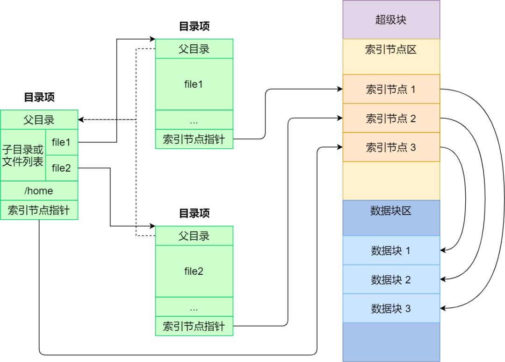


### 硬链接和软链接

有时候我们希望给某个文件取个别名，那么在Linux 中可以通过**硬链接（Hard Link）** 和**软链接（Symbolic Link）** 的方式来实现。

硬链接是**多个目录项中的「索引节点」指向一个文件**，也就是指向同一个 inode，但是 inode 是不可能跨越文件系统的，每个文件系统都有各自的 inode 数据结构和列表，所以**硬链接是不可用于跨文件系统的**。由于多个目录项都是指向一个 inode，那么**只有删除文件的所有硬链接以及源文件时，系统才会彻底删除该文件。**

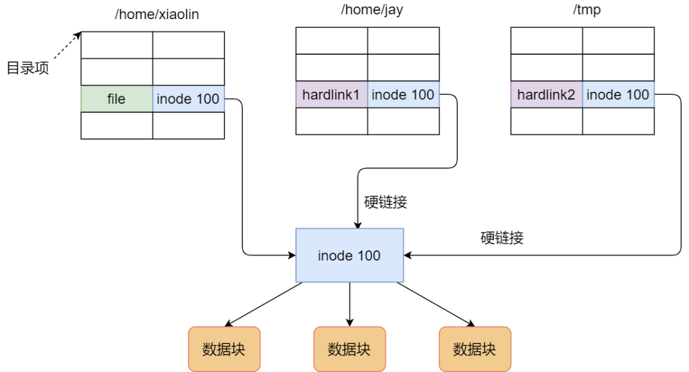

软链接相当于重新创建一个文件，这个文件有**独立的 inode**，但是这个**文件的内容是另外一个文件的路径**，所以访问软链接的时候，实际上相当于访问到了另外一个文件，所以**软链接是可以跨文件系统的**，甚至**目标文件被删除了，链接文件还是在的，只不过指向的文件找不到了而已。**

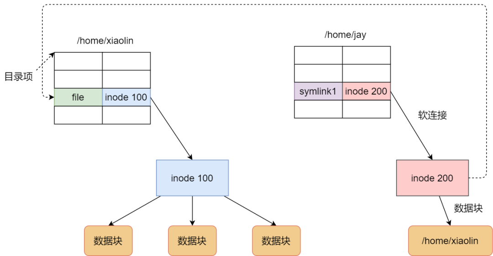


### 文件I/O

文件的读写方式各有千秋，对于文件的 I/O 分类也非常多，常见的有

- 缓冲与非缓冲 I/O
- 直接与非直接 I/O
- 阻塞与非阻塞 I/O VS 同步与异步 I/O


同步：线程自己去获取结果（一个线程）

异步：线程自己不去获取结果，而是由其它线程送结果（至少两个线程）


**阻塞 I/O**，当用户程序执行 `read` ，线程会被阻塞，一直等到内核数据准备好，并把数据从内核缓冲区拷贝到应用程序的缓冲区中，当拷贝过程完成，`read` 才会返回。

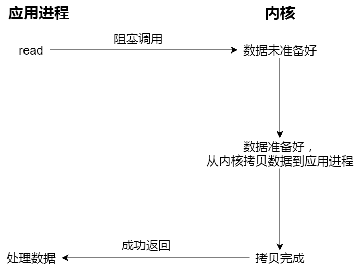

**非阻塞 I/O**，非阻塞的 read 请求在数据未准备好的情况下立即返回，可以继续往下执行，此时应用程序不断轮询内核，直到数据准备好，内核将数据拷贝到应用程序缓冲区，`read` 调用才可以获取到结果。

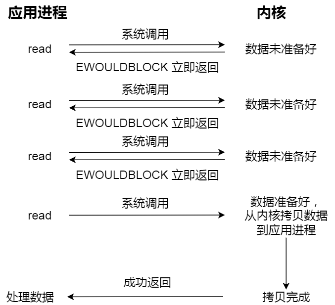

**I/O多路复用**，监听多个事件。当一个事件发生时返回，不会像非阻塞 IO 一样频繁反复调用。

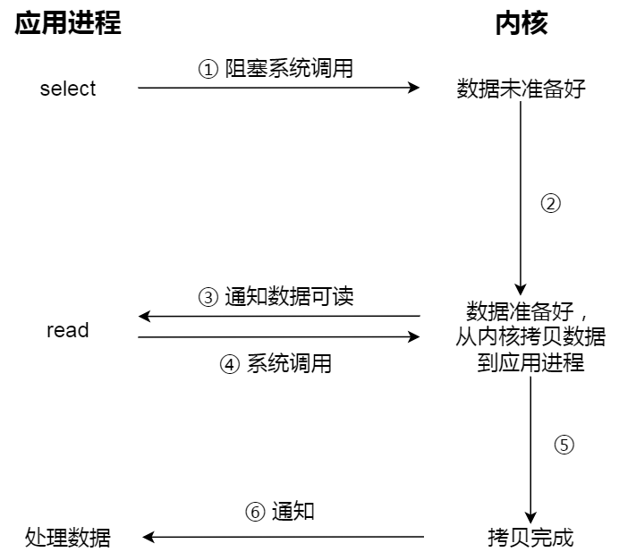

实际上，无论是阻塞 I/O、非阻塞 I/O，还是基于非阻塞 I/O 的多路复用**都是同步调用。因为它们在 read 调用时，内核将数据从内核空间拷贝到应用程序空间，过程都是需要等待的，也就是说这个过程是同步的，如果内核实现的拷贝效率不高，read 调用就会在这个同步过程中等待比较长的时间。**


**异步I/O**，当我们发起 `aio_read` 之后，就立即返回，内核自动将数据从内核空间拷贝到应用程序空间，这个拷贝过程同样是异步的，内核自动完成的，和前面的同步操作不一样，应用程序并不需要主动发起拷贝动作。

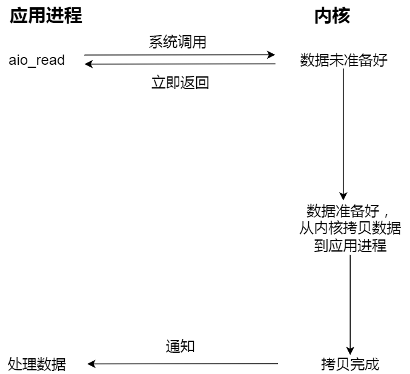

## 网络系统

### DMA

什么是 DMA 技术？简单理解就是，在进行 I/O 设备和内存的数据传输的时候，数据搬运的工作全部交给 DMA 控制器，而 CPU 不再参与任何与数据搬运相关的事情，这样 CPU 就可以去处理别的事务。

过程：

1. 用户进程调用 read 方法，向操作系统发出 I/O 请求，请求读取数据到自己的内存缓冲区中，进程进入阻塞状态；
2. 操作系统收到请求后，进一步将 I/O 请求发送 DMA，然后让 CPU 执行其他任务；
3. DMA 进一步将 I/O 请求发送给磁盘；
4. 磁盘收到 DMA 的 I/O 请求，把数据从磁盘读取到磁盘控制器的缓冲区中，当磁盘控制器的缓冲区被读满后，向 DMA 发起中断信号，告知自己缓冲区已满；
5. DMA 收到磁盘的信号，将磁盘控制器缓冲区中的数据拷贝到内核缓冲区中，此时不占用 CPU，CPU 可以执行其他任务
6. 当 DMA 读取了足够多的数据，就会发送中断信号给 CPU；
7. CPU 收到 DMA 的信号，知道数据已经准备好，于是将数据从内核拷贝到用户空间，系统调用返回；

### 零拷贝技术

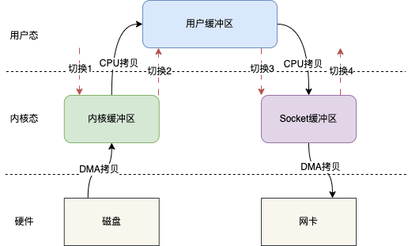

传统的 IO 读写其实就是 read + write 的操作，整个过程会分为如下几步：

1. 用户调用 read()方法，开始读取数据，此时发生一次上下文从用户态到内核态的切换，也就是图示的切换 1

2. 将磁盘数据通过 DMA 拷贝到内核缓存区

3. 将内核缓存区的数据拷贝到用户缓冲区，这样我们写的代码就能拿到文件的数据

4. read()方法返回，此时就会从内核态切换到用户态，也就是图示的切换 2

5. 当我们拿到数据之后，就可以调用 write()方法，此时上下文会从用户态切换到内核态，即图示切换 3

6. CPU 将用户缓冲区的数据拷贝到 Socket 缓冲区

7. 将 Socket 缓冲区数据拷贝至网卡

8. write()方法返回，上下文重新从内核态切换到用户态，即图示切换 4

整个过程发生了 4 次上下文切换和 4 次数据的拷贝，这在高并发场景下肯定会严重影响读写性能故引入了零拷贝技术


零拷贝技术实现的方式通常有 2 种：

- mmap + write
- sendfile

#### mmap

mmap（memory map）是一种内存映射文件的方法，`mmap()` 系统调用函数会直接把内核缓冲区里的数据「**映射**」到用户空间，这样，操作系统内核与用户空间就不需要再进行任何的数据拷贝操作。


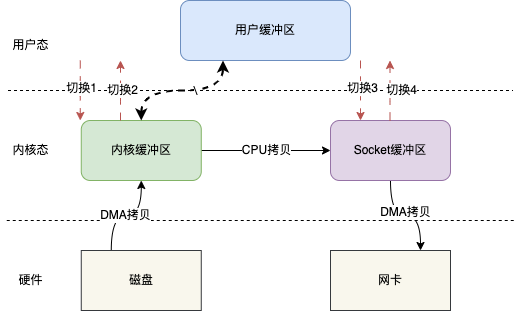


具体步骤：

1. 当用户发起 mmap 调用的时候会发生上下文切换 1，进行内存映射，然后数据被拷贝到内核缓冲区；应用进程跟操作系统内核「共享」这个缓冲区；
2. mmap 返回，发生上下文切换 2；
3. 随后用户调用 write，发生上下文切换 3，将内核缓冲区的数据拷贝到 Socket 缓冲区
4. write 返回，发生上下文切换 4。

发生 4 次上下文切换和 3 次 IO 拷贝操作


#### sendfile

可以替代前面的 `read()` 和 `write()` 这两个系统调用，这样就可以减少一次系统调用，也就减少了 2 次上下文切换的开销。

该系统调用，可以直接把内核缓冲区里的数据拷贝到 socket 缓冲区里，不再拷贝到用户态，这样就只有 2 次上下文切换，和 3 次数据拷贝。

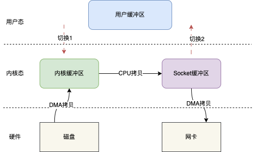

具体步骤：

1. 用户在发起 sendfile()调用时会发生切换 1，之后数据通过 DMA 拷贝到内核缓冲区
2. 将内核缓冲区的数据拷贝到 Socket 缓冲区
3. 最后拷贝到网卡，sendfile()返回，发生切换 2。

发生了 2次上下文切换和3 次拷贝。


于是，从 Linux 内核 `2.4` 版本开始起，对于支持网卡支持 SG-DMA 技术的情况下， `sendfile()` 系统调用的过程发生了点变化，具体过程如下：

* 第一步，通过 DMA 将磁盘上的数据拷贝到内核缓冲区里；

* 第二步，缓冲区描述符和数据长度传到 socket 缓冲区，这样网卡的 SG-DMA 控制器就可以直接将内核缓存中的数据拷贝到网卡的缓冲区里，此过程不需要将数据从操作系统内核缓冲区拷贝到 socket 缓冲区中，这样就减少了一次数据拷贝；

只进行了 2 次数据拷贝


### I/O多路复用

**多进程模型**

服务器的主进程负责监听客户的连接，一旦与客户端连接完成，accept() 函数就会返回一个「已连接 Socket」，这时就通过 `fork()` 函数创建一个子进程与客户端通信。

**多线程模型**

当服务器与客户端 TCP 完成连接后，通过 `pthread_create()` 函数创建线程，然后将「已连接 Socket」的文件描述符传递给线程函数，接着在线程里和客户端进行通信，从而达到并发处理的目的。


既然为每个请求分配一个进程/线程的方式不合适，那有没有可能只使用一个进程来维护多个 Socket 呢？ **I/O 多路复用**技术。

#### select

select 实现多路复用的方式是，将已连接的 Socket 都放到一个**文件描述符集合**，然后调用 select 函数将文件描述符集合**拷贝**到内核里，让内核来检查是否有网络事件产生，检查的方式很粗暴，就是通过**遍历**文件描述符集合的方式，当检查到有事件产生后，将此 Socket 标记为可读或可写， 接着再把整个文件描述符集合**拷贝**回用户态里，然后用户态还需要再通过**遍历**的方法找到可读或可写的 Socket，然后再对其处理。

所以，对于 select 这种方式，需要进行 **2 次「遍历」文件描述符集合**，一次是在内核态里，一个次是在用户态里 ，而且还会发生 **2 次「拷贝」文件描述符集合**，先从用户空间传入内核空间，由内核修改后，再传出到用户空间中。

select 使用固定长度的 BitsMap，表示文件描述符集合，而且所支持的文件描述符的个数是有限制的，在 Linux 系统中，由内核中的 FD_SETSIZE 限制， 默认最大值为 1024，只能监听 0~1023 的文件描述符。

#### poll

poll 不再用 BitsMap 来存储所关注的文件描述符，取而代之用动态数组，以链表形式来组织，突破了 select 的文件描述符个数限制，当然还会受到系统文件描述符限制。

但是 poll 和 select 并没有太大的本质区别，**都是使用「线性结构」存储进程关注的 Socket 集合，因此都需要遍历文件描述符集合来找到可读或可写的 Socket，时间复杂度为 O(n)，而且也需要在用户态与内核态之间拷贝文件描述符集合**，这种方式随着并发数上来，性能的损耗会呈指数级增长。

#### epoll

```c++
int s = socket(AF_INET, SOCK_STREAM, 0);
bind(s, ...);
listen(s, ...);
    
int epfd = epoll_create(...);
epoll_ctl(epfd, ...); //将所有需要监听的socket添加到epfd中

while(1) {
    int n = epoll_wait(...);
    for(接收到数据的socket){
        //处理
    }
}
```

epoll 通过两个方面，很好解决了 select/poll 的问题。

- *第一点*，epoll 在内核里使用**红黑树来跟踪进程所有待检测的文件描述字**，把需要监控的 socket 通过 epoll_ctl() 函数加入内核中的红黑树里，红黑树是个高效的数据结构，增删改一般时间复杂度是 O(logn)。

  而 select/poll 内核里没有类似 epoll 红黑树这种保存所有待检测的 socket 的数据结构，所以 select/poll 每次操作时都传入整个 socket 集合给内核，而 epoll 因为在内核维护了红黑树，可以保存所有待检测的 socket ，所以只需要传入一个待检测的 socket，减少了内核和用户空间大量的数据拷贝和内存分配。

- *第二点*， epoll 使用**事件驱动**的机制，内核里**维护了一个链表来记录就绪事件**，当某个 socket 有事件发生时，通过**回调函数**内核会将其加入到这个就绪事件列表中，当用户调用 epoll_wait() 函数时，只会返回有事件发生的文件描述符的个数，不需要像 select/poll 那样轮询扫描整个 socket 集合，大大提高了检测的效率。


epoll 支持两种事件触发模式，分别是**边缘触发（edge-triggered，ET）和水平触发（level-triggered，LT）**。

* 使用边缘触发模式时，当被监控的 Socket 描述符上有可读事件发生时，**服务器端只会从 epoll_wait 中苏醒一次**，即使进程没有调用 read 函数从内核读取数据，也依然只苏醒一次，因此我们程序要保证一次性将内核缓冲区的数据读取完；

* 使用水平触发模式时，当被监控的 Socket 上有可读事件发生时，服务器端不断地从 epoll_wait 中苏醒，直到内核缓冲区数据被 read 函数读完才结束


### Reactor

对 I/O 多路复用作了一层封装，让使用者不用考虑底层网络 API 的细节，只需要关注应用代码的编写。

Reactor 模式也叫 `Dispatcher` 模式，即 I/O 多路复用监听事件，收到事件后，根据事件类型分配（Dispatch）给某个进程 / 线程。


Reactor 模式主要由 Reactor 和处理资源池这两个核心部分组成，它俩负责的事情如下：

- Reactor 负责监听和分发事件，事件类型包含连接事件、读写事件；
- 处理资源池负责处理事件，如 read -> 业务逻辑 -> send；


#### **单 Reactor 单进程 / 线程**

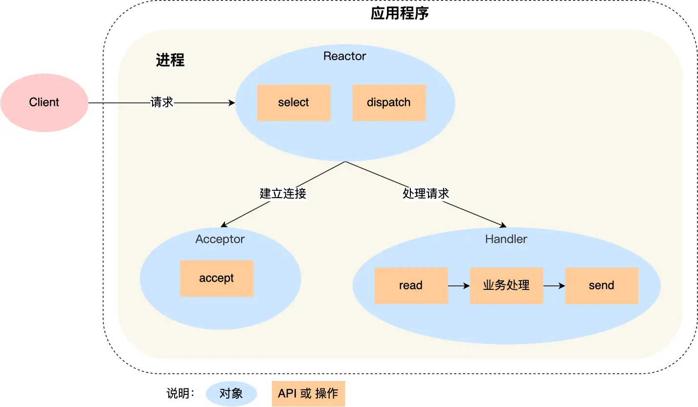

- Reactor 对象的作用是监听和分发事件；
- Acceptor 对象的作用是获取连接；
- Handler 对象的作用是处理业务；


Reactor 对象通过 select （IO 多路复用接口） 监听事件，收到事件后通过 dispatch 进行分发，具体分发给 Acceptor 对象还是 Handler 对象，还要看收到的事件类型；

如果是连接建立的事件，则交由 Acceptor 对象进行处理，Acceptor 对象会通过 accept 方法 获取连接，并创建一个 Handler 对象来处理后续的响应事件；

如果不是连接建立事件， 则交由当前连接对应的 Handler 对象来进行响应；

Handler 对象通过 read -> 业务处理 -> send 的流程来完成完整的业务流程。


优点是所有处理逻辑放在单线程中实现，没有上下文切换、线程竞争、进程通信等问题。缺点是在性能与可靠性方面存在比较严重的问题。

性能上，因为是单线程处理，无法充分利用 CPU 资源，并且业务逻辑Handler的处理是同步的，容易造成阻塞，出现性能瓶颈。可靠性主要是因为单Reactor是单线程的，如果出现异常不能处理请求，会导致整个系统通信模块不可用。

**所以单** **Reactor** **单进程模型不适用于计算密集型的场景，只适用于业务处理非常快速的场景**。


#### **单 Reactor 多线程 / 多进程**

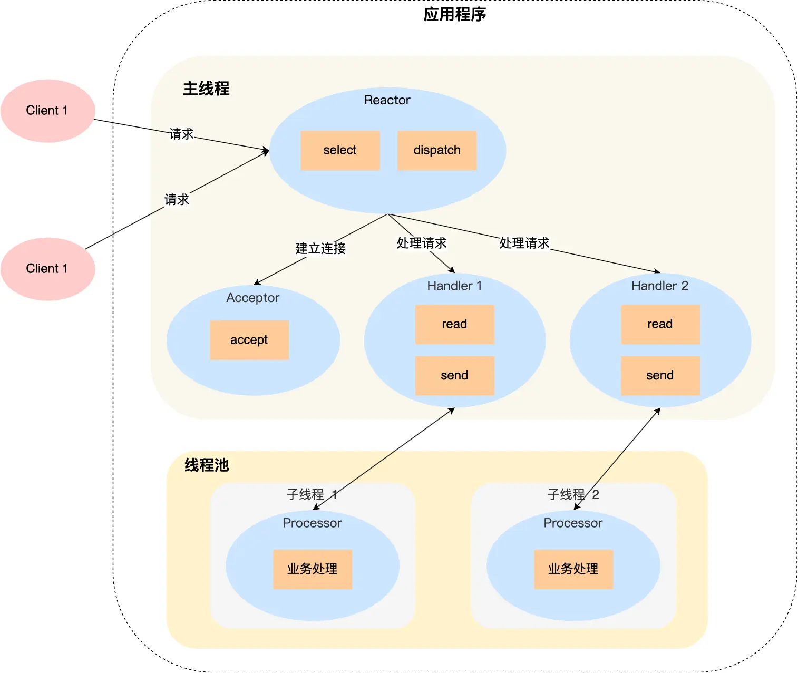

Reactor 对象通过 select （IO 多路复用接口） 监听事件，收到事件后通过 dispatch 进行分发，具体分发给 Acceptor 对象还是 Handler 对象，还要看收到的事件类型；

如果是连接建立的事件，则交由 Acceptor 对象进行处理，Acceptor 对象会通过 accept 方法 获取连接，并创建一个 Handler 对象来处理后续的响应事件；

如果不是连接建立事件， 则交由当前连接对应的 Handler 对象来进行响应；


和单 Reactor 单线程方案不一样的地方：

Handler 对象不再负责业务处理，只负责数据的接收和发送，Handler 对象通过 read 读取到数据后，会将数据发给子线程里的 Processor 对象进行业务处理；

子线程里的 Processor 对象就进行业务处理，处理完后，将结果发给主线程中的 Handler 对象，接着由 Handler 通过 send 方法将响应结果发送给 client；


优点是 Handler 收到响应后通过 send 把响应结果返回给客户端，降低 Reactor 的性能开销，提升整个应用的吞吐。而且 Handler 使用多线程模式，可以充分利用 CPU 的性能，提高了业务逻辑的处理速度。

缺点是 Handler 使用多线程模式，带来了多线程竞争资源的开销，同时涉及共享数据的互斥和保护机制，实现比较复杂。另外，单个 Reactor 承担所有事件的监听、分发和响应，对于高并发场景，容易造成性能瓶颈。


####  **多 Reactor 多进程 / 线程**

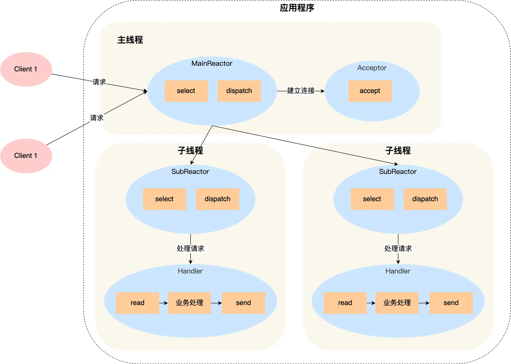

主线程中的 MainReactor 对象通过 select 监控连接建立事件，收到事件后通过 Acceptor 对象中的 accept  获取连接，将新的连接分配给某个子线程；

子线程中的 SubReactor 对象将 MainReactor 对象分配的连接加入 select 继续进行监听，并创建一个 Handler 用于处理连接的响应事件。

如果有新的事件发生时，SubReactor 对象会调用当前连接对应的 Handler 对象来进行响应。

Handler 对象通过 read -> 业务处理 -> send 的流程来完成完整的业务流程。


多 Reactor 多线程的方案虽然看起来复杂的，但是实际实现时比单 Reactor 多线程的方案要简单的多，原因如下：

主线程和子线程分工明确，主线程只负责接收新连接，子线程负责完成后续的业务处理。

主线程和子线程的交互很简单，主线程只需要把新连接传给子线程，子线程无须返回数据，直接就可以在子线程将处理结果发送给客户端。
