## 键入网址到网页显示，期间发生了什么？

浏览器输入**URL**并解析。浏览器只知道URL，但是不知道具体的IP，所以不知道应该如何访问。于是，使用**DNS**去解析域名，还可以使用另一种更加精准的**HTTPDNS**。

知道了目标IP地址，浏览器就开始打包它的请求。对于普通的浏览请求，往往会使用**HTTP**协议；但是对于需要进行加密传输，会使用**HTTPS**协议。DNS、HTTP、HTTPS 所在的层我们称为**应用层**。

经过应用层封装后，浏览器会将应用层的包交给**传输层**去完成，通过 socket 编程来实现。传输层有两种协议，一种是无连接的协议**UDP**，一种是面向连接的协议**TCP**。如果是TCP，则进行三次握手建立连接，如果使用HTTPS，还要进行 SSL/TLS 握手。

传输层封装完毕后，浏览器会将包交给操作系统的**网络层**。网络层的协议是 IP 协议。再封装源IP地址和目的IP地址，得到网络包。

如果目的IP和源IP地址不在同一个网段，则通过**网关**转发请求。而操作系统启动的时候，就会被 DHCP 协议配置 IP 地址，以及默认的网关的 IP 地址 。

操作系统通过**ARP**协议得到网关的**MAC**地址，于是操作系统将 IP 包交给了下一层，也就是**网际接口层**。网卡再将包发出去。由于这个包里面是有 MAC 地址的，因而它能够到达网关。

网关收到包之后，会根据自己的知识，判断下一步应该怎么走。网关往往是一个路由器，当路由器接收到数据包时，会根据数据包的目标地址查找路由表，找到合适的路径，将数据包转发到下一跳。

> **DNS 域名解析流程**

DNS的主要任务是进行主机名到IP地址的转换服务，DNS协议运行在**UDP**之上，使用53号端口。

主机向本地域名服务器的查询一般都是采用递归查询，本地域名服务器向根域名服务器的查询通常是采用迭代查询。

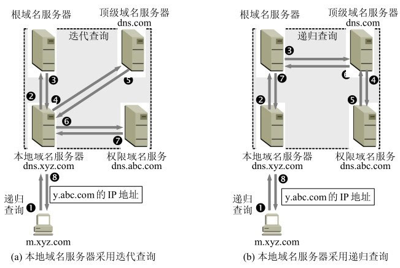

域名解析过程：

浏览器缓存 -> 操作系统缓存 -> 检查本机域名解析文件 `hosts` ->  DNS 服务器。DNS服务器查询的过程如下：

1. 主机m.xyz.com先向其**本地域名服务器**dns.xyz.com进行递归查询。
2. 本地域名服务器采用迭代查询。它先向一个**根域名服务器**查询。
3. 根域名服务器告诉本地域名服务器，下一次应查询的顶级域名服务器dns.com的IP地址。
4. 本地域名服务器向**顶级域名服务器**dns.com进行查询。
5. 顶级域名服务器dns.com告诉本地域名服务器，下一次应查询的权限域名服务器dns.abc.com的IP地址。
6. 本地域名服务器向**权限域名服务器**dns.abc.com进行查询。
7. 权限域名服务器dns.abc.com告诉本地域名服务器，所查询的主机的IP地址。
8. 本地域名服务器最后把查询结果告诉主机m.xyz.com。

## HTTP

### 状态码

- 1××：提示信息，表示目前是协议处理的中间状态，还需要后续的操作；
- 2××：成功，报文已经收到并被正确处理；
- 3××：重定向，资源位置发生变动，需要客户端重新发送请求；
- 4××：客户端错误，请求报文有误，服务器无法处理；
- 5××：服务器错误，服务器在处理请求时内部发生了错误。

#### 1××

1××类状态码属于提示信息，是协议处理的中间状态，实际能够用到的时候很少。

#### 2××

2××类状态码表示服务器收到并成功处理了客户端的请求，这也是客户端最愿意看到的状态码。

“**200 OK**”是最常见的成功状态码，表示一切正常，服务器如客户端所期望的那样返回了处理结果，如果是非 HEAD 请求，通常在响应头后都会有 body 数据。

“**204 No Content**”是另一个很常见的成功状态码，它的含义与“200 OK”基本相同，但响应头后没有 body 数据。所以对于 Web 服务器来说，正确地区分 200 和 204 是很必要的。

“**206 Partial Content**”是 HTTP 分块下载或断点续传的基础，在客户端发送“范围请求”、要求获取资源的部分数据时出现，它与 200 一样，也是服务器成功处理了请求，但 body 里的数据不是资源的全部，而是其中的一部分。

状态码 206 通常还会伴随着头字段“**Content-Range**”，表示响应报文里 body 数据的具体范围，供客户端确认，例如“Content-Range: bytes 0-99/2000”，意思是此次获取的是总计 2000 个字节的前 100 个字节。

#### 3××

3××类状态码表示客户端请求的资源发生了变动，客户端必须用新的 URI 重新发送请求获取资源，也就是通常所说的“重定向”，包括著名的 301、302 跳转。

“**301 Moved Permanently**”俗称“永久重定向”，含义是此次请求的资源已经不存在了，需要改用改用新的 URI 再次访问。

与它类似的是“**302 Found**”，曾经的描述短语是“**Moved Temporarily**”，俗称“临时重定向”，意思是请求的资源还在，但需要暂时用另一个 URI 来访问。

301 和 302 都会在响应头里使用字段**Location**指明后续要跳转的 URI，最终的效果很相似，浏览器都会重定向到新的 URI。两者的根本区别在于语义，一个是“永久”，一个是“临时”，所以在场景、用法上差距很大。

比如，你的网站升级到了 HTTPS，原来的 HTTP 不打算用了，这就是“永久”的，所以要配置 301 跳转，把所有的 HTTP 流量都切换到 HTTPS。

再比如，今天夜里网站后台要系统维护，服务暂时不可用，这就属于“临时”的，可以配置成 302 跳转，把流量临时切换到一个静态通知页面，浏览器看到这个 302 就知道这只是暂时的情况，不会做缓存优化，第二天还会访问原来的地址。

“**304 Not Modified**” 表示资源未修改，它不具有通常的跳转含义，但可以理解成“重定向到已缓存的文件”（即“缓存重定向”）。

#### 4××

4××类状态码表示客户端发送的请求报文有误，服务器无法处理，它就是真正的“错误码”含义了。

“**400 Bad Request**”是一个通用的错误码，表示请求报文有错误，但具体是数据格式错误、缺少请求头还是 URI 超长它没有明确说，只是一个笼统的错误。

“**403 Forbidden**”实际上不是客户端的请求出错，而是表示服务器禁止访问资源。原因可能多种多样，例如信息敏感、法律禁止等。

“**404 Not Found**”可能是我们最常看见也是最不愿意看到的一个状态码，它的原意是资源在本服务器上未找到，所以无法提供给客户端。

4××里剩下的一些代码较明确地说明了错误的原因，都很好理解，开发中常用的有：

- 405 Method Not Allowed：不允许使用某些方法操作资源，例如不允许 POST 只能 GET；
- 406 Not Acceptable：资源无法满足客户端请求的条件，例如请求中文但只有英文；
- 408 Request Timeout：请求超时，服务器等待了过长的时间；
- 409 Conflict：多个请求发生了冲突，可以理解为多线程并发时的竞态；
- 413 Request Entity Too Large：请求报文里的 body 太大；
- 414 Request-URI Too Long：请求行里的 URI 太大；
- 429 Too Many Requests：客户端发送了太多的请求，通常是由于服务器的限连策略；
- 431 Request Header Fields Too Large：请求头某个字段或总体太大；

#### 5××

5××类状态码表示客户端请求报文正确，但服务器在处理时内部发生了错误，无法返回应有的响应数据，是服务器端的“错误码”。

“**500 Internal Server Error**”与 400 类似，也是一个通用的错误码，服务器究竟发生了什么错误我们是不知道的。

“**501 Not Implemented**”表示客户端请求的功能还不支持，和“即将开业，敬请期待”的意思差不多。

“**502 Bad Gateway**”通常是服务器作为网关或者代理时返回的错误码，表示服务器自身工作正常，访问后端服务器时发生了错误。

“**503 Service Unavailable**”表示服务器当前很忙，暂时无法响应客户端，类似“网络服务正忙，请稍后重试”的意思。503 响应报文里通常还会有一个“**Retry-After**”字段，指示客户端可以在多久以后再次尝试发送请求。

### GET 和 POST

GET 的语义是从服务器获取指定的资源；POST 的语义是根据请求负荷（报文body）对指定的资源做出处理

> **GET 和 POST 方法都是安全和幂等的吗？**

「安全」是指请求方法不会「破坏」服务器上的资源。「幂等」，意思是多次执行相同的操作，结果都是「相同」的。

从语义看：

* GET 的语义是请求获取指定的资源。GET 方法是安全、幂等、可被缓存的。

* POST 的语义是根据请求负荷（报文主体）对指定的资源做出处理，具体的处理方式视资源类型而不同。POST 不安全，不幂等，（大部分实现）不可缓存。

实际过程中：

* 可以用 GET 方法实现新增或删除数据的请求，这样实现的 GET 方法自然就不是安全和幂等。
* 可以用 POST 方法实现查询数据的请求，这样实现的 POST 方法自然就是安全和幂等。

> **GET 请求可以带 body 吗？**

RFC 规范并没有规定 GET 请求不能带 body 的。理论上，任何请求都可以带 body 的。只是因为 RFC 规范定义的 GET 请求是获取资源，所以根据这个语义不需要用到 body。

另外，URL 中的查询参数也不是 GET 所独有的，POST 请求的 URL 中也可以有参数的。

### 特性

| 特性         | HTTP/1.0 | HTTP/1.1                                                     | HTTP/2.0                          | HTTP/3.0 |
| ------------ | -------- | ------------------------------------------------------------ | --------------------------------- | -------- |
| 传输层协议   | TCP      | TCP                                                          | TCP                               | UDP      |
| 连接         | 短连接   | 长连接，管道化                                               | 长连接，多路复用                  | QUIC     |
| 对头阻塞     | 存在     | 存在（管道虽然解决了请求的队头阻塞，但是没有解决响应的队头阻塞） | 部分解决（TCP层面仍存在对头阻塞） | 完全解决 |
| 传输格式     | 纯文本   | 纯文本                                                       | 二进制                            | 二进制   |
| 头部压缩     | 不支持   | 不支持                                                       | 支持                              | 支持     |
| 服务器推送   | 不支持   | 不支持                                                       | 支持                              | 支持     |
| 安全性       | 无       | HTTPS                                                        | HTTPS                             | TLS 1.3  |
| 连接建立速度 | 慢       | 慢                                                           | 慢                                | 快       |
| 多路复用     | 不支持   | 不支持                                                       | 支持                              | 支持     |

#### HTTP/1.0

Http 1.0 主要增加以下几点：

* 增加 HEAD、POST 等新方法
* 增加了响应状态码
* 引入了头部，即请求头和响应头
* 在请求中加入了HTTP版本号
* 引入Content-Type，使得传输的数据不再限于文本

#### HTTP/1.1

Http 1.1 主要增加以下几点：

* 新增了连接管理 keep-alive，允许持久连接
* 支持管道传输pipeline，无需等待前面的请求响应即可发送第二次请求
* 允许响应数据分块（chunked），即响应的时候不标明 Content-Length，客户端就无法断开连接，直到收到服务端的EOF，利于传输大文件。
* 新增缓存的控制和管理

但 HTTP/1.1 还是有性能瓶颈：

* 请求 / 响应头部（Header）未经压缩就发送，首部信息越多延迟越大。只能压缩 `Body` 的部分；

* 发送冗长的首部。每次互相发送相同的首部造成的浪费较多；

* 队头阻塞：管道虽然解决了请求的队头阻塞，但是没有解决响应的队头阻塞。服务器是按请求的顺序响应的，如果服务端处理某个请求消耗的时间比较长，那么只能等响应完这个请求后， 才能处理下一个请求，这属于 HTTP 层队头阻塞。
* 没有请求优先级控制；
* 请求只能从客户端开始，服务器只能被动响应。

HTTP/1.1 优点：

* 简单：HTTP 基本的报文格式就是 `header + body`，头部信息也是 `key-value` 简单文本的形式，易于理解。
* 灵活和易于扩展：HTTP 协议里的各类请求方法、URI/URL、状态码、头字段等每个组成要求都没有被固定死，都允许开发人员自定义和扩充。同时 HTTP 由于是工作在应用层（ `OSI` 第七层），则它下层可以随意变化。

缺点：

* 无状态：无状态的**好处**，因为服务器不会去记忆 HTTP 的状态，所以不需要额外的资源来记录状态信息，这能减轻服务器的负担，能够把更多的 CPU 和内存用来对外提供服务。无状态的**坏处**，既然服务器没有记忆能力，它在完成有关联性的操作时会非常麻烦。
* 明文传输。

#### HTTP/2

Http 2 主要增加以下几点：

* 是二进制协议，不再是纯文本
* 支持一个TCP连接发起多个请求，移除pipeline
* 头部压缩：同时发送多个请求并且头是一样或相似的，协议就会帮你消除重复部分。在客户端和服务器同时维护一张头信息表，所有字段都会存入这个表，生成一个索引号，以后就不发送同样字段了，只发送索引号，这样就提高速度了。
* 允许服务端主动推送数据
* 多路复用、并发传输：引出了 Stream 概念，多个 Stream 复用一条 TCP 连接，可以并行交错地发送请求和响应

HTTP/2 的缺陷：

* 还是存在队头阻塞问题，只不过问题不是在 HTTP 这一层面，而是在 TCP 这一层。HTTP/2 是基于 TCP 协议来传输数据的，TCP 是字节流协议，那么当「前 1 个字节数据」没有到达时，后收到的字节数据只能存放在内核缓冲区里，只有等到这 1 个字节数据到达时，HTTP/2 应用层才能从内核中拿到数据。
* TCP 和 TLS握手延迟：发起 HTTP 请求时，需要经过 TCP 三次握手和 TLS 四次握手，共需要 3 个 RTT 的时延才能发出请求数据。
* 网络迁移需要重连接：如果 IP 地址或者端口变动了，就会导致需要 TCP 与 TLS 重新握手，这不利于移动设备切换网络的场景。

#### HTTP/3

**HTTP/3 把 HTTP 下层的 TCP 协议改成了 UDP**。

UDP 发送是不管顺序，也不管丢包的，所以不会出现像 HTTP/2 队头阻塞的问题。UDP 是不可靠传输的，但基于 UDP 的 **QUIC 协议** 可以实现类似 TCP 的可靠性传输。

QUIC 有以下 3 个特点。

- 无队头阻塞：当某个流发生丢包时，只会阻塞这个流，其他流不会受到影响，因此不存在队头阻塞问题。而HTTP/2 只要某个流中的数据包丢失了，其他流也会在TCP层受影响。
- 更快的连接建立：对于 HTTP/1 和 HTTP/2 协议，TCP 和 TLS 是分层的，分别属于内核实现的传输层、openssl 库实现的表示层，因此它们难以合并在一起，需要分批次来握手，先 TCP 握手，再 TLS 握手。HTTP/3 在传输数据前虽然需要 QUIC 协议握手，但是这个握手过程只需要 1 RTT，握手的目的是为确认双方的「连接 ID」，连接迁移就是基于连接 ID 实现的。
- 连接迁移：QUIC 协议没有用四元组的方式来“绑定”连接，而是通过连接 ID 来标记通信的两个端点

### HTTPS

HTTP**S** 在 HTTP 与 TCP 层之间加入了 `SSL/TLS` 协议：

SSL 即安全套接层（Secure Sockets Layer），在 OSI 模型中处于第 5 层（会话层），1999 年把它改名为 TLS（传输层安全，Transport Layer Security）。

* **信息加密**：交互信息无法被窃取。**混合加密**的方式实现信息的机密性，解决了**窃听的风险**。

* **校验机制**：无法篡改通信内容，篡改了就不能正常显示。**摘要算法**的方式来实现完整性，它能够为数据生成独一无二的「指纹」，指纹用于校验数据的完整性，解决了**篡改的风险**。

* **身份证书**：无法冒充。将服务器公钥放入到**数字证书**中，解决了**冒充的风险**。

#### 1. 混合加密

HTTPS 采用的是**对称加密**和**非对称加密**结合的「混合加密」方式：

* 在通信建立前采用**非对称加密**的方式交换「会话秘钥」，后续就不再使用非对称加密。

* 在通信过程中全部使用**对称加密**的「会话秘钥」的方式加密明文数据。

采用「混合加密」的方式的原因：

- **对称加密**只使用一个密钥，运算速度快，密钥必须保密，无法做到安全的密钥交换。
- **非对称加密**使用两个密钥：公钥和私钥，公钥可以任意分发而私钥保密，解决了密钥交换问题但速度慢。

#### 2. 摘要算法+数字签名

为了保证传输的内容不被篡改，我们需要对内容计算出一个「指纹」，然后同内容一起传输给对方。

对方收到后，先是对内容也计算出一个「指纹」，然后跟发送方发送的「指纹」做一个比较，如果「指纹」相同，说明内容没有被篡改，否则就可以判断出内容被篡改了。

通过哈希算法可以确保内容不会被篡改，**但是并不能保证「内容 + 哈希值」不会被中间人替换**，**因为这里缺少对客户端收到的消息是否来源于服务端的证明**。

那为了避免这种情况，计算机里会用**非对称加密算法**来解决，共有两个密钥：

- 一个是公钥，这个是可以公开给所有人的；
- 一个是私钥，这个必须由本人管理，不可泄露。

这两个密钥可以**双向加解密**的，比如可以用公钥加密内容，然后用私钥解密，也可以用私钥加密内容，公钥解密内容。流程的不同，意味着目的也不相同：

* **公钥加密，私钥解密**。这个目的是为了**保证内容传输的安全**，因为被公钥加密的内容，其他人是无法解密的，只有持有私钥的人，才能解密出实际的内容；
* **私钥加密，公钥解密**。这个目的是为了**保证消息不会被冒充**，因为私钥是不可泄露的，如果公钥能正常解密出私钥加密的内容，就能证明这个消息是来源于持有私钥身份的人发送的。

一般我们不会用非对称加密来加密实际的传输内容，因为非对称加密的计算比较耗费性能的。

所以非对称加密的用途主要在于**通过「私钥加密，公钥解密」的方式，来确认消息的身份**，我们常说的**数字签名算法**，就是用的是这种方式，不过私钥加密内容不是内容本身，而是**对内容的哈希值加密**。

#### 3. 数字证书

通过一个权威的机构来证明服务器身份，防止伪造公私钥。

在计算机里，这个权威的机构就是 CA （数字证书认证机构），将服务器公钥放在数字证书（由数字证书认证机构颁发）中，只要证书是可信的，公钥就是可信的。

#### HTTPS如何建立连接

SSL/TLS 协议基本流程：

1. TCP 三次握手。

2. 客户端向服务器索要并验证服务器的公钥。
3. 双方协商生产「会话秘钥」。
4. 双方采用「会话秘钥」进行加密通信。

HTTPS 是应用层协议，需要先完成 TCP 连接建立，然后走 TLS 握手过程后，才能建立通信安全的连接。通常经过「四个消息」就可以完成 TLS 握手，也就是需要 2个 RTT 的时延。

TLS 协议建立的详细流程：

**1. ClientHello**

在这一步，客户端主要向服务器发送以下信息：

（1）客户端支持的 TLS 协议版本，如 TLS 1.2 版本。

（2）客户端生产的**随机数（`Client Random`）**，后面用于生成「会话秘钥」条件之一。

（3）客户端支持的密码套件列表，如 RSA 加密算法。

**2. SeverHello**

服务器收到客户端请求后，向客户端发出响应，也就是 `SeverHello`。服务器回应的内容有如下内容：

（1）确认 TLS 协议版本，如果浏览器不支持，则关闭加密通信。

（2）服务器生产的**随机数（`Server Random`）**，也是后面用于生产「会话秘钥」条件之一。

（3）确认的密码套件列表，如 RSA 加密算法。

（4）服务器的**数字证书**。

**3. 客户端密钥交换 + 开始使用加密 + 客户端完成**

客户端收到服务器的回应之后，首先通过浏览器或者操作系统中的 CA 公钥，确认服务器的数字证书的真实性。如果证书没有问题，客户端会**从数字证书中取出服务器的公钥**，然后使用它加密报文，向服务器发送如下信息：

（1）一个**随机数（`pre-master key`）**。该随机数会被服务器公钥加密。

（2）加密通信算法改变通知，表示随后的信息都将用「会话秘钥」加密通信。

（3）客户端握手结束通知，表示客户端的握手阶段已经结束。这一项同时把之前所有内容的发生的数据做个摘要，用来供服务端校验。

**服务器和客户端有了这三个随机数（Client Random、Server Random、pre-master key），接着就用双方协商的加密算法，各自生成本次通信的「会话秘钥」**。

**4.开始使用加密 + 服务端完成**

服务器收到客户端的第三个随机数（`pre-master key`）之后，通过协商的加密算法，计算出本次通信的「会话秘钥」。

然后，向客户端发送最后的信息：

（1）加密通信算法改变通知，表示随后的信息都将用「会话秘钥」加密通信。

（2）服务器握手结束通知，表示服务器的握手阶段已经结束。这一项同时把之前所有内容的发生的数据做个摘要，用来供客户端校验。

整个 TLS 的握手阶段全部结束。接下来，客户端与服务器进入加密通信，就完全是使用普通的 HTTP 协议，只不过用「会话秘钥」加密内容。

**使用 RSA 密钥协商算法的最大问题是不支持前向保密**。因为客户端传递随机数（用于生成对称加密密钥的条件之一）给服务端时使用的是公钥加密的，服务端收到后，会用私钥解密得到随机数。所以一旦服务端的私钥泄漏了，过去被第三方截获的所有 TLS 通讯密文都会被破解。

## TCP

TCP最主要的特点：

1. TCP是面向连接的运输层协议。必须先建立TCP连接，在传送数据完毕后，必须释放连接。
2. 每一条TCP连接只能是点对点的（一对一）。
3. TCP提供可靠交付的服务。通过TCP连接传送的数据，无差错、不丢失、不重复、并且按序到达。
4. TCP提供全双工通信。TCP允许通信双方的应用进程在任何时候都能发送数据。TCP连接的两端都设有发送缓存和接收缓存，用来临时存放双向通信的数据。
5.  面向字节流。TCP把应用程序交下来的数据看成仅仅是一连串的无结构的字节流。TCP并不知道所传送的字节流的含义。

### TCP头格式

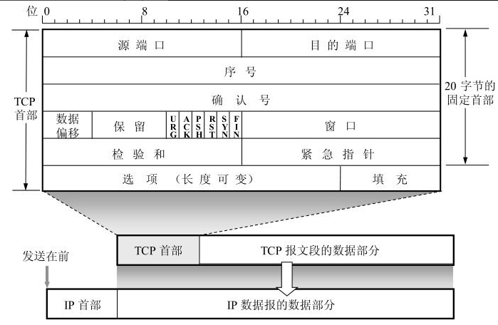

TCP 是**面向连接的、可靠的、基于字节流**的传输层通信协议。

### 三次握手

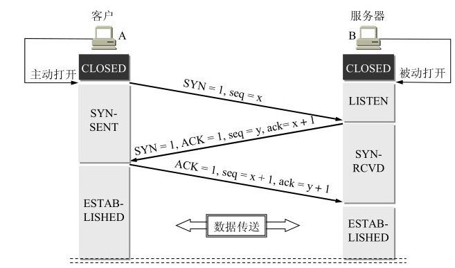

首先，服务器进程就处于LISTEN（收听）状态，等待客户的连接请求。

1. A向B发出连接请求报文段，这时首部中的同步位SYN = 1，同时选择一个初始序号seq = x。TCP规定，**SYN报文段（即SYN = 1的报文段）不能携带数据**，但要消耗掉一个序号。这时，TCP客户进程进入SYN-SENT（同步已发送）状态。
2. B收到连接请求报文段后，如同意建立连接，则向A发送确认。在确认报文段中应把SYN位和ACK位都置1，确认号是ack = x + 1，同时也为自己选择一个初始序号seq = y。请注意，这个报文段也不能携带数据，但同样要消耗掉一个序号。这时TCP服务器进程进入SYN-RCVD（同步收到）状态。
3. TCP客户进程收到B的确认后，还要向B给出确认。确认报文段的ACK置1，确认号ack = y + 1，而自己的序号seq = x + 1。TCP的标准规定，**ACK报文段可以携带数据**。但如果不携带数据则不消耗序号，在这种情况下，下一个数据报文段的序号仍是seq = x + 1。这时，TCP连接已经建立，A进入ESTABLISHED（已建立连接）状态。

> **第一次握手丢失了，会发生什么？**

客户端迟迟收不到服务端的 SYN-ACK 报文（第二次握手），就会触发「超时重传」机制，重传 SYN 报文，而且重传的 SYN 报文的序列号都是一样的。

重传达到最大次数后，客户端等待一段时间还没有收到就断开连接。

> **第二次握手丢失了，会发生什么？**

第二次握手的 `SYN-ACK` 报文其实有两个目的 ：

- 第二次握手里的 ACK， 是对第一次握手的确认报文；
- 第二次握手里的 SYN，是服务端发起建立 TCP 连接的报文；

因此，客户端和服务端都会重传：

* 客户端就会触发超时重传机制，重传 SYN 报文；

* 服务端这边会触发超时重传机制，重传 SYN-ACK 报文；

重传达到最大次数后，客户端和服务端等待一段时间还没有收到就断开连接。

> **第三次握手丢失了，会发生什么？**

服务端触发超时重传机制，重传 SYN-ACK 报文。重传达到最大次数后，服务端等待一段时间还没有收到就断开连接。

> **为什么A还要发送一次确认呢？（第三次握手）**

这主要是为了防止已失效的连接请求报文段突然又传送到了B，因而产生错误。

假如A发出的第一个连接请求报文段并没有丢失，而是在某些网络结点长时间滞留了，以致延误到连接释放以后的某个时间才到达B。本来这是一个早已失效的报文段。但B收到此失效的连接请求报文段后，就误认为是A又发出一次新的连接请求。于是就向A发出确认报文段，同意建立连接。假定不采用三次握手，那么只要B发出确认，新的连接就建立了。由于现在A并没有发出建立连接的请求，因此不会理睬B的确认，也不会向B发送数据。但B却以为新的运输连接已经建立了，并一直等待A发来数据。B的许多资源就这样白白浪费了。

### 四次挥手

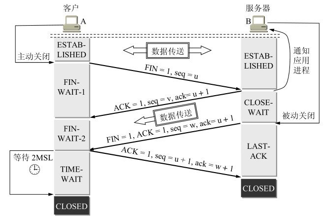

1. A的应用进程先向其TCP发出连接释放报文段，并停止再发送数据，主动关闭TCP连接。A把连接释放报文段首部的终止控制位FIN置1，其序号seq =u，它等于前面已传送过的数据的最后一个字节的序号加1。这时A进入FIN-WAIT-1（终止等待1）状态，等待B的确认。请注意，TCP规定，**FIN报文段即使不携带数据**，它也消耗掉一个序号。
2. B收到连接释放报文段后即发出确认，确认号是ack = u + 1，而这个报文段自己的序号是v，等于B前面已传送过的数据的最后一个字节的序号加1。然后B就进入CLOSE-WAIT（关闭等待）状态。TCP服务器进程这时应通知高层应用进程，因而从A到B这个方向的连接就释放了，这时的TCP连接处于半关闭(half-close)状态，即A已经没有数据要发送了，但B若发送数据，A仍要接收。也就是说，从B到A这个方向的连接并未关闭，这个状态可能会持续一些时间。
3. A收到来自B的确认后，就进入FIN-WAIT-2（终止等待2）状态，等待B发出的连接释放报文段。
4. 若B已经没有要向A发送的数据，其应用进程就通知TCP释放连接。这时B发出的连接释放报文段必须使FIN = 1。B还必须重复上次已发送过的确认号ack = u + 1。这时B就进入LAST-ACK（最后确认）状态，等待A的确认。
5. A在收到B的连接释放报文段后，必须对此发出确认。在确认报文段中把ACK置1，确认号ack = w + 1，而自己的序号是seq = u + 1。然后进入到TIME-WAIT（时间等待）状态。请注意，现在TCP连接还没有释放掉。**必须经过2MSL后，A才进入到CLOSED状态**。MSL叫做最长报文段寿命(Maximum Segment Lifetime)。

> **为什么A在TIME-WAIT状态必须等待2MSL的时间呢？**

TIME-WAIT规定为了2MSL，即客户端发出ACK报文到服务器端的最大时间+服务器没有接收到ACK报文再次发出FIN的最大时间= 2MSL。

第一，为了保证A发送的最后一个ACK报文段能够到达B。这个ACK报文段有可能丢失，因而使处在LAST-ACK状态的B收不到对已发送的FIN + ACK报文段的确认。B会超时重传这个FIN报文段，而A就能在2MSL时间内收到这个重传的FIN报文段。接着A重传一次确认，重新启动2MSL计时器。最后，A和B都正常进入到CLOSED状态。如果A在TIME-WAIT状态不等待一段时间，而是在发送完ACK报文段后立即释放连接，那么就无法响应重传的FIN报文段，B就会一直重传FIN报文段，无法按照正常步骤进入CLOSED状态。

第二，防止已失效的报文段出现在本连接中。A在发送完最后一个ACK报文段后，再经过时间2MSL，就可以使本连接持续的时间内所产生的所有报文段都从网络中消失。这样就可以使下一个新的连接中不会出现这种旧的报文段。

>  **为什么挥手需要四次？**

- 关闭连接时，客户端向服务端发送 `FIN` 时，仅仅表示客户端不再发送数据了但是还能接收数据。
- 服务端收到客户端的 `FIN` 报文时，先回一个 `ACK` 应答报文，而服务端可能还有数据需要处理和发送，等服务端不再发送数据时，才发送 `FIN` 报文给客户端来表示同意现在关闭连接。

服务端通常需要等待完成数据的发送和处理，所以服务端的 `ACK` 和 `FIN` 一般都会分开发送，因此是需要四次挥手。

> **第一次挥手丢失，会发生什么？**

客户端触发超时重传机制，重传 FIN 报文。达到最大重传次数后，就不再发送 FIN 报文，则会再等待一段时间，如果还是没能收到第二次挥手，那么直接进入到 `close` 状态。

> **第二次挥手丢失，会发生什么？**

客户端会触发超时重传机制，重传 FIN 报文，直到收到服务端的第二次挥手，或者达到最大的重传次数。

已达到最大重传次数，于是再等待一段时间，如果还是没能收到服务端的第二次挥手（ACK 报文），那么客户端就会断开连接。

> **第三次挥手丢失，会发生什么？**

服务端会触发超时重传机制，重传 FIN 报文，直到收到客户端的第四次挥手，或者达到最大的重传次数。

已达到最大重传次数，于是再等待一段时间，如果还是没能收到服务端的第四次挥手（ACK 报文），那么服务端就会断开连接。

如果客户端是通过 close 函数关闭连接的（无法再发送和接收数据），处于 FIN_WAIT_2 状态是有时长限制的，如果 tcp_fin_timeout （默认60s）时间内还是没能收到服务端的第三次挥手（FIN 报文），那么客户端就会直接断开连接。

如果主动关闭方使用 shutdown 函数关闭连接（只关闭发送方向），如果主动关闭方一直没收到第三次挥手，那么主动关闭方的连接将会一直处于 `FIN_WAIT2` 状态。

>  **第四次挥手丢失，会发生什么？**

服务端会触发超时重传机制，重传 FIN 报文，直到收到客户端的第四次挥手，或者达到最大的重传次数。

客户端在收到第三次挥手后，就会进入 TIME_WAIT 状态，开启时长为 2MSL 的定时器，如果途中再次收到第三次挥手（FIN 报文）后，就会重置定时器，当等待 2MSL 时长后，客户端就会断开连接。

### MTU和MSS

- `MTU`：一个网络包的最大长度，以太网中一般为 `1500` 字节；
- `MSS`：MSS是每一个TCP报文段中的数据字段的最大长度。MSS应尽可能大些，只要在IP层传输时不需要再分片就行。

如果在 TCP 的整个报文（头部 + 数据）交给 IP 层进行分片，会有什么异常呢？

当 IP 层有一个超过 `MTU` 大小的数据（TCP 头部 + TCP 数据）要发送，那么 IP 层就要进行分片，把数据分片成若干片，保证每一个分片都小于 MTU。把一份 IP 数据报进行分片以后，由目标主机的 IP 层来进行重新组装后，再交给上一层 TCP 传输层。但这存在隐患，**如果一个 IP 分片丢失，整个 IP 报文的所有分片都得重传**。

因为 IP 层本身没有超时重传机制，它由传输层的 TCP 来负责超时和重传。

当某一个 IP 分片丢失后，接收方的 IP 层就无法组装成一个完整的 TCP 报文（头部 + 数据），也就无法将数据报文送到 TCP 层，所以接收方不会响应 ACK 给发送方，因为发送方迟迟收不到 ACK 确认报文，所以会触发超时重传，就会重发「整个 TCP 报文（头部 + 数据）」。

所以，为了达到最佳的传输效能 TCP 协议在**建立连接的时候通常要协商双方的 MSS 值**, 不用 IP 分片了。经过 TCP 层分片后，如果一个 TCP 分片丢失后，**进行重发时也是以 MSS 为单位**，而不用重传所有的分片，大大增加了重传的效率。

### 可靠传输

#### 重传机制

TCP 实现可靠传输的方式之一，是通过序列号与确认应答。当发送端的数据到达接收主机时，接收端主机会返回一个确认应答消息，表示已收到消息。

##### 超时重传

在发送数据时，设定一个定时器，当超过指定的时间后，没有收到对方的 `ACK` 确认应答报文，就会重发该数据。

TCP 会在以下两种情况发生超时重传：

1. 数据包丢失

2. 确认应答丢失

超时重传时间 RTO 的值应该略大于报文往返 RTT 的值。实际上「报文往返 RTT 的值」是经常变化的，因为我们的网络也是时常变化的，所以「超时重传时间 RTO 的值」**应该是一个动态变化的值**。

##### 快速重传

快速重传（Fast Retransmit）机制，它**不以时间为驱动，而是以数据驱动重传**。

快速重传的工作方式是当**收到三个相同的 ACK 报文时，会在定时器过期之前，重传丢失的报文段**。

快速重传机制只解决了一个问题，就是超时时间的问题，但是它依然面临着另外一个问题。就是**重传的时候，是重传一个，还是重传所有的问题。**

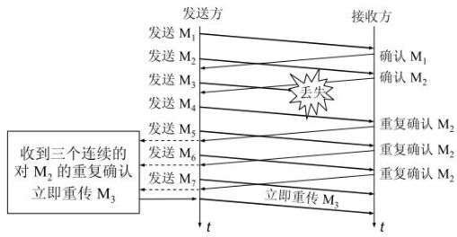

##### 选择确认SACK

这种方式需要在TCP首部的选项中加上“允许SACK”的选项，它**可以将已收到的数据的信息发送给「发送方」**，这样发送方就可以知道哪些数据收到了，哪些数据没收到，知道了这些信息，就可以**只重传丢失的数据**。

#### 滑动窗口

作用：

1. 流量控制： 滑动窗口确保发送方不会以超过接收方处理能力的速度发送数据。接收方通过设置一个合适的窗口大小来告诉发送方它能处理多少字节的数据，避免接收方的缓冲区被填满，导致丢包。

2. 提高网络吞吐量： 滑动窗口机制允许发送方在等待确认之前发送多个数据包，而不是等待每个数据包的确认。这种机制减少了等待确认的时间，提高了传输效率。

3. 避免网络拥塞： 滑动窗口可以帮助控制数据包的发送速率。通过动态调整窗口大小，TCP 可以根据网络的当前状况来减少或增加发送的数据量，避免拥塞。

4. 保证数据的可靠性和顺序性： 虽然滑动窗口可以并行发送多个数据包，但它保证了数据包的顺序，且通过 ACK 确认机制保证了每个数据包的可靠交付。

发送窗口表示：在没有收到B的确认的情况下，A可以连续把窗口内的数据都发送出去。凡是已经发送过的数据，在未收到确认之前都必须暂时保留，以便在超时重传时使用。

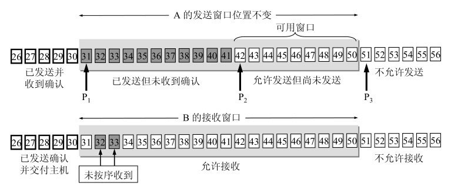

发送窗口是根据接收窗口设置的，但在同一时刻，A的发送窗口并不总是和B的接收窗口一样大，因为通过网络传送窗口值需要经历一定的时间滞后。

TCP通常对不按序到达的数据是先临时存放在接收窗口中，等到字节流中所缺少的字节收到后，再按序交付上层的应用进程。

TCP要求接收方必须有累积确认的功能，这样可以减小传输开销。接收方可以在合适的时候发送确认，也可以在自己有数据要发送时把确认信息顺便捎带上。但请注意两点，一是接收方不应过分推迟发送确认，否则会导致发送方不必要的重传，这反而浪费了网络的资源。

#### 流量控制

流量控制是为了控制发送方发送速率，保证接收方来得及接收。

接收方发送的确认报文中的窗口字段可以用来控制发送方窗口大小，从而影响发送方的发送速率。将窗口字段设置为 0，则发送方不能发送数据。接着，发送方会定时发送窗口大小探测报文，以便及时知道接收方窗口大小的变化。

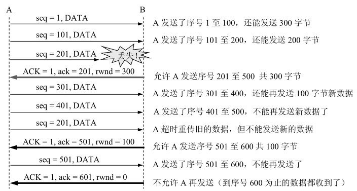

#### 拥塞控制

流量控制是避免「发送方」的数据填满「接收方」的缓存。流量控制往往指点对点通信量的控制，流量控制所要做的就是抑制发送端发送数据的速率，以便使接收端来得及接收。

拥塞控制是**避免「发送方」过多的数据注入到网络中，这样可以使网络中的路由器或链路不致过载**。拥塞控制是一个全局性的过程，涉及到所有的主机、所有的路由器，以及与降低网络传输性能有关的所有因素。

##### 慢开始和拥塞避免

慢开始算法的规则：**当发送方每收到一个 ACK，拥塞窗口 cwnd 的大小就会加倍。**

为了防止拥塞窗口cwnd增长过大引起网络拥塞，还要设置一个慢开始门限 `ssthresh` 状态变量。

- 当 `cwnd` < `ssthresh` 时，使用慢开始算法。
- 当 `cwnd` > `ssthresh` 时，就会使用拥塞避免算法。

拥塞避免算法的思路是让拥塞窗口cwnd缓慢地增大，即每经过一个往返时间RTT就把发送方的拥塞窗口cwnd加1，而不是加倍。这样，拥塞窗口cwnd 按线性规律缓慢增长，比慢开始算法的拥塞窗口增长速率缓慢得多。

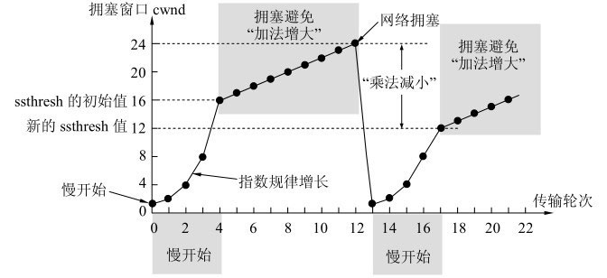

无论在慢开始阶段还是在拥塞避免阶段，只要发送方判断网络出现拥塞（其根据就是没有按时收到确认），就要把慢开始门限ssthresh设置为出现拥塞时的发送方窗口值的一半（但不能小于2）。然后把拥塞窗口cwnd重新设置为1，执行慢开始算法。这样做的目的就是要迅速减少主机发送到网络中的分组数，使得发生拥塞的路由器有足够时间把队列中积压的分组处理完毕。

##### 快重传和快恢复

快重传算法规定，发送方只要一连收到**三个重复确认**就应当立即重传对方尚未收到的报文段，而不必继续等待重传计时器到期。

快恢复算法，其过程有以下两个要点：

1. 当发送方连续收到三个重复确认时，就执行“乘法减小”算法，把慢开始门限ssthresh减半。这是为了预防网络发生拥塞。
2. 由于发送方现在认为网络很可能没有发生拥塞（如果网络发生了严重的拥塞，就不会一连有好几个报文段连续到达接收方，也就不会导致接收方连续发送重复确认），因此与慢开始不同之处是现在不执行慢开始算法（即拥塞窗口cwnd现在不设置为1），而是把cwnd值设置为慢开始门限ssthresh减半后的数值，然后开始执行拥塞避免算法（“加法增大”），使拥塞窗口缓慢地线性增大。

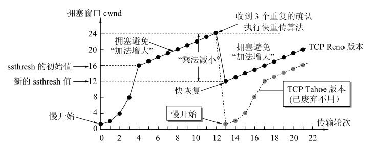

## UDP

UDP的主要特点是：

1. UDP是**无连接**的，即发送数据之前不需要建立连接（当然，发送数据结束时也没有连接可释放），因此减少了开销和发送数据之前的时延。
2. UDP使用**尽最大努力交付**，即不保证可靠交付，因此主机不需要维持复杂的连接状态表。
3.  UDP是**面向报文**的。发送方的UDP对应用程序交下来的报文，在添加首部后就向下交付IP层。UDP对应用层交下来的报文，既不合并，也不拆分，而是保留这些报文的边界。UDP一次交付一个完整的报文。UDP把它交给IP层后，IP层在传送时可能要进行分片。
4.  UDP**没有拥塞控制**，因此网络出现的拥塞不会使源主机的发送速率降低。
5.  UDP支持一对一、一对多、多对一和多对多的交互通信。
6.  UDP的首部开销小，只有8个字节，比TCP的20个字节的首部要短。

**TCP与 UDP区别：**

| 特性               | TCP                                                   | UDP                                                   |
| ------------------ | ----------------------------------------------------- | ----------------------------------------------------- |
| 连接               | 面向连接                                              | 无连接                                                |
| 服务对象           | 一对一                                                | 一对一、一对多、多对多                                |
| 可靠性             | 可靠                                                  | 不可靠，尽最大努力交付                                |
| 拥塞控制、流量控制 | 有                                                    | 无                                                    |
| 首部开销           | 首部在没有使用「选项」字段时是 `20` 个字节            | 只有 8 个字节，并且是固定不变的                       |
| 传输方式           | 字节流                                                | 数据报                                                |
| 分片               | TCP 的数据大小如果大于 MSS 大小，则会在传输层进行分片 | UDP 的数据大小如果大于 MTU 大小，则会在 IP 层进行分片 |
| 应用场景           | 文件传输、Web、邮件等可靠性应用                       | 实时通信、视频、音频、游戏等高性能要求应用            |

## IP

### 环回地址

环回地址是在同一台计算机上的程序之间进行网络通信时所使用的一个默认地址。

计算机使用一个特殊的 IP 地址 **127.0.0.1 作为环回地址**。与该地址具有相同意义的是一个叫做 `localhost` 的主机名。使用这个 IP 或主机名时，数据包不会流向网络。

### 相关协议

#### ARP

在传输一个 IP 数据报的时候，确定了源 IP 地址和目标 IP 地址后，就会通过主机「路由表」确定 IP 数据包下一跳。然而，网络层的下一层是数据链路层，所以我们还要知道「下一跳」的 MAC 地址。

由于主机的路由表中可以找到下一跳的 IP 地址，所以可以通过 **ARP 协议**，根据IP地址求得下一跳的 MAC 地址。

主机会通过**广播发送 ARP 请求**，这个包中包含了想要知道 MAC 地址的主机 IP 地址。如果 ARP 请求包中的目标 IP 地址与自己的 IP 地址一致，那么这个设备就将自己的 MAC 地址塞入 **ARP 响应包**返回给主机。

#### DHCP

我们的电脑通常都是通过 DHCP 动态获取 IP 地址，大大省去了配 IP 信息繁琐的过程。

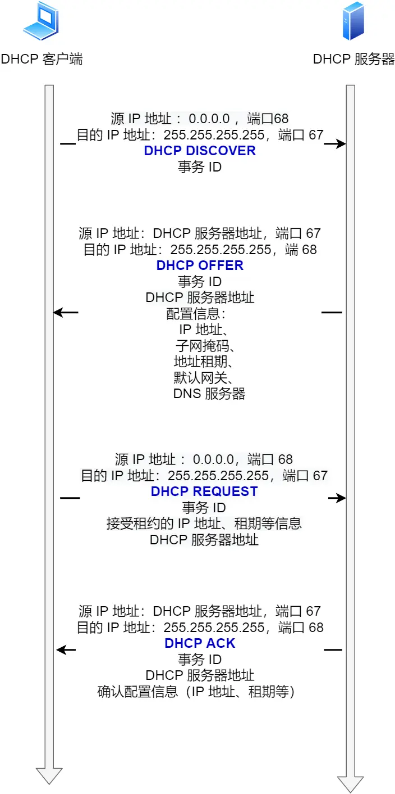

1. 需要IP地址的主机在启动时就向DHCP服务器广播发送发现报文（DHCP DISCOVER）。发送广播报文是因为现在还不知道DHCP服务器在什么地方，因此要发现（DISCOVER）DHCP服务器的IP地址。这个主机目前还没有自己的IP地址，因此它将IP数据报的源IP地址设为全0。DHCP报文只是**UDP**用户数据报的数据，它还要加上UDP首部、IP数据报首部，以及以太网的MAC帧的首部和尾部后，才能在链路上传送。
2. DHCP 服务器收到 DHCP 发现报文时，用 DHCP 提供报文（DHCP OFFER） 向客户端做出响应。
3. 客户端收到一个或多个服务器的 DHCP 提供报文后，从中选择一个服务器，并向选中的服务器发送 DHCP 请求报文（DHCP REQUEST）
4. DHCP服务器发送确认报文（DHCP ACK）。从这时起，DHCP客户就可以使用这个IP地址了。

#### NAT

网络地址转换（NAT, Network Address Translation）是一种网络技术，用于在数据包通过路由设备时，修改其IP头中的网络地址信息。这种技术允许多个本地网络设备共享一个公共IP地址来访问外部网络。

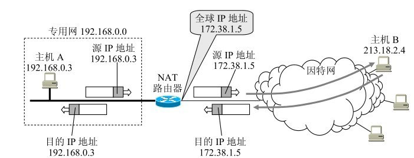

NAT路由器收到从专用网内部的主机A发往因特网上主机B的IP数据报：源IP地址是192.168.0.3，而目的IP地址是213.18.2.4。NAT路由器把IP数据报的源IP地址192.168.0.3，转换为新的源IP地址（即NAT路由器的全球IP地址）172.38.1.5，然后转发出去。

显然，通过NAT路由器的通信必须由专用网内的主机发起。设想因特网上的主机要发起通信，当IP数据报到达NAT路由器时，NAT路由器就不知道应当把目的IP地址转换成专用网内的哪一个本地IP地址。

NAT 穿透技术：就是客户端主动从 NAT 设备获取公有 IP 地址，然后自己建立端口映射条目，然后用这个条目对外通信，就不需要 NAT 设备来进行转换了。

#### ICMP

互联网控制报文协议，是IP层的协议。ICMP报文作为IP层数据报的数据，加上IP首部，组成IP数据报发送出去。

`ICMP` 主要的功能包括：**确认 IP 包是否成功送达目标地址、报告发送过程中 IP 包被废弃的原因和改善网络设置等。**

ICMP报文的种类有两种，即ICMP**差错报告报文**和ICMP**询问报文**。

ICMP差错报告报文共有五种：

1. 终点不可达。当路由器或主机不能交付数据报时就向源点发送终点不可达报文。
2. 源点抑制。当路由器或主机由于拥塞而丢弃数据报时，就向源点发送源点抑制报文，使源点知道应当把数据报的发送速率放慢。
3. 时间超过。当路由器收到生存时间为零的数据报时，除丢弃该数据报外，还要向源点发送时间超过报文。当终点在预先规定的时间内不能收到一个数据报的全部数据报片时，就把已收到的数据报片都丢弃，并向源点发送时间超过报文。
4. 参数问题。当路由器或目的主机收到的数据报的首部中有的字段的值不正确时，就丢弃该数据报，并向源点发送参数问题报文。
5. 改变路由（重定向）。路由器把改变路由报文发送给主机，让主机知道下次应将数据报发送给另外的路由器（可通过更好的路由）。

ICMP询问报文有两种：

1. 回送请求和回答。ICMP回送请求报文是由主机或路由器向一个特定的目的主机发出的询问。收到此报文的主机必须给源主机或路由器发送ICMP回送回答报文。这种询问报文用来测试目的站是否可达以及了解其有关状态。
2. 时间戳请求和回答。ICMP时间戳请求报文是请某个主机或路由器回答当前的日期和时间。时间戳请求与回答可用来进行时钟同步和测量时间。

ICMP的一个重要应用就是分组网间探测**PING** (Packet InterNet Groper)，用来测试两个主机之间的连通性。PING使用了ICMP回送请求与回送回答报文。PING是应用层直接使用网络层ICMP的一个例子。它没有通过运输层的TCP或UDP。

#### PING

ping 是**应用层**命令，尝试发送消息，判断目标机器是否可达，判断目标机器网络是否能连通。

ping 是基于 **`ICMP`** 协议工作的。

ping 命令执行的时候，源主机首先会构建一个 ICMP 请求数据包，然后由 ICMP 协议将这个数据包连同ping地址一起交给 IP 层。IP 层将以 ping地址作为**目的地址**，本机 IP 地址作为**源地址**构建IP数据包。接下来，加入MAC头，由数据链路层构建一个数据帧发送出去。

主机 B 收到这个数据帧后，主机 `B` 会构建一个 **ICMP 回送响应消息**数据包，然后再发送出去给主机 A。

在规定的时候间内，源主机如果没有接到 ICMP 的应答包，则说明目标主机不可达；如果接收到了 ICMP 回送响应消息，则说明目标主机可达。

> **为什么断网了还能 ping 通 127.0.0.1 **

ping 本机IP 跟 ping 回环地址一样，相关的网络数据，都是走的 **lo0 **本地回环接口。只要走了本地回环接口，那数据都不会发送到网络中，在本机网络协议栈中兜一圈，就发回来了。因此 **ping回环地址和ping本机地址没有区别**。

> **127.0.0.1 和 localhost 以及 0.0.0.0 有区别吗**

首先 `localhost` 就不叫 `IP`，它是一个域名，就跟 `"baidu.com"`, 是一个形式的东西，只不过默认会把它解析为 `127.0.0.1` ，当然这可以在 `/etc/hosts` 文件下进行修改。所以默认情况下，使用 `localhost` 跟使用 `127.0.0.1` 确实是没区别的。

其次就是 `0.0.0.0`，执行 ping 0.0.0.0 ，是会失败的，因为它在`IPV4`中表示的是无效的**目标地址**。如果`listen` 的是本机的 `0.0.0.0` , 那么它表示本机上的**所有IPV4地址**。
