---
hide:
  - navigation
---

设计模式要干的事情就是解耦。创建型模式是将创建和使用代码解耦，结构型模式是将不同功能代码解耦，行为型模式是将不同的行为代码解耦。

**创建型：**

常用的有：单例模式、工厂模式（工厂方法和抽象工厂）、建造者模式。 

不常用的有：原型模式。  

**结构型：** 

常用的有：代理模式、桥接模式、装饰者模式、适配器模式。 

不常用的有：门面模式、组合模式、享元模式。

**行为型：**

常用的有：观察者模式、模板模式、策略模式、职责链模式、迭代器模式、状态模式。 

不常用的有：访问者模式、备忘录模式、命令模式、解释器模式、中介模式。

## **创建型**

创建型模式主要解决对象的创建问题，封装复杂的创建过程，解耦对象的创建代码和使用代码。

### **单例模式**

单例模式（Singleton），保证一个类仅有一个实例，并提供一个访问它的全局访问点。

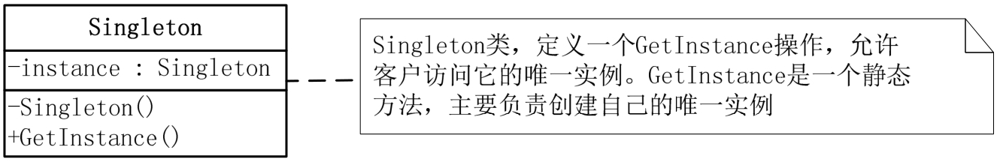

为什么需要单例？

1. 处理资源访问冲突。例如一个日志类`Logger`，多线程环境下分别创建两个`Logger`对象同时写日志到`log.txt` 中，就可能存在日志覆盖问题。解决方案：类级别锁、分布式锁、并发队列、单例模式（所有线程共享Logger对象，共享一个FileWriter对象，FileWriter对象是对象级别线程安全的）。
2. 表示全局唯一类。例如配置信息类、唯一递增ID号码生成器


要实现一个单例，我们需要关注的点有下面几个：

* 构造函数需要是 private 访问权限的，这样才能避免外部通过 new 创建实例； 
* 考虑对象创建时的线程安全问题； 
* 考虑是否支持延迟加载； 
* 考虑 getInstance() 性能是否高（是否加锁）。


**饿汉式**

在类加载的时候，instance 静态实例就已经创建并初始化好了，所以，instance 实例的创建过程是线程安全的。不过，这样的实现方式不支持延迟加载。

```java
public class Singleton {
    private static final Singleton instance = new Singleton();
    
    private Singleton() {
        // 私有构造方法，防止外部实例化
    }
    
    public static Singleton getInstance() {
        return instance;
    }
}
```


**懒汉式**

懒汉式相对于饿汉式的优势是支持延迟加载。

```java
public class Singleton {
    private static Singleton instance;
    
    private Singleton() {
        // 私有构造方法，防止外部实例化
    }
    // 使用了同步关键字来确保线程安全, 可能会影响性能
    public static synchronized Singleton getInstance() {
        if (instance == null) {
            instance = new Singleton();
        }
        return instance;
    }
}
```


**双检锁**

饿汉式不支持延迟加载，懒汉式有性能问题，不支持高并发。既支持延迟加载、又支持高并发的单例实现方式，也就是双重检测实现方式。

```java
public class Singleton {
    private static volatile Singleton instance;
    
    private Singleton() {
        // 私有构造方法，防止外部实例化
    }
    
    public static Singleton getInstance() {
        if (instance == null) {
            synchronized (Singleton.class) {
                if (instance == null) {
                    instance = new Singleton();
                }
            }
        }
        return instance;
    }
}
```

因为指令重排序，可能会导致 Singleton 对象被 new 出来，并且赋值给 instance 之后，还没来得及初始化（执行构造函数中的代码逻 辑），就被另一个线程使用了。 

要解决这个问题，我们需要给 instance 成员变量加上 volatile 关键字，禁止指令重排序。

实际上，只有很低版本的 Java 才会有这个问题。我们现在用的高版本的 Java 已经在 JDK 内部实现中解决了这个问题（解决的方法很简单，只要把对象 new 操作和初始化操作设计为原子操作，就自然能禁止重排序）。


**静态内部类**

一种比双重检测更加简单的实现方法，那就是利用 Java 的静态内部类。它有点类似饿汉式，但又能做到了延迟加载。

```java
public class Singleton {
    // 私有构造方法，防止外部实例化
    private Singleton() {
    }

    // 静态内部类，负责实例的初始化
    private static class SingletonHolder {
        // 静态初始化器，线程安全
        private static final Singleton INSTANCE = new Singleton();
    }

    // 公共方法，提供全局访问点
    public static Singleton getInstance() {
        return SingletonHolder.INSTANCE;
    }
}
```

利用 Java 的 **类加载机制**，静态内部类只有在第一次被使用时才会被加载，而类的加载是线程安全的，因此无需额外的同步措施来保证线程安全。


**枚举**

```java
public enum Singleton {
    INSTANCE;
}
```

在 Java 中，枚举类是特殊的类，它的实例在类加载时就会被创建。由于枚举类的构造器默认是 `private` 的，Java 会确保枚举实例只能被创建一次，因此枚举类型可以完美实现单例模式。


### **工厂模式**

一般情况下，工厂模式分为三种更加细分的类型：简单工厂、工厂方法和抽象工厂。

当创建逻辑比较复杂，是一个“大工程”的时候，我们就考虑使用工厂模式，封装对象的创建过程，将对象的创建和使用相分离。何为创建逻辑比较复杂呢？

第一种情况：类似规则配置解析的例子，代码中存在 if-else 分支判断，动态地根据不同的类型创建不同的对象。针对这种情况，我们就考虑使用工厂模式，将这一大坨 if-else 创建对象的代码抽离出来，放到工厂类中。 推荐简单工厂模式

第二种情况：尽管我们不需要根据不同的类型创建不同的对象，但是，单个对象本身的创建过程比较复杂，比如要组合其他类对象，做各种初始化操作。在这种情况下，我们也可以考虑使用工厂模式，将对象的创建过程封装到工厂类中。推荐工厂方法模式


#### **简单工厂**

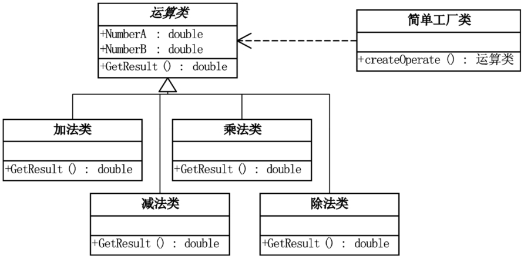

```java
// 简单工厂类
public class OperationFactory {
    public static Operation createOperation(String operate) {
        Operation oper = null;
        switch (operate) {
            case "+":
                oper = new OperationAdd();
                break;
            case "-":
                oper = new OperationSub();
                break;
            case "*":
                oper = new OperationMul();
                break;
            case "/":
                oper = new OperationDiv();
                break;
            default:
                throw new IllegalArgumentException("不支持的运算符: " + operate);
        }
        return oper;
    }
}
```


#### **工厂方法**

简单工厂模式的最大优点在于工厂类中包含了必要的逻辑判断，根据客户端的选择条件动态实例化相关的类，对于客户端来说，去除了与具体产品的依赖。添加新的逻辑需要修改工厂类，不符合开闭原则。

工厂方法把简单工厂的内部逻辑判断移到了客户端代码来进行。你想要加功能，本来是改工厂类的，而现在是修改客户端。

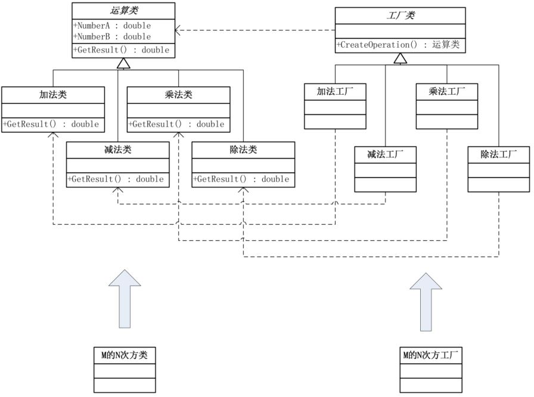

- 抽象工厂：一个接口，包含一个抽象的工厂方法（用于创建产品对象）。
- 具体工厂：实现抽象工厂接口，创建具体的产品。
- 抽象产品：定义产品的接口。
- 具体产品：实现抽象产品接口，是工厂创建的对象。

```java
public class Operation {
    protected double numberA;
    protected double numberB;

    public void setNumberA(double numberA) {
        this.numberA = numberA;
    }

    public void setNumberB(double numberB) {
        this.numberB = numberB;
    }

    public double getResult() {
        return 0;
    }
}
public class OperationAdd extends Operation {
    @Override
    public double getResult() {
        return numberA + numberB;
    }
}

public class OperationSub extends Operation {
    @Override
    public double getResult() {
        return numberA - numberB;
    }
}

public class OperationMul extends Operation {
    @Override
    public double getResult() {
        return numberA * numberB;
    }
}

public class OperationDiv extends Operation {
    @Override
    public double getResult() {
        if (numberB == 0) {
            throw new ArithmeticException("除数不能为0");
        }
        return numberA / numberB;
    }
}

// 工厂接口
public interface IFactory {
    Operation createOperation();
}
// 加法工厂
public class AddFactory implements IFactory {
    @Override
    public Operation createOperation() {
        return new OperationAdd();
    }
}

// 减法工厂
public class SubFactory implements IFactory {
    @Override
    public Operation createOperation() {
        return new OperationSub();
    }
}

// 乘法工厂
public class MulFactory implements IFactory {
    @Override
    public Operation createOperation() {
        return new OperationMul();
    }
}

// 除法工厂
public class DivFactory implements IFactory {
    @Override
    public Operation createOperation() {
        return new OperationDiv();
    }
}

public class Main {
    public static void main(String[] args) {
        double a = 10, b = 5;

        // 使用工厂方法创建运算对象
        IFactory factory = new AddFactory();
        Operation oper = factory.createOperation();
        oper.setNumberA(a);
        oper.setNumberB(b);
        System.out.println("10 + 5 = " + oper.getResult());

        factory = new SubFactory();
        oper = factory.createOperation();
        oper.setNumberA(a);
        oper.setNumberB(b);
        System.out.println("10 - 5 = " + oper.getResult());

        factory = new MulFactory();
        oper = factory.createOperation();
        oper.setNumberA(a);
        oper.setNumberB(b);
        System.out.println("10 * 5 = " + oper.getResult());

        factory = new DivFactory();
        oper = factory.createOperation();
        oper.setNumberA(a);
        oper.setNumberB(b);
        System.out.println("10 / 5 = " + oper.getResult());
    }
}
```


#### **抽象工厂**

抽象工厂模式（Abstract Factory），提供一个创建一系列相关或相互依赖对象的接口，而无需指定它们具体的类。

比如沙发、茶几、椅子，都具有古典风格的和现代风格的，抽象工厂模式可以将生产现代风格的家具放在一个工厂类中，将生产古典风格的家具放在另一个工厂类中，这样每个工厂类就可以生产一系列的家具。

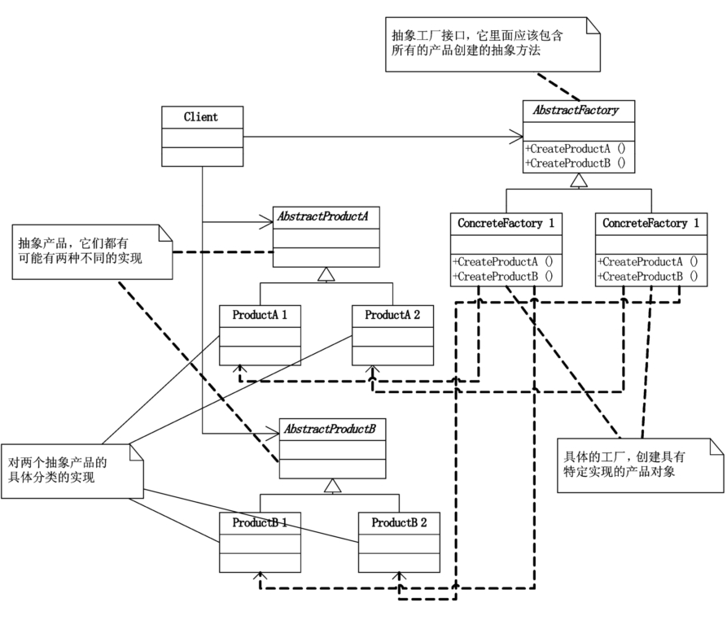

- 抽象产品接口`AbstractProduct`: 定义产品的接口，可以定义多个抽象产品接口，比如说沙发、椅子、茶几都是抽象产品。
- 具体产品类`ConcreteProduct`: 实现抽象产品接口，产品的具体实现，古典风格和沙发和现代风格的沙发都是具体产品。
- 抽象工厂接口`AbstractFactory`: 声明一组用于创建产品的方法，每个方法对应一个产品。
- 具体工厂类`ConcreteFactory`： 实现抽象工厂接口，负责创建一组具体产品的对象，在本例中，生产古典风格的工厂和生产现代风格的工厂都是具体实例。

```java
// 1. 定义抽象产品
// 抽象产品A 沙发
interface ProductA {
    void display();
}

// 抽象产品B 椅子
interface ProductB {
    void show();
}

// 2. 实现具体产品类 
// 具体产品A1-现代
class ConcreteProductA1 implements ProductA {
    @Override
    public void display() {
        System.out.println("Concrete Product A1");
    }
}

// 具体产品A2-古典
class ConcreteProductA2 implements ProductA {
    @Override
    public void display() {
        System.out.println("Concrete Product A2");
    }
}

// 具体产品B1-现代
class ConcreteProductB1 implements ProductB {
    @Override
    public void show() {
        System.out.println("Concrete Product B1");
    }
}

// 具体产品B2-古典
class ConcreteProductB2 implements ProductB {
    @Override
    public void show() {
        System.out.println("Concrete Product B2");
    }
}

// 3. 定义抽象工厂接口
interface AbstractFactory {
    ProductA createProductA();
    ProductB createProductB();
}
// 4. 实现具体工厂类
// 具体工厂1，生产产品A1和B1
class ConcreteFactory1 implements AbstractFactory {
    @Override
    public ProductA createProductA() {
        return new ConcreteProductA1();
    }

    @Override
    public ProductB createProductB() {
        return new ConcreteProductB1();
    }
}

// 具体工厂2,生产产品A2和B2
class ConcreteFactory2 implements AbstractFactory {
    @Override
    public ProductA createProductA() {
        return new ConcreteProductA2();
    }

    @Override
    public ProductB createProductB() {
        return new ConcreteProductB2();
    }
}

// 客户端代码
public class AbstractFactoryExample {
    public static void main(String[] args) {
        // 使用工厂1创建产品A1和产品B1
        AbstractFactory factory1 = new ConcreteFactory1();
        ProductA productA1 = factory1.createProductA();
        ProductB productB1 = factory1.createProductB();
        productA1.display();
        productB1.show();

        // 使用工厂2创建产品A2和产品B2
        AbstractFactory factory2 = new ConcreteFactory2();
        ProductA productA2 = factory2.createProductA();
        ProductB productB2 = factory2.createProductB();
        productA2.display();
        productB2.show();
    }
}
```


**简单工厂、工厂方法、抽象工厂的区别：**

- 简单工厂模式：一个工厂方法创建所有具体产品
- 工厂方法模式：一个工厂方法创建一个具体产品
- 抽象工厂模式：一个工厂方法可以创建一类具体产品


### **建造者模式/生成器模式**

建造者模式（Builder），将一个复杂对象的构建与它的表示分离，使得同样的构建过程可以创建不同的表示。

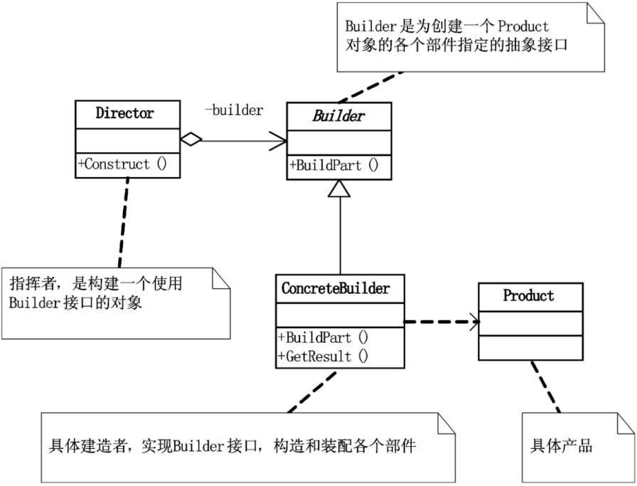

- 产品`Product`：被构建的复杂对象, 包含多个组成部分。
- 抽象建造者`Builder`: 定义构建产品各个部分的抽象接口和一个返回复杂产品的方法`getResult`
- 具体建造者`Concrete Builder`：实现抽象建造者接口，构建产品的各个组成部分，并提供一个方法返回最终的产品。
- 指导者`Director`：调用具体建造者的方法，按照一定的顺序或逻辑来构建产品。

```java
// 1. 产品类：汉堡
class Hamburger {
    private String bread;  // 面包
    private String meat;   // 肉
    private String sauce;  // 酱料
    private String veggies;  // 配菜

    // 构造器，初始化汉堡的所有部件
    public Hamburger(String bread, String meat, String sauce, String veggies) {
        this.bread = bread;
        this.meat = meat;
        this.sauce = sauce;
        this.veggies = veggies;
    }

    // 重写 toString 方法以便输出汉堡内容
    @Override
    public String toString() {
        return "Hamburger [bread=" + bread + ", meat=" + meat + ", sauce=" + sauce + ", veggies=" + veggies + "]";
    }
}

// 2. 抽象建造者类
abstract class HamburgerBuilder {
    protected String bread;
    protected String meat;
    protected String sauce;
    protected String veggies;

    // 各种设置汉堡部件的方法
    public abstract void buildBread();    // 设置面包
    public abstract void buildMeat();     // 设置肉
    public abstract void buildSauce();    // 设置酱料
    public abstract void buildVeggies();  // 设置配菜

    // 返回最终的汉堡对象
    public abstract Hamburger getHamburger();
}

// 3. 具体建造者类1：鸡肉汉堡
class ChickenBurgerBuilder extends HamburgerBuilder {

    @Override
    public void buildBread() {
        bread = "白面包";
    }

    @Override
    public void buildMeat() {
        meat = "鸡肉";
    }

    @Override
    public void buildSauce() {
        sauce = "番茄酱";
    }

    @Override
    public void buildVeggies() {
        veggies = "生菜";
    }

    @Override
    public Hamburger getHamburger() {
        return new Hamburger(bread, meat, sauce, veggies);
    }
}

// 4. 具体建造者类2：牛肉汉堡
class BeefBurgerBuilder extends HamburgerBuilder {

    @Override
    public void buildBread() {
        bread = "全麦面包";
    }

    @Override
    public void buildMeat() {
        meat = "牛肉";
    }

    @Override
    public void buildSauce() {
        sauce = "辣椒酱";
    }

    @Override
    public void buildVeggies() {
        veggies = "洋葱";
    }

    @Override
    public Hamburger getHamburger() {
        return new Hamburger(bread, meat, sauce, veggies);
    }
}

// 5. 指挥者类：负责构建汉堡
class HamburgerDirector {
    private HamburgerBuilder builder;

    // 构造函数接收建造者对象
    public HamburgerDirector(HamburgerBuilder builder) {
        this.builder = builder;
    }

    // 制作汉堡的方法，执行建造步骤
    public Hamburger constructHamburger() {
        builder.buildBread();
        builder.buildMeat();
        builder.buildSauce();
        builder.buildVeggies();
        return builder.getHamburger();
    }
}

// 6. 客户端代码
public class BuilderPatternDemo {
    public static void main(String[] args) {
        // 使用指挥者创建鸡肉汉堡
        HamburgerBuilder chickenBurgerBuilder = new ChickenBurgerBuilder();
        HamburgerDirector director1 = new HamburgerDirector(chickenBurgerBuilder);
        Hamburger chickenBurger = director1.constructHamburger();
        System.out.println("鸡肉汉堡: " + chickenBurger);

        // 使用指挥者创建牛肉汉堡
        HamburgerBuilder beefBurgerBuilder = new BeefBurgerBuilder();
        HamburgerDirector director2 = new HamburgerDirector(beefBurgerBuilder);
        Hamburger beefBurger = director2.constructHamburger();
        System.out.println("牛肉汉堡: " + beefBurger);
    }
}
```


### **原型模式**

如果对象的创建成本比较大，而同一个类的不同对象之间差别不大（大部分字段都相同）， 在这种情况下，我们可以利用对已有对象（原型）进行复制（或者叫拷贝）的方式，来创建新对象，以达到节省创建时间的目的。这种基于原型来创建对象的方式就叫作原型设计模式，简称原型模式。

原型模式有两种实现方法，深拷贝和浅拷贝。浅拷贝只会复制对象中基本数据类型数据和引用对象的内存地址，不会递归地复制引用对象，以及引用对象的引用对象……而深拷贝得到的是一份完完全全独立的对象。所以，深拷贝比起浅拷贝来说，更加耗时，更加耗内存空间。

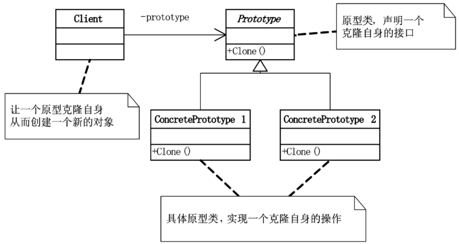

- 原型接口: 声明一个克隆自身的方法`clone`
- 具体原型类: 实现`clone`方法，复制当前对象并返回一个新对象。

```java
// 原型接口
interface Prototype extends Cloneable {
    Prototype clone();
}

// 具体原型类 - 文档
class Document implements Prototype {
    private String title;
    private String content;

    public Document(String title, String content) {
        this.title = title;
        this.content = content;
    }

    public String getTitle() {
        return title;
    }

    public String getContent() {
        return content;
    }

    public void setTitle(String title) {
        this.title = title;
    }

    public void setContent(String content) {
        this.content = content;
    }

    @Override
    public Prototype clone() {
        try {
            return (Prototype) super.clone();
        } catch (CloneNotSupportedException e) {
            return null;
        }
    }

    @Override
    public String toString() {
        return "Document{" +
               "title='" + title + '\'' +
               ", content='" + content + '\'' +
               '}';
    }
}

// 客户端代码
public class Client {
    public static void main(String[] args) {
        // 创建原型对象
        Document originalDoc = new Document("Original Title", "Original Content");
        System.out.println("Original Document: " + originalDoc);

        // 通过克隆创建副本
        Document clonedDoc = (Document) originalDoc.clone();
        System.out.println("Cloned Document: " + clonedDoc);

        // 修改克隆对象
        clonedDoc.setTitle("Cloned Title");
        clonedDoc.setContent("Cloned Content");
        System.out.println("Modified Cloned Document: " + clonedDoc);

        // 原始对象保持不变
        System.out.println("Original Document After Cloning: " + originalDoc);
    }
}
```


## **结构型**

### **代理模式**

代理模式（Proxy Design Pattern）在不改变原始类 （或叫被代理类）代码的情况下，通过引入代理类来给原始类附加功能。

代理模式常用在业务系统中开发一些非功能性需求，比如：监控、统计、鉴权、限流、事 务、幂等、日志。我们将这些附加功能与业务功能解耦，放到代理类统一处理，让程序员只需要关注业务方面的开发。除此之外，代理模式还可以用在 RPC、缓存等应用场景中。

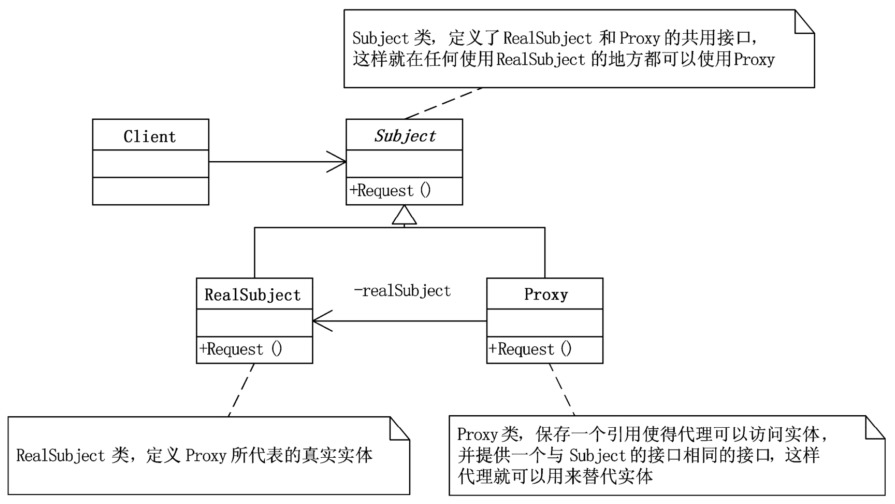

- Subject（抽象主题）： 抽象类，通过接口或抽象类声明真实主题和代理对象实现的业务方法。
- RealSubject（真实主题）：定义了Proxy所代表的真实对象，是客户端最终要访问的对象。
- Proxy（代理）：包含一个引用，该引用可以是RealSubject的实例，控制对RealSubject的访问，并可能负责创建和删除RealSubject的实例。

```java
// 1. 定义抽象主题
interface Subject {
    void request();
}

// 2. 定义真实主题
class RealSubject implements Subject {
    @Override
    public void request() {
        System.out.println("RealSubject handles the request.");
    }
}

// 3. 定义代理
class Proxy implements Subject {
    // 包含一个引用
    private RealSubject realSubject;

    @Override
    public void request() {
        // 在访问真实主题之前可以添加额外的逻辑
        if (realSubject == null) {
            realSubject = new RealSubject();
        }
        // 调用真实主题的方法
        realSubject.request();

        // 在访问真实主题之后可以添加额外的逻辑
    }
}

// 4. 客户端使用代理
public class Main {
    public static void main(String[] args) {
        // 使用代理
        Subject proxy = new Proxy();
        proxy.request();
    }
}
```

一方面，我们需要在代理类中，将原始类中的所有的方法，都重新代理一遍，并且为每个方法都附加相似的代码逻辑。另一方面，如果要添加的附加功能的类有不止一个，我们需要针对每个类都创建一个代理类。这会导致项目中类的个数成倍增加，增加了代码维护成本。并且，每个代理类中的代码都有点像模板式的“重复”代码，也增加了不必要的开发成本。

我们可以使用动态代理来解决这个问题。所谓**动态代理（Dynamic Proxy）**，就是我们不事先为每个原始类编写代理类，而是在运行的时候，动态地创建原始类对应的代理类，然后在系统中用代理类替换掉原始类。


**JDK动态代理**：

JDK 动态代理依赖于 Java 的反射机制，要求被代理的对象必须实现至少一个接口。

```java
import java.lang.reflect.InvocationHandler;
import java.lang.reflect.Method;
import java.lang.reflect.Proxy;

// 抽象主题接口
interface Subject {
    void request();
}

// 真实主题类
class RealSubject implements Subject {
    @Override
    public void request() {
        System.out.println("RealSubject: Handling request.");
    }
}

// 代理类的调用处理器
class DynamicProxyHandler implements InvocationHandler {
    private final Object realSubject;

    public DynamicProxyHandler(Object realSubject) {
        this.realSubject = realSubject;
    }

    @Override
    public Object invoke(Object proxy, Method method, Object[] args) throws Throwable {
        System.out.println("Proxy: Before method " + method.getName());
        Object result = method.invoke(realSubject, args);
        System.out.println("Proxy: After method " + method.getName());
        return result;
    }
}

// 客户端代码
public class Client {
    public static void main(String[] args) {
        // 创建真实主题
        RealSubject realSubject = new RealSubject();

        // 创建代理
        Subject proxy = (Subject) Proxy.newProxyInstance(
                realSubject.getClass().getClassLoader(),
                realSubject.getClass().getInterfaces(),
                new DynamicProxyHandler(realSubject)
        );

        // 调用代理方法
        proxy.request(); // 输出: Proxy: Before method request
                         //       RealSubject: Handling request.
                         //       Proxy: After method request
    }
}
```


**CGLIB 动态代理:**

CGLIB（Code Generation Library） 是一种基于继承的动态代理方式，能够为没有实现接口的类生成代理。CGLIB 通过字节码生成技术生成子类来覆盖非 `final` 方法，进而实现动态代理。

```java
import net.sf.cglib.proxy.Enhancer;
import net.sf.cglib.proxy.MethodInterceptor;
import net.sf.cglib.proxy.MethodProxy;
import java.lang.reflect.Method;

// 真实主题类，不实现接口
class RealSubject {
    public void request() {
        System.out.println("RealSubject: Handling request.");
    }
}

// 代理类的调用处理器
class CglibProxyHandler implements MethodInterceptor {
    @Override
    public Object intercept(Object obj, Method method, Object[] args, MethodProxy proxy) throws Throwable {
        System.out.println("CGLIB Proxy: Before method " + method.getName());
        Object result = proxy.invokeSuper(obj, args);
        System.out.println("CGLIB Proxy: After method " + method.getName());
        return result;
    }
}

// 客户端代码
public class Client {
    public static void main(String[] args) {
        // 创建代理对象
        Enhancer enhancer = new Enhancer();
        enhancer.setSuperclass(RealSubject.class);
        enhancer.setCallback(new CglibProxyHandler());

        RealSubject proxy = (RealSubject) enhancer.create();
        proxy.request(); // 输出: CGLIB Proxy: Before method request
                         //       RealSubject: Handling request.
                         //       CGLIB Proxy: After method request
    }
}
```


### **桥接模式**

将抽象和实现解耦，让它们可以独立变化。

实现系统可能有多角度分类，每一种分类都有可能变化，那么就把这种多角度分离出来让它们独立变化，减少它们之间的耦合。

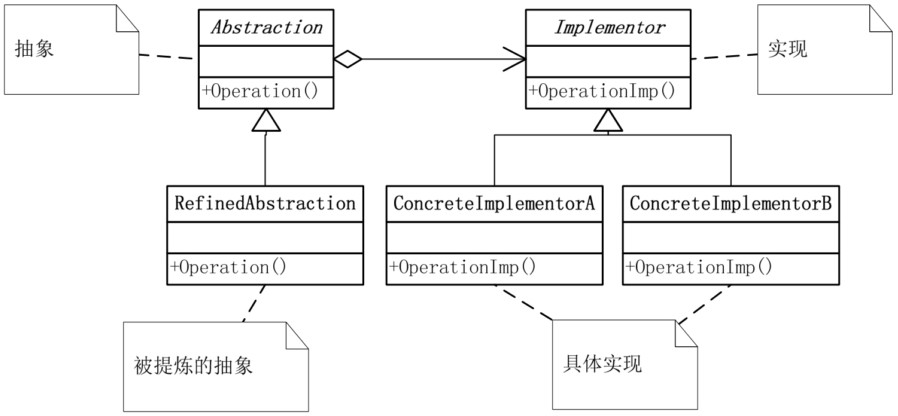

- 抽象`Abstraction`：一般是抽象类，定义抽象部分的接口，维护一个对【实现】的引用。
- 精确抽象`RefinedAbstaction`：对抽象接口进行扩展，通常对抽象化的不同维度进行变化或定制。
- 实现`Implementor`： 定义实现部分的接口，提供具体的实现。这个接口通常是抽象化接口的实现。
- 具体实现`ConcreteImplementor`：实现实现化接口的具体类。这些类负责实现实现化接口定义的具体操作。


假设我们要设计一个图形绘制系统，该系统可以绘制不同类型的图形（如圆形、正方形），并且可以使用不同的颜色（如红色、绿色）来绘制。我们可以使用桥接模式来将图形和颜色的抽象进行分离，使它们能够独立变化。

```java
// 实现部分接口
interface Color {
    void applyColor();
}

// 具体实现部分 - 红色
class RedColor implements Color {
    @Override
    public void applyColor() {
        System.out.println("Applying red color");
    }
}

// 具体实现部分 - 绿色
class GreenColor implements Color {
    @Override
    public void applyColor() {
        System.out.println("Applying green color");
    }
}

// 抽象部分
abstract class Shape {
    protected Color color;

    protected Shape(Color color) {
        this.color = color;
    }

    abstract void draw();
}

// 精确抽象部分 - 圆形
class Circle extends Shape {
    public Circle(Color color) {
        super(color);
    }

    @Override
    void draw() {
        System.out.print("Drawing Circle with ");
        color.applyColor();
    }
}

// 精确抽象部分 - 正方形
class Square extends Shape {
    public Square(Color color) {
        super(color);
    }

    @Override
    void draw() {
        System.out.print("Drawing Square with ");
        color.applyColor();
    }
}

// 客户端代码
public class Client {
    public static void main(String[] args) {
        Shape redCircle = new Circle(new RedColor());
        redCircle.draw();  // 输出: Drawing Circle with Applying red color

        Shape greenSquare = new Square(new GreenColor());
        greenSquare.draw();  // 输出: Drawing Square with Applying green color
    }
}
```


### **装饰器模式**

通常情况下，扩展类的功能可以通过继承实现，但是扩展越多，子类越多，**装饰模式可以在不定义子类的情况下动态的给对象添加一些额外的功能**。具体的做法是将原始对象放入装饰类，从而为原始对象动态添加新的行为，而无需修改其代码。

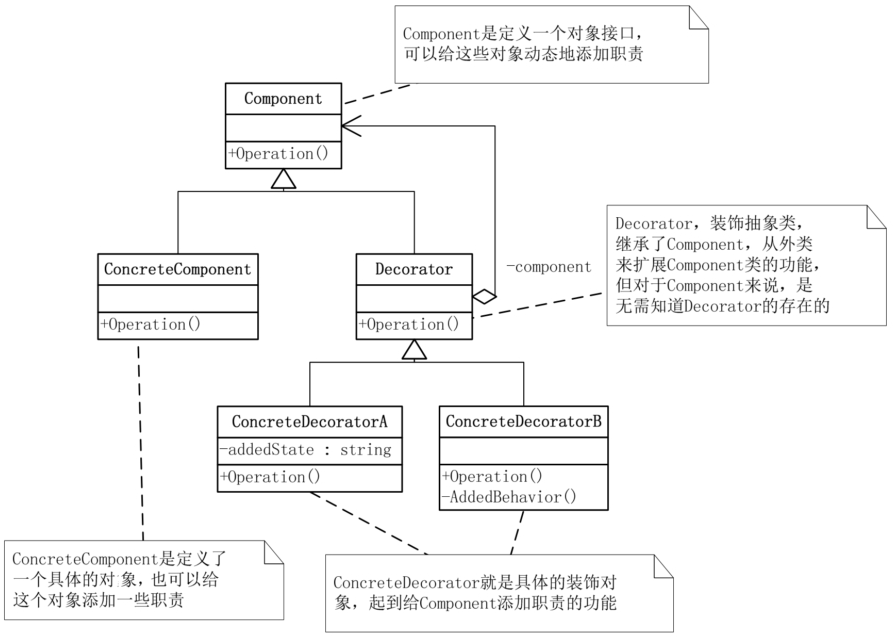

- 组件`Component`：通常是抽象类或者接口，是具体组件和装饰者的父类，定义了具体组件需要实现的方法。
- 具体组件`ConcreteComponent`: 实现了Component接口的具体类，是被装饰的对象。
- 装饰类`Decorator`: 一个抽象类，给具体组件添加功能，但是具体的功能由其子类具体装饰者完成，持有一个指向Component对象的引用。
- 具体装饰类`ConcreteDecorator`: 扩展Decorator类，负责向Component对象添加新的行为。

```java
// 抽象组件
public interface Component {
    void operation();
}

// 具体组件（被装饰者）
public class ConcreteComponent implements Component {
    @Override
    public void operation() {
        System.out.println("Executing ConcreteComponent operation");
    }
}

// 抽象装饰器
public abstract class Decorator implements Component {
    protected Component component;

    public Decorator(Component component) {
        this.component = component;
    }

    @Override
    public void operation() {
        component.operation(); // 调用原始组件的方法
    }
}

// 具体装饰器A
public class ConcreteDecoratorA extends Decorator {
    public ConcreteDecoratorA(Component component) {
        super(component);
    }

    @Override
    public void operation() {
        super.operation();  // 执行原始组件的操作
        addedBehaviorA();   // 增强功能A
    }

    private void addedBehaviorA() {
        System.out.println("Adding behavior from ConcreteDecoratorA");
    }
}

// 具体装饰器B
public class ConcreteDecoratorB extends Decorator {
    public ConcreteDecoratorB(Component component) {
        super(component);
    }

    @Override
    public void operation() {
        super.operation();  // 执行原始组件的操作
        addedBehaviorB();   // 增强功能B
    }

    private void addedBehaviorB() {
        System.out.println("Adding behavior from ConcreteDecoratorB");
    }
}

public class Main {
    public static void main(String[] args) {
        // 创建基本组件
        Component component = new ConcreteComponent();
        System.out.println("Original component:");
        component.operation();

        // 使用装饰器A包装组件
        Component decoratorA = new ConcreteDecoratorA(component);
        System.out.println("\nAfter decorating with A:");
        decoratorA.operation();

        // 使用装饰器B包装装饰器A
        Component decoratorB = new ConcreteDecoratorB(decoratorA);
        System.out.println("\nAfter decorating with A and B:");
        decoratorB.operation();
    }
}
```


在Java的I/O库中，装饰者模式被广泛用于增强I/O流的功能。例如，`BufferedInputStream`和`BufferedOutputStream`这两个类提供了缓冲区的支持，通过在底层的输入流和输出流上添加缓冲区，提高了读写的效率，它们都是`InputStream`和`OutputStream`的装饰器。


### **适配器模式**

它将不兼容的接口转换为可兼容的接口，让原本由于接口不兼容而不能一起工作的类可以一起工作。

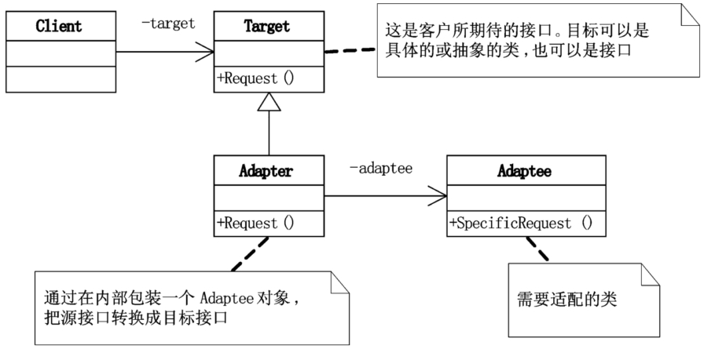

- 目标接口`Target`: 客户端希望使用的接口
- 适配器类`Adapter`: 实现客户端使用的目标接口，持有一个需要适配的类实例。
- 被适配者`Adaptee`: 需要被适配的类

```java
// 目标接口
interface Target {
    void request();
}

// 被适配者类
class Adaptee {
    void specificRequest() {
        System.out.println("Specific request");
    }
}

// 适配器类
class Adapter implements Target {
    // 持有一个被适配者实例
    private Adaptee adaptee;

    public Adapter(Adaptee adaptee) {
        this.adaptee = adaptee;
    }

    @Override
    public void request() {
        // 调用被适配者类的方法
        adaptee.specificRequest();
    }
}

// 客户端代码
public class Client {
    public static void main(String[] args) {
        Target target = new Adapter(new Adaptee());
        target.request();
    }
}
```


应用场景：

* 封装有缺陷的接口设计：假设我们依赖的外部系统在接口设计方面有缺陷（比如包含大量静态方法），引入之后会影响到我们自身代码的可测试性。为了隔离设计上的缺陷，我们希望对外部系统提供的接口进行二次封装，抽象出更好的接口设计。
* 统一多个类的接口设计：某个功能的实现依赖多个外部系统（或者说类）。通过适配器模式，将它们的接口适配为统 一的接口定义，然后我们就可以使用多态的特性来复用代码逻辑。
* 替换依赖的外部系统：把项目中依赖的一个外部系统替换为另一个外部系统的时候，利用适配器模式，可以减少对代码的改动。
* 兼容老版本接口
* 适配不同格式数据


**代理、桥接、装饰器、适配器 4 种设计模式的区别**：

代理模式：代理模式在不改变原始类接口的条件下，为原始类定义一个代理类，主要目的是控制访问，而非加强功能，这是它跟装饰器模式最大的不同。 

桥接模式：桥接模式的目的是将接口部分和实现部分分离，从而让它们可以较为容易、也相对独立地加以改变。

装饰器模式：装饰者模式在不改变原始类接口的情况下，对原始类功能进行增强，并且支持多个装饰器的嵌套使用。 

适配器模式：适配器模式是一种事后的补救策略。适配器提供跟原始类不同的接口，而代理模式、装饰器模式提供的都是跟原始类相同的接口。


### **门面模式/外观模式**

门面模式为子系统提供一组统一的接口，定义一组高层接口让子系统更易用。

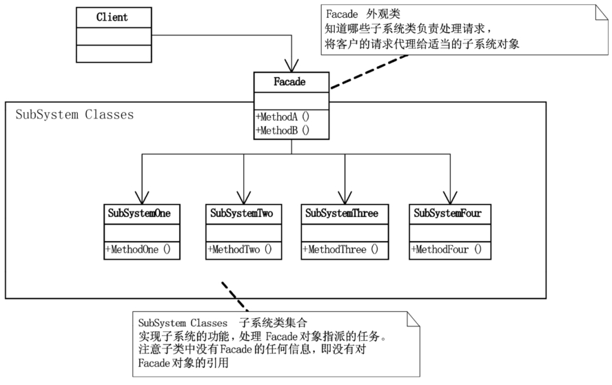

假设有一个系统 A，提供了 a、b、c、d 四个接口。系统 B 完成某个业务功能，需要调用 A 系统的 a、b、d 接口。利用门面模式，我们提供一个包裹 a、b、d 接口调用的门面接口 x，给系统 B 直接使用。

```java
// 子系统A
class SubsystemA {
    public void operationA() {
        System.out.println("SubsystemA operation");
    }
}

// 子系统B
class SubsystemB {
    public void operationB() {
        System.out.println("SubsystemB operation");
    }
}

// 子系统C
class SubsystemC {
    public void operationC() {
        System.out.println("SubsystemC operation");
    }
}

// 外观类
class Facade {
    private SubsystemA subsystemA;
    private SubsystemB subsystemB;
    private SubsystemC subsystemC;

    public Facade() {
        this.subsystemA = new SubsystemA();
        this.subsystemB = new SubsystemB();
        this.subsystemC = new SubsystemC();
    }

    // 外观方法，封装了对子系统的操作
    public void facadeOperation() {
        subsystemA.operationA();
        subsystemB.operationB();
        subsystemC.operationC();
    }
}

// 客户端
public class Main {
    public static void main(String[] args) {
        // 创建外观对象
        Facade facade = new Facade();

        // 客户端通过外观类调用子系统的操作
        facade.facadeOperation();
    }
}
```


应用场景：

* 解决易用性问题：用来封装系统的底层实现，隐藏系统的复杂性，提供一组更加简单易用、更高层的接口。
* 解决性能问题：我们通过将多个接口调用替换为一个门面接口调用，减少网络通信成本，提高 App 客户端的响应速度。
* 解决分布式事务问题：设计一个包裹两个操作的新接口，让新接口在一个事务中执行。


### **组合模式**

将对象组合成树状结构来表示“部分-整体”的层次关系。组合模式使得客户端可以统一处理单个对象和对象的组合，而无需区分它们的具体类型。

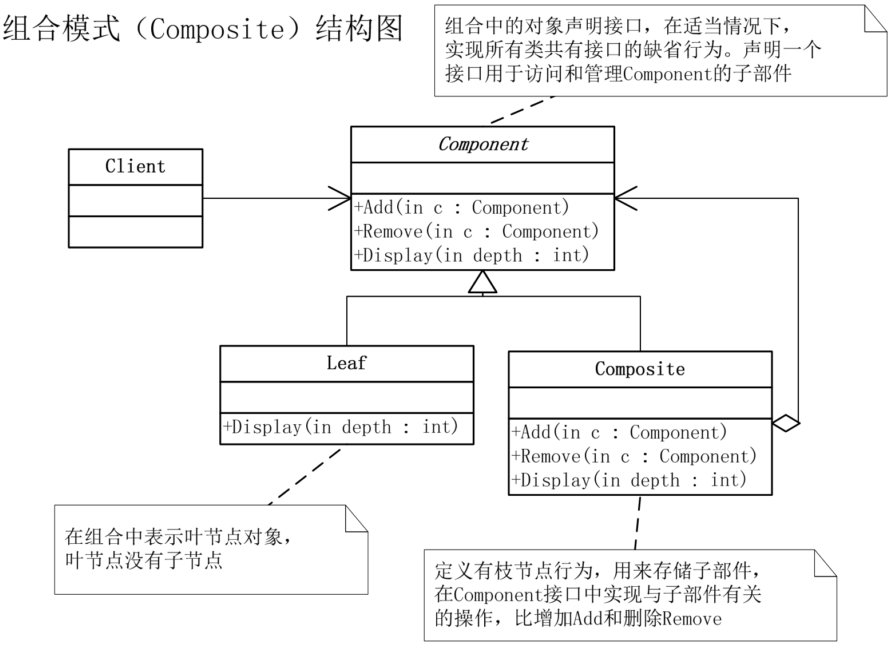

- `Component`组件： 定义了组合对象和叶子对象的共同接口，包括对子对象的管理方法，如 `add`、`remove` 等，以及通用的操作方法。
- `Leaf`叶子：实现了 `Component` 接口，表示树的叶子节点，叶子节点没有子节点。
- `Composite`组合： 实现了 `Component` 接口，表示树的非叶子节点，可以包含子节点（包括其他组合节点和叶子节点）。


设计一个类来表示文件系统中的目录，能方便地实现下面这些功能：动态地添加、删除某个目录下的子目录或文件； 统计指定目录下的文件个数； 统计指定目录下的文件总大小。

```java
// 组件类：定义所有部门的公共方法
public abstract class Department {
    protected String name;

    public Department(String name) {
        this.name = name;
    }

    public abstract void display();
}

// 叶子节点类：代表最底层的部门，没有子部门
public class ConcreteDepartment extends Department {

    public ConcreteDepartment(String name) {
        super(name);
    }

    @Override
    public void display() {
        System.out.println("部门名称：" + name);
    }
}

import java.util.ArrayList;
import java.util.List;

// 组合节点类：具有子部门的部门
public class CompositeDepartment extends Department {
    private List<Department> subDepartments = new ArrayList<>();

    public CompositeDepartment(String name) {
        super(name);
    }

    // 添加子部门
    public void add(Department department) {
        subDepartments.add(department);
    }

    // 移除子部门
    public void remove(Department department) {
        subDepartments.remove(department);
    }

    // 显示该部门及其所有子部门
    @Override
    public void display() {
        System.out.println("复合部门名称：" + name);
        for (Department department : subDepartments) {
            department.display();
        }
    }
}

public class CompositePatternDemo {
    public static void main(String[] args) {
        // 创建叶子节点（具体部门）
        Department salesDept = new ConcreteDepartment("销售部门");
        Department marketingDept = new ConcreteDepartment("市场部门");

        // 创建组合节点（复合部门）
        CompositeDepartment headOffice = new CompositeDepartment("总部");
        headOffice.add(salesDept);
        headOffice.add(marketingDept);

        // 创建一个子复合部门
        Department regionalOffice = new CompositeDepartment("区域办事处");
        Department localSalesDept = new ConcreteDepartment("本地销售部门");
        regionalOffice.add(localSalesDept);

        // 总部有子部门和区域办事处
        headOffice.add(regionalOffice);

        // 显示结构
        headOffice.display();
    }
}
```


### **享元模式**

所谓“享元”，顾名思义就是被共享的单元。享元模式的意图是复用对象，节省内存，前提是享元对象是不可变对象。


享元模式的代码实现非常简单，主要是通过工厂模式，在工厂类中，通过一个 Map 或者 List 来缓存已经创建好的享元对象，以达到复用的目的。


**享元模式 VS 单例、缓存、对象池：**

享元模式跟单例的区别：在单例模式中，一个类只能创建一个对象，而在享元模式中，一个类可以创建多个对象，每 个对象被多处代码引用共享。

享元模式跟缓存的区别：缓存主要是为了提高访问效率，而非复用。

享元模式跟对象池的区别：池化技术中的“复用”可以理解为“重复使用”，主要目的是节省时间（比如从数据库池中取一个连接，不需要重新创建）。在任意时刻，每一个对象、连接、线程，并不会被多处使用，而是被一个使用者独占，当使用完成之后，放回到池中，再由其他使用者重复利用。享元模式中的“复用”可以理解为“共享使用”，在整个生命周期中，都是被所有使用者共享的，主要目的是节省空间。


**应用：**

在 Java Integer 的实现中，-128 到 127 之间的整型对象会被事先创建好，缓存在 IntegerCache 类中。当我们使用自动装箱或者 valueOf() 来创建这个数值区间的整型对象时，会复用 IntegerCache 类事先创建好的对象。

在 Java String 类的实现中，JVM 开辟一块存储区专门存储字符串常量，这块存储区叫作字符串常量池，类似于 Integer 中的 IntegerCache。不过，跟 IntegerCache 不同的是，它并非事先创建好需要共享的对象，而是在程序的运行期间，根据需要来创建和缓存字符串常量。


## **行为型**

### **观察者模式**/发布-订阅模式

观察者模式定义了一种一对多的依赖关系，让多个观察者对象同时监听某一个主题对象。这个主题对象在状态发生变化时，会通知所有观察者对象，使它们能够自动更新自己。

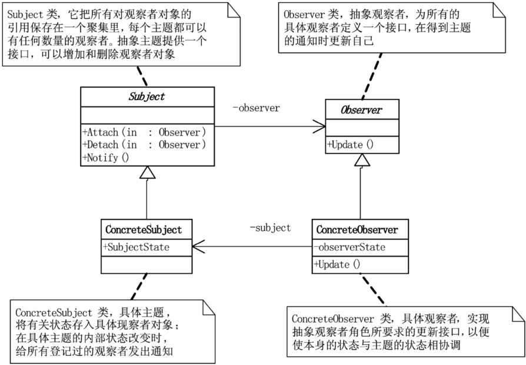

* **Subject**：称为主题或抽象通知者，维护一组观察者对象，提供注册和删除观察者的接口，以及通知观察者的方法。

* **Observer**：抽象观察者，为所有的具体观察者定义一个接口，在得到主题的通知时更新自己。

* **ConcreteSubject**：实现被观察者接口，维护其状态的变化，并在状态变化时通知观察者。

* **ConcreteObserver**：实现观察者接口，定义具体的更新方法，以便在被观察者状态变化时更新自身状态或执行相应操作。

```java
// 主题接口 （主题）
interface Subject {
    // 观察者列表
    private List<Observer> observers = new ArrayList<>();
    
    // 注册观察者
    void registerObserver(Observer observer);
    // 移除观察者
    void removeObserver(Observer observer);
    // 通知观察者
    void notifyObservers();
}

// 观察者接口 (观察者)
interface Observer {
    // 更新方法
    void update(String message);
}

// 具体主题实现
class ConcreteSubject implements Subject {
    // 状态
    private String state;
	
    // 注册观察者
    @Override
    public void registerObserver(Observer observer) {
        observers.add(observer);
    }
	// 移除观察者
    @Override
    public void removeObserver(Observer observer) {
        observers.remove(observer);
    }
	// 通知观察者
    @Override
    public void notifyObservers() {
        for (Observer observer : observers) {
            // 观察者根据传递的信息进行处理
            observer.update(state);
        }
    }
	// 更新状态
    public void setState(String state) {
        this.state = state;
        notifyObservers();
    }
}

// 具体观察者实现
class ConcreteObserver implements Observer {
    // 更新方法
    @Override
    public void update(String message) {
    }
}

public class ObserverPatternDemo {
    public static void main(String[] args) {
        // 创建被观察者
        ConcreteSubject subject = new ConcreteSubject();

        // 创建观察者
        Observer observer1 = new ConcreteObserver("观察者1");
        Observer observer2 = new ConcreteObserver("观察者2");
        Observer observer3 = new ConcreteObserver("观察者3");

        // 注册观察者
        subject.registerObserver(observer1);
        subject.registerObserver(observer2);
        subject.registerObserver(observer3);

        // 发送通知
        subject.setState("第一个通知");

        // 移除一个观察者
        subject.removeObserver(observer2);

        // 发送另一个通知
        subject.setState("第二个通知");
    }
}
```

观察者模式有几种不同的实现方式，包括：同步阻塞、异步非阻塞、进程内、进程间的实现方式。 同步阻塞是最经典的实现方式，主要是为了代码解耦；异步非阻塞除了能实现代码解耦之 外，还能提高代码的执行效率；进程间的观察者模式解耦更加彻底，一般是基于消息队列来实现，用来实现不同进程间的被观察者和观察者之间的交互。


### **模板模式**

模板方法模式在一个方法中定义一个算法骨架，并将某些步骤推迟到子类中实现。模板方法模式可以让子类在不改变算法整体结构的情况下，重新定义算法中的某些步骤。

模板模式主要是用来解决复用和扩展两个问题。模板方法模式是通过把不变行为搬移到超类，去除子类中的重复代码来体现它的优势。

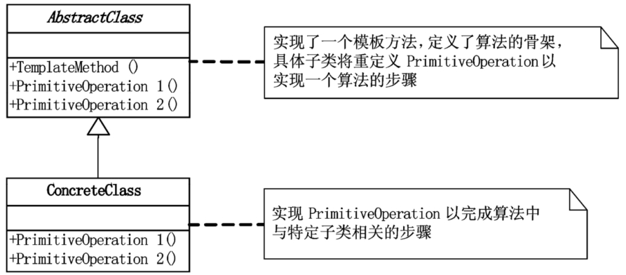

- 模板类`AbstractClass`：由一个模板方法和若干个基本方法构成，模板方法定义了逻辑的骨架，按照顺序调用包含的基本方法，基本方法通常是一些抽象方法，这些方法由子类去实现。基本方法还包含一些具体方法，它们是算法的一部分但已经有默认实现，在具体子类中可以继承或者重写。
- 具体类`ConcreteClass`：继承自模板类，实现了在模板类中定义的抽象方法，以完成算法中特定步骤的具体实现。


```java
// 模板类
abstract class AbstractClass {
    // 模板方法，定义了算法的骨架, final避免被重写
    public final void templateMethod() {
        step1();
        step2();
    }

    // 抽象方法，强迫子类重写
    protected abstract void step1();
    protected abstract void step2();
}

// 具体类A
class ConcreteClassA extends AbstractClass {
    @Override
    protected void step1() {
        System.out.println("Step 1 ");
    }

    @Override
    protected void step2() {
        System.out.println("Step 2 ");
    }
}

// 具体类B
class ConcreteClassB extends AbstractClass {
    @Override
    protected void step1() {
        System.out.println("Step 1 ");
    }

    @Override
    protected void step2() {
        System.out.println("Step 2 ");
    }

}

public class Main {
    public static void main(String[] args) {
        AbstractClass concreteTemplate = new ConcreteClassA();
        // 触发整个算法的执行
        concreteTemplate.templateMethod();
    }
}
```


### **策略模式**

定义一族算法类，将每个算法分别封装起来，让它们可以互相替换，此模式让算法的变化，不会影响到使用算法的客户。

工厂模式是解耦对象的创建和使用，观察者模式是解耦观察者和被观察者。策略模式跟两者类似，也能起到解耦的作用，不过，它解耦的是策略的定义、创建、使用这三部分。

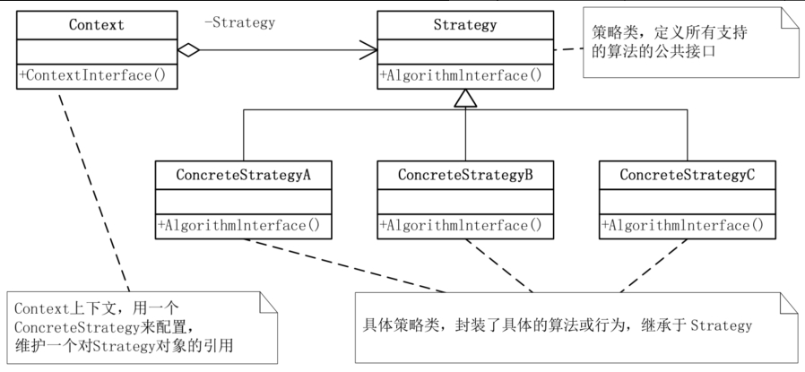

- 策略类`Strategy`: 定义所有支持的算法的公共接口。
- 具体策略类`ConcreteStrategy`: 实现了策略接口，提供具体的算法实现。
- 上下文类`Context`: 包含一个策略实例，并在需要时调用策略对象的方法。


策略的定义：

```java
// 策略接口
public interface Strategy {
    void execute();
}

// 具体策略A
public class ConcreteStrategyA implements Strategy {
    @Override
    public void execute() {
        System.out.println("Executing Strategy A");
    }
}

// 具体策略B
public class ConcreteStrategyB implements Strategy {
    @Override
    public void execute() {
        System.out.println("Executing Strategy B");
    }
}

// 具体策略C
public class ConcreteStrategyC implements Strategy {
    @Override
    public void execute() {
        System.out.println("Executing Strategy C");
    }
}

// 上下文类
public class Context {
    private Strategy strategy;

    // 构造函数，初始化策略
    public Context(Strategy strategy) {
        this.strategy = strategy;
    }

    // 设置策略
    public void setStrategy(Strategy strategy) {
        this.strategy = strategy;
    }

    // 执行策略
    public void executeStrategy() {
        strategy.execute();
    }
}

public class Main {
    public static void main(String[] args) {
        Context context = new Context();

        // 使用策略A
        context.setStrategy(new ConcreteStrategyA());
        context.executeStrategy();  // 输出: Executing Strategy A

        // 使用策略B
        context.setStrategy(new ConcreteStrategyB());
        context.executeStrategy();  // 输出: Executing Strategy B

        // 使用策略C
        context.setStrategy(new ConcreteStrategyC());
        context.executeStrategy();  // 输出: Executing Strategy C
    }
}
```


策略的创建：

```java
public class StrategyFactory {
    private static final Map<String, Strategy> strategies = new HashMap<>();
    static {
        strategies.put("A", new ConcreteStrategyA());
        strategies.put("B", new ConcreteStrategyB());
    }
    public static Strategy getStrategy(String type) {
        if (type == null || type.isEmpty()) {
            throw new IllegalArgumentException("type should not be empty.");
        }
        return strategies.get(type);
    }
}
```

一般来讲，如果策略类是无状态的，不包含成员变量，只是纯粹的算法实现，这样的策略对象是可以被共享使用的，不需要在每次调用 getStrategy() 的时候，都创建一个新的策略对象。针对这种情况，我们可以使用上面这种工厂类的实现方式，事先创建好每个策略对象， 缓存到工厂类中，用的时候直接返回。

相反，如果策略类是有状态的，根据业务场景的需要，我们希望每次从工厂方法中，获得的都是新创建的策略对象，而不是缓存好可共享的策略对象，那我们就需要按照如下方式来实现策略工厂类。

```java
public class StrategyFactory {
    public static Strategy getStrategy(String type) {
        if (type == null || type.isEmpty()) {
            throw new IllegalArgumentException("type should not be empty.");
        }
        if (type.equals("A")) {
            return new ConcreteStrategyA();
        } else if (type.equals("B")) {
            return new ConcreteStrategyB();
        }
        return null;
    }
}
```


策略的使用：

我们事先并不知道会使用哪个策略，而是在程序运行期间， 根据配置、用户输入、计算结果等这些不确定因素，动态决定使用哪种策略。


### **责任链模式**

将请求的发送和接收解耦，让多个接收对象都有机会处理这个请求。将这些接收对象串成一条链，并沿着这条链传递这个请求，直到链上的某个接收对象能够处理它为止。

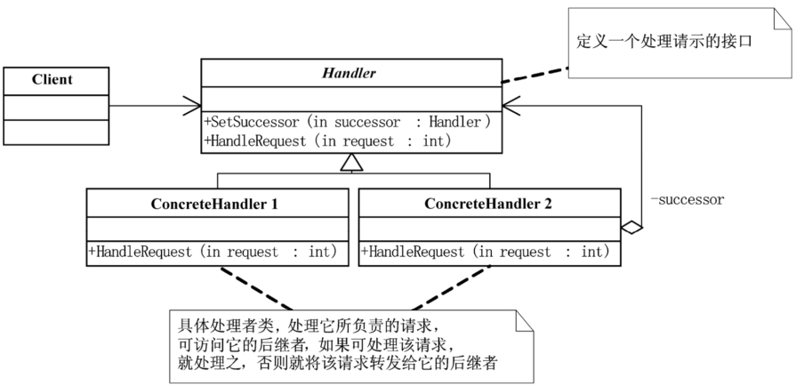

在职责链模式中，多个处理器（也就是“接收对象”）依次处理同一个请求。一个请求先经过 A 处理器处理，然后再把请求传递给 B 处理器，B 处理器处理完后再传递给 C 处理器，以此类推，形成一个链条。链条上的每个处理器各自承担各自的处理职责，所以叫作职责链模式。

```java
// 处理请求的基类
public abstract class Handler {
    protected Handler nextHandler;

    // 设置下一个处理者
    public void setNextHandler(Handler nextHandler) {
        this.nextHandler = nextHandler;
    }

    // 抽象方法，处理请求
    public abstract void handleRequest(int request);
}

// 具体处理者 A
public class ConcreteHandlerA extends Handler {
    @Override
    public void handleRequest(int request) {
        if (request >= 0 && request < 10) {
            System.out.println("Handler A handles request " + request);
        } else if (nextHandler != null) {
            nextHandler.handleRequest(request);
        }
    }
}

// 具体处理者 B
public class ConcreteHandlerB extends Handler {
    @Override
    public void handleRequest(int request) {
        if (request >= 10 && request < 20) {
            System.out.println("Handler B handles request " + request);
        } else if (nextHandler != null) {
            nextHandler.handleRequest(request);
        }
    }
}

// 具体处理者 C
public class ConcreteHandlerC extends Handler {
    @Override
    public void handleRequest(int request) {
        if (request >= 20 && request < 30) {
            System.out.println("Handler C handles request " + request);
        } else if (nextHandler != null) {
            nextHandler.handleRequest(request);
        }
    }
}

public class Main {
    public static void main(String[] args) {
        // 创建具体的处理者
        Handler handlerA = new ConcreteHandlerA();
        Handler handlerB = new ConcreteHandlerB();
        Handler handlerC = new ConcreteHandlerC();

        // 构建职责链
        handlerA.setNextHandler(handlerB);
        handlerB.setNextHandler(handlerC);

        // 测试请求
        System.out.println("Sending request 5:");
        handlerA.handleRequest(5);   // Handler A handles the request

        System.out.println("\nSending request 15:");
        handlerA.handleRequest(15);  // Handler B handles the request

        System.out.println("\nSending request 25:");
        handlerA.handleRequest(25);  // Handler C handles the request

        System.out.println("\nSending request 50:");
        handlerA.handleRequest(50);  // No handler for request, no output
    }
}
```

在 GoF 给出的定义中，如果处理器链上的某个处理器能够处理这个请求，那就不会继续往下传递请求。实际上，职责链模式还有一种变体，那就是请求会被所有的处理器都处理一 遍，不存在中途终止的情况。

### **状态模式**

适用于一个对象在在不同的状态下有不同的行为时，比如说电灯的开、关状态，状态不同时，对应的行为也不同。

在没有状态模式的情况下，为了添加新的状态或修改现有的状态，往往需要修改已有的代码，这违背了开闭原则，而且如果对象的状态切换逻辑和各个状态的行为都在同一个类中实现，就可能导致该类的职责过重，不符合单一职责原则。

而状态模式将每个状态的行为封装在一个具体状态类中，使得每个状态类相对独立，并将对象在不同状态下的行为进行委托，从而使得对象的状态可以在运行时动态改变，每个状态的实现也不会影响其他状态。

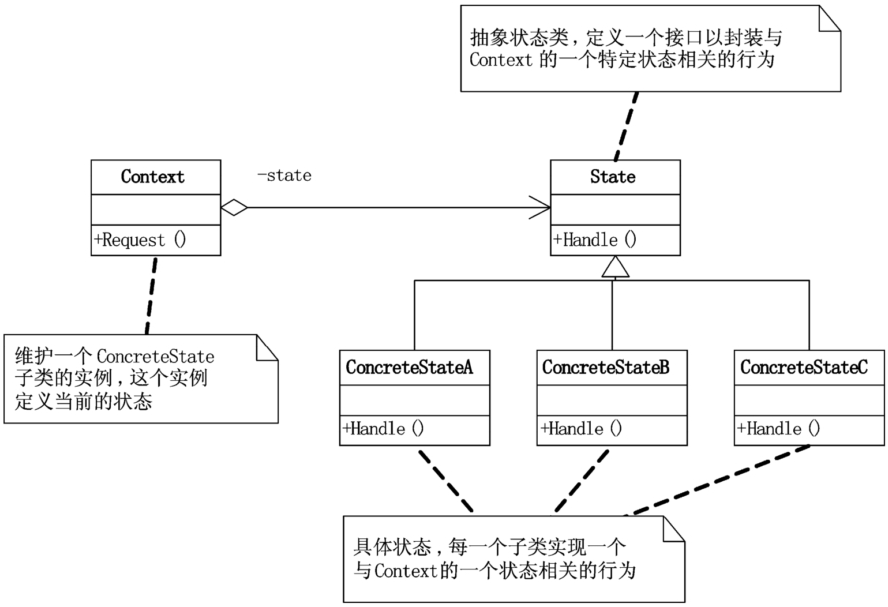

- `State`（状态）： 定义一个接口，用于封装与Context的一个特定状态相关的行为。
- `ConcreteState`（具体状态）： 负责处理Context在状态改变时的行为, 每一个具体状态子类实现一个与`Context`的一个状态相关的行为。
- `Context`（上下文）: 维护一个具体状态子类的实例，这个实例定义当前的状态。

```java
// State interface 定义状态行为
interface State {
    void pressSwitch(LightContext context);
}

// ConcreteState On 具体状态：电灯开
class OnState implements State {
    @Override
    public void pressSwitch(LightContext context) {
        System.out.println("Switching light off.");
        context.setState(new OffState()); // 设置下一个状态
    }
}

// ConcreteState Off 具体状态：电灯关
class OffState implements State {
    @Override
    public void pressSwitch(LightContext context) {
        System.out.println("Switching light on.");
        context.setState(new OnState());
    }
}

// Context 电灯上下文
class LightContext {
    private State currentState;

    public LightContext() {
        // 初始状态为关
        currentState = new OffState();
    }

    public void setState(State state) {
        currentState = state;
    }

    public void pressSwitch() {
        currentState.pressSwitch(this);
    }
}

// 测试代码
public class StatePatternExample {
    public static void main(String[] args) {
        LightContext light = new LightContext();

        // 按下开关，打开灯
        light.pressSwitch();  // Output: Switching light on.

        // 再次按下开关，关闭灯
        light.pressSwitch();  // Output: Switching light off.

        // 再次按下开关，打开灯
        light.pressSwitch();  // Output: Switching light on.
    }
}
```


### **迭代器模式**

迭代器模式（Iterator），提供一种方法顺序访问一个聚合对象中各个元素，而又不暴露该对象的内部表示。迭代器模式将集合对象的遍历操作从集合类中拆分出来，放到迭代器类中，让两者的职责更加单一。

遍历集合一般有三种方式：for 循环、foreach 循环、迭代器遍历。后两种本质上属于一种，都可以看作迭代器遍历。相对于 for 循环遍历，利用迭代器来遍历有下面三个优势： 

1. 迭代器模式封装集合内部的复杂数据结构，开发者不需要了解如何遍历，直接使用容器提供的迭代器即可；
2. 迭代器模式将集合对象的遍历操作从集合类中拆分出来，放到迭代器类中，让两者的职责更加单一； 
3. 迭代器模式让添加新的遍历算法更加容易，更符合开闭原则。除此之外，因为迭代器都实现自相同的接口，在开发中，基于接口而非实现编程，替换迭代器也变得更加容易。

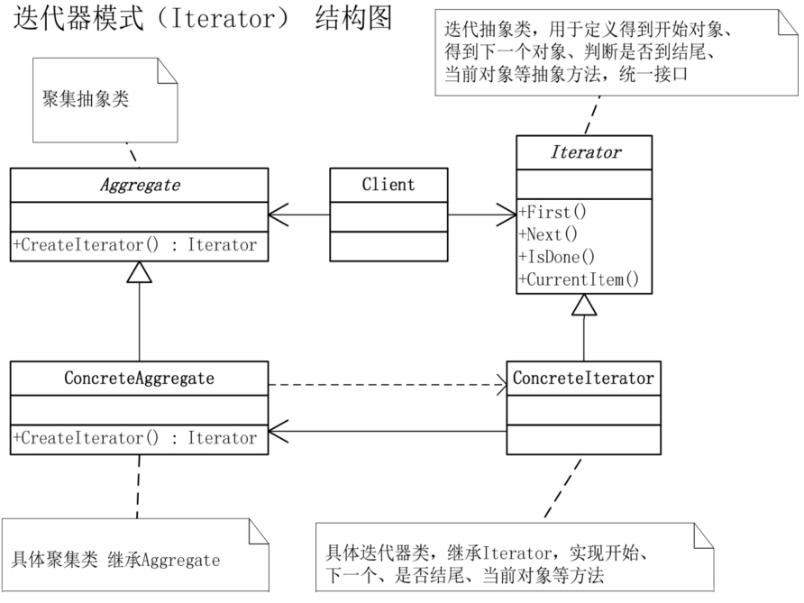

- Iterator（迭代器）：定义了遍历元素的接口，通常包括 `hasNext()` 和 `next()` 方法，用于顺序访问集合中的元素。
- ConcreteIterator（具体迭代器）：实现 `Iterator` 接口，具体负责遍历集合中的元素。
- Aggregate（聚合类）：定义创建迭代器的接口，用于获取一个迭代器实例。
- ConcreteAggregate（具体聚合类）：实现 `Aggregate` 接口，通常包含集合的内部结构，并返回一个具体的迭代器。

```java
public interface Iterator<E> {
    boolean hasNext();
    void next();
    E currentItem();
}
public class ArrayIterator<E> implements Iterator<E> {
    private int cursor;
    private ArrayList<E> arrayList;
    public ArrayIterator(ArrayList<E> arrayList) {
        this.cursor = 0;
        this.arrayList = arrayList;
    }
    @Override
    public boolean hasNext() {
        return cursor != arrayList.size(); 
    }
    @Override
    public void next() {
        cursor++;
    }
    @Override
    public E currentItem() {
        if (cursor >= arrayList.size()) {
            throw new NoSuchElementException();
        }
        return arrayList.get(cursor);
    }
}
public interface List<E> {
    Iterator iterator();
    //...省略其他接口函数...
}
public class ArrayList<E> implements List<E> {
    //...
    public Iterator iterator() {
        return new ArrayIterator(this);
    }
    //...省略其他代码
}
public class Demo {
    public static void main(String[] args) {
        List<String> names = new ArrayList<>();
        names.add("xzg");
        names.add("wang");
        names.add("zheng");
        Iterator<String> iterator = names.iterator();
        while (iterator.hasNext()) {
            System.out.println(iterator.currentItem());
            iterator.next();
        }
    }
}
```


在 Java 中，如果在使用迭代器的同时删除容器中的元素，会导致迭代器报错，这是为什么呢？如何来解决这个问题呢？

在通过迭代器来遍历集合元素的同时，增加或者删除集合中的元素，有**可能会导致某个元素被重复遍历或遍历不到**。有两种比较干脆利索的解决方案，来避免出现这种不可预期的运行结果。一种是遍历的时候不允许增删元素，另一种是增删元素之后让遍历报错。第一种解决方案比较难实现，因为很难确定迭代器使用结束的时间点。第二种解决方案更加合理。

Java 语言就是采用的第二种解决方案。增删元素之后让遍历操作直接抛出 `ConcurrentModificationException` 运行时异常。当创建一个迭代器时，迭代器会记录下集合的 `modCount` 值（表示集合修改的次数）。在遍历过程中，迭代器会不断检查集合的 `modCount` 是否发生了变化。如果在迭代器运行期间，集合的 `modCount` 发生了变化（例如直接通过集合对象删除元素），迭代器就会认为集合的结构发生了变化，于是抛出 `ConcurrentModificationException`。

像 Java 语言，迭代器类中除了前面提到的几个最基本的方法之外，还定义了一个 remove() 方法，能够在遍历集合的同时，安全地删除集合中的元素。Java 迭代器中提供的 remove() 方法作用有限。它只能删除游标指向的前一个元素，而且一个 next() 函数之后，只能跟着最多一个 remove() 操作，多次调用 remove() 操作会报错。


### **访问者模式**

允许一个或者多个操作应用到一组对象上，解耦操作和对象本身。

应用它会导致代码的可读性、可维护性变差，所以，访问者模式在实际的软件开发中很少被用到，在没有特别必要的情况下，建议你不要使用访问者模式。

不同场景下，我们需要对一组对象进行一系列不相关的业务操作 （抽取文本、压缩等），但为了避免不断添加功能导致类不断膨胀，职责越来越不单一，以及避免频繁地添加功能导致的频繁代码修改，我们使用访问者模式，将对象与操作解耦，将这些业务操作抽离出来，定义在独立细分的访问者类中。


支持双分派的语言不需要访问者模式。Single Dispatch 之所以称为“Single”，是因为执行哪个对象的哪个方法，只跟“对象”的运行时类型有关。Double Dispatch 之所以称为“Double”，是因为执行哪个对象的哪个方法，跟“对象”和“方法参数”两者的运行时类型有关。当前主流的面向对象编程语言（比如，Java、C++、C#）都只支持 Single Dispatch，不支持 Double Dispatch。

Java 支持多态特性，代码可以在运行时获得对象的实际类型，然后根据实际类型决定调用哪个方法。尽管 Java 支持函数重载，但 Java 设计的函数重载的语法规则时，并不是在运行时根据传递进函数的参数的实际类型来决定调用哪个重载函数，而是在编译时根据传递进函数的参数的声明类型来决定调用哪个重载函数。也就是说，具体执行哪个对象的哪个方法，只跟对象的运行时类型有关，跟参数的运行时类型无关。所以，Java 语言只支持 Single Dispatch。

### **备忘录模式**

备忘录模式也叫快照模式，具体来说，就是在不违背封装原则的前提下，捕获一个对象的内部状态，并在该对象之外保存这个状态，以便之后恢复对象为先前的状态。这个模式的定义表达了两部分内容：一部分是，存储副本以便后期恢复；另一部分是，要在不违背封装原则 的前提下，进行对象的备份和恢复。

备忘录模式的应用场景也比较明确和有限，主要是用来防丢失、撤销、恢复等。它跟平时我们常说的“备份”很相似。两者的主要区别在于，备忘录模式更侧重于代码的设计和实现，备份更侧重架构设计或产品设计。

### **命令模式**

命令模式（Command），将一个请求封装为一个对象，从而使你可用不同的请求对客户进行参数化；对请求排队或记录请求日志，以及支持可撤销的操作。

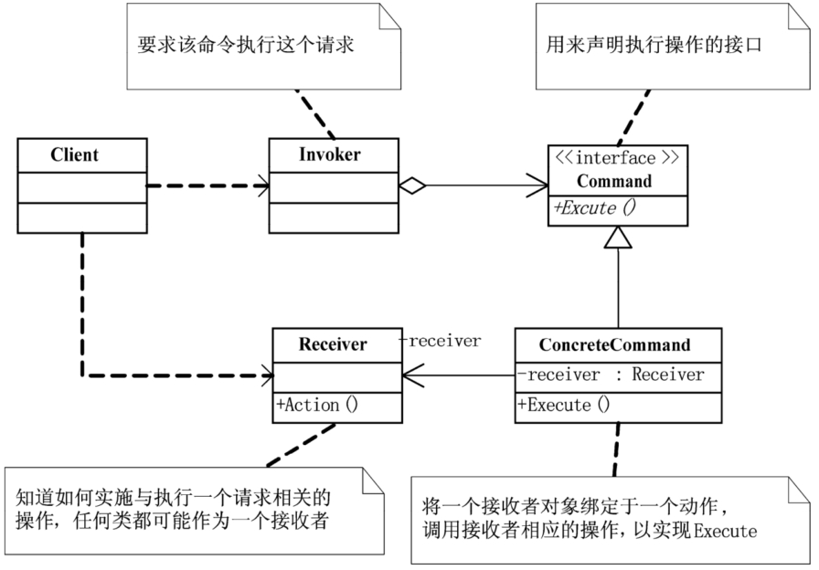

落实到编码实现，命令模式用的最核心的实现手段，是将函数封装成对象。我们知道，C 语言支持函数指针，我们可以把函数当作变量传递来传递去。但是，在大部分编程语言中，函数没法儿作为参数传递给其他函数，也没法儿赋值给变量。借助命令模式，我们可以将函数封装成对象。具体来说就是，设计一个包含这个函数的类，实例化一个对象传来传去，这样就可以实现把函数像对象一样使用。

当我们把函数封装成对象之后，对象就可以存储下来，方便控制执行。所以，命令模式的主要作用和应用场景，是用来控制命令的执行，比如，异步、延迟、排队执行命令、撤销重做命令、存储命令、给命令记录日志等等，这才是命令模式能发挥独一无二作用的地方。

```java
// 命令接口
public interface Command {
    void execute();
}

// 具体命令类（打开灯）
class TurnOnLightCommand implements Command {
    private Light light;

    public TurnOnLightCommand(Light light) {
        this.light = light;
    }

    @Override
    public void execute() {
        light.turnOn();
    }
}

// 具体命令类（关灯）
class TurnOffLightCommand implements Command {
    private Light light;

    public TurnOffLightCommand(Light light) {
        this.light = light;
    }

    @Override
    public void execute() {
        light.turnOff();
    }
}

// 接收者类
class Light {
    public void turnOn() {
        System.out.println("The light is on");
    }

    public void turnOff() {
        System.out.println("The light is off");
    }
}

// 调用者类
class RemoteControl {
    private Command command;

    public void setCommand(Command command) {
        this.command = command;
    }

    public void pressButton() {
        command.execute();
    }
}

// 客户端
public class Client {
    public static void main(String[] args) {
        // 创建接收者
        Light light = new Light();

        // 创建具体命令并指定接收者
        Command turnOn = new TurnOnLightCommand(light);
        Command turnOff = new TurnOffLightCommand(light);

        // 创建调用者并设置命令
        RemoteControl remote = new RemoteControl();

        // 执行命令
        remote.setCommand(turnOn);
        remote.pressButton();  // 输出: The light is on

        remote.setCommand(turnOff);
        remote.pressButton();  // 输出: The light is off
    }
}
```


### **解释器模式**

解释器模式为某个语言定义它的语法（或者叫文法）表示，并定义一个解释器用来处理这个语法。解释器模式只在一些特定的领域会被用到，比如编译器、规则引擎、正则表达式。

### **中介模式**

中介者模式（Mediator），用一个中介对象来封装一系列的对象交互。中介者使各对象不需要显式地相互引用，从而使其耦合松散，而且可以独立地改变它们之间的交互。

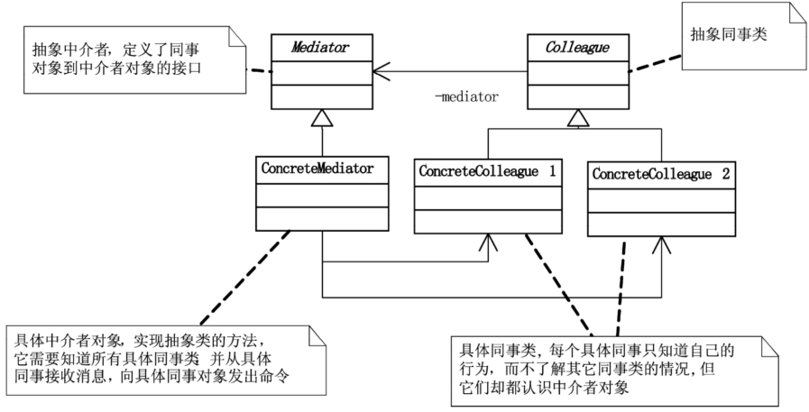

实际上，中介模式的设计思想跟中间层很像，通过引入中介这个中间层，将一组对象之间的交互关系（或者说依赖关系）从多对多（网状关系）转换为一对多（星状关系）。原来一个对象要跟 n 个对象交互，现在只需要跟一个中介对象交互，从而最小化对象之间的交互关系，降低了代码的复杂度，提高了代码的可读性和可维护性。


**代理模式 vs 中介模式**：

代理模式用于控制访问对象的行为（例如延迟初始化、权限控制等），它通过代理对象来控制对真实对象的访问，通常是一个一对一的关系。

中介模式用于协调多个对象之间的交互，它通过中介对象集中管理所有的交互，避免了对象之间直接相互依赖，通常是一个多对多的关系。