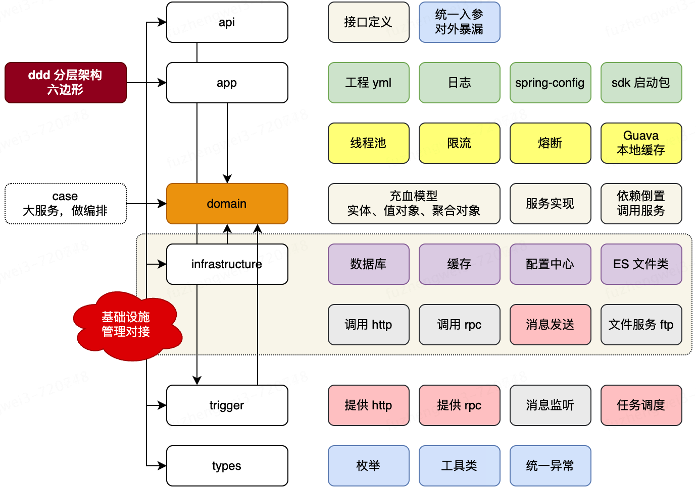

[DDD领域驱动设计理论｜得物技术领域驱动设计简称“DDD”，一套“知易行难”的方法论。同时我所工作的这些年，尤其在某大厂 - 掘金](https://juejin.cn/post/7371716397297139721?searchId=202503022149398C5C811F3D881B18269B)

## DDD是什么？

DDD 是一种软件设计方法。

DDD设计的目标是实现软件系统与业务需求的高度契合，提高开发效率和质量，同时也能更好地应对复杂性和变化性。它强调以业务为中心，通过深入领域知识和建立有效的领域模型，来驱动软件设计和开发的整个过程。

领域驱动设计是为了解决复杂软件设计的一种优秀方案，它把所有的业务规则、定义、范围、知识等抽象成了一个大的概念，叫做**领域**。比如用户支付的业务场景，叫做交易域；平台提供售后等服务叫做服务域（或客服域），还有其他诸如金融域，人效域，物流域等。它应对复杂性的思想，总结下来既简单，又精炼，叫做“**分而治之**”。把最大化的领域（复杂问题）分为下层的一个个子域，同时每个子域又规定好边界和核心实体，通过一系列的拆分、归类、衍生，最终找到最优解。

> **DDD vs MVC**

MVC架构其实很精粹，清晰，对于业务逻辑并不复杂，单一化的场景其实效率是很高的。但是随着业务的多变性和不断复杂化，MVC架构就会暴露以下问题：

1. MVC架构没有边界划分的概念和规范，在复杂的业务场景下会造成盘根交错的逻辑依赖，同时随着业务场景的不复杂化，代码意图会逐渐模糊，维护成本增加，对于系统的稳定性也会带来挑战。
2. MVC**仅反映软件架构的分层，不定义业务语义的抽象和表达**，对于业务知识的沉淀和复用性来说，不太友好。
3. MVC分割了数据和行为的表达，Model层（pojo）定义数据，Service层表述行为，会造成业务逻辑的首尾分离。

> **DDD的价值**

团队价值：

1. 统一语言
2. 清晰的边界定义：定义清晰的业务范围，避免边界纷争。
3. 面向业务建模
4. 代码直观表现设计

个人价值：

1. 提升全局视野
2. 提升业务sense

> **DDD的缺点**

1. 逻辑相对简单的业务和产品，用传统的MVC架构会更适合，构建也更快速。

2. 非业务形态产品和应用并不适合，比如bigdata。这类应用和业务专注于数据层的交互和适配，并无强业务语义类诉求，而DDD最关键的一部分就是业务领域的抽象和包装，切记，它解决的是负责业务问题。

## 核心概念

DDD这套方法论的一个完整设计流程：核心在于战略设计和战术设计

1. 首先第一步，根据业务诉求，**提炼出整体的业务流程**，同时拆解出里面的关键事件，角色，参与者等核心实例。整个拆解和梳理的方法论，目前业界有一些比较成熟的，比如事件风暴，四色建模法等。

2. 提炼完整个业务流程后，进入战略设计阶段，这个阶段主要是从全局和顶层的视角，**把整个业务语义转换为结构化分层**。通过领域和子域的划分，同时结合通用域、支撑域、限界上下文等设计，分解问题复杂度，其实就是前面说到的“分而治之”的思想。

3. 接下来就会到具体的战术设计阶段，通过前面的战略设计阶段，已经把整个领域、边界、上下文等关键模块都梳理完成，现在就是**从各个域中再次拆解更细粒度的模块**，去指导最终的编码实现，这些更细粒度的模块包括实体、聚合、聚合根等。

4. 最后就到了编码实现阶段，DDD有一个关键价值，叫做 **“设计即实现”** ，所以在战术阶段的设计，理论上是可以直接作用于代码的分层结构，如果架构和战术阶段有出入，说明之前的设计有问题，可以复盘重新推演。

**领域**

领域（Domain）是指业务问题的特定领域范围，它涉及到特定业务的规则、概念、业务流程等。领域是对业务问题进行分解和组织的基本单位。

**子域**

子域（Subdomain）是指在一个大的领域中划分出的相对独立的子领域，它通常代表一个独立的业务领域，具有特定的业务逻辑和功能需求。子域可以是整个系统的一个功能模块，也可以是一个独立的业务流程。

**通用域**

通用域（Generic Domain）是指与特定业务领域无关的通用功能，它是在整个领域中被多个子域所共享和复用的功能。通用域包括一些通用的服务、工具、组件等，用于支持多个子域的实现。

**支撑域**

支撑域（Supporting Domain）指的是与核心业务的实现和发展密切相关的非业务功能。这些支撑域可以包括安全认证、用户管理、日志记录等在整个系统中被多个子域所共享和使用的基础设施功能。支撑域和通用域概念上有些类似，区分他们的标准简单归纳下的话，支撑域是由外域提供的能力，通用域是本域提供。

**限界上下文**

限界上下文（Bounded Context）则是DDD中的一个重要概念，用于划分和隔离不同的领域或子系统。一个限界上下文指的是一个明确定义了特定业务领域所围绕的边界，它包含了领域模型、业务规则、相关的领域服务和持久化逻辑等。不同的限界上下文之间可以是相互隔离的，每个上下文内部有其自己的语言和模型，但是它们之间也需要通过明确定义的接口进行通信。

**实体**

代表领域中具有唯一身份和生命周期的对象。实体有自己的行为和状态，并通过标识属性进行唯一标识。

1. **贫血模型**：贫血模型是指领域对象只具有数据属性，缺乏相关的行为逻辑。在贫血模型中，业务逻辑主要存在于服务层或者其它外部对象中，领域对象仅被视为被动的数据容器。
2. **充血模型**：充血模型是在领域对象中充分体现了业务逻辑和行为的模型。充血模型积极地包含了数据和相关的行为逻辑，它使得领域对象能够更好地封装与之相关的业务规则和行为，提供了更加一致和抽象的编程接口。充血模型是DDD中推崇的设计模式，使得领域对象能够成为业务规则的中心。

充血模型虽然是DDD中推崇的设计模式，通过领域实体，一些关键行为和逻辑其实也能一起拿到了，但是在我的经验中，我更喜欢使用**贫血+充血的混合模型**（或者叫充血模型的简化版），因为这里涉及到一个标准的建立问题，如果只用充血模型的话，哪些行为和逻辑该下方到接口服务层，哪些又该收拢到实体中，这里面每个人的理念不一样。而我的标准是，**涉及到持久层和复杂行为都下放到服务层，简单行为放到实体模型中**。这样有个好处，随着业务的发展，如果只用充血模型，你的实体会越来越臃肿；如果只有贫血模型，自身又太单薄。所以一部分行为下放到服务层，我可以更细粒度的拆分服务接口，保证更优良的边界和代码可读性，同时也保证了模型自身的健壮性。

**值对象**

代表领域中没有唯一标识的对象，它的相等性是通过值的相等性来判断的，而不是通过标识。比如地址信息，手机号码，标签属性等。

**聚合根**

聚合根是聚合的根实体，它是一组相关对象的入口点，管理着聚合内其他对象的生命周期和完整性。聚合根通过封装聚合内部的对象，并定义了聚合的一致性边界，确保聚合内的对象之间的关系和约束得到维护。外部对象只能通过聚合根来访问和操作聚合内的对象，从而保证了聚合的完整性和一致性。

**聚合**

一组相关对象的集合，由一个根实体（Aggregate Root）作为集合的入口点。聚合定义了一致性边界，通过聚合根管理其内部对象的生命周期和完整性。

**领域服务**

代表领域中的一些操作或业务逻辑，它不属于特定的实体或值对象，而是为解决特定领域问题提供通用的服务。

**领域事件**

代表领域中的发生的重要事件，可以用于通知其他领域对象或跨限界上下文进行解耦和协作。

**资源库**

资源库是用于管理领域对象的创建、更新和持久化的接口。它实现了将领域对象从内存中存储到持久化介质（如数据库）中，以及从持久化介质中检索对象并还原为领域对象的功能。资源库隐藏了底层的数据访问细节，提供了一致的接口和抽象，使得领域对象的访问和持久化变得简单和统一。

## 领域建模

**事件风暴建模**

事件风暴通过团队协作的方式，以用户的视角来讨论和探索整个业务流程。参与者将自己的理解和知识通过贴在墙上的便利贴上表达出来，核心会围绕着事件去编排整个业务流程。

**四色建模**

四色建模的思想是通过使用不同的颜色来标识不同的概念和角色，以增加模型的可读性和可理解性。用一句话来概括四色原型就是：**一个什么样的人或物品以某种角色在某个时刻或某段时间内参与某个活动**。

DDD 的建模过程，是以一个用户为起点，通过行为命令，发起行为动作，串联整个业务。而这个用户的起点最初来自于用例图的分析。用例图是用户与系统交互的最简表示形式，展现了用户和与他相关的用例之间的关系。通过用例图，我们可以分析出所有的行为动作。

在 DDD 中用于完成用户的行为命令和动作分析的过程，是一个四色建模的过程，也称作风暴模型。

通过寻找领域事件，发起事件命令，完成领域事件的过程，完成 DDD 工程建模。

- 蓝色 - 决策命令，是用户发起的行为动作，如：开始签到、开始抽奖、查看额度等。
- 黄色 - 领域事件，过去时态描述。如：签到完成、抽奖完成、奖品发放完成。它所阐述的都是这个领域要完成的终态。
- 粉色 - 外部系统，如你的系统需要调用外部的接口完成流程。
- 红色 - 业务流程，用于串联决策命令到领域事件，所实现的业务流程。一些简单的场景则直接由决策命令到领域事件就可以了。
- 绿色 - 只读模型，做一些读取数据的动作，没有写库的操作。
- 棕色 - 领域对象，每个决策命令的发起，都是含有一个对应的领域对象。

## 工程结构

- **接口定义 - api**：因为微服务中引用的 RPC 需要对外提供接口的描述信息，也就是调用方在使用的时候，需要引入 Jar 包，让调用方好能依赖接口的定义做代理。
- **应用封装 - app**：这是应用启动和配置的一层，如一些 aop 切面或者 config 配置，以及打包镜像都是在这一层处理。你可以把它理解为专门为了启动服务而存在的。
- **领域封装 - domain**：领域层负责实现核心业务的逻辑和规则。按照DDD的思想，这一层包含实体模块、值对象模块、事件、领域服务。
- **仓储服务 - infrastructure**：基础设施层不处理任何业务逻辑，只包含基础设施，通常包含数据库、定时任务、MQ、南向网关、北向网关等。基础层依赖于 domain 领域层，因为在 domain 层定义了仓储接口需要在基础层实现。这是依赖倒置的一种设计方式。
- **领域封装 - trigger**：触发器层，一般也被叫做 adapter 适配器层。负责协调用户界面和领域层之间的交互。用于提供接口实现、消息接收、任务执行等。
- **类型定义 - types**：通用类型定义层，在我们的系统开发中，会有很多类型的定义，包括；基本的 Response、Constants 和枚举。它会被其他的层进行引用使用。
- **领域编排【可选】 - case**：领域编排层，一般对于较大且复杂的的项目，为了更好的防腐和提供通用的服务，一般会添加 case/application 层，用于对 domain 领域的逻辑进行封装组合处理。