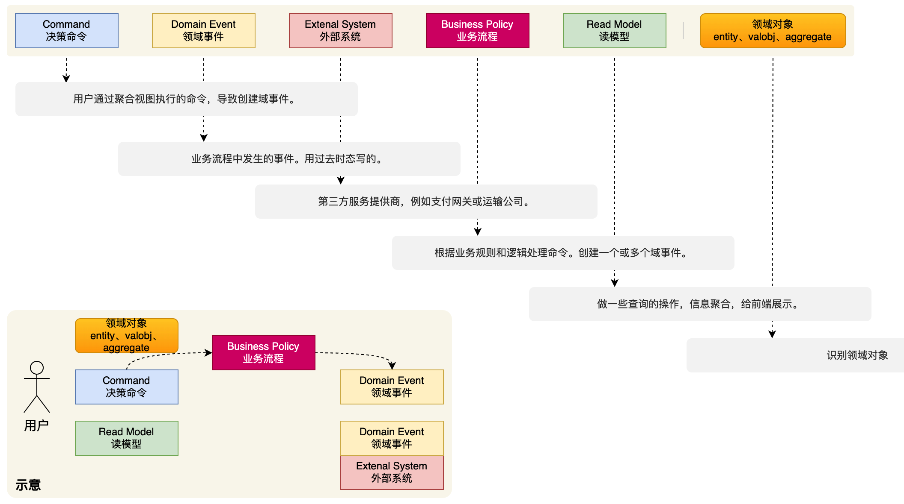

[DDD领域驱动设计理论｜得物技术领域驱动设计简称“DDD”，一套“知易行难”的方法论。同时我所工作的这些年，尤其在某大厂 - 掘金](https://juejin.cn/post/7371716397297139721?searchId=202503022149398C5C811F3D881B18269B)

## DDD是什么？

DDD 是一种软件设计方法。

DDD设计的目标是实现软件系统与业务需求的高度契合，提高开发效率和质量，同时也能更好地应对复杂性和变化性。它强调以业务为中心，通过深入领域知识和建立有效的领域模型，来驱动软件设计和开发的整个过程。

领域驱动设计是为了解决复杂软件设计的一种优秀方案，它把所有的业务规则、定义、范围、知识等抽象成了一个大的概念，叫做**领域**。比如用户支付的业务场景，叫做交易域；平台提供售后等服务叫做服务域（或客服域），还有其他诸如金融域，人效域，物流域等。它应对复杂性的思想，总结下来既简单，又精炼，叫做“**分而治之**”。把最大化的领域（复杂问题）分为下层的一个个子域，同时每个子域又规定好边界和核心实体，通过一系列的拆分、归类、衍生，最终找到最优解。

> **DDD vs MVC**

MVC架构其实很精粹，清晰，对于业务逻辑并不复杂，单一化的场景其实效率是很高的。但是随着业务的多变性和不断复杂化，MVC架构就会暴露以下问题：

1. MVC架构没有边界划分的概念和规范，在复杂的业务场景下会造成盘根交错的逻辑依赖，同时随着业务场景的不复杂化，代码意图会逐渐模糊，维护成本增加，对于系统的稳定性也会带来挑战。
2. MVC**仅反映软件架构的分层，不定义业务语义的抽象和表达**，对于业务知识的沉淀和复用性来说，不太友好。
3. MVC分割了数据和行为的表达，Model层（pojo）定义数据，Service层表述行为，会造成业务逻辑的首尾分离。

> **DDD的价值**

团队价值：

1. 统一语言
2. 清晰的边界定义：定义清晰的业务范围，避免边界纷争。
3. 面向业务建模
4. 代码直观表现设计

个人价值：

1. 提升全局视野
2. 提升业务sense

> **DDD的缺点**

1. 逻辑相对简单的业务和产品，用传统的MVC架构会更适合，构建也更快速。

2. 非业务形态产品和应用并不适合，比如bigdata。这类应用和业务专注于数据层的交互和适配，并无强业务语义类诉求，而DDD最关键的一部分就是业务领域的抽象和包装，切记，它解决的是负责业务问题。

> **DDD 的核心原则包括**

- **领域为中心**：以业务领域为核心，所有设计围绕领域模型展开。
- **通用语言**：开发团队与领域专家共同定义一套无歧义的术语，贯穿设计、代码和文档。
- **分层架构**：分离技术实现与业务逻辑，典型分层包括用户界面层、应用层（协调用例）、领域层（核心业务规则）、基础设施层（技术实现）。
- **战略设计**：通过限界上下文（Bounded Context）划分领域边界，明确上下文映射关系（如防腐层、共享内核等）。
- **战术设计**：使用领域模型元素（实体、值对象、聚合、领域服务、领域事件等）实现业务逻辑。
- **持续演进**：模型随业务需求迭代，通过重构保持灵活性。

## 核心概念

DDD这套方法论的一个完整设计流程：核心在于战略设计和战术设计

1. 首先第一步，根据业务诉求，**提炼出整体的业务流程**，同时拆解出里面的关键事件，角色，参与者等核心实例。整个拆解和梳理的方法论，目前业界有一些比较成熟的，比如事件风暴，四色建模法等。

2. 提炼完整个业务流程后，进入战略设计阶段，这个阶段主要是从全局和顶层的视角，**把整个业务语义转换为结构化分层**。通过领域和子域的划分，同时结合通用域、支撑域、限界上下文等设计，分解问题复杂度，其实就是前面说到的“分而治之”的思想。

3. 接下来就会到具体的战术设计阶段，通过前面的战略设计阶段，已经把整个领域、边界、上下文等关键模块都梳理完成，现在就是**从各个域中再次拆解更细粒度的模块**，去指导最终的编码实现，这些更细粒度的模块包括实体、聚合、聚合根等。

4. 最后就到了编码实现阶段，DDD有一个关键价值，叫做 **“设计即实现”** ，所以在战术阶段的设计，理论上是可以直接作用于代码的分层结构，如果架构和战术阶段有出入，说明之前的设计有问题，可以复盘重新推演。

**战略设计**

战略设计关注的是在整个业务和系统架构层面上进行设计，主要涉及如何识别、划分和组织领域。其重点是理解业务环境、领域边界、子领域和这些子领域之间的关系。它通常在项目前期的需求分析阶段应用，帮助团队成员达成对业务的共识。

**战术设计**

战术设计关注的是具体的技术实现层面，涉及到如何在每个界限上下文内具体实现领域模型。它包括设计实体、值对象、聚合、领域服务等。它在战略设计完成后的详细设计和开发阶段应用。

> **战略设计**主要解决的是“什么”的问题：我们在做什么，业务的哪些部分需要关注，以及如何划分边界。
>
> **战术设计**则关注“怎么做”：在这些领域中，我们如何具体实现领域模型和功能。

**领域**

领域（Domain）是指业务问题的特定领域范围，它涉及到特定业务的规则、概念、业务流程等。领域是对业务问题进行分解和组织的基本单位。

**通用语言**

通用语言是领域驱动设计中团队成员（业务人员、开发人员、测试人员等）在交流和协作时使用的统一、无歧义的语言，基于业务领域概念和规则构建。使用通用语言能消除沟通障碍，确保团队对业务需求理解一致，提升协作效率和质量。

**子域**

子域（Subdomain）是指在一个大的领域中划分出的相对独立的子领域，它通常代表一个独立的业务领域，具有特定的业务逻辑和功能需求。子域可以是整个系统的一个功能模块，也可以是一个独立的业务流程。

**通用域**

通用域（Generic Domain）是指与特定业务领域无关的通用功能，它是在整个领域中被多个子域所共享和复用的功能。通用域包括一些通用的服务、工具、组件等，用于支持多个子域的实现。

**支撑域**

支撑域（Supporting Domain）指的是与核心业务的实现和发展密切相关的非业务功能。这些支撑域可以包括安全认证、用户管理、日志记录等在整个系统中被多个子域所共享和使用的基础设施功能。支撑域和通用域概念上有些类似，区分他们的标准简单归纳下的话，支撑域是由外域提供的能力，通用域是本域提供。

**限界上下文**

限界上下文是领域模型中一个明确的边界，边界内的模型术语、规则和逻辑保持一致，且独立于其他上下文。

**实体**

实体是具有唯一标识的对象，其标识在对象的整个生命周期内保持不变。实体的状态可以改变，但标识不变，通过标识可以跟踪实体的变化。

1. **贫血模型**：贫血模型指的是实体主要包含属性（字段）而缺乏业务逻辑和行为。业务逻辑通常被放置在服务（Service）层中。
2. **充血模型**：充血模型与贫血模型相反，实体不仅包含数据，还包含处理这些数据的业务逻辑。实体通常会有丰富的方法来操作其内部状态。

> 更喜欢使用**贫血+充血的混合模型**（或者叫充血模型的简化版），因为这里涉及到一个标准的建立问题，如果只用充血模型的话，哪些行为和逻辑该下方到接口服务层，哪些又该收拢到实体中，这里面每个人的理念不一样。而我的标准是，**涉及到持久层和复杂行为都下放到服务层，简单行为放到实体模型中**。这样有个好处，随着业务的发展，如果只用充血模型，你的实体会越来越臃肿；如果只有贫血模型，自身又太单薄。所以一部分行为下放到服务层，我可以更细粒度的拆分服务接口，保证更优良的边界和代码可读性，同时也保证了模型自身的健壮性。

**值对象**

值对象没有唯一标识，它描述的是一个不变的概念整体，主要通过属性值来进行区分和比较。值对象一旦创建，其属性值通常不会改变。比如地址信息，手机号码，标签属性等。

**聚合**

聚合是一组相关对象的集合，这些对象在某种业务上是紧密相关的，并且在某些操作中需要作为一个整体来处理。聚合确保了该集合内部的业务规则和不变量的一致性。通常，聚合包含多个实体（Entity）和值对象（Value Object），它们共同代表一个一致的概念。

**聚合根**

聚合根是聚合中唯一的入口点，它是聚合的代表，并且负责管理聚合内部的其他对象。任何外部对象对聚合的访问只能通过聚合根进行。聚合根确保了聚合内一致性和完整性，保证通过聚合根进行的所有操作都不会违反业务规则。

**仓储**

用于封装数据访问逻辑，使应用程序能够以面向对象的方式处理持久性数据，提供了持久化和查询操作。仓库将领域模型与数据存储层分离，使得领域模型可以专注于业务逻辑。

**领域模型**

领域模型是对业务领域的抽象，旨在捕捉业务需求和规则。它通常包括实体、值对象和聚合。

**领域服务**

用于表示在业务领域中，无法归类为实体或值对象的操作。领域服务允许将业务逻辑与数据模型分离。用途主要包括处理跨多个实体的业务逻辑、封装复杂业务规则以及处理与外部系统的交互。

**领域事件**

代表领域中的发生的重要事件，可以用于通知其他领域对象或跨限界上下文进行解耦和协作。

## 领域建模

**事件风暴建模**

事件风暴通过团队协作的方式，以用户的视角来讨论和探索整个业务流程。参与者将自己的理解和知识通过贴在墙上的便利贴上表达出来，核心会围绕着事件去编排整个业务流程。

先从业务事件入手，找出引发这些事件的命令，进而确定产生这些命令的聚合根。例如在电商系统中，“订单创建”是一个事件，对应的命令可能是“用户提交订单”，相关的聚合根可能是“订单”。

**四色建模**

四色建模，基于业务角色和时间维度，将元素分为时刻/时间段、角色、描述、事实四类进行建模。用一句话来概括四色原型就是：**一个什么样的人或物品以某种角色在某个时刻或某段时间内参与某个活动**。

DDD 的建模过程，是以一个用户为起点，通过行为命令，发起行为动作，串联整个业务。而这个用户的起点最初来自于用例图的分析。用例图是用户与系统交互的最简表示形式，展现了用户和与他相关的用例之间的关系。通过用例图，我们可以分析出所有的行为动作。

在 DDD 中用于完成用户的行为命令和动作分析的过程，是一个四色建模的过程，也称作风暴模型。

通过寻找领域事件，发起事件命令，完成领域事件的过程，完成 DDD 工程建模。

- 蓝色 - 决策命令，是用户发起的行为动作，如：开始签到、开始抽奖、查看额度等。
- 黄色 - 领域事件，过去时态描述。如：签到完成、抽奖完成、奖品发放完成。它所阐述的都是这个领域要完成的终态。
- 粉色 - 外部系统，如你的系统需要调用外部的接口完成流程。
- 红色 - 业务流程，用于串联决策命令到领域事件，所实现的业务流程。一些简单的场景则直接由决策命令到领域事件就可以了。
- 绿色 - 只读模型，做一些读取数据的动作，没有写库的操作。
- 棕色 - 领域对象，每个决策命令的发起，都是含有一个对应的领域对象。

## 分层架构

- **接口定义 - api**：因为微服务中引用的 RPC 需要对外提供接口的描述信息，也就是调用方在使用的时候，需要引入 Jar 包，让调用方好能依赖接口的定义做代理。
- **应用封装 - app**：这是应用启动和配置的一层，如一些 aop 切面或者 config 配置，以及打包镜像都是在这一层处理。你可以把它理解为专门为了启动服务而存在的。
- **领域封装 - domain**：包含业务逻辑和领域模型，负责处理与业务相关的规则和行为。领域层是DDD的核心，包含实体（Entities）、值对象（Value Objects）、聚合（Aggregates）和领域服务（Domain Services）。
- **仓储服务 - infrastructure**：提供技术支撑，如持久化机制、外部服务的调用、消息队列等。基础设施层与其他层进行通信，负责平台相关的细节和实现。基础层依赖于 domain 领域层，因为在 domain 层定义了仓储接口需要在基础层实现，这是依赖倒置的一种设计方式。
- **领域封装 - trigger**：触发器层，一般也被叫做 adapter 适配器层。负责与用户交互，接收用户输入并展示输出。通常包括用户界面（UI）和应用程序编程接口（API）。
- **类型定义 - types**：通用类型定义层，在我们的系统开发中，会有很多类型的定义，包括；基本的 Response、Constants 和枚举。它会被其他的层进行引用使用。
- **领域编排【可选】 - case**：领域编排层，一般对于较大且复杂的的项目，为了更好的防腐和提供通用的服务，一般会添加 case/application 层，用于对 domain 领域的逻辑进行封装组合处理。

## DDD面试题

### 请解释下什么是 DDD 领域驱动设计？

DDD是一种软件设计方法，它的目标是实现软件系统和业务需求的高度契合，更好的应对复杂性和变化性，mvc仅反映软件架构上了分层，不包含业务语义，并且随着业务场景的复杂化，service层臃肿杂乱、代码意图模糊，DDD将复杂的业务逻辑划分为一个个领域，分而治之，代码即文档。

DDD包含多个关键元素，如领域可细分为核心、支撑和通用子领域；实体有唯一标识，具备状态和行为；值对象用于描述特征且无唯一标识；聚合由相关实体和值对象组成，有根实体；领域服务封装复杂业务逻辑；仓储负责实体的持久化和检索。

采用DDD能提高软件质量，促进团队沟通，使软件更好应对业务变化。

### DDD中的分层架构通常包括哪些层次?

DDD中的分层架构通常包括用户界面层、应用层、领域层和基础设施层。用户界面层负责与用户交互，接收请求并展示结果；应用层协调领域层的业务逻辑，处理业务用例流程；领域层是业务核心，包含业务规则、领域模型和领域服务；基础设施层提供底层的技术支持，如数据库访问、消息队列等。

### DDD 中的实体和值对象有什么区别？

在 DDD 中，实体和值对象有明显区别。实体具有唯一标识，其标识在整个生命周期内保持不变，状态可以改变，有独立的生命周期，适用于需要跟踪对象状态变化、进行业务操作的场景。例如电商系统中的订单，订单号是其唯一标识，订单状态可以改变，并且订单有自己从创建到完成的生命周期。

值对象没有唯一标识，通过属性值来区分，通常是不可变的，没有独立的生命周期，依赖于关联的实体，适用于描述某个概念、特征或作为实体的属性。比如订单中的金额值对象，通过金额数值和货币类型区分，创建后属性不可变，随着订单的存在而存在。

### DDD 中的贫血模型和充血模型有什么区别？

在 DDD 中，贫血模型和充血模型主要有以下区别： 

业务逻辑分布方面，贫血模型的实体对象仅作为数据载体，只包含数据字段和对应的访问方法，业务逻辑被放在专门的服务类中；而充血模型的实体对象不仅包含数据，还包含与该实体相关的业务逻辑。 

设计原则遵循度上，贫血模型违背了面向对象的封装原则，将数据和行为分离；充血模型符合面向对象编程思想，强调对象的封装性和内聚性。 

适用场景不同，贫血模型适合简单业务场景，其结构清晰，易于理解和测试；充血模型适合复杂业务场景，能提高代码的可维护性和可扩展性。 

代码复杂度上，贫血模型的实体类简单，但业务逻辑分散；充血模型的实体类可能较复杂，但业务逻辑集中。

### DDD 中的限界上下文是什么？有什么用？如何识别并定义？

限界上下文是一个显式的边界，在这个边界内，特定的领域模型有其明确的含义和规则。在不同的限界上下文中，相同的术语可能有不同的含义。例如，“订单”在电商的“购物上下文”和“物流上下文”中，其关注的属性和操作可能不同。

它的作用主要体现在以下几个方面：

1. 它能够划分业务边界，把复杂的业务系统拆分成多个相对独立的子领域，便于理解和管理业务逻辑；
2. 有利于促进团队协作，不同团队可以独立负责不同的限界上下文开发；
3. 有助于建立统一语言，减少因术语歧义带来的沟通问题；
4. 能提高系统的可维护性和扩展性，将系统修改和扩展的影响范围控制在特定上下文中。

识别限界上下文可以通过业务流程分析、组织架构划分和业务目标与职责分析等方法，找出具有相对独立业务逻辑的部分。

定义限界上下文时，要明确上下文的边界、定义上下文接口，并确定上下文内的领域模型。同时，要注意避免上下文重叠，保持上下文的独立性。

### DDD 的四层领域模型是怎样的？包含哪些基础概念？

DDD的四层领域模型包括用户接口层、应用层、领域层和基础设施层。用户接口层负责与用户交互；应用层协调领域层的业务逻辑；领域层是核心，包含业务的核心逻辑和规则；基础设施层提供底层的技术支持。

其基础概念有实体，具有唯一标识的对象；值对象，描述事物特征且无唯一标识；聚合，一组相关实体和值对象的集合；领域服务，处理不属于特定实体或值对象的业务逻辑；仓储，提供领域对象的持久化和检索操作。

### DDD中的“战略设计”和“战术设计”分别指的是什么？它们在项目中的应用时机是怎样的？

战略设计是从宏观层面出发，关注业务战略和组织架构，主要涉及如何识别、划分和组织领域。它通常在项目前期的需求分析阶段应用，帮助团队成员达成对业务的共识。

战术设计侧重于具体的代码实现，包含实体、值对象、聚合、仓库、服务等元素，用于将战略设计的业务概念转化为软件代码。它在战略设计完成后的详细设计和开发阶段应用。

### DDD的主要组成部分是什么?

DDD主要由战略设计和战术设计两部分组成。战略设计部分包括领域、子域和限界上下文，领域是业务范围，子域分为核心子域、支撑子域和通用子域，限界上下文定义了领域模型的边界。战术设计部分包括实体、值对象、聚合、仓库和服务，实体有唯一标识且状态会变化，值对象用于描述特征，聚合是相关实体和值对象的集合且有根实体，仓库负责实体的持久化和查询，服务处理不属于单个实体或值对象的操作。

### 为什么需要域驱动设计（DDD）？

1. 将业务逻辑封装在领域模型中，提高了代码的可维护性，使业务逻辑集中，修改时不影响其他部分。
2. 通过划分不同的子领域和限界上下文，增强了系统的可扩展性，便于添加新功能。
3. 提供了通用语言和模型，促进了团队协作，减少沟通成本。
4. 对于复杂业务，通过抽象和建模将问题分解，将复杂的业务问题分解为多个相对简单的子问题，从而降低了开发的难度。

### 什么是聚合和聚合根?

聚合是一组相关对象的集合，这些对象之间存在紧密的业务关联，它们共同完成一个特定的业务功能或满足一个特定的业务规则。聚合将相关对象封装在一起，减少了对象之间的依赖和耦合，提高了系统的可维护性和可扩展性。

聚合根是聚合中的一个特殊对象，它是聚合的入口点，也是外部访问聚合的唯一途径。聚合根负责管理聚合内部的对象，维护聚合的完整性和一致性。外部对象只能通过聚合根来访问聚合内部的对象，而不能直接访问聚合内部的其他对象，从而保证了聚合的封装性和一致性。

### 什么是领域驱动设计中的 CQRS 模式？

CQRS 即 Command Query Responsibility Segregation，命令查询职责分离模式。

它将系统的操作分为命令（Command）和查询（Query）两部分，使用不同的模型来处理这两种操作。命令用于改变系统的状态，如创建、更新、删除数据；查询用于读取系统的状态，获取数据。

CQRS 模式的优点是分离了读操作和写操作的职责，使代码更加清晰，易于维护和扩展；可以分别对查询端和命令端进行优化，提高系统的性能和可扩展性。缺点是增加了系统的复杂度和开发成本，并且可能会导致查询端和命令端的数据不一致，需要额外的机制来保证数据的最终一致性。

CQRS 模式适用于复杂业务系统、高并发系统以及对数据一致性要求较低的场景。

### 你如何看待DDD与微服务架构之间的关系？它们如何相互补充？

- DDD是一种软件开发方法论，聚焦于领域模型的构建。它将业务需求抽象为领域模型，包含限界上下文、实体、值对象、聚合根等核心概念，通过对业务领域的深入理解和建模，解决复杂业务问题。
- 微服务架构是一种软件架构风格，将应用拆分成多个小型、自治的服务。每个服务围绕特定业务能力构建，可独立开发、部署和扩展，服务间通过轻量级通信机制交互。

DDD与微服务架构是相辅相成的关系。DDD为微服务架构的设计**提供了理论指导和方法支持**，通过限界上下文等概念帮助合理划分微服务的边界，使微服务的职责更加清晰。而微服务架构为DDD的实践提供了具体的落地环境，将DDD构建的领域模型以独立服务的形式实现。

### 你能否举例说明DDD框架中的某个特性是如何帮助你解决具体业务问题的？

以聚合特性为例解决库存管理问题

- **业务问题**：在电商系统中，库存管理是一个复杂的业务场景。商品的库存数量需要在多个操作中保持一致，例如下单、取消订单、补货等。如果处理不当，可能会导致超卖或库存数据不一致的问题。
- **DDD特性应用**：使用聚合特性来封装商品和库存的业务逻辑。将商品和其对应的库存作为一个聚合根，聚合根负责管理内部实体和值对象的状态变化，确保数据的一致性。

### 你认为DDD框架相比传统开发方法有哪些优势？

DDD框架相比传统开发方法具有多方面优势：

1. 能更好地理解和表达业务，通过领域建模使代码更贴近业务，提高可读性和可维护性。
2. 实现了高内聚低耦合，限界上下文的划分让系统结构更清晰，便于扩展和维护。
3. 支持团队协作，不同职责的团队成员能依据领域模型高效合作。
4. 它适应业务变化的能力强，能快速响应业务需求的调整。
5. 有助于提高软件质量，确保软件的正确性和完整性。

### 在 DDD 中，如何处理跨多个实体的复杂业务？

在DDD中处理跨多个实体的复杂业务可以采用以下方法：

- **使用聚合**：将相关实体封装在一个聚合中，通过聚合根来协调内部实体的行为，保证聚合内实体的一致性。适用于实体联系紧密的场景，但要注意避免聚合过于庞大。
- **引入领域服务**：当业务逻辑涉及多个聚合时，使用领域服务来协调不同聚合之间的操作，将复杂业务逻辑从实体中分离出来，提高代码的可维护性和可测试性。
- **使用事件驱动架构**：通过领域事件解耦实体和业务流程，提高系统的可扩展性和灵活性，适用于业务流程复杂、需要降低实体耦合度的场景。

### 在DDD中，如何识别和应用聚合的最佳实践？有没有遇到过聚合过大或过小的情况？你是如何处理的？

在DDD中，识别和应用聚合可遵循以下最佳实践：从业务相关性出发，将紧密关联的对象组成聚合；保证聚合内的事务一致性，一个事务只操作一个聚合；明确聚合边界，外部对象只能通过聚合根访问聚合内对象；尽量减少聚合间的依赖。

在实际项目中，可能会遇到聚合过大或过小的情况。聚合过大时，可根据业务功能和事务一致性原则拆分聚合；聚合过小时，可将相关的小聚合合并成一个大聚合。

### 在DDD项目中，你如何确定哪些逻辑应该放在领域模型中，哪些应该放在应用层或服务层？

各层主要职责：

- **领域模型**：封装业务实体的状态和行为，反映业务概念和规则，是业务逻辑的核心表达。
- **应用层**：负责接收用户请求，协调领域层和基础设施层的资源，实现具体业务用例。
- **服务层**
  - **领域服务**：处理单个领域内的复杂业务逻辑，当领域概念无法清晰归属某个实体时使用。
  - **应用服务**：处理跨领域的业务流程，协调多个领域服务完成业务操作。

（1）确定逻辑放在领域模型的依据

- **业务规则紧密相关**：如果逻辑是业务实体自身的规则，如订单的状态转换规则、商品的价格计算逻辑等，应放在领域模型中。这些规则是业务实体的固有属性，与实体的状态和行为紧密相连。
- **数据一致性维护**：当逻辑用于维护实体内部数据的一致性时，适合放在领域模型。例如，一个账户实体，在进行存款和取款操作时，需要保证账户余额的一致性，这些逻辑应封装在账户实体中。
- **可复用性**：具有高复用性的逻辑应放在领域模型。例如，某个业务规则在多个业务流程中都会用到，将其封装在领域模型中可以提高代码的复用性。

（2）确定逻辑放在应用层的依据

- **业务用例协调**：当逻辑是为了协调多个领域模型或领域服务完成一个具体的业务用例时，应放在应用层。例如，在一个电商系统中，处理用户下单的业务用例，需要协调订单、商品、库存等多个领域模型和服务，这个协调逻辑应放在应用层。
- **跨领域流程处理**：涉及多个领域的业务流程，如用户注册时同时创建用户账户、发送欢迎邮件、分配初始积分等，这些跨领域的流程逻辑应放在应用层。
- **用户请求处理**：直接处理用户请求的逻辑，如接收用户输入、验证输入参数等，通常放在应用层。

（3）确定逻辑放在服务层的依据

- 领域服务
  - **复杂业务逻辑**：当领域内的业务逻辑复杂，无法清晰归属某个实体时，使用领域服务。例如，在一个物流系统中，计算货物的运输成本，涉及多个因素，如重量、距离、运输方式等，这种复杂的计算逻辑可以放在领域服务中。
  - **多实体协作**：当逻辑需要多个实体协作完成时，适合放在领域服务。例如，在一个社交系统中，处理用户之间的好友关系，需要同时操作用户实体和好友关系实体，这个逻辑可以放在领域服务中。
- 应用服务
  - **跨领域协调**：处理跨领域的业务流程，如电商系统中，处理订单支付成功后，同时更新订单状态、减少库存、增加用户积分等跨领域的操作，应放在应用服务中。
  - **外部系统交互**：与外部系统交互的逻辑，如调用第三方支付接口、发送短信通知等，通常放在应用服务中。

（4）边界模糊时的处理原则

- 当逻辑归属不明确时，应优先考虑领域模型，尽量将逻辑封装在实体中。如果逻辑确实无法归属到某个实体，再考虑使用领域服务。如果涉及跨领域的操作，则放在应用层或应用服务中。

### 在你的项目中，你是如何应用DDD框架来指导设计和开发的？

在项目中应用DDD框架指导设计和开发，我主要从战略设计和战术设计两个层面入手。

在战略设计阶段，我会深入理解业务需求，将整个业务系统划分为多个子领域，并确定每个子领域的边界上下文，明确其职责和交互方式。

在战术设计阶段，我会根据业务规则和需求构建领域模型，识别实体、值对象和聚合，设计领域服务处理跨实体或聚合的业务逻辑。同时，我会按照DDD的架构分层，设计应用层和基础设施层，应用层负责协调领域层的操作，基础设施层提供数据持久化和消息通信等服务。

在开发实现过程中，我会按照DDD的架构分层组织代码，以领域模型为基础进行开发，先实现领域层的代码，再实现应用层和基础设施层的代码。并且，我会持续对领域模型进行优化，根据业务的发展和变化调整模型，同时对基础设施层的代码进行性能优化。

例如，在一个电商项目中，我将其划分为商品管理、订单管理、用户管理等子领域，确定了各个子领域的边界上下文。在订单管理子领域中，我构建了订单实体和订单项值对象，设计了订单领域服务处理订单创建、支付等业务逻辑。通过这种方式，提高了代码的可维护性和可扩展性，使系统能够更好地适应业务的变化。

### 如何在DDD中处理数据一致性问题?

DDD强调将业务逻辑封装在领域模型中，通过聚合、实体、值对象等概念来组织代码。不同的聚合可能会涉及不同的数据库事务，从而产生数据一致性问题。

在DDD中处理数据一致性问题可以采用多种方法。对于单个数据库操作，可使用本地事务保证一致性；涉及多个服务或数据库时，可采用分布式事务，如两阶段提交、三阶段提交或补偿事务。

事件驱动架构也是常用的方法，通过领域事件和消息队列实现最终一致性。当聚合状态变化时发布领域事件，其他服务订阅并处理。还可以结合缓存和重试机制，缓存常用数据，对可能失败的操作进行重试。
